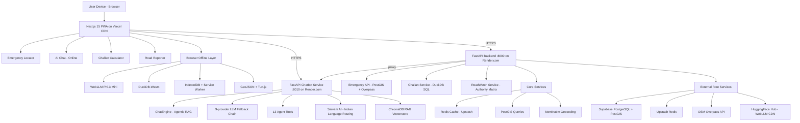
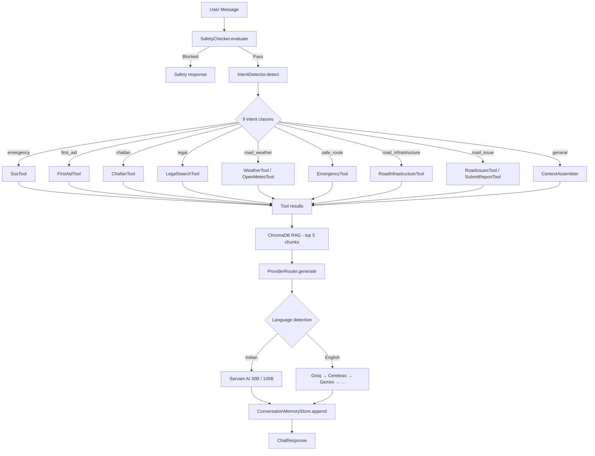
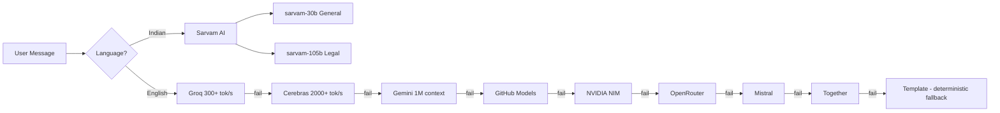
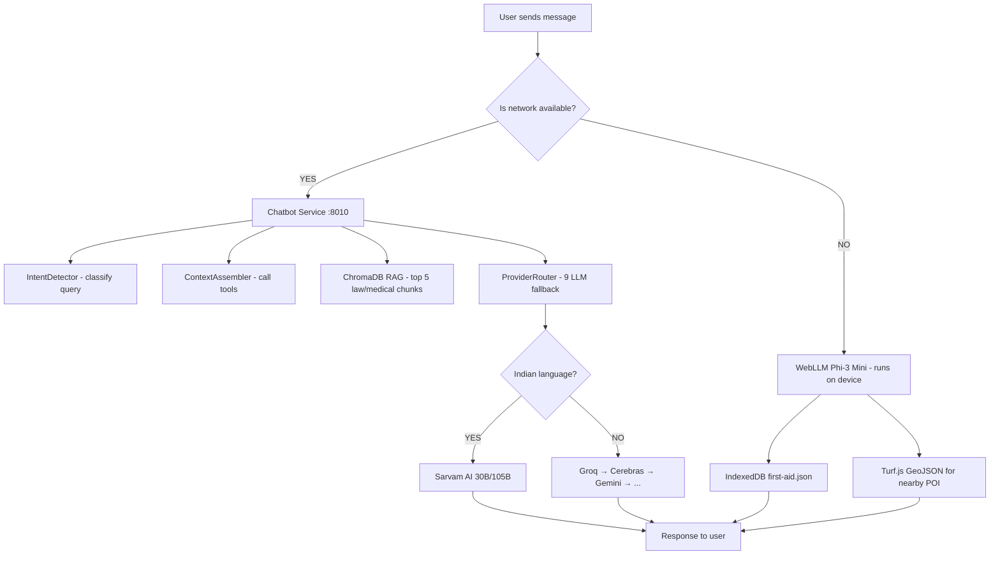
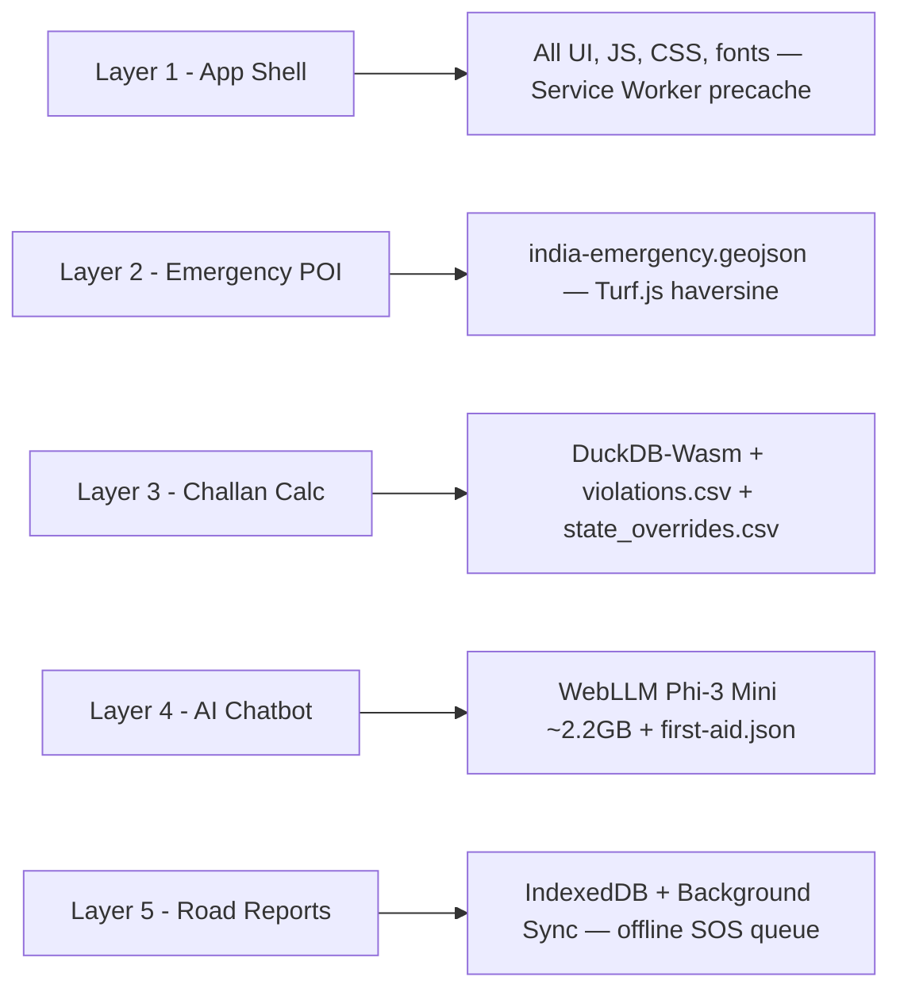
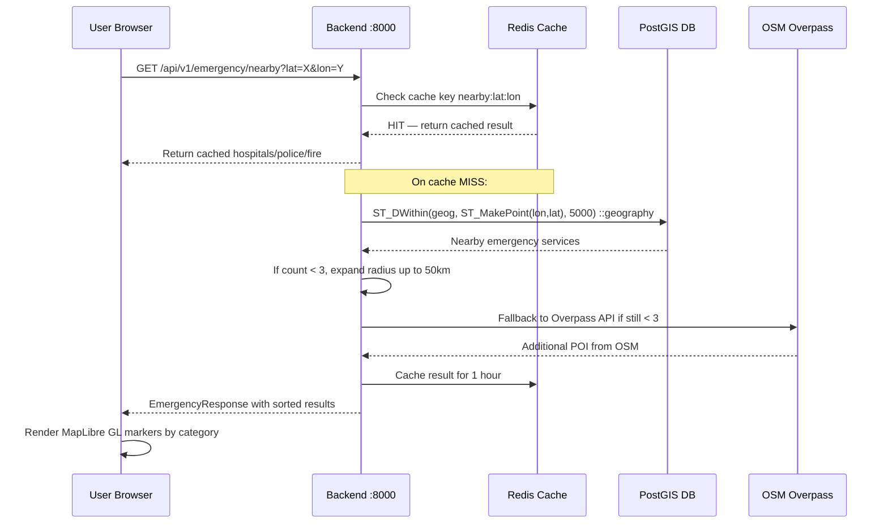
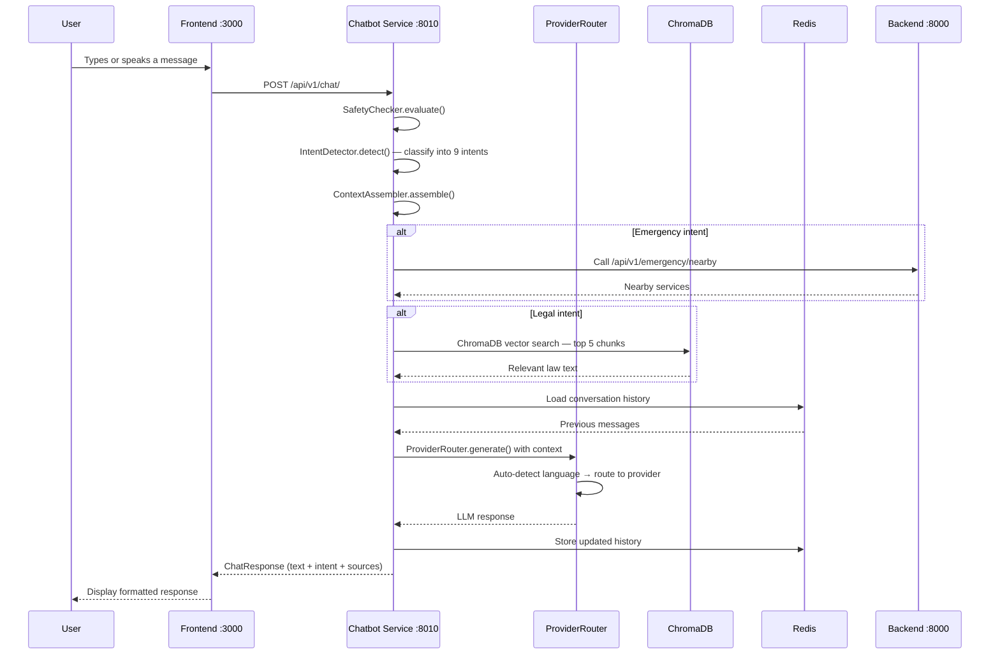
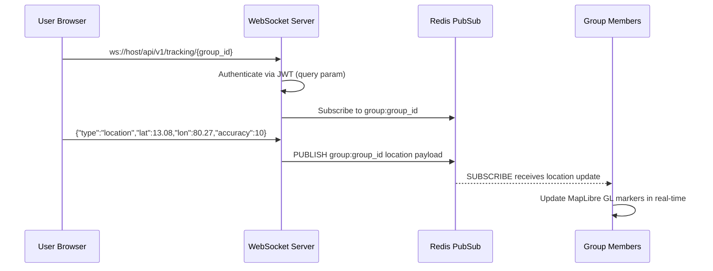
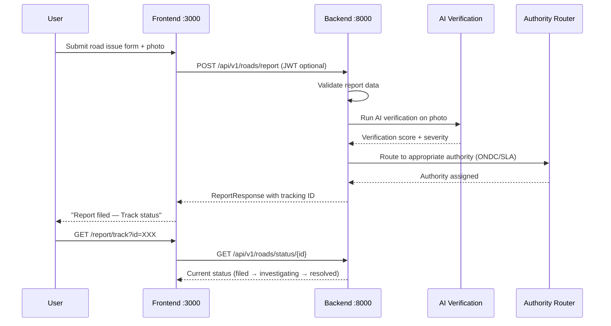

# SafeVixAI — Architecture v2.0

> **IIT Madras Road Safety Hackathon 2026** | Free & open-source (₹0 infra cost)

---

## Three-Service Architecture

```
┌─────────────────────────────────────────────────────────────┐
│  frontend/         Next.js 15 + React 19 + TypeScript PWA   │
│  Port 3000         MapLibre GL 5, WebLLM, DuckDB-Wasm       │
│                    Zustand state, Tailwind CSS, GSAP         │
└──────────────┬──────────────────────────┬───────────────────┘
               │ REST/WS (JWT Bearer)      │ REST (JWT Bearer)
┌──────────────▼─────────┐  ┌─────────────▼──────────────────┐
│  backend/              │  │  chatbot_service/              │
│  FastAPI :8000         │  │  FastAPI :8010                  │
│  PostgreSQL + PostGIS  │◄─┤  9-provider LLM fallback      │
│  Redis cache           │  │  ChromaDB RAG vectorstore       │
│  DuckDB (challan SQL)  │  │  13 agent tools                 │
│  Overpass/Nominatim    │  │  Redis conversation memory      │
│  WebSocket /tracking   │  │  Prompt injection defense       │
│  27 API route modules  │  │  IndicSeamless speech           │
└────────────────────────┘  └────────────────────────────────┘
```

| Service | Port | Tech Stack | Purpose |
|---------|------|------------|---------|
| **Backend** | 8000 | FastAPI, PostgreSQL + PostGIS, Redis, DuckDB | Emergency locator, challan calc, road reporting, geocoding, live tracking, auth |
| **Chatbot Service** | 8010 | FastAPI, ChromaDB, 9 LLM providers, Redis | Agentic RAG chatbot, Indian language AI, speech translation |
| **Frontend** | 3000 | Next.js 15, React 19, MapLibre GL 5, Tailwind CSS, GSAP | PWA UI, maps, offline AI (WebLLM), offline SQL (DuckDB-Wasm) |

> **Critical:** Backend and Chatbot Service have **separate** `.venv`, `.env`, `requirements.txt`, and `Dockerfile`. Never mix their dependencies.

---

## System Architecture Overview



---

## Backend (FastAPI :8000)

### 27 Route Modules

All routes live in `backend/api/v1/`:

| Module | Endpoints | Auth |
|--------|-----------|------|
| `admin.py` | Admin-only operations (system config, user management) | Admin secret |
| `analytics.py` | Heatmaps, summaries, ward-level analytics | JWT + Admin |
| `auth.py` | JWT login, signup, refresh, logout | Public / JWT |
| `authority.py` | Authority lookup and management | JWT |
| `challan.py` | Fine calculation (DuckDB-based query engine) | JWT / Public |
| `chat.py` | Chat proxy to chatbot service (`/api/v1/chat/`, `/api/v1/chat/stream`) | JWT |
| `circuit_breaker_api.py` | Circuit breaker status and reset | JWT |
| `citizen.py` | Citizen dashboard and service history | JWT |
| `civic_intel.py` | LGD codes, municipality info, administrative boundaries | Public |
| `command_center.py` | Emergency command center coordination | JWT |
| `emergency.py` | Emergency locator, SOS triggers, nearby services | JWT / Public |
| `field_workflow.py` | Field worker task management | JWT |
| `garage.py` | Vehicle/garage management | JWT |
| `geocode.py` | Geocoding forward/reverse (Nominatim, Photon) | JWT / Public |
| `live_tracking.py` | WebSocket-based live location tracking | JWT + WS |
| `mcp_server.py` | MCP protocol server (SSE + messages) for external agents | JWT |
| `officers.py` | Police/traffic officer management | JWT |
| `offline.py` | Offline data sync bundles | JWT |
| `public.py` | Unauthenticated public endpoints | None |
| `roadwatch.py` | Road issue reporting, photo uploads, status tracking | JWT Optional |
| `routing.py` | Route calculation, safe routing suggestions | JWT |
| `tracking.py` | Location tracking session CRUD | JWT |
| `user.py` | User profile management | JWT |
| `wards.py` | Ward boundary and metadata management | JWT |
| `waze_feed.py` | Waze community traffic/hazard data feed | JWT |
| `__init__.py` | Router aggregation | — |
| `deprecated/` | Deprecated endpoints (maintained for backward compat) | Varies |

### Middleware Stack (applied in order)

```
Request
  ├── IdempotencyMiddleware        — Idempotency-Key header dedup
  ├── APIVersioningMiddleware       — Accept header / URL prefix version routing
  ├── SecurityHeadersMiddleware     — HSTS, CSP, X-Frame-Options, X-Content-Type-Options
  ├── RequestIDMiddleware           — X-Request-ID / X-Correlation-ID injection
  ├── PrometheusMetricsMiddleware   — Request count, latency, error metrics
  ├── CSRFMiddleware                — CSRF token validation for state-changing requests
  ├── TenantIsolationMiddleware     — Multi-tenant data boundary enforcement
  ├── AllowedHostsMiddleware        — Host header whitelist validation
  ├── QueryProfilerMiddleware       — Slow query logging and analysis
  ├── GeoJSONCompressionMiddleware  — Compress large GeoJSON responses
  ├── CORSCheckMiddleware           — CORS origin pre-validation
  ├── FastAPI CORSMiddleware        — Standard CORS headers
  └── ApiResponseMiddleware         — Uniform API envelope wrapping
Response
```

### 36 Service Modules

All services in `backend/services/`:

| Service Module | Purpose |
|----------------|---------|
| `emergency_locator.py` | Radius search via PostGIS `ST_DWithin`, Overpass fallback, caching |
| `challan_service.py` | DuckDB SQL fine calculation from violations CSV |
| `geocoding_service.py` | Nominatim/Photon forward/reverse geocoding |
| `overpass_service.py` | OSM Overpass API query builder + rate limiter |
| `routing_service.py` | Route calculation using OpenRouteService |
| `safe_routing.py` | Safety-weighted route scoring |
| `safe_spaces.py` | Safe space (well-lit, CCTV) identification |
| `roadwatch_service.py` | Road issue lifecycle management |
| `authority_router.py` | ONDC-compliant authority routing matrix |
| `llm_service.py` | LLM proxy for basic text generation |
| `local_emergency_catalog.py` | Local emergency contact database |
| `event_bus.py` | Internal pub/sub event bus |
| `sla_monitor.py` | Service level agreement compliance tracking |
| `escalation_predictor.py` | ML-based issue escalation prediction |
| `fine_prediction.py` | Fine amount prediction model |
| `fraud_detector.py` | Report/claim fraud detection |
| `report_classifier.py` | Road issue severity classification |
| `duplicate_detector.py` | Duplicate report deduplication |
| `complaint_lifecycle.py` | Complaint state machine (filed → investigating → resolved) |
| `garage_service.py` | Garage/vehicle CRUD + availability |
| `notification_service.py` | Push/in-app/email notification dispatch |
| `officer_route_optimizer.py` | Patrol route optimization |
| `workload_balancer.py` | Officer workload distribution |
| `ward_service.py` | Ward boundary and metadata operations |
| `streetlight_service.py` | Streetlight inventory and fault reporting |
| `data_retention.py` | Automated data lifecycle management |
| `geo_verifier.py` | Geographic coordinate sanity checks |
| `ai_verification.py` | ML-based photo/report authenticity verification |
| `osm_contributor.py` | Automated OSM data contribution |
| `civic_intel.py` | Civic intelligence data pipeline |
| `exceptions.py` | Custom exception definitions |
| `markdown_service.py` | Markdown rendering utilities |
| `report_service.py` | Report aggregation and export |
| `sos_service.py` | SOS alert broadcast |
| `tracking_service.py` | Location tracking session management |

### Core Config (pydantic-settings)

| Variable | Required | Notes |
|----------|----------|-------|
| `DATABASE_URL` | Yes | `postgresql+asyncpg://...` - auto-normalized from `postgres://` |
| `REDIS_URL` | No | Falls back to in-memory cache (dict) |
| `CHATBOT_SERVICE_URL` | Yes | Default: `http://localhost:8010/api/v1` |
| `ADMIN_SECRET` | Yes | Protects admin-only endpoints |
| `JWT_SECRET_KEY` | Yes | HS256 signing for JWT tokens |
| `JWT_ALGORITHM` | No | Default: `HS256` |
| `SUPABASE_JWT_SECRET` | No | For Supabase JWT validation |
| `SUPABASE_JWT_AUDIENCE` | No | Supabase JWT audience claim |
| `ALLOWED_HOSTS` | Yes | Comma-separated Host header whitelist |
| `SENTRY_DSN` | No | Optional Sentry error tracking |
| `OPENROUTESERVICE_API_KEY` | No | For routing; free tier available |
| `DATA_GOV_API_KEY` | No | Government data endpoints |
| `CORS_ORIGINS` | No | Comma-separated CORS allowed origins |

---

## Chatbot Service (FastAPI :8010)

### Agentic RAG Architecture



### 9-Provider LLM Fallback Chain



> Language detection is regex-based (Unicode script ranges for Devanagari, Tamil, Telugu, Kannada, Bengali, etc.) — no NLTK dependency.

### Indian Language Auto-Routing

- **Sarvam-30B** — General Indian language queries (Hindi, Tamil, Telugu, etc.)
- **Sarvam-105B** — Legal/challan queries in Indian languages (higher accuracy)
- If `SARVAM_API_KEY` is set → direct Sarvam API; otherwise falls back to `HF_TOKEN` via HuggingFace Inference API

### 13 Agent Tools

| Tool | Module | Purpose |
|------|--------|---------|
| **SosTool** | `tools/sos_tool.py` | Nearby emergency services via backend API |
| **EmergencyTool** | `tools/emergency_tool.py` | Emergency service phone/address lookup |
| **ChallanTool** | `tools/challan_tool.py` | Fine calculation via backend challan API |
| **LegalSearchTool** | `tools/legal_search_tool.py` | ChromaDB vector search (Motor Vehicles Act, MoRTH) |
| **FirstAidTool** | `tools/first_aid_tool.py` | Static JSON first-aid protocols |
| **WeatherTool** | `tools/weather_tool.py` | OpenWeather API current conditions |
| **OpenMeteoTool** | `tools/open_meteo.py` | Open-Meteo weather (visibility, precipitation) |
| **RoadInfrastructureTool** | `tools/road_infra_tool.py` | Road contractor data, budget info |
| **RoadIssuesTool** | `tools/road_issues_tool.py` | Community-reported road issues |
| **SubmitReportTool** | `tools/submit_report_tool.py` | Submit road damage reports |
| **GeocodingClient** | `tools/geocoding.py` | Photon/BigDataCloud geocoding |
| **DrugInfoTool** | `tools/drug_info.py` | Open FDA drug/medical information |
| **What3WordsTool** | `tools/what3words.py` | What3Words location resolution |

### Speech Translation

- `POST /speech/translate` — ASR + translation for 14 Indian languages
- `GET /speech/status` — Service health check
- `IndicSeamlessService` — Indian language ASR/TTS pipeline (IndicSeamless models)

---

## Frontend (Next.js 15 :3000)

### 28 Routes

```
/                          Landing / Home
/assistant                 AI chatbot assistant
/auth/*                    Authentication flow (callback, error)
/bystander                 Bystander mode — witness reporting
/challan                   Challan/fine calculator
/command-center            Emergency command center dashboard
/emergency                 Emergency locator
/emergency-card/[userId]   Shareable emergency QR card
/first-aid                 First-aid guide
/forgot-password           Password reset request
/guide                     Safety guide index
/guide/[slug]              Individual guide article
/landing                   Marketing landing page
/locator                   Nearby emergency services map
/login                     User login
/officer                   Officer dashboard
/offline                   Offline mode status/info
/privacy                   Privacy policy
/profile                   User profile (blood group, emergency contacts)
/report                    Report a road issue
/report/track              Track submitted report status
/reset-password            Password reset form
/settings                  App settings
/share-receive             Receive shared emergency card
/signup                    User registration
/sos                       SOS emergency trigger
/terms                     Terms of service
/track/[session_id]        Live tracking session view
/tracking                  Live tracking dashboard
```

### 52 Lib Modules

Key modules in `frontend/lib/`:

| Module | Purpose |
|--------|---------|
| `api.ts` | Axios client with JWT interceptor |
| `store.ts` | Zustand global state (GPS, services, AI mode, auth) |
| `swr-fetcher.ts` | 7 cached SWR hooks for data fetching |
| `duckdb-challan.ts` | DuckDB-Wasm offline challan calculation |
| `offline-ai.ts` | WebLLM Phi-3 Mini integration |
| `offline-sos-queue.ts` | IndexedDB-based SOS offline queue |
| `crash-detection.ts` | Accelerometer-based crash detection |
| `live-tracking.ts` | WebSocket live tracking client |
| `geolocation.ts` | GPS position tracking + permission management |
| `guest-auth.ts` | Anonymous UUID-based guest authentication |
| `languages.ts` | 14-language 4-code mapping (UI → recognition → speech → synthesis) |
| `public-env.ts` | Runtime environment variable access |
| `safety-constants.ts` | Safety configuration constants |
| `client-logger.ts` | Client-side structured logging |
| `utils.ts` | General utility functions |

### 91 Components (13 subdirectories)

```
components/
├── ui/               — shadcn/ui primitives (button, card, dialog, input, etc.)
├── maps/             — MapLibre GL map components (dynamic import, ssr: false)
├── auth/             — Login/signup forms, AuthGuard
├── chat/             — Chat interface, message bubbles, streaming text
├── crash/            — Crash detection overlay, CrashCountdown UI
├── dashboard/        — Citizen and officer dashboards
├── first-aid/        — First-aid step-by-step guides
├── guide/            — Safety guide cards and detail views
├── profile/          — User profile editor
├── report/           — Road issue report forms
├── search/           — Search suggestions, autocomplete
├── voice-input/      — VoiceInput component (14 Indian languages)
└── command-center/   — Emergency command center widgets
```

---

## Dual-Layer AI Architecture

Online RAG with multi-provider fallback when connected, full offline AI using WebLLM when not.



| Aspect | Online — Layer 1 | Offline — Layer 2 |
|--------|-----------------|-------------------|
| LLM | 9-provider chain (Groq primary) | WebLLM Phi-3-mini-4k (4-bit, 2.2GB) |
| Indian Languages | Sarvam AI (30B/105B) | English only |
| Runs on | Cloud (Groq/Gemini/etc.) | User's browser (WebGPU) |
| RAG | ChromaDB on chatbot service | None (static first-aid.json) |
| POI Search | PostGIS ST_DWithin | Turf.js haversine on GeoJSON |
| Challan | DuckDB SQL on backend | DuckDB-Wasm in browser |
| Cost | ₹0 (all free tiers) | ₹0 (local device compute) |

---

## 5-Layer Offline Architecture



---

## Data Flow: Emergency Locator



> **Note:** `ST_MakePoint` takes **longitude FIRST**, latitude second. Always use `::geography` (meters), never `::geometry` (degrees).

---

## Data Flow: AI Chatbot (Agentic RAG)



---

## Data Flow: Live Tracking



---

## Data Flow: RoadWatch (Road Issue Reporting)



---

## Monorepo Structure

```
SafeVixAI/
├── backend/                 FastAPI :8000
│   ├── main.py              App factory (create_app → lifespan → services)
│   ├── api/v1/              27 route modules
│   ├── core/                Config, database, redis, security, rate limiter
│   ├── services/            36 service modules
│   ├── models/              SQLAlchemy ORM + Pydantic schemas (single schemas.py)
│   ├── middleware/           Middleware stack (13 middleware classes)
│   ├── migrations/          Alembic (initial schema, 6 tables + PostGIS)
│   ├── scripts/             DB seeders + data transforms
│   └── data/                violations_seed.csv, state_overrides.csv, chroma_db/
│
├── chatbot_service/         FastAPI :8010
│   ├── main.py              App factory (create_app → lifespan → ChatEngine)
│   ├── agent/               ChatEngine graph, IntentDetector, SafetyChecker, ContextAssembler
│   ├── providers/           9 LLM providers + TemplateProvider + ProviderRouter
│   ├── rag/                 ChromaDB local vectorstore, Retriever, embeddings
│   ├── tools/               13 agent tools
│   ├── memory/              Redis conversation memory with session TTL
│   ├── services/            Speech translation (IndicSeamlessService)
│   └── data/                chroma_db/ (COMMITTED — never delete)
│
├── frontend/                Next.js 15 PWA
│   ├── app/                 28 routes + error.tsx
│   ├── components/          91 components across 13 subdirs
│   ├── lib/                 52+ modules
│   └── public/              manifest.json, theme-init.js, icons/, offline-data/
│
├── scripts/                 Root-level data pipeline + wiki automation
│   ├── app/                 3 DB seeders
│   └── data/                16 standalone fetchers/extractors
│
├── docs/                    18+ markdown docs + wiki/ (231 auto-generated API docs)
├── .github/workflows/       GitHub Actions CI/CD (8 workflows)
├── docker-compose.yml       5 services: postgres, redis, backend, chatbot, frontend
├── AGENTS.md                AI agent quick-reference
├── SETUP.md                 Full installation guide
└── README.md                Project overview
```

---

## Deployment

| Component | Platform | Notes |
|-----------|----------|-------|
| Frontend | Vercel | Auto-deploys from `main`; WASM support in `next.config.js` |
| Backend | Render.com | Free tier (512MB RAM); `render.yaml` at root |
| Chatbot Service | Render.com | Free tier (2GB RAM for torch); `chatbot_service/render.yaml` |
| Database | Supabase | PostgreSQL 16 + PostGIS; enable extension manually |
| Redis | Upstash | Serverless Redis; set `REDIS_URL` in both services |
| Docker (local) | docker-compose.yml | 5 services: postgres (PostGIS 16), redis 7, backend, chatbot, frontend |

### Infrastructure Cost: ₹0

All services use free tiers or open-source self-hosted alternatives:
- **Maps:** MapLibre GL (free, no API key) + OSM Overpass (free)
- **Geocoding:** Nominatim (free, with User-Agent header)
- **LLM APIs:** Groq, Cerebras, Gemini, GitHub Models, NVIDIA NIM, OpenRouter, Mistral, Together — all have free tiers
- **Database:** Supabase free tier (500MB, 1 CPU)
- **Redis:** Upstash free tier (256MB)
- **Compute:** Render.com + Vercel free tiers
- **WebLLM:** HuggingFace CDN (free)

---

## Key Design Decisions

| Decision | Rationale |
|----------|-----------|
| Two separate FastAPI services | Chatbot has heavy ML deps (torch ~2GB); backend stays lightweight |
| 9-provider LLM fallback | Zero downtime — if one API rate-limits, next takes over |
| Sarvam AI for Indian languages | Trained on 4 trillion Indic tokens; best Hindi/Tamil legal accuracy |
| DuckDB for challans (not LLM) | Deterministic SQL; LLMs hallucinate fine amounts |
| ChromaDB committed to git | Render cold-starts need pre-built vectorstore; rebuild takes 10 min |
| PostGIS over MongoDB | `ST_DWithin` with GIST index < 50ms; Mongo much slower for radius |
| MapLibre GL over Google Maps | Google Maps costs ₹; MapLibre is free and open source |
| Zustand over Redux | 90% less boilerplate; sufficient for this app's state |
| IndexedDB for user profile | Blood group never leaves device — privacy by architecture |
| 13-middleware middleware stack | Production-grade security, observability, and reliability |

---

## Safety Rules

- Any AI response about injuries **must** start with "Call 112 immediately" — enforced in `agent/safety_checker.py`
- Blood group, emergency contacts stored in IndexedDB only (never sent to server)
- Guest auth uses anonymous UUIDs — no PII required
- Prompt injection defense in chatbot safety checker

---

*Document version: 2.0 | IIT Madras Road Safety Hackathon 2026 | ₹0 Infrastructure*
