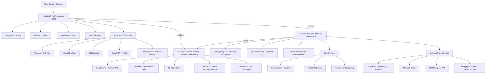
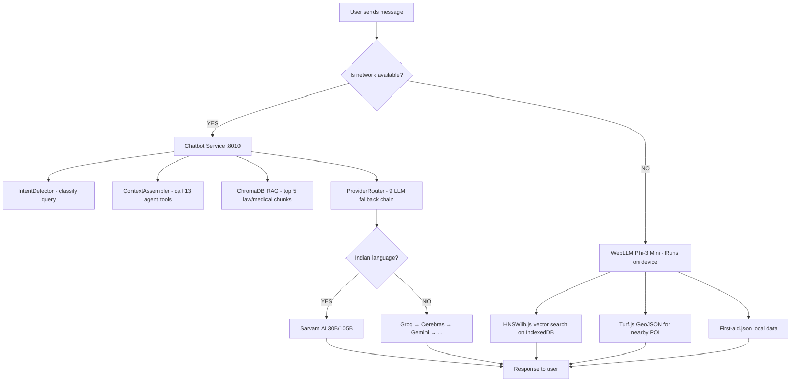
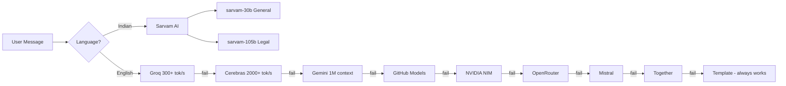
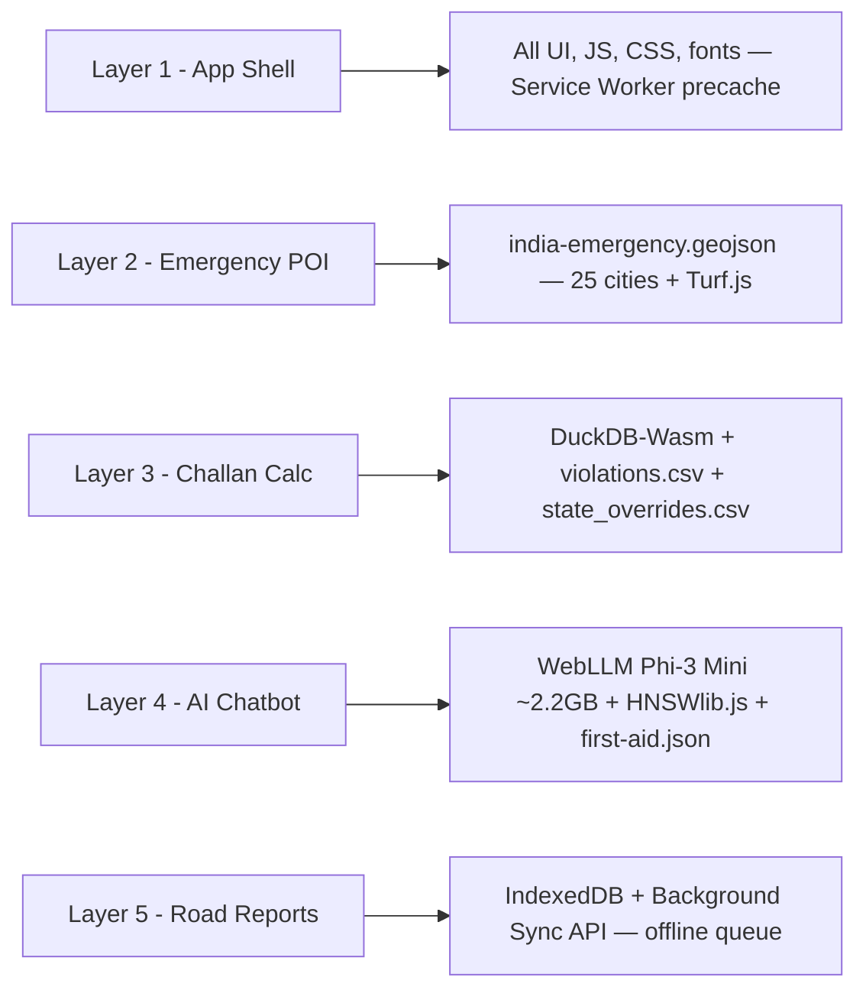

# SafeVixAI — Architecture

## System Architecture Overview



---

## Three-Service Architecture

SafeVixAI runs as **three independent services**:

| Service | Port | Tech | Purpose |
|---------|------|------|---------|
| **Backend** | 8000 | FastAPI + PostGIS + Redis | Emergency locator, challan calc, road reporting, geocoding |
| **Chatbot Service** | 8010 | FastAPI + ChromaDB + 9 LLMs | Agentic RAG chatbot, Indian language AI, speech |
| **Frontend** | 3000 | Next.js 15 + React 19 PWA | UI, maps (MapLibre GL), offline AI (WebLLM, DuckDB-Wasm) |

> **Critical:** Backend and Chatbot Service have **separate** `.venv`, `.env`, `requirements.txt`, and `Dockerfile`. Never mix their dependencies.

---

## Dual-Layer AI Architecture

Online RAG with multi-provider fallback when connected, full offline AI using WebLLM when not.



| Aspect | Online — Layer 1 | Offline — Layer 2 |
|---|---|---|
| LLM | 9-provider chain (Groq primary) | WebLLM Phi-3-mini-4k (4-bit) |
| Indian Languages | Sarvam AI (30B/105B) | English only |
| Runs on | Cloud (Groq/Gemini/etc.) | User's browser (WebGPU) |
| RAG | ChromaDB on chatbot service | HNSWlib.js in browser |
| POI Search | PostGIS ST_DWithin | Turf.js haversine on GeoJSON |
| Challan | DuckDB SQL on backend | DuckDB-Wasm in browser |
| Cost | ₹0 (all free tiers) | ₹0 (local device compute) |

---

## 9-provider LLM Fallback Chain



Language detection is regex-based (Unicode script ranges for Devanagari, Tamil, Telugu, Kannada, Bengali, etc.) — no NLTK dependency needed.

---

## 5-Layer Offline Architecture



---

## Data Flow: Emergency Locator


---

## Data Flow: AI Chatbot (Agentic RAG)


---

## Monorepo Folder Structure

```
SafeVixAI/
├── backend/              FastAPI Python 3.11 — port 8000
├── chatbot_service/      FastAPI Agentic RAG Chatbot — port 8010
├── frontend/             Next.js 15 + React 19 TypeScript PWA — port 3000
├── docs/                 Technical documentation (18 files)
├── chatbot_docs/         Chatbot-specific documentation (15 files)
├── notebooks/            5 Colab notebooks (YOLO, ChromaDB, Accidents, Roads, Risk)
├── scripts/              Root-level data pipeline scripts
├── docker-compose.yml    5 services: postgres, redis, backend, chatbot, frontend
├── AGENTS.md             AI agent quick-reference
├── SETUP.md              Full installation guide
├── README.md             Project overview
└── .github/workflows/    GitHub Actions CI/CD
```

---

*Document version: 2.0 | IIT Madras Road Safety Hackathon 2026*
