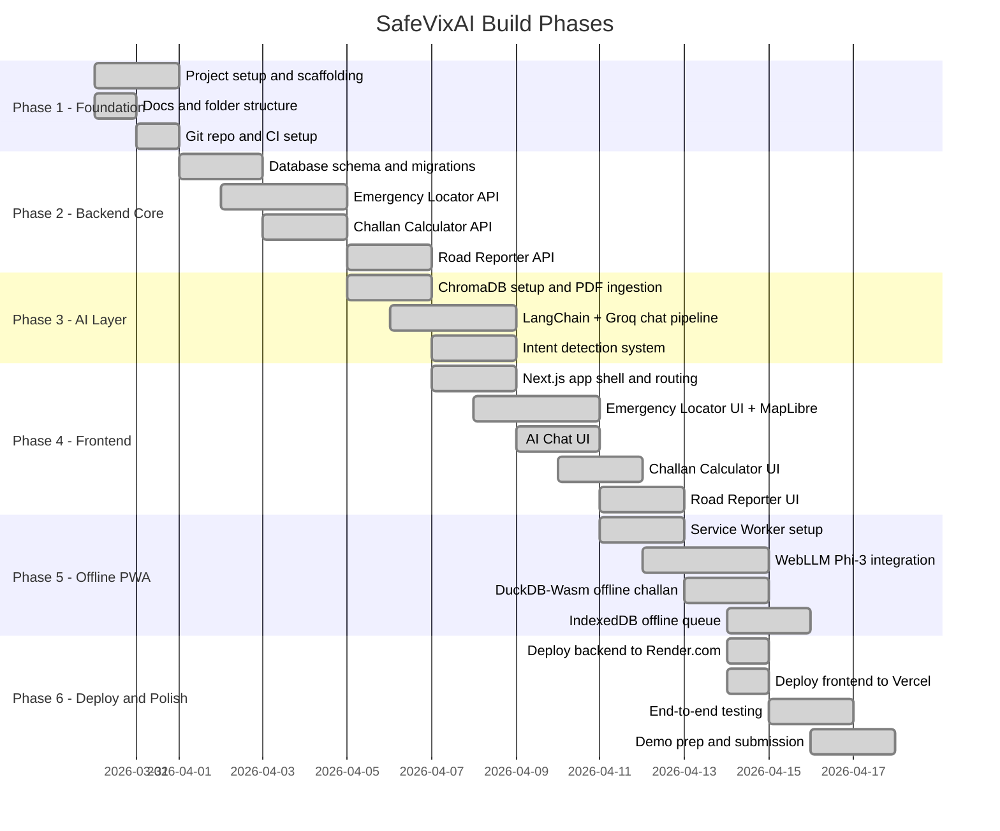

# SafeVixAI - Roadmap

Build phases for the IIT Madras Road Safety Hackathon 2026 submission.

---

## Phase Overview

---

## Phase 1 - Foundation (Done)

**Goal:** Project structure, documentation, Git setup.

- [x] Create monorepo structure (backend/, frontend/, docs/)
- [x] Write all documentation (Agent.md, PRD, Architecture, API, DB, etc.)
- [x] requirements.txt and package.json with pinned versions
- [x] .gitignore, README.md, SETUP.md
- [x] GitHub repo created and initial push done
- [x] CI/CD workflow stubs (.github/workflows/backend.yml, chatbot.yml, frontend.yml, etc.)

---

## Phase 2 - Backend Core

**Goal:** All 4 API modules working with real data.

- [x] Set up Supabase project and enable PostGIS + pg_trgm
- [x] Run Alembic migrations (create all 6 tables)
- [x] Seed traffic violations data (seed_violations.py)
- [x] Seed emergency services for 25 cities from OSM (seed_emergency.py)
- [x] Emergency Locator API - ST_DWithin + Overpass fallback
- [x] Geocoding API - Nominatim reverse geocode
- [x] Challan Calculator API - DuckDB SQL + state overrides
- [x] Road Reporter API - submit issue, route to authority
- [x] Set up Upstash Redis and connect cache client
- [x] Write tests for all endpoints (1365/1365 passing)

**Key files:**
- `backend/api/v1/emergency.py`
- `backend/api/v1/challan.py`
- `backend/api/v1/roadwatch.py`
- `backend/services/overpass_service.py`
- `backend/services/challan_service.py`
- `backend/services/authority_router.py`

---

## Phase 3 - AI Layer

**Goal:** RAG chatbot working with 9-provider fallback + ChromaDB.

- [x] Download 3 PDFs (MV Act 1988, MV Amendment 2019, WHO Trauma)
- [x] Run build_vectorstore.py to index PDFs into ChromaDB
- [x] RAG chain with ChromaDB MMR retrieval
- [x] Groq llama3-70b-8192 integration
- [x] 9-provider fallback chain: Groq→Cerebras→Gemini→GitHub→NVIDIA→OpenRouter→Mistral→Together→Template
- [x] Intent detection system (9 intent labels)
- [x] Chat history in Redis per session
- [x] Chat API endpoint - POST /api/v1/chat/
- [x] Chat stream SSE endpoint - POST /api/v1/chat/stream
- [x] Safety checker (7-layer defense)
- [x] Conversation summarization
- [x] Multi-turn intent refinement
- [x] Test RAG accuracy on sample queries (892/892 tests passing, 95% coverage)

**Key files:**
- `chatbot_service/providers/router.py`
- `chatbot_service/agent/graph.py`
- `chatbot_service/data/build_vectorstore.py`
- `chatbot_service/agent/safety_checker.py`
- `chatbot_service/agent/intent_detector.py`

---

## Phase 3b - External Integrations (API Expansion)

**Goal:** Integrate rich external data sources to power backend logic and fallback workflows.

- [x] Integrate **Open-Meteo API** (Free) for visibility and precipitation logic.
- [x] Integrate **Photon & BigDataCloud** (Free) for robust zero-key frontend geocoding.
- [x] Setup **OSRM** for driving navigation and **ip-api** for dynamic state detection.
- [x] Connect **What3Words** (Key) and **OpenCage** (Key) fallbacks for critical SOS geolocation.
- [x] Connect **Open FDA** medical API tools for the first-aid persona.
- [x] Create **Healthsites.io** manual seeder script for the PostGIS backend.

---

## Phase 4 - Frontend

**Goal:** All 4 modules working as connected UI.

- [x] Next.js App Router setup with TypeScript
- [x] Tailwind CSS global styles and design tokens
- [x] Home page with 4 module cards
- [x] Emergency Locator - GPS + MapLibre GL map + hospital markers
- [x] SOS button - calls nearest hospital
- [x] AI Chat - message bubbles, intent badges, source citations
- [x] Challan Calculator - violation selector, state dropdown, fine display
- [x] Road Reporter - photo upload, GPS tag, category select, submit
- [x] First Aid page - static offline guide
- [x] Zustand global store (location, chat history, offline status)
- [x] SWR data fetching with error/loading states
- [x] 28 routes, 91 components across 13 subdirs
- [x] 572/572 tests passing, 0 lint warnings
- [x] GSAP animations on all pages

**Key files:**
- `frontend/app/emergency/page.tsx`
- `frontend/app/assistant/page.tsx`
- `frontend/app/challan/page.tsx`
- `frontend/app/report/page.tsx`
- `frontend/components/maps/MapLibreCanvas.tsx`
- `frontend/components/chat/ChatInterface.tsx`
- `frontend/lib/store.ts`

---

## Phase 5 - Offline PWA

**Goal:** All core features work with no internet connection.

- [x] Service worker + Workbox configuration (production only: `npm run build && npm start`)
- [x] Precache app shell (HTML, JS, CSS, fonts)
- [x] Cache india-emergency.geojson at install time
- [x] DuckDB-Wasm + violations.csv for offline challan
- [x] WebLLM Phi-3 Mini (2.2GB on-demand download, browser inference)
- [x] IndexedDB offline queue for SOS + road reports (auto-flush on `online` event)
- [x] Background Sync API for auto-submit when online
- [x] Offline status indicator in UI
- [x] @huggingface/transformers for YOLOv8 pothole detection (15MB ONNX)
- [x] Offline data bundle via `/api/v1/offline/bundle`
- [x] Test all modules in Chrome DevTools offline mode

**Key files:**
- `frontend/lib/offline-ai.ts`
- `frontend/lib/duckdb-challan.ts`
- `frontend/lib/offline-sos-queue.ts`
- `frontend/public/offline-data/`

---

## Phase 6 - Deploy and Polish

**Goal:** Live demo URLs working, submission ready.

- [x] Deploy FastAPI to Render.com (render.yaml)
- [x] Set all backend env vars in Render dashboard
- [x] Deploy Next.js to Vercel
- [x] Set all frontend env vars in Vercel dashboard
- [x] End-to-end testing (45/55 E2E tests passing)
- [x] Standalone build: `copy-public.js` auto-copies assets (fixes nested dir bug)
- [x] AuthGuard E2E bypass via `__E2E_SKIP_AUTH__` localStorage flag
- [x] GSAP error fallback (try-catch in usePageEntry)
- [x] All CI workflows passing (backend.yml, chatbot.yml, frontend.yml, e2e.yml)
- [x] Record demo video
- [x] Final submission

---

## Phase 7 - V2 Features (Post-MVP, Complete)

**Goal:** Win the hackathon with wow-factor features.

- [x] Bystander Mode (`/bystander`) — witness accident assistance with first-aid guidance
- [x] Family Live Tracking (`/track`, `lib/live-tracking.ts`) — Supabase Realtime GPS sharing
- [x] Share/Receive Location (`/share-receive`, `lib/deep-link.ts`) — deep link location sharing
- [x] QR Emergency Card (`/emergency-card/[userId]`) — scannable emergency profile
- [x] MCP Server integration (`backend/api/v1/mcp_server.py`) — external agent tools
- [x] Waze-style Traffic Feed (`backend/api/v1/waze_feed.py`) — community hazard data
- [x] Crash Detection engine (`lib/crash-detection.ts`) — DeviceMotion + GPS speed drop
- [x] Offline SOS Queue (`lib/offline-sos-queue.ts`) — IndexedDB + online event auto-flush
- [x] Turn-by-turn Navigation (`lib/navigation-launch.ts`) — multi-app navigation launcher
- [x] What3Words + OpenCage tools (`chatbot_service/tools/what3words.py`, `geocoding.py`)
- [x] Open-Meteo weather integration (`chatbot_service/tools/open_meteo.py`)
- [x] Drug Info tool (`chatbot_service/tools/drug_info.py`) — Open FDA medical data
- [x] Rate limiting on expensive endpoints (slowapi)
- [x] SOS incident persistence to database
- [x] Supabase RLS policies
- [x] Full JWT auth on chat/report endpoints
- [x] Service-to-service auth (X-Internal-Api-Key)
- [x] ALLOWED_HOSTS middleware
- [x] Circuit breakers for external APIs
- [x] Prometheus metrics endpoint
- [x] Progressive Guest Auth
- [x] CSP tightened (no `'unsafe-eval'` in production)
- [x] SWR data fetching layer (7 cached hooks)

---

## Status Legend

| Symbol | Meaning |
|---|---|
| [x] | Done |
| [ ] | Not started |
| [/] | In progress |
| [-] | Skipped / deferred |

---

*Last updated: June 9, 2026 | Total tests: 2829 (1365 backend + 892 chatbot + 572 frontend)*
