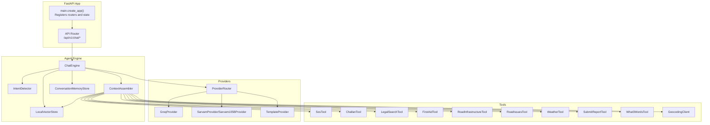
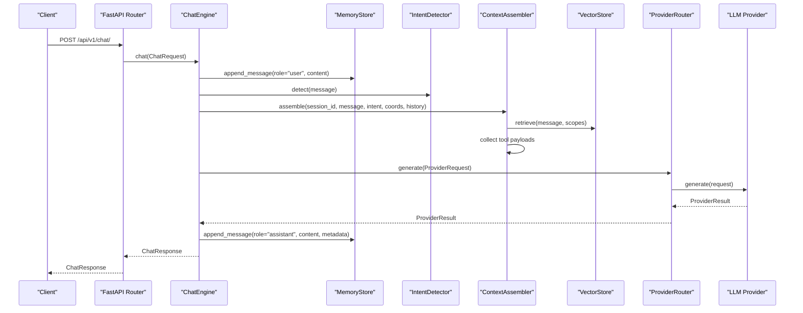
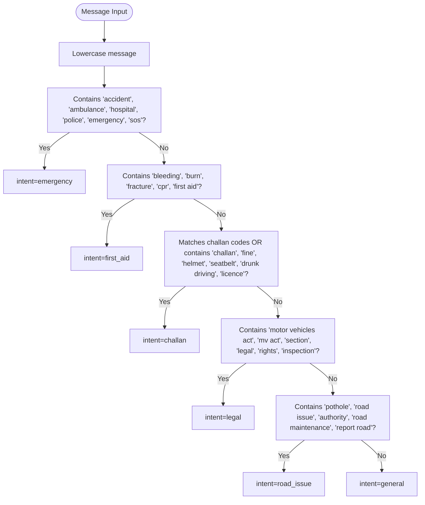
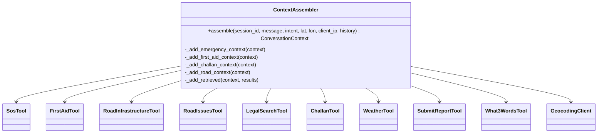
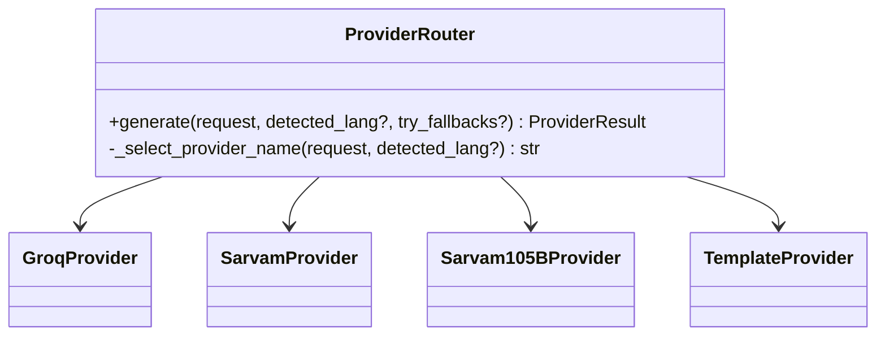
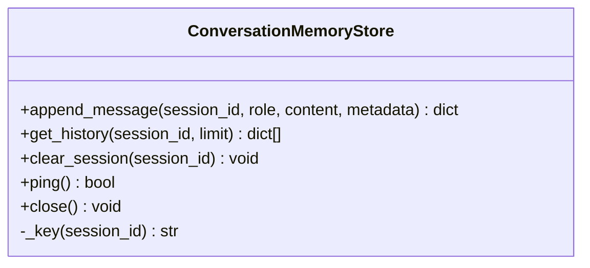
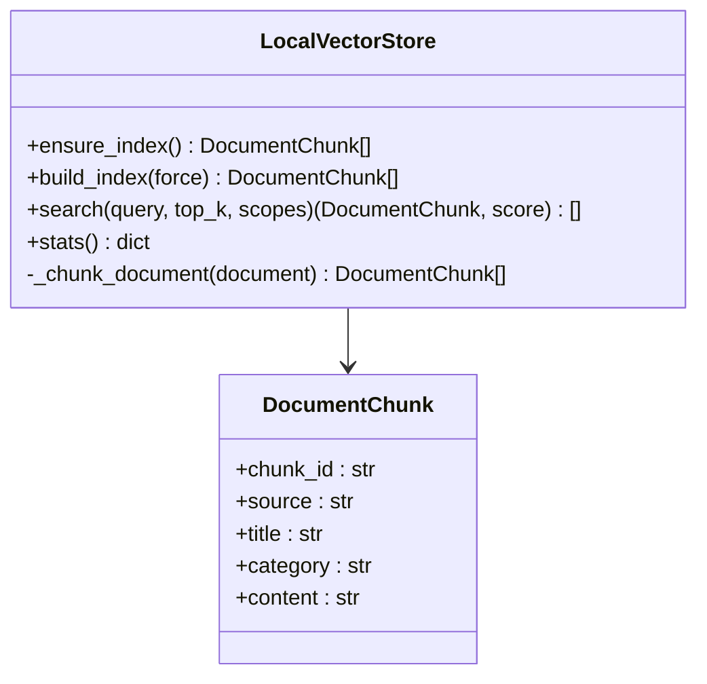
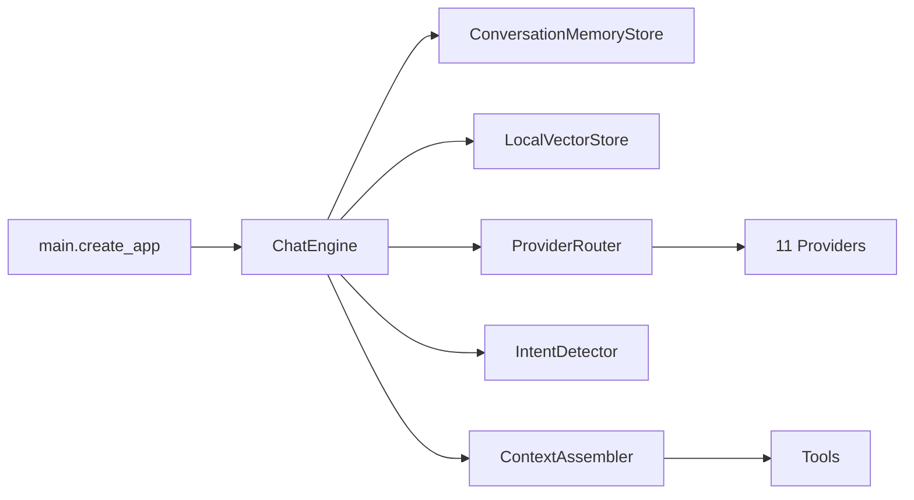
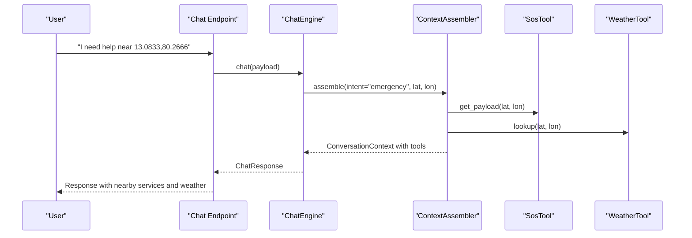
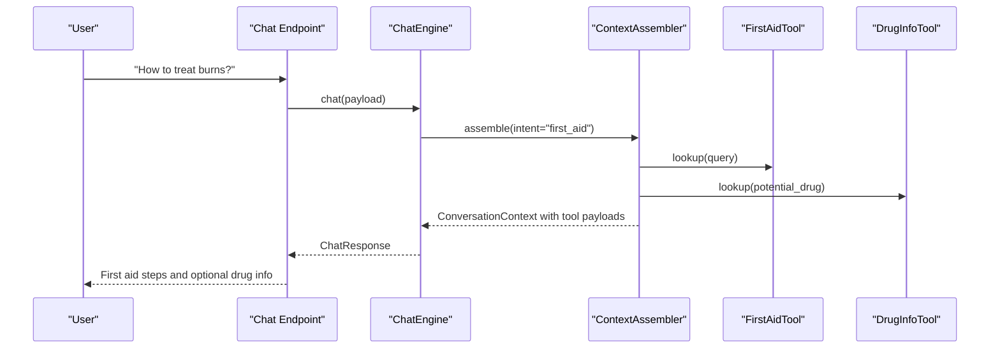

# AI Chatbot Service

<cite>
**Referenced Files in This Document**
- [chatbot_service/main.py](file://chatbot_service/main.py)
- [chatbot_service/config.py](file://chatbot_service/config.py)
- [chatbot_service/agent/intent_detector.py](file://chatbot_service/agent/intent_detector.py)
- [chatbot_service/agent/context_assembler.py](file://chatbot_service/agent/context_assembler.py)
- [chatbot_service/agent/graph.py](file://chatbot_service/agent/graph.py)
- [chatbot_service/memory/redis_memory.py](file://chatbot_service/memory/redis_memory.py)
- [chatbot_service/providers/base.py](file://chatbot_service/providers/base.py)
- [chatbot_service/providers/router.py](file://chatbot_service/providers/router.py)
- [chatbot_service/providers/groq_provider.py](file://chatbot_service/providers/groq_provider.py)
- [chatbot_service/providers/sarvam_provider.py](file://chatbot_service/providers/sarvam_provider.py)
- [chatbot_service/rag/vectorstore.py](file://chatbot_service/rag/vectorstore.py)
- [chatbot_service/tools/__init__.py](file://chatbot_service/tools/__init__.py)
- [chatbot_service/tools/emergency_tool.py](file://chatbot_service/tools/emergency_tool.py)
- [chatbot_service/tools/first_aid_tool.py](file://chatbot_service/tools/first_aid_tool.py)
- [chatbot_service/api/chat.py](file://chatbot_service/api/chat.py)
</cite>

## Table of Contents
1. [Introduction](#introduction)
2. [Project Structure](#project-structure)
3. [Core Components](#core-components)
4. [Architecture Overview](#architecture-overview)
5. [Detailed Component Analysis](#detailed-component-analysis)
6. [Dependency Analysis](#dependency-analysis)
7. [Performance Considerations](#performance-considerations)
8. [Troubleshooting Guide](#troubleshooting-guide)
9. [Conclusion](#conclusion)
10. [Appendices](#appendices)

## Introduction
This document explains the AI Chatbot Service architecture and implementation. It covers the agentic Retrieval-Augmented Generation (RAG) pipeline, including intent detection, context assembly, and multi-provider LLM routing. It documents the 9-class intent classification system, conversation memory management, tool execution patterns, voice input/output capabilities, multilingual support, provider abstraction for 9 LLM providers, vector store integration with a local JSON-based index, and offline chat capabilities using WebLLM.

## Project Structure
The chatbot service is implemented as a FastAPI application that orchestrates:
- An intent detector
- A context assembler that augments prompts with tools and retrieved knowledge
- A provider router that selects and falls back among 9 LLM providers
- A conversation memory store backed by Redis or in-memory fallback
- A local vector store for retrieval-augmented generation
- Tools for SOS, challan calculation, legal search, first aid, road infrastructure, weather, and more
- Streaming and non-streaming chat endpoints

**Diagram sources**
- [chatbot_service/main.py:41-145](file://chatbot_service/main.py#L41-L145)
- [chatbot_service/api/chat.py:16-111](file://chatbot_service/api/chat.py#L16-L111)
- [chatbot_service/agent/graph.py:15-109](file://chatbot_service/agent/graph.py#L15-L109)
- [chatbot_service/agent/context_assembler.py:17-215](file://chatbot_service/agent/context_assembler.py#L17-L215)
- [chatbot_service/providers/router.py:75-199](file://chatbot_service/providers/router.py#L75-L199)
- [chatbot_service/providers/groq_provider.py:10-23](file://chatbot_service/providers/groq_provider.py#L10-L23)
- [chatbot_service/providers/sarvam_provider.py:44-125](file://chatbot_service/providers/sarvam_provider.py#L44-L125)

**Section sources**
- [chatbot_service/main.py:41-145](file://chatbot_service/main.py#L41-L145)
- [chatbot_service/api/chat.py:16-111](file://chatbot_service/api/chat.py#L16-L111)

## Core Components
- Intent Detection: Classifies incoming messages into 9 classes to drive context assembly and tool selection.
- Context Assembly: Builds a ConversationContext enriched with tool payloads and retrieved knowledge.
- Provider Router: Routes requests across 11 providers with intelligent fallback and Indian language routing.
- Memory Store: Persists conversation history with Redis-backed persistence and in-memory fallback.
- Vector Store: Loads and indexes documents locally; supports retrieval with category scoping.
- Tools: Integrations for SOS, challan, legal search, first aid, road infrastructure, weather, and reporting.
- API Layer: Non-streaming and streaming chat endpoints with rate limiting and health checks.

**Section sources**
- [chatbot_service/agent/intent_detector.py:9-25](file://chatbot_service/agent/intent_detector.py#L9-L25)
- [chatbot_service/agent/context_assembler.py:17-215](file://chatbot_service/agent/context_assembler.py#L17-L215)
- [chatbot_service/providers/router.py:75-199](file://chatbot_service/providers/router.py#L75-L199)
- [chatbot_service/memory/redis_memory.py:10-90](file://chatbot_service/memory/redis_memory.py#L10-L90)
- [chatbot_service/rag/vectorstore.py:20-110](file://chatbot_service/rag/vectorstore.py#L20-L110)
- [chatbot_service/tools/__init__.py:8-70](file://chatbot_service/tools/__init__.py#L8-L70)
- [chatbot_service/api/chat.py:28-111](file://chatbot_service/api/chat.py#L28-L111)

## Architecture Overview
The system follows an agentic RAG pipeline:
1. Safety evaluation blocks unsafe prompts.
2. Intent detection determines the conversation class.
3. Context assembly enriches the prompt with:
   - Tool results (SOS, weather, first aid, road info, legal search, etc.)
   - Retrieved knowledge from the local vector store
4. Provider router selects the best LLM provider with fallback.
5. Response is stored in memory with intent and sources metadata.

**Diagram sources**
- [chatbot_service/api/chat.py:28-41](file://chatbot_service/api/chat.py#L28-L41)
- [chatbot_service/agent/graph.py:33-87](file://chatbot_service/agent/graph.py#L33-L87)
- [chatbot_service/agent/context_assembler.py:43-81](file://chatbot_service/agent/context_assembler.py#L43-L81)
- [chatbot_service/providers/router.py:154-199](file://chatbot_service/providers/router.py#L154-L199)

## Detailed Component Analysis

### Intent Classification System
The intent detector classifies messages into 9 classes:
- emergency
- first_aid
- challan
- legal
- road_issue
- general

It uses keyword matching and numeric pattern detection for challan-related messages.

**Diagram sources**
- [chatbot_service/agent/intent_detector.py:10-24](file://chatbot_service/agent/intent_detector.py#L10-L24)

**Section sources**
- [chatbot_service/agent/intent_detector.py:9-25](file://chatbot_service/agent/intent_detector.py#L9-L25)

### Context Assembly and Tool Execution
ContextAssembler builds a ConversationContext augmented by:
- Tool payloads for SOS, weather, first aid, road infrastructure, road issues, legal search, challan, and submission guidance
- Retrieved knowledge snippets filtered by category scopes

Key tool integrations:
- SOS: Collects nearby emergency numbers and services, optionally including What3Words coordinates
- First Aid: Matches user queries to curated first aid guides and optionally enriches with drug info
- Road Infrastructure and Issues: Fetches road authority and nearby reported issues
- Legal Search: Augments responses with legal references
- Challan: Infers applicable sections and calculates fines
- Weather: Adds local weather conditions

**Diagram sources**
- [chatbot_service/agent/context_assembler.py:17-215](file://chatbot_service/agent/context_assembler.py#L17-L215)
- [chatbot_service/tools/emergency_tool.py:6-15](file://chatbot_service/tools/emergency_tool.py#L6-L15)
- [chatbot_service/tools/first_aid_tool.py:49-109](file://chatbot_service/tools/first_aid_tool.py#L49-L109)

**Section sources**
- [chatbot_service/agent/context_assembler.py:43-215](file://chatbot_service/agent/context_assembler.py#L43-L215)
- [chatbot_service/tools/__init__.py:8-70](file://chatbot_service/tools/__init__.py#L8-L70)

### Multi-Provider LLM Routing
The ProviderRouter selects providers based on:
- Detected Indian language input
- High-stakes intents (e.g., legal, emergency reports)
- Explicit provider hints
- Default provider configuration

Fallback chain prioritizes speed and capacity:
1. Groq (fastest English)
2. Cerebras (overflow)
3. Gemini (large context)
4. GitHub/NVIDIA/OpenRouter/Mistral/Together
5. Template (deterministic fallback)

**Diagram sources**
- [chatbot_service/providers/router.py:75-199](file://chatbot_service/providers/router.py#L75-L199)
- [chatbot_service/providers/groq_provider.py:10-23](file://chatbot_service/providers/groq_provider.py#L10-L23)
- [chatbot_service/providers/sarvam_provider.py:44-125](file://chatbot_service/providers/sarvam_provider.py#L44-L125)

**Section sources**
- [chatbot_service/providers/router.py:75-199](file://chatbot_service/providers/router.py#L75-L199)
- [chatbot_service/providers/base.py:44-206](file://chatbot_service/providers/base.py#L44-L206)

### Conversation Memory Management
The memory store persists sessions with:
- Role, content, metadata, and timestamps
- Redis-backed storage with TTL and fallback to in-memory
- Health checks and graceful degradation

**Diagram sources**
- [chatbot_service/memory/redis_memory.py:10-90](file://chatbot_service/memory/redis_memory.py#L10-L90)

**Section sources**
- [chatbot_service/memory/redis_memory.py:10-90](file://chatbot_service/memory/redis_memory.py#L10-L90)

### Vector Store and RAG Indexing
The local vector store:
- Loads documents from a data directory
- Chunks text into fixed-length segments
- Persists a simple JSON index
- Supports category-scoped retrieval and scoring

**Diagram sources**
- [chatbot_service/rag/vectorstore.py:20-110](file://chatbot_service/rag/vectorstore.py#L20-L110)

**Section sources**
- [chatbot_service/rag/vectorstore.py:20-110](file://chatbot_service/rag/vectorstore.py#L20-L110)

### API Endpoints and Streaming
Endpoints:
- POST /api/v1/chat/: Standard chat
- POST /api/v1/chat/stream: SSE streaming
- GET /api/v1/chat/history/{session_id}: Retrieve session history
- GET /health: Service health

Streaming simulates token delivery by splitting the final response into words with small delays.

**Section sources**
- [chatbot_service/api/chat.py:28-111](file://chatbot_service/api/chat.py#L28-L111)

### Voice Input/Output and Multilingual Support
Multilingual routing:
- Language detection identifies Indian language scripts
- High-stakes legal and emergency intents route to Sarvam-105B
- General Indian language input routes to Sarvam-30B
- English defaults to Groq, with fallbacks

Voice input/output:
- Speech service integrates with Indic Seamless for translation and synthesis
- Speech status endpoint exposes capability and configuration

Configuration keys include model identifiers, device selection, and default target language.

**Section sources**
- [chatbot_service/providers/router.py:34-73](file://chatbot_service/providers/router.py#L34-L73)
- [chatbot_service/providers/sarvam_provider.py:15-25](file://chatbot_service/providers/sarvam_provider.py#L15-L25)
- [chatbot_service/config.py:40-109](file://chatbot_service/config.py#L40-L109)
- [chatbot_service/main.py:54](file://chatbot_service/main.py#L54)

### Offline Chat Capabilities Using WebLLM
Offline support is enabled by:
- Configurable speech model directory and device selection
- Deterministic template provider as a final fallback
- Local vector store indexing for retrieval without external APIs

These settings allow deployment in environments with limited connectivity.

**Section sources**
- [chatbot_service/config.py:55-99](file://chatbot_service/config.py#L55-L99)
- [chatbot_service/providers/base.py:162-206](file://chatbot_service/providers/base.py#L162-L206)
- [chatbot_service/rag/vectorstore.py:27-49](file://chatbot_service/rag/vectorstore.py#L27-L49)

## Dependency Analysis
High-level dependencies:
- FastAPI app depends on ChatEngine, MemoryStore, VectorStore, ProviderRouter, and ContextAssembler
- ChatEngine depends on IntentDetector, ContextAssembler, MemoryStore, VectorStore, and ProviderRouter
- ContextAssembler depends on Retriever and multiple tools
- ProviderRouter composes 11 providers and a deterministic fallback
- MemoryStore depends on Redis client
- VectorStore depends on document loader and embeddings utilities

**Diagram sources**
- [chatbot_service/main.py:41-145](file://chatbot_service/main.py#L41-L145)
- [chatbot_service/agent/graph.py:15-109](file://chatbot_service/agent/graph.py#L15-L109)
- [chatbot_service/providers/router.py:75-199](file://chatbot_service/providers/router.py#L75-L199)

**Section sources**
- [chatbot_service/main.py:41-145](file://chatbot_service/main.py#L41-L145)
- [chatbot_service/agent/graph.py:15-109](file://chatbot_service/agent/graph.py#L15-L109)

## Performance Considerations
- Provider selection prioritizes throughput (Groq) and capacity (Cerebras/Gemini) with fallbacks
- Context assembly caps tool summaries and document snippets to reduce context size
- Memory history is trimmed to a bounded window
- Streaming delivers perceived latency by emitting tokens incrementally
- Vector store chunks are sized to balance recall and context length
- Redis TTL ensures timely cleanup of inactive sessions

[No sources needed since this section provides general guidance]

## Troubleshooting Guide
Common issues and mitigations:
- No active LLM provider configured: The service enforces at least one API key for providers and raises a fatal error if none are found
- Redis connectivity failures: Memory store gracefully falls back to in-memory storage and marks backend as unhealthy
- Provider errors: ProviderRouter attempts fallback providers in priority order
- Prompt injection attempts: Base provider blocks prohibited patterns and returns a safety-filtered response
- Streaming errors: API catches exceptions and emits an error event to the client

**Section sources**
- [chatbot_service/config.py:115-126](file://chatbot_service/config.py#L115-L126)
- [chatbot_service/memory/redis_memory.py:47-76](file://chatbot_service/memory/redis_memory.py#L47-L76)
- [chatbot_service/providers/router.py:179-199](file://chatbot_service/providers/router.py#L179-L199)
- [chatbot_service/providers/base.py:129-139](file://chatbot_service/providers/base.py#L129-L139)
- [chatbot_service/api/chat.py:84-87](file://chatbot_service/api/chat.py#L84-L87)

## Conclusion

> **Enterprise Hardening Notes:**
> - LLM provider calls now use `asyncio.wait_for()` with configurable timeout to prevent hanging
> - Safety checker includes a 12-pattern prompt injection guard
> - Rate limiting enforced via `slowapi` on chat endpoints (5 req/min)
> - Embedding model replaced: `hash-based embeddings` → `LocalHashEmbeddingFunction` (zero ML dependency)

The AI Chatbot Service implements a robust, agentic RAG pipeline with strong multilingual and provider diversity. It balances responsiveness with accuracy through intelligent routing, retrieval augmentation, and conversation memory. The modular design enables easy extension of tools, providers, and retrieval strategies while maintaining reliability through fallbacks and health monitoring.

[No sources needed since this section summarizes without analyzing specific files]

## Appendices

### Provider Abstraction and Configuration
- Base provider interface defines the shared HTTP transport, prompt building, and safety checks
- Specific providers implement API key retrieval, base URLs, and default models
- Environment variables configure API keys and models for each provider
- Default provider and model are configurable via settings

**Section sources**
- [chatbot_service/providers/base.py:90-206](file://chatbot_service/providers/base.py#L90-L206)
- [chatbot_service/providers/groq_provider.py:10-23](file://chatbot_service/providers/groq_provider.py#L10-L23)
- [chatbot_service/providers/sarvam_provider.py:44-125](file://chatbot_service/providers/sarvam_provider.py#L44-L125)
- [chatbot_service/config.py:95-109](file://chatbot_service/config.py#L95-L109)

### Example Workflows

#### Emergency Intent with SOS and Weather

**Diagram sources**
- [chatbot_service/agent/context_assembler.py:83-114](file://chatbot_service/agent/context_assembler.py#L83-L114)
- [chatbot_service/tools/emergency_tool.py:10-15](file://chatbot_service/tools/emergency_tool.py#L10-L15)

#### First Aid Intent with Drug Info

**Diagram sources**
- [chatbot_service/agent/context_assembler.py:116-143](file://chatbot_service/agent/context_assembler.py#L116-L143)
- [chatbot_service/tools/first_aid_tool.py:54-60](file://chatbot_service/tools/first_aid_tool.py#L54-L60)