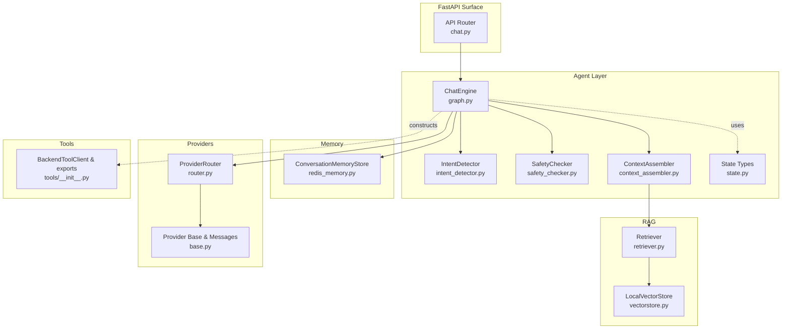
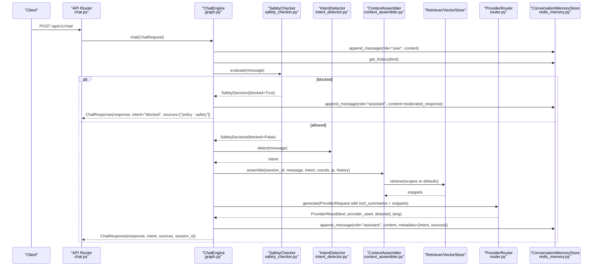
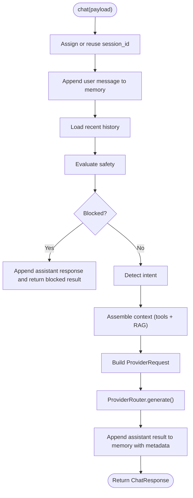
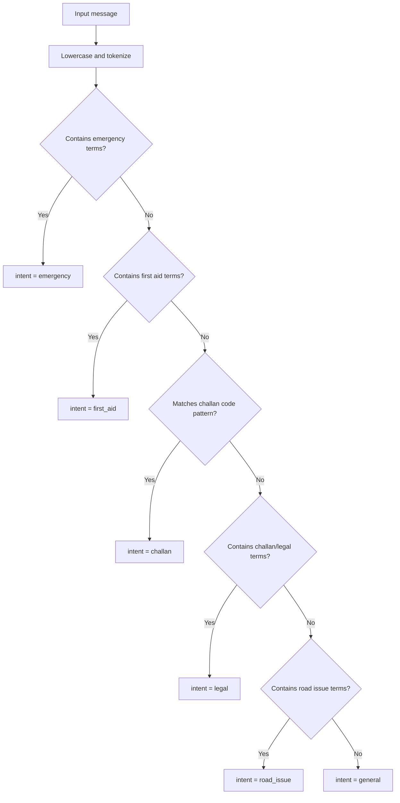
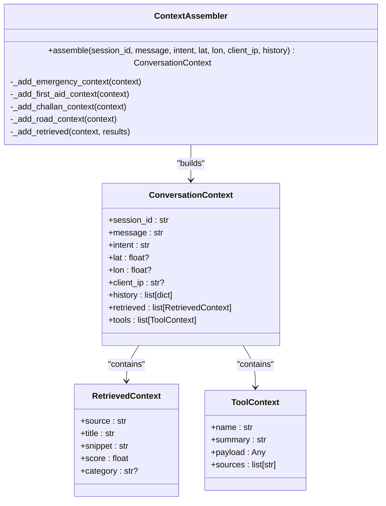
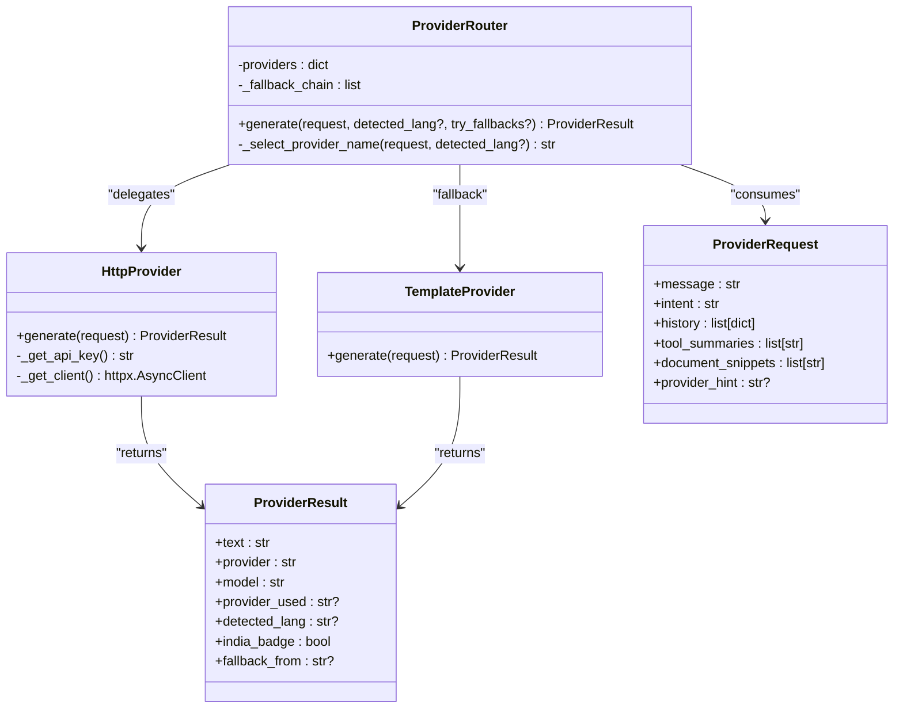
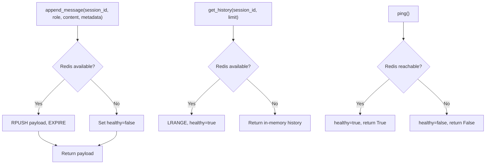
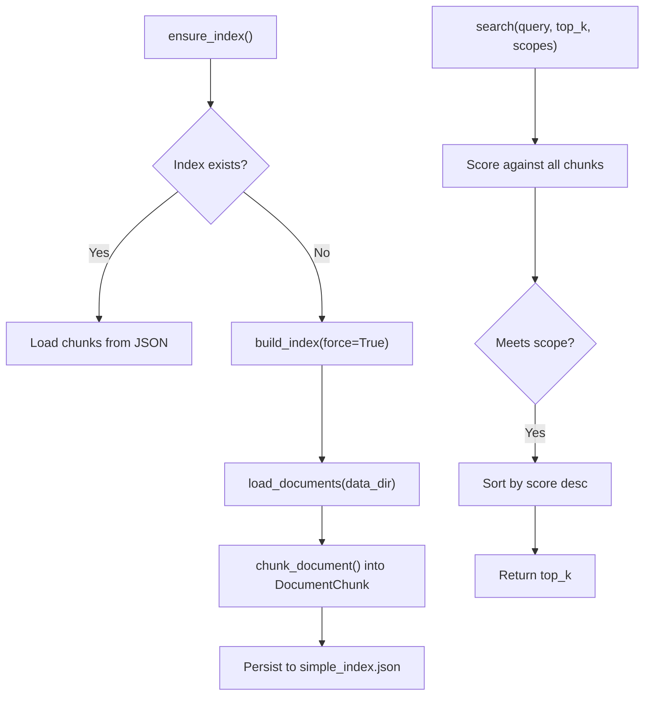
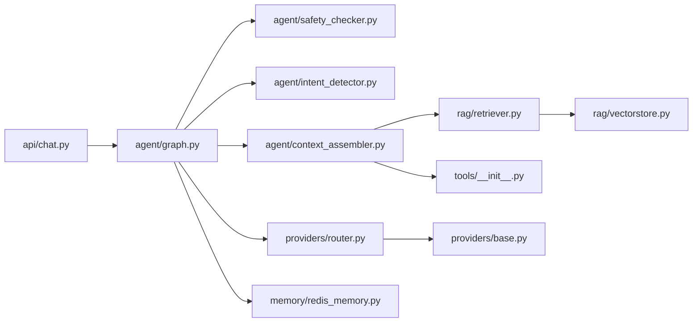

# Chat Engine Orchestration

<cite>
**Referenced Files in This Document**
- [main.py](file://chatbot_service/main.py)
- [config.py](file://chatbot_service/config.py)
- [graph.py](file://chatbot_service/agent/graph.py)
- [state.py](file://chatbot_service/agent/state.py)
- [context_assembler.py](file://chatbot_service/agent/context_assembler.py)
- [intent_detector.py](file://chatbot_service/agent/intent_detector.py)
- [safety_checker.py](file://chatbot_service/agent/safety_checker.py)
- [redis_memory.py](file://chatbot_service/memory/redis_memory.py)
- [router.py](file://chatbot_service/providers/router.py)
- [base.py](file://chatbot_service/providers/base.py)
- [chat.py](file://chatbot_service/api/chat.py)
- [retriever.py](file://chatbot_service/rag/retriever.py)
- [vectorstore.py](file://chatbot_service/rag/vectorstore.py)
- [__init__.py](file://chatbot_service/tools/__init__.py)
</cite>

## Table of Contents
1. [Introduction](#introduction)
2. [Project Structure](#project-structure)
3. [Core Components](#core-components)
4. [Architecture Overview](#architecture-overview)
5. [Detailed Component Analysis](#detailed-component-analysis)
6. [Dependency Analysis](#dependency-analysis)
7. [Performance Considerations](#performance-considerations)
8. [Troubleshooting Guide](#troubleshooting-guide)
9. [Conclusion](#conclusion)
10. [Appendices](#appendices)

## Introduction
This document explains the ChatEngine orchestration that powers the SafeVixAI chatbot. It covers the state machine-like flow, conversation management, intent detection, context assembly, provider routing, retrieval-augmented generation (RAG), memory persistence, and safety checks. It also documents multi-step reasoning, tool execution coordination, content moderation, ethical AI considerations, error handling, and graceful degradation strategies.

## Project Structure
The chatbot service is organized around a modular agent layer, a provider router, a memory store, a RAG pipeline, and a FastAPI surface. The main application wires these components into a cohesive runtime.

**Diagram sources**
- [main.py:41-145](file://chatbot_service/main.py#L41-L145)
- [graph.py:15-109](file://chatbot_service/agent/graph.py#L15-L109)
- [intent_detector.py:9-25](file://chatbot_service/agent/intent_detector.py#L9-L25)
- [safety_checker.py:12-31](file://chatbot_service/agent/safety_checker.py#L12-L31)
- [context_assembler.py:17-215](file://chatbot_service/agent/context_assembler.py#L17-L215)
- [redis_memory.py:10-90](file://chatbot_service/memory/redis_memory.py#L10-L90)
- [retriever.py:17-40](file://chatbot_service/rag/retriever.py#L17-L40)
- [vectorstore.py:20-110](file://chatbot_service/rag/vectorstore.py#L20-L110)
- [router.py:75-199](file://chatbot_service/providers/router.py#L75-L199)
- [base.py:44-206](file://chatbot_service/providers/base.py#L44-L206)
- [chat.py:16-111](file://chatbot_service/api/chat.py#L16-L111)
- [__init__.py:8-70](file://chatbot_service/tools/__init__.py#L8-L70)

**Section sources**
- [main.py:41-145](file://chatbot_service/main.py#L41-L145)
- [config.py:69-126](file://chatbot_service/config.py#L69-L126)

## Core Components
- ChatEngine: Orchestrates the end-to-end chat flow, integrating safety, intent detection, context assembly, provider routing, and memory.
- IntentDetector: Classifies user messages into intents (e.g., emergency, first_aid, challan, legal, road_issue, general).
- SafetyChecker: Enforces ethical boundaries and blocks harmful queries.
- ContextAssembler: Builds a ConversationContext enriched with tool payloads and RAG snippets.
- ProviderRouter: Selects and routes to LLM providers with a deterministic fallback chain.
- ConversationMemoryStore: Persists and retrieves conversation history with Redis-backed persistence and in-memory fallback.
- Retriever and LocalVectorStore: Implements a lightweight vector index for RAG.
- API surface: Exposes chat, streaming, history, and health endpoints.

**Section sources**
- [graph.py:15-109](file://chatbot_service/agent/graph.py#L15-L109)
- [intent_detector.py:9-25](file://chatbot_service/agent/intent_detector.py#L9-L25)
- [safety_checker.py:12-31](file://chatbot_service/agent/safety_checker.py#L12-L31)
- [context_assembler.py:17-215](file://chatbot_service/agent/context_assembler.py#L17-L215)
- [router.py:75-199](file://chatbot_service/providers/router.py#L75-L199)
- [redis_memory.py:10-90](file://chatbot_service/memory/redis_memory.py#L10-L90)
- [retriever.py:17-40](file://chatbot_service/rag/retriever.py#L17-L40)
- [vectorstore.py:20-110](file://chatbot_service/rag/vectorstore.py#L20-L110)
- [chat.py:16-111](file://chatbot_service/api/chat.py#L16-L111)

## Architecture Overview
The ChatEngine follows a deterministic pipeline with explicit branching by intent and safety gating. It composes context from multiple sources (tools and RAG), selects a provider via the router, and persists the result to memory.

**Diagram sources**
- [chat.py:28-41](file://chatbot_service/api/chat.py#L28-L41)
- [graph.py:33-87](file://chatbot_service/agent/graph.py#L33-L87)
- [safety_checker.py:13-30](file://chatbot_service/agent/safety_checker.py#L13-L30)
- [intent_detector.py:10-24](file://chatbot_service/agent/intent_detector.py#L10-L24)
- [context_assembler.py:43-81](file://chatbot_service/agent/context_assembler.py#L43-L81)
- [retriever.py:22-39](file://chatbot_service/rag/retriever.py#L22-L39)
- [router.py:154-199](file://chatbot_service/providers/router.py#L154-L199)
- [redis_memory.py:23-44](file://chatbot_service/memory/redis_memory.py#L23-L44)

## Detailed Component Analysis

### ChatEngine Orchestration
The ChatEngine encapsulates the end-to-end flow. It manages sessions, enforces safety, detects intent, assembles context, routes to providers, and persists results. It also exposes helpers to rebuild the RAG index and return stats.

Key behaviors:
- Session creation and history retrieval
- Safety gating with policy-driven responses
- Intent-driven context enrichment
- Provider selection and fallback
- Source attribution deduplication
- Memory append with metadata (intent, sources)

**Diagram sources**
- [graph.py:33-87](file://chatbot_service/agent/graph.py#L33-L87)
- [redis_memory.py:23-44](file://chatbot_service/memory/redis_memory.py#L23-L44)
- [router.py:154-199](file://chatbot_service/providers/router.py#L154-L199)

**Section sources**
- [graph.py:15-109](file://chatbot_service/agent/graph.py#L15-L109)

### Intent Detection
IntentDetector classifies incoming messages into coarse-grained intents. The classifier uses keyword matching and numeric patterns to identify legal-related content.

Behavior highlights:
- Emergency keywords trigger emergency intent
- First aid terms trigger first_aid intent
- Challan-related keywords and specific numeric codes trigger challan intent
- Legal and Motor Vehicles Act mentions trigger legal intent
- Road issue and authority terms trigger road_issue intent
- Default fallback to general intent

**Diagram sources**
- [intent_detector.py:10-24](file://chatbot_service/agent/intent_detector.py#L10-L24)

**Section sources**
- [intent_detector.py:9-25](file://chatbot_service/agent/intent_detector.py#L9-L25)

### Context Assembly
ContextAssembler builds a ConversationContext tailored to the detected intent. It augments the context with:
- Tool payloads (e.g., SOS numbers, weather, first aid steps, challan inference, road infrastructure, road issues, report guidance)
- RAG snippets filtered by intent-appropriate scopes

Key intent branches:
- emergency: Adds SOS and weather data; retrieves medical/emergency/healthcare content
- first_aid: Adds first aid steps and optional drug info lookup
- challan: Adds challan inference results
- legal: Retrieves legal documents
- road_issue: Adds road infrastructure and nearby issues; optionally adds submission guidance
- general: Retrieves broadly

**Diagram sources**
- [context_assembler.py:17-215](file://chatbot_service/agent/context_assembler.py#L17-L215)
- [state.py:42-52](file://chatbot_service/agent/state.py#L42-L52)

**Section sources**
- [context_assembler.py:17-215](file://chatbot_service/agent/context_assembler.py#L17-L215)
- [state.py:24-52](file://chatbot_service/agent/state.py#L24-L52)

### Provider Routing and Generation
ProviderRouter implements a deterministic fallback chain and intelligent routing:
- Detects Indian language input and routes to Sarvam providers
- Uses Sarvam-105B for high-stakes legal intents in Indian languages
- Defaults to configured provider or Groq for English
- Falls back across providers until success or exhaustion
- Attaches metadata (provider_used, fallback_from, detected_lang, india_badge)

The base provider layer:
- Defines a system prompt and prohibited patterns
- Builds OpenAI-compatible messages including injected context
- Provides a TemplateProvider fallback that always responds deterministically

**Diagram sources**
- [router.py:75-199](file://chatbot_service/providers/router.py#L75-L199)
- [base.py:90-206](file://chatbot_service/providers/base.py#L90-L206)
- [base.py:44-63](file://chatbot_service/providers/base.py#L44-L63)

**Section sources**
- [router.py:75-199](file://chatbot_service/providers/router.py#L75-L199)
- [base.py:44-206](file://chatbot_service/providers/base.py#L44-L206)

### Memory Management
ConversationMemoryStore persists messages with:
- Role, content, metadata, and timestamps
- Redis-backed storage with TTL and fallback to in-memory
- Health checks and graceful degradation
- Session-scoped keys and atomic operations

**Diagram sources**
- [redis_memory.py:23-76](file://chatbot_service/memory/redis_memory.py#L23-L76)

**Section sources**
- [redis_memory.py:10-90](file://chatbot_service/memory/redis_memory.py#L10-L90)

### RAG Index and Retrieval
LocalVectorStore loads documents from disk, chunks them, and persists a simple JSON index. Retriever performs semantic search with optional category scoping.

**Diagram sources**
- [vectorstore.py:27-68](file://chatbot_service/rag/vectorstore.py#L27-L68)
- [retriever.py:22-39](file://chatbot_service/rag/retriever.py#L22-L39)

**Section sources**
- [vectorstore.py:20-110](file://chatbot_service/rag/vectorstore.py#L20-L110)
- [retriever.py:17-40](file://chatbot_service/rag/retriever.py#L17-L40)

### API Surface and Streaming
The API exposes:
- POST /api/v1/chat/ for synchronous responses
- POST /api/v1/chat/stream for SSE streaming
- GET /api/v1/chat/history/{session_id} for session history
- GET /health and root endpoints for service health

Streaming simulates token delivery by splitting the final response into words with small delays and emits metadata on completion.

**Section sources**
- [chat.py:16-111](file://chatbot_service/api/chat.py#L16-L111)

## Dependency Analysis
The ChatEngine composes several subsystems with clear boundaries:
- API depends on ChatEngine
- ChatEngine depends on SafetyChecker, IntentDetector, ContextAssembler, ProviderRouter, ConversationMemoryStore
- ContextAssembler depends on Retriever and Tools
- Retriever depends on LocalVectorStore
- ProviderRouter depends on multiple provider implementations and base classes
- Tools depend on BackendToolClient and external APIs

**Diagram sources**
- [chat.py:16-111](file://chatbot_service/api/chat.py#L16-L111)
- [graph.py:15-109](file://chatbot_service/agent/graph.py#L15-L109)
- [context_assembler.py:17-215](file://chatbot_service/agent/context_assembler.py#L17-L215)
- [retriever.py:17-40](file://chatbot_service/rag/retriever.py#L17-L40)
- [vectorstore.py:20-110](file://chatbot_service/rag/vectorstore.py#L20-L110)
- [router.py:75-199](file://chatbot_service/providers/router.py#L75-L199)
- [base.py:44-206](file://chatbot_service/providers/base.py#L44-L206)
- [redis_memory.py:10-90](file://chatbot_service/memory/redis_memory.py#L10-L90)
- [__init__.py:8-70](file://chatbot_service/tools/__init__.py#L8-L70)

**Section sources**
- [main.py:41-145](file://chatbot_service/main.py#L41-L145)

## Performance Considerations
- Provider fallback minimizes latency by preferring fast providers (e.g., Groq) and reserving slower/higher-capacity providers for heavy workloads.
- Streaming response improves perceived latency by emitting tokens incrementally.
- Memory operations are O(n) for history retrieval with Redis list operations; TTL ensures bounded memory growth.
- RAG search is linear over indexed chunks; category scoping reduces search space.
- TemplateProvider ensures availability during provider outages.

[No sources needed since this section provides general guidance]

## Troubleshooting Guide
Common issues and mitigations:
- Redis connectivity failures: Memory falls back to in-memory mode; health endpoint reports backend status. Verify REDIS_URL and network access.
- All providers failing: ProviderRouter raises an aggregated error; confirm at least one provider API key is configured.
- Prompt injection attempts: Providers filter prohibited patterns and return a safety-filtered response.
- Rate limits: API endpoints apply rate limiting; clients should retry with backoff.
- Session not found: Ensure session_id is passed consistently; history endpoints require a valid session_id.

Operational checks:
- Health endpoint returns service status and memory availability.
- Admin endpoints expose index rebuild capabilities.

**Section sources**
- [redis_memory.py:67-76](file://chatbot_service/memory/redis_memory.py#L67-L76)
- [router.py:196-199](file://chatbot_service/providers/router.py#L196-L199)
- [base.py:129-136](file://chatbot_service/providers/base.py#L129-L136)
- [chat.py:108-111](file://chatbot_service/api/chat.py#L108-L111)
- [main.py:106-115](file://chatbot_service/main.py#L106-L115)

## Conclusion
The ChatEngine orchestrates a robust, ethical, and resilient chatbot pipeline. It integrates intent detection, safety gating, dynamic context assembly, multi-source RAG, and a reliable provider routing strategy with graceful fallback. Memory persistence and streaming UX further enhance reliability and user experience.

[No sources needed since this section summarizes without analyzing specific files]

## Appendices

### Safety and Ethical AI
- SafetyChecker blocks harmful intent patterns and returns policy-compliant responses.
- Providers enforce prohibited pattern detection and return safety-filtered outputs.
- System prompt emphasizes Indian road safety focus and appropriate responses.

**Section sources**
- [safety_checker.py:12-31](file://chatbot_service/agent/safety_checker.py#L12-L31)
- [base.py:11-18](file://chatbot_service/providers/base.py#L11-L18)
- [base.py:129-136](file://chatbot_service/providers/base.py#L129-L136)

### Example Conversation Flows
- Emergency assistance: intent emergency triggers SOS and weather tool payloads plus medical/emergency RAG snippets; routed to a suitable provider; result stored with sources.
- First aid guidance: intent first_aid triggers first aid steps and optional drug info; RAG medical snippets included; provider response returned.
- Challan inference: intent challan triggers challan calculation tool; legal RAG snippets included; provider response returned.
- Road issue reporting: intent road_issue triggers infrastructure and nearby issues; optional submission guidance; provider response returned.

**Section sources**
- [graph.py:33-87](file://chatbot_service/agent/graph.py#L33-L87)
- [context_assembler.py:64-81](file://chatbot_service/agent/context_assembler.py#L64-L81)
- [router.py:154-199](file://chatbot_service/providers/router.py#L154-L199)

### Multi-Step Reasoning and Tool Coordination
- ContextAssembler coordinates multiple tools per intent, aggregating summaries and sources.
- ProviderRouter receives tool_summaries and document_snippets to inform reasoning.
- Memory stores metadata (intent, sources) for traceability and reproducibility.

**Section sources**
- [context_assembler.py:43-81](file://chatbot_service/agent/context_assembler.py#L43-L81)
- [base.py:65-87](file://chatbot_service/providers/base.py#L65-L87)
- [graph.py:72-81](file://chatbot_service/agent/graph.py#L72-L81)