# Chatbot Architecture Overview

<cite>
**Referenced Files in This Document**
- [chatbot_service/main.py](https://github.com/SafeVixAI/SafeVixAI/blob/main/chatbot_service/main.py)
- [chatbot_service/config.py](https://github.com/SafeVixAI/SafeVixAI/blob/main/chatbot_service/config.py)
- [chatbot_service/agent/__init__.py](https://github.com/SafeVixAI/SafeVixAI/blob/main/chatbot_service/agent/__init__.py)
- [chatbot_service/agent/context_assembler.py](https://github.com/SafeVixAI/SafeVixAI/blob/main/chatbot_service/agent/context_assembler.py)
- [chatbot_service/agent/graph.py](https://github.com/SafeVixAI/SafeVixAI/blob/main/chatbot_service/agent/graph.py)
- [chatbot_service/agent/intent_detector.py](https://github.com/SafeVixAI/SafeVixAI/blob/main/chatbot_service/agent/intent_detector.py)
- [chatbot_service/agent/safety_checker.py](https://github.com/SafeVixAI/SafeVixAI/blob/main/chatbot_service/agent/safety_checker.py)
- [chatbot_service/providers/router.py](https://github.com/SafeVixAI/SafeVixAI/blob/main/chatbot_service/providers/router.py)
- [chatbot_service/providers/base.py](https://github.com/SafeVixAI/SafeVixAI/blob/main/chatbot_service/providers/base.py)
- [chatbot_service/memory/redis_memory.py](https://github.com/SafeVixAI/SafeVixAI/blob/main/chatbot_service/memory/redis_memory.py)
- [chatbot_service/rag/retriever.py](https://github.com/SafeVixAI/SafeVixAI/blob/main/chatbot_service/rag/retriever.py)
- [chatbot_service/rag/vectorstore.py](https://github.com/SafeVixAI/SafeVixAI/blob/main/chatbot_service/rag/vectorstore.py)
- [chatbot_service/api/chat.py](https://github.com/SafeVixAI/SafeVixAI/blob/main/chatbot_service/api/chat.py)
- [chatbot_service/api/admin.py](https://github.com/SafeVixAI/SafeVixAI/blob/main/chatbot_service/api/admin.py)
</cite>

## Table of Contents
1. [Introduction](#introduction)
2. [Project Structure](#project-structure)
3. [Core Components](#core-components)
4. [Architecture Overview](#architecture-overview)
5. [Detailed Component Analysis](#detailed-component-analysis)
6. [Dependency Analysis](#dependency-analysis)
7. [Performance Considerations](#performance-considerations)
8. [Troubleshooting Guide](#troubleshooting-guide)
9. [Conclusion](#conclusion)
10. [Appendices](#appendices)

## Introduction
This document describes the AI Chatbot Service architecture for SafeVixAI, focusing on the agentic Retrieval-Augmented Generation (RAG) pipeline, FastAPI application structure, and service lifecycle management. It explains the modular design separating context assembly, intent detection, provider routing, and memory management, along with system boundaries, component interactions, and data flow patterns. It also covers dependency injection for service initialization, scalability considerations, error handling strategies, and performance optimizations.

## Project Structure
The chatbot service is organized into cohesive modules:
- Application entrypoint and lifecycle: FastAPI app creation, middleware, and dependency injection via lifespan.
- Agent subsystem: intent detection, safety checks, context assembly, and orchestration.
- Providers: multi-provider routing with fallback and language-aware selection.
- Memory: Redis-backed conversation storage with in-memory fallback.
- RAG: vectorized retrieval augmented by a local vector store and retriever.
- Tools: external integrations for SOS, challan calculation, weather, road infrastructure, and legal search.
- API: chat endpoints (blocking and streaming), admin endpoints, and health checks.

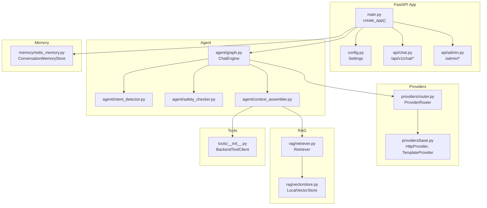

**Diagram sources**
- [chatbot_service/main.py:41-145](https://github.com/SafeVixAI/SafeVixAI/blob/main/chatbot_service/main.py#L41-L145)
- [chatbot_service/config.py:69-126](https://github.com/SafeVixAI/SafeVixAI/blob/main/chatbot_service/config.py#L69-L126)
- [chatbot_service/agent/graph.py:15-109](https://github.com/SafeVixAI/SafeVixAI/blob/main/chatbot_service/agent/graph.py#L15-L109)
- [chatbot_service/agent/context_assembler.py:17-215](https://github.com/SafeVixAI/SafeVixAI/blob/main/chatbot_service/agent/context_assembler.py#L17-L215)
- [chatbot_service/providers/router.py:75-199](https://github.com/SafeVixAI/SafeVixAI/blob/main/chatbot_service/providers/router.py#L75-L199)
- [chatbot_service/providers/base.py:90-206](https://github.com/SafeVixAI/SafeVixAI/blob/main/chatbot_service/providers/base.py#L90-L206)
- [chatbot_service/memory/redis_memory.py:10-90](https://github.com/SafeVixAI/SafeVixAI/blob/main/chatbot_service/memory/redis_memory.py#L10-L90)
- [chatbot_service/rag/vectorstore.py:20-110](https://github.com/SafeVixAI/SafeVixAI/blob/main/chatbot_service/rag/vectorstore.py#L20-L110)
- [chatbot_service/rag/retriever.py:17-40](https://github.com/SafeVixAI/SafeVixAI/blob/main/chatbot_service/rag/retriever.py#L17-L40)
- [chatbot_service/api/chat.py:16-111](https://github.com/SafeVixAI/SafeVixAI/blob/main/chatbot_service/api/chat.py#L16-L111)
- [chatbot_service/api/admin.py:12-52](https://github.com/SafeVixAI/SafeVixAI/blob/main/chatbot_service/api/admin.py#L12-L52)

**Section sources**
- [chatbot_service/main.py:41-145](https://github.com/SafeVixAI/SafeVixAI/blob/main/chatbot_service/main.py#L41-L145)
- [chatbot_service/config.py:69-126](https://github.com/SafeVixAI/SafeVixAI/blob/main/chatbot_service/config.py#L69-L126)

## Core Components
- FastAPI application with dependency injection during lifespan, CORS middleware, rate limiting, and health endpoints.
- Agent orchestration encapsulated in ChatEngine, coordinating intent detection, safety checks, context assembly, provider routing, and memory persistence.
- ProviderRouter implementing a 9-provider fallback chain with language-aware routing and Indian-language specialization.
- ContextAssembler assembling conversation context from RAG snippets and tool outputs based on detected intent.
- Memory abstraction via ConversationMemoryStore supporting Redis and in-memory fallback.
- RAG stack with LocalVectorStore and Retriever for semantic search and document scoring.
- Tools integrating with backend APIs and external services for SOS, weather, road infrastructure, legal search, and more.
- API surface exposing chat endpoints (blocking and streaming) and admin endpoints for index rebuilding and health.

**Section sources**
- [chatbot_service/main.py:41-145](https://github.com/SafeVixAI/SafeVixAI/blob/main/chatbot_service/main.py#L41-L145)
- [chatbot_service/agent/graph.py:15-109](https://github.com/SafeVixAI/SafeVixAI/blob/main/chatbot_service/agent/graph.py#L15-L109)
- [chatbot_service/providers/router.py:75-199](https://github.com/SafeVixAI/SafeVixAI/blob/main/chatbot_service/providers/router.py#L75-L199)
- [chatbot_service/agent/context_assembler.py:17-215](https://github.com/SafeVixAI/SafeVixAI/blob/main/chatbot_service/agent/context_assembler.py#L17-L215)
- [chatbot_service/memory/redis_memory.py:10-90](https://github.com/SafeVixAI/SafeVixAI/blob/main/chatbot_service/memory/redis_memory.py#L10-L90)
- [chatbot_service/rag/vectorstore.py:20-110](https://github.com/SafeVixAI/SafeVixAI/blob/main/chatbot_service/rag/vectorstore.py#L20-L110)
- [chatbot_service/rag/retriever.py:17-40](https://github.com/SafeVixAI/SafeVixAI/blob/main/chatbot_service/rag/retriever.py#L17-L40)
- [chatbot_service/api/chat.py:16-111](https://github.com/SafeVixAI/SafeVixAI/blob/main/chatbot_service/api/chat.py#L16-L111)
- [chatbot_service/api/admin.py:12-52](https://github.com/SafeVixAI/SafeVixAI/blob/main/chatbot_service/api/admin.py#L12-L52)

## Architecture Overview
The system follows an agentic RAG pipeline:
- Input enters via FastAPI routes, injected into ChatEngine through app.state.
- ChatEngine evaluates safety, detects intent, assembles context, selects a provider, and streams or returns the response.
- ContextAssembly enriches prompts with RAG snippets and tool outputs scoped by intent.
- ProviderRouter applies language detection and intent-aware routing with robust fallback.
- Memory persists user-assistant messages with TTL and supports health checks.
- RAG retrieves semantically similar chunks and builds a compact context window.

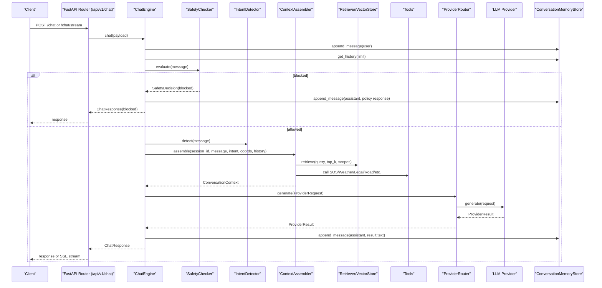

**Diagram sources**
- [chatbot_service/api/chat.py:28-97](https://github.com/SafeVixAI/SafeVixAI/blob/main/chatbot_service/api/chat.py#L28-L97)
- [chatbot_service/agent/graph.py:33-87](https://github.com/SafeVixAI/SafeVixAI/blob/main/chatbot_service/agent/graph.py#L33-L87)
- [chatbot_service/agent/safety_checker.py:12-31](https://github.com/SafeVixAI/SafeVixAI/blob/main/chatbot_service/agent/safety_checker.py#L12-L31)
- [chatbot_service/agent/intent_detector.py:9-25](https://github.com/SafeVixAI/SafeVixAI/blob/main/chatbot_service/agent/intent_detector.py#L9-L25)
- [chatbot_service/agent/context_assembler.py:43-81](https://github.com/SafeVixAI/SafeVixAI/blob/main/chatbot_service/agent/context_assembler.py#L43-L81)
- [chatbot_service/rag/retriever.py:22-39](https://github.com/SafeVixAI/SafeVixAI/blob/main/chatbot_service/rag/retriever.py#L22-L39)
- [chatbot_service/providers/router.py:154-199](https://github.com/SafeVixAI/SafeVixAI/blob/main/chatbot_service/providers/router.py#L154-L199)
- [chatbot_service/providers/base.py:129-159](https://github.com/SafeVixAI/SafeVixAI/blob/main/chatbot_service/providers/base.py#L129-L159)
- [chatbot_service/memory/redis_memory.py:23-44](https://github.com/SafeVixAI/SafeVixAI/blob/main/chatbot_service/memory/redis_memory.py#L23-L44)

## Detailed Component Analysis

### FastAPI Application and Lifecycle Management
- Application factory creates FastAPI with CORS and rate-limiting middleware.
- Lifespan initializes services: memory store, vector store, retriever, tools, context assembler, and ChatEngine.
- Services are attached to app.state for global access via dependency injection.
- Health endpoints expose service status and memory availability.
- API routers mounted for chat and admin operations.

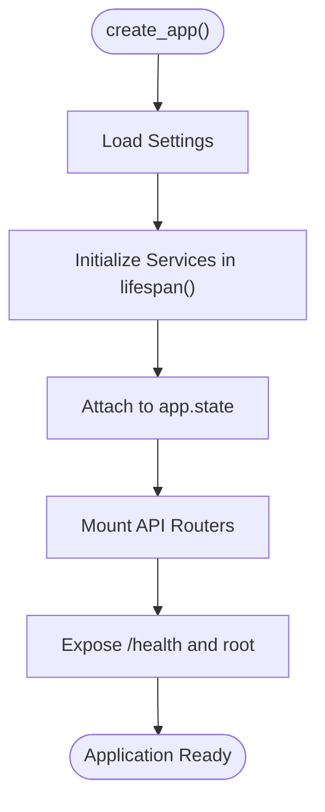

**Diagram sources**
- [chatbot_service/main.py:41-145](https://github.com/SafeVixAI/SafeVixAI/blob/main/chatbot_service/main.py#L41-L145)
- [chatbot_service/config.py:69-126](https://github.com/SafeVixAI/SafeVixAI/blob/main/chatbot_service/config.py#L69-L126)

**Section sources**
- [chatbot_service/main.py:41-145](https://github.com/SafeVixAI/SafeVixAI/blob/main/chatbot_service/main.py#L41-L145)
- [chatbot_service/config.py:69-126](https://github.com/SafeVixAI/SafeVixAI/blob/main/chatbot_service/config.py#L69-L126)

### Agent Orchestration (ChatEngine)
- Coordinates safety evaluation, intent detection, context assembly, provider routing, and memory persistence.
- Builds a de-duplicated sources list for provenance tracking.
- Exposes history retrieval and index rebuild/stats.

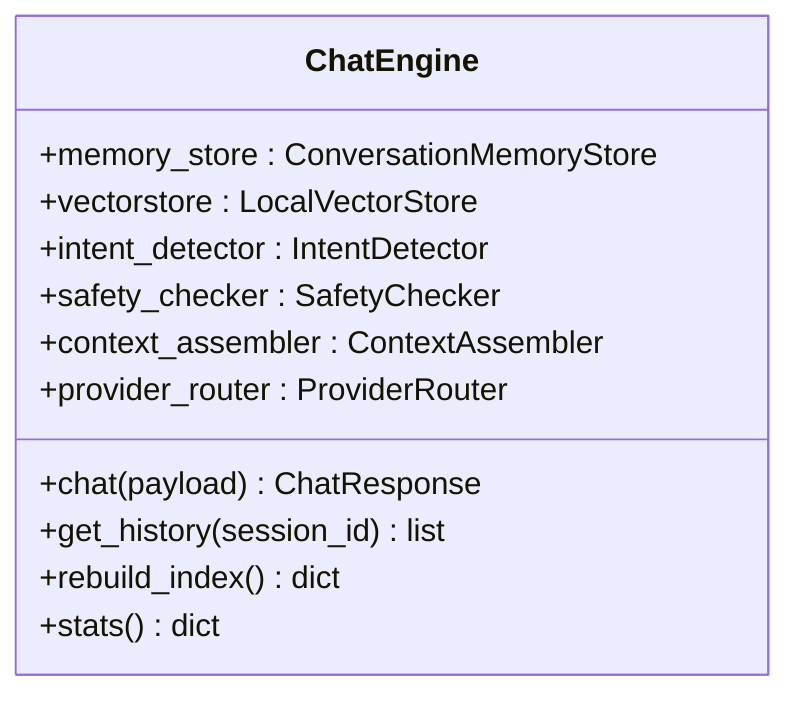

**Diagram sources**
- [chatbot_service/agent/graph.py:15-109](https://github.com/SafeVixAI/SafeVixAI/blob/main/chatbot_service/agent/graph.py#L15-L109)

**Section sources**
- [chatbot_service/agent/graph.py:15-109](https://github.com/SafeVixAI/SafeVixAI/blob/main/chatbot_service/agent/graph.py#L15-L109)

### Intent Detection
- Rule-based classifier categorizing user messages into emergency, first_aid, challan, legal, road_issue, or general.

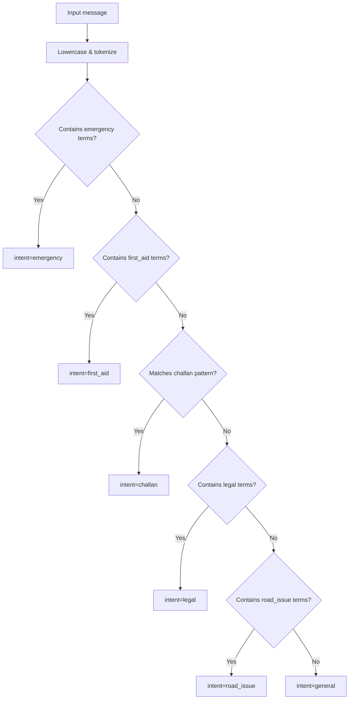

**Diagram sources**
- [chatbot_service/agent/intent_detector.py:9-25](https://github.com/SafeVixAI/SafeVixAI/blob/main/chatbot_service/agent/intent_detector.py#L9-L25)

**Section sources**
- [chatbot_service/agent/intent_detector.py:9-25](https://github.com/SafeVixAI/SafeVixAI/blob/main/chatbot_service/agent/intent_detector.py#L9-L25)

### Safety Checker
- Blocks harmful prompts and returns a policy-compliant response.

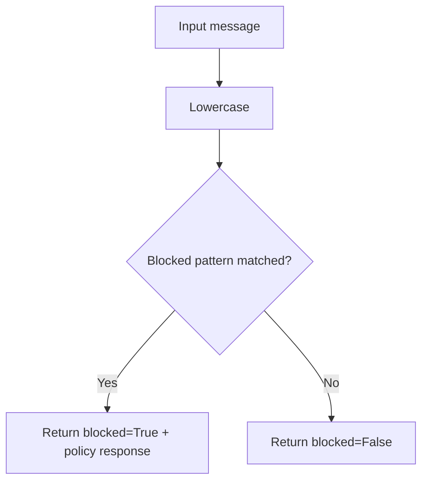

**Diagram sources**
- [chatbot_service/agent/safety_checker.py:12-31](https://github.com/SafeVixAI/SafeVixAI/blob/main/chatbot_service/agent/safety_checker.py#L12-L31)

**Section sources**
- [chatbot_service/agent/safety_checker.py:12-31](https://github.com/SafeVixAI/SafeVixAI/blob/main/chatbot_service/agent/safety_checker.py#L12-L31)

### Context Assembly
- Assembles ConversationContext with retrieved RAG snippets and tool outputs.
- Adds SOS, weather, first aid, challan, road infrastructure, road issues, and submission guidance depending on intent and coordinates.

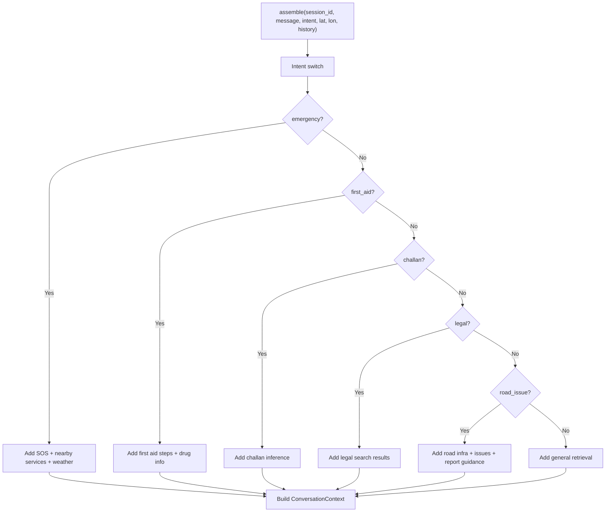

**Diagram sources**
- [chatbot_service/agent/context_assembler.py:43-81](https://github.com/SafeVixAI/SafeVixAI/blob/main/chatbot_service/agent/context_assembler.py#L43-L81)
- [chatbot_service/agent/context_assembler.py:83-215](https://github.com/SafeVixAI/SafeVixAI/blob/main/chatbot_service/agent/context_assembler.py#L83-L215)

**Section sources**
- [chatbot_service/agent/context_assembler.py:17-215](https://github.com/SafeVixAI/SafeVixAI/blob/main/chatbot_service/agent/context_assembler.py#L17-L215)

### Provider Routing and Language-Aware Selection
- Detects Indian language scripts and routes to specialized providers for legal and general queries.
- Implements a strict fallback chain across 9 providers with deterministic template fallback.
- Attaches routing metadata to results.

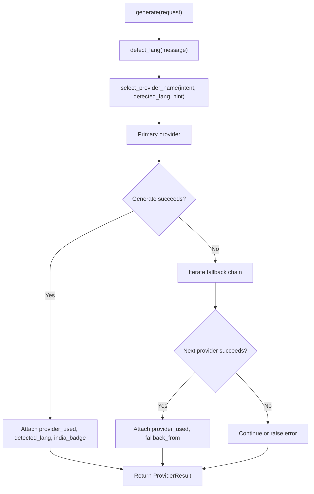

**Diagram sources**
- [chatbot_service/providers/router.py:48-73](https://github.com/SafeVixAI/SafeVixAI/blob/main/chatbot_service/providers/router.py#L48-L73)
- [chatbot_service/providers/router.py:125-153](https://github.com/SafeVixAI/SafeVixAI/blob/main/chatbot_service/providers/router.py#L125-L153)
- [chatbot_service/providers/router.py:154-199](https://github.com/SafeVixAI/SafeVixAI/blob/main/chatbot_service/providers/router.py#L154-L199)

**Section sources**
- [chatbot_service/providers/router.py:75-199](https://github.com/SafeVixAI/SafeVixAI/blob/main/chatbot_service/providers/router.py#L75-L199)
- [chatbot_service/providers/base.py:90-206](https://github.com/SafeVixAI/SafeVixAI/blob/main/chatbot_service/providers/base.py#L90-L206)

### Memory Management
- ConversationMemoryStore persists messages with timestamps and metadata.
- Supports Redis-backed storage with in-memory fallback and TTL.
- Provides health checks and graceful degradation.

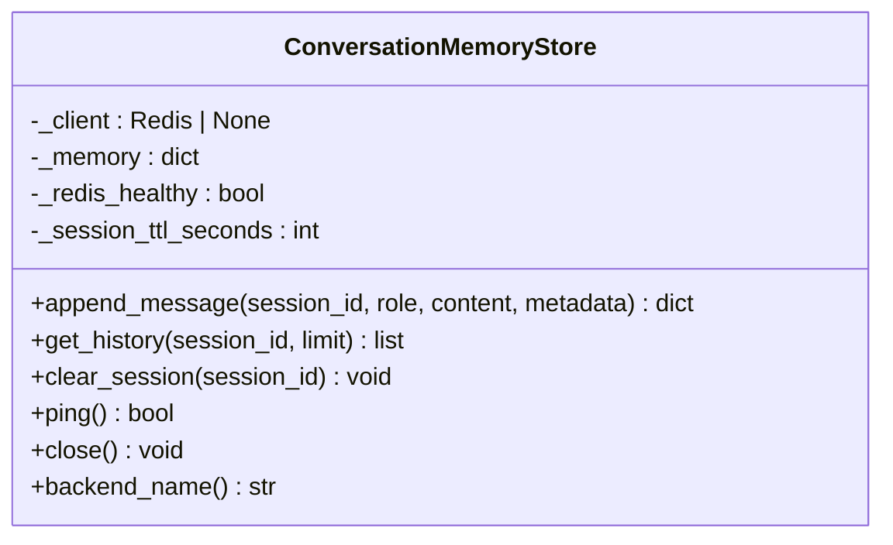

**Diagram sources**
- [chatbot_service/memory/redis_memory.py:10-90](https://github.com/SafeVixAI/SafeVixAI/blob/main/chatbot_service/memory/redis_memory.py#L10-L90)

**Section sources**
- [chatbot_service/memory/redis_memory.py:10-90](https://github.com/SafeVixAI/SafeVixAI/blob/main/chatbot_service/memory/redis_memory.py#L10-L90)

### RAG Pipeline
- LocalVectorStore loads and persists document chunks; builds index from data directory.
- Retriever performs semantic search with optional category scopes and top-k selection.
- Scoring and chunking strategies optimize relevance and context window fit.

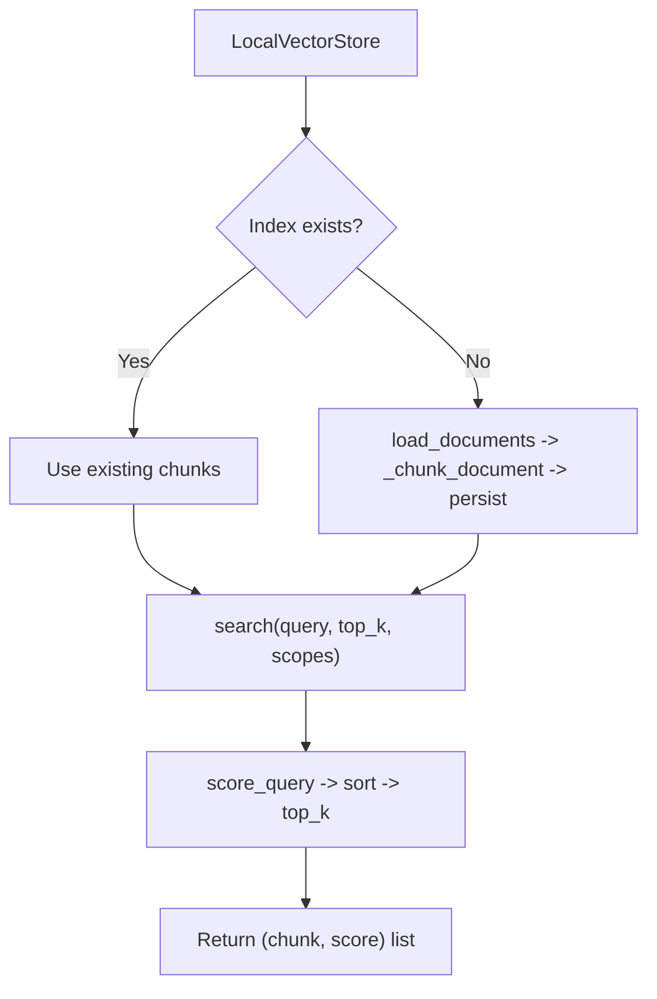

**Diagram sources**
- [chatbot_service/rag/vectorstore.py:20-110](https://github.com/SafeVixAI/SafeVixAI/blob/main/chatbot_service/rag/vectorstore.py#L20-L110)
- [chatbot_service/rag/retriever.py:17-40](https://github.com/SafeVixAI/SafeVixAI/blob/main/chatbot_service/rag/retriever.py#L17-L40)

**Section sources**
- [chatbot_service/rag/vectorstore.py:20-110](https://github.com/SafeVixAI/SafeVixAI/blob/main/chatbot_service/rag/vectorstore.py#L20-L110)
- [chatbot_service/rag/retriever.py:17-40](https://github.com/SafeVixAI/SafeVixAI/blob/main/chatbot_service/rag/retriever.py#L17-L40)

### API Surface
- Chat endpoints: blocking and streaming with SSE; streaming simulates token delivery for UX.
- History endpoint: retrieve conversation history for a session.
- Admin endpoints: health and rebuild index guarded by admin secret.

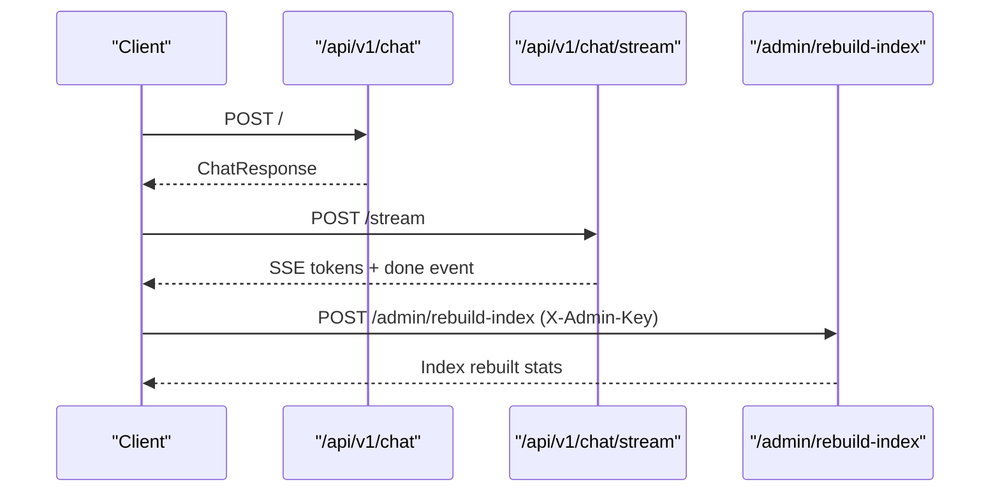

**Diagram sources**
- [chatbot_service/api/chat.py:28-97](https://github.com/SafeVixAI/SafeVixAI/blob/main/chatbot_service/api/chat.py#L28-L97)
- [chatbot_service/api/admin.py:45-52](https://github.com/SafeVixAI/SafeVixAI/blob/main/chatbot_service/api/admin.py#L45-L52)

**Section sources**
- [chatbot_service/api/chat.py:16-111](https://github.com/SafeVixAI/SafeVixAI/blob/main/chatbot_service/api/chat.py#L16-L111)
- [chatbot_service/api/admin.py:12-52](https://github.com/SafeVixAI/SafeVixAI/blob/main/chatbot_service/api/admin.py#L12-L52)

## Dependency Analysis
- Cohesion: Each module has a single responsibility (routing, memory, RAG, tools, agent orchestration).
- Coupling: Low coupling via dependency injection (app.state) and explicit constructor wiring.
- External dependencies: Redis, HTTP clients, vector store persistence, and multiple LLM providers.
- Provider abstractions: HttpProvider and TemplateProvider decouple routing logic from provider specifics.

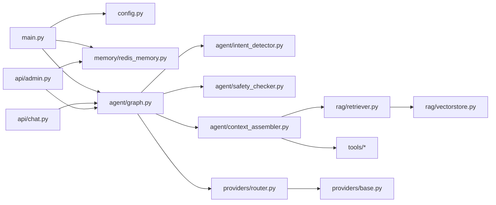

**Diagram sources**
- [chatbot_service/main.py:41-145](https://github.com/SafeVixAI/SafeVixAI/blob/main/chatbot_service/main.py#L41-L145)
- [chatbot_service/agent/graph.py:15-109](https://github.com/SafeVixAI/SafeVixAI/blob/main/chatbot_service/agent/graph.py#L15-L109)
- [chatbot_service/providers/router.py:75-199](https://github.com/SafeVixAI/SafeVixAI/blob/main/chatbot_service/providers/router.py#L75-L199)
- [chatbot_service/rag/retriever.py:17-40](https://github.com/SafeVixAI/SafeVixAI/blob/main/chatbot_service/rag/retriever.py#L17-L40)
- [chatbot_service/rag/vectorstore.py:20-110](https://github.com/SafeVixAI/SafeVixAI/blob/main/chatbot_service/rag/vectorstore.py#L20-L110)
- [chatbot_service/api/chat.py:16-111](https://github.com/SafeVixAI/SafeVixAI/blob/main/chatbot_service/api/chat.py#L16-L111)
- [chatbot_service/api/admin.py:12-52](https://github.com/SafeVixAI/SafeVixAI/blob/main/chatbot_service/api/admin.py#L12-L52)

**Section sources**
- [chatbot_service/main.py:41-145](https://github.com/SafeVixAI/SafeVixAI/blob/main/chatbot_service/main.py#L41-L145)
- [chatbot_service/agent/graph.py:15-109](https://github.com/SafeVixAI/SafeVixAI/blob/main/chatbot_service/agent/graph.py#L15-L109)
- [chatbot_service/providers/router.py:75-199](https://github.com/SafeVixAI/SafeVixAI/blob/main/chatbot_service/providers/router.py#L75-L199)
- [chatbot_service/rag/retriever.py:17-40](https://github.com/SafeVixAI/SafeVixAI/blob/main/chatbot_service/rag/retriever.py#L17-L40)
- [chatbot_service/rag/vectorstore.py:20-110](https://github.com/SafeVixAI/SafeVixAI/blob/main/chatbot_service/rag/vectorstore.py#L20-L110)
- [chatbot_service/api/chat.py:16-111](https://github.com/SafeVixAI/SafeVixAI/blob/main/chatbot_service/api/chat.py#L16-L111)
- [chatbot_service/api/admin.py:12-52](https://github.com/SafeVixAI/SafeVixAI/blob/main/chatbot_service/api/admin.py#L12-L52)

## Performance Considerations
- Streaming UX: Simulated streaming via word-delimited chunks to improve perceived latency.
- Prompt construction: Limits history length and response tokens to control cost and latency.
- Retrieval tuning: Adjustable top_k and category-scoped retrieval reduce noise and improve relevance.
- Provider fallback: Fast primary providers (e.g., Groq) with overflow to higher-throughput providers (e.g., Cerebras) maintain throughput.
- Memory TTL: Session expiration prevents unbounded growth; Redis health monitoring enables failback to in-memory storage.
- Indexing: On-demand index building and persistence minimize cold-start costs.

[No sources needed since this section provides general guidance]

## Troubleshooting Guide
- Health checks: Use /health for service readiness and memory backend status; use /admin/health for index and memory diagnostics.
- Admin rebuild: Trigger index rebuild with admin secret via /admin/rebuild-index.
- Rate limiting: Requests are throttled; excessive errors indicate misconfiguration or upstream provider issues.
- Safety blocks: Harmful prompts are rejected; adjust client messaging to align with policy.
- Provider errors: ProviderRouter falls back across providers; persistent failures indicate missing API keys or network issues.

**Section sources**
- [chatbot_service/main.py:106-115](https://github.com/SafeVixAI/SafeVixAI/blob/main/chatbot_service/main.py#L106-L115)
- [chatbot_service/api/admin.py:32-52](https://github.com/SafeVixAI/SafeVixAI/blob/main/chatbot_service/api/admin.py#L32-L52)
- [chatbot_service/agent/safety_checker.py:12-31](https://github.com/SafeVixAI/SafeVixAI/blob/main/chatbot_service/agent/safety_checker.py#L12-L31)
- [chatbot_service/providers/router.py:154-199](https://github.com/SafeVixAI/SafeVixAI/blob/main/chatbot_service/providers/router.py#L154-L199)

## Conclusion

> **Enterprise Hardening Notes:**
> - LLM calls wrapped in `asyncio.wait_for()` with configurable timeout
> - 13 agent tools (ChallanTool, DrugInfoTool, EmergencyTool, FirstAidTool, GeocodingClient, LegalSearchTool, OpenMeteoClient, RoadInfrastructureTool, RoadIssuesTool, SosTool, SubmitReportTool, WeatherTool, What3WordsTool)
> - 9 intent classes: emergency, first_aid, challan, legal, road_weather, safe_route, road_infrastructure, road_issue, general

The SafeVixAI Chatbot Service employs a clean, modular architecture centered on an agentic RAG pipeline. Dependency injection ensures robust initialization and lifecycle management, while intent detection, safety checks, and context assembly deliver precise, policy-compliant responses. The provider router’s language-aware routing and extensive fallback chain guarantee reliability, and the RAG stack with Redis-backed memory provides scalable, contextual assistance for road safety scenarios across India.

[No sources needed since this section summarizes without analyzing specific files]

## Appendices
- Endpoint summary:
  - Chat: POST /api/v1/chat/, POST /api/v1/chat/stream, GET /api/v1/chat/history/{session_id}, GET /api/v1/chat/health
  - Admin: GET /admin/health, POST /admin/rebuild-index
  - System: GET /health, GET /

**Section sources**
- [chatbot_service/api/chat.py:16-111](https://github.com/SafeVixAI/SafeVixAI/blob/main/chatbot_service/api/chat.py#L16-L111)
- [chatbot_service/api/admin.py:12-52](https://github.com/SafeVixAI/SafeVixAI/blob/main/chatbot_service/api/admin.py#L12-L52)
- [chatbot_service/main.py:106-142](https://github.com/SafeVixAI/SafeVixAI/blob/main/chatbot_service/main.py#L106-L142)