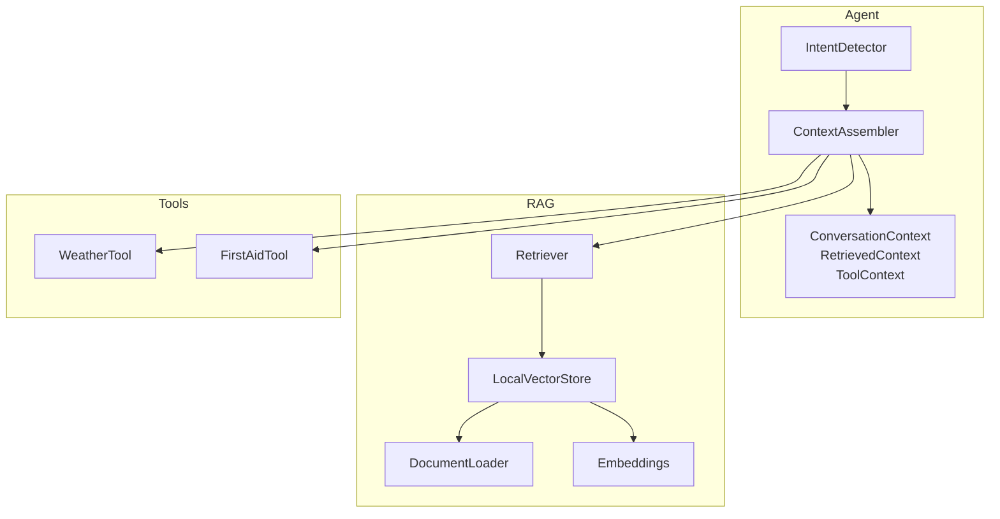
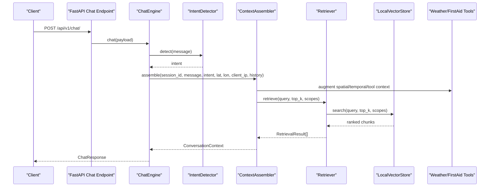
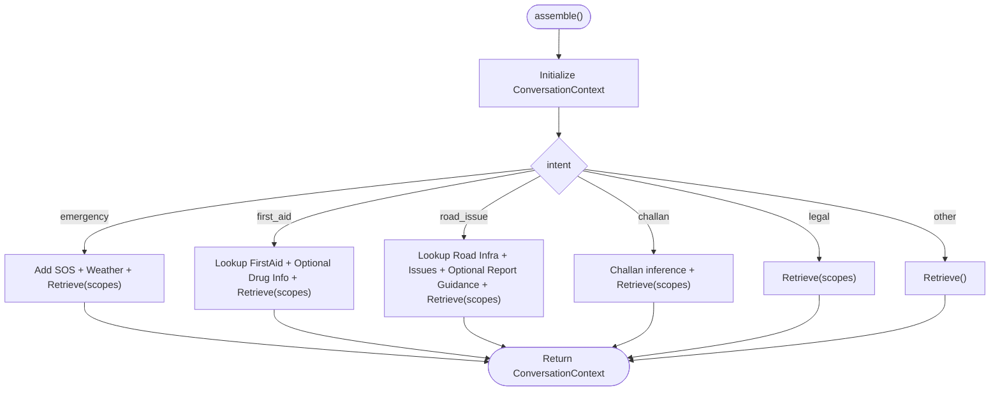
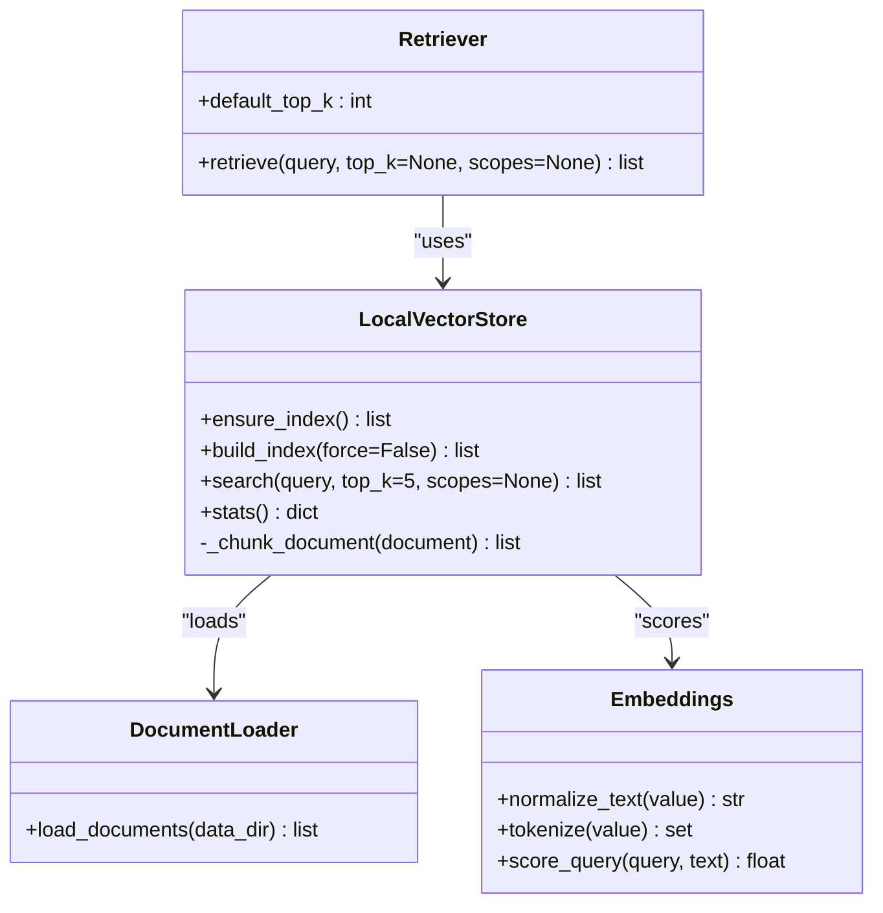
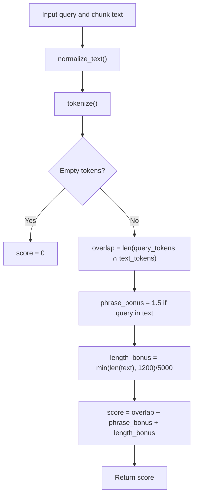
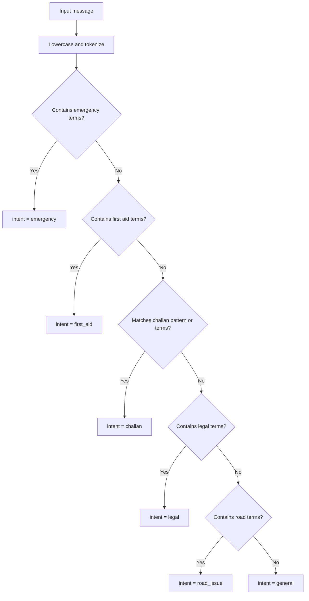
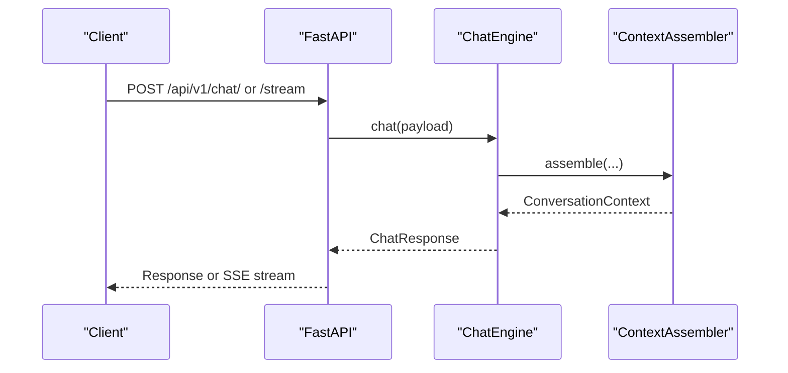
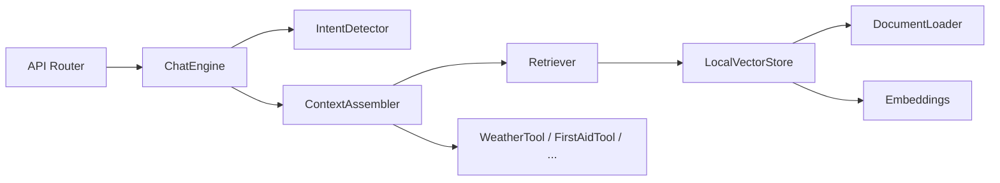

# Context Assembly Pipeline

<cite>
**Referenced Files in This Document**
- [context_assembler.py](file://chatbot_service/agent/context_assembler.py)
- [state.py](file://chatbot_service/agent/state.py)
- [intent_detector.py](file://chatbot_service/agent/intent_detector.py)
- [retriever.py](file://chatbot_service/rag/retriever.py)
- [vectorstore.py](file://chatbot_service/rag/vectorstore.py)
- [document_loader.py](file://chatbot_service/rag/document_loader.py)
- [embeddings.py](file://chatbot_service/rag/embeddings.py)
- [main.py](file://chatbot_service/main.py)
- [chat.py](file://chatbot_service/api/chat.py)
- [weather_tool.py](file://chatbot_service/tools/weather_tool.py)
- [first_aid_tool.py](file://chatbot_service/tools/first_aid_tool.py)
</cite>

## Table of Contents
1. [Introduction](#introduction)
2. [Project Structure](#project-structure)
3. [Core Components](#core-components)
4. [Architecture Overview](#architecture-overview)
5. [Detailed Component Analysis](#detailed-component-analysis)
6. [Dependency Analysis](#dependency-analysis)
7. [Performance Considerations](#performance-considerations)
8. [Troubleshooting Guide](#troubleshooting-guide)
9. [Conclusion](#conclusion)

## Introduction
This document explains the context assembly pipeline that prepares conversational context for LLM processing. It covers the retrieval-augmented generation workflow, including vector store querying, similarity search, and context chunking. It documents the integration with the local vector store, top-k retrieval configuration, and context formatting strategies. Examples illustrate how spatial context, temporal context, and conversational history are combined for different intent types. Guidance is also provided on context size optimization, relevance scoring, and performance tuning for large context windows.

## Project Structure
The context assembly pipeline spans several modules:
- Agent: orchestrates intent detection, context assembly, and tool augmentation
- RAG: vector store, retriever, document loading, and embeddings
- Tools: external and internal tools enriching context with real-time data
- API: exposes chat endpoints that trigger the pipeline

**Diagram sources**
- [context_assembler.py:17-81](file://chatbot_service/agent/context_assembler.py#L17-L81)
- [intent_detector.py:9-24](file://chatbot_service/agent/intent_detector.py#L9-L24)
- [retriever.py:17-39](file://chatbot_service/rag/retriever.py#L17-L39)
- [vectorstore.py:20-109](file://chatbot_service/rag/vectorstore.py#L20-L109)
- [document_loader.py:28-57](file://chatbot_service/rag/document_loader.py#L28-L57)
- [embeddings.py:17-30](file://chatbot_service/rag/embeddings.py#L17-L30)
- [weather_tool.py:15-33](file://chatbot_service/tools/weather_tool.py#L15-L33)
- [first_aid_tool.py:49-60](file://chatbot_service/tools/first_aid_tool.py#L49-L60)

**Section sources**
- [main.py:41-93](file://chatbot_service/main.py#L41-L93)
- [chat.py:24-40](file://chatbot_service/api/chat.py#L24-L40)

## Core Components
- ContextAssembler: central orchestrator that builds ConversationContext by combining:
  - Intent-specific tool augmentations (e.g., emergency services, weather, first aid, road infrastructure)
  - Retrieved context from the vector store via Retriever
- Retriever: wraps LocalVectorStore to perform similarity search with configurable top-k and category scopes
- LocalVectorStore: loads documents, chunks them, persists an index, and performs cosine-like scoring
- Embeddings: tokenization and scoring logic for relevance
- IntentDetector: determines intent to route context assembly and retrieval
- ConversationContext: unified data structure holding message, intent, spatial/temporal context, history, retrieved chunks, and tool outputs

Key configuration points:
- Top-k retrieval controlled by Retriever.default_top_k
- Category scoping via scopes parameter in retrieve()
- Chunking size threshold and paragraph splitting in LocalVectorStore
- Relevance scoring in embeddings.score_query()

**Section sources**
- [context_assembler.py:17-81](file://chatbot_service/agent/context_assembler.py#L17-L81)
- [retriever.py:17-39](file://chatbot_service/rag/retriever.py#L17-L39)
- [vectorstore.py:20-109](file://chatbot_service/rag/vectorstore.py#L20-L109)
- [embeddings.py:17-30](file://chatbot_service/rag/embeddings.py#L17-L30)
- [intent_detector.py:9-24](file://chatbot_service/agent/intent_detector.py#L9-L24)
- [state.py:24-51](file://chatbot_service/agent/state.py#L24-L51)

## Architecture Overview
The pipeline begins at the API endpoint, which delegates to the ChatEngine. The ChatEngine detects intent, invokes ContextAssembler, and then feeds the assembled context to the LLM provider. ContextAssembler augments the base message with:
- Spatial context: lat/lon for weather and SOS lookups
- Temporal context: weather summaries
- Conversational history: passed through ConversationContext.history
- Retrieved context: top-k chunks filtered by intent-specific categories
- Tool context: structured summaries and payloads from domain tools

**Diagram sources**
- [chat.py:28-40](file://chatbot_service/api/chat.py#L28-L40)
- [intent_detector.py:10-24](file://chatbot_service/agent/intent_detector.py#L10-L24)
- [context_assembler.py:43-81](file://chatbot_service/agent/context_assembler.py#L43-L81)
- [retriever.py:22-39](file://chatbot_service/rag/retriever.py#L22-L39)
- [vectorstore.py:51-67](file://chatbot_service/rag/vectorstore.py#L51-L67)
- [weather_tool.py:24-33](file://chatbot_service/tools/weather_tool.py#L24-L33)
- [first_aid_tool.py:54-60](file://chatbot_service/tools/first_aid_tool.py#L54-L60)

## Detailed Component Analysis

### ContextAssembler
Responsibilities:
- Build ConversationContext from incoming request fields
- Add intent-specific tool context:
  - Emergency: nearby services, emergency numbers, What3Words, and weather
  - First Aid: curated first aid steps and optional drug info extraction
  - Road Issue: road authority and nearby issues; optionally submission guidance
  - Challan: legal fine inference
- Append top-k retrieved chunks to context.retrieved, capped to 5 items and truncated snippets

Processing logic highlights:
- Scope-based retrieval routed by intent (e.g., emergency → medical/emergency/hospitals)
- Tool context payloads enriched with sources for provenance
- Snippet truncation to ~320 chars and category inclusion for downstream filtering

**Diagram sources**
- [context_assembler.py:43-81](file://chatbot_service/agent/context_assembler.py#L43-L81)
- [context_assembler.py:203-215](file://chatbot_service/agent/context_assembler.py#L203-L215)

**Section sources**
- [context_assembler.py:17-81](file://chatbot_service/agent/context_assembler.py#L17-L81)
- [context_assembler.py:203-215](file://chatbot_service/agent/context_assembler.py#L203-L215)

### Retriever and LocalVectorStore
- Retriever
  - Wraps LocalVectorStore
  - Exposes retrieve(query, top_k, scopes) returning RetrievalResult list
  - Default top_k configured at construction time
- LocalVectorStore
  - Loads documents from data_dir excluding ChromaDB directory
  - Chunks documents into ~900 char segments with paragraph-aware splitting
  - Persists index to JSON for reuse
  - search(query, top_k, scopes) filters by category and scores with embeddings.score_query()
  - Returns ranked pairs of (chunk, score)

**Diagram sources**
- [retriever.py:17-39](file://chatbot_service/rag/retriever.py#L17-L39)
- [vectorstore.py:20-109](file://chatbot_service/rag/vectorstore.py#L20-L109)
- [document_loader.py:28-57](file://chatbot_service/rag/document_loader.py#L28-L57)
- [embeddings.py:9-30](file://chatbot_service/rag/embeddings.py#L9-L30)

**Section sources**
- [retriever.py:17-39](file://chatbot_service/rag/retriever.py#L17-L39)
- [vectorstore.py:20-109](file://chatbot_service/rag/vectorstore.py#L20-L109)
- [document_loader.py:28-57](file://chatbot_service/rag/document_loader.py#L28-L57)
- [embeddings.py:17-30](file://chatbot_service/rag/embeddings.py#L17-L30)

### Embedding and Scoring
- Tokenization uses a simple pattern to extract alpha sequences
- Overlap-based similarity score plus phrase bonus when query appears in text
- Normalized length bonus to favor longer relevant texts up to a cap
- Text normalization reduces whitespace and cleans inputs

**Diagram sources**
- [embeddings.py:17-30](file://chatbot_service/rag/embeddings.py#L17-L30)

**Section sources**
- [embeddings.py:17-30](file://chatbot_service/rag/embeddings.py#L17-L30)

### Intent Detection and Routing
- Detects intent based on keyword heuristics
- Routes to intent-specific context assembly and retrieval scopes
- Defaults to general retrieval when no intent matches

**Diagram sources**
- [intent_detector.py:10-24](file://chatbot_service/agent/intent_detector.py#L10-L24)

**Section sources**
- [intent_detector.py:9-24](file://chatbot_service/agent/intent_detector.py#L9-L24)

### API Integration and Execution
- FastAPI routes accept chat requests and forward to ChatEngine
- Streaming endpoint simulates token streaming for UX
- Health and admin endpoints support operational checks

**Diagram sources**
- [chat.py:28-97](file://chatbot_service/api/chat.py#L28-L97)
- [main.py:41-93](file://chatbot_service/main.py#L41-L93)

**Section sources**
- [chat.py:28-97](file://chatbot_service/api/chat.py#L28-L97)
- [main.py:41-93](file://chatbot_service/main.py#L41-L93)

## Dependency Analysis
- ContextAssembler depends on Retriever and multiple tools for augmentation
- Retriever depends on LocalVectorStore
- LocalVectorStore depends on DocumentLoader and Embeddings
- API depends on ChatEngine, which depends on IntentDetector, SafetyChecker, ContextAssembler, and ProviderRouter
- Runtime configuration sets default top_k and persistence paths

**Diagram sources**
- [main.py:41-93](file://chatbot_service/main.py#L41-L93)
- [context_assembler.py:17-41](file://chatbot_service/agent/context_assembler.py#L17-L41)
- [retriever.py:17-39](file://chatbot_service/rag/retriever.py#L17-L39)
- [vectorstore.py:20-49](file://chatbot_service/rag/vectorstore.py#L20-L49)
- [document_loader.py:28-57](file://chatbot_service/rag/document_loader.py#L28-L57)
- [embeddings.py:17-30](file://chatbot_service/rag/embeddings.py#L17-L30)

**Section sources**
- [main.py:41-93](file://chatbot_service/main.py#L41-L93)

## Performance Considerations
- Indexing and chunking
  - Ensure index exists once and reuse across queries to avoid repeated indexing overhead
  - Tune chunk size to balance recall and context window limits; current ~900 chars per chunk
- Retrieval
  - Adjust default_top_k in Retriever to control candidate count; higher k increases latency but may improve recall
  - Use scopes to constrain search to relevant categories per intent
- Scoring
  - The scoring function favors overlap and phrase presence; consider adding BM25-style IDF weighting for better long-tail relevance
- Context trimming
  - Limit retrieved context to top-k and truncate snippets to ~320 chars to fit model context windows
- Concurrency and streaming
  - Use streaming responses to improve perceived latency; the API already supports SSE streaming
- Memory and persistence
  - Persist vector index to disk to avoid rebuild on startup
  - Monitor chunk counts and categories via stats for maintenance

[No sources needed since this section provides general guidance]

## Troubleshooting Guide
Common issues and resolutions:
- Empty or low-relevance retrieval
  - Verify data_dir contents and ensure documents are loaded; check category scoping and top_k
  - Confirm that normalize_text and tokenize produce non-empty results
- Slow response times
  - Reduce top_k or enable category scopes to narrow search
  - Ensure index is persisted and reused
- Incorrect intent routing
  - Review keyword patterns in IntentDetector and adjust thresholds or add new patterns
- Tool failures (e.g., weather)
  - Check API keys and network connectivity; the WeatherTool falls back gracefully
- Context overflow
  - Reduce top_k or snippet length; ensure downstream LLM receives manageable context sizes

**Section sources**
- [vectorstore.py:27-49](file://chatbot_service/rag/vectorstore.py#L27-L49)
- [embeddings.py:17-30](file://chatbot_service/rag/embeddings.py#L17-L30)
- [context_assembler.py:203-215](file://chatbot_service/agent/context_assembler.py#L203-L215)
- [weather_tool.py:24-33](file://chatbot_service/tools/weather_tool.py#L24-L33)

## Conclusion
The context assembly pipeline integrates intent-driven tool augmentation with a local vector store to deliver targeted, timely, and concise context for LLMs. By leveraging category-scoped retrieval, snippet truncation, and structured tool outputs, it balances relevance and performance. Tuning top-k, chunk size, and scoring can further optimize accuracy and latency for large context windows.