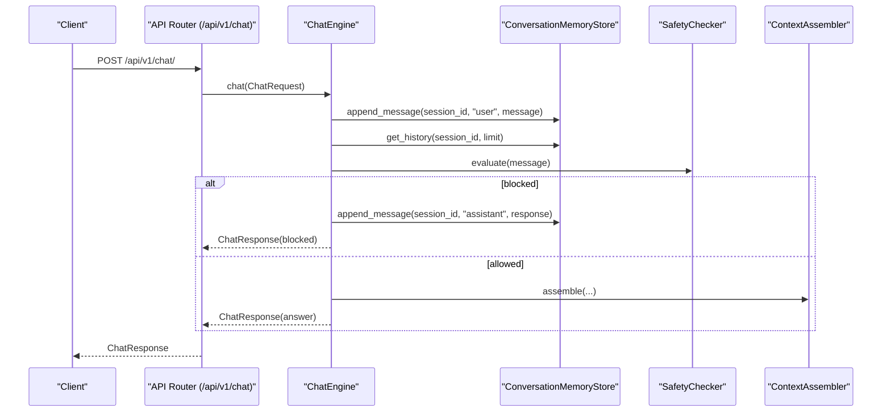
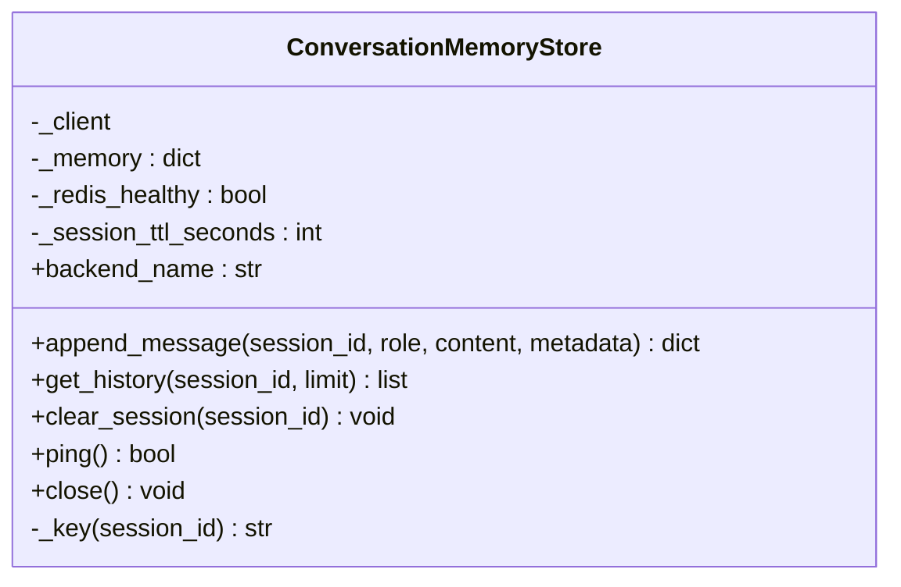
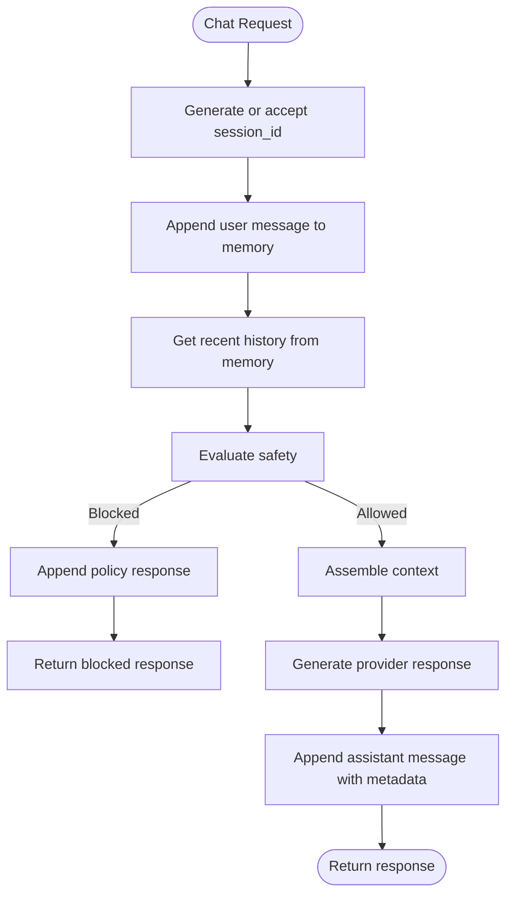
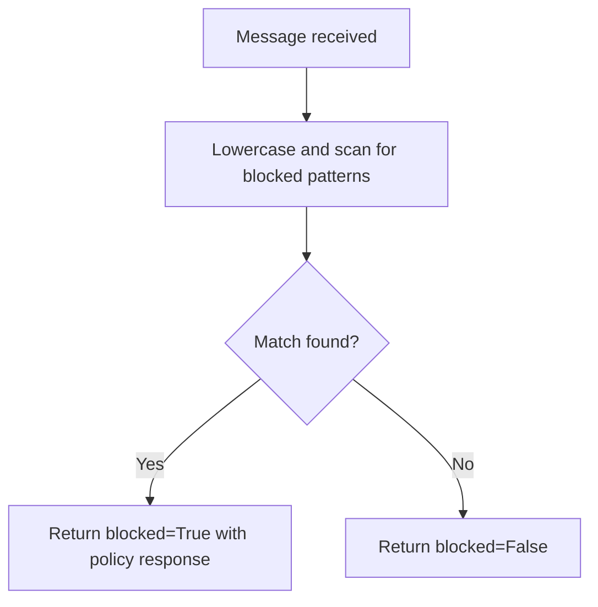
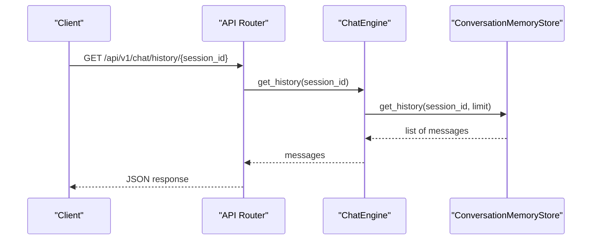
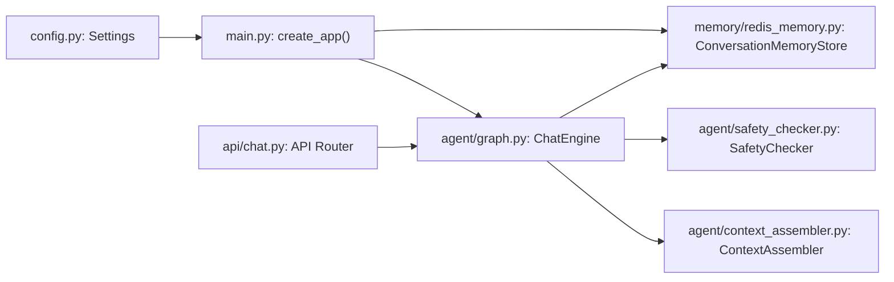

# Conversation Memory Management

<cite>
**Referenced Files in This Document**
- [redis_memory.py](file://chatbot_service/memory/redis_memory.py)
- [main.py](file://chatbot_service/main.py)
- [config.py](file://chatbot_service/config.py)
- [graph.py](file://chatbot_service/agent/graph.py)
- [context_assembler.py](file://chatbot_service/agent/context_assembler.py)
- [safety_checker.py](file://chatbot_service/agent/safety_checker.py)
- [chat.py](file://chatbot_service/api/chat.py)
- [state.py](file://chatbot_service/agent/state.py)
- [.env.example](file://chatbot_service/.env.example)
- [redis_client.py](file://backend/core/redis_client.py)
</cite>

## Table of Contents
1. [Introduction](#introduction)
2. [Project Structure](#project-structure)
3. [Core Components](#core-components)
4. [Architecture Overview](#architecture-overview)
5. [Detailed Component Analysis](#detailed-component-analysis)
6. [Dependency Analysis](#dependency-analysis)
7. [Performance Considerations](#performance-considerations)
8. [Troubleshooting Guide](#troubleshooting-guide)
9. [Conclusion](#conclusion)
10. [Appendices](#appendices)

## Introduction
This document explains the conversation memory management system powered by Redis for the chatbot service. It covers session-based memory storage, TTL management, conversation state persistence, the memory store interface, serialization strategies, cleanup mechanisms, and integration with the chat engine. It also documents safety checker integration, memory scrubbing considerations for sensitive information, optimization techniques, storage efficiency, and scalability for concurrent sessions.

## Project Structure
The memory subsystem resides under the chatbot service and integrates with the FastAPI application lifecycle, the chat engine, and the safety checker. Configuration is loaded via environment variables and injected into the application factory.

```mermaid
graph TB
subgraph "Chatbot Service"
A["main.py<br/>Application Factory"]
B["config.py<br/>Settings Loader"]
C["memory/redis_memory.py<br/>ConversationMemoryStore"]
D["agent/graph.py<br/>ChatEngine"]
E["agent/context_assembler.py<br/>ContextAssembler"]
F["agent/safety_checker.py<br/>SafetyChecker"]
G["api/chat.py<br/>Chat Endpoints"]
H["agent/state.py<br/>ChatRequest/ChatResponse"]
end
subgraph "External"
R["Redis"]
end
A --> B
A --> C
A --> D
D --> C
D --> E
D --> F
G --> D
H --> G
C <- --> R
```

**Diagram sources**
- [main.py:41-93](file://chatbot_service/main.py#L41-L93)
- [config.py:69-113](file://chatbot_service/config.py#L69-L113)
- [redis_memory.py:10-89](file://chatbot_service/memory/redis_memory.py#L10-L89)
- [graph.py:15-32](file://chatbot_service/agent/graph.py#L15-L32)
- [context_assembler.py:17-81](file://chatbot_service/agent/context_assembler.py#L17-L81)
- [safety_checker.py:12-30](file://chatbot_service/agent/safety_checker.py#L12-L30)
- [chat.py:24-40](file://chatbot_service/api/chat.py#L24-L40)
- [state.py:9-21](file://chatbot_service/agent/state.py#L9-L21)

**Section sources**
- [main.py:41-93](file://chatbot_service/main.py#L41-L93)
- [config.py:69-113](file://chatbot_service/config.py#L69-L113)

## Core Components
- ConversationMemoryStore: Provides asynchronous append, retrieval, and cleanup of conversation messages per session, with Redis-backed persistence and in-memory fallback.
- ChatEngine: Orchestrates chat requests, integrates memory, safety, intent detection, and context assembly.
- SafetyChecker: Evaluates incoming messages and decides whether to block or allow processing.
- ContextAssembler: Builds contextual retrieval and tool payloads for the current message.
- API Layer: Exposes chat endpoints that delegate to ChatEngine.

Key responsibilities:
- Session-based storage keyed by session_id.
- TTL-driven automatic expiration of session data.
- Serialization of message payloads to JSON for Redis storage.
- Health-aware fallback to in-memory storage when Redis is unavailable.
- Cleanup via explicit deletion and TTL expiry.

**Section sources**
- [redis_memory.py:10-89](file://chatbot_service/memory/redis_memory.py#L10-L89)
- [graph.py:15-87](file://chatbot_service/agent/graph.py#L15-L87)
- [safety_checker.py:12-30](file://chatbot_service/agent/safety_checker.py#L12-L30)
- [context_assembler.py:17-81](file://chatbot_service/agent/context_assembler.py#L17-L81)
- [chat.py:28-40](file://chatbot_service/api/chat.py#L28-L40)

## Architecture Overview
The memory store is initialized during application startup and attached to the app state. Chat requests flow through the API layer into the ChatEngine, which uses the memory store to persist user and assistant turns, retrieve recent history, and optionally block unsafe content.



**Diagram sources**
- [chat.py:28-40](file://chatbot_service/api/chat.py#L28-L40)
- [graph.py:33-87](file://chatbot_service/agent/graph.py#L33-L87)
- [redis_memory.py:23-56](file://chatbot_service/memory/redis_memory.py#L23-L56)
- [safety_checker.py:13-30](file://chatbot_service/agent/safety_checker.py#L13-L30)
- [context_assembler.py:43-81](file://chatbot_service/agent/context_assembler.py#L43-L81)

## Detailed Component Analysis

### ConversationMemoryStore
Responsibilities:
- Append new message entries with role, content, metadata, and timestamp.
- Retrieve recent conversation history with configurable limits.
- Clear session data explicitly.
- Health-check Redis connectivity and gracefully fall back to in-memory storage.
- Close Redis connections cleanly.

Storage model:
- Each session_id maps to a Redis list (LPUSH/RPUSH) storing serialized JSON entries.
- Keys are prefixed consistently for isolation.
- TTL is set on each session key to expire inactive conversations.

Serialization:
- Python dicts are JSON-encoded before storage and decoded upon retrieval.
- Timestamps are ISO-format UTC strings.

Concurrency and resilience:
- Uses async Redis client.
- On Redis failure, sets a health flag and continues using in-memory fallback.
- Health state is reset on successful operations.



**Diagram sources**
- [redis_memory.py:10-89](file://chatbot_service/memory/redis_memory.py#L10-L89)

**Section sources**
- [redis_memory.py:10-89](file://chatbot_service/memory/redis_memory.py#L10-L89)

### ChatEngine Integration
The ChatEngine coordinates memory operations around chat processing:
- Generates a session_id if none is provided.
- Persists user message immediately.
- Retrieves recent history for context.
- Runs safety evaluation; if blocked, persists the policy response and returns.
- Otherwise, assembles context and generates a provider response, then persists assistant message with metadata.



**Diagram sources**
- [graph.py:33-87](file://chatbot_service/agent/graph.py#L33-L87)
- [redis_memory.py:23-81](file://chatbot_service/memory/redis_memory.py#L23-L81)

**Section sources**
- [graph.py:15-87](file://chatbot_service/agent/graph.py#L15-L87)

### Safety Checker Integration
The SafetyChecker evaluates incoming messages and returns a decision to block or allow. If blocked, the ChatEngine appends a policy-compliant response to memory and returns early.

- Decision model: blocked flag and optional response text.
- Patterns checked include harmful or manipulative queries.
- Integration ensures that unsafe content never reaches downstream tools or providers.



**Diagram sources**
- [safety_checker.py:13-30](file://chatbot_service/agent/safety_checker.py#L13-L30)

**Section sources**
- [safety_checker.py:12-30](file://chatbot_service/agent/safety_checker.py#L12-L30)
- [graph.py:38-46](file://chatbot_service/agent/graph.py#L38-L46)

### API Endpoints and Memory Usage
- POST /api/v1/chat/: Standard chat endpoint delegates to ChatEngine.
- POST /api/v1/chat/stream: Simulated streaming endpoint that still uses ChatEngine internally.
- GET /api/v1/chat/history/{session_id}: Returns persisted history for a session.



**Diagram sources**
- [chat.py:100-105](file://chatbot_service/api/chat.py#L100-L105)
- [graph.py:89-90](file://chatbot_service/agent/graph.py#L89-L90)
- [redis_memory.py:46-56](file://chatbot_service/memory/redis_memory.py#L46-L56)

**Section sources**
- [chat.py:28-40](file://chatbot_service/api/chat.py#L28-L40)
- [chat.py:100-105](file://chatbot_service/api/chat.py#L100-L105)

### Memory Operations Examples
- Basic chat session:
  - Append user message.
  - Retrieve last N messages for context.
  - Append assistant response with metadata (intent, sources).
- Blocked content:
  - Append user message.
  - Safety checker blocks; append policy response.
- Emergency context:
  - Append user message.
  - Retrieve recent history.
  - Assemble emergency context (nearby services, weather).
  - Append assistant response with tool and knowledge sources.

These flows are orchestrated by the ChatEngine and backed by ConversationMemoryStore.

**Section sources**
- [graph.py:33-87](file://chatbot_service/agent/graph.py#L33-L87)
- [context_assembler.py:43-81](file://chatbot_service/agent/context_assembler.py#L43-L81)
- [redis_memory.py:23-81](file://chatbot_service/memory/redis_memory.py#L23-L81)

### Serialization Strategies
- Message payloads are serialized to JSON before storage and deserialized on retrieval.
- Timestamps are stored as ISO-format UTC strings for consistent ordering.
- Metadata is preserved as a dictionary and stored alongside the message.

Efficiency considerations:
- JSON serialization is straightforward and compatible with Redis.
- Payloads include minimal fields to reduce storage overhead.

**Section sources**
- [redis_memory.py:23-56](file://chatbot_service/memory/redis_memory.py#L23-L56)

### Cleanup Mechanisms
- Explicit session clearing: deletes the Redis key for a session.
- TTL-based cleanup: sets expiration on each session key; inactive sessions are automatically removed by Redis.
- Health-aware fallback: when Redis is down, operations continue in-memory; TTL semantics apply only when Redis is healthy.

Operational hygiene:
- Application lifecycle closes Redis connections on shutdown.
- Health endpoint surfaces memory backend availability.

**Section sources**
- [redis_memory.py:58-85](file://chatbot_service/memory/redis_memory.py#L58-L85)
- [main.py:106-115](file://chatbot_service/main.py#L106-L115)

## Dependency Analysis
- Application initialization creates a ConversationMemoryStore and attaches it to app state.
- ChatEngine depends on ConversationMemoryStore, SafetyChecker, ContextAssembler, and ProviderRouter.
- API layer depends on ChatEngine for chat operations.
- Configuration drives Redis URL and session TTL.



**Diagram sources**
- [config.py:69-113](file://chatbot_service/config.py#L69-L113)
- [main.py:41-93](file://chatbot_service/main.py#L41-L93)
- [redis_memory.py:10-15](file://chatbot_service/memory/redis_memory.py#L10-L15)
- [graph.py:15-32](file://chatbot_service/agent/graph.py#L15-L32)
- [safety_checker.py:12-30](file://chatbot_service/agent/safety_checker.py#L12-L30)
- [context_assembler.py:17-41](file://chatbot_service/agent/context_assembler.py#L17-L41)
- [chat.py:24-40](file://chatbot_service/api/chat.py#L24-L40)

**Section sources**
- [main.py:41-93](file://chatbot_service/main.py#L41-L93)
- [graph.py:15-32](file://chatbot_service/agent/graph.py#L15-L32)

## Performance Considerations
- Storage efficiency:
  - Use compact message payloads; avoid unnecessary metadata.
  - Keep session TTL aligned with expected session length to minimize stale data.
- Scalability:
  - Redis list operations (RPUSH/LRANGE) are efficient for recent-message retrieval.
  - Consider sharding by session_id prefix if operating at very large scale.
- Concurrency:
  - Async Redis client supports concurrent operations; ensure proper connection pooling.
  - Limit history window (limit parameter) to balance context quality and latency.
- Memory footprint:
  - In-memory fallback is lightweight but not persistent; monitor for hot keys.
- Throughput:
  - Batch operations are not used; each append triggers RPUSH and EXPIRE.
  - For high-throughput scenarios, consider batching appends and using pipeline commands.

[No sources needed since this section provides general guidance]

## Troubleshooting Guide
Common issues and remedies:
- Redis connectivity failures:
  - Symptoms: backend_name switches to redis+memory, memory operations succeed but Redis writes fail.
  - Actions: verify REDIS_URL, network reachability, and credentials; check health endpoint.
- Session not found or empty history:
  - Verify session_id correctness and that messages were appended.
  - Confirm TTL is not too short for interactive sessions.
- Unexpected blocking:
  - Review SafetyChecker patterns and adjust if needed.
- Health endpoint returns memory_unavailable:
  - Inspect Redis health and logs; ensure app lifecycle closes connections properly.

Operational checks:
- Use GET /api/v1/chat/history/{session_id} to inspect stored messages.
- Monitor backend_name via application logs and health checks.

**Section sources**
- [redis_memory.py:17-21](file://chatbot_service/memory/redis_memory.py#L17-L21)
- [main.py:106-115](file://chatbot_service/main.py#L106-L115)
- [chat.py:100-105](file://chatbot_service/api/chat.py#L100-L105)

## Conclusion
The conversation memory system provides robust, session-based persistence with Redis as the primary backend and a resilient in-memory fallback. It integrates tightly with the chat engine, safety checker, and context assembler to deliver secure, contextual, and scalable conversational experiences. Proper configuration of Redis URL and session TTL, combined with careful message serialization and TTL-based cleanup, ensures efficient operation and strong reliability.

[No sources needed since this section summarizes without analyzing specific files]

## Appendices

### Configuration Reference
- REDIS_URL: Optional Redis connection string; when absent, memory fallback is used.
- SESSION_TTL_SECONDS: Controls automatic expiration of session data.

Environment template:
- See [REDIS_URL](file://chatbot_service/.env.example#L18) and [SESSION_TTL_SECONDS](file://chatbot_service/.env.example#L56) usage in settings loader.

**Section sources**
- [.env.example:18](file://chatbot_service/.env.example#L18)
- [config.py:108](file://chatbot_service/config.py#L108)

### Related Redis Utilities
- Backend cache helper demonstrates JSON serialization, TTL handling, and health-aware fallback for Redis-backed caching. Useful for understanding complementary patterns in the system.

**Section sources**
- [redis_client.py:43-80](file://backend/core/redis_client.py#L43-L80)