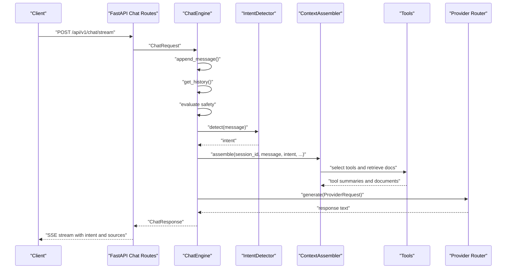
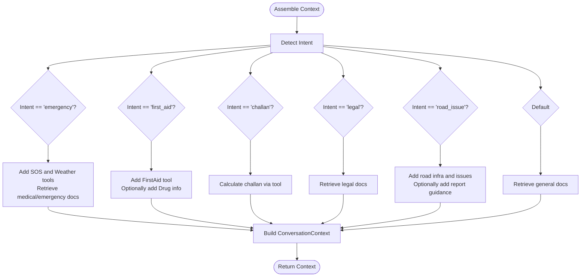
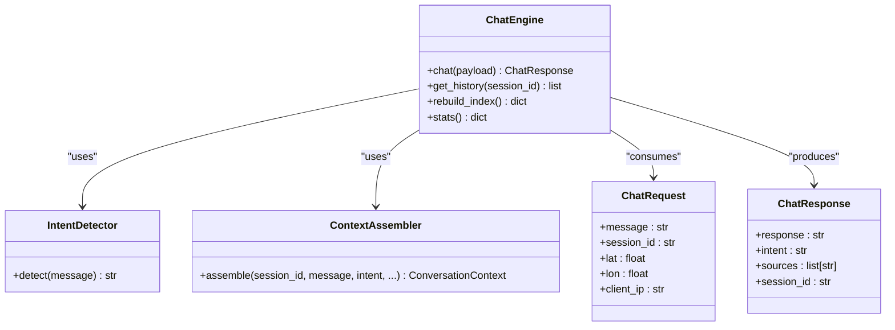

# Intent Detection System

<cite>
**Referenced Files in This Document**
- [intent_detector.py](https://github.com/SafeVixAI/SafeVixAI/blob/main/chatbot_service/agent/intent_detector.py)
- [graph.py](https://github.com/SafeVixAI/SafeVixAI/blob/main/chatbot_service/agent/graph.py)
- [context_assembler.py](https://github.com/SafeVixAI/SafeVixAI/blob/main/chatbot_service/agent/context_assembler.py)
- [state.py](https://github.com/SafeVixAI/SafeVixAI/blob/main/chatbot_service/agent/state.py)
- [chat.py](https://github.com/SafeVixAI/SafeVixAI/blob/main/chatbot_service/api/chat.py)
- [test_intent.py](https://github.com/SafeVixAI/SafeVixAI/blob/main/chatbot_service/tests/test_intent.py)
- [challan_tool.py](https://github.com/SafeVixAI/SafeVixAI/blob/main/chatbot_service/tools/challan_tool.py)
- [first_aid_tool.py](https://github.com/SafeVixAI/SafeVixAI/blob/main/chatbot_service/tools/first_aid_tool.py)
</cite>

## Table of Contents
1. [Introduction](#introduction)
2. [Project Structure](#project-structure)
3. [Core Components](#core-components)
4. [Architecture Overview](#architecture-overview)
5. [Detailed Component Analysis](#detailed-component-analysis)
6. [Dependency Analysis](#dependency-analysis)
7. [Performance Considerations](#performance-considerations)
8. [Troubleshooting Guide](#troubleshooting-guide)
9. [Conclusion](#conclusion)
10. [Appendices](#appendices)

## Introduction

> **Updated:** The intent detector now classifies into nine categories: `emergency`, `first_aid`, `challan`, `legal`, `road_weather`, `safe_route`, `road_infrastructure`, `road_issue`, and `general`. Three categories (`road_weather`, `safe_route`, `road_infrastructure`) were added during enterprise hardening.

This document describes the intent detection system used by the SafeVixAI chatbot to classify user queries into nine distinct categories. The system is designed to route incoming messages to appropriate tools and retrieval mechanisms to generate accurate, context-aware responses. It includes a rule-based intent classifier, a classification pipeline, integration with the chat engine, and a structured tool selection mechanism that influences response generation.

## Project Structure
The intent detection system resides in the chatbot service and integrates with the broader chat engine. Key components include:
- Intent detection module: a rule-based classifier that assigns intents to user messages.
- Chat engine: orchestrates safety checks, intent detection, context assembly, and provider generation.
- Context assembler: selects tools and retrieves documents based on detected intent.
- API layer: exposes endpoints for chat and streaming responses.
- Tests: validate intent classification behavior.

```mermaid
graph TB
subgraph "Agent Layer"
ID["IntentDetector"]
CA["ContextAssembler"]
CE["ChatEngine"]
ST["State Models"]
end
subgraph "Tools"
CT["ChallanTool"]
FAT["FirstAidTool"]
end
subgraph "API"
API["FastAPI Chat Routes"]
end
API --> CE
CE --> ID
CE --> CA
CA --> CT
CA --> FAT
CE --> ST
```

**Diagram sources**
- [graph.py:15-87](https://github.com/SafeVixAI/SafeVixAI/blob/main/chatbot_service/agent/graph.py#L15-L87)
- [intent_detector.py:9-24](https://github.com/SafeVixAI/SafeVixAI/blob/main/chatbot_service/agent/intent_detector.py#L9-L24)
- [context_assembler.py:17-81](https://github.com/SafeVixAI/SafeVixAI/blob/main/chatbot_service/agent/context_assembler.py#L17-L81)
- [chat.py:28-97](https://github.com/SafeVixAI/SafeVixAI/blob/main/chatbot_service/api/chat.py#L28-L97)

**Section sources**
- [graph.py:15-87](https://github.com/SafeVixAI/SafeVixAI/blob/main/chatbot_service/agent/graph.py#L15-L87)
- [intent_detector.py:9-24](https://github.com/SafeVixAI/SafeVixAI/blob/main/chatbot_service/agent/intent_detector.py#L9-L24)
- [context_assembler.py:17-81](https://github.com/SafeVixAI/SafeVixAI/blob/main/chatbot_service/agent/context_assembler.py#L17-L81)
- [chat.py:28-97](https://github.com/SafeVixAI/SafeVixAI/blob/main/chatbot_service/api/chat.py#L28-L97)

## Core Components
- IntentDetector: A rule-based classifier that maps user messages to one of nine intent categories. It performs case-insensitive substring matching and uses regular expressions for specific patterns (e.g., challan code detection).
- ChatEngine: The central orchestration component that handles safety evaluation, intent detection, context assembly, provider generation, and response packaging.
- ContextAssembler: Selects tools and retrieves relevant documents depending on the detected intent, building a structured context for the provider.
- State models: Typed data structures representing chat requests, responses, and conversation context items.
- API routes: Expose chat and streaming endpoints, returning structured responses and metadata such as intent and sources.

**Section sources**
- [intent_detector.py:9-24](https://github.com/SafeVixAI/SafeVixAI/blob/main/chatbot_service/agent/intent_detector.py#L9-L24)
- [graph.py:15-87](https://github.com/SafeVixAI/SafeVixAI/blob/main/chatbot_service/agent/graph.py#L15-L87)
- [context_assembler.py:17-81](https://github.com/SafeVixAI/SafeVixAI/blob/main/chatbot_service/agent/context_assembler.py#L17-L81)
- [state.py:9-52](https://github.com/SafeVixAI/SafeVixAI/blob/main/chatbot_service/agent/state.py#L9-L52)
- [chat.py:28-97](https://github.com/SafeVixAI/SafeVixAI/blob/main/chatbot_service/api/chat.py#L28-L97)

## Architecture Overview
The intent detection pipeline integrates with the chat engine to influence tool selection and response generation. The flow is as follows:
1. API receives a chat request and forwards it to the ChatEngine.
2. Safety checker evaluates the message; if blocked, returns a policy response.
3. IntentDetector classifies the message into one of the nine categories.
4. ContextAssembler assembles tools and retrieved documents based on the intent.
5. Provider router generates a response incorporating tools and retrieved context.
6. Response is returned to the client with intent and sources metadata.



**Diagram sources**
- [chat.py:43-97](https://github.com/SafeVixAI/SafeVixAI/blob/main/chatbot_service/api/chat.py#L43-L97)
- [graph.py:33-87](https://github.com/SafeVixAI/SafeVixAI/blob/main/chatbot_service/agent/graph.py#L33-L87)
- [intent_detector.py:10-24](https://github.com/SafeVixAI/SafeVixAI/blob/main/chatbot_service/agent/intent_detector.py#L10-L24)
- [context_assembler.py:43-81](https://github.com/SafeVixAI/SafeVixAI/blob/main/chatbot_service/agent/context_assembler.py#L43-L81)

## Detailed Component Analysis

### IntentDetector
The classifier applies rule-based heuristics to map user messages to intent categories. It normalizes input to lowercase and checks for keywords and patterns in a prioritized order. If none match, it defaults to a general category.

Key characteristics:
- Case-insensitive matching for keywords.
- Regular expression pattern for challan codes.
- Deterministic classification without probabilistic scoring.

Representative categories and classification logic:
- Emergency: matches terms related to accidents, ambulances, hospitals, police, emergencies, SOS.
- First Aid: matches terms related to bleeding, burns, fractures, CPR, choking, and first aid.
- Challan: matches challan-related terms or specific challan codes; falls back to general otherwise.
- Legal: matches legal, Motor Vehicles Act, sections, rights, inspection.
- Road Issue: matches road hazards, maintenance, reporting, and authority-related terms.
- General: default category when no specific intent is detected.

Confidence scoring:
- No confidence scores are computed; classification is binary and deterministic.

Integration with chat engine:
- The ChatEngine invokes the detector and passes the intent to the ContextAssembler.

**Section sources**
- [intent_detector.py:9-24](https://github.com/SafeVixAI/SafeVixAI/blob/main/chatbot_service/agent/intent_detector.py#L9-L24)
- [graph.py:48-57](https://github.com/SafeVixAI/SafeVixAI/blob/main/chatbot_service/agent/graph.py#L48-L57)
- [test_intent.py:6-13](https://github.com/SafeVixAI/SafeVixAI/blob/main/chatbot_service/tests/test_intent.py#L6-L13)

### ContextAssembler
The ContextAssembler builds a ConversationContext tailored to the detected intent. It selects tools and retrieves documents accordingly, enriching the context for the provider.

Behavior by intent:
- Emergency: Adds SOS and weather tools when location is available; retrieves medical and emergency documents.
- First Aid: Adds first aid guidance and optionally drug information extracted from the message.
- Challan: Infers applicable challan section and calculates fines using the ChallanTool.
- Legal: Retrieves legal documents via the legal search tool.
- Road Issue: Adds road infrastructure and issues information when location is available; adds submission guidance when reporting is mentioned.
- Other: Retrieves general documents.



**Diagram sources**
- [context_assembler.py:43-81](https://github.com/SafeVixAI/SafeVixAI/blob/main/chatbot_service/agent/context_assembler.py#L43-L81)

**Section sources**
- [context_assembler.py:17-81](https://github.com/SafeVixAI/SafeVixAI/blob/main/chatbot_service/agent/context_assembler.py#L17-L81)
- [challan_tool.py:27-81](https://github.com/SafeVixAI/SafeVixAI/blob/main/chatbot_service/tools/challan_tool.py#L27-L81)
- [first_aid_tool.py:49-109](https://github.com/SafeVixAI/SafeVixAI/blob/main/chatbot_service/tools/first_aid_tool.py#L49-L109)

### ChatEngine
The ChatEngine coordinates the entire chat flow:
- Maintains conversation history via a memory store.
- Evaluates safety policies.
- Detects intent and assembles context.
- Generates a response via the provider router.
- Returns a structured ChatResponse with intent and sources.

Key responsibilities:
- Session management and history retrieval.
- Safety evaluation and early exit for blocked content.
- Intent detection and context assembly.
- Provider request construction and response packaging.

**Section sources**
- [graph.py:15-87](https://github.com/SafeVixAI/SafeVixAI/blob/main/chatbot_service/agent/graph.py#L15-L87)
- [state.py:9-52](https://github.com/SafeVixAI/SafeVixAI/blob/main/chatbot_service/agent/state.py#L9-L52)

### API Layer
The API exposes two endpoints:
- POST /api/v1/chat: Returns a full response.
- POST /api/v1/chat/stream: Streams tokens and ends with metadata including intent, sources, and session_id.

Both endpoints depend on the ChatEngine instance registered in the FastAPI app state.

**Section sources**
- [chat.py:28-97](https://github.com/SafeVixAI/SafeVixAI/blob/main/chatbot_service/api/chat.py#L28-L97)

### Intent Categories and Representative Queries
Below are nine intent categories and representative user queries. These examples illustrate how the rule-based classifier maps messages to intents.

- Emergency
  - Representative queries: “Need an ambulance after an accident,” “Call police for a road incident,” “Where is the nearest hospital?”
  - Expected classification: emergency

- First Aid
  - Representative queries: “How to treat a burn,” “CPR steps for adults,” “Stop bleeding from a cut.”
  - Expected classification: first_aid

- Challan
  - Representative queries: “Fine under section 185 in TN,” “Challan for not wearing helmet,” “Repeat offense penalty.”
  - Expected classification: challan

- Legal
  - Representative queries: “Motor Vehicles Act provisions,” “Rights of drivers,” “Vehicle inspection norms.”
  - Expected classification: legal

- Road Issue
  - Representative queries: “Pothole on main road,” “Road maintenance authority,” “Report road hazard.”
  - Expected classification: road_issue

- General
  - Representative queries: “Tell me about road safety,” “Weather today,” “Traffic rules basics.”
  - Expected classification: general

Note: The classifier’s default category is general when no specific keywords or patterns match the predefined categories.

**Section sources**
- [intent_detector.py:10-24](https://github.com/SafeVixAI/SafeVixAI/blob/main/chatbot_service/agent/intent_detector.py#L10-L24)
- [test_intent.py:6-13](https://github.com/SafeVixAI/SafeVixAI/blob/main/chatbot_service/tests/test_intent.py#L6-L13)

## Dependency Analysis
The intent detection system exhibits clear separation of concerns:
- IntentDetector depends only on string processing and regular expressions.
- ChatEngine composes IntentDetector, ContextAssembler, SafetyChecker, Memory Store, and Provider Router.
- ContextAssembler depends on tools and retrievers to enrich context.
- API routes depend on ChatEngine for orchestration.



**Diagram sources**
- [graph.py:15-87](https://github.com/SafeVixAI/SafeVixAI/blob/main/chatbot_service/agent/graph.py#L15-L87)
- [state.py:9-52](https://github.com/SafeVixAI/SafeVixAI/blob/main/chatbot_service/agent/state.py#L9-L52)

**Section sources**
- [graph.py:15-87](https://github.com/SafeVixAI/SafeVixAI/blob/main/chatbot_service/agent/graph.py#L15-L87)
- [intent_detector.py:9-24](https://github.com/SafeVixAI/SafeVixAI/blob/main/chatbot_service/agent/intent_detector.py#L9-L24)
- [context_assembler.py:17-81](https://github.com/SafeVixAI/SafeVixAI/blob/main/chatbot_service/agent/context_assembler.py#L17-L81)
- [state.py:9-52](https://github.com/SafeVixAI/SafeVixAI/blob/main/chatbot_service/agent/state.py#L9-L52)

## Performance Considerations
- Classification speed: Rule-based classification is computationally lightweight and scales linearly with the number of keywords and patterns.
- Memory footprint: Minimal overhead; primarily string processing and regex compilation.
- Throughput: The API enforces rate limiting to manage request volume.
- Latency: The streaming endpoint simulates real-time delivery by emitting tokens incrementally.

[No sources needed since this section provides general guidance]

## Troubleshooting Guide
Common issues and resolutions:
- Misclassified queries: Verify keyword coverage and regex patterns in the IntentDetector. Add or refine terms to improve recall for specific domains.
- Ambiguous queries defaulting to general: Expand keyword sets or introduce domain-specific patterns to increase specificity.
- Tool selection anomalies: Inspect ContextAssembler logic for each intent branch to ensure tools are appended only when relevant.
- Streaming metadata missing: Confirm the API endpoint emits the final event with intent, sources, and session_id.

Validation references:
- Unit tests confirm emergency and challan classification behavior.

**Section sources**
- [test_intent.py:6-13](https://github.com/SafeVixAI/SafeVixAI/blob/main/chatbot_service/tests/test_intent.py#L6-L13)

## Conclusion
The intent detection system employs a robust, rule-based classifier integrated tightly with the chat engine. It enables precise tool selection and retrieval-driven responses, ensuring users receive targeted assistance across nine categories. While the current implementation lacks probabilistic scoring, its deterministic nature offers predictable behavior and straightforward maintainability.

[No sources needed since this section summarizes without analyzing specific files]

## Appendices

### Integration with Tools and Retrieval
- Emergency: SOS and weather tools are added when location is available; medical and emergency documents are retrieved.
- First Aid: First aid guidance is included; optional drug information is appended based on extracted keywords.
- Challan: The ChallanTool infers the applicable section and vehicle class, and computes fines using state-specific rules.
- Legal: Legal documents are retrieved via the legal search tool.
- Road Issue: Road infrastructure and issues are added when location is available; reporting guidance is included when the query mentions reporting.

**Section sources**
- [context_assembler.py:64-201](https://github.com/SafeVixAI/SafeVixAI/blob/main/chatbot_service/agent/context_assembler.py#L64-L201)
- [challan_tool.py:49-81](https://github.com/SafeVixAI/SafeVixAI/blob/main/chatbot_service/tools/challan_tool.py#L49-L81)
- [first_aid_tool.py:54-109](https://github.com/SafeVixAI/SafeVixAI/blob/main/chatbot_service/tools/first_aid_tool.py#L54-L109)