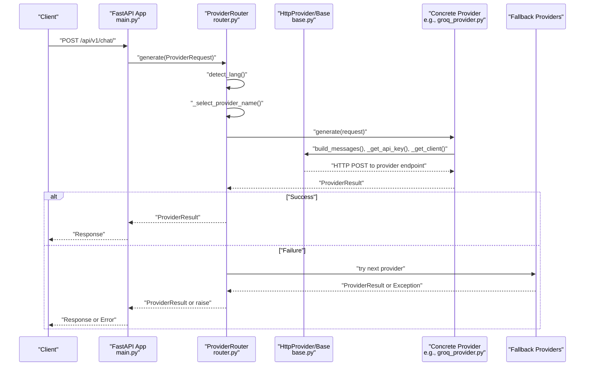
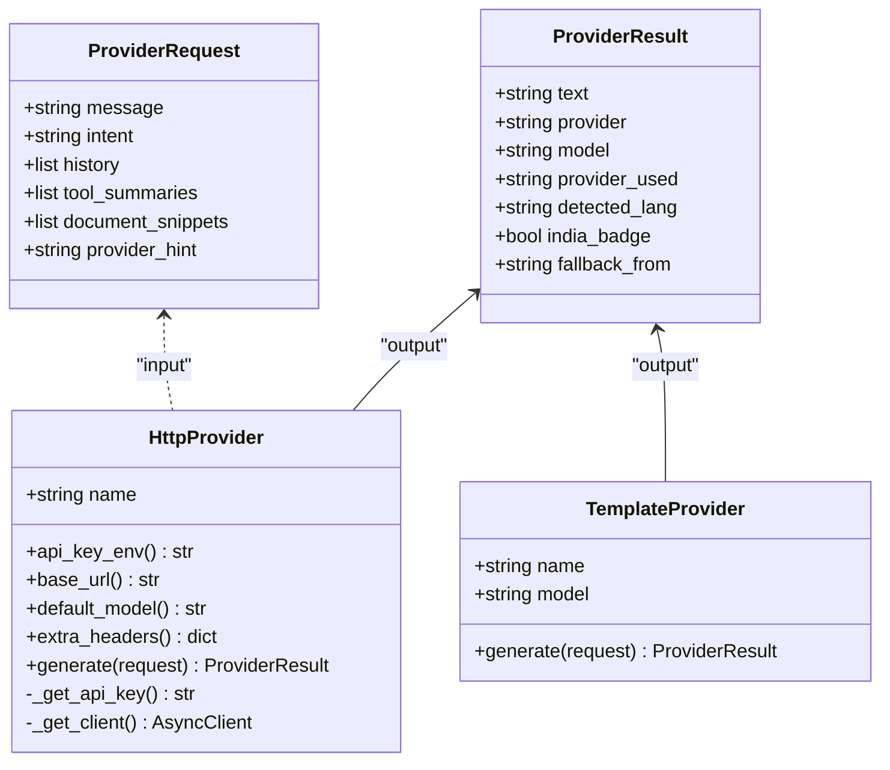
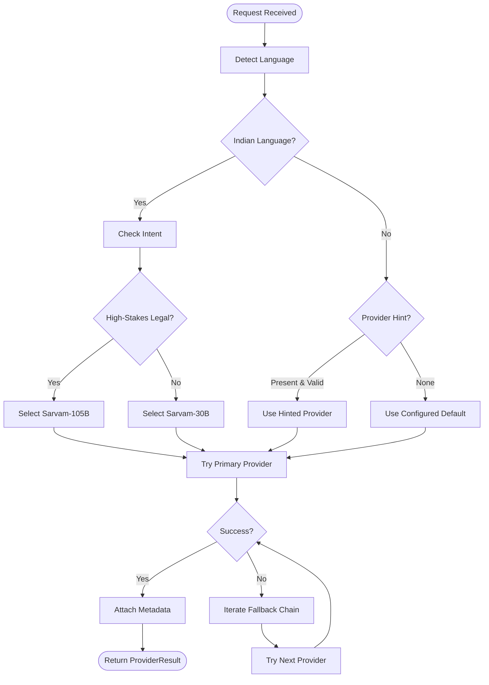
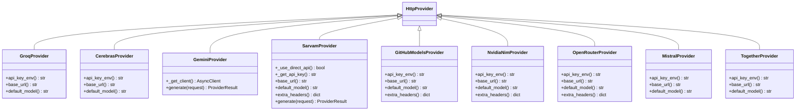
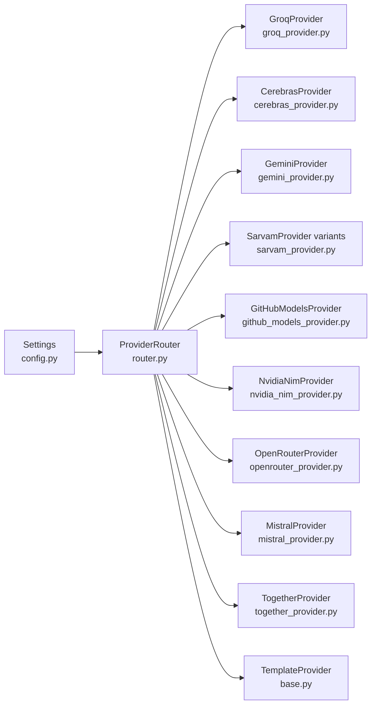

# LLM Provider Routing

<cite>
**Referenced Files in This Document**
- [chatbot_service/providers/__init__.py](file://chatbot_service/providers/__init__.py)
- [chatbot_service/providers/base.py](file://chatbot_service/providers/base.py)
- [chatbot_service/providers/router.py](file://chatbot_service/providers/router.py)
- [chatbot_service/providers/groq_provider.py](file://chatbot_service/providers/groq_provider.py)
- [chatbot_service/providers/gemini_provider.py](file://chatbot_service/providers/gemini_provider.py)
- [chatbot_service/providers/sarvam_provider.py](file://chatbot_service/providers/sarvam_provider.py)
- [chatbot_service/providers/cerebras_provider.py](file://chatbot_service/providers/cerebras_provider.py)
- [chatbot_service/providers/github_models_provider.py](file://chatbot_service/providers/github_models_provider.py)
- [chatbot_service/providers/nvidia_nim_provider.py](file://chatbot_service/providers/nvidia_nim_provider.py)
- [chatbot_service/providers/openrouter_provider.py](file://chatbot_service/providers/openrouter_provider.py)
- [chatbot_service/providers/mistral_provider.py](file://chatbot_service/providers/mistral_provider.py)
- [chatbot_service/providers/together_provider.py](file://chatbot_service/providers/together_provider.py)
- [chatbot_service/config.py](file://chatbot_service/config.py)
- [chatbot_service/main.py](file://chatbot_service/main.py)
</cite>

## Table of Contents
1. [Introduction](#introduction)
2. [Project Structure](#project-structure)
3. [Core Components](#core-components)
4. [Architecture Overview](#architecture-overview)
5. [Detailed Component Analysis](#detailed-component-analysis)
6. [Dependency Analysis](#dependency-analysis)
7. [Performance Considerations](#performance-considerations)
8. [Troubleshooting Guide](#troubleshooting-guide)
9. [Conclusion](#conclusion)
10. [Appendices](#appendices)

## Introduction
This document explains the multi-provider LLM routing system that powers the SafeVixAI chatbot service. It covers the provider abstraction layer, standardized API handling, intelligent routing and fallback logic, configuration and credentials, provider-specific features, and operational guidance for performance and cost optimization. The system routes user queries across 11 providers, prioritizing Indian language support, speed, and reliability, while ensuring safety and compliance with the project’s domain focus.

## Project Structure
The routing system resides in the chatbot service and integrates with FastAPI application lifecycle. Providers are organized under a dedicated module with a shared base and individual implementations. Configuration is centralized and environment-driven.

```mermaid
graph TB
A["FastAPI App<br/>chatbot_service/main.py"] --> B["ProviderRouter<br/>chatbot_service/providers/router.py"]
B --> C["Base Abstraction<br/>chatbot_service/providers/base.py"]
B --> D["GroqProvider<br/>chatbot_service/providers/groq_provider.py"]
B --> E["CerebrasProvider<br/>chatbot_service/providers/cerebras_provider.py"]
B --> F["GeminiProvider<br/>chatbot_service/providers/gemini_provider.py"]
B --> G["SarvamProvider variants<br/>chatbot_service/providers/sarvam_provider.py"]
B --> H["GitHubModelsProvider<br/>chatbot_service/providers/github_models_provider.py"]
B --> I["NvidiaNimProvider<br/>chatbot_service/providers/nvidia_nim_provider.py"]
B --> J["OpenRouterProvider<br/>chatbot_service/providers/openrouter_provider.py"]
B --> K["MistralProvider<br/>chatbot_service/providers/mistral_provider.py"]
B --> L["TogetherProvider<br/>chatbot_service/providers/together_provider.py"]
B --> M["TemplateProvider<br/>chatbot_service/providers/base.py"]
A --> N["Settings & Env Config<br/>chatbot_service/config.py"]
```

**Diagram sources**
- [chatbot_service/main.py:41-93](file://chatbot_service/main.py#L41-L93)
- [chatbot_service/providers/router.py:75-123](file://chatbot_service/providers/router.py#L75-L123)
- [chatbot_service/providers/base.py:90-160](file://chatbot_service/providers/base.py#L90-L160)
- [chatbot_service/providers/groq_provider.py:10-22](file://chatbot_service/providers/groq_provider.py#L10-L22)
- [chatbot_service/providers/cerebras_provider.py:10-22](file://chatbot_service/providers/cerebras_provider.py#L10-L22)
- [chatbot_service/providers/gemini_provider.py:18-70](file://chatbot_service/providers/gemini_provider.py#L18-L70)
- [chatbot_service/providers/sarvam_provider.py:44-124](file://chatbot_service/providers/sarvam_provider.py#L44-L124)
- [chatbot_service/providers/github_models_provider.py:10-25](file://chatbot_service/providers/github_models_provider.py#L10-L25)
- [chatbot_service/providers/nvidia_nim_provider.py:10-25](file://chatbot_service/providers/nvidia_nim_provider.py#L10-L25)
- [chatbot_service/providers/openrouter_provider.py:10-28](file://chatbot_service/providers/openrouter_provider.py#L10-L28)
- [chatbot_service/providers/mistral_provider.py:10-22](file://chatbot_service/providers/mistral_provider.py#L10-L22)
- [chatbot_service/providers/together_provider.py:10-22](file://chatbot_service/providers/together_provider.py#L10-L22)
- [chatbot_service/config.py:39-113](file://chatbot_service/config.py#L39-L113)

**Section sources**
- [chatbot_service/main.py:41-93](file://chatbot_service/main.py#L41-L93)
- [chatbot_service/providers/__init__.py:1-4](file://chatbot_service/providers/__init__.py#L1-L4)
- [chatbot_service/config.py:39-113](file://chatbot_service/config.py#L39-L113)

## Core Components
- Provider abstraction layer: A shared HTTP-based interface for OpenAI-compatible providers and a specialized Gemini handler for non-OpenAI endpoints. Includes prompt building, safety filtering, and deterministic fallback.
- ProviderRouter: Implements intelligent selection and fallback logic across 11 providers, with language-aware routing and intent-based specialization.
- Configuration: Centralized settings loaded from environment variables, including default provider/model and HTTP behavior.

Key abstractions and roles:
- ProviderRequest and ProviderResult define the standardized input and output contract.
- HttpProvider encapsulates HTTP transport, authentication, and payload construction.
- TemplateProvider acts as a deterministic fallback for safety and availability.
- ProviderRouter orchestrates selection, detection, and fallback.

**Section sources**
- [chatbot_service/providers/base.py:44-87](file://chatbot_service/providers/base.py#L44-L87)
- [chatbot_service/providers/base.py:90-160](file://chatbot_service/providers/base.py#L90-L160)
- [chatbot_service/providers/base.py:162-205](file://chatbot_service/providers/base.py#L162-L205)
- [chatbot_service/providers/router.py:75-198](file://chatbot_service/providers/router.py#L75-L198)
- [chatbot_service/config.py:39-113](file://chatbot_service/config.py#L39-L113)

## Architecture Overview
The system initializes a ProviderRouter and injects it into the chat engine during application startup. Requests pass through language detection and intent analysis, then are routed to a provider. On failure, the router attempts the next provider in the ordered fallback chain until success or exhaustion.

**Diagram sources**
- [chatbot_service/main.py:71-78](file://chatbot_service/main.py#L71-L78)
- [chatbot_service/providers/router.py:154-198](file://chatbot_service/providers/router.py#L154-L198)
- [chatbot_service/providers/base.py:129-159](file://chatbot_service/providers/base.py#L129-L159)
- [chatbot_service/providers/groq_provider.py:10-22](file://chatbot_service/providers/groq_provider.py#L10-L22)

## Detailed Component Analysis

### Provider Abstraction Layer
The abstraction layer defines:
- ProviderRequest: carries the user message, conversation history, intent, tool summaries, document snippets, and optional provider hint.
- ProviderResult: standardizes response fields including provider identity, model used, detected language, and fallback metadata.
- build_messages: transforms structured request into an OpenAI-compatible messages array, including system context blocks and trimmed history.
- HttpProvider: shared async HTTP transport, environment-based API key retrieval, and standardized payload construction. It enforces prompt injection checks and returns a ProviderResult.
- TemplateProvider: deterministic fallback that responds based on intent and context snippets without external API calls.

**Diagram sources**
- [chatbot_service/providers/base.py:44-87](file://chatbot_service/providers/base.py#L44-L87)
- [chatbot_service/providers/base.py:90-160](file://chatbot_service/providers/base.py#L90-L160)
- [chatbot_service/providers/base.py:162-205](file://chatbot_service/providers/base.py#L162-L205)

**Section sources**
- [chatbot_service/providers/base.py:44-87](file://chatbot_service/providers/base.py#L44-L87)
- [chatbot_service/providers/base.py:90-160](file://chatbot_service/providers/base.py#L90-L160)
- [chatbot_service/providers/base.py:162-205](file://chatbot_service/providers/base.py#L162-L205)

### ProviderRouter: Intelligent Selection and Fallback
ProviderRouter implements:
- Language detection: Uses Unicode ranges to detect Indian languages and route accordingly.
- Intent-aware specialization: Chooses Sarvam-105B for high-stakes legal intents in Indian languages.
- Provider selection precedence: Indian language → Sarvam variants → explicit hint → configured default.
- Ordered fallback chain: Groq → Cerebras → Gemini → GitHub → NVIDIA → OpenRouter → Mistral → Together → Template.
- Metadata enrichment: Attaches provider_used, detected_lang, and fallback_from fields to results.

**Diagram sources**
- [chatbot_service/providers/router.py:125-152](file://chatbot_service/providers/router.py#L125-L152)
- [chatbot_service/providers/router.py:154-198](file://chatbot_service/providers/router.py#L154-L198)

**Section sources**
- [chatbot_service/providers/router.py:48-72](file://chatbot_service/providers/router.py#L48-L72)
- [chatbot_service/providers/router.py:125-152](file://chatbot_service/providers/router.py#L125-L152)
- [chatbot_service/providers/router.py:154-198](file://chatbot_service/providers/router.py#L154-L198)

### Provider Implementations and Configuration
Each provider extends HttpProvider and supplies:
- api_key_env(): environment variable name for credentials.
- base_url(): OpenAI-compatible endpoint for most providers; Gemini uses a custom translation.
- default_model(): sensible default model identifier.
- extra_headers(): optional headers (e.g., referer, user-agent).

Provider-specific notes:
- Groq: Fast English model; suitable as primary for speed-sensitive queries.
- Cerebras: High throughput overflow when Groq is rate-limited.
- Gemini: Large context window; translates OpenAI messages to Gemini contents.
- Sarvam: Supports multiple Indian languages; prefers direct API when available, falls back to OpenRouter fallback.
- GitHub Models: Free via PAT; uses Azure-hosted endpoint.
- NVIDIA NIM: GPU-optimized; requires API key.
- OpenRouter: Gateway to many models; includes referer and title headers.
- Mistral: Multilingual with generous free tier.
- Together: Wide selection with initial credits.

**Diagram sources**
- [chatbot_service/providers/groq_provider.py:10-22](file://chatbot_service/providers/groq_provider.py#L10-L22)
- [chatbot_service/providers/cerebras_provider.py:10-22](file://chatbot_service/providers/cerebras_provider.py#L10-L22)
- [chatbot_service/providers/gemini_provider.py:18-70](file://chatbot_service/providers/gemini_provider.py#L18-L70)
- [chatbot_service/providers/sarvam_provider.py:44-124](file://chatbot_service/providers/sarvam_provider.py#L44-L124)
- [chatbot_service/providers/github_models_provider.py:10-25](file://chatbot_service/providers/github_models_provider.py#L10-L25)
- [chatbot_service/providers/nvidia_nim_provider.py:10-25](file://chatbot_service/providers/nvidia_nim_provider.py#L10-L25)
- [chatbot_service/providers/openrouter_provider.py:10-28](file://chatbot_service/providers/openrouter_provider.py#L10-L28)
- [chatbot_service/providers/mistral_provider.py:10-22](file://chatbot_service/providers/mistral_provider.py#L10-L22)
- [chatbot_service/providers/together_provider.py:10-22](file://chatbot_service/providers/together_provider.py#L10-L22)

**Section sources**
- [chatbot_service/providers/groq_provider.py:10-22](file://chatbot_service/providers/groq_provider.py#L10-L22)
- [chatbot_service/providers/cerebras_provider.py:10-22](file://chatbot_service/providers/cerebras_provider.py#L10-L22)
- [chatbot_service/providers/gemini_provider.py:18-70](file://chatbot_service/providers/gemini_provider.py#L18-L70)
- [chatbot_service/providers/sarvam_provider.py:44-124](file://chatbot_service/providers/sarvam_provider.py#L44-L124)
- [chatbot_service/providers/github_models_provider.py:10-25](file://chatbot_service/providers/github_models_provider.py#L10-L25)
- [chatbot_service/providers/nvidia_nim_provider.py:10-25](file://chatbot_service/providers/nvidia_nim_provider.py#L10-L25)
- [chatbot_service/providers/openrouter_provider.py:10-28](file://chatbot_service/providers/openrouter_provider.py#L10-L28)
- [chatbot_service/providers/mistral_provider.py:10-22](file://chatbot_service/providers/mistral_provider.py#L10-L22)
- [chatbot_service/providers/together_provider.py:10-22](file://chatbot_service/providers/together_provider.py#L10-L22)

### Configuration and Environment
Settings are loaded from environment variables and cached. Critical keys include:
- DEFAULT_LLM_PROVIDER and DEFAULT_LLM_MODEL to select the default provider and model.
- Individual provider API keys: GROQ_API_KEY, GOOGLE_API_KEY (Gemini), OPENROUTER_API_KEY, HF_TOKEN (Sarvam fallback), MISTRAL_API_KEY, SARVAM_API_KEY, NVIDIA_NIM_API_KEY, CEREBRAS_API_KEY.
- HTTP timeouts, user agent, and other service parameters.

The system validates that at least one real provider key is present and raises a fatal error otherwise.

**Section sources**
- [chatbot_service/config.py:39-113](file://chatbot_service/config.py#L39-L113)
- [chatbot_service/config.py:119-125](file://chatbot_service/config.py#L119-L125)

### Application Integration
The FastAPI app constructs a ProviderRouter and injects it into the chat engine during startup. Health and root endpoints expose service metadata and routing characteristics.

**Section sources**
- [chatbot_service/main.py:41-93](file://chatbot_service/main.py#L41-L93)
- [chatbot_service/main.py:106-142](file://chatbot_service/main.py#L106-L142)

## Dependency Analysis
ProviderRouter depends on:
- Settings for defaults and environment configuration.
- Individual provider classes for generation.
- Base classes for shared behavior and safety checks.

**Diagram sources**
- [chatbot_service/providers/router.py:85-109](file://chatbot_service/providers/router.py#L85-L109)
- [chatbot_service/config.py:39-113](file://chatbot_service/config.py#L39-L113)

**Section sources**
- [chatbot_service/providers/router.py:85-109](file://chatbot_service/providers/router.py#L85-L109)
- [chatbot_service/config.py:39-113](file://chatbot_service/config.py#L39-L113)

## Performance Considerations
- Language-aware routing: Prefer Sarvam-30B for Indian languages; Sarvam-105B for legal intents to reduce retries and improve accuracy.
- Primary provider selection: Groq for speed; Cerebras as overflow; Gemini for large-context tasks.
- Payload sizing: The system caps max tokens and trims history to balance latency and context retention.
- Retry strategy: Automatic fallback through the ordered chain minimizes downtime; monitor fallback_from to track provider health.
- Cost optimization: Use free tiers and credits where available (GitHub Models, OpenRouter free tier, Sarvam credits, Cerebras daily tokens).

[No sources needed since this section provides general guidance]

## Troubleshooting Guide
Common issues and resolutions:
- Missing provider keys: The system validates presence of at least one real provider key and raises a fatal error if none are found. Ensure appropriate environment variables are set.
- Prompt injection attempts: The base layer blocks suspicious prompts and returns a filtered response.
- Gemini-specific errors: Ensure GEMINI_API_KEY is set; Gemini uses a different endpoint format and requires translated messages.
- Sarvam fallback: If Sarvam direct API key is absent or exhausted, the system falls back to OpenRouter fallback via HF_TOKEN.
- Rate limiting: Rely on fallback chain; configure higher-tier providers or adjust default provider to reduce throttling.

**Section sources**
- [chatbot_service/config.py:119-125](file://chatbot_service/config.py#L119-L125)
- [chatbot_service/providers/base.py:129-136](file://chatbot_service/providers/base.py#L129-L136)
- [chatbot_service/providers/gemini_provider.py:30-32](file://chatbot_service/providers/gemini_provider.py#L30-L32)
- [chatbot_service/providers/sarvam_provider.py:58-68](file://chatbot_service/providers/sarvam_provider.py#L58-L68)
- [chatbot_service/providers/router.py:179-198](file://chatbot_service/providers/router.py#L179-L198)

## Conclusion
The routing system provides robust, scalable, and regionally aware LLM inference by combining a unified abstraction, intelligent selection logic, and a resilient fallback chain. By leveraging language detection, intent-aware specialization, and environment-driven configuration, it ensures reliable performance and cost-conscious operation across diverse query types.

[No sources needed since this section summarizes without analyzing specific files]

## Appendices

### Provider Selection Criteria
- Indian language input: Route to Sarvam-30B; for high-stakes legal intents, prefer Sarvam-105B.
- Explicit provider hint: Use the hinted provider if valid.
- Default provider: Respect configured default for general English queries.
- Fallback chain: Groq → Cerebras → Gemini → GitHub → NVIDIA → OpenRouter → Mistral → Together → Template.

**Section sources**
- [chatbot_service/providers/router.py:125-152](file://chatbot_service/providers/router.py#L125-L152)
- [chatbot_service/providers/router.py:113-123](file://chatbot_service/providers/router.py#L113-L123)

### Pricing and Rate Limits (Overview)
- Groq: Free tier quotas apply; model choice impacts throughput.
- Cerebras: Daily token allowance; high throughput for overflow scenarios.
- Gemini: Free tier with request and token limits; requires API key.
- Sarvam: Direct API offers free credits; fallback to OpenRouter fallback via HF_TOKEN.
- GitHub Models: Free quota per model per day via PAT.
- OpenRouter: Free tier with limited requests; gateway to many models.
- Mistral: Generous free tier on La Plateforme.
- NVIDIA NIM: Credits on sign-up; GPU-optimized inference.
- Together: Initial credits on sign-up.

**Section sources**
- [chatbot_service/providers/groq_provider.py:1-4](file://chatbot_service/providers/groq_provider.py#L1-L4)
- [chatbot_service/providers/cerebras_provider.py:1-4](file://chatbot_service/providers/cerebras_provider.py#L1-L4)
- [chatbot_service/providers/gemini_provider.py:1-7](file://chatbot_service/providers/gemini_provider.py#L1-L7)
- [chatbot_service/providers/sarvam_provider.py:1-11](file://chatbot_service/providers/sarvam_provider.py#L1-L11)
- [chatbot_service/providers/github_models_provider.py:1-4](file://chatbot_service/providers/github_models_provider.py#L1-L4)
- [chatbot_service/providers/openrouter_provider.py:1-4](file://chatbot_service/providers/openrouter_provider.py#L1-L4)
- [chatbot_service/providers/mistral_provider.py:1-4](file://chatbot_service/providers/mistral_provider.py#L1-L4)
- [chatbot_service/providers/nvidia_nim_provider.py:1-4](file://chatbot_service/providers/nvidia_nim_provider.py#L1-L4)
- [chatbot_service/providers/together_provider.py:1-4](file://chatbot_service/providers/together_provider.py#L1-L4)

### Cost Optimization Strategies
- Prefer free tiers and credits for initial traffic.
- Use Sarvam for Indian language queries to reduce latency and improve accuracy.
- Monitor fallback_from to identify throttled providers and adjust defaults.
- Configure higher-capacity providers as defaults for peak loads.

**Section sources**
- [chatbot_service/providers/router.py:113-123](file://chatbot_service/providers/router.py#L113-L123)
- [chatbot_service/config.py:95-96](file://chatbot_service/config.py#L95-L96)