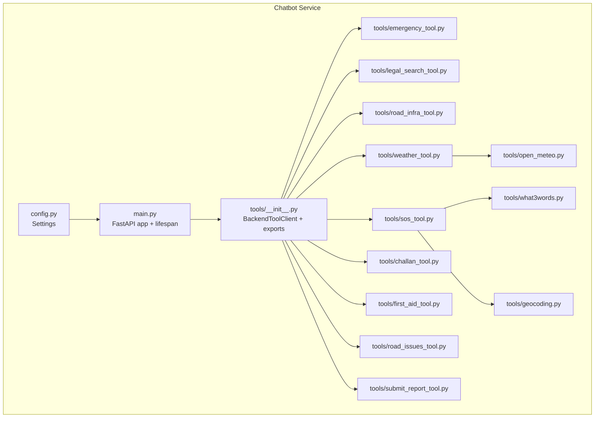
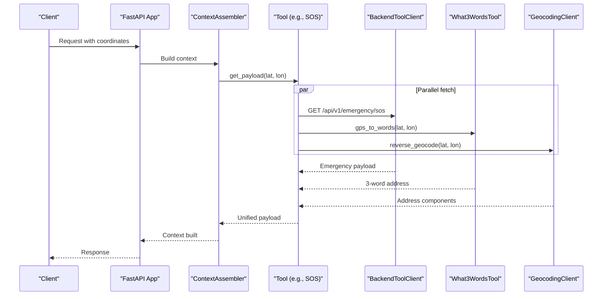
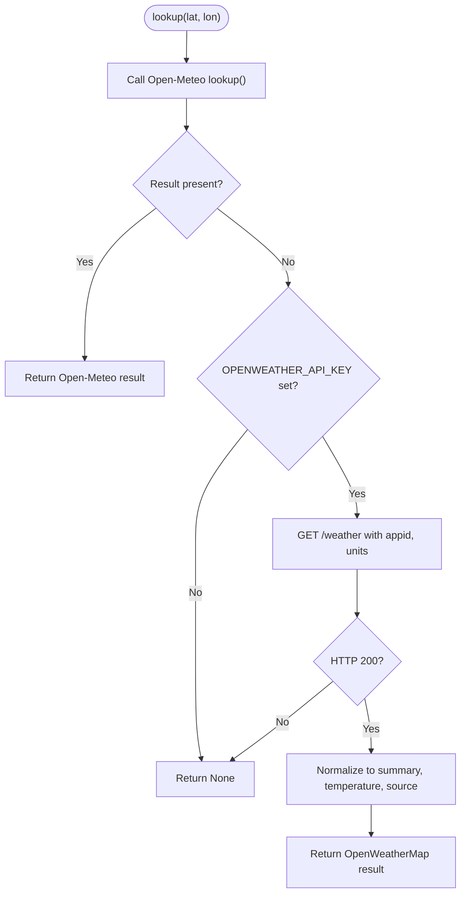
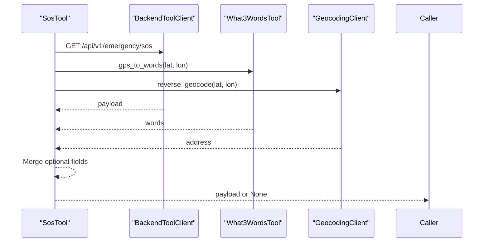
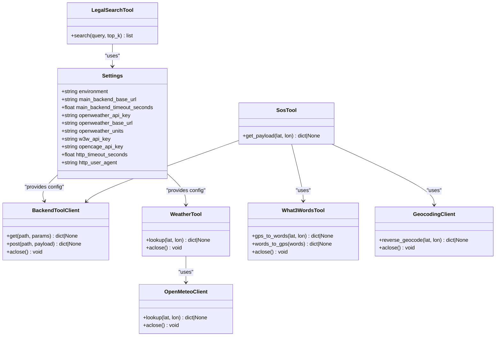

# Tools and External Integrations

<cite>
**Referenced Files in This Document**
- [chatbot_service/tools/__init__.py](file://chatbot_service/tools/__init__.py)
- [chatbot_service/tools/emergency_tool.py](file://chatbot_service/tools/emergency_tool.py)
- [chatbot_service/tools/legal_search_tool.py](file://chatbot_service/tools/legal_search_tool.py)
- [chatbot_service/tools/road_infra_tool.py](file://chatbot_service/tools/road_infra_tool.py)
- [chatbot_service/tools/weather_tool.py](file://chatbot_service/tools/weather_tool.py)
- [chatbot_service/tools/open_meteo.py](file://chatbot_service/tools/open_meteo.py)
- [chatbot_service/tools/sos_tool.py](file://chatbot_service/tools/sos_tool.py)
- [chatbot_service/tools/challan_tool.py](file://chatbot_service/tools/challan_tool.py)
- [chatbot_service/tools/first_aid_tool.py](file://chatbot_service/tools/first_aid_tool.py)
- [chatbot_service/tools/geocoding.py](file://chatbot_service/tools/geocoding.py)
- [chatbot_service/tools/road_issues_tool.py](file://chatbot_service/tools/road_issues_tool.py)
- [chatbot_service/tools/submit_report_tool.py](file://chatbot_service/tools/submit_report_tool.py)
- [chatbot_service/tools/what3words.py](file://chatbot_service/tools/what3words.py)
- [chatbot_service/config.py](file://chatbot_service/config.py)
- [chatbot_service/main.py](file://chatbot_service/main.py)
</cite>

## Table of Contents
1. [Introduction](#introduction)
2. [Project Structure](#project-structure)
3. [Core Components](#core-components)
4. [Architecture Overview](#architecture-overview)
5. [Detailed Component Analysis](#detailed-component-analysis)
6. [Dependency Analysis](#dependency-analysis)
7. [Performance Considerations](#performance-considerations)
8. [Troubleshooting Guide](#troubleshooting-guide)
9. [Conclusion](#conclusion)
10. [Appendices](#appendices)

## Introduction
This document explains the tool system powering chatbot interactions with external services and internal APIs. It covers the tool abstraction layer, parameter validation, response formatting, and operational details for each tool. It also documents the BackendToolClient integration, rate limiting, fallback mechanisms, tool-specific configurations, data transformations, and security considerations.

## Project Structure
The tool system resides in the chatbot service and integrates with configuration, retrieval, and external APIs. Tools are grouped under a single module and exposed via a central initializer for easy consumption by the application lifecycle.

**Diagram sources**
- [chatbot_service/main.py:41-93](file://chatbot_service/main.py#L41-L93)
- [chatbot_service/tools/__init__.py:8-70](file://chatbot_service/tools/__init__.py#L8-L70)
- [chatbot_service/tools/weather_tool.py:15-64](file://chatbot_service/tools/weather_tool.py#L15-L64)
- [chatbot_service/tools/open_meteo.py:61-127](file://chatbot_service/tools/open_meteo.py#L61-L127)
- [chatbot_service/tools/sos_tool.py:10-44](file://chatbot_service/tools/sos_tool.py#L10-L44)
- [chatbot_service/tools/what3words.py:19-89](file://chatbot_service/tools/what3words.py#L19-L89)
- [chatbot_service/tools/geocoding.py:17-125](file://chatbot_service/tools/geocoding.py#L17-L125)
- [chatbot_service/tools/challan_tool.py:27-81](file://chatbot_service/tools/challan_tool.py#L27-L81)
- [chatbot_service/tools/first_aid_tool.py:49-109](file://chatbot_service/tools/first_aid_tool.py#L49-L109)
- [chatbot_service/tools/road_infra_tool.py:6-15](file://chatbot_service/tools/road_infra_tool.py#L6-L15)
- [chatbot_service/tools/road_issues_tool.py:6-15](file://chatbot_service/tools/road_issues_tool.py#L6-L15)
- [chatbot_service/tools/submit_report_tool.py:19-112](file://chatbot_service/tools/submit_report_tool.py#L19-L112)
- [chatbot_service/config.py:39-113](file://chatbot_service/config.py#L39-L113)

**Section sources**
- [chatbot_service/main.py:41-93](file://chatbot_service/main.py#L41-L93)
- [chatbot_service/tools/__init__.py:8-70](file://chatbot_service/tools/__init__.py#L8-L70)

## Core Components
- BackendToolClient: Thin async HTTP client wrapping httpx with shared base URL, timeouts, and headers. Provides GET and POST helpers returning JSON or None on errors.
- Tool Abstraction Layer: Each tool encapsulates a domain-specific operation (e.g., emergency lookup, weather, SOS payload assembly) and composes internal or external dependencies.
- Parameter Validation: Tools validate inputs at call sites (e.g., numeric bounds, presence checks) and rely on HTTP clients to enforce request correctness.
- Response Formatting: Tools normalize responses into structured dictionaries suitable for downstream consumers (e.g., chat engine, UI).

Key responsibilities:
- Centralized HTTP behavior via BackendToolClient
- Domain-specific orchestration (e.g., SOS assembling multiple data sources)
- Fallback strategies for external services
- Graceful degradation when optional integrations are missing

**Section sources**
- [chatbot_service/tools/__init__.py:8-36](file://chatbot_service/tools/__init__.py#L8-L36)
- [chatbot_service/main.py:41-93](file://chatbot_service/main.py#L41-L93)

## Architecture Overview
The chatbot service initializes tools during application lifespan. Tools depend on configuration, retrieval, and external APIs. Weather and SOS tools coordinate multiple external services with fallbacks. BackendToolClient ensures consistent HTTP behavior across internal API calls.

**Diagram sources**
- [chatbot_service/main.py:59-70](file://chatbot_service/main.py#L59-L70)
- [chatbot_service/tools/sos_tool.py:21-43](file://chatbot_service/tools/sos_tool.py#L21-L43)
- [chatbot_service/tools/what3words.py:26-57](file://chatbot_service/tools/what3words.py#L26-L57)
- [chatbot_service/tools/geocoding.py:36-121](file://chatbot_service/tools/geocoding.py#L36-L121)

## Detailed Component Analysis

### BackendToolClient
- Purpose: Encapsulate HTTP calls to the main backend API with consistent headers and timeouts.
- Methods:
  - get(path, params): GET with query parameters; returns parsed JSON or None.
  - post(path, payload): POST with JSON body; returns parsed JSON or None.
  - aclose(): Close underlying HTTP client.
- Configuration: Reads base URL and timeout from Settings.

Operational notes:
- All exceptions are caught and suppressed to enable fallbacks.
- Accepts JSON responses only.

**Section sources**
- [chatbot_service/tools/__init__.py:8-36](file://chatbot_service/tools/__init__.py#L8-L36)
- [chatbot_service/config.py:45-84](file://chatbot_service/config.py#L45-L84)

### Emergency Services Lookup (EmergencyTool)
- Purpose: Find nearby emergency services for a given coordinate pair.
- Method: find_nearby(lat, lon, limit=5)
- Behavior: Calls backend endpoint with lat, lon, limit; returns JSON or None.

Validation and error handling:
- Validates numeric inputs at call site.
- Returns None on HTTP errors or parsing failures.

Response formatting:
- Delegates to BackendToolClient; caller interprets JSON.

**Section sources**
- [chatbot_service/tools/emergency_tool.py:6-15](file://chatbot_service/tools/emergency_tool.py#L6-L15)
- [chatbot_service/tools/__init__.py:19-33](file://chatbot_service/tools/__init__.py#L19-L33)

### Legal Search (LegalSearchTool)
- Purpose: Retrieve legal information using a retrieval-based approach scoped to legal content.
- Method: search(query, top_k=4)
- Behavior: Uses a Retriever to retrieve top-k results scoped to legal documents.

Validation and error handling:
- No explicit runtime validation; relies on retriever behavior.

Response formatting:
- Returns a list of RetrievalResult objects.

**Section sources**
- [chatbot_service/tools/legal_search_tool.py:6-12](file://chatbot_service/tools/legal_search_tool.py#L6-L12)

### Road Infrastructure Queries (RoadInfrastructureTool)
- Purpose: Query road infrastructure data near a coordinate.
- Method: lookup(lat, lon)
- Behavior: Calls backend endpoint with lat, lon; returns JSON or None.

Validation and error handling:
- Validates numeric inputs at call site.
- Returns None on HTTP errors.

Response formatting:
- Delegates to BackendToolClient; caller interprets JSON.

**Section sources**
- [chatbot_service/tools/road_infra_tool.py:6-15](file://chatbot_service/tools/road_infra_tool.py#L6-L15)
- [chatbot_service/tools/__init__.py:19-33](file://chatbot_service/tools/__init__.py#L19-L33)

### Weather Information (WeatherTool)
- Purpose: Provide weather data for risk assessment with a primary and fallback provider.
- Methods:
  - lookup(lat, lon): Try Open-Meteo first; if None, try OpenWeatherMap (requires API key).
  - aclose(): Close internal clients.
- Fallback mechanism:
  - Open-Meteo: free, no key, unlimited.
  - OpenWeatherMap: requires OPENWEATHER_API_KEY; returns a normalized dictionary with summary, temperature, and source.

Validation and error handling:
- Checks for API key presence before attempting OpenWeatherMap.
- Catches exceptions and returns None on failure.

Response formatting:
- Normalizes OpenWeatherMap response to a unified shape with summary, temperature, and source.

**Diagram sources**
- [chatbot_service/tools/weather_tool.py:24-59](file://chatbot_service/tools/weather_tool.py#L24-L59)
- [chatbot_service/tools/open_meteo.py:72-123](file://chatbot_service/tools/open_meteo.py#L72-L123)

**Section sources**
- [chatbot_service/tools/weather_tool.py:15-64](file://chatbot_service/tools/weather_tool.py#L15-L64)
- [chatbot_service/config.py:58-104](file://chatbot_service/config.py#L58-L104)

### SOS Functionality (SosTool)
- Purpose: Assemble a comprehensive SOS payload by combining backend emergency data with geocoding and 3-word address conversion.
- Methods:
  - get_payload(lat, lon): Parallelize backend call, 3-word conversion, and reverse geocoding; merge optional fields into the payload.
- Dependencies:
  - BackendToolClient for emergency SOS endpoint.
  - What3WordsTool for converting coordinates to 3-word addresses.
  - GeocodingClient for reverse geocoding.

Validation and error handling:
- Uses asyncio.gather with return_exceptions enabled.
- Ignores exceptions and omits fields if conversions fail.
- Returns None if the backend payload is missing or invalid.

Response formatting:
- Merges backend payload with optional what3words and address fields.

**Diagram sources**
- [chatbot_service/tools/sos_tool.py:21-43](file://chatbot_service/tools/sos_tool.py#L21-L43)
- [chatbot_service/tools/what3words.py:26-57](file://chatbot_service/tools/what3words.py#L26-L57)
- [chatbot_service/tools/geocoding.py:36-121](file://chatbot_service/tools/geocoding.py#L36-L121)

**Section sources**
- [chatbot_service/tools/sos_tool.py:10-44](file://chatbot_service/tools/sos_tool.py#L10-L44)

### Challan Calculation (ChallanTool)
- Purpose: Calculate challan penalties based on violation code, vehicle class, state, and repeat offense flag.
- Methods:
  - calculate(violation_code, vehicle_class, state_code, is_repeat): POST to backend endpoint.
  - infer_and_calculate(message, client_ip): Extract violation code and state from natural language, infer vehicle class and repeat flag, then call calculate.
- Validation and inference:
  - Uses regex patterns to detect violation codes and state codes.
  - Infers vehicle class from keywords.
  - Infers repeat offense from textual cues.
  - If state not found, infers from client IP using a utility.

Response formatting:
- Returns backend JSON or None.

**Section sources**
- [chatbot_service/tools/challan_tool.py:27-81](file://chatbot_service/tools/challan_tool.py#L27-L81)

### First Aid Guides (FirstAidTool)
- Purpose: Provide first aid guidance based on a query string, falling back to embedded defaults if data is unavailable.
- Methods:
  - lookup(query): Matches query against loaded guides and returns the best match.
- Data loading and normalization:
  - Loads from a JSON file; falls back to embedded defaults if file is missing or malformed.
  - Normalizes list-based articles into a keyed dictionary with keywords, steps, and optional warnings.

Validation and error handling:
- Gracefully handles missing or corrupted data by reverting to defaults.

Response formatting:
- Returns a structured guide with title, steps, optional warnings, and conditions.

**Section sources**
- [chatbot_service/tools/first_aid_tool.py:49-109](file://chatbot_service/tools/first_aid_tool.py#L49-L109)

### Road Issues Lookup (RoadIssuesTool)
- Purpose: Query recent road issues around a coordinate within a radius.
- Method: lookup(lat, lon, radius=5000, limit=5)
- Behavior: Calls backend endpoint with lat, lon, radius, limit; returns JSON or None.

Validation and error handling:
- Validates numeric inputs at call site.
- Returns None on HTTP errors.

Response formatting:
- Delegates to BackendToolClient; caller interprets JSON.

**Section sources**
- [chatbot_service/tools/road_issues_tool.py:6-15](file://chatbot_service/tools/road_issues_tool.py#L6-L15)
- [chatbot_service/tools/__init__.py:19-33](file://chatbot_service/tools/__init__.py#L19-L33)

### Submit Report (SubmitReportTool)
- Purpose: Submit road hazard reports to the backend API; gracefully degrades if backend is unavailable.
- Methods:
  - submit(issue_type, severity="medium", description="", lat=None, lon=None): POST to backend endpoint; returns a structured result dict.
  - build_guidance(issue_type, lat=None, lon=None): Legacy guidance-only method.
  - aclose(): Close internal HTTP client.
- Validation and error handling:
  - Guards oversized descriptions.
  - On HTTP errors or exceptions, returns guidance instead of failing.
  - If backend base URL is not configured, returns guidance immediately.

Response formatting:
- Returns a standardized result with submission status, optional report ID, and user-facing message.

**Section sources**
- [chatbot_service/tools/submit_report_tool.py:19-112](file://chatbot_service/tools/submit_report_tool.py#L19-L112)

### What3Words Integration (What3WordsTool)
- Purpose: Convert GPS coordinates to 3-word addresses and back for precise location sharing.
- Methods:
  - gps_to_words(lat, lon): Converts coordinates to 3-word address and map URL.
  - words_to_gps(words): Converts 3-word address back to coordinates.
  - aclose(): Close HTTP client.
- Configuration:
  - Requires W3W_API_KEY (environment variable).

Validation and error handling:
- Returns None if API key is missing or request fails.

Response formatting:
- Returns structured dictionaries with words, formatted 3-word string, and optional map URL.

**Section sources**
- [chatbot_service/tools/what3words.py:19-89](file://chatbot_service/tools/what3words.py#L19-L89)
- [chatbot_service/config.py:61-105](file://chatbot_service/config.py#L61-L105)

### Geocoding (GeocodingClient)
- Purpose: Reverse geocode coordinates to human-readable addresses with fallback providers.
- Methods:
  - reverse_geocode(lat, lon): Try Nominatim first; if None, try OpenCage (requires OPENCAGE_API_KEY).
  - aclose(): Close HTTP client.
- Providers:
  - Nominatim: free, 1 req/sec, requires User-Agent.
  - OpenCage: free tier allows up to 2500/day with API key.

Validation and error handling:
- Returns None if either provider fails or key is missing.

Response formatting:
- Returns structured address components (road, city, state, postcode, display) plus source indicator.

**Section sources**
- [chatbot_service/tools/geocoding.py:17-125](file://chatbot_service/tools/geocoding.py#L17-L125)
- [chatbot_service/config.py:62-105](file://chatbot_service/config.py#L62-L105)

## Dependency Analysis
- Internal dependencies:
  - Tools depend on Settings for configuration and on BackendToolClient for internal API calls.
  - SOS tool depends on What3WordsTool and GeocodingClient for auxiliary data.
  - Weather tool depends on OpenMeteoClient and optionally OpenWeatherMap.
  - Legal search tool depends on a Retriever for RAG-based retrieval.
- External dependencies:
  - HTTP clients for external APIs (Open-Meteo, OpenWeatherMap, Nominatim, OpenCage, What3Words).
- Coupling and cohesion:
  - Tools are cohesive per domain and loosely coupled via shared Settings and HTTP clients.
  - Fallbacks minimize coupling to specific providers.

**Diagram sources**
- [chatbot_service/config.py:39-113](file://chatbot_service/config.py#L39-L113)
- [chatbot_service/tools/__init__.py:8-36](file://chatbot_service/tools/__init__.py#L8-L36)
- [chatbot_service/tools/weather_tool.py:15-64](file://chatbot_service/tools/weather_tool.py#L15-L64)
- [chatbot_service/tools/open_meteo.py:61-127](file://chatbot_service/tools/open_meteo.py#L61-L127)
- [chatbot_service/tools/sos_tool.py:10-44](file://chatbot_service/tools/sos_tool.py#L10-L44)
- [chatbot_service/tools/what3words.py:19-89](file://chatbot_service/tools/what3words.py#L19-L89)
- [chatbot_service/tools/geocoding.py:17-125](file://chatbot_service/tools/geocoding.py#L17-L125)
- [chatbot_service/tools/legal_search_tool.py:6-12](file://chatbot_service/tools/legal_search_tool.py#L6-L12)

**Section sources**
- [chatbot_service/config.py:39-113](file://chatbot_service/config.py#L39-L113)
- [chatbot_service/tools/__init__.py:8-36](file://chatbot_service/tools/__init__.py#L8-L36)

## Performance Considerations
- Parallelization:
  - SOS tool uses asyncio.gather to parallelize backend, 3-word, and geocoding requests, reducing latency.
- Timeouts and retries:
  - HTTP clients use configurable timeouts; exceptions are caught and suppressed to enable fallbacks.
- Rate limiting:
  - Application-level rate limiting is enabled via SlowAPI; see main.py for registration and handler binding.
- Caching and persistence:
  - FirstAidTool loads data once at initialization; fallbacks avoid repeated disk/network access.
- Fallback strategies:
  - WeatherTool prefers free Open-Meteo; OpenWeatherMap is used only when configured.
  - Geocoding tries Nominatim first, then OpenCage if configured.

[No sources needed since this section provides general guidance]

## Troubleshooting Guide
Common issues and resolutions:
- BackendToolClient returns None:
  - Indicates HTTP errors or timeouts; verify main_backend_base_url and network connectivity.
- WeatherTool returns None:
  - Open-Meteo might be down; ensure OPENWEATHER_API_KEY is set if relying on fallback.
- SOS payload missing optional fields:
  - 3-word or address conversion failed; confirm W3W_API_KEY and OPENCAGE_API_KEY respectively.
- SubmitReportTool guidance-only mode:
  - Backend base URL not configured; configure MAIN_BACKEND_BASE_URL or expect guidance responses.
- GeocodingClient returns None:
  - Missing API key or provider outage; set OPENCAGE_API_KEY or retry later.
- What3WordsTool returns None:
  - Missing W3W_API_KEY; sign up and set W3W_API_KEY.

Operational tips:
- Enable logging to capture warnings and exceptions from tools.
- Validate environment variables for API keys and base URLs.
- Monitor rate limits for external providers (Nominatim, OpenWeatherMap, OpenCage).

**Section sources**
- [chatbot_service/tools/__init__.py:19-33](file://chatbot_service/tools/__init__.py#L19-L33)
- [chatbot_service/tools/weather_tool.py:37-59](file://chatbot_service/tools/weather_tool.py#L37-L59)
- [chatbot_service/tools/sos_tool.py:34-43](file://chatbot_service/tools/sos_tool.py#L34-L43)
- [chatbot_service/tools/submit_report_tool.py:53-87](file://chatbot_service/tools/submit_report_tool.py#L53-L87)
- [chatbot_service/tools/geocoding.py:83-121](file://chatbot_service/tools/geocoding.py#L83-L121)
- [chatbot_service/tools/what3words.py:33-57](file://chatbot_service/tools/what3words.py#L33-L57)

## Conclusion
The tool system provides a robust, extensible foundation for integrating chatbot interactions with internal and external services. It emphasizes resilience through fallbacks, predictable response shapes, and graceful degradation. Configuration-driven behavior ensures portability across environments, while parallelization and rate limiting improve responsiveness and reliability.

[No sources needed since this section summarizes without analyzing specific files]

## Appendices

### Tool Execution Examples (paths)
- Emergency lookup: [find_nearby:10-14](file://chatbot_service/tools/emergency_tool.py#L10-L14)
- Legal search: [search:10-11](file://chatbot_service/tools/legal_search_tool.py#L10-L11)
- Road infrastructure: [lookup:10-14](file://chatbot_service/tools/road_infra_tool.py#L10-L14)
- Weather: [lookup:24-33](file://chatbot_service/tools/weather_tool.py#L24-L33)
- SOS payload: [get_payload:21-43](file://chatbot_service/tools/sos_tool.py#L21-L43)
- Challan calculation: [calculate:38-47](file://chatbot_service/tools/challan_tool.py#L38-L47), [infer_and_calculate:49-69](file://chatbot_service/tools/challan_tool.py#L49-L69)
- First aid: [lookup:54-60](file://chatbot_service/tools/first_aid_tool.py#L54-L60)
- Road issues: [lookup:10-14](file://chatbot_service/tools/road_issues_tool.py#L10-L14)
- Report submission: [submit:39-81](file://chatbot_service/tools/submit_report_tool.py#L39-L81)
- 3-word conversion: [gps_to_words:26-57](file://chatbot_service/tools/what3words.py#L26-L57)
- Reverse geocoding: [reverse_geocode:36-46](file://chatbot_service/tools/geocoding.py#L36-L46)

### Configuration Options
- Backend base URL and timeout: [Settings:45-84](file://chatbot_service/config.py#L45-L84)
- Weather provider keys and units: [Settings:58-104](file://chatbot_service/config.py#L58-L104)
- HTTP client settings: [Settings:63-64](file://chatbot_service/config.py#L63-L64)
- Rate limiting: [SlowAPI setup:18-104](file://chatbot_service/main.py#L18-L104)

**Section sources**
- [chatbot_service/config.py:45-104](file://chatbot_service/config.py#L45-L104)
- [chatbot_service/main.py:18-104](file://chatbot_service/main.py#L18-L104)