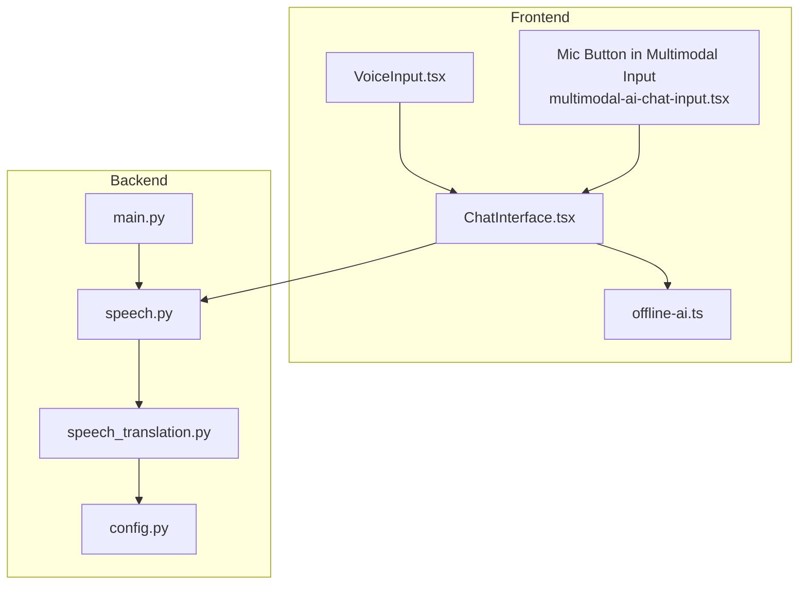
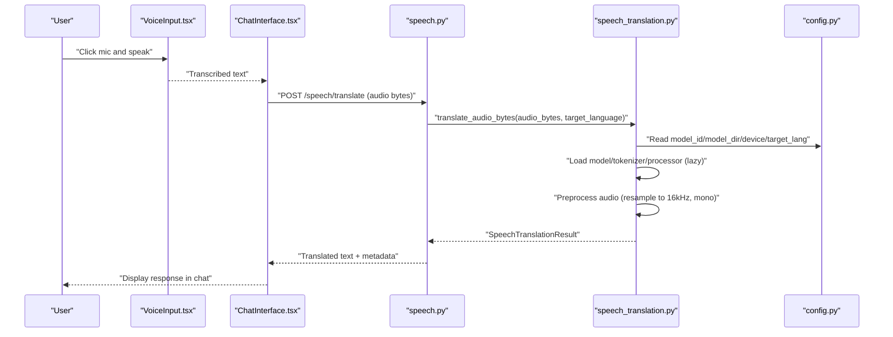
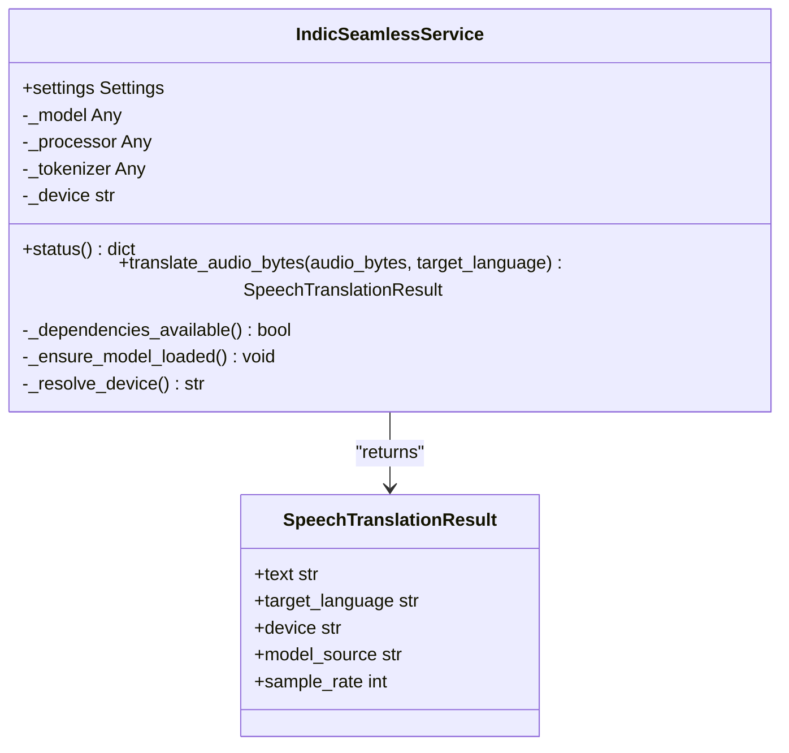
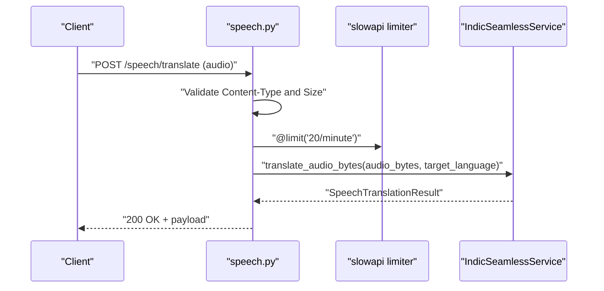
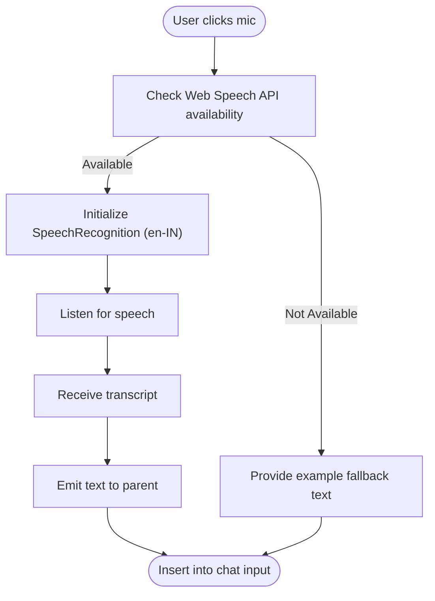
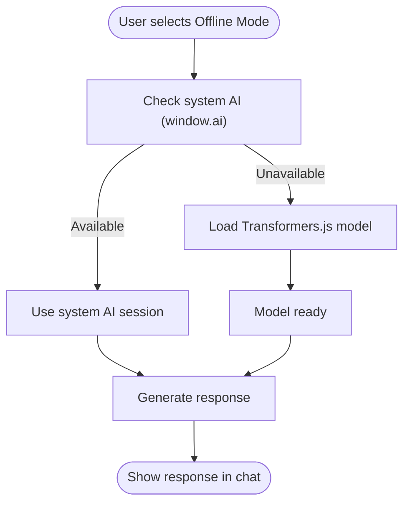
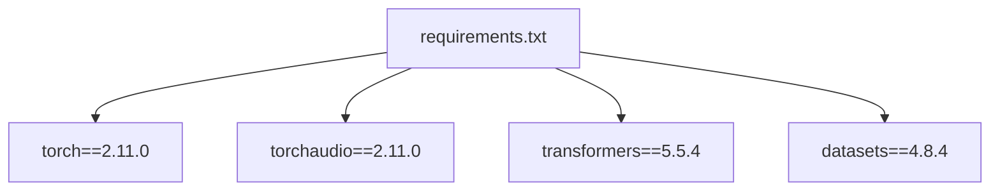

# Voice and Multimodal Capabilities

<cite>
**Referenced Files in This Document**
- [speech_translation.py](file://chatbot_service/services/speech_translation.py)
- [speech.py](file://chatbot_service/api/speech.py)
- [config.py](file://chatbot_service/config.py)
- [main.py](file://chatbot_service/main.py)
- [VoiceInput.tsx](file://frontend/components/VoiceInput.tsx)
- [multimodal-ai-chat-input.tsx](file://frontend/components/chat/multimodal-ai-chat-input.tsx)
- [ChatInterface.tsx](file://frontend/components/ChatInterface.tsx)
- [offline-ai.ts](file://frontend/lib/offline-ai.ts)
- [requirements.txt](file://chatbot_service/requirements.txt)
- [test_voice.py](file://chatbot_service/tests/test_voice.py)
- [Features.md](file://chatbot_docs/Features.md)
</cite>

## Table of Contents
1. [Introduction](#introduction)
2. [Project Structure](#project-structure)
3. [Core Components](#core-components)
4. [Architecture Overview](#architecture-overview)
5. [Detailed Component Analysis](#detailed-component-analysis)
6. [Dependency Analysis](#dependency-analysis)
7. [Performance Considerations](#performance-considerations)
8. [Troubleshooting Guide](#troubleshooting-guide)
9. [Conclusion](#conclusion)
10. [Appendices](#appendices)

## Introduction
This document explains the voice input/output and multimodal capabilities of the SafeVixAI system, focusing on speech-to-text, translation services, and integration with the chat interface. It covers:
- IndicSeamlessService for multilingual speech processing and regional language support
- Speech recognition pipeline, audio preprocessing, and transcription quality optimization
- Examples of voice command processing, real-time translation, and voice feedback generation
- Audio format handling, latency optimization, and accessibility features
- Integration with the chat interface and user experience considerations

## Project Structure
The voice and multimodal features span the backend chatbot service and the frontend React components:
- Backend: FastAPI routes expose a speech translation endpoint backed by a PyTorch-based Indic Seamless model
- Frontend: React components provide voice input capture and integrate with the chat UI

**Diagram sources**
- [speech.py:12-77](file://chatbot_service/api/speech.py#L12-L77)
- [speech_translation.py:34-141](file://chatbot_service/services/speech_translation.py#L34-L141)
- [config.py:39-113](file://chatbot_service/config.py#L39-L113)
- [main.py:41-93](file://chatbot_service/main.py#L41-L93)
- [VoiceInput.tsx:48-144](file://frontend/components/VoiceInput.tsx#L48-L144)
- [multimodal-ai-chat-input.tsx:139-162](file://frontend/components/chat/multimodal-ai-chat-input.tsx#L139-L162)
- [ChatInterface.tsx:64-317](file://frontend/components/ChatInterface.tsx#L64-L317)
- [offline-ai.ts:1-256](file://frontend/lib/offline-ai.ts#L1-L256)

**Section sources**
- [speech.py:12-77](file://chatbot_service/api/speech.py#L12-L77)
- [speech_translation.py:34-141](file://chatbot_service/services/speech_translation.py#L34-L141)
- [config.py:39-113](file://chatbot_service/config.py#L39-L113)
- [main.py:41-93](file://chatbot_service/main.py#L41-L93)
- [VoiceInput.tsx:48-144](file://frontend/components/VoiceInput.tsx#L48-L144)
- [multimodal-ai-chat-input.tsx:139-162](file://frontend/components/chat/multimodal-ai-chat-input.tsx#L139-L162)
- [ChatInterface.tsx:64-317](file://frontend/components/ChatInterface.tsx#L64-L317)
- [offline-ai.ts:1-256](file://frontend/lib/offline-ai.ts#L1-L256)

## Core Components
- IndicSeamlessService: Loads the Seamless M4T model and tokenizer, performs audio preprocessing, and generates translated text
- FastAPI Speech Endpoint: Validates audio content type and size, offloads inference to a thread pool, and returns structured results
- Frontend VoiceInput: Captures speech via the Web Speech API and emits transcribed text
- Multimodal Chat Input: Integrates a microphone button and attaches voice transcripts to chat messages
- Offline AI: Provides voice-enabled offline responses when connectivity is unavailable

**Section sources**
- [speech_translation.py:34-141](file://chatbot_service/services/speech_translation.py#L34-L141)
- [speech.py:34-77](file://chatbot_service/api/speech.py#L34-L77)
- [VoiceInput.tsx:48-144](file://frontend/components/VoiceInput.tsx#L48-L144)
- [multimodal-ai-chat-input.tsx:139-162](file://frontend/components/chat/multimodal-ai-chat-input.tsx#L139-L162)
- [offline-ai.ts:1-256](file://frontend/lib/offline-ai.ts#L1-L256)

## Architecture Overview
The voice pipeline connects the frontend voice capture to the backend speech translation service and integrates with the chat UI.

**Diagram sources**
- [speech.py:34-77](file://chatbot_service/api/speech.py#L34-L77)
- [speech_translation.py:61-107](file://chatbot_service/services/speech_translation.py#L61-L107)
- [config.py:54-101](file://chatbot_service/config.py#L54-L101)
- [VoiceInput.tsx:48-144](file://frontend/components/VoiceInput.tsx#L48-L144)
- [ChatInterface.tsx:64-317](file://frontend/components/ChatInterface.tsx#L64-L317)

## Detailed Component Analysis

### IndicSeamlessService
Implements the speech translation backend with:
- Lazy model loading from a configured model ID or local directory
- Device selection (CUDA if available, otherwise CPU)
- Audio preprocessing: mono mix and resampling to 16 kHz
- Translation generation with target language control
- Structured result serialization

**Diagram sources**
- [speech_translation.py:25-141](file://chatbot_service/services/speech_translation.py#L25-L141)

**Section sources**
- [speech_translation.py:34-141](file://chatbot_service/services/speech_translation.py#L34-L141)
- [config.py:54-101](file://chatbot_service/config.py#L54-L101)

### Speech Translation API
Provides a FastAPI endpoint for translating speech:
- Validates content type against allowed audio formats
- Enforces maximum audio size
- Offloads heavy inference to a thread pool to avoid blocking the event loop
- Handles errors and rate limits

**Diagram sources**
- [speech.py:34-77](file://chatbot_service/api/speech.py#L34-L77)
- [speech_translation.py:61-107](file://chatbot_service/services/speech_translation.py#L61-L107)

**Section sources**
- [speech.py:12-77](file://chatbot_service/api/speech.py#L12-L77)

### Frontend Voice Capture and Integration
- VoiceInput.tsx: Uses the Web Speech API to capture speech and emit transcriptions
- Multimodal chat input: Includes a microphone button and integrates voice transcripts into chat messages
- ChatInterface.tsx: Streams chat responses and supports offline AI fallback

**Diagram sources**
- [VoiceInput.tsx:48-144](file://frontend/components/VoiceInput.tsx#L48-L144)
- [multimodal-ai-chat-input.tsx:139-162](file://frontend/components/chat/multimodal-ai-chat-input.tsx#L139-L162)
- [ChatInterface.tsx:64-317](file://frontend/components/ChatInterface.tsx#L64-L317)

**Section sources**
- [VoiceInput.tsx:48-144](file://frontend/components/VoiceInput.tsx#L48-L144)
- [multimodal-ai-chat-input.tsx:139-162](file://frontend/components/chat/multimodal-ai-chat-input.tsx#L139-L162)
- [ChatInterface.tsx:64-317](file://frontend/components/ChatInterface.tsx#L64-L317)

### Offline Voice Feedback
The offline AI module provides voice-enabled responses when online capabilities are unavailable:
- Checks for system AI (Chrome window.ai) for zero-download operation
- Falls back to a browser-loaded model with progress tracking
- Provides keyword-based fallback for basic queries

**Diagram sources**
- [offline-ai.ts:47-154](file://frontend/lib/offline-ai.ts#L47-L154)
- [ChatInterface.tsx:131-143](file://frontend/components/ChatInterface.tsx#L131-L143)

**Section sources**
- [offline-ai.ts:1-256](file://frontend/lib/offline-ai.ts#L1-L256)
- [ChatInterface.tsx:131-143](file://frontend/components/ChatInterface.tsx#L131-L143)

## Dependency Analysis
Runtime dependencies for speech processing are declared in the chatbot service requirements.

**Diagram sources**
- [requirements.txt:4-8](file://chatbot_service/requirements.txt#L4-L8)

**Section sources**
- [requirements.txt:4-8](file://chatbot_service/requirements.txt#L4-L8)

## Performance Considerations
- Device selection: The service auto-selects CUDA if available, otherwise falls back to CPU
- Lazy model loading: Models are loaded on first use to reduce startup overhead
- Thread pool offloading: Heavy inference runs in a thread pool to prevent blocking the event loop
- Audio preprocessing: Resampling to 16 kHz and mono mixing optimize compatibility and reduce compute
- Rate limiting: The endpoint enforces a per-minute rate limit to protect resources

**Section sources**
- [speech_translation.py:130-136](file://chatbot_service/services/speech_translation.py#L130-L136)
- [speech_translation.py:122-129](file://chatbot_service/services/speech_translation.py#L122-L129)
- [speech.py:58-64](file://chatbot_service/api/speech.py#L58-L64)
- [speech.py:29-31](file://chatbot_service/api/speech.py#L29-L31)

## Troubleshooting Guide
Common issues and resolutions:
- Missing dependencies: Ensure torch, torchaudio, transformers, and datasets are installed
- Empty or unsupported audio: Verify content type and size constraints
- Model not configured: Confirm model ID or local model directory is set
- Device mismatch: Check CUDA availability and device configuration
- Test coverage: Unit tests validate model directory status reporting

**Section sources**
- [speech_translation.py:69-73](file://chatbot_service/services/speech_translation.py#L69-L73)
- [speech.py:40-54](file://chatbot_service/api/speech.py#L40-L54)
- [test_voice.py:10-27](file://chatbot_service/tests/test_voice.py#L10-L27)

## Conclusion
The voice and multimodal capabilities leverage a robust backend speech service powered by Indic Seamless and a responsive frontend that captures speech and integrates it into the chat experience. The system emphasizes multilingual support, accessibility, and resilience through offline AI fallback, while maintaining performance via device-aware model loading and thread pool offloading.

## Appendices

### API Definition: Speech Translation Endpoint
- Method: POST
- Path: /speech/translate
- Headers:
  - Content-Type: audio/wav | audio/mpeg | audio/ogg | audio/webm | audio/flac | application/octet-stream
  - Content-Length: ≤ 10 MB
- Query Parameters:
  - target_language: Optional; overrides default target language
- Response: Structured result including text, target language, device, model source, and sample rate

**Section sources**
- [speech.py:34-77](file://chatbot_service/api/speech.py#L34-L77)
- [speech_translation.py:25-31](file://chatbot_service/services/speech_translation.py#L25-L31)

### Configuration Options
- speech_model_id: model identifier for Indic Seamless
- speech_model_dir: Local directory containing the model
- speech_device: auto | cuda | cpu
- speech_default_target_lang: Default target language for translation

**Section sources**
- [config.py:54-101](file://chatbot_service/config.py#L54-L101)

### Accessibility and User Experience Notes
- VoiceInput.tsx provides visual feedback during recording and graceful fallback when the Web Speech API is unavailable
- Multimodal chat input integrates a microphone button and disables actions during uploads or generation
- Offline AI ensures voice-enabled responses remain available even without network connectivity

**Section sources**
- [VoiceInput.tsx:48-144](file://frontend/components/VoiceInput.tsx#L48-L144)
- [multimodal-ai-chat-input.tsx:139-162](file://frontend/components/chat/multimodal-ai-chat-input.tsx#L139-L162)
- [offline-ai.ts:1-256](file://frontend/lib/offline-ai.ts#L1-L256)