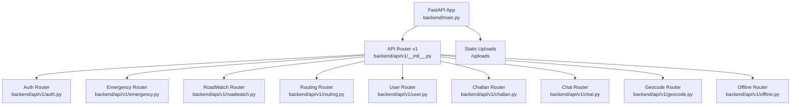
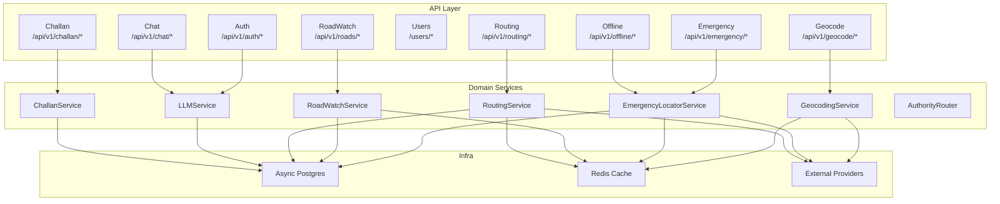
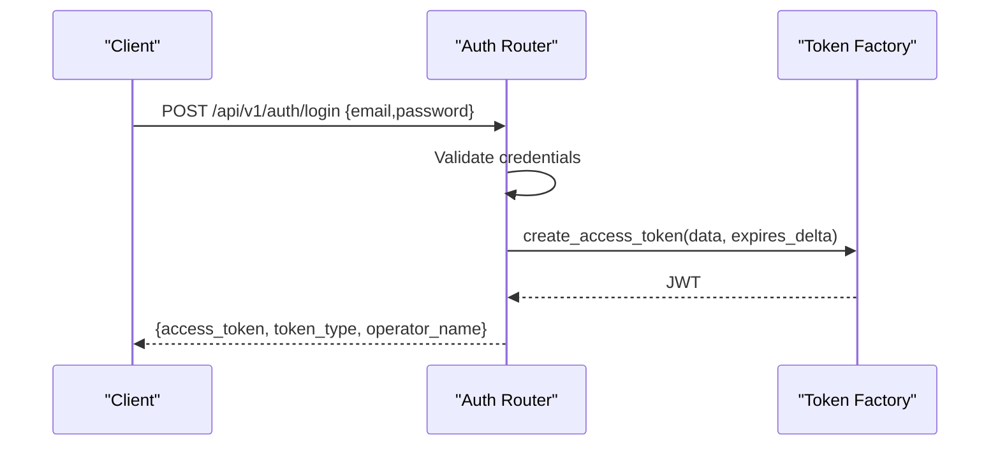
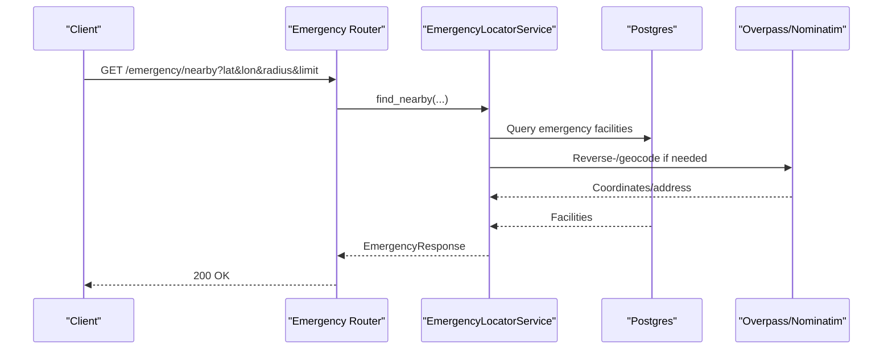
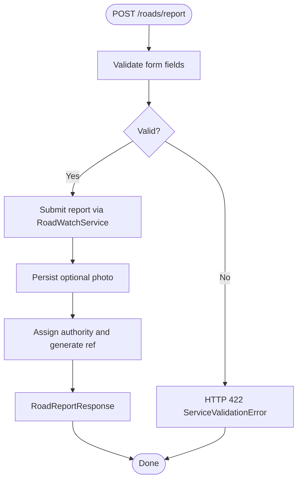
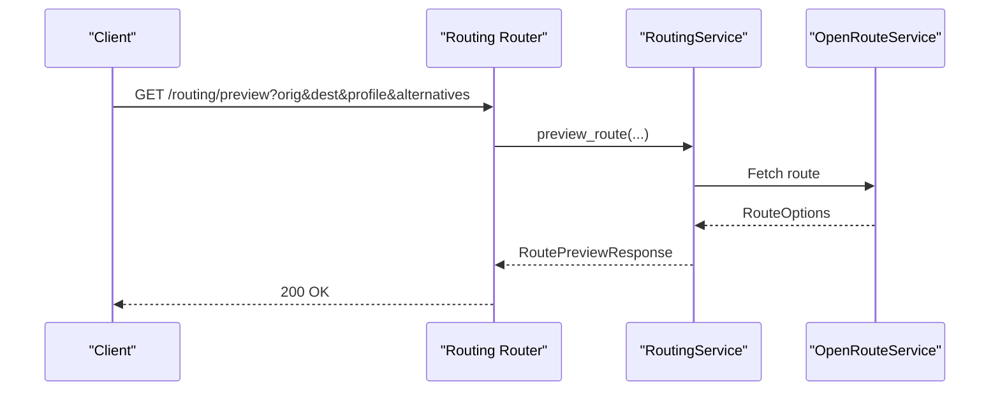
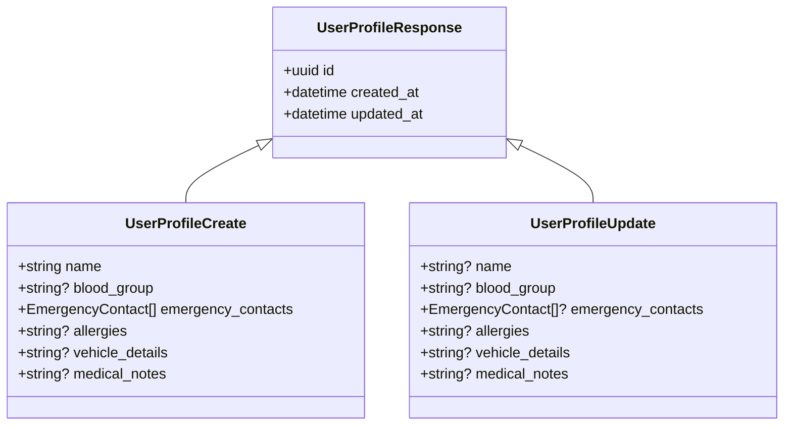
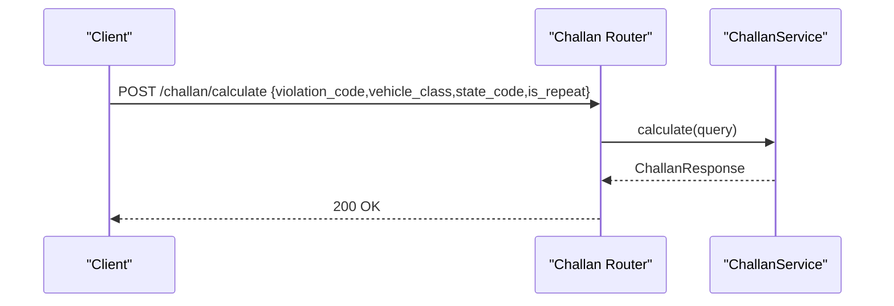
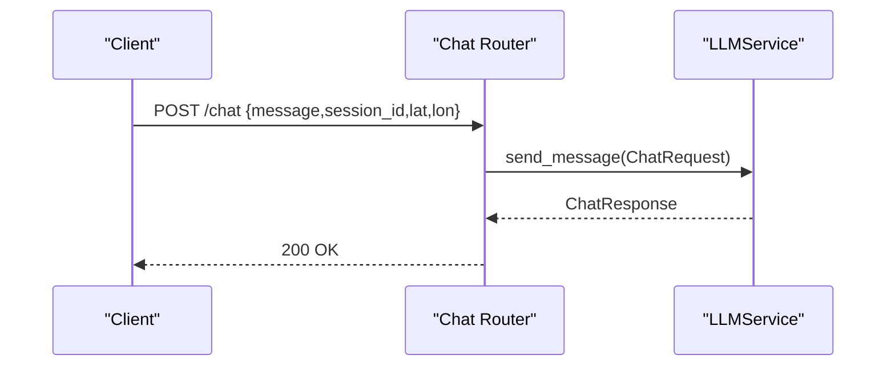
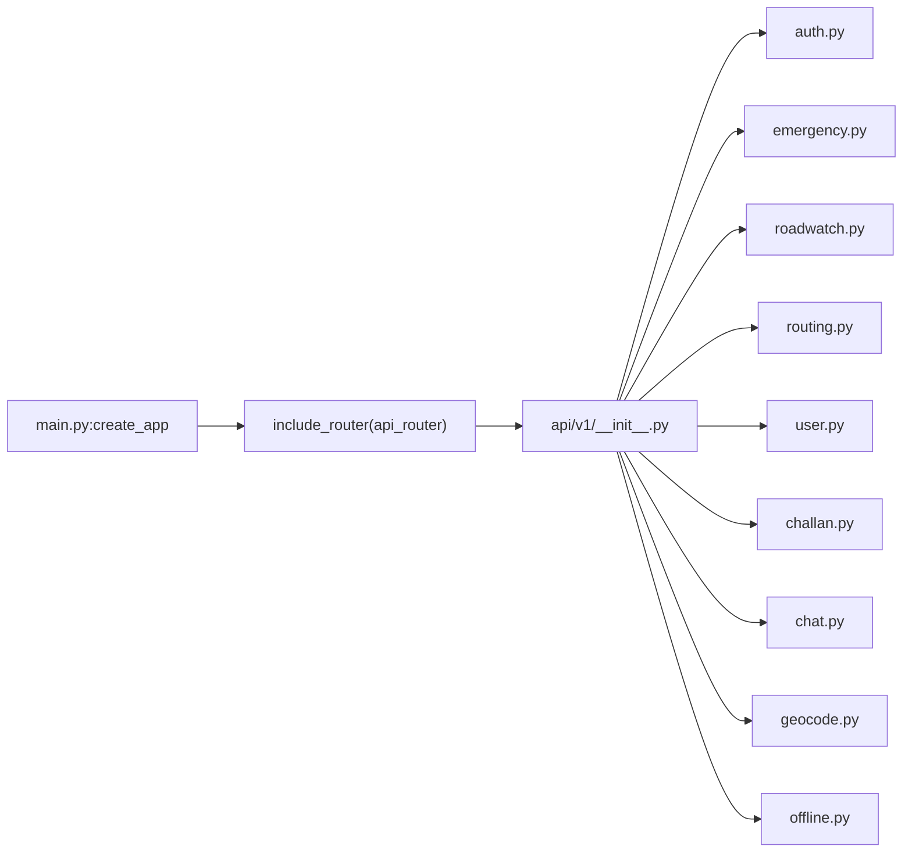

# API Reference

<cite>
**Referenced Files in This Document**
- [backend/main.py](file://backend/main.py)
- [backend/api/v1/__init__.py](file://backend/api/v1/__init__.py)
- [backend/api/v1/auth.py](file://backend/api/v1/auth.py)
- [backend/api/v1/emergency.py](file://backend/api/v1/emergency.py)
- [backend/api/v1/roadwatch.py](file://backend/api/v1/roadwatch.py)
- [backend/api/v1/routing.py](file://backend/api/v1/routing.py)
- [backend/api/v1/user.py](file://backend/api/v1/user.py)
- [backend/api/v1/challan.py](file://backend/api/v1/challan.py)
- [backend/api/v1/chat.py](file://backend/api/v1/chat.py)
- [backend/api/v1/geocode.py](file://backend/api/v1/geocode.py)
- [backend/api/v1/offline.py](file://backend/api/v1/offline.py)
- [backend/models/schemas.py](file://backend/models/schemas.py)
- [backend/core/security.py](file://backend/core/security.py)
- [backend/services/exceptions.py](file://backend/services/exceptions.py)
- [backend/core/config.py](file://backend/core/config.py)
</cite>

## Table of Contents
1. [Introduction](#introduction)
2. [Project Structure](#project-structure)
3. [Core Components](#core-components)
4. [Architecture Overview](#architecture-overview)
5. [Detailed Component Analysis](#detailed-component-analysis)
6. [Dependency Analysis](#dependency-analysis)
7. [Performance Considerations](#performance-considerations)
8. [Troubleshooting Guide](#troubleshooting-guide)
9. [Conclusion](#conclusion)
10. [Appendices](#appendices)

## Introduction
This document describes the SafeVixAI REST API surface implemented with FastAPI. It covers HTTP methods, URL patterns, request/response schemas, authentication, error handling, rate limiting, and versioning. It also documents WebSocket-related chat capabilities and provides guidance for clients, security, performance, and debugging.

## Project Structure
The backend exposes a single API version at /api/v1 and mounts static uploads under /uploads. The API router aggregates multiple feature routers for emergency, road reporting, routing, user management, authentication, challan calculation, chat, geocoding, and offline bundles.

**Diagram sources**
- [backend/main.py:127](file://backend/main.py#L127)
- [backend/api/v1/__init__.py:17-27](file://backend/api/v1/__init__.py#L17-L27)

**Section sources**
- [backend/main.py:65-128](file://backend/main.py#L65-L128)
- [backend/api/v1/__init__.py:1-28](file://backend/api/v1/__init__.py#L1-L28)

## Core Components
- Authentication: Bearer JWT tokens via Authorization header. Credentials managed via Supabase Auth.
- Validation and errors: Pydantic models define request/response schemas; service-level exceptions map to HTTP 422/503.
- Caching and external services: Redis-backed caching and upstream integrations for geocoding, routing, and OpenStreetMap/Overpass queries.
- Versioning: API version is embedded in URLs (/api/v1).

Security highlights:
- JWT algorithm HS256 with a shared secret.
- JWT validation using HS256 with environment-sourced secret keys.

**Section sources**
- [backend/core/security.py:13-41](file://backend/core/security.py#L13-L41)
- [backend/services/exceptions.py:1-7](file://backend/services/exceptions.py#L1-L7)
- [backend/core/config.py:11-181](file://backend/core/config.py#L11-L181)

## Architecture Overview
The API orchestrates domain services behind feature routers. Services depend on async database sessions, Redis cache, and external providers. Health checks expose runtime status and environment metadata.

**Diagram sources**
- [backend/api/v1/__init__.py:17-27](file://backend/api/v1/__init__.py#L17-L27)
- [backend/main.py:24-63](file://backend/main.py#L24-L63)

## Detailed Component Analysis

### Authentication
- Endpoint: POST /api/v1/auth/login
- Purpose: Issue bearer JWT for authenticated operators via Supabase Auth.
- Request body:
  - email: string
  - password: string
- Response body:
  - access_token: string
  - token_type: string
  - operator_name: string
- Notes:
  - Users are validated server-side via Supabase Auth JWT verification.
  - Token expiry is 7 days.

**Diagram sources**
- [backend/api/v1/auth.py:24-38](file://backend/api/v1/auth.py#L24-L38)
- [backend/core/security.py:13-21](file://backend/core/security.py#L13-L21)

**Section sources**
- [backend/api/v1/auth.py:1-44](file://backend/api/v1/auth.py#L1-L44)
- [backend/core/security.py:13-41](file://backend/core/security.py#L13-L41)

### Emergency Services
- GET /api/v1/emergency/nearby
  - Query params: lat, lon, categories (comma-separated), radius (100–50000), limit (1–50)
  - Response: EmergencyResponse
- GET /api/v1/emergency/sos
  - Query params: lat, lon
  - Behavior: Records incident and returns SOS payload
  - Response: SosResponse
- GET /api/v1/emergency/numbers
  - Response: EmergencyNumbersResponse
- GET /api/v1/emergency/safe-spaces
  - Query params: lat, lon, radius (default 1000)
  - Response: List of safe spaces

**Diagram sources**
- [backend/api/v1/emergency.py:19-75](file://backend/api/v1/emergency.py#L19-L75)

**Section sources**
- [backend/api/v1/emergency.py:1-83](file://backend/api/v1/emergency.py#L1-L83)
- [backend/models/schemas.py:32-66](file://backend/models/schemas.py#L32-L66)

### Road Reporting
- GET /api/v1/roads/issues
  - Query params: lat, lon, radius (default 5000), limit (1–100), statuses (comma-separated subset of open,acknowledged,in_progress,resolved,rejected)
  - Response: RoadIssuesResponse
- GET /api/v1/roads/authority
  - Query params: lat, lon
  - Response: AuthorityPreviewResponse
- GET /api/v1/roads/infrastructure
  - Query params: lat, lon
  - Response: RoadInfrastructureResponse
- POST /api/v1/roads/report
  - Form fields: lat, lon, issue_type (2–64 chars), severity (1–5), description, photo (optional)
  - Requires authenticated user
  - Response: RoadReportResponse

**Diagram sources**
- [backend/api/v1/roadwatch.py:73-97](file://backend/api/v1/roadwatch.py#L73-L97)

**Section sources**
- [backend/api/v1/roadwatch.py:1-97](file://backend/api/v1/roadwatch.py#L1-L97)
- [backend/models/schemas.py:103-161](file://backend/models/schemas.py#L103-L161)

### Routing
- GET /api/v1/routing/preview
  - Query params: origin_lat, origin_lon, destination_lat, destination_lon, profile (driving-car|cycling-regular|foot-walking), alternatives (0–2)
  - Response: RoutePreviewResponse
- GET /api/v1/routing/safe-route
  - Query params: origin_lat, origin_lon, destination_lat, destination_lon, prefer_safety (bool)
  - Response: Provider-specific route data

**Diagram sources**
- [backend/api/v1/routing.py:18-41](file://backend/api/v1/routing.py#L18-L41)

**Section sources**
- [backend/api/v1/routing.py:1-64](file://backend/api/v1/routing.py#L1-L64)
- [backend/models/schemas.py:163-210](file://backend/models/schemas.py#L163-L210)

### User Management
- POST /users/
  - Body: UserProfileCreate
  - Response: UserProfileResponse
- GET /users/{user_id}
  - Path param: user_id (UUID)
  - Response: UserProfileResponse
- PUT /users/{user_id}
  - Path param: user_id (UUID)
  - Body: UserProfileUpdate
  - Response: UserProfileResponse

**Diagram sources**
- [backend/models/schemas.py:259-287](file://backend/models/schemas.py#L259-L287)

**Section sources**
- [backend/api/v1/user.py:1-83](file://backend/api/v1/user.py#L1-L83)
- [backend/models/schemas.py:259-287](file://backend/models/schemas.py#L259-L287)

### Challan Calculation
- POST /api/v1/challan/calculate
  - Body: ChallanQuery
  - Response: ChallanResponse

**Diagram sources**
- [backend/api/v1/challan.py:17-25](file://backend/api/v1/challan.py#L17-L25)

**Section sources**
- [backend/api/v1/challan.py:1-26](file://backend/api/v1/challan.py#L1-L26)
- [backend/models/schemas.py:240-257](file://backend/models/schemas.py#L240-L257)

### Chatbot Integration
- POST /api/v1/chat/
  - Body: ChatRequest
  - Requires authenticated user
  - Response: ChatResponse

**Diagram sources**
- [backend/api/v1/chat.py:17-23](file://backend/api/v1/chat.py#L17-L23)

**Section sources**
- [backend/api/v1/chat.py:1-24](file://backend/api/v1/chat.py#L1-L24)
- [backend/models/schemas.py:226-238](file://backend/models/schemas.py#L226-L238)

### Geocoding
- GET /api/v1/geocode/search
  - Query params: q (min length 2)
  - Response: GeocodeSearchResponse
- GET /api/v1/geocode/reverse
  - Query params: lat, lon
  - Response: Array of geocoding results

**Section sources**
- [backend/api/v1/geocode.py:1-38](file://backend/api/v1/geocode.py#L1-L38)
- [backend/models/schemas.py:68-81](file://backend/models/schemas.py#L68-L81)

### Offline Bundles
- GET /api/v1/offline/bundle/{city}
  - Path param: city (string)
  - Response: City-specific emergency bundle

**Section sources**
- [backend/api/v1/offline.py:1-28](file://backend/api/v1/offline.py#L1-L28)

## Dependency Analysis
- Router composition: v1 router aggregates all feature routers.
- Runtime dependencies: services are attached to app.state during startup and injected via Depends.
- External dependencies: OpenRouteService, Photon/Nominatim, Overpass API, Postgres, Redis.

**Diagram sources**
- [backend/main.py:127](file://backend/main.py#L127)
- [backend/api/v1/__init__.py:17-27](file://backend/api/v1/__init__.py#L17-L27)

**Section sources**
- [backend/main.py:24-63](file://backend/main.py#L24-L63)
- [backend/api/v1/__init__.py:1-28](file://backend/api/v1/__init__.py#L1-L28)

## Performance Considerations
- Caching: Redis TTLs configured per domain (e.g., geocode, authority, route, general cache).
- Upstream timeouts and retries: Configurable retry attempts and backoff for external services.
- Upload limits: Max upload size and allowed content types are enforced.
- Route alternatives: Limit alternatives to reduce compute load.
- Radius defaults: Use conservative defaults for nearby queries to bound result sets.

**Section sources**
- [backend/core/config.py:26-63](file://backend/core/config.py#L26-L63)
- [backend/api/v1/roadwatch.py:73-97](file://backend/api/v1/roadwatch.py#L73-L97)

## Troubleshooting Guide
Common HTTP errors:
- 401 Unauthorized: Invalid or missing JWT; ensure Authorization: Bearer <token>.
- 404 Not Found: User profile or offline bundle not found.
- 422 Unprocessable Entity: Validation errors in request payloads (e.g., road report fields, challan query).
- 503 Service Unavailable: External service failures (routing, geocoding, emergency locator).

Health and diagnostics:
- GET /health returns operational status, cache availability, and environment/version info.
- Root endpoint lists available endpoints and metadata.

Rate limiting:
- No explicit rate limiter is present in the codebase. Apply at gateway/proxy level if needed.

**Section sources**
- [backend/api/v1/auth.py:24-38](file://backend/api/v1/auth.py#L24-L38)
- [backend/api/v1/user.py:39-53](file://backend/api/v1/user.py#L39-L53)
- [backend/api/v1/roadwatch.py:95-97](file://backend/api/v1/roadwatch.py#L95-L97)
- [backend/api/v1/challan.py:22-25](file://backend/api/v1/challan.py#L22-L25)
- [backend/api/v1/emergency.py:38-40](file://backend/api/v1/emergency.py#L38-L40)
- [backend/api/v1/routing.py:37-40](file://backend/api/v1/routing.py#L37-L40)
- [backend/api/v1/geocode.py:22-26](file://backend/api/v1/geocode.py#L22-L26)
- [backend/main.py:103-125](file://backend/main.py#L103-L125)

## Conclusion
SafeVixAI’s API provides a cohesive set of endpoints for emergency services, road reporting, routing, user profiles, challan calculation, and chat. It leverages async services, caching, and external providers while exposing a clean schema-driven interface. Clients should implement robust error handling, respect validation constraints, and apply appropriate caching and rate limiting strategies.

## Appendices

### Authentication Methods
- Header: Authorization: Bearer <JWT>
- JWT tokens are validated with strict HS256 signature verification using environment-sourced keys for demo/testing.

**Section sources**
- [backend/core/security.py:23-41](file://backend/core/security.py#L23-L41)

### Request/Response Examples (paths)
- Login: [backend/api/v1/auth.py:24-38](file://backend/api/v1/auth.py#L24-L38)
- Nearby emergency: [backend/api/v1/emergency.py:19-38](file://backend/api/v1/emergency.py#L19-L38)
- SOS payload: [backend/api/v1/emergency.py:42-71](file://backend/api/v1/emergency.py#L42-L71)
- Road report submission: [backend/api/v1/roadwatch.py:73-97](file://backend/api/v1/roadwatch.py#L73-L97)
- Route preview: [backend/api/v1/routing.py:18-41](file://backend/api/v1/routing.py#L18-L41)
- Safe route: [backend/api/v1/routing.py:43-64](file://backend/api/v1/routing.py#L43-L64)
- User profile CRUD: [backend/api/v1/user.py:16-83](file://backend/api/v1/user.py#L16-L83)
- Challan calculation: [backend/api/v1/challan.py:17-25](file://backend/api/v1/challan.py#L17-L25)
- Chat: [backend/api/v1/chat.py:17-23](file://backend/api/v1/chat.py#L17-L23)
- Geocoding search: [backend/api/v1/geocode.py:28-37](file://backend/api/v1/geocode.py#L28-L37)
- Offline bundle: [backend/api/v1/offline.py:18-27](file://backend/api/v1/offline.py#L18-L27)

### Error Handling Strategy
- Validation errors: HTTP 422 with service-provided detail.
- External service failures: HTTP 503 with upstream error detail.
- Authentication failures: HTTP 401 with credential error detail.
- Resource not found: HTTP 404 for user profiles and offline bundles.

**Section sources**
- [backend/services/exceptions.py:1-7](file://backend/services/exceptions.py#L1-L7)
- [backend/api/v1/roadwatch.py:95-97](file://backend/api/v1/roadwatch.py#L95-L97)
- [backend/api/v1/emergency.py:38-40](file://backend/api/v1/emergency.py#L38-L40)
- [backend/api/v1/routing.py:37-40](file://backend/api/v1/routing.py#L37-L40)
- [backend/api/v1/geocode.py:22-26](file://backend/api/v1/geocode.py#L22-L26)
- [backend/api/v1/user.py:48-52](file://backend/api/v1/user.py#L48-L52)
- [backend/api/v1/offline.py:24-27](file://backend/api/v1/offline.py#L24-L27)

### Rate Limiting
- Not implemented in code. Recommended to enforce per-client quotas at ingress.

### Versioning
- API version: /api/v1
- Application version: exposed in health and root endpoints.

**Section sources**
- [backend/core/config.py:11-181](file://backend/core/config.py#L11-L181)
- [backend/main.py:75-101](file://backend/main.py#L75-L101)
- [backend/main.py:103-125](file://backend/main.py#L103-L125)

### Security Considerations
- Use HTTPS in production.
- Rotate JWT secret regularly; all tokens are validated with strict signature verification.
- Validate and sanitize uploaded photos; restrict content types and sizes.
- Enforce CORS origins appropriately for production environments.

**Section sources**
- [backend/core/security.py:7-9](file://backend/core/security.py#L7-L9)
- [backend/core/config.py:59-63](file://backend/core/config.py#L59-L63)
- [backend/core/config.py:72-84](file://backend/core/config.py#L72-L84)

### Client Implementation Guidelines
- Always attach Authorization: Bearer <token> for protected endpoints.
- Respect query constraints (bounds, limits, allowed statuses).
- Cache responses where appropriate using TTLs aligned with configuration.
- Implement retry with backoff for 503 responses from external services.

### WebSocket Endpoints
- No WebSocket endpoints are defined in the backend codebase. Real-time chat interactions are handled via synchronous chat endpoints.

**Section sources**
- [backend/api/v1/chat.py:17-23](file://backend/api/v1/chat.py#L17-L23)