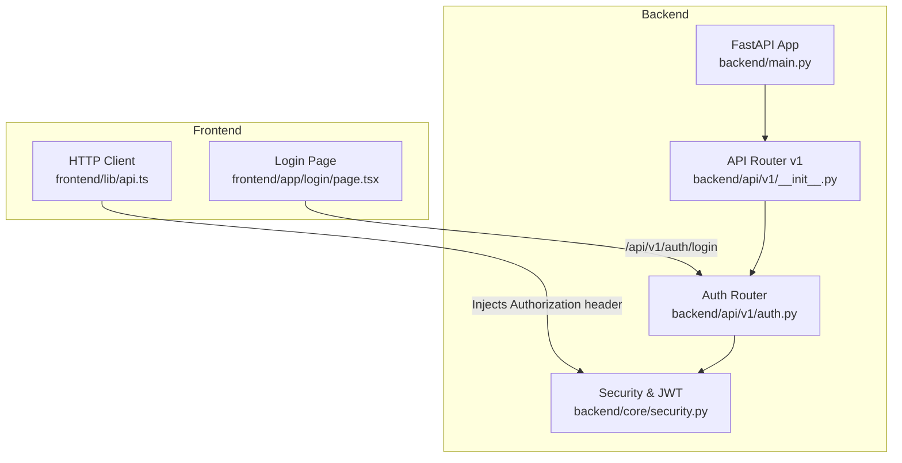
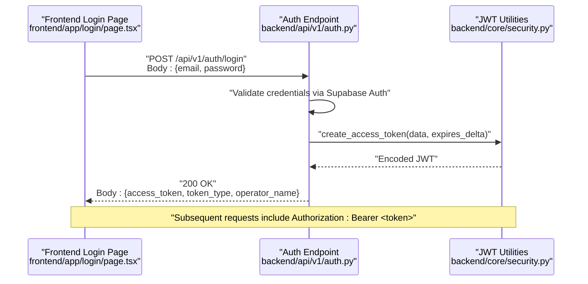
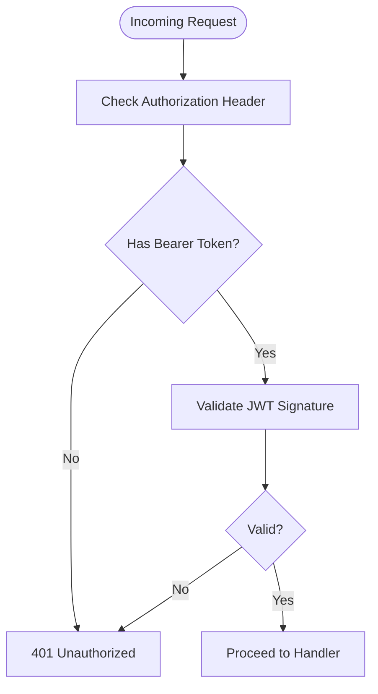
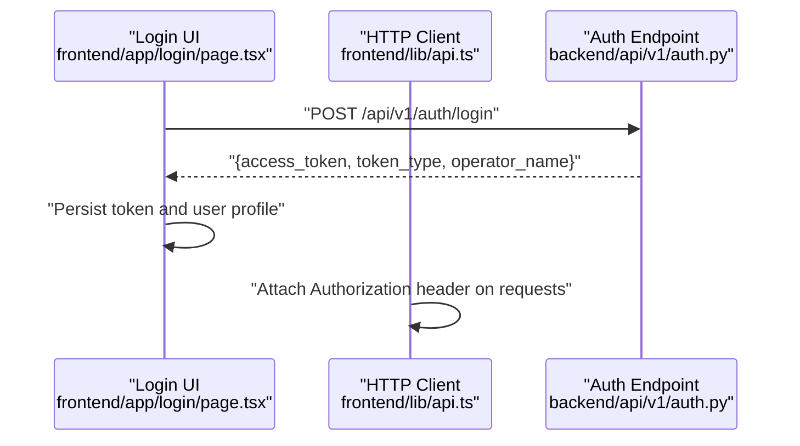
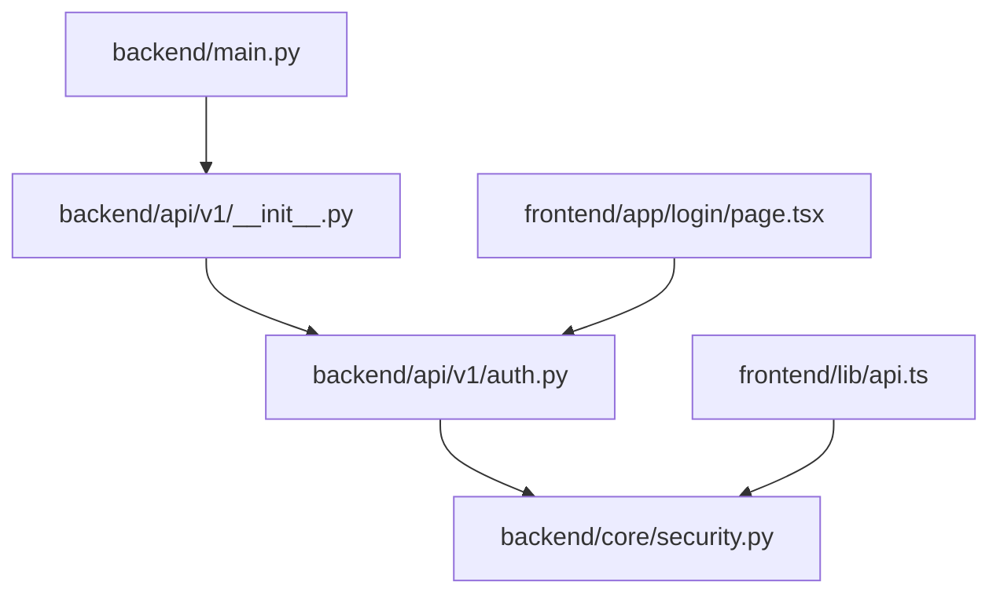

# Authentication API

<cite>
**Referenced Files in This Document**
- [backend/api/v1/auth.py](file://backend/api/v1/auth.py)
- [backend/core/security.py](file://backend/core/security.py)
- [backend/api/v1/__init__.py](file://backend/api/v1/__init__.py)
- [backend/main.py](file://backend/main.py)
- [frontend/app/login/page.tsx](file://frontend/app/login/page.tsx)
- [frontend/lib/api.ts](file://frontend/lib/api.ts)
</cite>

## Table of Contents
1. [Introduction](#introduction)
2. [Project Structure](#project-structure)
3. [Core Components](#core-components)
4. [Architecture Overview](#architecture-overview)
5. [Detailed Component Analysis](#detailed-component-analysis)
6. [Dependency Analysis](#dependency-analysis)
7. [Performance Considerations](#performance-considerations)
8. [Troubleshooting Guide](#troubleshooting-guide)
9. [Conclusion](#conclusion)

## Introduction
This document provides comprehensive API documentation for the authentication endpoints powering the SafeVixAI operator portal. It covers HTTP methods, URL patterns, request/response schemas, JWT token handling, and security headers. It also includes practical examples for user registration, login workflows, session management, and secure token handling patterns tailored for the project’s FastAPI backend and Next.js frontend.

## Project Structure
The authentication system is implemented as part of the backend FastAPI application under the v1 API namespace. The authentication router exposes endpoints for login verification and token validation. The frontend integrates with these endpoints using a dedicated login page and a shared HTTP client that injects Authorization headers automatically.

**Diagram sources**
- [backend/main.py:24-132](file://backend/main.py#L24-L132)
- [backend/api/v1/__init__.py:17-28](file://backend/api/v1/__init__.py#L17-L28)
- [backend/api/v1/auth.py:1-44](file://backend/api/v1/auth.py#L1-L44)
- [backend/core/security.py:1-41](file://backend/core/security.py#L1-L41)
- [frontend/app/login/page.tsx:50-82](file://frontend/app/login/page.tsx#L50-L82)
- [frontend/lib/api.ts:14-47](file://frontend/lib/api.ts#L14-L47)

**Section sources**
- [backend/main.py:24-132](file://backend/main.py#L24-L132)
- [backend/api/v1/__init__.py:17-28](file://backend/api/v1/__init__.py#L17-L28)
- [backend/api/v1/auth.py:1-44](file://backend/api/v1/auth.py#L1-L44)
- [backend/core/security.py:1-41](file://backend/core/security.py#L1-L41)
- [frontend/app/login/page.tsx:50-82](file://frontend/app/login/page.tsx#L50-L82)
- [frontend/lib/api.ts:14-47](file://frontend/lib/api.ts#L14-L47)

## Core Components
- Authentication Router: Exposes login endpoint and a verification endpoint for health checks.
- JWT Utilities: Provides token creation and validation with bearer token support.
- Frontend Integration: Handles login submission, stores tokens, and injects Authorization headers for protected requests.

Key capabilities:
- Login with email/password against a demo user registry.
- Token issuance with a fixed expiration.
- Token validation middleware for protected routes.
- Automatic Authorization header injection for authenticated requests.

**Section sources**
- [backend/api/v1/auth.py:24-43](file://backend/api/v1/auth.py#L24-L43)
- [backend/core/security.py:13-41](file://backend/core/security.py#L13-L41)
- [frontend/app/login/page.tsx:50-82](file://frontend/app/login/page.tsx#L50-L82)
- [frontend/lib/api.ts:19-47](file://frontend/lib/api.ts#L19-L47)

## Architecture Overview
The authentication flow connects the frontend login page to the backend login endpoint, which validates credentials and issues a JWT. Subsequent requests from the frontend client automatically include the Authorization header, enabling server-side validation via the JWT middleware.

**Diagram sources**
- [backend/api/v1/auth.py:24-38](file://backend/api/v1/auth.py#L24-L38)
- [backend/core/security.py:13-21](file://backend/core/security.py#L13-L21)
- [frontend/app/login/page.tsx:60-72](file://frontend/app/login/page.tsx#L60-L72)
- [frontend/lib/api.ts:19-30](file://frontend/lib/api.ts#L19-L30)

## Detailed Component Analysis

### Authentication Endpoints

- Base URL: `/api/v1/auth`
- Available endpoints:
  - POST /login
  - GET /verify

#### POST /login
- Purpose: Authenticate operator credentials and issue a JWT access token.
- Request Schema:
  - email: string (required)
  - password: string (required)
- Response Schema:
  - access_token: string
  - token_type: string
  - operator_name: string
- Error Responses:
  - 401 Unauthorized: Invalid credentials

Example request body:
{
  "email": "operator@example.com",
  "password": "securePassword123"
}

Example successful response:
{
  "access_token": "eyJhbGciOiJIUzI1NiIs...",
  "token_type": "bearer",
  "operator_name": "Demo Operator"
}

Example error response:
{
  "detail": "Invalid credentials"
}

Security Notes:
- Uses a demo user registry for validation during the hackathon phase.
- Issues a JWT with a fixed expiration period.
- Frontend automatically attaches Authorization: Bearer <token> to subsequent requests.

**Section sources**
- [backend/api/v1/auth.py:8-38](file://backend/api/v1/auth.py#L8-L38)
- [backend/api/v1/auth.py:24-38](file://backend/api/v1/auth.py#L24-L38)
- [frontend/app/login/page.tsx:60-72](file://frontend/app/login/page.tsx#L60-L72)
- [frontend/lib/api.ts:19-30](file://frontend/lib/api.ts#L19-L30)

#### GET /verify
- Purpose: Health check endpoint for the authentication service.
- Response Schema:
  - status: string

Example response:
{
  "status": "auth_service_online"
}

**Section sources**
- [backend/api/v1/auth.py:40-43](file://backend/api/v1/auth.py#L40-L43)

### JWT Token Handling and Validation

- Token Creation:
  - Payload includes subject identifier and name.
  - Uses a fixed secret key and HS256 algorithm.
  - Default expiration is seven days.

- Token Validation:
  - HTTP Bearer scheme enforced.
  - Validates JWT signature and extracts claims.
  - Validates tokens using environment-sourced secret keys.

- Frontend Integration:
  - Authorization header injected on every request.
  - Falls back to environment-sourced JWT if storage is unavailable.

**Diagram sources**
- [backend/core/security.py:23-41](file://backend/core/security.py#L23-L41)
- [frontend/lib/api.ts:19-30](file://frontend/lib/api.ts#L19-L30)

**Section sources**
- [backend/core/security.py:13-21](file://backend/core/security.py#L13-L21)
- [backend/core/security.py:23-41](file://backend/core/security.py#L23-L41)
- [frontend/lib/api.ts:19-30](file://frontend/lib/api.ts#L19-L30)

### Frontend Integration Patterns

- Login Workflow:
  - Collects email and password.
  - Sends POST /api/v1/auth/login with JSON body.
  - On success, stores the access token and user profile in the app state.
  - Redirects to the home page.

- Protected Requests:
  - Interceptor reads stored token and sets Authorization: Bearer <token>.
  - Falls back to environment-sourced JWT if retrieval fails.

**Diagram sources**
- [frontend/app/login/page.tsx:50-82](file://frontend/app/login/page.tsx#L50-L82)
- [frontend/lib/api.ts:19-30](file://frontend/lib/api.ts#L19-L30)
- [backend/api/v1/auth.py:24-38](file://backend/api/v1/auth.py#L24-L38)

**Section sources**
- [frontend/app/login/page.tsx:50-82](file://frontend/app/login/page.tsx#L50-L82)
- [frontend/lib/api.ts:19-30](file://frontend/lib/api.ts#L19-L30)

## Dependency Analysis
- The main application mounts the v1 API router, which includes the auth router.
- The auth router depends on JWT utilities for token creation and validation.
- The frontend depends on the auth endpoint for login and on the HTTP client for Authorization header injection.

**Diagram sources**
- [backend/main.py:127-128](file://backend/main.py#L127-L128)
- [backend/api/v1/__init__.py:14-27](file://backend/api/v1/__init__.py#L14-L27)
- [backend/api/v1/auth.py:1-6](file://backend/api/v1/auth.py#L1-L6)
- [backend/core/security.py:1-11](file://backend/core/security.py#L1-L11)
- [frontend/app/login/page.tsx:50-82](file://frontend/app/login/page.tsx#L50-L82)
- [frontend/lib/api.ts:19-30](file://frontend/lib/api.ts#L19-L30)

**Section sources**
- [backend/main.py:127-128](file://backend/main.py#L127-L128)
- [backend/api/v1/__init__.py:14-27](file://backend/api/v1/__init__.py#L14-L27)
- [backend/api/v1/auth.py:1-6](file://backend/api/v1/auth.py#L1-L6)
- [backend/core/security.py:1-11](file://backend/core/security.py#L1-L11)
- [frontend/app/login/page.tsx:50-82](file://frontend/app/login/page.tsx#L50-L82)
- [frontend/lib/api.ts:19-30](file://frontend/lib/api.ts#L19-L30)

## Performance Considerations
- Token validation occurs per request; keep payloads minimal to reduce overhead.
- The demo user registry lookup is O(1) due to dictionary access.
- Avoid excessive token issuance; reuse tokens until expiration.

## Troubleshooting Guide
Common issues and resolutions:
- 401 Unauthorized on login:
  - Verify email and password via Supabase Auth.
  - Confirm the request body includes both email and password fields.
- 401 Unauthorized on protected routes:
  - Ensure Authorization header is present and formatted as Bearer <token>.
  - Confirm the token is not expired.
- Demo mode bypass:
  - Frontend uses Supabase Auth JWT tokens; ensure the interceptor is functioning.

**Section sources**
- [backend/api/v1/auth.py:24-38](file://backend/api/v1/auth.py#L24-L38)
- [backend/core/security.py:23-41](file://backend/core/security.py#L23-L41)
- [frontend/lib/api.ts:19-30](file://frontend/lib/api.ts#L19-L30)

## Conclusion
The authentication system provides a streamlined login flow with JWT-based session management, suitable for the hackathon demo. It integrates cleanly with the frontend via explicit login handling and automatic Authorization header injection. For production, consider implementing secure password hashing, refresh token rotation, and robust user registration flows.