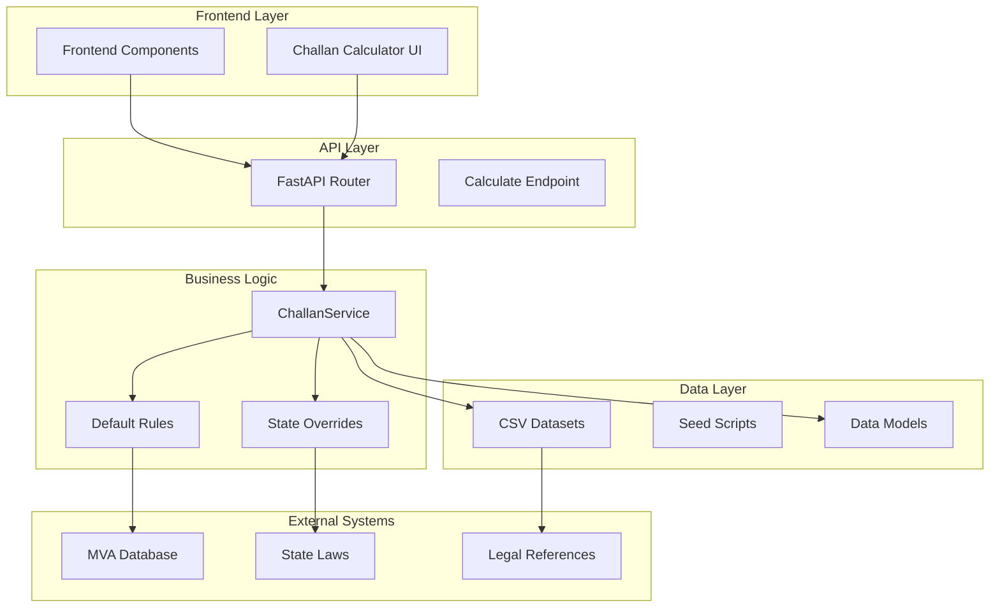
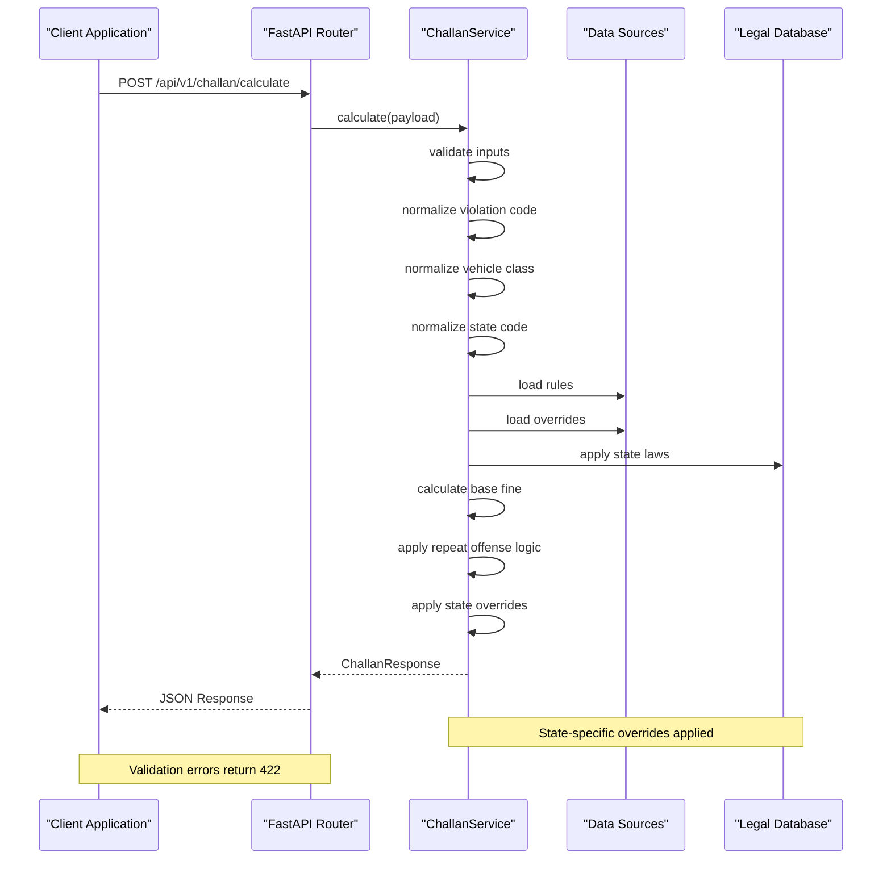
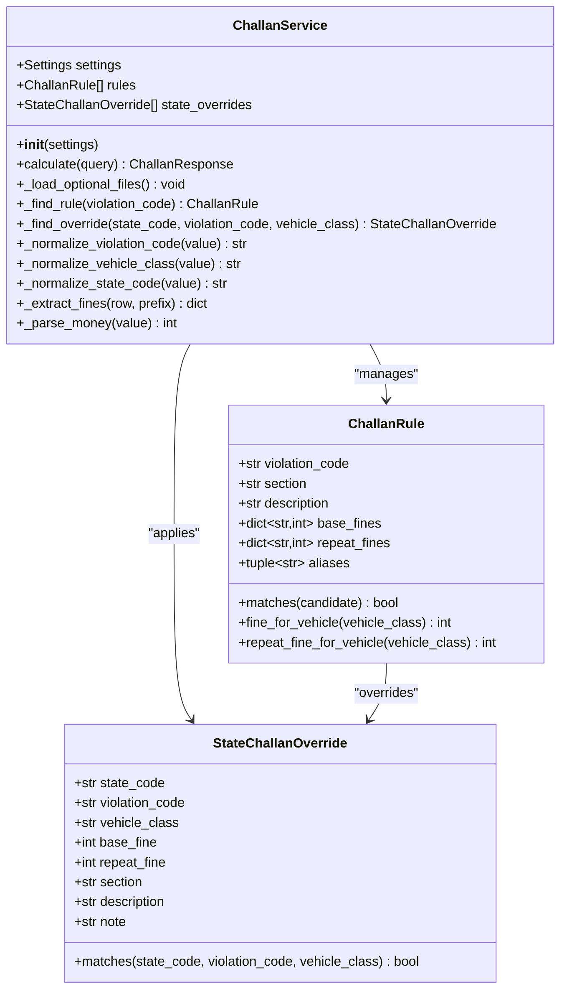
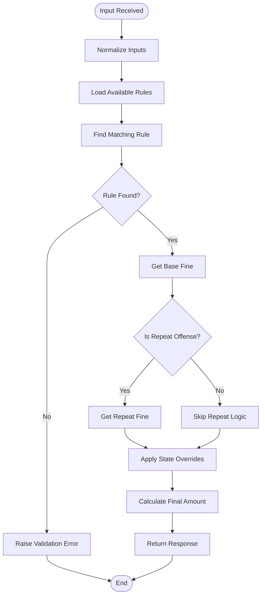
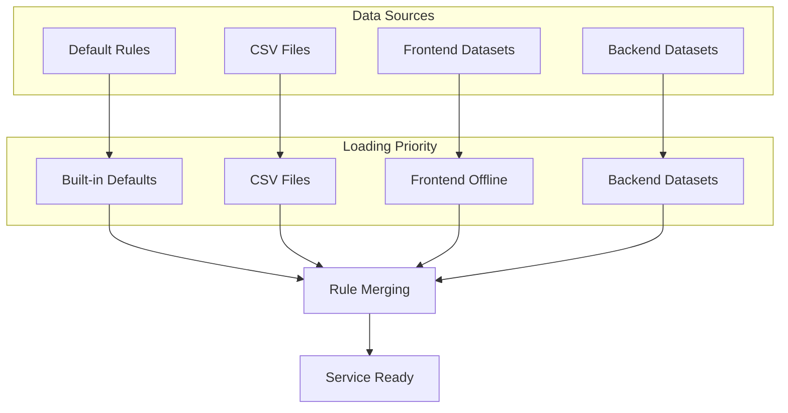
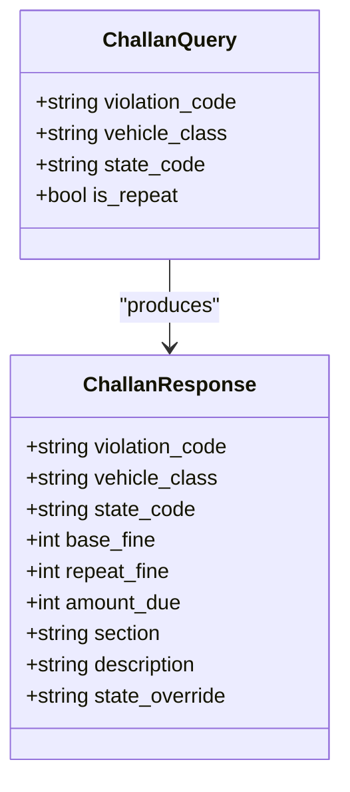

# Challan Calculator API

<cite>
**Referenced Files in This Document**
- [challan.py](file://backend/api/v1/challan.py)
- [challan_service.py](file://backend/services/challan_service.py)
- [schemas.py](file://backend/models/schemas.py)
- [challan.py](file://backend/models/challan.py)
- [main.py](file://backend/main.py)
- [test_challan.py](file://backend/tests/test_challan.py)
- [seed_violations.py](file://backend/scripts/data/seed_violations.py)
- [state_overrides.csv](file://chatbot_service/data/state_overrides.csv)
- [violations.csv](file://frontend/public/offline-data/violations.csv)
- [state_overrides.csv](file://frontend/public/offline-data/state_overrides.csv)
- [page.tsx](file://frontend/app/challan/page.tsx)
- [ChallanCalculator.tsx](file://frontend/components/ChallanCalculator.tsx)
</cite>

## Table of Contents
1. [Introduction](#introduction)
2. [Project Structure](#project-structure)
3. [Core Components](#core-components)
4. [Architecture Overview](#architecture-overview)
5. [Detailed Component Analysis](#detailed-component-analysis)
6. [API Reference](#api-reference)
7. [Data Models](#data-models)
8. [Integration with Legal Databases](#integration-with-legal-databases)
9. [Examples](#examples)
10. [Troubleshooting Guide](#troubleshooting-guide)
11. [Conclusion](#conclusion)

## Introduction

The Challan Calculator API provides real-time traffic challan calculation services for Indian road users. This API calculates penalties for traffic violations based on violation codes, vehicle classes, and state-specific regulations, integrating with the Motor Vehicles Act (MVA) 1988 and state-specific traffic laws.

The system supports both online calculation using centralized data and offline calculation using preloaded datasets for environments without internet connectivity. It provides standardized fine calculations, legal references, and compliance guidance for traffic violations across all Indian states and union territories.

## Project Structure

The Challan Calculator API is built as part of the SafeVixAI ecosystem, which combines AI-powered road safety services with traditional traffic enforcement systems. The API follows a modular architecture with clear separation between presentation, business logic, and data layers.



**Diagram sources**
- [challan.py:10-25](file://backend/api/v1/challan.py#L10-L25)
- [challan_service.py:96-101](file://backend/services/challan_service.py#L96-L101)
- [main.py:35-50](file://backend/main.py#L35-L50)

**Section sources**
- [challan.py:1-26](file://backend/api/v1/challan.py#L1-L26)
- [challan_service.py:1-314](file://backend/services/challan_service.py#L1-L314)
- [main.py:24-64](file://backend/main.py#L24-L64)

## Core Components

The Challan Calculator system consists of several interconnected components that work together to provide accurate and state-compliant traffic fine calculations.

### API Router and Endpoints
The API exposes a single primary endpoint `/api/v1/challan/calculate` that accepts violation details and returns calculated penalties. The router handles request validation, service dependency injection, and error response formatting.

### ChallanService
The core business logic component that processes violation calculations, applies state-specific overrides, and manages data loading from multiple sources including default rules, CSV files, and external datasets.

### Data Models
Pydantic models define the request/response schemas for Challan calculations, ensuring type safety and validation across the entire API stack.

### State-Specific Integration
The system integrates with state-specific traffic laws through configurable override mechanisms that allow individual states to modify base fines according to their regulations.

**Section sources**
- [challan.py:17-25](file://backend/api/v1/challan.py#L17-L25)
- [challan_service.py:96-149](file://backend/services/challan_service.py#L96-L149)
- [schemas.py:240-257](file://backend/models/schemas.py#L240-L257)

## Architecture Overview

The Challan Calculator API follows a layered architecture pattern with clear separation of concerns and dependency injection for testability and maintainability.



**Diagram sources**
- [challan.py:17-25](file://backend/api/v1/challan.py#L17-L25)
- [challan_service.py:103-149](file://backend/services/challan_service.py#L103-L149)
- [schemas.py:240-257](file://backend/models/schemas.py#L240-L257)

The architecture supports multiple data loading strategies:
- Built-in default rules for core violations
- CSV-based rule sets for customization
- State-specific override configurations
- Frontend offline datasets for disconnected operation

**Section sources**
- [challan_service.py:151-166](file://backend/services/challan_service.py#L151-L166)
- [seed_violations.py:419-478](file://backend/scripts/data/seed_violations.py#L419-L478)

## Detailed Component Analysis

### ChallanService Implementation

The ChallanService class encapsulates all business logic for traffic violation calculations, implementing sophisticated rule matching and state-specific override application.



**Diagram sources**
- [challan_service.py:96-314](file://backend/services/challan_service.py#L96-L314)
- [challan.py:6-53](file://backend/models/challan.py#L6-L53)

#### Input Normalization and Validation

The service implements comprehensive input normalization to handle various input formats and edge cases:

- **Violation Code Normalization**: Removes special characters and converts to uppercase
- **Vehicle Class Normalization**: Supports aliases like "2W", "LMV", "HTV" and converts to canonical forms
- **State Code Normalization**: Handles full names, abbreviations, and postal codes

#### Rule Matching Algorithm

The rule matching system supports multiple violation code formats including aliases and variations:



**Diagram sources**
- [challan_service.py:103-149](file://backend/services/challan_service.py#L103-L149)

**Section sources**
- [challan_service.py:290-314](file://backend/services/challan_service.py#L290-L314)
- [challan_service.py:240-260](file://backend/services/challan_service.py#L240-L260)

### Data Loading and Management

The system supports multiple data sources with precedence and fallback mechanisms:



**Diagram sources**
- [challan_service.py:151-166](file://backend/services/challan_service.py#L151-L166)
- [seed_violations.py:140-151](file://backend/scripts/data/seed_violations.py#L140-L151)

**Section sources**
- [challan_service.py:168-238](file://backend/services/challan_service.py#L168-L238)
- [seed_violations.py:237-408](file://backend/scripts/data/seed_violations.py#L237-L408)

## API Reference

### Base URL
```
/api/v1/challan
```

### Authentication
No authentication required for challan calculation endpoints.

### Rate Limiting
Not implemented at this time. Production deployments should implement appropriate rate limiting.

### Error Responses

| Status Code | Error Type | Description |
|-------------|------------|-------------|
| 400 | Bad Request | Invalid JSON payload |
| 422 | Unprocessable Entity | Validation errors for required fields |
| 500 | Internal Server Error | Unexpected server errors |

### Endpoint: Calculate Challan

**HTTP Method**: `POST`
**URL**: `/api/v1/challan/calculate`

#### Request Schema

| Field | Type | Required | Description | Example |
|-------|------|----------|-------------|---------|
| `violation_code` | string | Yes | Traffic violation code | `"183"` |
| `vehicle_class` | string | Yes | Vehicle classification | `"2W"` |
| `state_code` | string | Yes | State/UT code | `"TN"` |
| `is_repeat` | boolean | No | Repeat offense flag | `false` |

#### Response Schema

| Field | Type | Description | Example |
|-------|------|-------------|---------|
| `violation_code` | string | Original violation code | `"183"` |
| `vehicle_class` | string | Normalized vehicle class | `"two_wheeler"` |
| `state_code` | string | Normalized state code | `"TN"` |
| `base_fine` | integer | Base penalty amount | `1000` |
| `repeat_fine` | integer \| null | Repeat offense penalty | `2000` |
| `amount_due` | integer | Final amount to pay | `1000` |
| `section` | string | Legal section reference | `"Section 183"` |
| `description` | string | Violation description | `"Speeding beyond the notified limit."` |
| `state_override` | string \| null | State-specific override note | `"TN override applied"` |

#### Success Response (200 OK)

```json
{
  "violation_code": "183",
  "vehicle_class": "two_wheeler",
  "state_code": "TN",
  "base_fine": 1000,
  "repeat_fine": 2000,
  "amount_due": 1000,
  "section": "Section 183",
  "description": "Speeding beyond the notified limit.",
  "state_override": null
}
```

#### Error Response (422 Unprocessable Entity)

```json
{
  "detail": "Unsupported violation code \"XYZ\". Known examples include 183, 185, 181, 194D, 194B, and 179."
}
```

**Section sources**
- [challan.py:17-25](file://backend/api/v1/challan.py#L17-L25)
- [schemas.py:240-257](file://backend/models/schemas.py#L240-L257)
- [test_challan.py:45-58](file://backend/tests/test_challan.py#L45-L58)

## Data Models

### ChallanQuery Model

The request model defines the input parameters for challan calculations:



**Diagram sources**
- [schemas.py:240-257](file://backend/models/schemas.py#L240-L257)

#### Validation Rules

The models implement strict validation rules:
- All string fields have minimum and maximum length constraints
- Vehicle class and state code are required
- Violation code must match specific patterns
- Repeat flag defaults to false

**Section sources**
- [schemas.py:240-257](file://backend/models/schemas.py#L240-L257)

## Integration with Legal Databases

### Motor Vehicles Act Integration

The API integrates with the Motor Vehicles Act (MVA) 1988, which serves as the primary legal framework for traffic violations in India. The system maintains references to specific sections and provides legal descriptions for each violation.

### State-Specific Law Integration

Each state and union territory can customize fine amounts and descriptions through override mechanisms:

| State | Code | Override Type | Effective Date |
|-------|------|---------------|----------------|
| Tamil Nadu | TN | Helmet violation | 2022-10-20 |
| Delhi | DL | Emergency vehicle violation | 2019-09-01 |
| Karnataka | KA | Helmet violation | 2019-09-01 |
| Kerala | KL | Helmet violation | 2019-12-05 |
| Maharashtra | MH | Speeding (Mumbai) | 2020-01-01 |
| Gujarat | GJ | Drunk driving | 2019-09-02 |
| Andhra Pradesh | AP | Helmet violation | 2019-10-01 |
| Telangana | TS | Motorcycle safety | 2019-09-01 |
| West Bengal | WB | Dangerous driving | 2019-09-01 |
| Uttar Pradesh | UP | Driving without license | 2019-09-01 |

### Legal Reference System

The API maintains comprehensive legal references for each violation:

- **Section Numbers**: Specific MVA sections violated
- **Descriptions**: Clear violation descriptions
- **Maximum Penalties**: Upper limits for each violation type
- **Imprisonment Terms**: Potential jail time for serious offenses
- **License Points**: Offense severity indicators

**Section sources**
- [state_overrides.csv:1-14](file://chatbot_service/data/state_overrides.csv#L1-L14)
- [state_overrides.csv:1-14](file://frontend/public/offline-data/state_overrides.csv#L1-L14)

## Examples

### Basic Challan Calculation

**Request**:
```json
{
  "violation_code": "183",
  "vehicle_class": "car",
  "state_code": "TN",
  "is_repeat": false
}
```

**Response**:
```json
{
  "violation_code": "183",
  "vehicle_class": "light_motor_vehicle",
  "state_code": "TN",
  "base_fine": 2000,
  "repeat_fine": 4000,
  "amount_due": 2000,
  "section": "Section 183",
  "description": "Speeding beyond the notified limit.",
  "state_override": null
}
```

### Repeat Offense Calculation

**Request**:
```json
{
  "violation_code": "185",
  "vehicle_class": "2W",
  "state_code": "KA",
  "is_repeat": true
}
```

**Response**:
```json
{
  "violation_code": "185",
  "vehicle_class": "two_wheeler",
  "state_code": "KA",
  "base_fine": 10000,
  "repeat_fine": 15000,
  "amount_due": 15000,
  "section": "Section 185",
  "description": "Driving under the influence of alcohol or drugs.",
  "state_override": null
}
```

### State-Specific Override

**Request**:
```json
{
  "violation_code": "194D",
  "vehicle_class": "2W",
  "state_code": "TN",
  "is_repeat": false
}
```

**Response**:
```json
{
  "violation_code": "194D",
  "vehicle_class": "two_wheeler",
  "state_code": "TN",
  "base_fine": 1000,
  "repeat_fine": 2000,
  "amount_due": 1000,
  "section": "Sections 129/194D",
  "description": "Failure to wear a helmet or seat belt as required.",
  "state_override": "TN override applied"
}
```

**Section sources**
- [test_challan.py:6-24](file://backend/tests/test_challan.py#L6-L24)
- [test_challan.py:26-43](file://backend/tests/test_challan.py#L26-L43)

## Troubleshooting Guide

### Common Issues and Solutions

#### Invalid Violation Code
**Problem**: `Unsupported violation code "XYZ"`
**Solution**: Use valid MVA violation codes (e.g., "183", "185", "181", "194D", "194B", "179")

#### Invalid Vehicle Class
**Problem**: `vehicle_class is required`
**Solution**: Use supported vehicle classes:
- `"2W"` or `"two_wheeler"` for motorcycles/scooters
- `"4W"` or `"light_motor_vehicle"` for cars/SUVs
- `"HTV"` or `"heavy_vehicle"` for trucks
- `"BUS"` or `"bus"` for public transport

#### Invalid State Code
**Problem**: `state_code is required`
**Solution**: Use valid state codes (e.g., "TN", "KA", "MH", "DL", "UP", "WB")

#### Calculation Errors
**Problem**: Unexpected penalty amounts
**Solution**: Verify state-specific overrides are properly loaded and check for repeat offense flags

### Testing and Validation

The API includes comprehensive test coverage for:
- Default rule calculations
- Input normalization and validation
- State-specific override application
- Error handling scenarios

**Section sources**
- [test_challan.py:45-58](file://backend/tests/test_challan.py#L45-L58)

## Conclusion

The Challan Calculator API provides a robust, scalable solution for traffic fine calculations across all Indian states and union territories. Its modular architecture, comprehensive legal integration, and flexible data loading mechanisms make it suitable for both online and offline deployment scenarios.

Key strengths include:
- **Legal Compliance**: Integration with MVA 1988 and state-specific laws
- **Flexibility**: Support for multiple data sources and override mechanisms
- **Scalability**: Stateless design enabling horizontal scaling
- **Maintainability**: Clear separation of concerns and comprehensive testing

The API serves as a foundation for broader road safety initiatives, supporting emergency services, driver education, and compliance monitoring systems throughout India's transportation infrastructure.