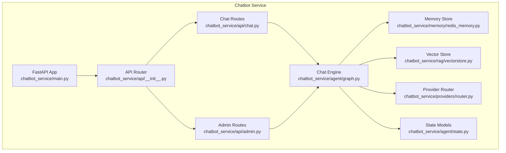
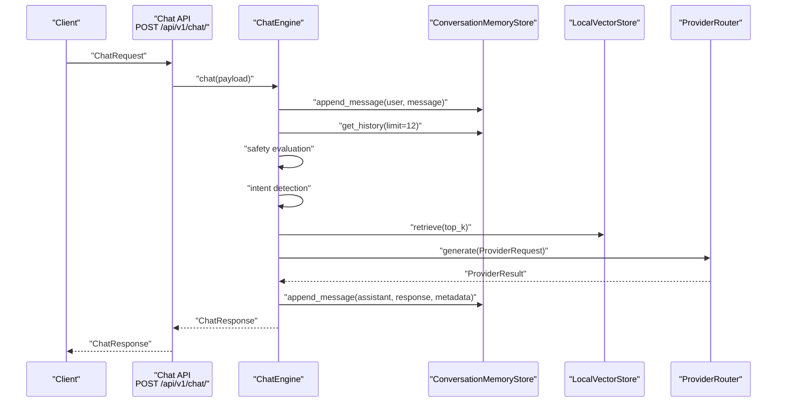
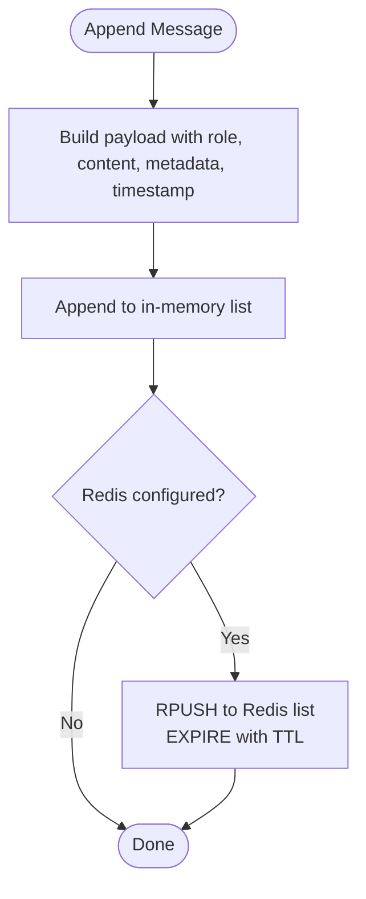
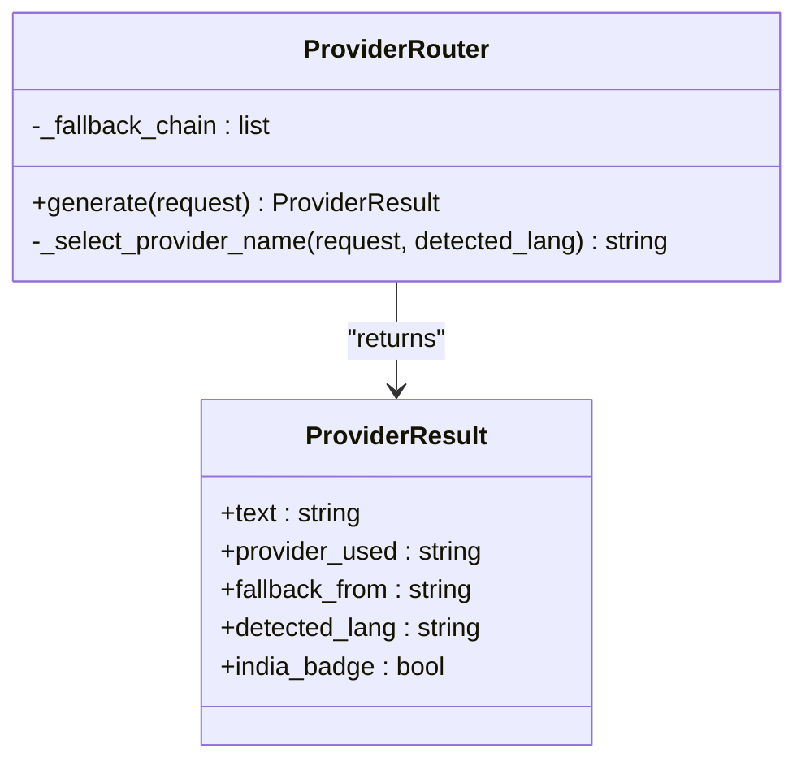
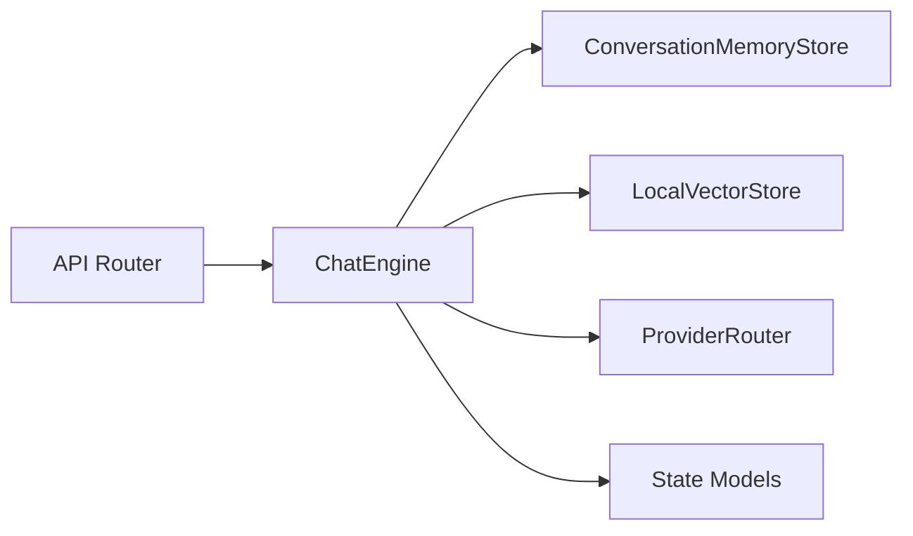

# Chatbot API

<cite>
**Referenced Files in This Document**
- [chatbot_service/main.py](file://chatbot_service/main.py)
- [chatbot_service/api/__init__.py](file://chatbot_service/api/__init__.py)
- [chatbot_service/api/chat.py](file://chatbot_service/api/chat.py)
- [chatbot_service/api/admin.py](file://chatbot_service/api/admin.py)
- [chatbot_service/agent/graph.py](file://chatbot_service/agent/graph.py)
- [chatbot_service/agent/state.py](file://chatbot_service/agent/state.py)
- [chatbot_service/memory/redis_memory.py](file://chatbot_service/memory/redis_memory.py)
- [chatbot_service/rag/vectorstore.py](file://chatbot_service/rag/vectorstore.py)
- [chatbot_service/providers/router.py](file://chatbot_service/providers/router.py)
- [backend/main.py](file://backend/main.py)
- [backend/api/v1/chat.py](file://backend/api/v1/chat.py)
- [backend/models/schemas.py](file://backend/models/schemas.py)
</cite>

## Table of Contents
1. [Introduction](#introduction)
2. [Project Structure](#project-structure)
3. [Core Components](#core-components)
4. [Architecture Overview](#architecture-overview)
5. [Detailed Component Analysis](#detailed-component-analysis)
6. [Dependency Analysis](#dependency-analysis)
7. [Performance Considerations](#performance-considerations)
8. [Troubleshooting Guide](#troubleshooting-guide)
9. [Conclusion](#conclusion)
10. [Appendices](#appendices)

## Introduction
This document describes the Chatbot API surface for integrating with the SafeVixAI chatbot service. It covers HTTP endpoints for chat interactions, streaming, and conversation history, as well as administrative endpoints for system health, vectorstore rebuilding, and monitoring. It also explains the request/response schemas, conversation state management, and provider routing behavior. Real-time streaming is exposed via Server-Sent Events (SSE) for tokenized responses.

## Project Structure
The chatbot API is implemented as a standalone FastAPI service. The main application wires up the chat engine, memory store, vectorstore, tools, and provider router. API routers are composed under a single API router and mounted into the app. The backend service also exposes a separate chat endpoint for legacy compatibility.

**Diagram sources**
- [chatbot_service/main.py:41-145](file://chatbot_service/main.py#L41-L145)
- [chatbot_service/api/__init__.py:1-14](file://chatbot_service/api/__init__.py#L1-L14)
- [chatbot_service/api/chat.py:16-111](file://chatbot_service/api/chat.py#L16-L111)
- [chatbot_service/api/admin.py:12-52](file://chatbot_service/api/admin.py#L12-L52)
- [chatbot_service/agent/graph.py:15-109](file://chatbot_service/agent/graph.py#L15-L109)
- [chatbot_service/agent/state.py:9-52](file://chatbot_service/agent/state.py#L9-L52)
- [chatbot_service/memory/redis_memory.py:10-90](file://chatbot_service/memory/redis_memory.py#L10-L90)
- [chatbot_service/rag/vectorstore.py:20-110](file://chatbot_service/rag/vectorstore.py#L20-L110)
- [chatbot_service/providers/router.py:75-199](file://chatbot_service/providers/router.py#L75-L199)

**Section sources**
- [chatbot_service/main.py:41-145](file://chatbot_service/main.py#L41-L145)
- [chatbot_service/api/__init__.py:1-14](file://chatbot_service/api/__init__.py#L1-L14)

## Core Components
- Chat API router: Provides endpoints for standard chat, SSE streaming chat, and retrieving conversation history.
- Admin API router: Provides health and index rebuild endpoints guarded by an admin key.
- ChatEngine: Orchestrates safety checks, intent detection, context assembly, provider routing, and memory persistence.
- ConversationMemoryStore: Persists and retrieves conversation history with Redis-backed storage and in-memory fallback.
- LocalVectorStore: Manages a simple persisted index of document chunks for retrieval-augmented generation.
- ProviderRouter: Routes requests across 11 providers with intelligent fallback and Indian language specialization.

**Section sources**
- [chatbot_service/api/chat.py:16-111](file://chatbot_service/api/chat.py#L16-L111)
- [chatbot_service/api/admin.py:12-52](file://chatbot_service/api/admin.py#L12-L52)
- [chatbot_service/agent/graph.py:15-109](file://chatbot_service/agent/graph.py#L15-L109)
- [chatbot_service/memory/redis_memory.py:10-90](file://chatbot_service/memory/redis_memory.py#L10-L90)
- [chatbot_service/rag/vectorstore.py:20-110](file://chatbot_service/rag/vectorstore.py#L20-L110)
- [chatbot_service/providers/router.py:75-199](file://chatbot_service/providers/router.py#L75-L199)

## Architecture Overview
The chat pipeline integrates safety, intent detection, retrieval augmentation, tool invocation, and provider generation with streaming support.

**Diagram sources**
- [chatbot_service/api/chat.py:28-41](file://chatbot_service/api/chat.py#L28-L41)
- [chatbot_service/agent/graph.py:33-87](file://chatbot_service/agent/graph.py#L33-L87)
- [chatbot_service/memory/redis_memory.py:23-44](file://chatbot_service/memory/redis_memory.py#L23-L44)
- [chatbot_service/providers/router.py:154-199](file://chatbot_service/providers/router.py#L154-L199)

## Detailed Component Analysis

### HTTP Endpoints

#### Standard Chat
- Method: POST
- Path: /api/v1/chat/
- Description: Processes a chat message synchronously and returns the full response.
- Authentication: Not enforced at the API level; depends on deployment configuration.
- Request Schema: ChatRequest
- Response Schema: ChatResponse

Request fields:
- message: string (required, length 1–4000)
- session_id: string (optional, length 1–128)
- lat: float (optional, -90 to 90)
- lon: float (optional, -180 to 180)
- client_ip: string (optional)

Response fields:
- response: string
- intent: string or null
- sources: array of strings
- session_id: string

Notes:
- If session_id is omitted, a new UUID is generated.
- client_ip is auto-populated from request headers if not provided.

**Section sources**
- [chatbot_service/api/chat.py:28-41](file://chatbot_service/api/chat.py#L28-L41)
- [chatbot_service/agent/state.py:9-22](file://chatbot_service/agent/state.py#L9-L22)
- [chatbot_service/agent/graph.py:33-87](file://chatbot_service/agent/graph.py#L33-L87)

#### Streaming Chat (Server-Sent Events)
- Method: POST
- Path: /api/v1/chat/stream
- Description: Streams tokens as they are generated using text/event-stream. Emits token events, followed by a done event with metadata, and handles errors.
- Event format:
  - Token: {"type":"token","text":"..."}
  - Done: {"type":"done","intent":"...","sources":["..."],"session_id":"..."}
  - Error: {"type":"error","message":"..."}
- Headers: Cache-Control: no-cache, Connection: keep-alive, X-Accel-Buffering: no

Behavior:
- Simulates streaming by splitting the final response into words with a small delay per token for UX smoothness.
- Uses the same ChatEngine and provider chain as the standard endpoint.

**Section sources**
- [chatbot_service/api/chat.py:43-97](file://chatbot_service/api/chat.py#L43-L97)
- [chatbot_service/agent/graph.py:33-87](file://chatbot_service/agent/graph.py#L33-L87)

#### Get Conversation History
- Method: GET
- Path: /api/v1/chat/history/{session_id}
- Description: Retrieves recent messages for a given session_id.
- Response: { "session_id": string, "messages": [ { ... } ] }

**Section sources**
- [chatbot_service/api/chat.py:100-105](file://chatbot_service/api/chat.py#L100-L105)
- [chatbot_service/memory/redis_memory.py:46-56](file://chatbot_service/memory/redis_memory.py#L46-L56)

#### Health
- Method: GET
- Path: /api/v1/chat/health
- Description: Returns service health status.

**Section sources**
- [chatbot_service/api/chat.py:108-111](file://chatbot_service/api/chat.py#L108-L111)

### Admin Endpoints

#### Health
- Method: GET
- Path: /admin/health
- Description: Returns system health, index stats, memory backend, and memory availability.
- Requires: X-Admin-Key header matching ADMIN_SECRET.

Response fields:
- status: string
- index: object with chunk and category counts
- memory_backend: string
- memory_available: boolean

**Section sources**
- [chatbot_service/api/admin.py:32-42](file://chatbot_service/api/admin.py#L32-L42)

#### Rebuild Index
- Method: POST
- Path: /admin/rebuild-index
- Description: Forces rebuilding of the vector index and returns updated stats.
- Requires: X-Admin-Key header matching ADMIN_SECRET.

**Section sources**
- [chatbot_service/api/admin.py:45-52](file://chatbot_service/api/admin.py#L45-L52)
- [chatbot_service/rag/vectorstore.py:36-49](file://chatbot_service/rag/vectorstore.py#L36-L49)

### Request and Response Schemas

#### ChatRequest
- message: string (min length 1, max 4000)
- session_id: string or null (min length 1, max 128)
- lat: float or null (-90 to 90)
- lon: float or null (-180 to 180)
- client_ip: string or null

#### ChatResponse
- response: string
- intent: string or null
- sources: array of strings
- session_id: string

#### ConversationContext (internal)
- session_id: string
- message: string
- intent: string
- lat: float or null
- lon: float or null
- client_ip: string or null
- history: array of message dicts
- retrieved: array of retrieved context entries
- tools: array of tool context entries

**Section sources**
- [chatbot_service/agent/state.py:9-52](file://chatbot_service/agent/state.py#L9-L52)

### Conversation State Management
- Memory Store:
  - Append user/assistant messages with timestamps and metadata.
  - Retrieve recent messages with configurable limits.
  - Clear sessions.
  - Ping health; supports Redis-backed storage with in-memory fallback.
- Session TTL:
  - Controlled by settings for session lifetime.

**Diagram sources**
- [chatbot_service/memory/redis_memory.py:23-44](file://chatbot_service/memory/redis_memory.py#L23-L44)

**Section sources**
- [chatbot_service/memory/redis_memory.py:10-90](file://chatbot_service/memory/redis_memory.py#L10-L90)

### Provider Routing and Generation
- Language detection:
  - Detects Indian language scripts and routes to specialized providers.
- Provider selection:
  - Primary providers include Groq, Cerebras, Gemini, Sarvam variants, GitHub, NVIDIA, OpenRouter, Mistral, Together.
- Fallback chain:
  - Tries providers in priority order until success or exhaustion.
- Metadata:
  - Attaches provider used, fallback provider, and language detection.

**Diagram sources**
- [chatbot_service/providers/router.py:75-199](file://chatbot_service/providers/router.py#L75-L199)

**Section sources**
- [chatbot_service/providers/router.py:75-199](file://chatbot_service/providers/router.py#L75-L199)

### Backend Compatibility Endpoint
The backend service exposes a similar chat endpoint for compatibility. It uses a different request/response schema and depends on a shared LLM service.

- Method: POST
- Path: /api/v1/chat/
- Response: ChatResponse (backend schema)
- Notes: Includes user authentication dependency and uses a shared LLM service.

**Section sources**
- [backend/api/v1/chat.py:17-23](file://backend/api/v1/chat.py#L17-L23)
- [backend/models/schemas.py:226-238](file://backend/models/schemas.py#L226-L238)

## Dependency Analysis
The chatbot service composes multiple subsystems into a cohesive pipeline. The API layer delegates to the ChatEngine, which coordinates memory, retrieval, tools, and providers.

**Diagram sources**
- [chatbot_service/api/__init__.py:8-13](file://chatbot_service/api/__init__.py#L8-L13)
- [chatbot_service/agent/graph.py:15-32](file://chatbot_service/agent/graph.py#L15-L32)

**Section sources**
- [chatbot_service/api/__init__.py:1-14](file://chatbot_service/api/__init__.py#L1-L14)
- [chatbot_service/agent/graph.py:15-32](file://chatbot_service/agent/graph.py#L15-L32)

## Performance Considerations
- Streaming latency:
  - SSE streaming splits the final response into words with a small delay per token to simulate live streaming. Tune delays for desired UX pacing.
- Provider throughput:
  - Primary providers include high-throughput engines optimized for speed and cost. Configure appropriate defaults and fallbacks.
- Retrieval efficiency:
  - Vector index statistics and top-k retrieval influence latency. Rebuild index when content changes.
- Memory scaling:
  - Redis-backed memory improves persistence and scalability. Monitor health and fallback behavior.

[No sources needed since this section provides general guidance]

## Troubleshooting Guide
- Rate limiting:
  - Both standard and streaming chat endpoints apply rate limiting. Exceeding limits triggers a rate limit exception handler.
- Admin key:
  - Admin endpoints require a valid X-Admin-Key matching ADMIN_SECRET. Missing or invalid keys return 403 or 503 depending on configuration.
- Health checks:
  - Use /api/v1/chat/health and /admin/health to verify service readiness and memory availability.
- Streaming errors:
  - SSE emits an error event with a generic message on internal failures. Inspect server logs for details.

**Section sources**
- [chatbot_service/api/chat.py:29-30](file://chatbot_service/api/chat.py#L29-L30)
- [chatbot_service/api/chat.py:44-44](file://chatbot_service/api/chat.py#L44-L44)
- [chatbot_service/api/admin.py:23-29](file://chatbot_service/api/admin.py#L23-L29)
- [chatbot_service/main.py:106-115](file://chatbot_service/main.py#L106-L115)

## Conclusion
The Chatbot API provides robust chat capabilities with streaming, conversation state management, and administrative controls. It integrates retrieval augmentation, tooling, and multi-provider routing to deliver responsive, localized assistance for road safety scenarios.

[No sources needed since this section summarizes without analyzing specific files]

## Appendices

### Example Workflows

#### Chat Interaction (Standard)
- Client sends a POST request to /api/v1/chat/ with a ChatRequest.
- Server evaluates safety, detects intent, assembles context, and generates a response via the provider chain.
- Response includes intent, sources, and session_id.

**Section sources**
- [chatbot_service/api/chat.py:28-41](file://chatbot_service/api/chat.py#L28-L41)
- [chatbot_service/agent/graph.py:33-87](file://chatbot_service/agent/graph.py#L33-L87)

#### Chat Interaction (Streaming)
- Client sends a POST request to /api/v1/chat/stream.
- Server streams token events, then a done event with metadata.
- Client consumes text/event-stream and parses JSON events.

**Section sources**
- [chatbot_service/api/chat.py:43-97](file://chatbot_service/api/chat.py#L43-L97)

#### Retrieve Conversation History
- Client calls GET /api/v1/chat/history/{session_id}.
- Server returns messages for the session.

**Section sources**
- [chatbot_service/api/chat.py:100-105](file://chatbot_service/api/chat.py#L100-L105)

#### Admin Operations
- Health: GET /admin/health returns index and memory status.
- Rebuild Index: POST /admin/rebuild-index forces index regeneration.

**Section sources**
- [chatbot_service/api/admin.py:32-52](file://chatbot_service/api/admin.py#L32-L52)