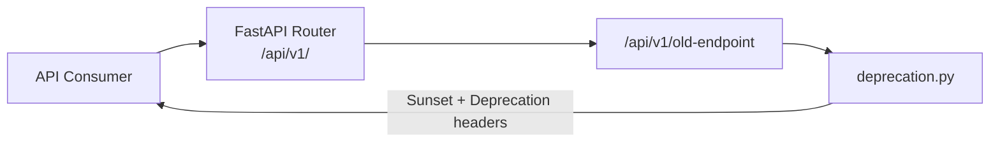

# API Deprecation and Versioning

> Source: `backend/api/deprecation.py` | Generated: 2026-06-15

## Overview

The `deprecation.py` module provides a lightweight API versioning and deprecation management system for the SafeVixAI backend. It tracks deprecated endpoints and attaches `Sunset` and `Deprecation` HTTP headers to responses, giving consumers advance notice before breaking changes take effect.

## Architecture

All current endpoints live under `/api/v1/`. When a new version is needed, `/api/v2/` is created alongside it. Deprecated endpoints return RFC-compliant sunset headers rather than being removed immediately, following standard API lifecycle management.



## Key Classes/Functions

| Function | Parameters | Return | Description |
|---|---|---|---|
| `mark_deprecated()` | `endpoint: str`, `sunset_in_days: int = 90` | `None` | Marks an endpoint as deprecated with a configurable sunset period (default 90 days) |
| `get_deprecation_headers()` | `endpoint: str` | `dict[str, str]` | Returns `Deprecation` and `Sunset` headers if the endpoint is deprecated, empty dict otherwise |

## Dependencies

- `datetime` (stdlib)
- `timedelta` (stdlib)

## Configuration

No environment variables required. The sunset period defaults to 90 days and can be overridden per endpoint via the `sunset_in_days` parameter.

## Usage Examples

```python
from backend.api.deprecation import mark_deprecated, get_deprecation_headers

# Mark an endpoint for sunset in 180 days
mark_deprecated("/api/v1/legacy-endpoint", sunset_in_days=180)

# Attach deprecation headers to a response
headers = get_deprecation_headers("/api/v1/legacy-endpoint")
return Response(content=..., headers=headers)
```

## Error Handling

- If the endpoint is not found in `DEPRECATED_ENDPOINTS`, `get_deprecation_headers()` returns an empty dict silently.
- No exceptions are raised for unknown endpoints — the system is additive only.

## Related Modules

- `backend/main.py` — App factory that imports and configures API routers
- `docs/API.md` — Full API reference documentation
