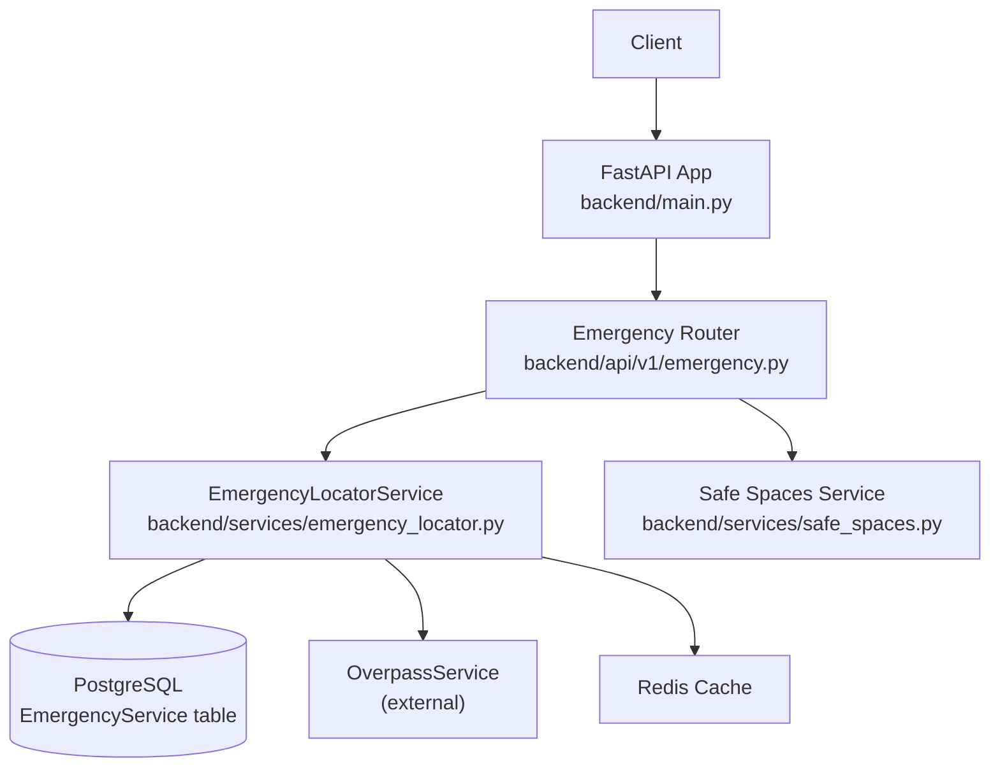
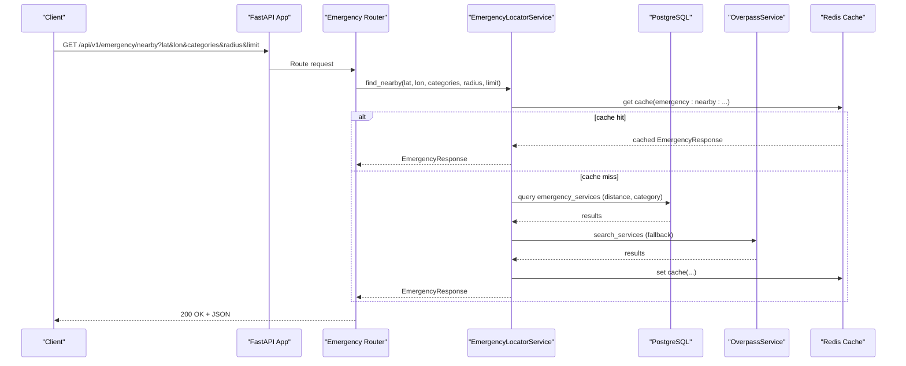
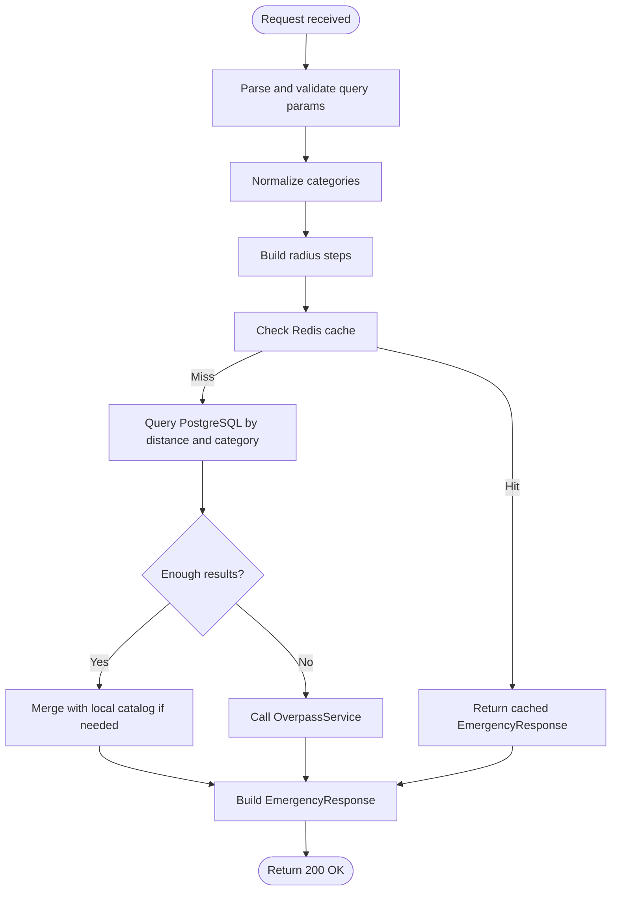
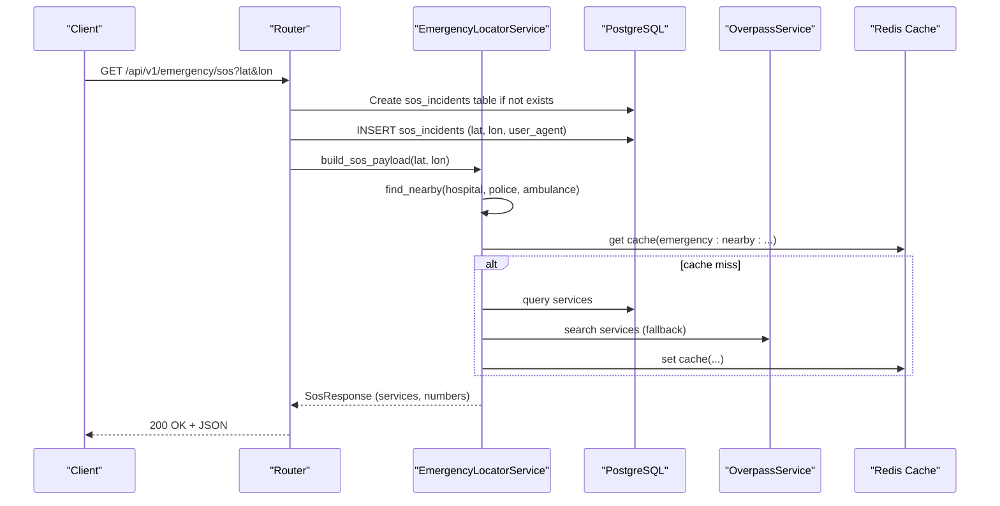
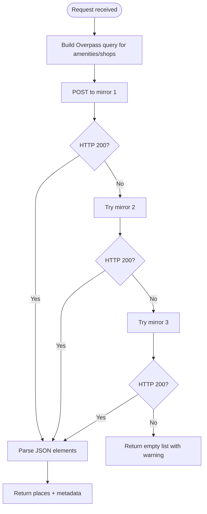
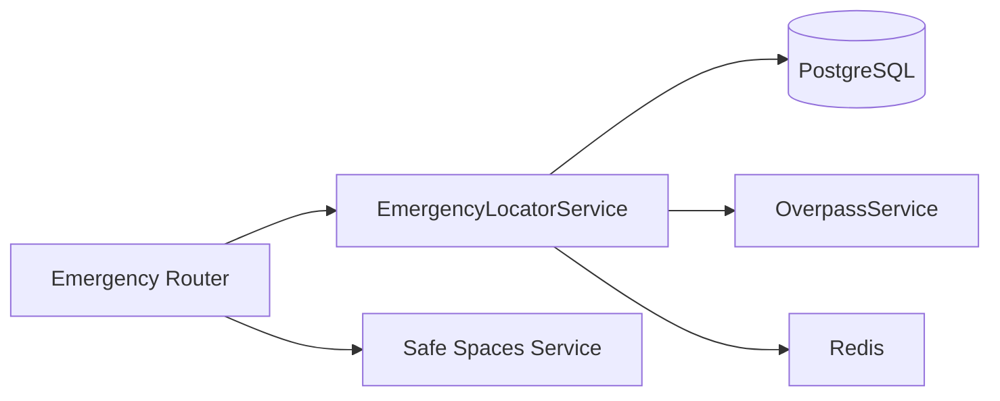

# Emergency Services API

<cite>
**Referenced Files in This Document**
- [emergency.py](file://backend/api/v1/emergency.py)
- [schemas.py](file://backend/models/schemas.py)
- [emergency.py](file://backend/models/emergency.py)
- [emergency_locator.py](file://backend/services/emergency_locator.py)
- [safe_spaces.py](file://backend/services/safe_spaces.py)
- [main.py](file://backend/main.py)
- [config.py](file://backend/core/config.py)
- [security.py](file://backend/core/security.py)
- [auth.py](file://backend/api/v1/auth.py)
- [exceptions.py](file://backend/services/exceptions.py)
</cite>

## Table of Contents
1. [Introduction](#introduction)
2. [Project Structure](#project-structure)
3. [Core Components](#core-components)
4. [Architecture Overview](#architecture-overview)
5. [Detailed Component Analysis](#detailed-component-analysis)
6. [Dependency Analysis](#dependency-analysis)
7. [Performance Considerations](#performance-considerations)
8. [Troubleshooting Guide](#troubleshooting-guide)
9. [Conclusion](#conclusion)
10. [Appendices](#appendices)

## Introduction
This document provides comprehensive API documentation for the Emergency Services endpoints exposed by the backend. It covers HTTP methods, URL patterns, request parameters, response schemas, error handling, rate limiting considerations, authentication requirements, and client integration guidelines. The endpoints enable:
- Finding nearby emergency services
- Generating SOS payloads with nearby services and emergency numbers
- Retrieving national and regional emergency numbers
- Accessing safe public spaces for women safety use cases

## Project Structure
The emergency-related functionality is implemented under the backend API v1 module and supported by services and models:
- API endpoints: backend/api/v1/emergency.py
- Response schemas: backend/models/schemas.py
- Emergency service model: backend/models/emergency.py
- Emergency locator service: backend/services/emergency_locator.py
- Safe spaces service: backend/services/safe_spaces.py
- Application lifecycle and router registration: backend/main.py
- Configuration and defaults: backend/core/config.py
- Authentication and JWT utilities: backend/core/security.py and backend/api/v1/auth.py
- External service error types: backend/services/exceptions.py

**Diagram sources**
- [main.py:24-128](file://backend/main.py#L24-L128)
- [emergency.py:12-82](file://backend/api/v1/emergency.py#L12-L82)
- [emergency_locator.py:161-507](file://backend/services/emergency_locator.py#L161-L507)
- [safe_spaces.py:22-96](file://backend/services/safe_spaces.py#L22-L96)

**Section sources**
- [main.py:24-128](file://backend/main.py#L24-L128)
- [emergency.py:12-82](file://backend/api/v1/emergency.py#L12-L82)

## Core Components
- EmergencyLocatorService: orchestrates discovery of nearby emergency services using database, local CSV catalog, and Overpass API, with caching and merging strategies.
- Safe Spaces Service: queries OpenStreetMap via Overpass mirrors with graceful fallback and rate-limit handling.
- Schemas: define request/response models for emergency services, SOS payloads, and emergency numbers.

Key capabilities:
- Nearby search with configurable categories, radius, and limits
- SOS payload generation including nearby services and unified emergency numbers
- Emergency numbers retrieval with optional override from chatbot data
- Safe spaces discovery around a coordinate with radius

**Section sources**
- [emergency_locator.py:161-507](file://backend/services/emergency_locator.py#L161-L507)
- [safe_spaces.py:22-96](file://backend/services/safe_spaces.py#L22-L96)
- [schemas.py:26-66](file://backend/models/schemas.py#L26-L66)

## Architecture Overview
The emergency endpoints are mounted under /api/v1/emergency and delegate to the EmergencyLocatorService and Safe Spaces Service. Responses are validated against Pydantic models. Caching is applied to reduce repeated upstream calls.

**Diagram sources**
- [emergency.py:19-40](file://backend/api/v1/emergency.py#L19-L40)
- [emergency_locator.py:187-373](file://backend/services/emergency_locator.py#L187-L373)

**Section sources**
- [emergency.py:19-40](file://backend/api/v1/emergency.py#L19-L40)
- [emergency_locator.py:187-373](file://backend/services/emergency_locator.py#L187-L373)

## Detailed Component Analysis

### Endpoint: GET /api/v1/emergency/nearby
- Purpose: Find nearby emergency services around a given coordinate.
- Authentication: Not required by the endpoint definition.
- Request parameters:
  - lat: float, required, latitude range [-90, 90]
  - lon: float, required, longitude range [-180, 180]
  - categories: string, optional, comma-separated list of categories (hospital, police, ambulance, fire, towing, pharmacy, puncture, showroom). Unknown categories are ignored; defaults to hospital, police, ambulance, towing if omitted.
  - radius: integer, optional, meters in range [100, 50000]; defaults to configured maximum radius
  - limit: integer, optional, in range [1, 50]; defaults to 20
- Response schema: EmergencyResponse
  - services: array of EmergencyServiceItem
  - count: integer
  - radius_used: integer (meters)
  - source: string indicating data source(s): database, local, overpass, or combinations
- Error handling:
  - External service failures raise ExternalServiceError, mapped to HTTP 503 Service Unavailable
- Example request:
  - GET /api/v1/emergency/nearby?lat=19.0760&lon=72.8777&categories=hospital,ambulance&radius=10000&limit=10
- Example response:
  - {
      "services": [...],
      "count": 3,
      "radius_used": 10000,
      "source": "database+overpass"
    }

**Diagram sources**
- [emergency.py:19-40](file://backend/api/v1/emergency.py#L19-L40)
- [emergency_locator.py:187-373](file://backend/services/emergency_locator.py#L187-L373)

**Section sources**
- [emergency.py:19-40](file://backend/api/v1/emergency.py#L19-L40)
- [emergency_locator.py:168-186](file://backend/services/emergency_locator.py#L168-L186)
- [emergency_locator.py:196-216](file://backend/services/emergency_locator.py#L196-L216)
- [emergency_locator.py:301-373](file://backend/services/emergency_locator.py#L301-L373)
- [schemas.py:53-58](file://backend/models/schemas.py#L53-L58)

### Endpoint: GET /api/v1/emergency/sos
- Purpose: Generate an SOS payload containing nearby emergency services and unified emergency numbers.
- Authentication: Not required by the endpoint definition.
- Request parameters:
  - lat: float, required, latitude range [-90, 90]
  - lon: float, required, longitude range [-180, 180]
- Behavior:
  - Persists a record of the SOS incident into a table named sos_incidents
  - Builds an SOS payload using nearby services (hospital, police, ambulance) within a default radius and up to a default limit
  - Includes unified emergency numbers from EMERGENCY_NUMBERS
- Response schema: SosResponse
  - services: array of EmergencyServiceItem
  - count: integer
  - radius_used: integer
  - source: string
  - numbers: dict of EmergencyNumber keyed by identifier
- Error handling:
  - External service failures raise ExternalServiceError, mapped to HTTP 503 Service Unavailable
- Example request:
  - GET /api/v1/emergency/sos?lat=19.0760&lon=72.8777
- Example response:
  - {
      "services": [...],
      "count": 3,
      "radius_used": 5000,
      "source": "database+overpass",
      "numbers": {
        "national_emergency": {"service": "112", "coverage": "Pan-India", "notes": "Unified emergency response"},
        ...
      }
    }

**Diagram sources**
- [emergency.py:42-71](file://backend/api/v1/emergency.py#L42-L71)
- [emergency_locator.py:218-239](file://backend/services/emergency_locator.py#L218-L239)
- [emergency_locator.py:187-216](file://backend/services/emergency_locator.py#L187-L216)

**Section sources**
- [emergency.py:42-71](file://backend/api/v1/emergency.py#L42-L71)
- [emergency_locator.py:218-239](file://backend/services/emergency_locator.py#L218-L239)
- [schemas.py:60-66](file://backend/models/schemas.py#L60-L66)

### Endpoint: GET /api/v1/emergency/numbers
- Purpose: Retrieve unified emergency numbers with coverage and notes.
- Authentication: Not required by the endpoint definition.
- Request parameters: none
- Response schema: EmergencyNumbersResponse
  - numbers: dict mapping number identifiers to EmergencyNumber
    - service: string
    - coverage: string
    - notes: string or null
- Notes:
  - Numbers are loaded from a JSON file if present; otherwise defaults are used.
- Example request:
  - GET /api/v1/emergency/numbers
- Example response:
  - {
      "numbers": {
        "national_emergency": {"service": "112", "coverage": "Pan-India", "notes": "Unified emergency response"},
        "police": {"service": "100", "coverage": "Pan-India", "notes": "Police control room"},
        ...
      }
    }

**Section sources**
- [emergency.py:73-76](file://backend/api/v1/emergency.py#L73-L76)
- [emergency_locator.py:134-158](file://backend/services/emergency_locator.py#L134-L158)
- [schemas.py:32-34](file://backend/models/schemas.py#L32-L34)

### Endpoint: GET /api/v1/emergency/safe-spaces
- Purpose: Retrieve nearby safe public spaces (restaurants, cafes, pharmacies, hospitals, police, fire stations, supermarkets, convenience stores, medical stores, malls) around a given coordinate.
- Authentication: Not required by the endpoint definition.
- Request parameters:
  - lat: float, required
  - lon: float, required
  - radius: integer, optional, default 1000 meters
- Response:
  - Array of places with name, type, coordinates, and optional phone/opening hours
  - Additional metadata: count, radius_meters, source
  - Graceful fallback: if all Overpass mirrors fail due to rate limits, returns empty list with a warning message
- Example request:
  - GET /api/v1/emergency/safe-spaces?lat=19.0760&lon=72.8777&radius=1500
- Example response:
  - {
      "places": [
        {"name": "ABC Cafe", "type": "cafe", "lat": 19.0755, "lon": 72.8780, "phone": "022XXXXXXX", "open_hours": "24/7"},
        ...
      ],
      "count": 5,
      "radius_meters": 1500,
      "source": "openstreetmap"
    }

**Diagram sources**
- [emergency.py:78-82](file://backend/api/v1/emergency.py#L78-L82)
- [safe_spaces.py:22-96](file://backend/services/safe_spaces.py#L22-L96)

**Section sources**
- [emergency.py:78-82](file://backend/api/v1/emergency.py#L78-L82)
- [safe_spaces.py:22-96](file://backend/services/safe_spaces.py#L22-L96)

## Dependency Analysis
- Router-to-service dependency:
  - Emergency router depends on EmergencyLocatorService injected via app state
  - Safe spaces endpoint depends on get_safe_spaces function
- External dependencies:
  - Overpass API for fallback emergency services and safe spaces
  - PostgreSQL for emergency services storage
  - Redis for caching
- Configuration:
  - Emergency defaults (default radius, max radius, radius steps, cache TTL) are defined in Settings

**Diagram sources**
- [emergency.py:15-16](file://backend/api/v1/emergency.py#L15-L16)
- [emergency_locator.py:161-166](file://backend/services/emergency_locator.py#L161-L166)
- [safe_spaces.py:22-96](file://backend/services/safe_spaces.py#L22-L96)

**Section sources**
- [emergency.py:15-16](file://backend/api/v1/emergency.py#L15-L16)
- [emergency_locator.py:161-166](file://backend/services/emergency_locator.py#L161-L166)

## Performance Considerations
- Caching:
  - Nearby searches are cached using Redis with a configurable TTL. Cache keys include coordinates, categories, radius, and limit.
  - City bundles for offline use are cached and persisted to disk.
- Radius strategy:
  - Radius steps are iteratively expanded until a minimum number of results is found, reducing unnecessary upstream calls.
- Data ordering:
  - Results prioritize trauma availability, 24-hour availability, and proximity to minimize travel time.
- Safe spaces:
  - Uses multiple Overpass mirrors and gracefully handles rate limits by returning empty results with a warning.

[No sources needed since this section provides general guidance]

## Troubleshooting Guide
- HTTP 503 Service Unavailable:
  - Occurs when upstream services (Overpass, external APIs) fail or are unreachable during emergency searches or SOS payload generation.
- Graceful degradation:
  - Safe spaces returns empty results with a warning message when all mirrors are rate-limited.
- Validation errors:
  - Invalid parameter ranges (e.g., lat/lon out of range, radius outside [100, 50000], limit outside [1, 50]) will cause HTTP 422 Unprocessable Entity.
- Database connectivity:
  - Health endpoint indicates database availability; degraded status may affect emergency services.

**Section sources**
- [emergency.py:38-40](file://backend/api/v1/emergency.py#L38-L40)
- [emergency.py:69-71](file://backend/api/v1/emergency.py#L69-L71)
- [safe_spaces.py:85-95](file://backend/services/safe_spaces.py#L85-L95)
- [exceptions.py:1-7](file://backend/services/exceptions.py#L1-L7)

## Conclusion
The Emergency Services API provides robust, resilient endpoints for locating nearby emergency services, generating SOS payloads, retrieving emergency numbers, and discovering safe public spaces. Built-in caching, fallback mechanisms, and graceful error handling ensure reliable operation even under upstream limitations.

[No sources needed since this section summarizes without analyzing specific files]

## Appendices

### Authentication and Authorization
- The emergency endpoints defined here do not require authentication tokens.
- Authentication is handled separately via the /api/v1/auth endpoints, which issue JWT bearer tokens for protected resources.

**Section sources**
- [auth.py:24-38](file://backend/api/v1/auth.py#L24-L38)
- [security.py:23-41](file://backend/core/security.py#L23-L41)

### Rate Limiting Considerations
- Overpass API:
  - Multiple mirrors are attempted; HTTP 406/429/503 triggers fallback to the next mirror.
  - If all mirrors fail, safe spaces returns empty results with a warning.
- Redis cache:
  - TTL is configurable and reduces repeated upstream requests.
- Configuration:
  - Emergency defaults (radius steps, max radius, cache TTL) are defined in Settings.

**Section sources**
- [safe_spaces.py:43-59](file://backend/services/safe_spaces.py#L43-L59)
- [config.py:26-36](file://backend/core/config.py#L26-L36)
- [emergency_locator.py:178-186](file://backend/services/emergency_locator.py#L178-L186)

### Client Implementation Guidelines
- Use HTTPS endpoints and handle HTTP 503 gracefully by retrying after exponential backoff.
- Cache responses locally using the provided TTL to reduce network usage.
- For SOS payloads, persist the incident record server-side and include emergency numbers for quick dialing.
- Respect the radius and limit parameters to balance accuracy and performance.
- Integrate with the health endpoint to detect degraded services and adjust behavior accordingly.

[No sources needed since this section provides general guidance]