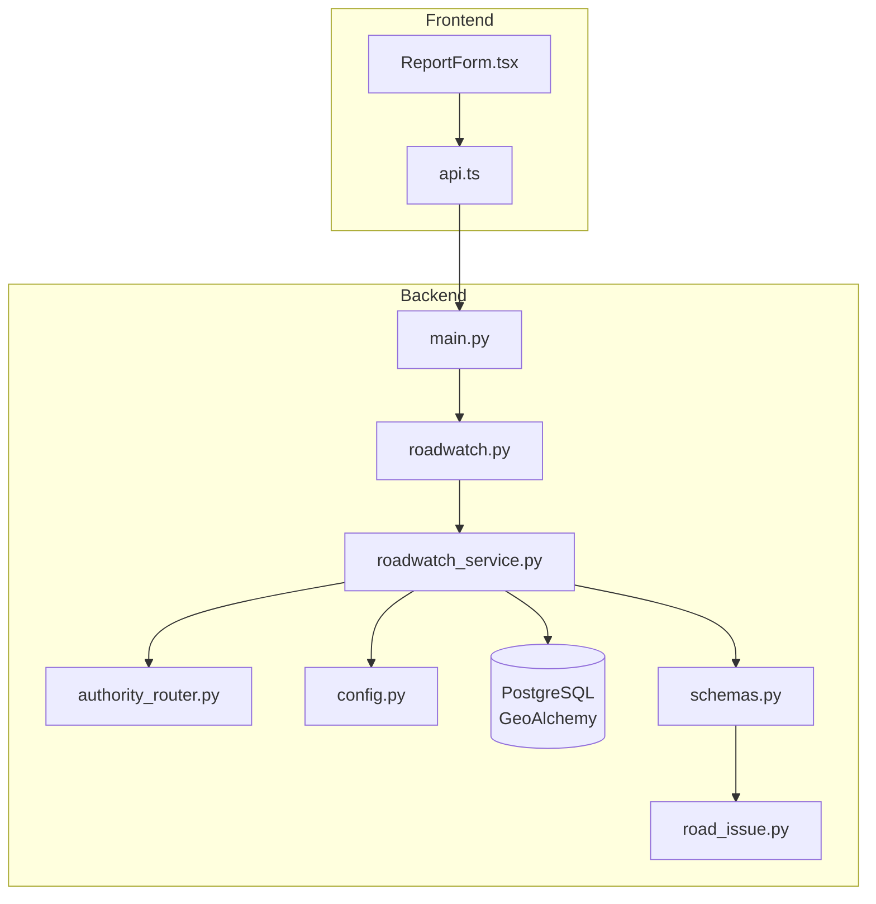
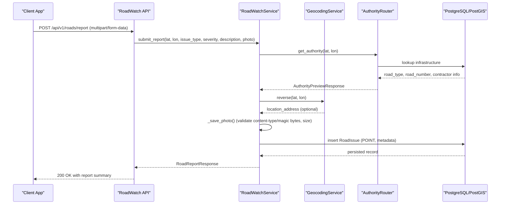
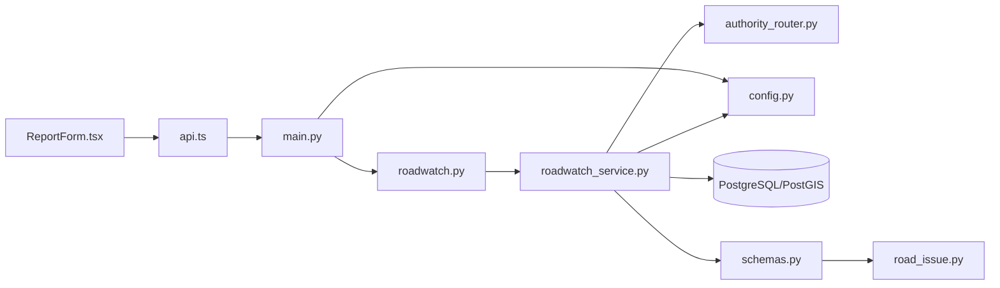

# Road Reporter API

<cite>
**Referenced Files in This Document**
- [roadwatch.py](file://backend/api/v1/roadwatch.py)
- [roadwatch_service.py](file://backend/services/roadwatch_service.py)
- [authority_router.py](file://backend/services/authority_router.py)
- [road_issue.py](file://backend/models/road_issue.py)
- [schemas.py](file://backend/models/schemas.py)
- [config.py](file://backend/core/config.py)
- [main.py](file://backend/main.py)
- [test_roadwatch.py](file://backend/tests/test_roadwatch.py)
- [ReportForm.tsx](file://frontend/components/ReportForm.tsx)
- [api.ts](file://frontend/lib/api.ts)
</cite>

## Table of Contents
1. [Introduction](#introduction)
2. [Project Structure](#project-structure)
3. [Core Components](#core-components)
4. [Architecture Overview](#architecture-overview)
5. [Detailed Component Analysis](#detailed-component-analysis)
6. [Dependency Analysis](#dependency-analysis)
7. [Performance Considerations](#performance-considerations)
8. [Troubleshooting Guide](#troubleshooting-guide)
9. [Conclusion](#conclusion)
10. [Appendices](#appendices)

## Introduction
This document provides comprehensive API documentation for the road reporting endpoints that power community-driven road issue tracking and enforcement routing. It covers HTTP methods, URL patterns, request schemas for geotagged road issues and image uploads, response formats, validation rules, file upload handling, spatial data requirements, and integration points with authority routing and geocoding services. It also includes practical examples for pothole reporting, road obstruction alerts, and community issue tracking.

## Project Structure
The road reporting feature spans the backend API layer, service layer, persistence models, and frontend integration:
- API endpoints define the contract and request/response shapes
- Services encapsulate business logic, validation, and integrations
- Models define spatial storage and response schemas
- Frontend components assemble requests and present outcomes

**Diagram sources**
- [main.py:24-128](file://backend/main.py#L24-L128)
- [roadwatch.py:1-97](file://backend/api/v1/roadwatch.py#L1-L97)
- [roadwatch_service.py:56-325](file://backend/services/roadwatch_service.py#L56-L325)
- [authority_router.py:42-143](file://backend/services/authority_router.py#L42-L143)
- [config.py:11-181](file://backend/core/config.py#L11-L181)
- [schemas.py:83-161](file://backend/models/schemas.py#L83-L161)
- [road_issue.py:14-66](file://backend/models/road_issue.py#L14-L66)

**Section sources**
- [main.py:24-128](file://backend/main.py#L24-L128)
- [roadwatch.py:1-97](file://backend/api/v1/roadwatch.py#L1-L97)

## Core Components
- RoadWatch API router: Exposes endpoints for reporting, nearby issues discovery, authority preview, and infrastructure lookup
- RoadWatch service: Validates inputs, resolves authority and infrastructure, persists spatial data, handles image uploads, and manages caches
- Authority router: Determines responsible authority and road classification via database-backed infrastructure or Overpass fallback
- Data models and schemas: Define spatial storage (POINT/LINESTRING), response payloads, and validation constraints
- Configuration: Controls upload limits, allowed content types, caching TTLs, and static file serving

Key responsibilities:
- Enforce spatial and content constraints
- Integrate with geocoding and authority resolution
- Persist road issues with spatial indexing
- Serve uploaded images via static files

**Section sources**
- [roadwatch.py:19-97](file://backend/api/v1/roadwatch.py#L19-L97)
- [roadwatch_service.py:56-325](file://backend/services/roadwatch_service.py#L56-L325)
- [authority_router.py:42-143](file://backend/services/authority_router.py#L42-L143)
- [road_issue.py:14-66](file://backend/models/road_issue.py#L14-L66)
- [schemas.py:83-161](file://backend/models/schemas.py#L83-L161)
- [config.py:55-116](file://backend/core/config.py#L55-L116)

## Architecture Overview
The Road Reporter API follows a layered architecture:
- HTTP layer: FastAPI router defines endpoints and request parsing
- Service layer: Business logic for validation, authority routing, geocoding, and persistence
- Persistence layer: PostgreSQL with PostGIS via GeoAlchemy for spatial queries
- Integration layer: Overpass fallback for road context when infrastructure is not found
- Frontend integration: Assembles multipart/form-data and displays responses

**Diagram sources**
- [roadwatch.py:73-97](file://backend/api/v1/roadwatch.py#L73-L97)
- [roadwatch_service.py:186-253](file://backend/services/roadwatch_service.py#L186-L253)
- [authority_router.py:48-79](file://backend/services/authority_router.py#L48-L79)
- [road_issue.py:22-25](file://backend/models/road_issue.py#L22-L25)

## Detailed Component Analysis

### Endpoints

#### GET /api/v1/roads/issues
- Purpose: Retrieve nearby road issues within a radius
- Query parameters:
  - lat (float, required, range [-90, 90])
  - lon (float, required, range [-180, 180])
  - radius (int, optional, default 5000, range [100, 50000])
  - limit (int, optional, default 50, range [1, 100])
  - statuses (string, optional, default "open,acknowledged,in_progress"; supported: open, acknowledged, in_progress, resolved, rejected)
- Validation:
  - Unsupported statuses return 422 Unprocessable Entity
- Response: RoadIssuesResponse (list of issues, count, radius_used)

Example request:
- GET /api/v1/roads/issues?lat=13.0827&lon=80.2707&radius=5000&limit=50&statuses=open,acknowledged,in_progress

Response shape:
- issues: array of items with uuid, issue_type, severity, description, lat, lon, location_address, road_name, road_type, road_number, authority_name, status, created_at, distance_meters
- count: integer
- radius_used: integer

**Section sources**
- [roadwatch.py:26-50](file://backend/api/v1/roadwatch.py#L26-L50)
- [roadwatch_service.py:127-184](file://backend/services/roadwatch_service.py#L127-L184)
- [schemas.py:119-140](file://backend/models/schemas.py#L119-L140)

#### GET /api/v1/roads/authority
- Purpose: Get authority preview for a coordinate
- Query parameters:
  - lat (float, required)
  - lon (float, required)
- Response: AuthorityPreviewResponse (road classification, authority contact, complaint portal, engineering info, source)

**Section sources**
- [roadwatch.py:53-60](file://backend/api/v1/roadwatch.py#L53-L60)
- [roadwatch_service.py:70-77](file://backend/services/roadwatch_service.py#L70-L77)
- [schemas.py:83-101](file://backend/models/schemas.py#L83-L101)

#### GET /api/v1/roads/infrastructure
- Purpose: Get infrastructure details near a coordinate
- Query parameters:
  - lat (float, required)
  - lon (float, required)
- Response: RoadInfrastructureResponse (road attributes, contractor/executive engineer info, budget and maintenance dates, source)

**Section sources**
- [roadwatch.py:63-70](file://backend/api/v1/roadwatch.py#L63-L70)
- [roadwatch_service.py:79-125](file://backend/services/roadwatch_service.py#L79-L125)
- [schemas.py:103-117](file://backend/models/schemas.py#L103-L117)

#### POST /api/v1/roads/report
- Purpose: Submit a road issue report with optional image
- Form fields (multipart/form-data):
  - lat (float, required, range [-90, 90])
  - lon (float, required, range [-180, 180])
  - issue_type (string, required, min length 2, max length 64)
  - severity (integer, required, range [1, 5])
  - description (string, optional)
  - photo (file, optional; allowed types: image/jpeg, image/png, image/webp; max size 5 MB)
- Validation rules enforced by service:
  - issue_type must be at least 2 non-space characters after trimming
  - Content-Type must be in allowed list
  - Magic bytes validated for JPEG/PNG/WebP
  - File size must not exceed configured maximum
- Response: RoadReportResponse (includes uuid, complaint_ref, authority info, road details, photo_url, status)

Integration highlights:
- Authority resolution via database-backed infrastructure or Overpass fallback
- Reverse geocoding for location_address (failure is handled gracefully)
- Spatial persistence using POINT geometry (SRID 4326)
- Image upload served via static files under /uploads

**Section sources**
- [roadwatch.py:73-97](file://backend/api/v1/roadwatch.py#L73-L97)
- [roadwatch_service.py:186-253](file://backend/services/roadwatch_service.py#L186-L253)
- [roadwatch_service.py:275-325](file://backend/services/roadwatch_service.py#L275-L325)
- [authority_router.py:48-79](file://backend/services/authority_router.py#L48-L79)
- [config.py:55-63](file://backend/core/config.py#L55-L63)
- [main.py:73-73](file://backend/main.py#L73-L73)

### Request Validation Rules
- Spatial coordinates:
  - Latitude: -90 to 90
  - Longitude: -180 to 180
- Severity: integer from 1 to 5
- Issue type: trimmed string with minimum 2 characters, max 64
- Status filtering: only predefined statuses accepted; unsupported values cause 422
- Image upload:
  - Allowed content types: image/jpeg, image/png, image/webp
  - Max file size: 5 MB
  - Magic bytes checked for authenticity

**Section sources**
- [roadwatch.py:28-80](file://backend/api/v1/roadwatch.py#L28-L80)
- [roadwatch_service.py:197-200](file://backend/services/roadwatch_service.py#L197-L200)
- [roadwatch_service.py:281-313](file://backend/services/roadwatch_service.py#L281-L313)
- [config.py:59-63](file://backend/core/config.py#L59-L63)

### File Upload Handling
- Content-Type validation against configured allowed types
- Filename extension derived from Content-Type if missing
- Streaming write with chunked reads (1 MB)
- Magic byte verification on first chunk to prevent malicious uploads
- Size enforcement before writing to disk
- Cleanup on failure; successful uploads return a URL based on local upload base URL or a relative path
- Static file serving mounted at /uploads

**Section sources**
- [roadwatch_service.py:275-325](file://backend/services/roadwatch_service.py#L275-L325)
- [config.py:55-63](file://backend/core/config.py#L55-L63)
- [main.py:73-73](file://backend/main.py#L73-L73)

### Spatial Data Requirements
- Issues stored as POINT geometries in SRID 4326
- Infrastructure stored as LINESTRING geometries in SRID 4326
- Distance calculations use Geography type for accurate meters-based queries
- Queries support ST_DWithin and ST_Distance for proximity searches

**Section sources**
- [road_issue.py:22-25](file://backend/models/road_issue.py#L22-L25)
- [roadwatch_service.py:147-150](file://backend/services/roadwatch_service.py#L147-L150)
- [roadwatch_service.py:263-266](file://backend/services/roadwatch_service.py#L263-L266)

### Authority Routing and Integration
- Authority resolution prioritizes database-backed infrastructure; falls back to Overpass service when unavailable
- Road type normalization supports NH, SH, MDR, Village/PMGSY, and Urban classifications
- Response includes authority name, helpline, complaint portal, escalation path, and engineering details

**Section sources**
- [authority_router.py:48-79](file://backend/services/authority_router.py#L48-L79)
- [authority_router.py:128-140](file://backend/services/authority_router.py#L128-L140)

### AI Detection Integration
- The system references AI models for offline and online capabilities, including YOLOv8 for in-browser pothole detection from photos
- While the Road Reporter API does not directly invoke AI models, the reported photo can be used by downstream systems or integrated AI services for automated analysis

**Section sources**
- [docs/API.md:175-188](file://docs/API.md#L175-L188)
- [docs/TechStack.md:144-158](file://docs/TechStack.md#L144-L158)

### Response Formats

#### RoadIssuesResponse
- issues: array of RoadIssueItem
- count: integer
- radius_used: integer

#### RoadIssueItem
- uuid: string
- issue_type: string
- severity: integer
- description: string or null
- lat: float
- lon: float
- location_address: string or null
- road_name: string or null
- road_type: string or null
- road_number: string or null
- authority_name: string or null
- status: one of open, acknowledged, in_progress, resolved, rejected
- created_at: datetime
- distance_meters: float

#### AuthorityPreviewResponse
- road_type: string
- road_type_code: string
- road_name: string or null
- road_number: string or null
- authority_name: string
- helpline: string
- complaint_portal: string
- escalation_path: string
- exec_engineer: string or null
- exec_engineer_phone: string or null
- contractor_name: string or null
- budget_sanctioned: integer or null
- budget_spent: integer or null
- last_relayed_date: date or null
- next_maintenance: date or null
- data_source_url: string or null
- source: string

#### RoadInfrastructureResponse
- road_type: string
- road_type_code: string
- road_name: string or null
- road_number: string or null
- contractor_name: string or null
- exec_engineer: string or null
- exec_engineer_phone: string or null
- budget_sanctioned: integer or null
- budget_spent: integer or null
- last_relayed_date: date or null
- next_maintenance: date or null
- data_source_url: string or null
- source: string

#### RoadReportResponse
- uuid: string
- complaint_ref: string or null
- authority_name: string
- authority_phone: string
- complaint_portal: string
- road_type: string
- road_type_code: string
- road_number: string or null
- road_name: string or null
- exec_engineer: string or null
- exec_engineer_phone: string or null
- contractor_name: string or null
- last_relayed_date: date or null
- next_maintenance: date or null
- budget_sanctioned: integer or null
- budget_spent: integer or null
- photo_url: string or null
- status: one of open, acknowledged, in_progress, resolved, rejected

**Section sources**
- [schemas.py:119-161](file://backend/models/schemas.py#L119-L161)

### Examples

#### Example: Pothole Reporting
- Endpoint: POST /api/v1/roads/report
- Fields:
  - lat: 13.0827
  - lon: 80.2707
  - issue_type: "pothole"
  - severity: 4
  - description: "Large pothole near signal"
  - photo: (optional)
- Expected outcome:
  - Response includes authority_name, complaint_ref, status, and photo_url if uploaded

**Section sources**
- [test_roadwatch.py:123-142](file://backend/tests/test_roadwatch.py#L123-L142)
- [ReportForm.tsx:19-65](file://frontend/components/ReportForm.tsx#L19-L65)
- [api.ts:723-750](file://frontend/lib/api.ts#L723-L750)

#### Example: Road Obstruction Alert
- Endpoint: POST /api/v1/roads/report
- Fields:
  - lat: 12.9716
  - lon: 80.1478
  - issue_type: "obstruction"
  - severity: 3
  - description: "Debris blocking left lane"
- Outcome:
  - Authority routing determines responsible body; response includes complaint portal and helpline

**Section sources**
- [ReportForm.tsx:114-128](file://frontend/components/ReportForm.tsx#L114-L128)
- [api.ts:723-750](file://frontend/lib/api.ts#L723-L750)

#### Example: Community Issue Tracking
- Endpoint: GET /api/v1/roads/issues
- Query:
  - lat: 17.3850
  - lon: 78.4867
  - radius: 5000
  - statuses: "open,acknowledged,in_progress"
- Outcome:
  - Paginated list of recent issues near the location with distances and statuses

**Section sources**
- [roadwatch.py:26-50](file://backend/api/v1/roadwatch.py#L26-L50)
- [test_roadwatch.py:112-121](file://backend/tests/test_roadwatch.py#L112-L121)

## Dependency Analysis

**Diagram sources**
- [roadwatch.py:1-97](file://backend/api/v1/roadwatch.py#L1-L97)
- [roadwatch_service.py:56-325](file://backend/services/roadwatch_service.py#L56-L325)
- [authority_router.py:42-143](file://backend/services/authority_router.py#L42-L143)
- [config.py:11-181](file://backend/core/config.py#L11-L181)
- [schemas.py:83-161](file://backend/models/schemas.py#L83-L161)
- [road_issue.py:14-66](file://backend/models/road_issue.py#L14-L66)
- [main.py:24-128](file://backend/main.py#L24-L128)
- [ReportForm.tsx:1-205](file://frontend/components/ReportForm.tsx#L1-L205)
- [api.ts:723-750](file://frontend/lib/api.ts#L723-L750)

**Section sources**
- [roadwatch.py:1-97](file://backend/api/v1/roadwatch.py#L1-L97)
- [roadwatch_service.py:56-325](file://backend/services/roadwatch_service.py#L56-L325)
- [main.py:24-128](file://backend/main.py#L24-L128)

## Performance Considerations
- Spatial queries use Geography types and indexed POINT/LINESTRING geometries for efficient ST_DWithin and ST_Distance computations
- Results are cached with incrementing version keys to invalidate stale nearby issues lists
- Authority and infrastructure lookups leverage caching to reduce repeated external calls
- Upload handling streams data to disk to minimize memory footprint

[No sources needed since this section provides general guidance]

## Troubleshooting Guide
Common issues and resolutions:
- Unsupported status values in nearby issues:
  - Symptom: 422 Unprocessable Entity with "Unsupported statuses"
  - Resolution: Use only supported statuses: open, acknowledged, in_progress, resolved, rejected
- Invalid image file:
  - Symptom: Validation errors for content type or magic bytes
  - Resolution: Ensure file is JPEG, PNG, or WebP; keep under 5 MB
- Geocoding failure:
  - Symptom: location_address is null in response
  - Resolution: Service continues without address; issue is still recorded
- Authority resolution fallback:
  - Symptom: source indicates fallback
  - Resolution: Overpass unavailable; system assigns default urban authority

**Section sources**
- [roadwatch.py:36-42](file://backend/api/v1/roadwatch.py#L36-L42)
- [roadwatch_service.py:281-313](file://backend/services/roadwatch_service.py#L281-L313)
- [test_roadwatch.py:144-150](file://backend/tests/test_roadwatch.py#L144-L150)
- [test_roadwatch.py:197-214](file://backend/tests/test_roadwatch.py#L197-L214)

## Conclusion
The Road Reporter API provides a robust, spatially aware mechanism for community road issue reporting. It enforces strict validation, integrates authority routing, and supports secure image uploads. Responses clearly indicate enforcement authority and status, enabling effective community engagement and timely remediation.

[No sources needed since this section summarizes without analyzing specific files]

## Appendices

### API Definitions

- GET /api/v1/roads/issues
  - Query: lat, lon, radius, limit, statuses
  - Response: RoadIssuesResponse

- GET /api/v1/roads/authority
  - Query: lat, lon
  - Response: AuthorityPreviewResponse

- GET /api/v1/roads/infrastructure
  - Query: lat, lon
  - Response: RoadInfrastructureResponse

- POST /api/v1/roads/report
  - Form: lat, lon, issue_type, severity, description, photo
  - Response: RoadReportResponse

**Section sources**
- [roadwatch.py:26-70](file://backend/api/v1/roadwatch.py#L26-L70)
- [roadwatch.py:73-97](file://backend/api/v1/roadwatch.py#L73-L97)

### Frontend Integration Notes
- The frontend composes multipart/form-data and posts to /api/v1/roads/report
- It validates file size and type locally before submission
- It supports offline queuing and later synchronization

**Section sources**
- [ReportForm.tsx:9-38](file://frontend/components/ReportForm.tsx#L9-L38)
- [api.ts:723-750](file://frontend/lib/api.ts#L723-L750)