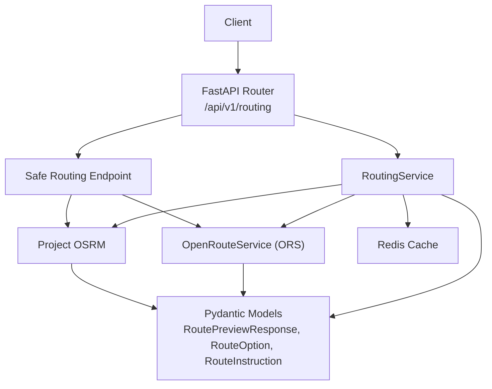
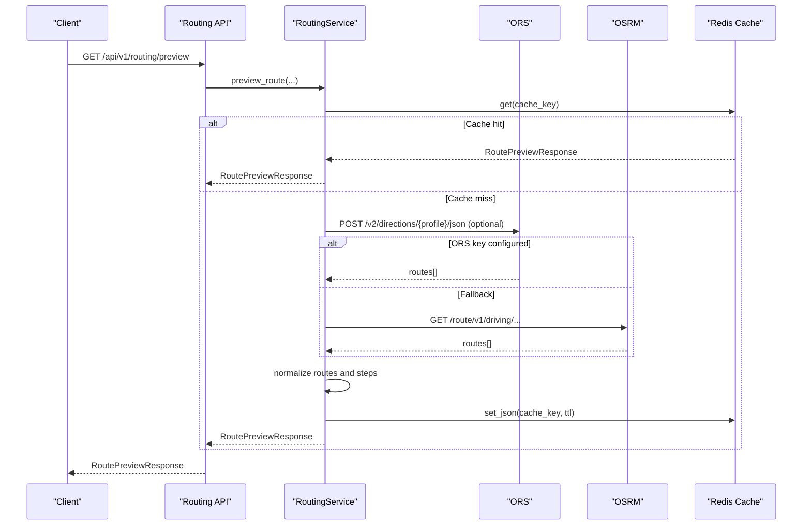
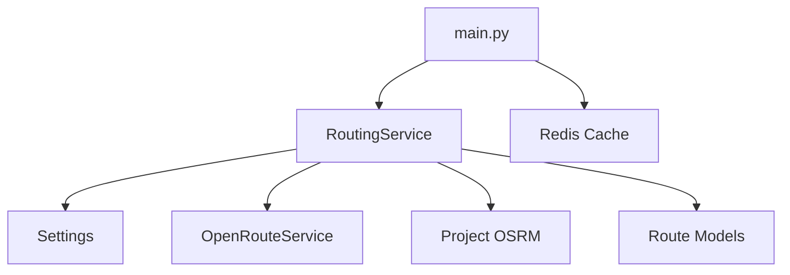

# Routing and Navigation API

<cite>
**Referenced Files in This Document**
- [routing.py](file://backend/api/v1/routing.py)
- [routing_service.py](file://backend/services/routing_service.py)
- [safe_routing.py](file://backend/services/safe_routing.py)
- [schemas.py](file://backend/models/schemas.py)
- [config.py](file://backend/core/config.py)
- [main.py](file://backend/main.py)
- [overpass_service.py](file://backend/services/overpass_service.py)
- [API.md](file://docs/API.md)
</cite>

## Table of Contents
1. [Introduction](#introduction)
2. [Project Structure](#project-structure)
3. [Core Components](#core-components)
4. [Architecture Overview](#architecture-overview)
5. [Detailed Component Analysis](#detailed-component-analysis)
6. [Dependency Analysis](#dependency-analysis)
7. [Performance Considerations](#performance-considerations)
8. [Troubleshooting Guide](#troubleshooting-guide)
9. [Conclusion](#conclusion)
10. [Appendices](#appendices)

## Introduction
This document provides comprehensive API documentation for routing and navigation endpoints. It covers HTTP methods, URL patterns, request parameters, response schemas, and integrations with OpenRouteService and Overpass API. It also explains spatial data handling, caching, and offline routing capabilities, and includes practical examples for point-to-point navigation, nearby points of interest, and route optimization scenarios.

## Project Structure
Routing and navigation functionality is exposed via FastAPI routers and implemented by dedicated services:
- API endpoints: backend/api/v1/routing.py
- Routing service: backend/services/routing_service.py
- Safe routing service: backend/services/safe_routing.py
- Data models and schemas: backend/models/schemas.py
- Configuration: backend/core/config.py
- Application lifecycle and service wiring: backend/main.py
- Overpass integration: backend/services/overpass_service.py

**Diagram sources**
- [routing.py:11-63](file://backend/api/v1/routing.py#L11-L63)
- [routing_service.py:20-356](file://backend/services/routing_service.py#L20-L356)
- [safe_routing.py:16-90](file://backend/services/safe_routing.py#L16-L90)
- [schemas.py:163-210](file://backend/models/schemas.py#L163-L210)
- [config.py:42-47](file://backend/core/config.py#L42-L47)

**Section sources**
- [routing.py:11-63](file://backend/api/v1/routing.py#L11-L63)
- [routing_service.py:20-356](file://backend/services/routing_service.py#L20-L356)
- [safe_routing.py:16-90](file://backend/services/safe_routing.py#L16-L90)
- [schemas.py:163-210](file://backend/models/schemas.py#L163-L210)
- [config.py:42-47](file://backend/core/config.py#L42-L47)
- [main.py:24-64](file://backend/main.py#L24-L64)

## Core Components
- Routing API endpoints:
  - GET /api/v1/routing/preview
  - GET /api/v1/routing/safe-route
- RoutingService:
  - Integrates with OpenRouteService (ORS) and Project OSRM
  - Normalizes route geometries and turn-by-turn instructions
  - Implements caching and validation
- Safe Routing:
  - Nighttime-aware route optimization
  - Avoids tracks and fords when using ORS
- Data Models:
  - RoutePreviewResponse, RouteOption, RouteInstruction, RoutePoint, RouteBounds

**Section sources**
- [routing.py:18-63](file://backend/api/v1/routing.py#L18-L63)
- [routing_service.py:35-142](file://backend/services/routing_service.py#L35-L142)
- [safe_routing.py:16-90](file://backend/services/safe_routing.py#L16-L90)
- [schemas.py:163-210](file://backend/models/schemas.py#L163-L210)

## Architecture Overview
The routing subsystem supports two primary flows:
- Route preview with alternatives and turn-by-turn instructions
- Safe route optimization with nighttime awareness and feature avoidance

**Diagram sources**
- [routing.py:18-41](file://backend/api/v1/routing.py#L18-L41)
- [routing_service.py:35-142](file://backend/services/routing_service.py#L35-L142)
- [config.py:42-47](file://backend/core/config.py#L42-L47)

## Detailed Component Analysis

### Endpoint: GET /api/v1/routing/preview
Purpose:
- Compute a route between two coordinates with optional alternatives and turn-by-turn instructions.

HTTP Method and URL:
- GET /api/v1/routing/preview

Request Parameters:
- origin_lat: float [-90, 90]
- origin_lon: float [-180, 180]
- destination_lat: float [-90, 90]
- destination_lon: float [-180, 180]
- profile: enum "driving-car" | "cycling-regular" | "foot-walking" (default: driving-car)
- alternatives: int [0, 2] (default: 2)

Behavior:
- Validates that origin and destination are not identical within a small tolerance.
- Attempts to use OpenRouteService when API key is configured; otherwise falls back to Project OSRM.
- Supports alternative routes when supported by provider.
- Normalizes route geometry and steps, computes bounds, and caches the result.

Responses:
- 200 OK: RoutePreviewResponse
- 422 Unprocessable Entity: Validation errors
- 503 Service Unavailable: External service errors

Response Schema (RoutePreviewResponse):
- provider: string ("ors" | "osrm")
- profile: enum
- distance_meters: number
- duration_seconds: number
- path: array of RoutePoint
- bounds: RouteBounds
- origin: RoutePoint
- destination: RoutePoint
- steps: array of RouteInstruction
- routes: array of RouteOption
- selected_route_id: string
- warnings: array of string

Data Models:
- RoutePoint: lat, lon, label?
- RouteBounds: south, west, north, east
- RouteInstruction: index, instruction, distance_meters, duration_seconds, street_name?, instruction_type?, exit_number?
- RouteOption: route_id, label, distance_meters, duration_seconds, path[], bounds, steps?

Integration Notes:
- Uses OPENROUTESERVICE_API_KEY and openrouteservice_base_url from configuration.
- Caches results with route_cache_ttl_seconds.

**Section sources**
- [routing.py:18-41](file://backend/api/v1/routing.py#L18-L41)
- [routing_service.py:35-142](file://backend/services/routing_service.py#L35-L142)
- [schemas.py:163-210](file://backend/models/schemas.py#L163-L210)
- [config.py:42-47](file://backend/core/config.py#L42-L47)

### Endpoint: GET /api/v1/routing/safe-route
Purpose:
- Compute a safe route optimized for nighttime driving and avoiding isolated roads.

HTTP Method and URL:
- GET /api/v1/routing/safe-route

Request Parameters:
- origin_lat: float [-90, 90]
- origin_lon: float [-180, 180]
- destination_lat: float [-90, 90]
- destination_lon: float [-180, 180]
- prefer_safety: bool (default: false)

Behavior:
- Determines safety mode based on prefer_safety flag or current time (8 PM to 6 AM).
- Uses ORS with avoid_features ["tracks", "fords"] when API key is available.
- Falls back to OSRM when no ORS key is configured.

Responses:
- 200 OK: JSON with provider, safety_mode, note, distance_meters, duration_seconds, geometry
- 503 Service Unavailable: On external service failures

Notes:
- Geometry is returned as a GeoJSON-compatible structure.
- Distance and duration are derived from the first route summary.

**Section sources**
- [routing.py:43-63](file://backend/api/v1/routing.py#L43-L63)
- [safe_routing.py:16-90](file://backend/services/safe_routing.py#L16-L90)

### RoutingService Implementation Details
Key Responsibilities:
- Provider selection and request construction
- Response normalization for ORS and OSRM
- Geometry decoding and bounds calculation
- Caching and error handling

Processing Logic:
- Validates inputs and prevents identical origin/destination.
- Chooses ORS or OSRM based on configuration.
- Builds request bodies/queries and handles alternative routes.
- Normalizes route summaries, steps, and path points.
- Computes bounding box from path coordinates.
- Caches serialized results with TTL.

Error Handling:
- Raises ServiceValidationError for invalid inputs.
- Wraps external provider errors as ExternalServiceError.
- Provides user-friendly messages for rate limits and generic failures.

**Section sources**
- [routing_service.py:35-142](file://backend/services/routing_service.py#L35-L142)
- [routing_service.py:242-344](file://backend/services/routing_service.py#L242-L344)

### Safe Routing Logic
Key Responsibilities:
- Nighttime detection and safety preference handling
- Feature avoidance configuration for ORS
- Graceful fallback to OSRM when ORS key is absent

Processing Logic:
- Detects nighttime (20:00–06:59).
- Sets safety_mode accordingly.
- Calls ORS with avoid_features when key is present.
- Returns standardized JSON with geometry and metrics.
- Falls back to OSRM with full geometry and steps disabled.

**Section sources**
- [safe_routing.py:10-14](file://backend/services/safe_routing.py#L10-L14)
- [safe_routing.py:16-90](file://backend/services/safe_routing.py#L16-L90)

### Spatial Data Handling and Geometry
- Route geometry normalization:
  - ORS: Accepts polyline string or GeoJSON coordinates; decodes polyline when needed.
  - OSRM: Extracts path from GeoJSON geometry or step maneuvers.
- Turn-by-turn instructions:
  - ORS: Iterates segments/steps to produce RouteInstruction list.
  - OSRM: Constructs instruction strings from maneuver metadata.
- Bounds computation:
  - Calculates bounding box from path coordinates.

**Section sources**
- [routing_service.py:242-344](file://backend/services/routing_service.py#L242-L344)
- [schemas.py:163-210](file://backend/models/schemas.py#L163-L210)

### Integration with OpenRouteService and Overpass API
- OpenRouteService:
  - Base URL and API key configurable.
  - Supports alternative routes and extra_info for way categories/types.
  - Authorization header required for ORS requests.
- Overpass API:
  - Used by other services for nearby POIs and road context.
  - Not directly called by routing endpoints but relevant for complementary features.

**Section sources**
- [config.py:42-47](file://backend/core/config.py#L42-L47)
- [overpass_service.py:24-134](file://backend/services/overpass_service.py#L24-L134)

### Offline Routing Capabilities
- The routing endpoints rely on external providers (ORS/OSRM) and do not implement pure offline routing within the documented endpoints.
- The system includes offline data bundling for emergency services and other features, but routing itself remains network-dependent.

**Section sources**
- [routing.py:18-63](file://backend/api/v1/routing.py#L18-L63)
- [safe_routing.py:16-90](file://backend/services/safe_routing.py#L16-L90)
- [API.md:251-258](file://docs/API.md#L251-L258)

## Dependency Analysis
Routing depends on configuration, caching, and external providers. The application wires services during startup.

**Diagram sources**
- [main.py:24-64](file://backend/main.py#L24-L64)
- [routing_service.py:20-356](file://backend/services/routing_service.py#L20-L356)
- [config.py:11-181](file://backend/core/config.py#L11-L181)

**Section sources**
- [main.py:24-64](file://backend/main.py#L24-L64)
- [routing_service.py:20-356](file://backend/services/routing_service.py#L20-L356)
- [config.py:11-181](file://backend/core/config.py#L11-L181)

## Performance Considerations
- Caching:
  - Results are cached with route_cache_ttl_seconds to reduce repeated external calls.
- Provider Selection:
  - ORS provides richer features and alternatives; OSRM is used as a free fallback.
- Geometry Decoding:
  - Polyline decoding is performed efficiently; ensure minimal overhead by limiting alternatives.
- Error Handling:
  - Early validation prevents unnecessary provider calls.

[No sources needed since this section provides general guidance]

## Troubleshooting Guide
Common Issues and Resolutions:
- Validation errors (422):
  - Ensure coordinates are within valid ranges and origin/destination are sufficiently separated.
- Rate limits (503):
  - ORS/OSRM may throttle requests; retry after a short delay.
- No route returned:
  - Verify coordinates and profile; confirm provider availability.
- Missing alternatives:
  - Alternatives are capped at 2; ensure alternatives parameter is within [0, 2].

**Section sources**
- [routing.py:37-40](file://backend/api/v1/routing.py#L37-L40)
- [routing_service.py:108-114](file://backend/services/routing_service.py#L108-L114)
- [routing_service.py:154-168](file://backend/services/routing_service.py#L154-L168)

## Conclusion
The routing and navigation API provides robust point-to-point routing with optional alternatives and turn-by-turn directions, alongside a safe-route endpoint optimized for nighttime driving. It integrates seamlessly with OpenRouteService and Project OSRM, normalizes spatial data, and leverages caching for performance. While routing relies on external providers, the system’s modular design and clear schemas enable straightforward extension and integration.

[No sources needed since this section summarizes without analyzing specific files]

## Appendices

### Endpoint Reference Summary
- GET /api/v1/routing/preview
  - Parameters: origin_lat, origin_lon, destination_lat, destination_lon, profile, alternatives
  - Response: RoutePreviewResponse
- GET /api/v1/routing/safe-route
  - Parameters: origin_lat, origin_lon, destination_lat, destination_lon, prefer_safety
  - Response: JSON with provider, safety_mode, note, distance_meters, duration_seconds, geometry

**Section sources**
- [routing.py:18-63](file://backend/api/v1/routing.py#L18-L63)
- [API.md:251-258](file://docs/API.md#L251-L258)

### Example Scenarios
- Point-to-point navigation:
  - Call GET /api/v1/routing/preview with origin and destination coordinates; use alternatives for route comparison.
- Nearby points of interest:
  - Use Overpass integration (via other endpoints) to discover hospitals, police, fire stations, and more near a route.
- Route optimization:
  - Use GET /api/v1/routing/safe-route with prefer_safety=true or during nighttime to avoid tracks and fords.

**Section sources**
- [safe_routing.py:16-90](file://backend/services/safe_routing.py#L16-L90)
- [overpass_service.py:35-78](file://backend/services/overpass_service.py#L35-L78)