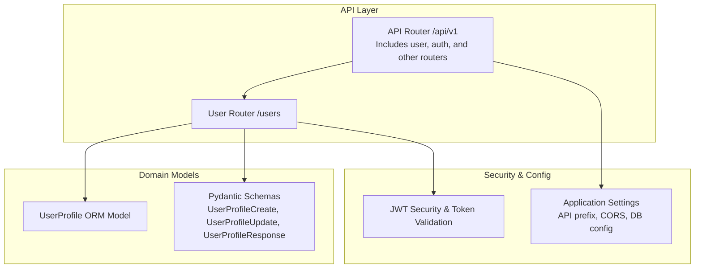
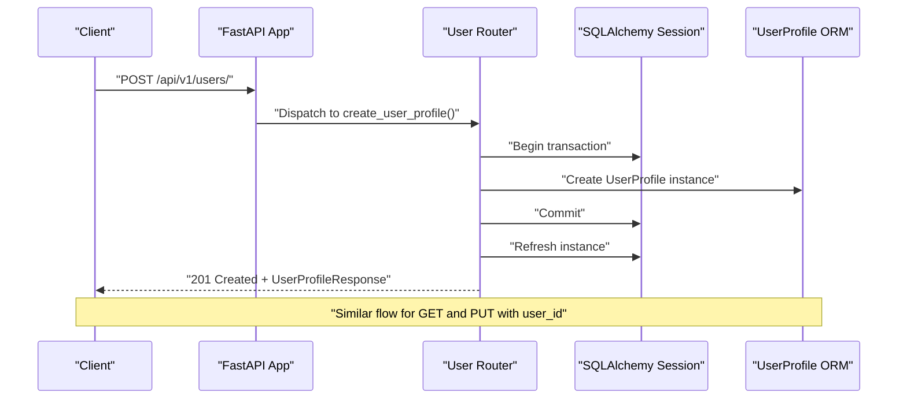
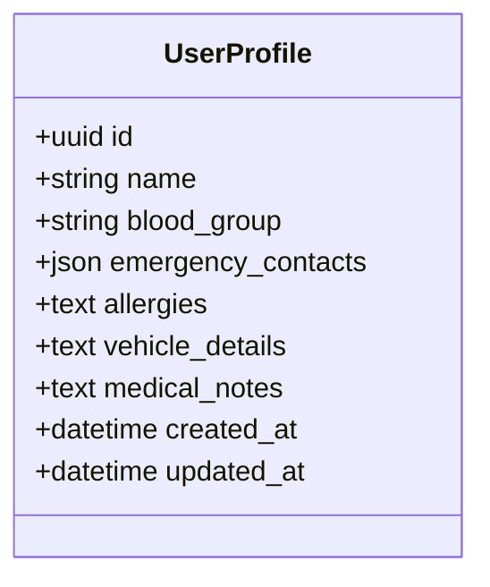
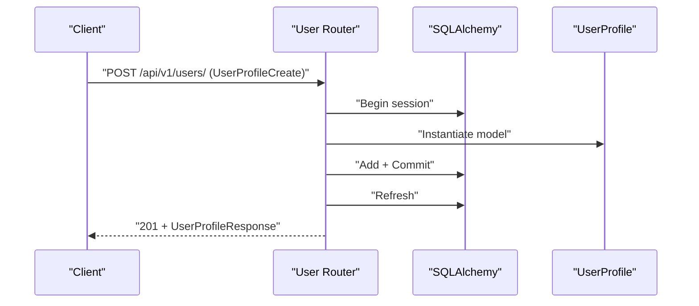
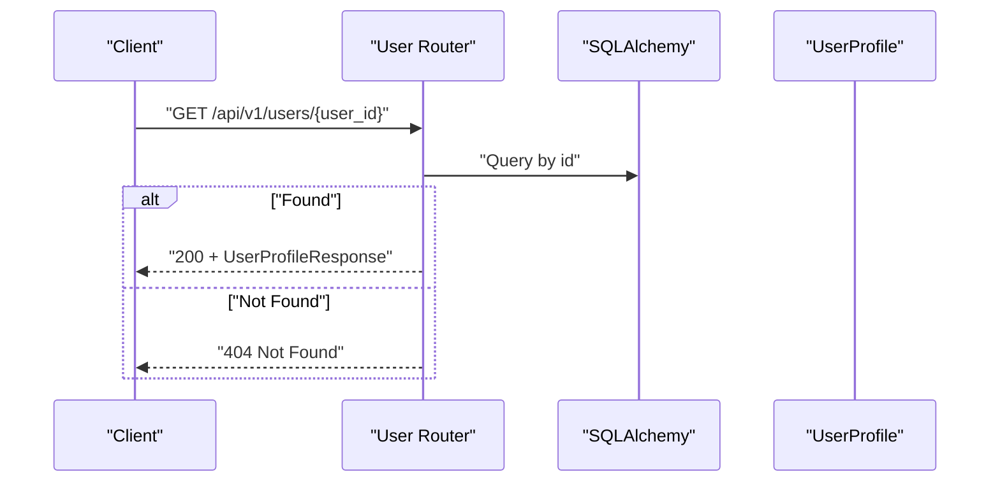
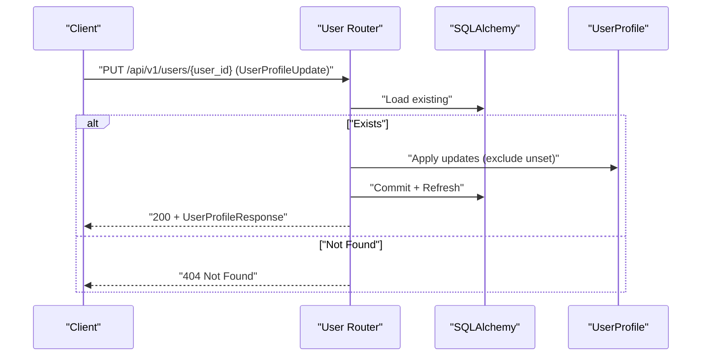
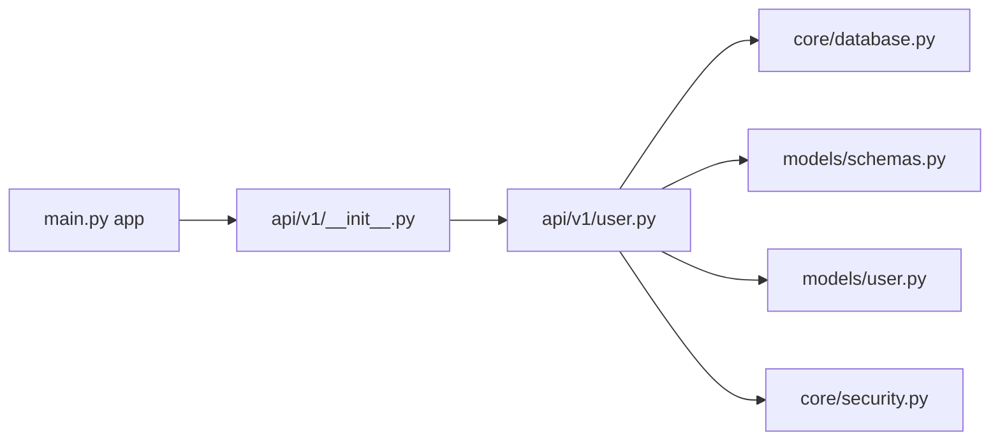

# User Management API

<cite>
**Referenced Files in This Document**
- [backend/api/v1/user.py](file://backend/api/v1/user.py)
- [backend/models/user.py](file://backend/models/user.py)
- [backend/models/schemas.py](file://backend/models/schemas.py)
- [backend/api/v1/__init__.py](file://backend/api/v1/__init__.py)
- [backend/main.py](file://backend/main.py)
- [backend/core/security.py](file://backend/core/security.py)
- [backend/core/config.py](file://backend/core/config.py)
- [backend/api/v1/auth.py](file://backend/api/v1/auth.py)
</cite>

## Table of Contents
1. [Introduction](#introduction)
2. [Project Structure](#project-structure)
3. [Core Components](#core-components)
4. [Architecture Overview](#architecture-overview)
5. [Detailed Component Analysis](#detailed-component-analysis)
6. [Dependency Analysis](#dependency-analysis)
7. [Performance Considerations](#performance-considerations)
8. [Troubleshooting Guide](#troubleshooting-guide)
9. [Conclusion](#conclusion)

## Introduction
This document describes the user management APIs exposed by the backend service. It focuses on emergency user profiles, including creation, retrieval, and updates. The documentation covers HTTP methods, URL patterns, request/response schemas, validation rules, authentication requirements, and operational considerations. It also provides examples for typical workflows such as profile CRUD operations and user data retrieval.

## Project Structure
The user management endpoints are part of the versioned API router under `/api/v1`. The user profile resource is defined in the user router and backed by SQLAlchemy ORM models and Pydantic schemas.

**Diagram sources**
- [backend/api/v1/__init__.py:17-28](file://backend/api/v1/__init__.py#L17-L28)
- [backend/api/v1/user.py:13](file://backend/api/v1/user.py#L13)
- [backend/models/user.py:13-25](file://backend/models/user.py#L13-L25)
- [backend/models/schemas.py:259-287](file://backend/models/schemas.py#L259-L287)
- [backend/core/security.py:23-41](file://backend/core/security.py#L23-L41)
- [backend/core/config.py:15](file://backend/core/config.py#L15)

**Section sources**
- [backend/api/v1/__init__.py:17-28](file://backend/api/v1/__init__.py#L17-L28)
- [backend/main.py:127](file://backend/main.py#L127)

## Core Components
- User Profile Resource: Manages emergency user profiles with personal details, allergies, vehicle info, and emergency contacts stored as JSON.
- Pydantic Schemas: Define request/response shapes for creating, updating, and returning user profiles.
- Authentication: JWT-based bearer tokens are validated via a security dependency.
- Database: Async SQLAlchemy ORM with JSON storage for emergency contacts and optional fields.

Key capabilities:
- Create a new emergency user profile
- Retrieve a user profile by ID
- Update an existing user profile with partial updates
- Strong typing and validation via Pydantic models

**Section sources**
- [backend/models/user.py:13-25](file://backend/models/user.py#L13-L25)
- [backend/models/schemas.py:259-287](file://backend/models/schemas.py#L259-L287)
- [backend/api/v1/user.py:16-82](file://backend/api/v1/user.py#L16-L82)

## Architecture Overview
The user management endpoints are mounted under the `/api/v1` prefix and routed through the main application. Authentication is enforced via a JWT bearer security dependency.

**Diagram sources**
- [backend/api/v1/user.py:16-36](file://backend/api/v1/user.py#L16-L36)
- [backend/api/v1/user.py:39-53](file://backend/api/v1/user.py#L39-L53)
- [backend/api/v1/user.py:56-82](file://backend/api/v1/user.py#L56-L82)
- [backend/core/database.py:38-41](file://backend/core/database.py#L38-L41)

## Detailed Component Analysis

### Endpoint Catalog
- Base path: `/api/v1/users`
- Methods:
  - POST `/` - Create a new emergency user profile
  - GET `/{user_id}` - Retrieve a user profile by UUID
  - PUT `/{user_id}` - Update an existing user profile

Notes:
- The current implementation does not expose `/api/v1/user/profile`, `/api/v1/user/settings`, or `/api/v1/user/preferences` as separate endpoints. The user profile resource is served under `/api/v1/users`.

**Section sources**
- [backend/api/v1/user.py:13](file://backend/api/v1/user.py#L13)
- [backend/api/v1/user.py:16-82](file://backend/api/v1/user.py#L16-L82)

### Authentication and Authorization
- Authentication scheme: HTTP Bearer JWT
- Token validation: Decodes and verifies JWT using a shared secret
- JWT validation with strict HS256 signature verification using environment-sourced keys
- Scope: The user profile endpoints do not enforce per-record ownership checks; they operate on arbitrary user IDs passed in the path

Operational details:
- Token header: Authorization: Bearer <token>
- Token verification endpoint: `/api/v1/auth/verify` (health check)
- Login endpoint: `/api/v1/auth/login` returns an access token

**Section sources**
- [backend/core/security.py:23-41](file://backend/core/security.py#L23-L41)
- [backend/api/v1/auth.py:24-38](file://backend/api/v1/auth.py#L24-L38)
- [backend/api/v1/auth.py:40-43](file://backend/api/v1/auth.py#L40-L43)

### Request and Response Schemas

#### UserProfileCreate
- Purpose: Request schema for creating a new user profile
- Fields:
  - name: string
  - blood_group: string or null
  - emergency_contacts: array of EmergencyContact
  - allergies: string or null
  - vehicle_details: string or null
  - medical_notes: string or null

#### UserProfileUpdate
- Purpose: Request schema for updating an existing user profile
- Fields:
  - name: string or null
  - blood_group: string or null
  - emergency_contacts: array of EmergencyContact or null
  - allergies: string or null
  - vehicle_details: string or null
  - medical_notes: string or null

#### UserProfileResponse
- Purpose: Response schema for user profile operations
- Includes all fields from UserProfileCreate plus:
  - id: UUID
  - created_at: datetime
  - updated_at: datetime

#### EmergencyContact
- Fields:
  - name: string
  - phone: string
  - relation: string or null

Validation highlights:
- Pydantic enforces type constraints and optional fields
- Emergency contacts are stored as JSON; updates accept arrays of contact objects

**Section sources**
- [backend/models/schemas.py:259-287](file://backend/models/schemas.py#L259-L287)
- [backend/models/schemas.py:259-263](file://backend/models/schemas.py#L259-L263)

### Data Model

**Diagram sources**
- [backend/models/user.py:13-25](file://backend/models/user.py#L13-L25)

**Section sources**
- [backend/models/user.py:13-25](file://backend/models/user.py#L13-L25)

### End-to-End Workflows

#### Create User Profile
- Method: POST
- Path: `/api/v1/users/`
- Authentication: Required
- Request body: UserProfileCreate
- Response: UserProfileResponse (201 Created)

**Diagram sources**
- [backend/api/v1/user.py:16-36](file://backend/api/v1/user.py#L16-L36)

**Section sources**
- [backend/api/v1/user.py:16-36](file://backend/api/v1/user.py#L16-L36)

#### Get User Profile
- Method: GET
- Path: `/api/v1/users/{user_id}`
- Authentication: Required
- Path parameter: user_id (UUID)
- Response: UserProfileResponse (200 OK) or 404 Not Found

**Diagram sources**
- [backend/api/v1/user.py:39-53](file://backend/api/v1/user.py#L39-L53)

**Section sources**
- [backend/api/v1/user.py:39-53](file://backend/api/v1/user.py#L39-L53)

#### Update User Profile
- Method: PUT
- Path: `/api/v1/users/{user_id}`
- Authentication: Required
- Path parameter: user_id (UUID)
- Request body: UserProfileUpdate (partial updates allowed)
- Response: UserProfileResponse (200 OK) or 404 Not Found

**Diagram sources**
- [backend/api/v1/user.py:56-82](file://backend/api/v1/user.py#L56-L82)

**Section sources**
- [backend/api/v1/user.py:56-82](file://backend/api/v1/user.py#L56-L82)

### Examples

- Create a profile:
  - POST `/api/v1/users/`
  - Body: UserProfileCreate
  - Expected response: 201 with UserProfileResponse

- Retrieve a profile:
  - GET `/api/v1/users/{user_id}`
  - Expected response: 200 with UserProfileResponse

- Update a profile:
  - PUT `/api/v1/users/{user_id}`
  - Body: Partial UserProfileUpdate
  - Expected response: 200 with updated UserProfileResponse

Notes:
- Authentication header: Authorization: Bearer <token>
- The current codebase does not define endpoints for `/api/v1/user/profile`, `/api/v1/user/settings`, or `/api/v1/user/preferences`. Use `/api/v1/users` for profile management.

**Section sources**
- [backend/api/v1/user.py:16-82](file://backend/api/v1/user.py#L16-L82)
- [backend/api/v1/auth.py:24-38](file://backend/api/v1/auth.py#L24-L38)

## Dependency Analysis
- User router depends on:
  - SQLAlchemy async sessions for persistence
  - Pydantic models for validation and serialization
  - JWT security dependency for authentication
- Application wiring:
  - The main app mounts the v1 router, which includes the user router
  - Settings provide the API prefix and other runtime configuration

**Diagram sources**
- [backend/main.py:127](file://backend/main.py#L127)
- [backend/api/v1/__init__.py:17-28](file://backend/api/v1/__init__.py#L17-L28)
- [backend/api/v1/user.py:8-10](file://backend/api/v1/user.py#L8-L10)
- [backend/core/database.py:38-41](file://backend/core/database.py#L38-L41)
- [backend/core/security.py:23-41](file://backend/core/security.py#L23-L41)
- [backend/models/schemas.py:259-287](file://backend/models/schemas.py#L259-L287)
- [backend/models/user.py:13-25](file://backend/models/user.py#L13-L25)

**Section sources**
- [backend/main.py:127](file://backend/main.py#L127)
- [backend/api/v1/__init__.py:17-28](file://backend/api/v1/__init__.py#L17-L28)

## Performance Considerations
- Asynchronous database operations: Uses SQLAlchemy async sessions to minimize blocking
- JSON storage for emergency contacts: Allows flexible contact structures but consider indexing or normalization if querying by contact fields becomes frequent
- Token validation overhead: Minimal cost for JWT decoding; ensure token reuse and avoid excessive re-authentication
- Pagination and filtering: Not applicable to user profile endpoints; keep requests small and targeted

[No sources needed since this section provides general guidance]

## Troubleshooting Guide
Common issues and resolutions:
- 401 Unauthorized:
  - Cause: Missing or invalid Authorization header
  - Resolution: Include a valid Bearer token from `/api/v1/auth/login`
- 404 Not Found:
  - Cause: Non-existent user_id in GET or PUT
  - Resolution: Verify the UUID and ensure the record exists
- 422 Unprocessable Entity:
  - Cause: Invalid request body against Pydantic schemas
  - Resolution: Match UserProfileCreate/UserProfileUpdate field types and constraints
- Database connectivity:
  - Health check: GET `/health` to verify database availability

**Section sources**
- [backend/api/v1/user.py:48-52](file://backend/api/v1/user.py#L48-L52)
- [backend/api/v1/user.py:66-70](file://backend/api/v1/user.py#L66-L70)
- [backend/main.py:103-125](file://backend/main.py#L103-L125)

## Conclusion
The user management API provides essential CRUD operations for emergency user profiles under `/api/v1/users`. It leverages JWT authentication, robust Pydantic validation, and asynchronous database access. While `/api/v1/user/profile`, `/api/v1/user/settings`, and `/api/v1/user/preferences` are not present in the current codebase, the `/api/v1/users` endpoints fulfill profile management needs. For production deployments, consider adding per-record ownership checks, stricter validation for emergency contacts, and rate limiting for sensitive endpoints.