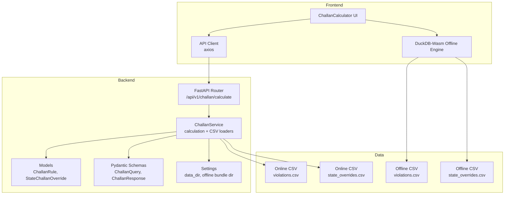
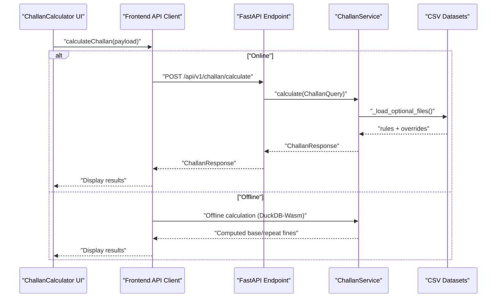
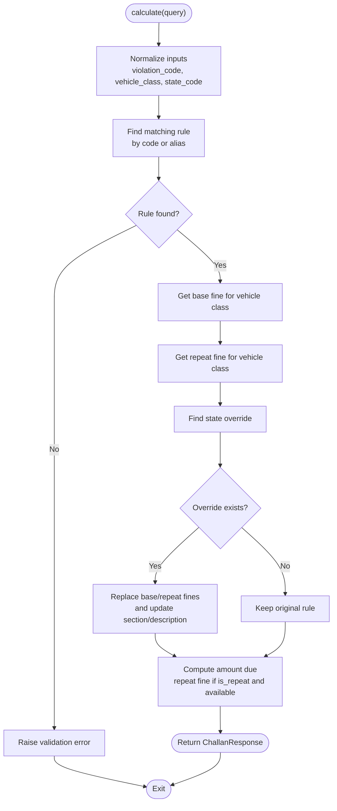
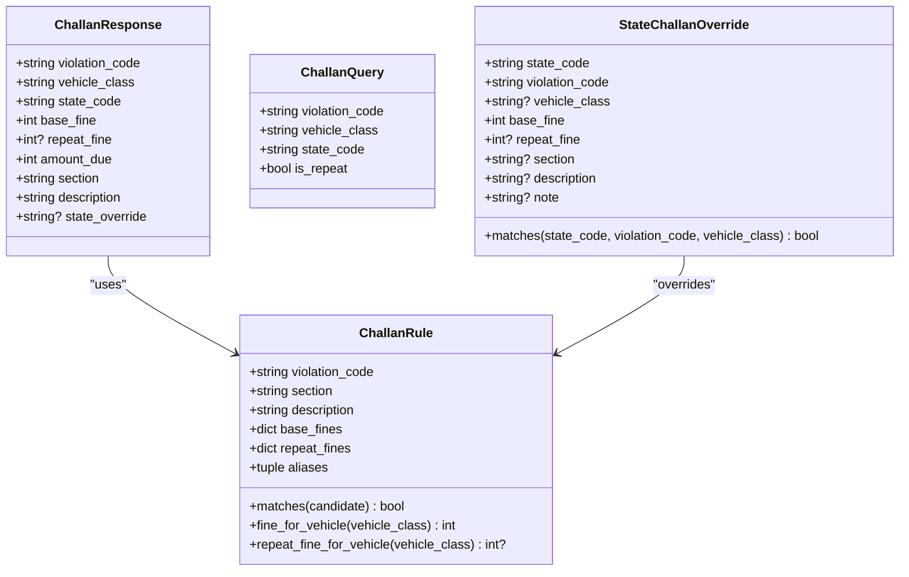
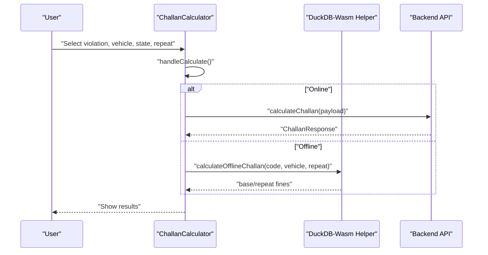
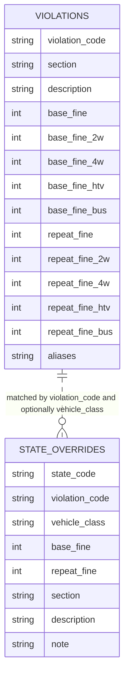
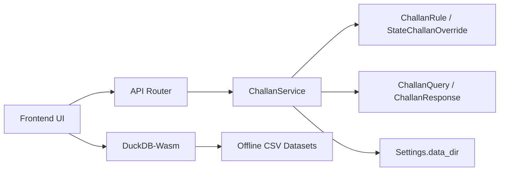

# Challan Calculator (DriveLegal)

<cite>
**Referenced Files in This Document**
- [challan.py](file://backend/api/v1/challan.py)
- [challan_service.py](file://backend/services/challan_service.py)
- [challan.py](file://backend/models/challan.py)
- [schemas.py](file://backend/models/schemas.py)
- [config.py](file://backend/core/config.py)
- [test_challan.py](file://backend/tests/test_challan.py)
- [ChallanCalculator.tsx](file://frontend/components/ChallanCalculator.tsx)
- [duckdb-challan.ts](file://frontend/lib/duckdb-challan.ts)
- [api.ts](file://frontend/lib/api.ts)
- [violations.csv](file://frontend/public/offline-data/violations.csv)
- [state_overrides.csv](file://frontend/public/offline-data/state_overrides.csv)
- [state_overrides.csv](file://chatbot_service/data/state_overrides.csv)
- [violations_seed.csv](file://chatbot_service/data/violations_seed.csv)
- [Offline_Architecture.md](file://docs/Offline_Architecture.md)
</cite>

## Table of Contents
1. [Introduction](#introduction)
2. [Project Structure](#project-structure)
3. [Core Components](#core-components)
4. [Architecture Overview](#architecture-overview)
5. [Detailed Component Analysis](#detailed-component-analysis)
6. [Dependency Analysis](#dependency-analysis)
7. [Performance Considerations](#performance-considerations)
8. [Troubleshooting Guide](#troubleshooting-guide)
9. [Conclusion](#conclusion)
10. [Appendices](#appendices)

## Introduction
This document explains the Challan Calculator (DriveLegal) implementation that computes traffic challan (fine) amounts based on the Motor Vehicles Act 1988, with state-specific overrides. It covers the fine calculation engine, data loading from CSV files, DuckDB-Wasm integration for offline operation, and the violations database schema. It also documents configuration options, legal citations, enforcement authorities, and practical guidance for jurisdictional variations, penalties, and appeals.

## Project Structure
The Challan Calculator spans backend and frontend modules:
- Backend FastAPI endpoint and service orchestrate fine calculations, load optional CSV datasets, and normalize inputs.
- Frontend provides a UI for selecting violations, vehicle class, state/UT, and repeat-offender status, and integrates offline calculation via DuckDB-Wasm helpers.

**Diagram sources**
- [challan.py:17-25](file://backend/api/v1/challan.py#L17-L25)
- [challan_service.py:96-150](file://backend/services/challan_service.py#L96-L150)
- [challan.py:6-53](file://backend/models/challan.py#L6-L53)
- [schemas.py:240-257](file://backend/models/schemas.py#L240-L257)
- [config.py:55-58](file://backend/core/config.py#L55-L58)
- [ChallanCalculator.tsx:32-62](file://frontend/components/ChallanCalculator.tsx#L32-L62)
- [duckdb-challan.ts:3-18](file://frontend/lib/duckdb-challan.ts#L3-L18)
- [violations.csv:1-27](file://frontend/public/offline-data/violations.csv#L1-L27)
- [state_overrides.csv:1-14](file://frontend/public/offline-data/state_overrides.csv#L1-L14)

**Section sources**
- [challan.py:10-25](file://backend/api/v1/challan.py#L10-L25)
- [challan_service.py:96-150](file://backend/services/challan_service.py#L96-L150)
- [ChallanCalculator.tsx:13-62](file://frontend/components/ChallanCalculator.tsx#L13-L62)
- [duckdb-challan.ts:3-18](file://frontend/lib/duckdb-challan.ts#L3-L18)

## Core Components
- API Endpoint: Exposes POST /api/v1/challan/calculate that accepts a ChallanQuery and returns ChallanResponse.
- ChallanService: Central calculation engine that normalizes inputs, loads rules and overrides from CSV, selects the appropriate rule, applies state overrides, and computes the final amount due.
- Models: ChallanRule defines base/repeat fines per vehicle class and aliases; StateChallanOverride captures state-specific adjustments.
- Pydantic Schemas: Define request/response contracts for ChallanQuery and ChallanResponse.
- Settings: Provides data_dir and offline bundle directories used to discover CSV datasets.
- Frontend UI: Provides violation selection, vehicle class dropdown, state/UT selector, repeat-offender toggle, and displays results.
- DuckDB-Wasm Helpers: Initialize offline DB and simulate offline calculation using embedded rule sets.

**Section sources**
- [challan.py:17-25](file://backend/api/v1/challan.py#L17-L25)
- [challan_service.py:96-150](file://backend/services/challan_service.py#L96-L150)
- [challan.py:6-53](file://backend/models/challan.py#L6-L53)
- [schemas.py:240-257](file://backend/models/schemas.py#L240-L257)
- [config.py:55-58](file://backend/core/config.py#L55-L58)
- [ChallanCalculator.tsx:13-62](file://frontend/components/ChallanCalculator.tsx#L13-L62)
- [duckdb-challan.ts:3-18](file://frontend/lib/duckdb-challan.ts#L3-L18)

## Architecture Overview
The system supports online and offline modes:
- Online Mode: Frontend calls the backend API; backend loads rules and overrides from CSV files and returns computed fine amounts.
- Offline Mode: Frontend uses DuckDB-Wasm helpers to compute penalties locally from embedded CSV datasets.

**Diagram sources**
- [challan.py:17-25](file://backend/api/v1/challan.py#L17-L25)
- [challan_service.py:103-149](file://backend/services/challan_service.py#L103-L149)
- [ChallanCalculator.tsx:32-62](file://frontend/components/ChallanCalculator.tsx#L32-L62)
- [duckdb-challan.ts:20-50](file://frontend/lib/duckdb-challan.ts#L20-L50)

## Detailed Component Analysis

### Backend API and Service
- Endpoint: Validates payload via Pydantic, delegates to ChallanService, and handles validation errors.
- Service:
  - Normalizes violation code, vehicle class, and state code.
  - Loads default rules and optional CSV datasets from multiple locations.
  - Matches violation code to a rule (including aliases).
  - Applies state overrides when present.
  - Computes amount due based on repeat-offender flag and repeat fine availability.

**Diagram sources**
- [challan_service.py:103-149](file://backend/services/challan_service.py#L103-L149)
- [challan_service.py:240-260](file://backend/services/challan_service.py#L240-L260)

**Section sources**
- [challan.py:17-25](file://backend/api/v1/challan.py#L17-L25)
- [challan_service.py:103-149](file://backend/services/challan_service.py#L103-L149)
- [challan_service.py:240-260](file://backend/services/challan_service.py#L240-L260)

### Data Models and Schemas
- ChallanRule: Encapsulates violation_code, section, description, base_fines, repeat_fines, and aliases. Provides matching and per-vehicle-class fine retrieval.
- StateChallanOverride: Encapsulates state_code, violation_code, optional vehicle_class, base_fine, optional repeat_fine, and optional section/description overrides.
- ChallanQuery: Request schema with violation_code, vehicle_class, state_code, is_repeat.
- ChallanResponse: Response schema with computed fields including amount_due and optional state_override note.

**Diagram sources**
- [challan.py:6-53](file://backend/models/challan.py#L6-L53)
- [schemas.py:240-257](file://backend/models/schemas.py#L240-L257)

**Section sources**
- [challan.py:6-53](file://backend/models/challan.py#L6-L53)
- [schemas.py:240-257](file://backend/models/schemas.py#L240-L257)

### Frontend UI and DuckDB-Wasm Integration
- UI: Provides a violation selector grid, vehicle class dropdown, state/UT selector, repeat-offender toggle, and a calculate button. Displays results with section, description, and computed amount.
- Offline Engine: DuckDB-Wasm helper initializes and simulates offline calculation using embedded datasets. The UI switches between online and offline modes based on connectivity.

**Diagram sources**
- [ChallanCalculator.tsx:32-62](file://frontend/components/ChallanCalculator.tsx#L32-L62)
- [duckdb-challan.ts:20-50](file://frontend/lib/duckdb-challan.ts#L20-L50)

**Section sources**
- [ChallanCalculator.tsx:13-62](file://frontend/components/ChallanCalculator.tsx#L13-L62)
- [duckdb-challan.ts:3-18](file://frontend/lib/duckdb-challan.ts#L3-L18)
- [duckdb-challan.ts:20-50](file://frontend/lib/duckdb-challan.ts#L20-L50)

### Violations Database Schema and CSV Loading
The system loads two primary CSV datasets:
- violations.csv: Defines base and repeat fines per vehicle class and aliases for each violation code.
- state_overrides.csv: Defines state-specific adjustments to base/repeat fines and optional section/description overrides.

Key fields and behavior:
- violations.csv: Supports per-vehicle-class columns (e.g., base_fine_2w, base_fine_4w, base_fine_htv, base_fine_bus) and repeat counterparts. Aliases enable flexible matching.
- state_overrides.csv: Allows state-level overrides for specific violation codes and vehicle classes, with optional section/description updates and notes.

**Diagram sources**
- [violations.csv:1-27](file://frontend/public/offline-data/violations.csv#L1-L27)
- [state_overrides.csv:1-14](file://frontend/public/offline-data/state_overrides.csv#L1-L14)

**Section sources**
- [challan_service.py:168-207](file://backend/services/challan_service.py#L168-L207)
- [challan_service.py:209-238](file://backend/services/challan_service.py#L209-L238)
- [violations.csv:1-27](file://frontend/public/offline-data/violations.csv#L1-L27)
- [state_overrides.csv:1-14](file://frontend/public/offline-data/state_overrides.csv#L1-L14)

### Legal Citations and Enforcement Authorities
- State overrides include authoritative sources and effective dates, enabling traceability to official notifications and schedules.
- Examples include Tamil Nadu, Delhi, Karnataka, Kerala, Maharashtra, Gujarat, Andhra Pradesh, Telangana, West Bengal, Uttar Pradesh, and others.

**Section sources**
- [state_overrides.csv:1-14](file://chatbot_service/data/state_overrides.csv#L1-L14)
- [state_overrides.csv:1-14](file://frontend/public/offline-data/state_overrides.csv#L1-L14)

## Dependency Analysis
- API depends on ChallanService.
- ChallanService depends on models (ChallanRule, StateChallanOverride), Pydantic schemas, and Settings for data directory discovery.
- Frontend UI depends on API client and DuckDB-Wasm helpers.
- CSV datasets are discovered from configured data directories and offline bundles.

**Diagram sources**
- [challan.py:17-25](file://backend/api/v1/challan.py#L17-L25)
- [challan_service.py:96-150](file://backend/services/challan_service.py#L96-L150)
- [config.py:55-58](file://backend/core/config.py#L55-L58)
- [ChallanCalculator.tsx:32-62](file://frontend/components/ChallanCalculator.tsx#L32-L62)
- [duckdb-challan.ts:3-18](file://frontend/lib/duckdb-challan.ts#L3-L18)

**Section sources**
- [challan.py:17-25](file://backend/api/v1/challan.py#L17-L25)
- [challan_service.py:96-150](file://backend/services/challan_service.py#L96-L150)
- [config.py:55-58](file://backend/core/config.py#L55-L58)
- [ChallanCalculator.tsx:32-62](file://frontend/components/ChallanCalculator.tsx#L32-L62)
- [duckdb-challan.ts:3-18](file://frontend/lib/duckdb-challan.ts#L3-L18)

## Performance Considerations
- CSV loading occurs once during service initialization and from multiple candidate directories to support offline bundles.
- Matching rules and overrides are linear scans; the dataset sizes are small, keeping lookups efficient.
- DuckDB-Wasm offline simulation uses an in-memory lookup table for quick offline responses.

[No sources needed since this section provides general guidance]

## Troubleshooting Guide
Common issues and resolutions:
- Unsupported violation code: Validation error indicates supported codes and aliases. Ensure the violation_code matches known entries or aliases.
  - Example validation behavior is covered by tests.
- Unknown vehicle class or state code: Validation enforces required fields and normalizes inputs; ensure values conform to expected formats.
- Missing CSV datasets: Service gracefully skips missing files; ensure violations.csv and state_overrides.csv are present in configured directories.
- Jurisdictional variations: Verify state overrides apply to the specific violation_code, state_code, and vehicle_class combination.
- Penalty appeals: The system returns computed amounts; appeals procedures are outside the scope of this calculator and should be handled by enforcement authorities noted in state overrides.

**Section sources**
- [test_challan.py:45-59](file://backend/tests/test_challan.py#L45-L59)
- [challan_service.py:109-113](file://backend/services/challan_service.py#L109-L113)
- [challan_service.py:300-313](file://backend/services/challan_service.py#L300-L313)

## Conclusion
The Challan Calculator implements a robust, configurable fine calculation engine aligned with the Motor Vehicles Act 1988. It supports state-specific overrides, normalization of inputs, and dual online/offline operation. The modular design enables easy maintenance and extension of violation categories and penalties.

[No sources needed since this section summarizes without analyzing specific files]

## Appendices

### Configuration Options
- Data directories: The service searches for CSV datasets in configured locations, including a dedicated offline bundle directory.
- Vehicle class aliases: The service maps common abbreviations to canonical vehicle classes.
- Money parsing: Monetary values are parsed from CSV fields by extracting digits.

**Section sources**
- [config.py:55-58](file://backend/core/config.py#L55-L58)
- [challan_service.py:13-28](file://backend/services/challan_service.py#L13-L28)
- [challan_service.py:280-287](file://backend/services/challan_service.py#L280-L287)

### Example Calculation Paths
- Online calculation: See the endpoint and service method invocation.
- Offline calculation: See the DuckDB-Wasm helper and UI integration.

**Section sources**
- [challan.py:17-25](file://backend/api/v1/challan.py#L17-L25)
- [challan_service.py:103-149](file://backend/services/challan_service.py#L103-L149)
- [duckdb-challan.ts:20-50](file://frontend/lib/duckdb-challan.ts#L20-L50)
- [ChallanCalculator.tsx:32-62](file://frontend/components/ChallanCalculator.tsx#L32-L62)

### Offline Architecture Notes
- The project’s offline architecture focuses on caching and resync strategies for other features; the Challan Calculator leverages embedded CSV datasets for offline operation.

**Section sources**
- [Offline_Architecture.md:1-23](file://docs/Offline_Architecture.md#L1-L23)