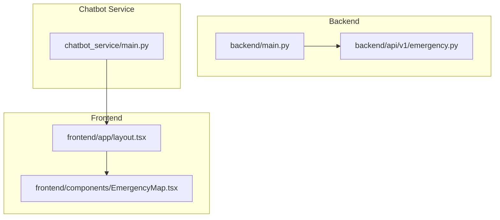
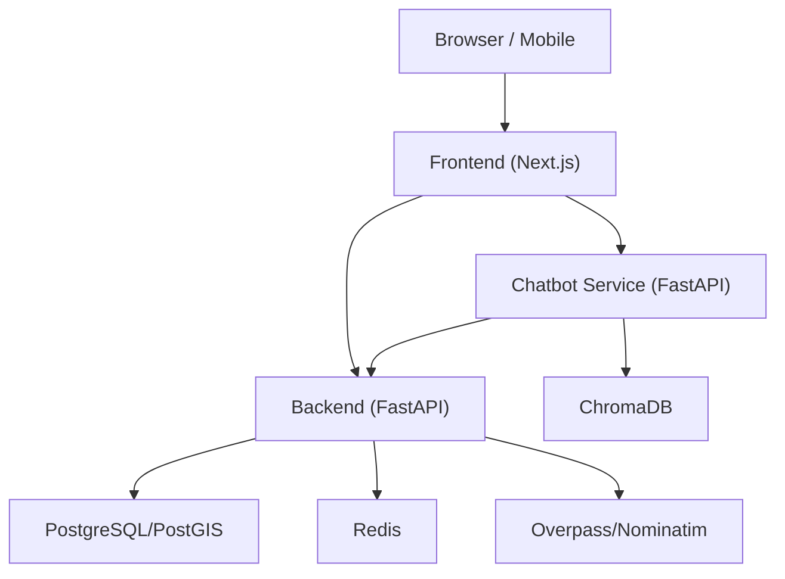
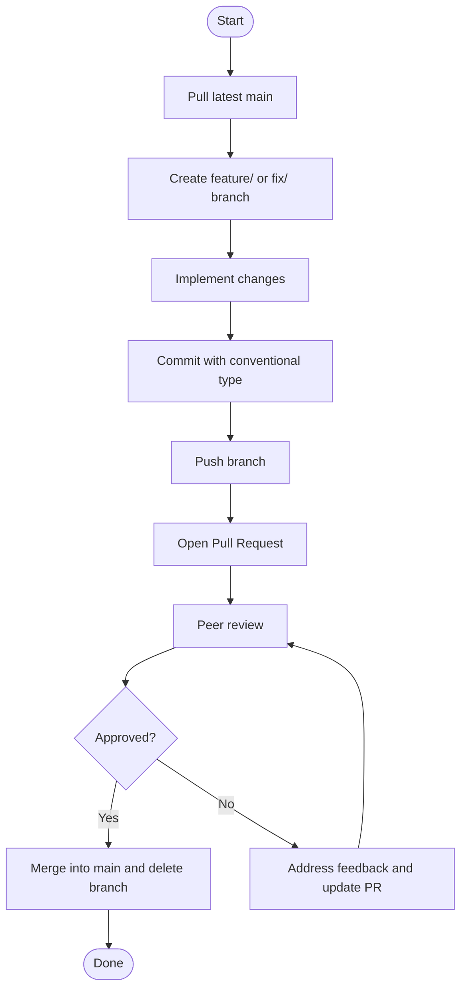
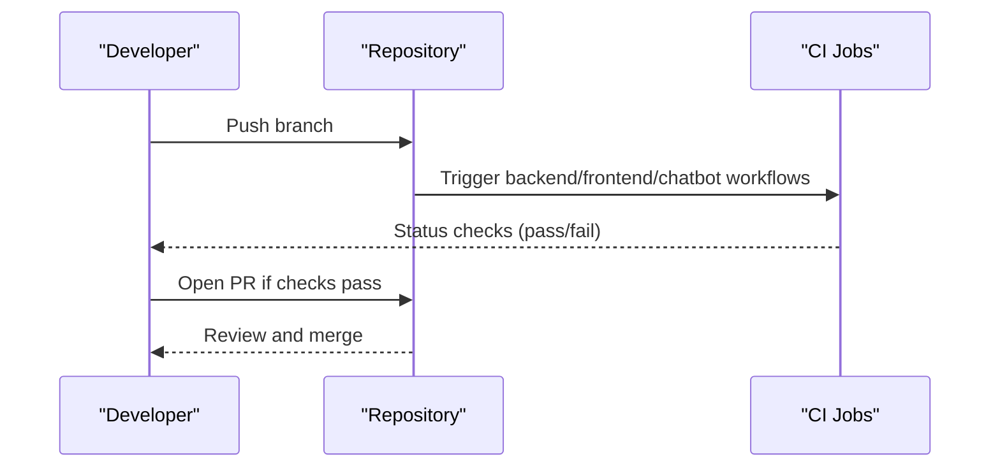
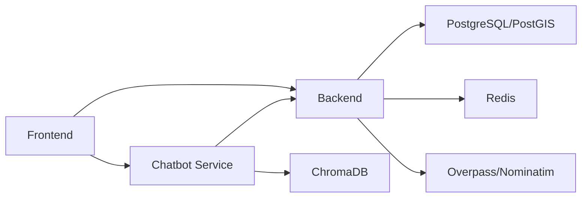

# Contributing Guidelines

<cite>
**Referenced Files in This Document**
- [README.md](https://github.com/SafeVixAI/SafeVixAI/blob/main/README.md)
- [SETUP.md](https://github.com/SafeVixAI/SafeVixAI/blob/main/SETUP.md)
- [docs/Contributing.md](https://github.com/SafeVixAI/SafeVixAI/blob/main/docs/Contributing.md)
- [chatbot_docs/Contributing.md](https://github.com/SafeVixAI/SafeVixAI/blob/main/chatbot_docs/Contributing.md)
- [DESIGN.md](https://github.com/SafeVixAI/SafeVixAI/blob/main/DESIGN.md)
- [.github/workflows/backend.yml](https://github.com/SafeVixAI/SafeVixAI/blob/main/.github/workflows/backend.yml)
- [.github/workflows/frontend.yml](https://github.com/SafeVixAI/SafeVixAI/blob/main/.github/workflows/frontend.yml)
- [.github/workflows/chatbot.yml](https://github.com/SafeVixAI/SafeVixAI/blob/main/.github/workflows/chatbot.yml)
- [backend/main.py](https://github.com/SafeVixAI/SafeVixAI/blob/main/backend/main.py)
- [backend/api/v1/emergency.py](https://github.com/SafeVixAI/SafeVixAI/blob/main/backend/api/v1/emergency.py)
- [frontend/app/layout.tsx](https://github.com/SafeVixAI/SafeVixAI/blob/main/frontend/app/layout.tsx)
- [frontend/components/EmergencyMap.tsx](https://github.com/SafeVixAI/SafeVixAI/blob/main/frontend/components/EmergencyMap.tsx)
- [chatbot_service/main.py](https://github.com/SafeVixAI/SafeVixAI/blob/main/chatbot_service/main.py)
- [backend/pytest.ini](https://github.com/SafeVixAI/SafeVixAI/blob/main/backend/pytest.ini)
- [frontend/jest.config.js](https://github.com/SafeVixAI/SafeVixAI/blob/main/frontend/jest.config.js)
</cite>

## Table of Contents
1. [Introduction](#introduction)
2. [Project Structure](#project-structure)
3. [Core Components](#core-components)
4. [Architecture Overview](#architecture-overview)
5. [Detailed Component Analysis](#detailed-component-analysis)
6. [Dependency Analysis](#dependency-analysis)
7. [Performance Considerations](#performance-considerations)
8. [Troubleshooting Guide](#troubleshooting-guide)
9. [Conclusion](#conclusion)
10. [Appendices](#appendices)

## Introduction
Thank you for contributing to SafeVixAI. This document defines the development workflow, code review process, team assignment structure, coding standards, commit message conventions, pull request procedures, testing requirements, quality gates, governance model, and collaboration practices. It is designed to be accessible to new contributors while establishing clear expectations for code quality and community participation.

## Project Structure
SafeVixAI is a multi-module project with three primary services and shared documentation:
- Backend API service (FastAPI, Python 3.11+, PostgreSQL/PostGIS, Redis, DuckDB)
- Chatbot Service (FastAPI, RAG, 9 LLM providers)
- Frontend (Next.js 15, React 19, TypeScript, PWA)
- Shared documentation and scripts

**Diagram sources**
- [backend/main.py:24-132](https://github.com/SafeVixAI/SafeVixAI/blob/main/backend/main.py#L24-L132)
- [backend/api/v1/emergency.py:12-83](https://github.com/SafeVixAI/SafeVixAI/blob/main/backend/api/v1/emergency.py#L12-L83)
- [chatbot_service/main.py:41-149](https://github.com/SafeVixAI/SafeVixAI/blob/main/chatbot_service/main.py#L41-L149)
- [frontend/app/layout.tsx:38-86](https://github.com/SafeVixAI/SafeVixAI/blob/main/frontend/app/layout.tsx#L38-L86)
- [frontend/components/EmergencyMap.tsx:25-58](https://github.com/SafeVixAI/SafeVixAI/blob/main/frontend/components/EmergencyMap.tsx#L25-L58)

**Section sources**
- [README.md:57-70](https://github.com/SafeVixAI/SafeVixAI/blob/main/README.md#L57-L70)
- [SETUP.md:41-221](https://github.com/SafeVixAI/SafeVixAI/blob/main/SETUP.md#L41-L221)

## Core Components
- Development workflow: feature branches, pull requests, peer review, and merging into main.
- Commit message format: type: short description using conventional types.
- Team assignments: module ownership to reduce conflicts and streamline reviews.
- Coding standards: PEP 8 for Python; TypeScript strict mode for frontend; type hints and Pydantic models.
- Testing requirements: run tests locally before opening a PR; CI enforces backend, frontend, and chatbot tests.
- Quality gates: CI jobs must pass; environment variables must remain secret; PR checklist enforced.

**Section sources**
- [docs/Contributing.md:16-105](https://github.com/SafeVixAI/SafeVixAI/blob/main/docs/Contributing.md#L16-L105)
- [docs/Contributing.md:108-174](https://github.com/SafeVixAI/SafeVixAI/blob/main/docs/Contributing.md#L108-L174)
- [docs/Contributing.md:177-197](https://github.com/SafeVixAI/SafeVixAI/blob/main/docs/Contributing.md#L177-L197)
- [.github/workflows/backend.yml:17-55](https://github.com/SafeVixAI/SafeVixAI/blob/main/.github/workflows/backend.yml#L17-L55)
- [.github/workflows/frontend.yml:17-43](https://github.com/SafeVixAI/SafeVixAI/blob/main/.github/workflows/frontend.yml#L17-L43)
- [.github/workflows/chatbot.yml:17-55](https://github.com/SafeVixAI/SafeVixAI/blob/main/.github/workflows/chatbot.yml#L17-L55)

## Architecture Overview
SafeVixAI follows a modular architecture with clear separation of concerns:
- Backend exposes REST APIs for emergency locator, routing, roadwatch, geocoding, and chatbot integration.
- Chatbot Service orchestrates RAG, tools, and LLM providers behind FastAPI endpoints.
- Frontend is a PWA with offline capabilities, using Next.js App Router, TypeScript, and MapLibre for maps.

**Diagram sources**
- [backend/main.py:65-128](https://github.com/SafeVixAI/SafeVixAI/blob/main/backend/main.py#L65-L128)
- [chatbot_service/main.py:94-145](https://github.com/SafeVixAI/SafeVixAI/blob/main/chatbot_service/main.py#L94-L145)
- [frontend/app/layout.tsx:38-86](https://github.com/SafeVixAI/SafeVixAI/blob/main/frontend/app/layout.tsx#L38-L86)

## Detailed Component Analysis

### Development Workflow and Pull Requests
- Branch strategy: feature/* and fix/* branches; always pull main first, then create your branch.
- Commit often with conventional commit types.
- Open a PR after review; do not merge your own PR.
- PR checklist: tests pass, no lint errors, offline compatibility for frontend features, no secrets committed, environment variables documented in examples.

**Section sources**
- [docs/Contributing.md:16-56](https://github.com/SafeVixAI/SafeVixAI/blob/main/docs/Contributing.md#L16-L56)
- [docs/Contributing.md:177-188](https://github.com/SafeVixAI/SafeVixAI/blob/main/docs/Contributing.md#L177-L188)

### Team Assignment Structure
- Modules and ownership:
  - Emergency Locator: backend emergency endpoints and frontend emergency page
  - AI Chatbot: backend chat endpoints and frontend chat page
  - Challan Calculator: backend challan endpoints and frontend challan page
  - Road Reporter: backend roadwatch endpoints and frontend report page
- Shared files: backend main, database; frontend layout and store require coordination.

**Section sources**
- [docs/Contributing.md:89-105](https://github.com/SafeVixAI/SafeVixAI/blob/main/docs/Contributing.md#L89-L105)

### Coding Standards
- Backend (Python)
  - PEP 8 style
  - async route handlers and DB calls
  - Pydantic models for request/response
  - Docstrings for all functions
  - Type hints everywhere
- Frontend (TypeScript)
  - Strict mode, no any
  - One component per file
  - PascalCase for components, camelCase for utilities
  - Use SWR for API calls

**Section sources**
- [docs/Contributing.md:108-154](https://github.com/SafeVixAI/SafeVixAI/blob/main/docs/Contributing.md#L108-L154)

### Commit Message Conventions
- Use conventional types: feat, fix, docs, refactor, test, chore, style.
- Examples: feat: add new endpoint, fix: SSR map rendering, docs: update API docs, test: add pytest suite.

**Section sources**
- [docs/Contributing.md:60-86](https://github.com/SafeVixAI/SafeVixAI/blob/main/docs/Contributing.md#L60-L86)

### Testing Requirements and Quality Gates
- Backend: pytest in backend/tests; CI job runs tests on push and PR.
- Frontend: ESLint and TypeScript validation; Jest configured for tests.
- Chatbot Service: pytest in chatbot_service/tests; CI job runs tests on push and PR.
- Quality gates:
  - Tests must pass locally before opening a PR.
  - No hardcoded secrets; keep .env and .env.local out of version control.
  - PR checklist includes environment variables in examples and comments for non-obvious code.

**Diagram sources**
- [.github/workflows/backend.yml:17-55](https://github.com/SafeVixAI/SafeVixAI/blob/main/.github/workflows/backend.yml#L17-L55)
- [.github/workflows/frontend.yml:17-43](https://github.com/SafeVixAI/SafeVixAI/blob/main/.github/workflows/frontend.yml#L17-L43)
- [.github/workflows/chatbot.yml:17-55](https://github.com/SafeVixAI/SafeVixAI/blob/main/.github/workflows/chatbot.yml#L17-L55)

**Section sources**
- [docs/Contributing.md:157-174](https://github.com/SafeVixAI/SafeVixAI/blob/main/docs/Contributing.md#L157-L174)
- [backend/pytest.ini:1-5](https://github.com/SafeVixAI/SafeVixAI/blob/main/backend/pytest.ini#L1-L5)
- [frontend/jest.config.js:1-16](https://github.com/SafeVixAI/SafeVixAI/blob/main/frontend/jest.config.js#L1-L16)

### Example Contribution Scenarios

#### Feature Development: Emergency Locator
- Backend: add a new endpoint under backend/api/v1/emergency.py and write tests in backend/tests/.
- Frontend: implement UI in frontend/app/emergency/page.tsx and ensure offline compatibility.
- PR: include rationale, test coverage, and environment variable updates in .env.example if applicable.

**Section sources**
- [backend/api/v1/emergency.py:19-76](https://github.com/SafeVixAI/SafeVixAI/blob/main/backend/api/v1/emergency.py#L19-L76)
- [docs/Contributing.md:177-188](https://github.com/SafeVixAI/SafeVixAI/blob/main/docs/Contributing.md#L177-L188)

#### Bug Fix: Map Rendering on SSR
- Identify the issue in frontend/components/EmergencyMap.tsx.
- Apply SSR-safe dynamic imports and add tests in frontend/tests/.
- Verify with npm run test and npm run lint.

**Section sources**
- [frontend/components/EmergencyMap.tsx:9-23](https://github.com/SafeVixAI/SafeVixAI/blob/main/frontend/components/EmergencyMap.tsx#L9-L23)
- [docs/Contributing.md:157-174](https://github.com/SafeVixAI/SafeVixAI/blob/main/docs/Contributing.md#L157-L174)

#### Documentation Contribution: Design System Updates
- Update DESIGN.md with new tokens or patterns.
- Reference the design philosophy and component specifications.
- Keep branding and color tokens consistent with existing definitions.

**Section sources**
- [DESIGN.md:13-30](https://github.com/SafeVixAI/SafeVixAI/blob/main/DESIGN.md#L13-L30)
- [DESIGN.md:33-100](https://github.com/SafeVixAI/SafeVixAI/blob/main/DESIGN.md#L33-L100)

### Chatbot Team Specifics
- Use chatbot/ feature branches.
- Assign ownership of providers/memory/API, RAG/agent/tools, voice UI/multilingual.
- Enforce peer review and avoid direct pushes.

**Section sources**
- [chatbot_docs/Contributing.md:5-22](https://github.com/SafeVixAI/SafeVixAI/blob/main/chatbot_docs/Contributing.md#L5-L22)

## Dependency Analysis
- Backend depends on database, Redis, Overpass/Nominatim, and integrates with the Chatbot Service.
- Frontend depends on backend and chatbot endpoints; uses MapLibre and SWR for offline-friendly UX.
- Chatbot Service depends on vector stores, LLM providers, and backend tools.

**Diagram sources**
- [backend/main.py:24-64](https://github.com/SafeVixAI/SafeVixAI/blob/main/backend/main.py#L24-L64)
- [chatbot_service/main.py:44-93](https://github.com/SafeVixAI/SafeVixAI/blob/main/chatbot_service/main.py#L44-L93)
- [frontend/app/layout.tsx:38-86](https://github.com/SafeVixAI/SafeVixAI/blob/main/frontend/app/layout.tsx#L38-L86)

**Section sources**
- [backend/main.py:24-132](https://github.com/SafeVixAI/SafeVixAI/blob/main/backend/main.py#L24-L132)
- [chatbot_service/main.py:41-149](https://github.com/SafeVixAI/SafeVixAI/blob/main/chatbot_service/main.py#L41-L149)
- [frontend/app/layout.tsx:38-86](https://github.com/SafeVixAI/SafeVixAI/blob/main/frontend/app/layout.tsx#L38-L86)

## Performance Considerations
- Favor async I/O in backend routes and services.
- Use caching (Redis) for frequently accessed data.
- Minimize heavy computations in frontend components; leverage SWR for efficient re-fetching.
- Keep environment variables out of bundles and avoid unnecessary network calls during SSR.

## Troubleshooting Guide
- Local setup issues: verify prerequisites, virtual environments, and environment variables.
- Backend health: check /health endpoint and ensure database and cache availability.
- Frontend SSR map issues: confirm dynamic imports and CSS imports for MapLibre.
- CI failures: address test failures locally before pushing; review CI logs for missing dependencies or environment variables.

**Section sources**
- [SETUP.md:316-342](https://github.com/SafeVixAI/SafeVixAI/blob/main/SETUP.md#L316-L342)
- [backend/main.py:103-125](https://github.com/SafeVixAI/SafeVixAI/blob/main/backend/main.py#L103-L125)
- [.github/workflows/backend.yml:47-54](https://github.com/SafeVixAI/SafeVixAI/blob/main/.github/workflows/backend.yml#L47-L54)
- [.github/workflows/frontend.yml:36-42](https://github.com/SafeVixAI/SafeVixAI/blob/main/.github/workflows/frontend.yml#L36-L42)

## Conclusion
By following this guide, contributors can collaborate effectively, maintain high code quality, and deliver impactful features across the backend, chatbot, and frontend. Adhering to the workflow, standards, and quality gates ensures a smooth development experience and reliable user outcomes.

## Appendices

### Communication Channels and Governance
- Use GitHub Issues for bugs and enhancements; label appropriately.
- Tag teammates in Issues and PRs using @username.
- Chatbot team follows separate assignment ownership and peer review rules.

**Section sources**
- [docs/Contributing.md:199-204](https://github.com/SafeVixAI/SafeVixAI/blob/main/docs/Contributing.md#L199-L204)
- [chatbot_docs/Contributing.md:5-22](https://github.com/SafeVixAI/SafeVixAI/blob/main/chatbot_docs/Contributing.md#L5-L22)