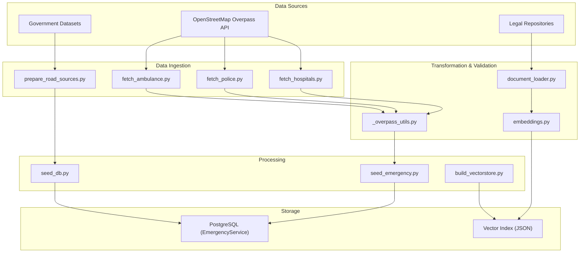
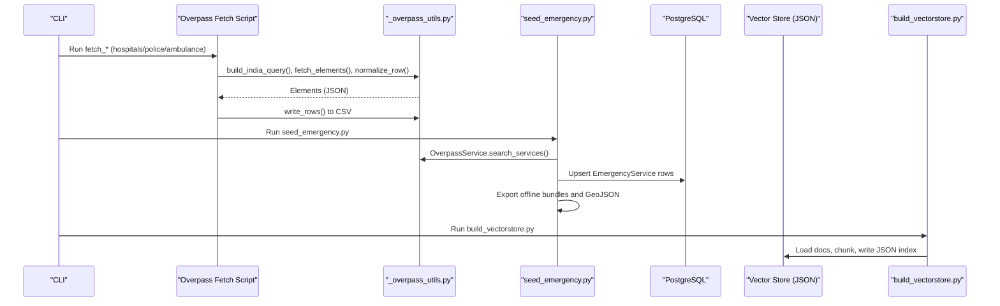
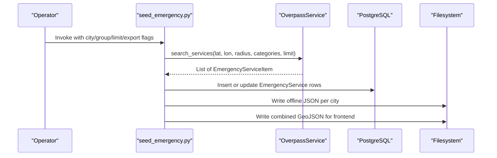
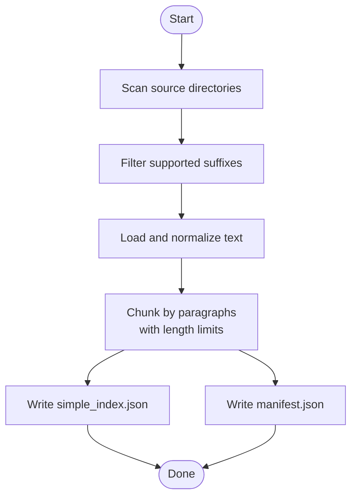
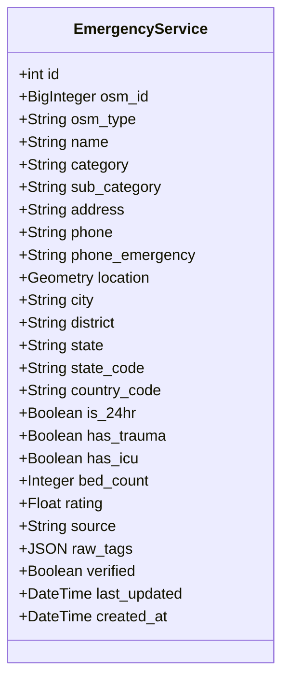
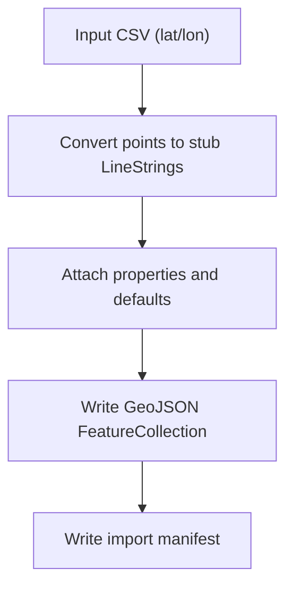
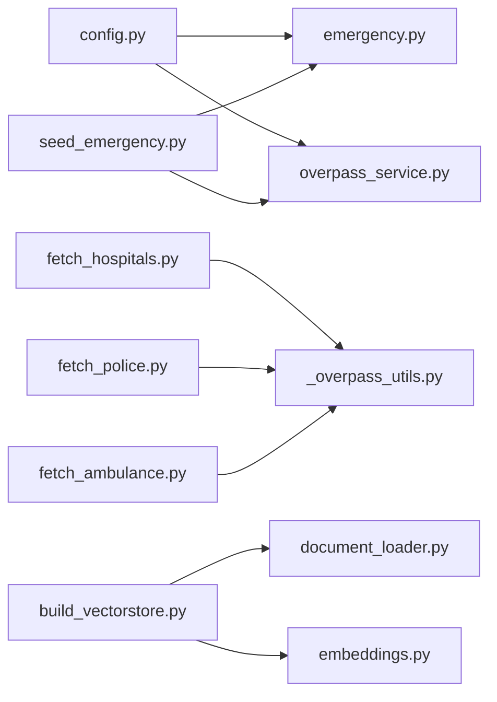

# Data Management

<cite>
**Referenced Files in This Document**
- [prepare_road_sources.py](file://backend/scripts/data/prepare_road_sources.py)
- [build_vectorstore.py](file://backend/scripts/app/build_vectorstore.py)
- [seed_db.py](file://backend/scripts/app/seed_db.py)
- [seed_emergency.py](file://backend/scripts/app/seed_emergency.py)
- [_overpass_utils.py](file://scripts/data/_overpass_utils.py)
- [fetch_hospitals.py](file://scripts/data/fetch_hospitals.py)
- [fetch_police.py](file://scripts/data/fetch_police.py)
- [fetch_ambulance.py](file://scripts/data/fetch_ambulance.py)
- [document_loader.py](file://chatbot_service/rag/document_loader.py)
- [embeddings.py](file://chatbot_service/rag/embeddings.py)
- [overpass_service.py](file://backend/services/overpass_service.py)
- [emergency.py](file://backend/models/emergency.py)
- [database.py](file://backend/core/database.py)
- [config.py](file://backend/core/config.py)
- [violations_seed.csv](file://chatbot_service/data/violations_seed.csv)
</cite>

## Table of Contents
1. [Introduction](#introduction)
2. [Project Structure](#project-structure)
3. [Core Components](#core-components)
4. [Architecture Overview](#architecture-overview)
5. [Detailed Component Analysis](#detailed-component-analysis)
6. [Dependency Analysis](#dependency-analysis)
7. [Performance Considerations](#performance-considerations)
8. [Troubleshooting Guide](#troubleshooting-guide)
9. [Conclusion](#conclusion)
10. [Appendices](#appendices)

## Introduction
This document explains the SafeVixAI data management system with a focus on the data pipeline and processing workflows. It covers how data is sourced from OpenStreetMap via the Overpass API, how government datasets are integrated, and how legal repositories are processed. It also documents transformation and validation steps, quality assurance workflows, vector store construction with a lightweight JSON index, and database population for emergency services. Additional topics include data seeding scripts, batch processing workflows, incremental updates, data governance and lineage, archival policies, privacy compliance, anonymization, and secure handling.

## Project Structure
The data management system spans multiple areas:
- Backend scripts for emergency seeding and vector store building
- Scripts for fetching emergency facilities from Overpass
- Overpass utilities for query composition and normalization
- RAG document loaders and embeddings utilities
- Database models and configuration for persistence
- Government dataset seeds and road infrastructure preparation

**Diagram sources**
- [fetch_hospitals.py:1-39](file://scripts/data/fetch_hospitals.py#L1-L39)
- [fetch_police.py:1-39](file://scripts/data/fetch_police.py#L1-L39)
- [fetch_ambulance.py:1-45](file://scripts/data/fetch_ambulance.py#L1-L45)
- [prepare_road_sources.py:1-195](file://backend/scripts/data/prepare_road_sources.py#L1-L195)
- [_overpass_utils.py:1-161](file://scripts/data/_overpass_utils.py#L1-L161)
- [document_loader.py:1-103](file://chatbot_service/rag/document_loader.py#L1-L103)
- [embeddings.py:1-31](file://chatbot_service/rag/embeddings.py#L1-L31)
- [seed_emergency.py:1-197](file://backend/scripts/app/seed_emergency.py#L1-L197)
- [seed_db.py:1-198](file://backend/scripts/app/seed_db.py#L1-L198)
- [build_vectorstore.py:1-178](file://backend/scripts/app/build_vectorstore.py#L1-L178)
- [emergency.py:1-45](file://backend/models/emergency.py#L1-L45)

**Section sources**
- [prepare_road_sources.py:1-195](file://backend/scripts/data/prepare_road_sources.py#L1-L195)
- [build_vectorstore.py:1-178](file://backend/scripts/app/build_vectorstore.py#L1-L178)
- [seed_db.py:1-198](file://backend/scripts/app/seed_db.py#L1-L198)
- [seed_emergency.py:1-197](file://backend/scripts/app/seed_emergency.py#L1-L197)
- [_overpass_utils.py:1-161](file://scripts/data/_overpass_utils.py#L1-L161)
- [fetch_hospitals.py:1-39](file://scripts/data/fetch_hospitals.py#L1-L39)
- [fetch_police.py:1-39](file://scripts/data/fetch_police.py#L1-L39)
- [fetch_ambulance.py:1-45](file://scripts/data/fetch_ambulance.py#L1-L45)
- [document_loader.py:1-103](file://chatbot_service/rag/document_loader.py#L1-L103)
- [embeddings.py:1-31](file://chatbot_service/rag/embeddings.py#L1-L31)
- [overpass_service.py:1-249](file://backend/services/overpass_service.py#L1-L249)
- [emergency.py:1-45](file://backend/models/emergency.py#L1-L45)
- [database.py:1-50](file://backend/core/database.py#L1-L50)
- [config.py:1-181](file://backend/core/config.py#L1-L181)

## Core Components
- Emergency data ingestion from Overpass:
  - Scripts fetch hospitals, police stations, and ambulance stations, normalize attributes, deduplicate, and write CSV outputs.
  - A higher-level orchestration script seeds emergency services into PostgreSQL, exports per-city offline bundles, and writes a combined GeoJSON for the frontend.
- Vector store building:
  - A lightweight JSON index is produced from legal and medical documents, with chunking and metadata.
- Database population:
  - Emergency services are upserted into the EmergencyService table with spatial indexing and structured attributes.
- Road infrastructure preparation:
  - Point-based road data is converted to LineString GeoJSON for import into the road infrastructure table.
- Configuration and connectivity:
  - Centralized settings define database URLs, Overpass endpoints, timeouts, and caching parameters.

**Section sources**
- [seed_emergency.py:1-197](file://backend/scripts/app/seed_emergency.py#L1-L197)
- [fetch_hospitals.py:1-39](file://scripts/data/fetch_hospitals.py#L1-L39)
- [fetch_police.py:1-39](file://scripts/data/fetch_police.py#L1-L39)
- [fetch_ambulance.py:1-45](file://scripts/data/fetch_ambulance.py#L1-L45)
- [_overpass_utils.py:1-161](file://scripts/data/_overpass_utils.py#L1-L161)
- [build_vectorstore.py:1-178](file://backend/scripts/app/build_vectorstore.py#L1-L178)
- [document_loader.py:1-103](file://chatbot_service/rag/document_loader.py#L1-L103)
- [embeddings.py:1-31](file://chatbot_service/rag/embeddings.py#L1-L31)
- [seed_db.py:1-198](file://backend/scripts/app/seed_db.py#L1-L198)
- [prepare_road_sources.py:1-195](file://backend/scripts/data/prepare_road_sources.py#L1-L195)
- [emergency.py:1-45](file://backend/models/emergency.py#L1-L45)
- [database.py:1-50](file://backend/core/database.py#L1-L50)
- [config.py:1-181](file://backend/core/config.py#L1-L181)

## Architecture Overview
The data pipeline integrates external APIs and repositories, transforms and validates data, persists it, and exposes it for downstream consumers.

**Diagram sources**
- [fetch_hospitals.py:1-39](file://scripts/data/fetch_hospitals.py#L1-L39)
- [fetch_police.py:1-39](file://scripts/data/fetch_police.py#L1-L39)
- [fetch_ambulance.py:1-45](file://scripts/data/fetch_ambulance.py#L1-L45)
- [_overpass_utils.py:1-161](file://scripts/data/_overpass_utils.py#L1-L161)
- [seed_emergency.py:1-197](file://backend/scripts/app/seed_emergency.py#L1-L197)
- [overpass_service.py:1-249](file://backend/services/overpass_service.py#L1-L249)
- [emergency.py:1-45](file://backend/models/emergency.py#L1-L45)
- [build_vectorstore.py:1-178](file://backend/scripts/app/build_vectorstore.py#L1-L178)
- [document_loader.py:1-103](file://chatbot_service/rag/document_loader.py#L1-L103)

## Detailed Component Analysis

### Emergency Service Data Ingestion from Overpass
- Purpose: Populate emergency facilities (hospitals, police, ambulances) for major Indian cities using Overpass API.
- Workflow:
  - Scripts compose queries for India-wide coverage, execute HTTP requests, parse JSON responses, normalize fields, deduplicate, and write CSV files.
  - A higher-level script orchestrates per-city seeding, upserts into the database, exports offline bundles, and produces a combined GeoJSON for the frontend.
- Quality assurance:
  - Deduplication by name/type/lat/lon.
  - Fallback names and robust extraction of coordinates from nodes or relation centers.
  - Sorting and limiting results per city.
- Incremental updates:
  - Upserts on unique identifiers preserve existing records and update changed fields.

**Diagram sources**
- [seed_emergency.py:1-197](file://backend/scripts/app/seed_emergency.py#L1-L197)
- [overpass_service.py:1-249](file://backend/services/overpass_service.py#L1-L249)
- [emergency.py:1-45](file://backend/models/emergency.py#L1-L45)

**Section sources**
- [fetch_hospitals.py:1-39](file://scripts/data/fetch_hospitals.py#L1-L39)
- [fetch_police.py:1-39](file://scripts/data/fetch_police.py#L1-L39)
- [fetch_ambulance.py:1-45](file://scripts/data/fetch_ambulance.py#L1-L45)
- [_overpass_utils.py:1-161](file://scripts/data/_overpass_utils.py#L1-L161)
- [seed_emergency.py:1-197](file://backend/scripts/app/seed_emergency.py#L1-L197)
- [overpass_service.py:1-249](file://backend/services/overpass_service.py#L1-L249)
- [emergency.py:1-45](file://backend/models/emergency.py#L1-L45)

### Vector Store Building with Lightweight JSON Index
- Purpose: Construct a searchable index from legal and medical documents for retrieval-augmented generation.
- Workflow:
  - Discover supported files (TXT, MD, CSV, JSON, PDF), normalize text, chunk by paragraphs with length limits, and write a JSON manifest and index.
  - Optionally mirror the index into the chatbot service directory.
- Validation:
  - Skips empty or unreadable files.
  - Limits per-file text and CSV rows to manage size and performance.
- Retrieval:
  - Embedding utilities provide tokenization and scoring helpers.

**Diagram sources**
- [build_vectorstore.py:1-178](file://backend/scripts/app/build_vectorstore.py#L1-L178)
- [document_loader.py:1-103](file://chatbot_service/rag/document_loader.py#L1-L103)
- [embeddings.py:1-31](file://chatbot_service/rag/embeddings.py#L1-L31)

**Section sources**
- [build_vectorstore.py:1-178](file://backend/scripts/app/build_vectorstore.py#L1-L178)
- [document_loader.py:1-103](file://chatbot_service/rag/document_loader.py#L1-L103)
- [embeddings.py:1-31](file://chatbot_service/rag/embeddings.py#L1-L31)

### Database Population for Emergency Services
- Purpose: Persist emergency facility records with spatial and categorical metadata.
- Schema highlights:
  - Unique identifiers, category/sub-category, contact info, 24-hour flag, trauma/ICU availability, ratings, and a POINT geometry column.
- Upsert strategy:
  - On conflict by unique identifier, update mutable fields while preserving immutable ones.
- Seeding:
  - A dedicated script seeds predefined city lists with structured attributes and timestamps.

**Diagram sources**
- [emergency.py:1-45](file://backend/models/emergency.py#L1-L45)

**Section sources**
- [seed_emergency.py:1-197](file://backend/scripts/app/seed_emergency.py#L1-L197)
- [seed_db.py:1-198](file://backend/scripts/app/seed_db.py#L1-L198)
- [emergency.py:1-45](file://backend/models/emergency.py#L1-L45)
- [database.py:1-50](file://backend/core/database.py#L1-L50)
- [config.py:1-181](file://backend/core/config.py#L1-L181)

### Road Infrastructure Preparation
- Purpose: Convert point-based road data into LineString GeoJSON suitable for importing into the road infrastructure table.
- Workflow:
  - Read CSVs containing lat/lon pairs, expand each point into a tiny LineString stub, and write FeatureCollections.
  - Generate a manifest for subsequent import scripts.

**Diagram sources**
- [prepare_road_sources.py:1-195](file://backend/scripts/data/prepare_road_sources.py#L1-L195)

**Section sources**
- [prepare_road_sources.py:1-195](file://backend/scripts/data/prepare_road_sources.py#L1-L195)

### Government Dataset Integration and Validation
- Purpose: Integrate government datasets (e.g., MoRTH blackspots, NHAI toll plazas) into the road infrastructure pipeline.
- Validation strategies:
  - Column detection and numeric validation for lat/lon.
  - Robustness against missing or malformed entries.
  - Default metadata for project source and data URLs.

**Section sources**
- [prepare_road_sources.py:1-195](file://backend/scripts/data/prepare_road_sources.py#L1-L195)

### Legal Repository Processing
- Purpose: Prepare legal and medical documents for RAG.
- Processing:
  - Loaders support TXT, MD, CSV, JSON, and PDF (optional dependency).
  - Normalize text, truncate by character and row limits, and derive categories from directory structure.
- Example dataset:
  - Traffic violation codes and penalties are included as a CSV seed.

**Section sources**
- [document_loader.py:1-103](file://chatbot_service/rag/document_loader.py#L1-L103)
- [violations_seed.csv:1-30](file://chatbot_service/data/violations_seed.csv#L1-L30)

## Dependency Analysis
- External dependencies:
  - Overpass API endpoints and fallbacks configured centrally.
  - Optional PDF parsing via PyPDF.
- Internal dependencies:
  - Scripts depend on shared Overpass utilities for query building and normalization.
  - Vector store builder depends on document loader and embedding utilities.
  - Emergency seeding depends on Overpass service and database models.

**Diagram sources**
- [config.py:1-181](file://backend/core/config.py#L1-L181)
- [database.py:1-50](file://backend/core/database.py#L1-L50)
- [overpass_service.py:1-249](file://backend/services/overpass_service.py#L1-L249)
- [fetch_hospitals.py:1-39](file://scripts/data/fetch_hospitals.py#L1-L39)
- [fetch_police.py:1-39](file://scripts/data/fetch_police.py#L1-L39)
- [fetch_ambulance.py:1-45](file://scripts/data/fetch_ambulance.py#L1-L45)
- [_overpass_utils.py:1-161](file://scripts/data/_overpass_utils.py#L1-L161)
- [seed_emergency.py:1-197](file://backend/scripts/app/seed_emergency.py#L1-L197)
- [emergency.py:1-45](file://backend/models/emergency.py#L1-L45)
- [build_vectorstore.py:1-178](file://backend/scripts/app/build_vectorstore.py#L1-L178)
- [document_loader.py:1-103](file://chatbot_service/rag/document_loader.py#L1-L103)
- [embeddings.py:1-31](file://chatbot_service/rag/embeddings.py#L1-L31)

**Section sources**
- [config.py:1-181](file://backend/core/config.py#L1-L181)
- [database.py:1-50](file://backend/core/database.py#L1-L50)
- [overpass_service.py:1-249](file://backend/services/overpass_service.py#L1-L249)
- [_overpass_utils.py:1-161](file://scripts/data/_overpass_utils.py#L1-L161)
- [document_loader.py:1-103](file://chatbot_service/rag/document_loader.py#L1-L103)
- [embeddings.py:1-31](file://chatbot_service/rag/embeddings.py#L1-L31)
- [seed_emergency.py:1-197](file://backend/scripts/app/seed_emergency.py#L1-L197)
- [emergency.py:1-45](file://backend/models/emergency.py#L1-L45)
- [build_vectorstore.py:1-178](file://backend/scripts/app/build_vectorstore.py#L1-L178)

## Performance Considerations
- Overpass queries:
  - Use appropriate timeouts and fallback endpoints to mitigate upstream failures.
  - Limit results per city and sort by relevance to reduce downstream processing.
- Vector store:
  - Cap text sizes and chunk sizes to balance recall and latency.
  - Prefer mirroring indices to shared directories for reuse across services.
- Database:
  - Asynchronous connections with tuned pool sizes and timeouts.
  - Upserts minimize write amplification for incremental updates.
- File processing:
  - Skip unreadable or empty files early; cap CSV rows to avoid oversized payloads.

[No sources needed since this section provides general guidance]

## Troubleshooting Guide
- Overpass API failures:
  - Verify endpoint configuration and fallbacks; confirm network reachability and timeouts.
  - Inspect last error messages when all endpoints fail.
- CSV normalization issues:
  - Ensure lat/lon columns exist and are numeric; review skipped rows.
- Vector store index empty:
  - Confirm source directories exist and contain supported files; check file permissions.
- Database connectivity:
  - Validate database URL normalization and credentials; confirm pool settings.
- PDF loading:
  - Install optional PDF dependencies if PDFs are part of the legal repository.

**Section sources**
- [_overpass_utils.py:70-87](file://scripts/data/_overpass_utils.py#L70-L87)
- [config.py:86-96](file://backend/core/config.py#L86-L96)
- [database.py:21-29](file://backend/core/database.py#L21-L29)
- [document_loader.py:84-93](file://chatbot_service/rag/document_loader.py#L84-L93)

## Conclusion
SafeVixAI’s data management system combines robust ingestion from OpenStreetMap, validated processing of government datasets, and efficient vector store construction. The pipeline emphasizes reliability, scalability, and maintainability through centralized configuration, modular scripts, and clear separation of concerns. Operators can seed emergency services, build local indices, and populate databases with confidence, while maintaining strong quality and governance practices.

[No sources needed since this section summarizes without analyzing specific files]

## Appendices

### Data Governance, Lineage Tracking, and Archival Policies
- Lineage:
  - Track provenance via source fields and metadata (e.g., Overpass, government sources).
  - Maintain manifests and logs for CSV/GeoJSON outputs.
- Archival:
  - Preserve raw CSVs and GeoJSONs alongside processed indices.
  - Version offline bundles and vector store artifacts.
- Retention:
  - Define retention windows for temporary artifacts and logs.

[No sources needed since this section provides general guidance]

### Privacy Compliance, Anonymization, and Secure Handling
- Privacy:
  - Avoid collecting personal health or identity data beyond what is publicly available in OSM tags.
  - Do not embed sensitive contact information in vector stores unless explicitly required.
- Anonymization:
  - Remove or redact personally identifiable information during preprocessing.
- Secure handling:
  - Restrict access to deployment environments and secrets.
  - Use HTTPS endpoints and validated certificates for external APIs.

[No sources needed since this section provides general guidance]

## HuggingFace Dataset Hub

SafeVixAI publishes its curated datasets on the **[HuggingFace Dataset Hub](https://huggingface.co/datasets/SafeVixAI/SafeVixAI-Dataset-Hub)** for research reproducibility and community collaboration. This includes:

- Emergency service coordinates for 25 Indian cities
- Motor Vehicle Act violation databases with state-specific overrides
- Road infrastructure GeoJSON datasets (PMGSY, NHAI, toll plazas)
- ChromaDB vector store training corpora (legal documents, first aid guides, WHO road safety data)

> **Note**: The HuggingFace Dataset Hub is a *data hosting* layer — models are served via WebLLM CDN and LLM providers (Groq, Gemini, etc.), not from HuggingFace model inference.