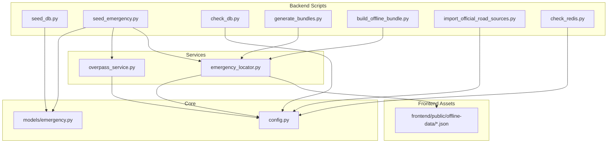
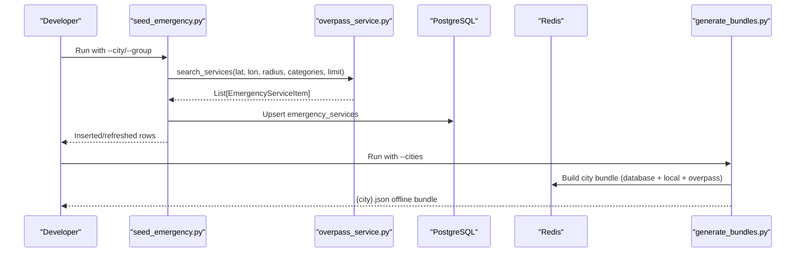
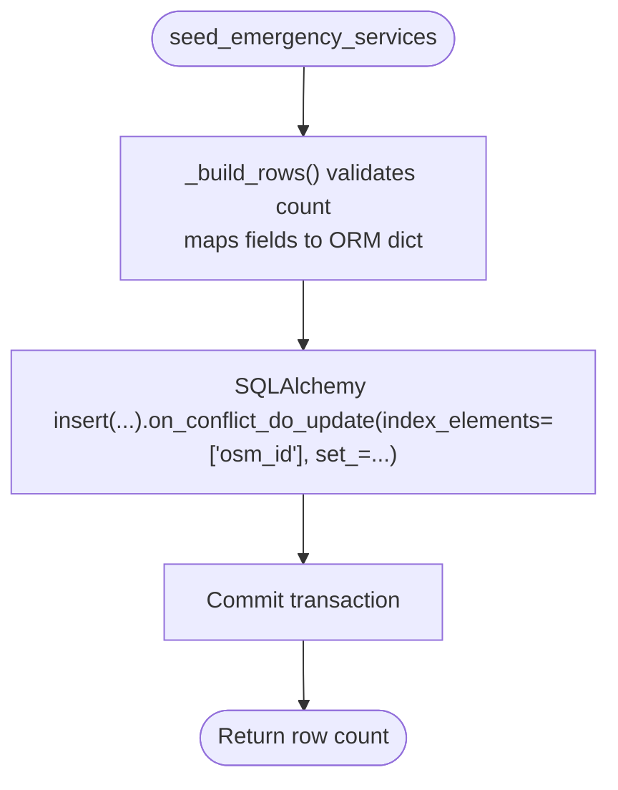
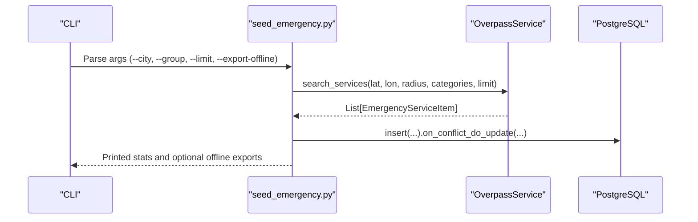
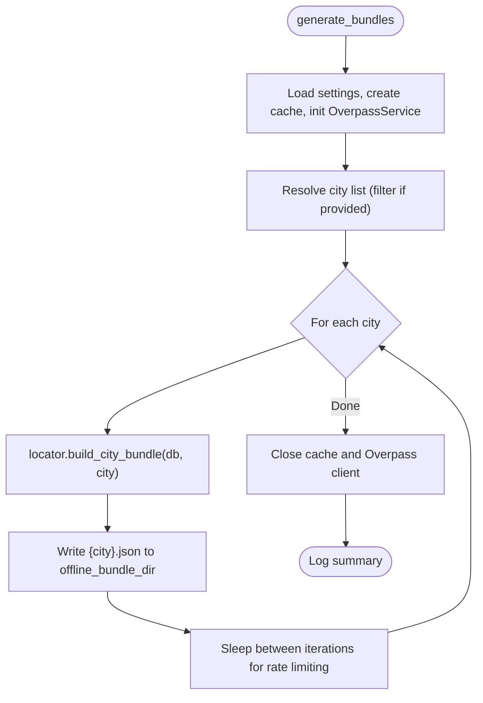
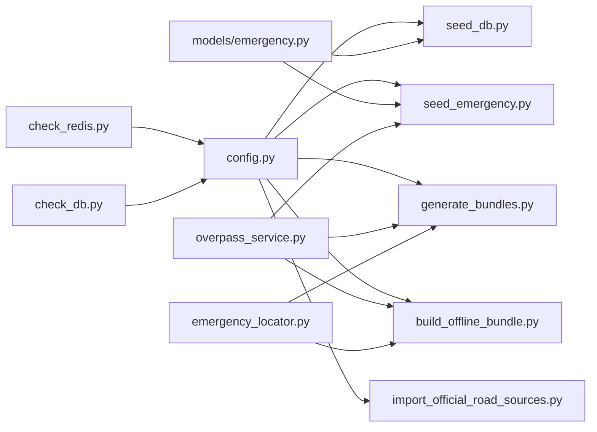

# Data Seeding Scripts

<cite>
**Referenced Files in This Document**
- [seed_db.py](file://backend/scripts/app/seed_db.py)
- [seed_emergency.py](file://backend/scripts/app/seed_emergency.py)
- [check_db.py](file://backend/scripts/app/check_db.py)
- [generate_bundles.py](file://backend/scripts/app/generate_bundles.py)
- [build_offline_bundle.py](file://backend/scripts/app/build_offline_bundle.py)
- [import_official_road_sources.py](file://backend/scripts/app/import_official_road_sources.py)
- [check_redis.py](file://backend/scripts/app/check_redis.py)
- [config.py](file://backend/core/config.py)
- [emergency.py](file://backend/models/emergency.py)
- [emergency_locator.py](file://backend/services/emergency_locator.py)
- [overpass_service.py](file://backend/services/overpass_service.py)
- [road_sources.example.json](file://backend/data/road_sources.example.json)
- [bootstrap_local_data.py](file://scripts/data/bootstrap_local_data.py)
- [seed_blackspots.py](file://scripts/data/seed_blackspots.py)
</cite>

## Table of Contents
1. [Introduction](#introduction)
2. [Project Structure](#project-structure)
3. [Core Components](#core-components)
4. [Architecture Overview](#architecture-overview)
5. [Detailed Component Analysis](#detailed-component-analysis)
6. [Dependency Analysis](#dependency-analysis)
7. [Performance Considerations](#performance-considerations)
8. [Troubleshooting Guide](#troubleshooting-guide)
9. [Conclusion](#conclusion)
10. [Appendices](#appendices)

## Introduction
This document explains the data seeding and initialization scripts that bootstrap the SafeVixAI system. It covers:
- Emergency service population via curated seed data and live OpenStreetMap queries
- User data initialization patterns and system configuration setup
- Offline bundle generation for Progressive Web App (PWA) functionality
- Validation and automation scripts for robust bootstrapping across local development and production environments
- Guidance on customizing seed data, extending data sources, and automating refresh cycles

## Project Structure
The data seeding ecosystem spans backend scripts, services, models, and frontend assets:
- Backend scripts orchestrate database seeding, bundle generation, and validation
- Services integrate with Overpass API and local catalogs
- Models define the emergency services schema
- Frontend consumes offline bundles and emergency GeoJSON
- Scripts in the root area prepare local datasets and build cross-service assets

**Diagram sources**
- [seed_db.py:1-198](file://backend/scripts/app/seed_db.py#L1-L198)
- [seed_emergency.py:1-197](file://backend/scripts/app/seed_emergency.py#L1-L197)
- [check_db.py:1-31](file://backend/scripts/app/check_db.py#L1-L31)
- [generate_bundles.py:1-84](file://backend/scripts/app/generate_bundles.py#L1-L84)
- [build_offline_bundle.py:1-51](file://backend/scripts/app/build_offline_bundle.py#L1-L51)
- [import_official_road_sources.py:1-152](file://backend/scripts/app/import_official_road_sources.py#L1-L152)
- [check_redis.py:1-38](file://backend/scripts/app/check_redis.py#L1-L38)
- [config.py:1-181](file://backend/core/config.py#L1-L181)
- [emergency.py:1-45](file://backend/models/emergency.py#L1-L45)
- [emergency_locator.py:1-507](file://backend/services/emergency_locator.py#L1-L507)
- [overpass_service.py:1-249](file://backend/services/overpass_service.py#L1-L249)

**Section sources**
- [seed_db.py:1-198](file://backend/scripts/app/seed_db.py#L1-L198)
- [seed_emergency.py:1-197](file://backend/scripts/app/seed_emergency.py#L1-L197)
- [generate_bundles.py:1-84](file://backend/scripts/app/generate_bundles.py#L1-L84)
- [build_offline_bundle.py:1-51](file://backend/scripts/app/build_offline_bundle.py#L1-L51)
- [emergency_locator.py:1-507](file://backend/services/emergency_locator.py#L1-L507)
- [overpass_service.py:1-249](file://backend/services/overpass_service.py#L1-L249)
- [config.py:1-181](file://backend/core/config.py#L1-L181)

## Core Components
- Seed database script: Inserts curated emergency services into the database with upsert semantics and structured metadata.
- Emergency seeding script: Fetches live emergency services from Overpass API, normalizes and upserts them, and optionally exports offline bundles and GeoJSON.
- Bundle generation automation: Builds offline city bundles for PWA consumption, with filtering and rate-limiting safeguards.
- Database and Redis checks: Validates connectivity and table presence for quick bootstrap verification.
- Official road data importer: Downloads and normalizes government road datasets using a manifest file.
- Configuration: Centralized settings for database, caching, timeouts, and offline bundle directories.

**Section sources**
- [seed_db.py:147-198](file://backend/scripts/app/seed_db.py#L147-L198)
- [seed_emergency.py:70-197](file://backend/scripts/app/seed_emergency.py#L70-L197)
- [generate_bundles.py:16-84](file://backend/scripts/app/generate_bundles.py#L16-L84)
- [check_db.py:8-31](file://backend/scripts/app/check_db.py#L8-L31)
- [check_redis.py:7-38](file://backend/scripts/app/check_redis.py#L7-L38)
- [import_official_road_sources.py:120-152](file://backend/scripts/app/import_official_road_sources.py#L120-L152)
- [config.py:11-181](file://backend/core/config.py#L11-L181)

## Architecture Overview
The seeding workflow integrates three primary paths:
- Curated seed insertion: Fast, deterministic baseline for key cities
- Live Overpass ingestion: Dynamic sourcing of emergency services around city centers
- Offline bundle assembly: Aggregation of database, local catalog, and Overpass fallback into city-specific JSON bundles for PWA

**Diagram sources**
- [seed_emergency.py:70-150](file://backend/scripts/app/seed_emergency.py#L70-L150)
- [overpass_service.py:35-79](file://backend/services/overpass_service.py#L35-L79)
- [generate_bundles.py:16-69](file://backend/scripts/app/generate_bundles.py#L16-L69)

## Detailed Component Analysis

### Emergency Service Seeding (seed_db.py)
Purpose:
- Populate emergency services for major Indian metro cities using curated seed data
- Upsert records with conflict resolution on osm_id
- Attach structured metadata for downstream categorization and display

Key behaviors:
- Validates seed row count and raises on mismatch
- Converts coordinates to PostGIS POINT geometry
- Sets standardized fields including category, sub-category, ratings, and availability flags
- Uses SQLAlchemy insert with on-conflict update for idempotent seeding

**Diagram sources**
- [seed_db.py:88-182](file://backend/scripts/app/seed_db.py#L88-L182)

**Section sources**
- [seed_db.py:34-182](file://backend/scripts/app/seed_db.py#L34-L182)
- [emergency.py:12-45](file://backend/models/emergency.py#L12-L45)

### Live Emergency Seeding (seed_emergency.py)
Purpose:
- Seed emergency services from Overpass API for a configurable set of cities or groups
- Export per-city offline JSON and/or a combined GeoJSON for frontend

Key behaviors:
- Accepts city filters and predefined city groups
- Queries Overpass for amenities and related tags, classifies categories, computes distances
- Upserts into the database with conflict resolution on osm_id
- Optionally writes offline JSON and GeoJSON FeatureCollection

**Diagram sources**
- [seed_emergency.py:152-197](file://backend/scripts/app/seed_emergency.py#L152-L197)
- [overpass_service.py:35-79](file://backend/services/overpass_service.py#L35-L79)

**Section sources**
- [seed_emergency.py:19-197](file://backend/scripts/app/seed_emergency.py#L19-L197)
- [overpass_service.py:24-135](file://backend/services/overpass_service.py#L24-L135)

### Offline Bundle Generation (generate_bundles.py)
Purpose:
- Generate city-specific offline bundles for PWA by combining database, local catalog, and Overpass fallback
- Respect rate limits and support filtering by city list

Key behaviors:
- Creates output directories if missing
- Iterates over offline city centers, builds bundles, and writes JSON files
- Logs success/error per city and closes resources cleanly

**Diagram sources**
- [generate_bundles.py:16-84](file://backend/scripts/app/generate_bundles.py#L16-L84)
- [emergency_locator.py:241-299](file://backend/services/emergency_locator.py#L241-L299)

**Section sources**
- [generate_bundles.py:16-84](file://backend/scripts/app/generate_bundles.py#L16-L84)
- [emergency_locator.py:241-299](file://backend/services/emergency_locator.py#L241-L299)

### Offline Bundle Builder (build_offline_bundle.py)
Purpose:
- Build offline bundles from the current database state for selected cities or groups

Key behaviors:
- Accepts city arguments and group selections
- Delegates to EmergencyLocatorService to assemble and persist bundles

**Section sources**
- [build_offline_bundle.py:14-47](file://backend/scripts/app/build_offline_bundle.py#L14-L47)
- [emergency_locator.py:241-299](file://backend/services/emergency_locator.py#L241-L299)

### Database and Redis Validation (check_db.py, check_redis.py)
Purpose:
- Verify database connectivity and table presence
- Verify Redis connectivity, TLS handling, and basic operations

Key behaviors:
- Asynchronous connection checks
- Printouts for tables and row counts
- Ping/set/get operations and memory info retrieval

**Section sources**
- [check_db.py:8-31](file://backend/scripts/app/check_db.py#L8-L31)
- [check_redis.py:7-38](file://backend/scripts/app/check_redis.py#L7-L38)

### Official Road Data Import (import_official_road_sources.py)
Purpose:
- Download and import official road datasets using a manifest file
- Normalize records, enforce global uniqueness, and batch-import into the database

Key behaviors:
- Supports URLs and local paths, API keys via environment variables
- Handles ZIP extraction and member selection
- Normalizes records with defaults and prefixes road IDs for uniqueness

**Section sources**
- [import_official_road_sources.py:21-152](file://backend/scripts/app/import_official_road_sources.py#L21-L152)
- [road_sources.example.json:1-69](file://backend/data/road_sources.example.json#L1-L69)

### Configuration (config.py)
Purpose:
- Centralize environment-driven settings for database, caches, timeouts, and offline bundle directories

Key behaviors:
- Normalizes database URLs and supports asyncpg dialect
- Provides offline bundle directory with normalization
- Exposes lists for Overpass URLs and emergency radius steps

**Section sources**
- [config.py:11-181](file://backend/core/config.py#L11-L181)

### Emergency Locator and Overpass Integration
Purpose:
- Provide radius-based queries, merge database, local catalog, and Overpass results
- Compute distances, sort by priority, and assemble offline bundles

Key behaviors:
- City center definitions and offline city sets
- Radius steps and minimum result thresholds
- Merge logic to avoid duplicates across sources

**Section sources**
- [emergency_locator.py:39-115](file://backend/services/emergency_locator.py#L39-L115)
- [emergency_locator.py:187-374](file://backend/services/emergency_locator.py#L187-L374)
- [emergency_locator.py:375-422](file://backend/services/emergency_locator.py#L375-L422)
- [overpass_service.py:136-249](file://backend/services/overpass_service.py#L136-L249)

### Local Data Bootstrap (scripts/data/bootstrap_local_data.py)
Purpose:
- Synchronize and export local assets for chatbot and frontend, including:
  - Challan rules and state overrides
  - First aid bundle
  - Emergency GeoJSON
  - National highways CSV
  - Optional PMGSY GeoJSON export

Key behaviors:
- Loads backend modules dynamically for shared logic
- Computes nearest city for entries and writes GeoJSON features
- Writes CSVs to both backend and frontend offline directories

**Section sources**
- [bootstrap_local_data.py:1-557](file://scripts/data/bootstrap_local_data.py#L1-L557)

### Blackspot Seeding (scripts/data/seed_blackspots.py)
Purpose:
- Normalize accident CSVs into a blackspot preview CSV and GeoJSON for offline mapping

Key behaviors:
- Discover CSVs recursively, normalize fields, compute severity scores
- Write CSV and GeoJSON outputs with consistent structure

**Section sources**
- [seed_blackspots.py:160-190](file://scripts/data/seed_blackspots.py#L160-L190)

## Dependency Analysis
High-level dependencies among key components:

**Diagram sources**
- [config.py:11-181](file://backend/core/config.py#L11-L181)
- [seed_db.py:1-30](file://backend/scripts/app/seed_db.py#L1-L30)
- [seed_emergency.py:1-20](file://backend/scripts/app/seed_emergency.py#L1-L20)
- [generate_bundles.py:4-8](file://backend/scripts/app/generate_bundles.py#L4-L8)
- [build_offline_bundle.py:6-11](file://backend/scripts/app/build_offline_bundle.py#L6-L11)
- [import_official_road_sources.py:13-18](file://backend/scripts/app/import_official_road_sources.py#L13-L18)
- [emergency.py:1-10](file://backend/models/emergency.py#L1-L10)
- [overpass_service.py:9-11](file://backend/services/overpass_service.py#L9-L11)
- [emergency_locator.py:12-25](file://backend/services/emergency_locator.py#L12-L25)
- [check_redis.py:7-16](file://backend/scripts/app/check_redis.py#L7-L16)
- [check_db.py:8-10](file://backend/scripts/app/check_db.py#L8-L10)

**Section sources**
- [config.py:11-181](file://backend/core/config.py#L11-L181)
- [seed_db.py:1-30](file://backend/scripts/app/seed_db.py#L1-L30)
- [seed_emergency.py:1-20](file://backend/scripts/app/seed_emergency.py#L1-L20)
- [generate_bundles.py:4-8](file://backend/scripts/app/generate_bundles.py#L4-L8)
- [build_offline_bundle.py:6-11](file://backend/scripts/app/build_offline_bundle.py#L6-L11)
- [import_official_road_sources.py:13-18](file://backend/scripts/app/import_official_road_sources.py#L13-L18)
- [emergency.py:1-10](file://backend/models/emergency.py#L1-L10)
- [overpass_service.py:9-11](file://backend/services/overpass_service.py#L9-L11)
- [emergency_locator.py:12-25](file://backend/services/emergency_locator.py#L12-L25)
- [check_redis.py:7-16](file://backend/scripts/app/check_redis.py#L7-L16)
- [check_db.py:8-10](file://backend/scripts/app/check_db.py#L8-L10)

## Performance Considerations
- Database pooling and timeouts: Tune pool size and timeouts for concurrent operations during bulk inserts and bundle generation.
- Overpass rate limiting: Respect upstream limits; the generator includes sleeps between cities.
- Caching: Use Redis TTL settings to balance freshness and performance for emergency queries.
- Indexing: Ensure spatial and categorical indexes are present for fast radius queries.
- Batch sizes: Prefer upsert with server-side conflict resolution to minimize round trips.

[No sources needed since this section provides general guidance]

## Troubleshooting Guide
Common issues and remedies:
- Database connectivity failures:
  - Verify DATABASE_URL normalization and asyncpg dialect
  - Use check_db.py to list tables and row counts
- Redis connectivity and TLS:
  - Ensure REDIS_URL uses rediss:// for managed services
  - Use check_redis.py to validate ping/set/get and memory info
- Overpass API errors:
  - Confirm OVERPASS_URLS and request timeouts
  - Monitor retry attempts and fallback behavior
- Missing offline bundles:
  - Confirm offline_bundle_dir exists and is writable
  - Re-run generate_bundles.py with city filters if needed
- Data import errors:
  - Validate manifest file and API keys
  - Inspect extracted members and record normalization logs

**Section sources**
- [check_db.py:8-31](file://backend/scripts/app/check_db.py#L8-L31)
- [check_redis.py:7-38](file://backend/scripts/app/check_redis.py#L7-L38)
- [config.py:86-108](file://backend/core/config.py#L86-L108)
- [overpass_service.py:123-135](file://backend/services/overpass_service.py#L123-L135)
- [generate_bundles.py:16-84](file://backend/scripts/app/generate_bundles.py#L16-L84)
- [import_official_road_sources.py:120-152](file://backend/scripts/app/import_official_road_sources.py#L120-L152)

## Conclusion
The SafeVixAI data seeding pipeline combines curated baseline data, dynamic Overpass ingestion, and offline bundle generation to deliver a robust, production-ready system. Scripts are designed for idempotency, resilience, and easy automation across environments. Extending data sources and customizing seed data is straightforward through the provided manifests and argument-driven workflows.

[No sources needed since this section summarizes without analyzing specific files]

## Appendices

### Environment Variables and Settings
- DATABASE_URL: PostgreSQL connection string (normalized to asyncpg)
- REDIS_URL: Redis connection string (TLS handled automatically)
- CORS_ORIGINS: Comma-separated origins or wildcard
- OVERPASS_URLS: Comma-separated Overpass endpoints
- EMERGENCY_RADIUS_STEPS: Comma-separated radius steps for emergency queries
- DATA_GOV_API_KEY: API key for official data sources (when applicable)
- HTTP_USER_AGENT and REQUEST_TIMEOUT_SECONDS: Control upstream requests
- OFFLINE_BUNDLE_DIR: Directory for generated offline bundles

**Section sources**
- [config.py:19-108](file://backend/core/config.py#L19-L108)
- [config.py:143-169](file://backend/core/config.py#L143-L169)

### Example Workflows

- Seed emergency services for selected cities:
  - Run the emergency seeding script with city filters or predefined groups
  - Optionally export offline JSON and combined GeoJSON

- Generate offline bundles for PWA:
  - Use the bundle generation script with optional city filters
  - Validate output in the offline bundle directory

- Validate environment:
  - Run database and Redis checks to confirm connectivity and configuration

- Import official road data:
  - Prepare a manifest file and run the importer with optional API keys

**Section sources**
- [seed_emergency.py:152-197](file://backend/scripts/app/seed_emergency.py#L152-L197)
- [generate_bundles.py:70-84](file://backend/scripts/app/generate_bundles.py#L70-L84)
- [check_db.py:8-31](file://backend/scripts/app/check_db.py#L8-L31)
- [check_redis.py:7-38](file://backend/scripts/app/check_redis.py#L7-L38)
- [import_official_road_sources.py:120-152](file://backend/scripts/app/import_official_road_sources.py#L120-L152)