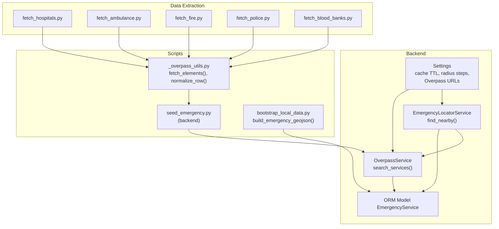
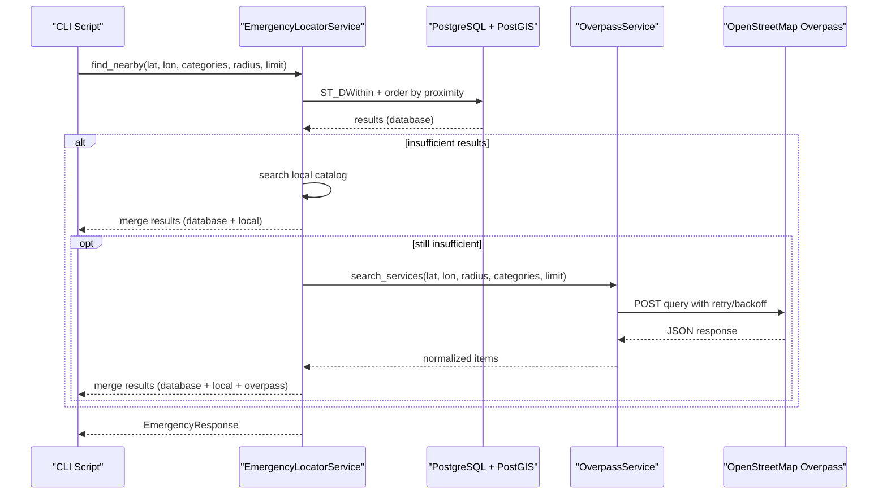
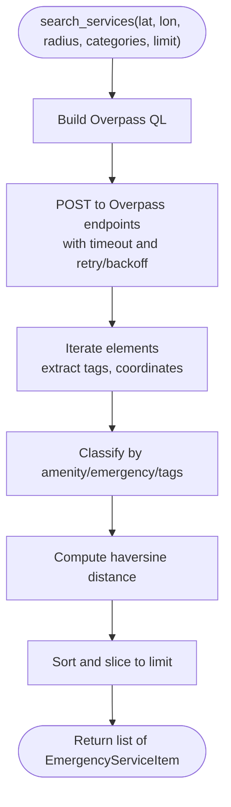
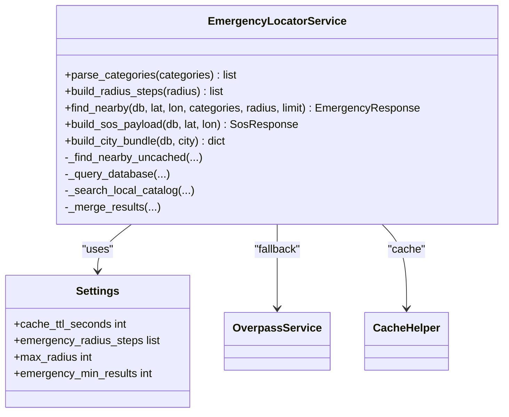
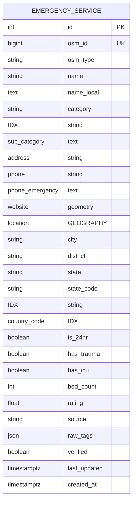
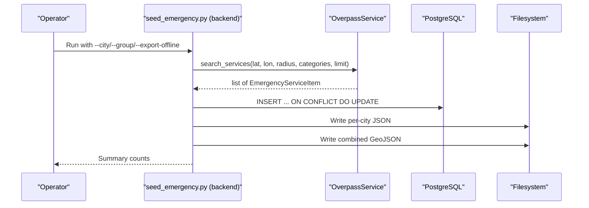
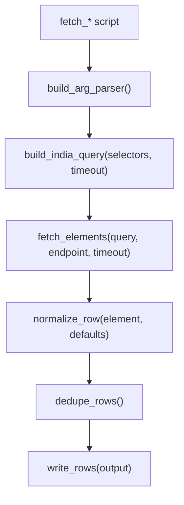
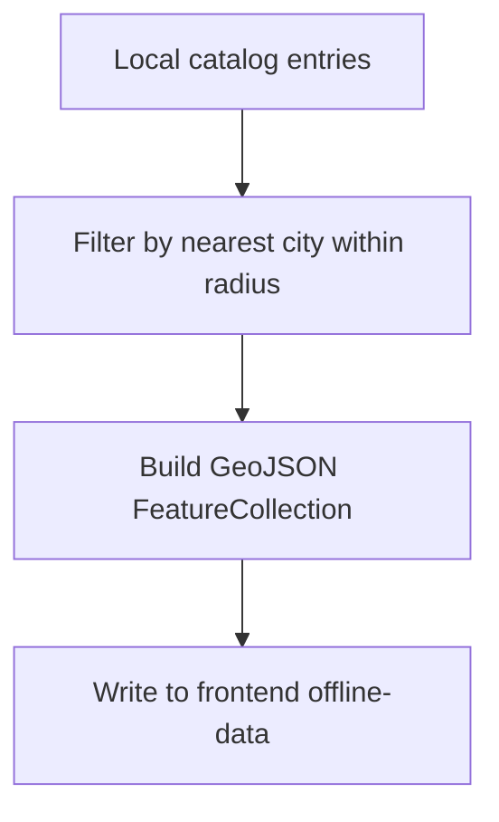

# Emergency Data Pipeline

<cite>
**Referenced Files in This Document**
- [overpass_service.py](file://backend/services/overpass_service.py)
- [emergency_locator.py](file://backend/services/emergency_locator.py)
- [seed_emergency.py](file://backend/scripts/app/seed_emergency.py)
- [seed_emergency.py](file://scripts/app/seed_emergency.py)
- [seed_emergency.py](file://chatbot_service/scripts/app/seed_emergency.py)
- [_overpass_utils.py](file://scripts/data/_overpass_utils.py)
- [fetch_hospitals.py](file://scripts/data/fetch_hospitals.py)
- [fetch_ambulance.py](file://scripts/data/fetch_ambulance.py)
- [fetch_fire.py](file://scripts/data/fetch_fire.py)
- [fetch_police.py](file://scripts/data/fetch_police.py)
- [fetch_blood_banks.py](file://scripts/data/fetch_blood_banks.py)
- [config.py](file://backend/core/config.py)
- [emergency.py](file://backend/models/emergency.py)
- [schemas.py](file://backend/models/schemas.py)
- [bootstrap_local_data.py](file://scripts/data/bootstrap_local_data.py)
</cite>

## Table of Contents
1. [Introduction](#introduction)
2. [Project Structure](#project-structure)
3. [Core Components](#core-components)
4. [Architecture Overview](#architecture-overview)
5. [Detailed Component Analysis](#detailed-component-analysis)
6. [Dependency Analysis](#dependency-analysis)
7. [Performance Considerations](#performance-considerations)
8. [Troubleshooting Guide](#troubleshooting-guide)
9. [Conclusion](#conclusion)
10. [Appendices](#appendices)

## Introduction
This document explains the emergency data pipeline that ingests and processes emergency service data from multiple sources, with a focus on OpenStreetMap Overpass API integration. It covers data extraction workflows, normalization and quality assurance, spatial indexing, emergency service seeding scripts, transformation patterns, error handling and retries, data freshness and caching, and troubleshooting guidance for rate limits, network failures, and data inconsistencies.

## Project Structure
The emergency pipeline spans backend services, scripts, and data utilities:
- Backend ingestion and serving: Overpass integration, emergency locator, and ORM models
- Scripts for bulk seeding and offline bundling
- Standalone data extraction scripts for hospitals, ambulances, fire stations, police stations, and blood banks
- Configuration for timeouts, retries, caches, and Overpass endpoints
- Bootstrap utilities to build offline GeoJSON bundles



**Diagram sources**
- [overpass_service.py:35-78](file://backend/services/overpass_service.py#L35-L78)
- [emergency_locator.py:187-373](file://backend/services/emergency_locator.py#L187-L373)
- [seed_emergency.py:70-149](file://backend/scripts/app/seed_emergency.py#L70-L149)
- [_overpass_utils.py:71-132](file://scripts/data/_overpass_utils.py#L71-L132)
- [bootstrap_local_data.py:126-165](file://scripts/data/bootstrap_local_data.py#L126-L165)
- [config.py:26-108](file://backend/core/config.py#L26-L108)

**Section sources**
- [overpass_service.py:1-249](file://backend/services/overpass_service.py#L1-L249)
- [emergency_locator.py:1-507](file://backend/services/emergency_locator.py#L1-L507)
- [seed_emergency.py:1-197](file://backend/scripts/app/seed_emergency.py#L1-L197)
- [_overpass_utils.py:1-161](file://scripts/data/_overpass_utils.py#L1-L161)
- [bootstrap_local_data.py:1-557](file://scripts/data/bootstrap_local_data.py#L1-L557)
- [config.py:1-181](file://backend/core/config.py#L1-L181)

## Core Components
- OverpassService: Builds Overpass queries, executes them against multiple endpoints, parses JSON responses, extracts coordinates, normalizes attributes, and sorts results by proximity and service characteristics.
- EmergencyLocatorService: Implements a layered search strategy (database → local catalog → Overpass fallback), merges results, applies deduplication, and caches responses.
- EmergencyService ORM model: Defines the persistent schema with spatial indexing on POINT geometry and indexed fields for fast lookups.
- Seed scripts: Bulk ingestion of emergency services per city, upserting into the database and exporting offline GeoJSON bundles.
- Data extraction scripts: Standalone utilities to fetch hospitals, ambulances, fire stations, police stations, and blood banks from Overpass and write normalized CSV outputs.
- Configuration: Centralized settings for timeouts, retries, cache TTL, radius steps, and Overpass endpoints.

**Section sources**
- [overpass_service.py:24-249](file://backend/services/overpass_service.py#L24-L249)
- [emergency_locator.py:161-507](file://backend/services/emergency_locator.py#L161-L507)
- [emergency.py:12-45](file://backend/models/emergency.py#L12-L45)
- [seed_emergency.py:70-149](file://backend/scripts/app/seed_emergency.py#L70-L149)
- [_overpass_utils.py:59-161](file://scripts/data/_overpass_utils.py#L59-L161)
- [config.py:26-108](file://backend/core/config.py#L26-L108)

## Architecture Overview
The pipeline integrates three primary data sources:
- Database: Persisted emergency services with spatial indexing
- Local catalog: Static CSV-based emergency entries for offline-first experiences
- Overpass API: Real-time OSM data fetched via robust retry logic



**Diagram sources**
- [emergency_locator.py:187-373](file://backend/services/emergency_locator.py#L187-L373)
- [overpass_service.py:123-134](file://backend/services/overpass_service.py#L123-L134)
- [emergency.py:26-29](file://backend/models/emergency.py#L26-L29)

## Detailed Component Analysis

### OverpassService: OpenStreetMap Integration
- Query building: Generates Overpass QL queries for amenities, emergency facilities, and related services around a center point.
- Execution: Sends POST requests to configured Overpass endpoints with timeouts and retry/backoff.
- Parsing: Extracts coordinates from nodes or relation centers, normalizes tags into service attributes, and computes distances.
- Classification: Categorizes elements into hospital, police, fire, pharmacy, ambulance, and towing based on tags.
- Sorting: Orders results by trauma availability, 24/7 status, and distance.



**Diagram sources**
- [overpass_service.py:35-78](file://backend/services/overpass_service.py#L35-L78)
- [overpass_service.py:136-160](file://backend/services/overpass_service.py#L136-L160)
- [overpass_service.py:162-249](file://backend/services/overpass_service.py#L162-L249)

**Section sources**
- [overpass_service.py:24-249](file://backend/services/overpass_service.py#L24-L249)

### EmergencyLocatorService: Layered Search and Caching
- Categories: Supports hospital, police, ambulance, fire, towing, pharmacy, puncture, showroom.
- Radius steps: Iteratively expands search radius until minimum result threshold is met.
- Sources: Database → Local catalog → Overpass fallback.
- Deduplication: Merges results across sources and removes duplicates by name, category, and rounded coordinates.
- Caching: Stores JSON responses keyed by query parameters with configurable TTL.



**Diagram sources**
- [emergency_locator.py:161-507](file://backend/services/emergency_locator.py#L161-L507)
- [config.py:26-36](file://backend/core/config.py#L26-L36)

**Section sources**
- [emergency_locator.py:161-507](file://backend/services/emergency_locator.py#L161-L507)
- [config.py:26-36](file://backend/core/config.py#L26-L36)

### EmergencyService ORM Model: Spatial Indexing and Schema
- Geometry: POINT column with PostGIS spatial index for efficient proximity queries.
- Indexes: Category, state_code, country_code improve filtering and grouping.
- Fields: Includes identifiers, contact info, operational flags (24/7, trauma, ICU), address, and metadata.



**Diagram sources**
- [emergency.py:12-45](file://backend/models/emergency.py#L12-L45)

**Section sources**
- [emergency.py:12-45](file://backend/models/emergency.py#L12-L45)

### Seed Scripts: Bulk Ingestion and Offline Bundles
- Backend seed script: Iterates major Indian cities, queries Overpass, normalizes and upserts into the database, exports per-city JSON bundles, and writes a combined GeoJSON for the frontend.
- Frontend and chatbot wrappers: Import and run the backend seed routine from sibling services.
- Offline generation: Produces per-city JSON and a combined GeoJSON for offline use.



**Diagram sources**
- [seed_emergency.py:152-196](file://backend/scripts/app/seed_emergency.py#L152-L196)
- [seed_emergency.py:14-18](file://scripts/app/seed_emergency.py#L14-L18)
- [seed_emergency.py:14-18](file://chatbot_service/scripts/app/seed_emergency.py#L14-L18)

**Section sources**
- [seed_emergency.py:1-197](file://backend/scripts/app/seed_emergency.py#L1-L197)
- [seed_emergency.py:1-19](file://scripts/app/seed_emergency.py#L1-L19)
- [seed_emergency.py:1-19](file://chatbot_service/scripts/app/seed_emergency.py#L1-L19)

### Data Extraction Scripts: Standalone Overpass Fetchers
- Utilities: Shared helpers for argument parsing, building India-wide Overpass queries, fetching elements, extracting coordinates, composing addresses, normalizing rows, deduplicating, and writing CSV.
- Fetchers: Dedicated scripts for hospitals, ambulances, fire stations, police stations, and blood banks, each selecting appropriate Overpass selectors and writing normalized CSV outputs.



**Diagram sources**
- [_overpass_utils.py:38-161](file://scripts/data/_overpass_utils.py#L38-L161)
- [fetch_hospitals.py:22-34](file://scripts/data/fetch_hospitals.py#L22-L34)
- [fetch_ambulance.py:28-40](file://scripts/data/fetch_ambulance.py#L28-L40)
- [fetch_fire.py:22-34](file://scripts/data/fetch_fire.py#L22-L34)
- [fetch_police.py:22-34](file://scripts/data/fetch_police.py#L22-L34)
- [fetch_blood_banks.py:25-37](file://scripts/data/fetch_blood_banks.py#L25-L37)

**Section sources**
- [_overpass_utils.py:1-161](file://scripts/data/_overpass_utils.py#L1-L161)
- [fetch_hospitals.py:1-39](file://scripts/data/fetch_hospitals.py#L1-L39)
- [fetch_ambulance.py:1-45](file://scripts/data/fetch_ambulance.py#L1-L45)
- [fetch_fire.py:1-39](file://scripts/data/fetch_fire.py#L1-L39)
- [fetch_police.py:1-39](file://scripts/data/fetch_police.py#L1-L39)
- [fetch_blood_banks.py:1-42](file://scripts/data/fetch_blood_banks.py#L1-L42)

### Offline Bundle Generation
- Local catalog to GeoJSON: Converts local CSV entries into a GeoJSON FeatureCollection for offline use.
- City targeting: Filters entries by nearest city within a radius threshold.



**Diagram sources**
- [bootstrap_local_data.py:126-165](file://scripts/data/bootstrap_local_data.py#L126-L165)

**Section sources**
- [bootstrap_local_data.py:126-165](file://scripts/data/bootstrap_local_data.py#L126-L165)

## Dependency Analysis
- OverpassService depends on Settings for timeouts, user-agent, and Overpass endpoints.
- EmergencyLocatorService depends on OverpassService, Redis cache, and the EmergencyService model.
- Seed scripts depend on OverpassService and SQLAlchemy ORM for upserts.
- Data extraction scripts depend on shared Overpass utilities.

```mermaid
graph LR
CFG["Settings"] --> OPS["OverpassService"]
OPS --> ELS["EmergencyLocatorService"]
DBM["EmergencyService (ORM)"] <- --> ELS
DBM <- --> SEED["seed_emergency.py"]
UTIL["_overpass_utils.py"] --> HOSP["fetch_hospitals.py"]
UTIL --> AMBU["fetch_ambulance.py"]
UTIL --> FIRE["fetch_fire.py"]
UTIL --> POL["fetch_police.py"]
UTIL --> BB["fetch_blood_banks.py"]
SEED --> OPS
```

**Diagram sources**
- [config.py:26-108](file://backend/core/config.py#L26-L108)
- [overpass_service.py:24-34](file://backend/services/overpass_service.py#L24-L34)
- [emergency_locator.py:161-166](file://backend/services/emergency_locator.py#L161-L166)
- [seed_emergency.py:70-82](file://backend/scripts/app/seed_emergency.py#L70-L82)
- [_overpass_utils.py:1-161](file://scripts/data/_overpass_utils.py#L1-L161)

**Section sources**
- [config.py:26-108](file://backend/core/config.py#L26-L108)
- [overpass_service.py:24-34](file://backend/services/overpass_service.py#L24-L34)
- [emergency_locator.py:161-166](file://backend/services/emergency_locator.py#L161-L166)
- [seed_emergency.py:70-82](file://backend/scripts/app/seed_emergency.py#L70-L82)
- [_overpass_utils.py:1-161](file://scripts/data/_overpass_utils.py#L1-L161)

## Performance Considerations
- Spatial indexing: The POINT column is indexed for fast proximity queries and distance calculations.
- Radius expansion: EmergencyLocatorService progressively increases radius to meet minimum result thresholds, reducing unnecessary Overpass calls.
- Caching: Responses are cached with configurable TTL to minimize repeated lookups.
- Deduplication: Merging results across sources avoids redundant rendering and improves user experience.
- Batch upserts: Seed scripts use ON CONFLICT DO UPDATE to efficiently refresh records.

[No sources needed since this section provides general guidance]

## Troubleshooting Guide
- Rate limits and upstream failures:
  - OverpassService retries across multiple endpoints with exponential backoff and raises a specific external service error when exhausted.
  - Configure Overpass endpoints and retry backoff via settings.
- Network failures:
  - Use the fallback mechanism in EmergencyLocatorService to combine database, local catalog, and Overpass results.
- Data inconsistencies:
  - Normalize coordinates and addresses during ingestion; deduplicate merged results by name, category, and rounded coordinates.
  - Validate presence of lat/lon before inserting into the database.
- Cache invalidation:
  - Adjust cache TTL in settings to balance freshness and performance.
  - Clear cache keys for specific queries when reprocessing data.
- Offline bundles:
  - Rebuild GeoJSON bundles after updating local catalogs or running seed scripts.

**Section sources**
- [overpass_service.py:123-134](file://backend/services/overpass_service.py#L123-L134)
- [emergency_locator.py:342-364](file://backend/services/emergency_locator.py#L342-L364)
- [config.py:33-47](file://backend/core/config.py#L33-L47)

## Conclusion
The emergency data pipeline integrates real-time OSM data with persisted emergency records and local catalogs, delivering robust, cached, and offline-capable emergency service discovery. Its layered search strategy, spatial indexing, and deduplication ensure reliable results, while configurable timeouts, retries, and cache TTLs support maintainable data freshness.

[No sources needed since this section summarizes without analyzing specific files]

## Appendices

### Configuration Options Relevant to the Pipeline
- Cache TTL and radius steps: Control caching and search radius progression
- Overpass endpoints and retry backoff: Manage upstream reliability
- Request timeouts: Tune responsiveness and stability

**Section sources**
- [config.py:26-47](file://backend/core/config.py#L26-L47)

### Data Models and Schemas
- EmergencyServiceItem and EmergencyResponse define the API surface for emergency results
- EmergencyService ORM model defines persistence and spatial indexing

**Section sources**
- [schemas.py:36-66](file://backend/models/schemas.py#L36-L66)
- [emergency.py:12-45](file://backend/models/emergency.py#L12-L45)