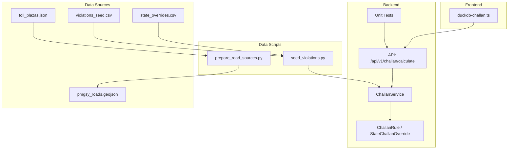
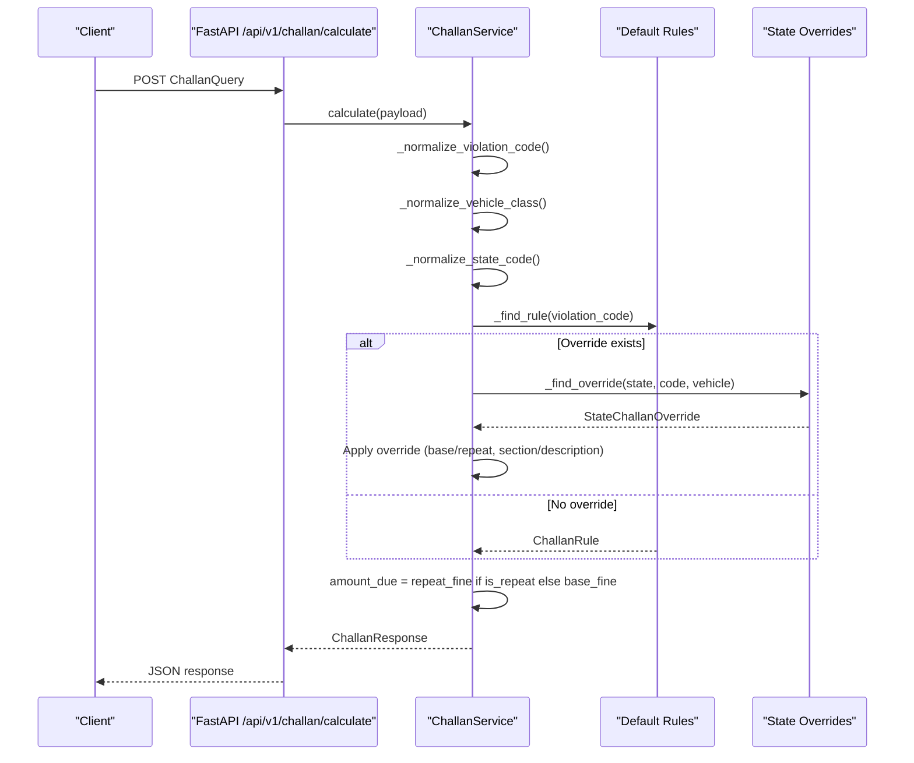
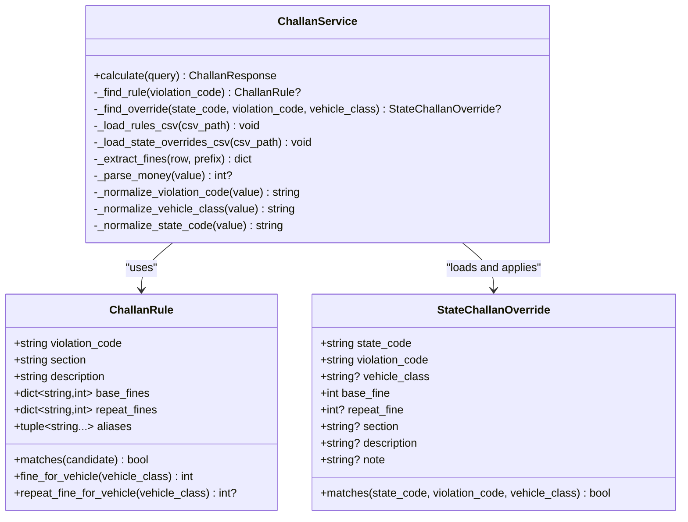
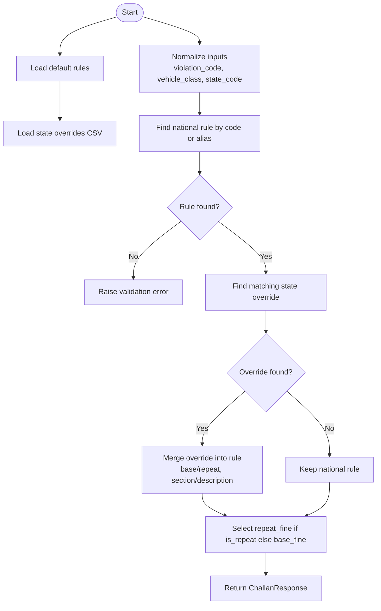
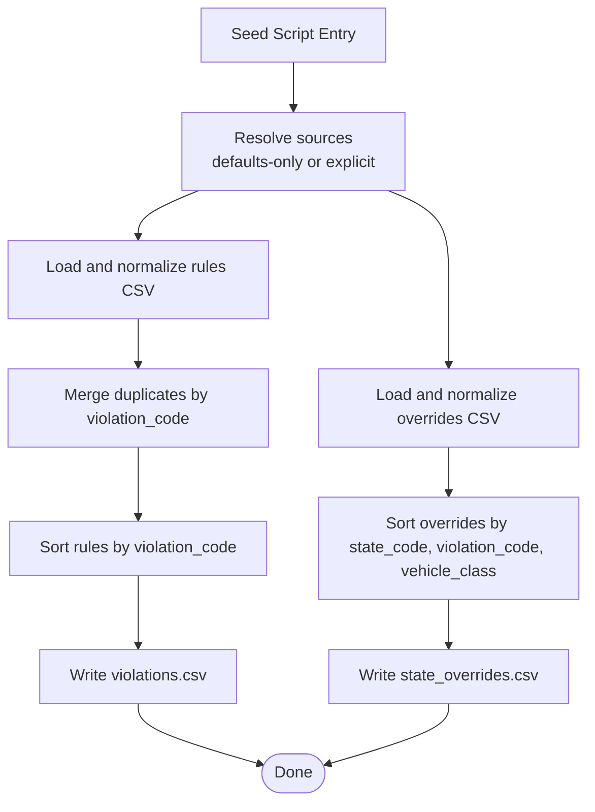
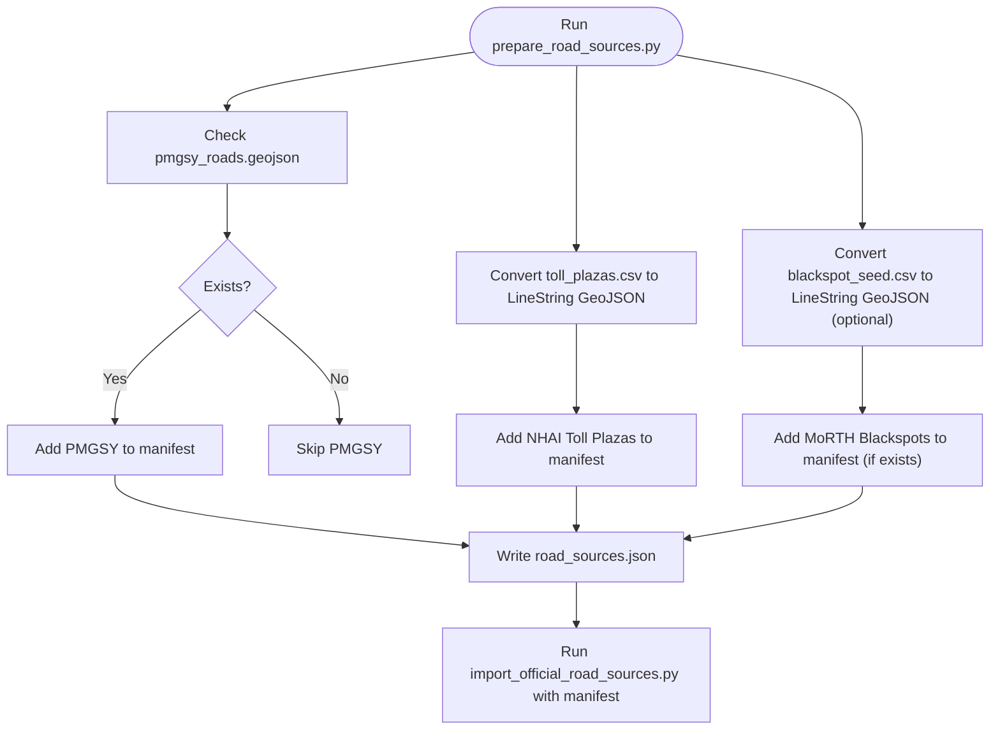
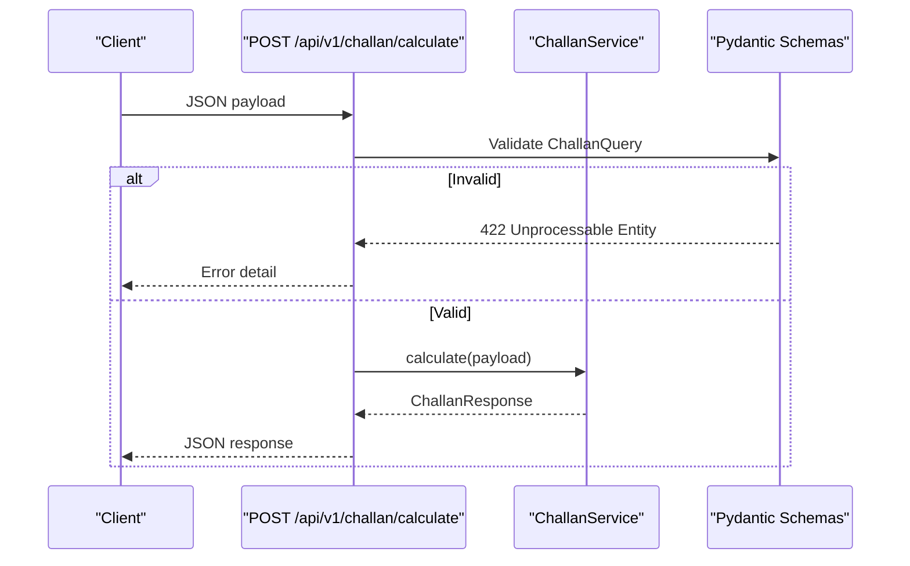
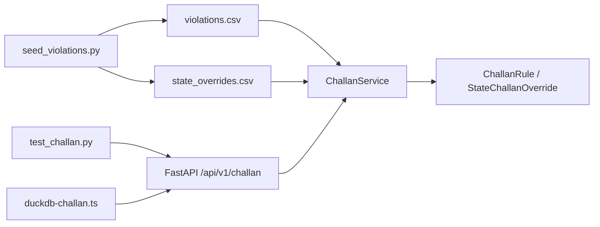

# Legal and Traffic Database

<cite>
**Referenced Files in This Document**
- [challan_service.py](file://backend/services/challan_service.py)
- [challan.py](file://backend/models/challan.py)
- [seed_violations.py](file://backend/scripts/data/seed_violations.py)
- [schemas.py](file://backend/models/schemas.py)
- [challan.py](file://backend/api/v1/challan.py)
- [test_challan.py](file://backend/tests/test_challan.py)
- [prepare_road_sources.py](file://backend/scripts/data/prepare_road_sources.py)
- [road_sources.json](file://backend/scripts/data/road_sources.json)
- [toll_plazas.json](file://backend/data/toll_plazas.json)
- [state_overrides.csv](file://chatbot_service/data/state_overrides.csv)
- [violations_seed.csv](file://chatbot_service/data/violations_seed.csv)
- [motor_vehicles_act_1988_summary.txt](file://chatbot_service/data/legal/motor_vehicles_act_1988_summary.txt)
- [duckdb-challan.ts](file://frontend/lib/duckdb-challan.ts)
- [Database.md](file://docs/Database.md)
</cite>

## Table of Contents
1. [Introduction](#introduction)
2. [Project Structure](#project-structure)
3. [Core Components](#core-components)
4. [Architecture Overview](#architecture-overview)
5. [Detailed Component Analysis](#detailed-component-analysis)
6. [Dependency Analysis](#dependency-analysis)
7. [Performance Considerations](#performance-considerations)
8. [Troubleshooting Guide](#troubleshooting-guide)
9. [Conclusion](#conclusion)
10. [Appendices](#appendices)

## Introduction
This document describes the legal and traffic database management system that powers traffic violation processing and fine calculation across India. It explains:
- The challan rule engine that normalizes and validates traffic violation data from CSV sources and generates standardized violation codes.
- The state-specific fine calculation system with vehicle class categorization and repeat offense penalties.
- Examples of the seed violations script, rule normalization processes, and fine calculation algorithms.
- PMGSY (Pradhan Mantri Gram Sadak Yojana) road data integration and toll plaza database management.
- The state override system for regional variations in traffic laws and penalties.
- Data validation rules, alias resolution, and cross-referencing between violation codes and legal sections.
- Guidance on updating traffic laws, adding new violation categories, and maintaining legal compliance.

## Project Structure
The system spans backend services, data scripts, API endpoints, and frontend offline support:
- Backend services define the rule engine and state overrides.
- Scripts normalize raw CSV data into canonical formats for ingestion.
- API endpoints expose fine calculations via a REST interface.
- Tests validate correctness and normalization.
- Frontend provides an offline calculator backed by DuckDB for demonstration.

**Diagram sources**
- [challan.py:1-53](file://backend/models/challan.py#L1-L53)
- [challan_service.py:1-314](file://backend/services/challan_service.py#L1-L314)
- [seed_violations.py:1-482](file://backend/scripts/data/seed_violations.py#L1-L482)
- [prepare_road_sources.py:1-195](file://backend/scripts/data/prepare_road_sources.py#L1-L195)
- [challan.py:1-26](file://backend/api/v1/challan.py#L1-L26)
- [test_challan.py:1-59](file://backend/tests/test_challan.py#L1-L59)
- [duckdb-challan.ts:20-50](file://frontend/lib/duckdb-challan.ts#L20-L50)

**Section sources**
- [challan_service.py:1-314](file://backend/services/challan_service.py#L1-L314)
- [seed_violations.py:1-482](file://backend/scripts/data/seed_violations.py#L1-L482)
- [prepare_road_sources.py:1-195](file://backend/scripts/data/prepare_road_sources.py#L1-L195)
- [challan.py:1-26](file://backend/api/v1/challan.py#L1-L26)
- [test_challan.py:1-59](file://backend/tests/test_challan.py#L1-L59)
- [duckdb-challan.ts:20-50](file://frontend/lib/duckdb-challan.ts#L20-L50)

## Core Components
- ChallanService: Implements the rule engine, normalization, and state override logic. Loads default rules and optional CSV overrides.
- ChallanRule and StateChallanOverride: Data models representing national and state-specific rules.
- seed_violations.py: Normalizes raw CSV data into canonical violations.csv and state_overrides.csv.
- API endpoint: Exposes a POST /api/v1/challan/calculate that accepts a ChallanQuery and returns ChallanResponse.
- Tests: Validate defaults, normalization, repeat-offense logic, and error handling.

Key capabilities:
- Standardized violation codes and aliases.
- Vehicle class normalization (two_wheeler, light_motor_vehicle, heavy_vehicle, bus).
- Repeat offense penalties with optional state overrides.
- State override matching by state_code, violation_code, and vehicle_class.

**Section sources**
- [challan_service.py:96-149](file://backend/services/challan_service.py#L96-L149)
- [challan.py:6-53](file://backend/models/challan.py#L6-L53)
- [seed_violations.py:43-106](file://backend/scripts/data/seed_violations.py#L43-L106)
- [schemas.py:240-257](file://backend/models/schemas.py#L240-L257)
- [challan.py:17-26](file://backend/api/v1/challan.py#L17-L26)
- [test_challan.py:6-59](file://backend/tests/test_challan.py#L6-L59)

## Architecture Overview
The system integrates CSV-based legal data with a FastAPI service and optional state overrides. The flow:
- Input: ChallanQuery (violation_code, vehicle_class, state_code, is_repeat).
- Normalize: Clean and alias-violation codes, normalize vehicle class, normalize state code.
- Lookup: Find the national rule; optionally apply state override.
- Compute: Select base or repeat fine depending on is_repeat.
- Output: ChallanResponse with section, description, and state override note.

**Diagram sources**
- [challan.py:17-26](file://backend/api/v1/challan.py#L17-L26)
- [challan_service.py:103-149](file://backend/services/challan_service.py#L103-L149)
- [challan.py:6-53](file://backend/models/challan.py#L6-L53)

**Section sources**
- [challan.py:1-26](file://backend/api/v1/challan.py#L1-L26)
- [challan_service.py:96-149](file://backend/services/challan_service.py#L96-L149)

## Detailed Component Analysis

### Challan Rule Engine
The rule engine encapsulates:
- Default national rules for major violations (e.g., 183 overspeeding, 185 drunk driving).
- Alias resolution for violation codes.
- Fine lookup by vehicle class with fallback to default.
- Repeat offense penalties and state overrides.

**Diagram sources**
- [challan.py:6-53](file://backend/models/challan.py#L6-L53)
- [challan_service.py:96-314](file://backend/services/challan_service.py#L96-L314)

**Section sources**
- [challan.py:6-53](file://backend/models/challan.py#L6-L53)
- [challan_service.py:30-93](file://backend/services/challan_service.py#L30-L93)
- [challan_service.py:240-260](file://backend/services/challan_service.py#L240-L260)

### State-Specific Fine Calculation and Overrides
State overrides allow regional adjustments:
- Match by state_code, violation_code, and vehicle_class.
- Optional section and description overrides.
- Notes can include authority, effective date, and source URL.

**Diagram sources**
- [challan_service.py:103-149](file://backend/services/challan_service.py#L103-L149)
- [challan_service.py:209-238](file://backend/services/challan_service.py#L209-L238)
- [challan.py:34-53](file://backend/models/challan.py#L34-L53)

**Section sources**
- [challan_service.py:119-137](file://backend/services/challan_service.py#L119-L137)
- [challan.py:45-52](file://backend/models/challan.py#L45-L52)

### Seed Violations Script and Normalization
The seed script transforms raw CSVs into canonical datasets:
- Reads violations_seed.csv and state_overrides_seed.csv.
- Normalizes violation codes, aliases, and monetary values.
- Merges repeated entries and writes violations.csv and state_overrides.csv.
- Supports qualifiers like REPEAT and seed-specific fields.

**Diagram sources**
- [seed_violations.py:419-478](file://backend/scripts/data/seed_violations.py#L419-L478)
- [seed_violations.py:237-249](file://backend/scripts/data/seed_violations.py#L237-L249)
- [seed_violations.py:398-408](file://backend/scripts/data/seed_violations.py#L398-L408)

**Section sources**
- [seed_violations.py:177-234](file://backend/scripts/data/seed_violations.py#L177-L234)
- [seed_violations.py:252-301](file://backend/scripts/data/seed_violations.py#L252-L301)
- [seed_violations.py:419-478](file://backend/scripts/data/seed_violations.py#L419-L478)

### PMGSY Road Data Integration and Toll Plaza Management
PMGSY and toll plaza data are prepared and imported:
- PMGSY roads are provided as GeoJSON LineStrings and included in the import manifest.
- Toll plazas are converted from point CSV to tiny LineString features.
- A manifest lists sources with metadata for import.

**Diagram sources**
- [prepare_road_sources.py:145-195](file://backend/scripts/data/prepare_road_sources.py#L145-L195)
- [road_sources.json:1-18](file://backend/scripts/data/road_sources.json#L1-L18)
- [toll_plazas.json:1-800](file://backend/data/toll_plazas.json#L1-L800)

**Section sources**
- [prepare_road_sources.py:142-195](file://backend/scripts/data/prepare_road_sources.py#L142-L195)
- [road_sources.json:1-18](file://backend/scripts/data/road_sources.json#L1-L18)

### API Workflow and Validation
The API endpoint validates inputs and delegates to the service:
- ChallanQuery enforces required fields and lengths.
- Service raises validation errors for unsupported violation codes.
- Tests verify defaults, normalization, and repeat-offense behavior.

**Diagram sources**
- [challan.py:17-26](file://backend/api/v1/challan.py#L17-L26)
- [schemas.py:240-257](file://backend/models/schemas.py#L240-L257)
- [test_challan.py:45-59](file://backend/tests/test_challan.py#L45-L59)

**Section sources**
- [challan.py:1-26](file://backend/api/v1/challan.py#L1-L26)
- [schemas.py:240-257](file://backend/models/schemas.py#L240-L257)
- [test_challan.py:6-59](file://backend/tests/test_challan.py#L6-L59)

## Dependency Analysis
- ChallanService depends on:
  - Default rules embedded in code.
  - Optional CSV files loaded from configured data directories.
  - Pydantic models for input/output validation.
- seed_violations.py depends on:
  - Raw CSVs (violations_seed.csv, state_overrides_seed.csv).
  - Writes canonical CSVs for backend consumption.
- Frontend offline calculator depends on a local DuckDB-like structure for demonstration.

**Diagram sources**
- [seed_violations.py:419-478](file://backend/scripts/data/seed_violations.py#L419-L478)
- [challan_service.py:151-159](file://backend/services/challan_service.py#L151-L159)
- [challan.py:17-26](file://backend/api/v1/challan.py#L17-L26)
- [test_challan.py:1-59](file://backend/tests/test_challan.py#L1-L59)
- [duckdb-challan.ts:20-50](file://frontend/lib/duckdb-challan.ts#L20-L50)

**Section sources**
- [challan_service.py:151-159](file://backend/services/challan_service.py#L151-L159)
- [seed_violations.py:419-478](file://backend/scripts/data/seed_violations.py#L419-L478)

## Performance Considerations
- Rule lookup is O(n) over loaded rules; keep the number of rules manageable.
- State overrides are scanned linearly; consider indexing by (state_code, violation_code, vehicle_class) if scale grows.
- CSV parsing and normalization are batched; ensure adequate memory for large datasets.
- Frontend offline calculator simulates fast responses; network-bound calls should cache results.

## Troubleshooting Guide
Common issues and resolutions:
- Unsupported violation code:
  - Symptom: 422 error mentioning known examples.
  - Resolution: Add or alias the violation code in violations.csv or violations_seed.csv.
- Unknown vehicle class:
  - Symptom: Validation error indicating vehicle_class is required.
  - Resolution: Use accepted aliases (e.g., car → light_motor_vehicle).
- State override not applied:
  - Symptom: National fine persists despite state_overrides.csv.
  - Resolution: Verify state_code normalization and matching by state_code, violation_code, and vehicle_class.
- Monetary parsing failures:
  - Symptom: Missing base_fine or repeat_fine.
  - Resolution: Ensure numeric values in CSV; the parser extracts digits only.

Validation references:
- Service validation errors and normalization behavior are covered by unit tests.

**Section sources**
- [challan_service.py:109-113](file://backend/services/challan_service.py#L109-L113)
- [test_challan.py:45-59](file://backend/tests/test_challan.py#L45-L59)

## Conclusion
The legal and traffic database system provides a robust, extensible foundation for traffic violation processing:
- Canonical rule and override management via CSV normalization.
- Deterministic fine calculation with repeat-offense logic and state overrides.
- Clear pathways to update traffic laws, add new violation categories, and maintain legal compliance.
- Integrated PMGSY and toll plaza data for road infrastructure insights.

## Appendices

### Data Model Overview
- Traffic violations and state overrides are represented in the backend models and validated by Pydantic schemas.
- Database schema documentation outlines columns for traffic_violations and state_fine_overrides.

**Section sources**
- [Database.md:55-83](file://docs/Database.md#L55-L83)
- [schemas.py:240-257](file://backend/models/schemas.py#L240-L257)

### Legal References and Compliance
- The Motor Vehicles Act 1988 summary provides authoritative sections and penalties referenced by the system.
- Use this reference to align new rules and updates with central law.

**Section sources**
- [motor_vehicles_act_1988_summary.txt:1-391](file://chatbot_service/data/legal/motor_vehicles_act_1988_summary.txt#L1-L391)

### Examples Index
- Default rules and aliases for violations (183, 185, 181, 194D, 194B, 179).
- State overrides for TN, DL, KA, KL, MH, GJ, AP, TS, WB, UP.
- Seed CSVs for violations and state overrides.

**Section sources**
- [challan_service.py:30-93](file://backend/services/challan_service.py#L30-L93)
- [state_overrides.csv:1-14](file://chatbot_service/data/state_overrides.csv#L1-L14)
- [violations_seed.csv:1-30](file://chatbot_service/data/violations_seed.csv#L1-L30)