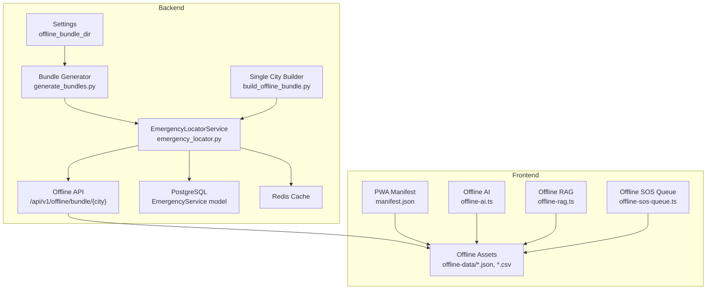
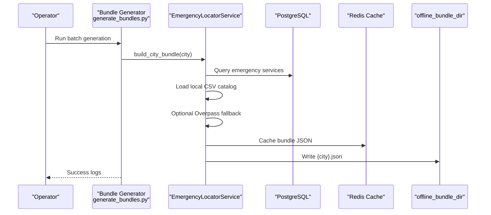
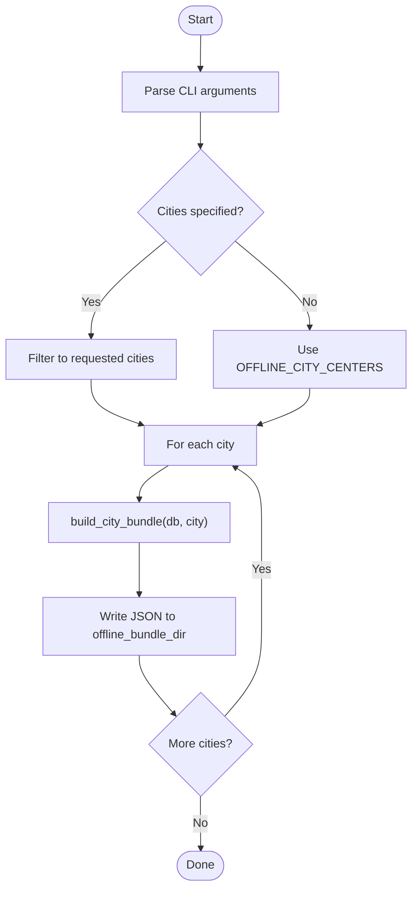
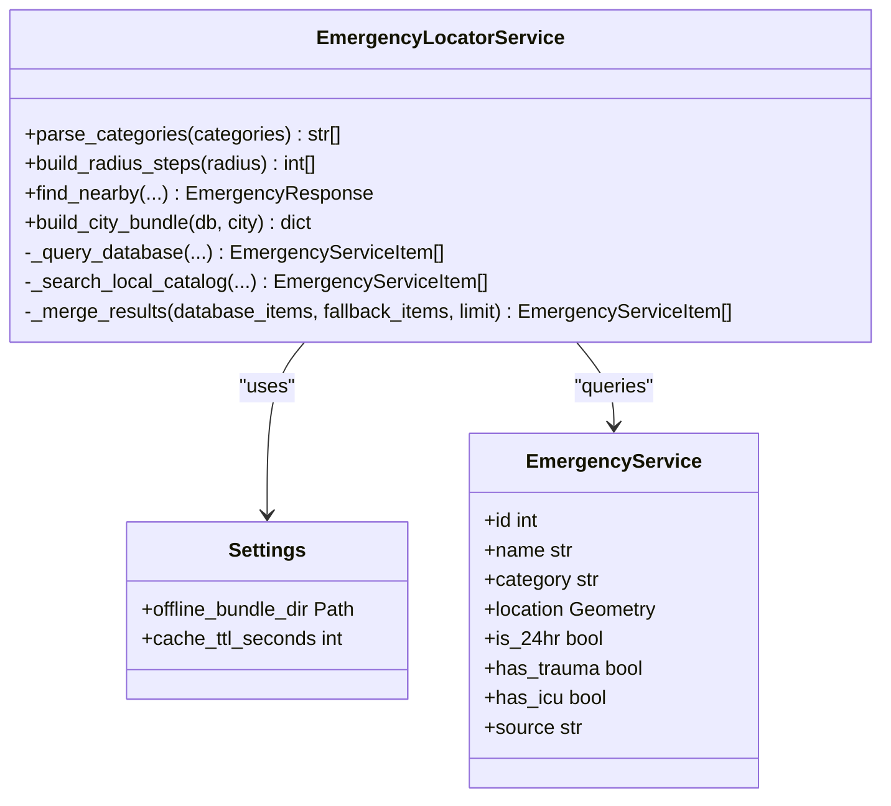
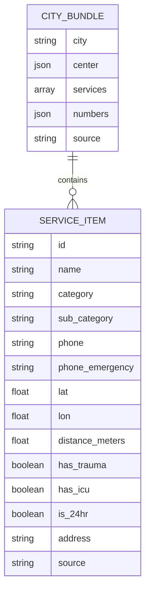
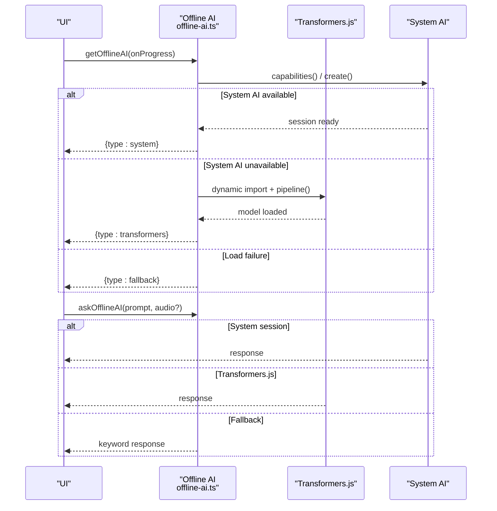
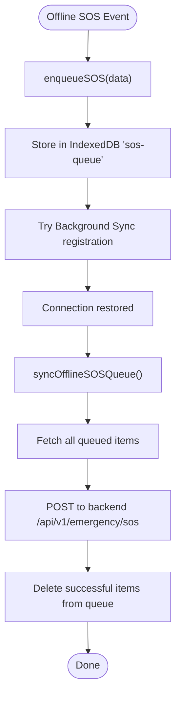
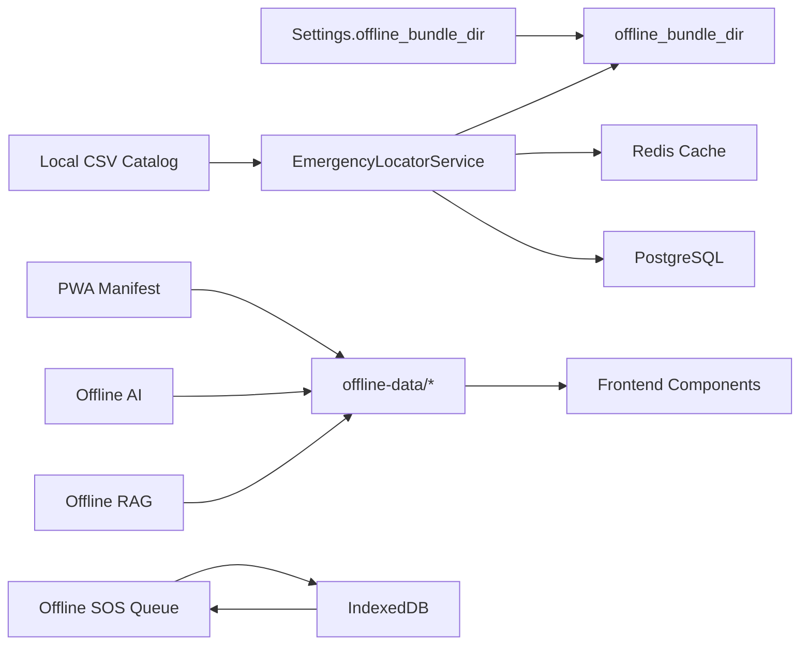

# Offline Data Bundling

<cite>
**Referenced Files in This Document**
- [manifest.json](file://frontend/public/manifest.json)
- [offline-ai.ts](file://frontend/lib/offline-ai.ts)
- [offline-rag.ts](file://frontend/lib/offline-rag.ts)
- [offline-sos-queue.ts](file://frontend/lib/offline-sos-queue.ts)
- [chennai.json](file://frontend/public/offline-data/chennai.json)
- [first-aid.json](file://frontend/public/offline-data/first-aid.json)
- [violations.csv](file://frontend/public/offline-data/violations.csv)
- [state_overrides.csv](file://frontend/public/offline-data/state_overrides.csv)
- [build_offline_bundle.py](file://backend/scripts/app/build_offline_bundle.py)
- [generate_bundles.py](file://backend/scripts/app/generate_bundles.py)
- [offline.py](file://backend/api/v1/offline.py)
- [emergency_locator.py](file://backend/services/emergency_locator.py)
- [config.py](file://backend/core/config.py)
- [emergency.py](file://backend/models/emergency.py)
- [local_emergency_catalog.py](file://backend/services/local_emergency_catalog.py)
</cite>

## Table of Contents
1. [Introduction](#introduction)
2. [Project Structure](#project-structure)
3. [Core Components](#core-components)
4. [Architecture Overview](#architecture-overview)
5. [Detailed Component Analysis](#detailed-component-analysis)
6. [Dependency Analysis](#dependency-analysis)
7. [Performance Considerations](#performance-considerations)
8. [Troubleshooting Guide](#troubleshooting-guide)
9. [Conclusion](#conclusion)
10. [Appendices](#appendices)

## Introduction
This document explains the offline data bundling system that powers SafeVixAI’s offline-first functionality across 25 major Indian cities. It covers how emergency services, first aid resources, and traffic violation data are packaged, stored, and served without an internet connection. It also documents offline AI capabilities, local RAG operations, synchronization strategies between online and offline modes, and practical guidance for maintaining and extending the offline dataset.

## Project Structure
The offline system spans backend data preparation and caching, and frontend asset delivery and runtime consumption:
- Backend
  - Scripts to generate offline bundles for cities
  - API endpoint to serve per-city bundles
  - Emergency locator service that builds consolidated offline bundles
  - Configuration for bundle output directory and caching
  - Local emergency catalog loader for CSV-based entries
- Frontend
  - PWA manifest enabling installability and offline-capable app shell
  - Offline data assets (city bundles, first aid, violations, state overrides)
  - Offline AI engine with system fallback and Transformers.js loader
  - Offline RAG simulation for legal citations
  - IndexedDB-backed SOS queue for offline-to-online sync

**Diagram sources**
- [config.py:57](file://backend/core/config.py#L57)
- [generate_bundles.py:16-68](file://backend/scripts/app/generate_bundles.py#L16-L68)
- [build_offline_bundle.py:14-31](file://backend/scripts/app/build_offline_bundle.py#L14-L31)
- [emergency_locator.py:241-299](file://backend/services/emergency_locator.py#L241-L299)
- [offline.py:18-27](file://backend/api/v1/offline.py#L18-L27)
- [emergency.py:12-45](file://backend/models/emergency.py#L12-L45)
- [manifest.json:1-68](file://frontend/public/manifest.json#L1-L68)
- [chennai.json:1-20](file://frontend/public/offline-data/chennai.json#L1-L20)
- [offline-ai.ts:1-256](file://frontend/lib/offline-ai.ts#L1-L256)
- [offline-rag.ts:1-35](file://frontend/lib/offline-rag.ts#L1-L35)
- [offline-sos-queue.ts:1-138](file://frontend/lib/offline-sos-queue.ts#L1-L138)

**Section sources**
- [config.py:55-58](file://backend/core/config.py#L55-L58)
- [generate_bundles.py:16-68](file://backend/scripts/app/generate_bundles.py#L16-L68)
- [build_offline_bundle.py:14-31](file://backend/scripts/app/build_offline_bundle.py#L14-L31)
- [emergency_locator.py:241-299](file://backend/services/emergency_locator.py#L241-L299)
- [offline.py:18-27](file://backend/api/v1/offline.py#L18-L27)
- [manifest.json:1-68](file://frontend/public/manifest.json#L1-L68)
- [chennai.json:1-20](file://frontend/public/offline-data/chennai.json#L1-L20)
- [offline-ai.ts:1-256](file://frontend/lib/offline-ai.ts#L1-L256)
- [offline-rag.ts:1-35](file://frontend/lib/offline-rag.ts#L1-L35)
- [offline-sos-queue.ts:1-138](file://frontend/lib/offline-sos-queue.ts#L1-L138)

## Core Components
- Offline bundle generator
  - Produces per-city JSON bundles containing emergency services, numbers, and metadata
  - Supports batch generation and single-city building
- Emergency locator service
  - Builds consolidated bundles by combining database records, local CSV catalog, and optional Overpass fallback
  - Writes bundles to configured offline directory and caches them
- Frontend offline assets
  - City-specific JSON bundles, first aid steps, traffic violation data, and state-specific overrides
  - PWA manifest enabling offline-capable app shell
- Offline AI and RAG
  - System AI availability check (Chrome/Android AICore), Transformers.js Gemma 4 E2B loader, and keyword fallback
  - Local RAG simulation for MV Act citations
- Offline SOS queue
  - IndexedDB-backed queue with background sync capability when online

**Section sources**
- [generate_bundles.py:16-68](file://backend/scripts/app/generate_bundles.py#L16-L68)
- [build_offline_bundle.py:14-31](file://backend/scripts/app/build_offline_bundle.py#L14-L31)
- [emergency_locator.py:241-299](file://backend/services/emergency_locator.py#L241-L299)
- [chennai.json:1-20](file://frontend/public/offline-data/chennai.json#L1-L20)
- [first-aid.json:1-20](file://frontend/public/offline-data/first-aid.json#L1-L20)
- [violations.csv:1-27](file://frontend/public/offline-data/violations.csv#L1-L27)
- [state_overrides.csv:1-14](file://frontend/public/offline-data/state_overrides.csv#L1-L14)
- [manifest.json:1-68](file://frontend/public/manifest.json#L1-L68)
- [offline-ai.ts:1-256](file://frontend/lib/offline-ai.ts#L1-L256)
- [offline-rag.ts:1-35](file://frontend/lib/offline-rag.ts#L1-L35)
- [offline-sos-queue.ts:1-138](file://frontend/lib/offline-sos-queue.ts#L1-L138)

## Architecture Overview
The offline architecture integrates backend data preparation with frontend asset delivery and runtime offline capabilities.

**Diagram sources**
- [generate_bundles.py:16-68](file://backend/scripts/app/generate_bundles.py#L16-L68)
- [emergency_locator.py:241-299](file://backend/services/emergency_locator.py#L241-L299)
- [config.py:57](file://backend/core/config.py#L57)

## Detailed Component Analysis

### Offline Bundle Generation and Serving
- Batch generation
  - Iterates over supported offline cities, builds bundles, and writes JSON files to the configured offline bundle directory
  - Includes safeguards for rate limiting and graceful error handling
- Single-city builder
  - Accepts a city argument and produces a bundle path and service count
- API endpoint
  - Exposes a GET route to fetch a city’s offline bundle from the backend service

**Diagram sources**
- [generate_bundles.py:16-68](file://backend/scripts/app/generate_bundles.py#L16-L68)
- [build_offline_bundle.py:14-31](file://backend/scripts/app/build_offline_bundle.py#L14-L31)
- [emergency_locator.py:241-299](file://backend/services/emergency_locator.py#L241-L299)

**Section sources**
- [generate_bundles.py:16-68](file://backend/scripts/app/generate_bundles.py#L16-L68)
- [build_offline_bundle.py:14-31](file://backend/scripts/app/build_offline_bundle.py#L14-L31)
- [offline.py:18-27](file://backend/api/v1/offline.py#L18-L27)

### Emergency Locator Service and Data Sources
- Data fusion strategy
  - Database records ordered by proximity and quality flags
  - Local CSV catalog entries for hospitals and other emergency facilities
  - Optional Overpass fallback when counts are insufficient
- Output structure
  - City center coordinates, service list, emergency numbers, and provenance string indicating data sources used
- Caching and persistence
  - Bundle JSON cached in Redis and persisted to disk in the offline bundle directory

**Diagram sources**
- [emergency_locator.py:161-507](file://backend/services/emergency_locator.py#L161-L507)
- [config.py:57](file://backend/core/config.py#L57)
- [emergency.py:12-45](file://backend/models/emergency.py#L12-L45)

**Section sources**
- [emergency_locator.py:241-299](file://backend/services/emergency_locator.py#L241-L299)
- [emergency_locator.py:375-421](file://backend/services/emergency_locator.py#L375-L421)
- [emergency_locator.py:429-447](file://backend/services/emergency_locator.py#L429-L447)
- [emergency_locator.py:482-506](file://backend/services/emergency_locator.py#L482-L506)
- [config.py:57](file://backend/core/config.py#L57)
- [emergency.py:12-45](file://backend/models/emergency.py#L12-L45)

### Offline Data Assets
- City bundles
  - Example: Chennai bundle includes hospitals, police, ambulance, fire, towing, and pharmacy services with coordinates, flags, and distance metrics
- First aid
  - Structured first aid steps and warnings for common emergencies
- Traffic violations
  - National MV Act penalties and repeat offenses
  - State-specific overrides for selected states and violation codes
- PWA manifest
  - Enables installation and offline-capable app shell

**Diagram sources**
- [chennai.json:1-20](file://frontend/public/offline-data/chennai.json#L1-L20)
- [chennai.json:7-120](file://frontend/public/offline-data/chennai.json#L7-L120)
- [first-aid.json:1-20](file://frontend/public/offline-data/first-aid.json#L1-L20)
- [violations.csv:1-27](file://frontend/public/offline-data/violations.csv#L1-L27)
- [state_overrides.csv:1-14](file://frontend/public/offline-data/state_overrides.csv#L1-L14)
- [manifest.json:1-68](file://frontend/public/manifest.json#L1-L68)

**Section sources**
- [chennai.json:1-20](file://frontend/public/offline-data/chennai.json#L1-L20)
- [chennai.json:7-120](file://frontend/public/offline-data/chennai.json#L7-L120)
- [first-aid.json:1-20](file://frontend/public/offline-data/first-aid.json#L1-L20)
- [violations.csv:1-27](file://frontend/public/offline-data/violations.csv#L1-L27)
- [state_overrides.csv:1-14](file://frontend/public/offline-data/state_overrides.csv#L1-L14)
- [manifest.json:1-68](file://frontend/public/manifest.json#L1-L68)

### Offline AI and Local RAG
- Offline AI engine
  - Checks for system AI (Chrome/Android AICore) availability; otherwise loads Gemma 4 E2B via Transformers.js with WebGPU acceleration
  - Provides progress callbacks and graceful keyword fallback when model loading fails
- Local RAG
  - Simulates vector similarity search using a local keyword index and tags for MV Act citations

**Diagram sources**
- [offline-ai.ts:47-154](file://frontend/lib/offline-ai.ts#L47-L154)
- [offline-ai.ts:160-221](file://frontend/lib/offline-ai.ts#L160-L221)

**Section sources**
- [offline-ai.ts:1-256](file://frontend/lib/offline-ai.ts#L1-L256)
- [offline-rag.ts:18-34](file://frontend/lib/offline-rag.ts#L18-L34)

### Offline SOS Queue and Sync
- IndexedDB-backed queue stores SOS events when offline
- Attempts to sync queued SOS requests when online, with background sync registration if supported
- Registers online event listener to trigger automatic sync

**Diagram sources**
- [offline-sos-queue.ts:48-124](file://frontend/lib/offline-sos-queue.ts#L48-L124)

**Section sources**
- [offline-sos-queue.ts:1-138](file://frontend/lib/offline-sos-queue.ts#L1-L138)

## Dependency Analysis
- Backend
  - Settings define the offline bundle directory and cache TTL
  - EmergencyLocatorService orchestrates data sourcing, caching, and persistence
  - PostgreSQL model defines the shape of emergency service records
  - Local CSV catalog loader enriches results with trusted local entries
- Frontend
  - PWA manifest enables offline-capable app shell
  - Offline assets are consumed directly by UI components
  - Offline AI and RAG depend on cached assets and IndexedDB for queueing

**Diagram sources**
- [config.py:57](file://backend/core/config.py#L57)
- [emergency_locator.py:241-299](file://backend/services/emergency_locator.py#L241-L299)
- [local_emergency_catalog.py:25-34](file://backend/services/local_emergency_catalog.py#L25-L34)
- [manifest.json:1-68](file://frontend/public/manifest.json#L1-L68)
- [offline-ai.ts:1-256](file://frontend/lib/offline-ai.ts#L1-L256)
- [offline-rag.ts:1-35](file://frontend/lib/offline-rag.ts#L1-L35)
- [offline-sos-queue.ts:1-138](file://frontend/lib/offline-sos-queue.ts#L1-L138)

**Section sources**
- [config.py:57](file://backend/core/config.py#L57)
- [emergency_locator.py:241-299](file://backend/services/emergency_locator.py#L241-L299)
- [local_emergency_catalog.py:25-34](file://backend/services/local_emergency_catalog.py#L25-L34)
- [manifest.json:1-68](file://frontend/public/manifest.json#L1-L68)
- [offline-ai.ts:1-256](file://frontend/lib/offline-ai.ts#L1-L256)
- [offline-rag.ts:1-35](file://frontend/lib/offline-rag.ts#L1-L35)
- [offline-sos-queue.ts:1-138](file://frontend/lib/offline-sos-queue.ts#L1-L138)

## Performance Considerations
- Bundle size and structure
  - Prefer compact JSON with minimal fields; include only necessary attributes (name, category, coordinates, flags)
  - Use categorical filtering and distance thresholds to limit result sets
- Caching
  - Leverage Redis cache for rapid rebuilds and reduce database load
  - Set appropriate cache TTL to balance freshness and performance
- Model loading
  - Use WebGPU acceleration for Transformers.js; fallback to keyword responses when model fails to load
- IndexedDB
  - Keep queue items minimal; avoid large payloads in queued SOS entries

[No sources needed since this section provides general guidance]

## Troubleshooting Guide
- Bundle generation failures
  - Verify offline bundle directory exists and is writable
  - Check Redis connectivity and Overpass API availability if fallback is used
- Missing or stale offline data
  - Confirm city is present in supported offline city list
  - Re-run bundle generation for the city
- Offline AI not available
  - Ensure user consent before downloading large model
  - Check browser/system AI availability; fallback to keyword responses is automatic
- SOS sync issues
  - Confirm online event listener is registered
  - Inspect IndexedDB queue and server-side endpoint readiness

**Section sources**
- [config.py:170-180](file://backend/core/config.py#L170-L180)
- [generate_bundles.py:60-68](file://backend/scripts/app/generate_bundles.py#L60-L68)
- [offline-ai.ts:142-154](file://frontend/lib/offline-ai.ts#L142-L154)
- [offline-sos-queue.ts:130-137](file://frontend/lib/offline-sos-queue.ts#L130-L137)

## Conclusion
SafeVixAI’s offline system combines robust backend data preparation with efficient frontend asset delivery and runtime offline capabilities. By consolidating emergency services, first aid, and traffic violation data into per-city bundles, and augmenting with system AI and local RAG, the platform delivers reliable functionality even without connectivity. Operators can maintain data freshness by regenerating bundles and leveraging background sync for queued events.

[No sources needed since this section summarizes without analyzing specific files]

## Appendices

### Offline Data Packaging Process
- Data sources
  - Database records for emergency services
  - Local CSV catalog for hospitals and other facilities
  - Optional Overpass fallback for broader coverage
- Output
  - JSON bundle per city with center coordinates, service list, emergency numbers, and provenance
- Storage
  - Redis cache and filesystem in offline bundle directory

**Section sources**
- [emergency_locator.py:241-299](file://backend/services/emergency_locator.py#L241-L299)
- [config.py:57](file://backend/core/config.py#L57)

### Offline AI and Local RAG Details
- Offline AI
  - System AI check (Chrome/Android AICore) with zero download
  - Transformers.js Gemma 4 E2B loader with WebGPU acceleration
  - Keyword fallback for deterministic responses
- Local RAG
  - Keyword-based search over MV Act citations using tags and text matching

**Section sources**
- [offline-ai.ts:1-256](file://frontend/lib/offline-ai.ts#L1-L256)
- [offline-rag.ts:1-35](file://frontend/lib/offline-rag.ts#L1-L35)

### Data Synchronization Between Online and Offline Modes
- Offline SOS queue
  - IndexedDB-backed queue with background sync registration
  - Automatic sync on online event
- API endpoint
  - Serve offline bundles via backend route for programmatic access

**Section sources**
- [offline-sos-queue.ts:48-124](file://frontend/lib/offline-sos-queue.ts#L48-L124)
- [offline.py:18-27](file://backend/api/v1/offline.py#L18-L27)

### Adding New Cities to the Offline Network
- Supported city list
  - Extend offline city centers mapping with city name and coordinates
- Bundle generation
  - Ensure database records exist or local CSV entries are available
  - Run bundle generation to produce {city}.json
- Frontend consumption
  - Place the generated bundle in offline assets directory for PWA delivery

**Section sources**
- [emergency_locator.py:89-115](file://backend/services/emergency_locator.py#L89-L115)
- [generate_bundles.py:30-55](file://backend/scripts/app/generate_bundles.py#L30-L55)

### Optimizing Bundle Sizes and Managing Storage Quotas
- Minimize fields in service items
- Use categorical filters and radius limits
- Compress JSON and leverage browser caching
- Monitor IndexedDB quota usage for offline queues

[No sources needed since this section provides general guidance]