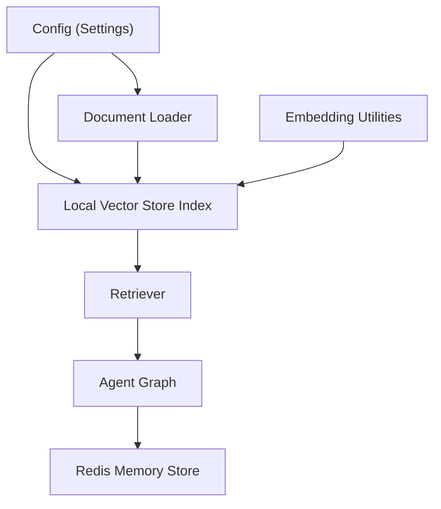
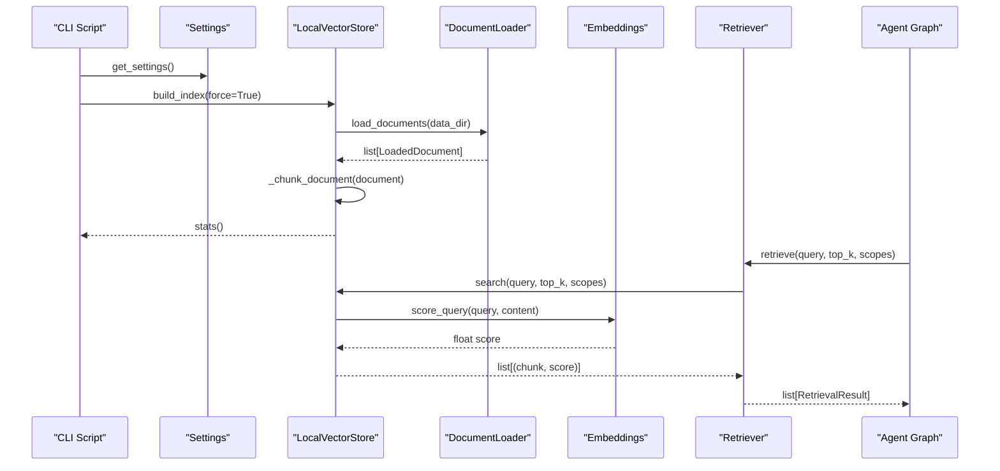
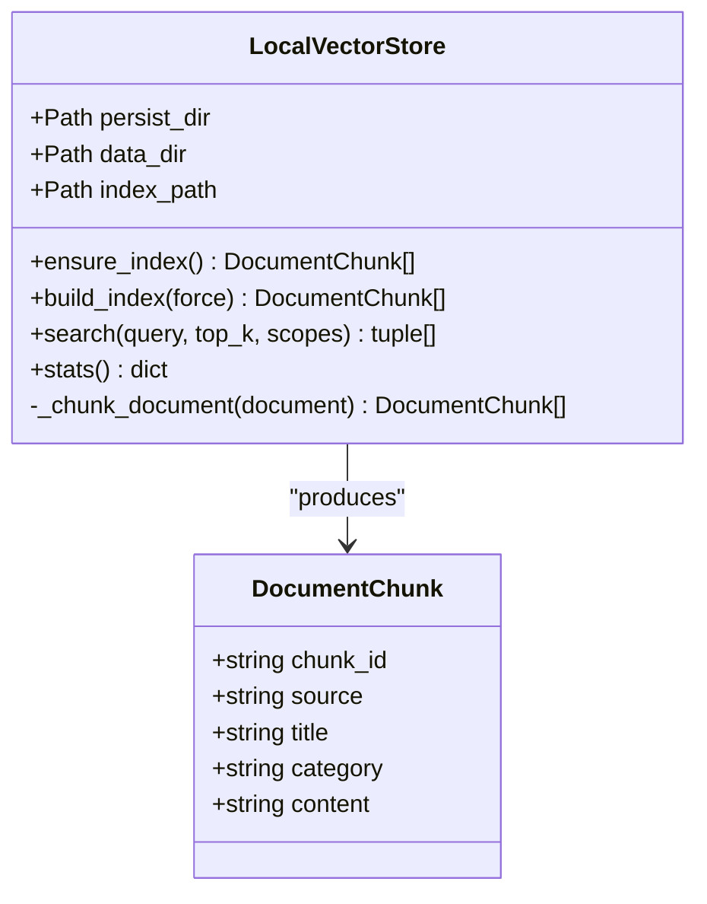
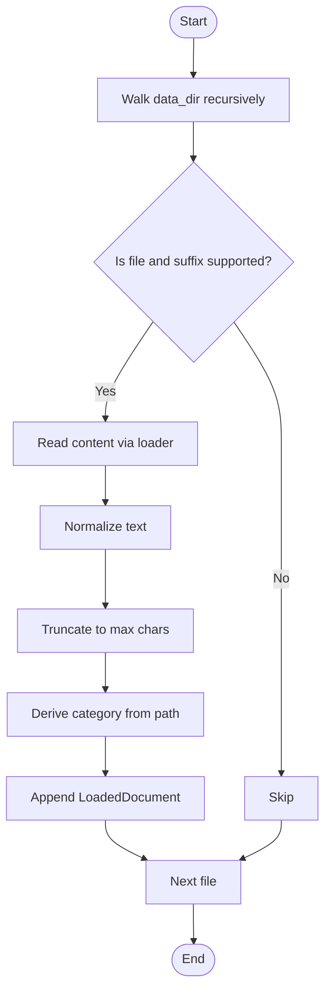
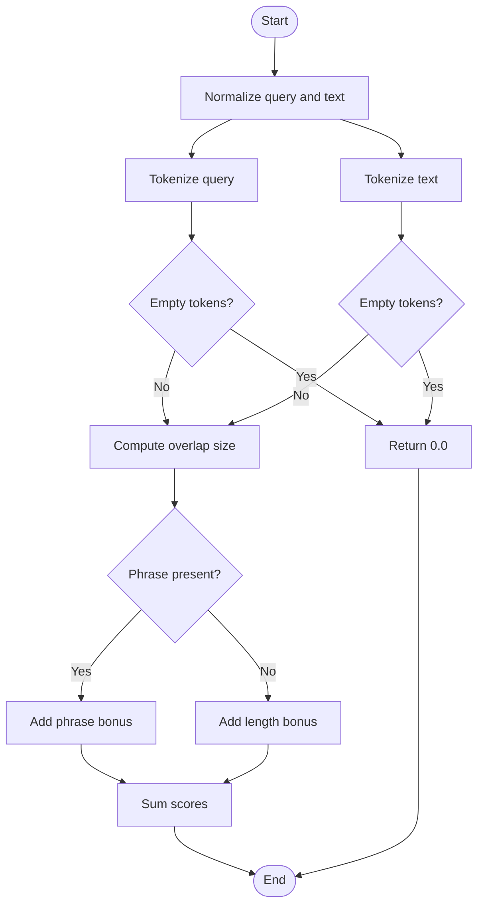
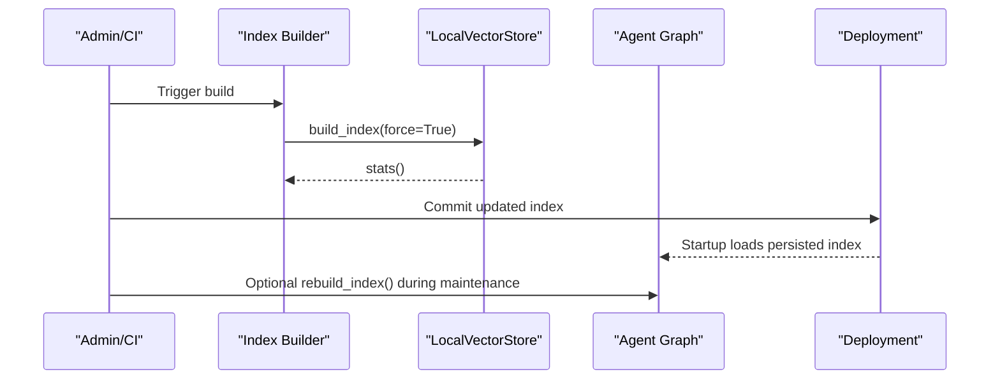
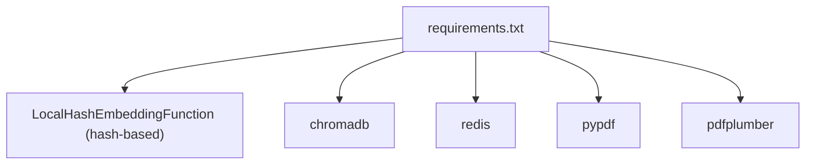

# Vector Store Management

<cite>
**Referenced Files in This Document**
- [build_vectorstore.py](file://chatbot_service/data/build_vectorstore.py)
- [vectorstore.py](file://chatbot_service/rag/vectorstore.py)
- [embeddings.py](file://chatbot_service/rag/embeddings.py)
- [document_loader.py](file://chatbot_service/rag/document_loader.py)
- [retriever.py](file://chatbot_service/rag/retriever.py)
- [config.py](file://chatbot_service/config.py)
- [requirements.txt](file://chatbot_service/requirements.txt)
- [motor_vehicles_act_1988_summary.txt](file://chatbot_service/data/legal/motor_vehicles_act_1988_summary.txt)
- [who_road_safety_india-road_safety_indicators_ind.csv](file://chatbot_service/data/legal/who_road_safety_india-road_safety_indicators_ind.csv)
- [graph.py](file://chatbot_service/agent/graph.py)
- [context_assembler.py](file://chatbot_service/agent/context_assembler.py)
- [redis_memory.py](file://chatbot_service/memory/redis_memory.py)
- [AI_Instructions.md](file://docs/AI_Instructions.md)
- [Deployment.md](file://chatbot_docs/Deployment.md)
- [build_vectorstore.py](file://backend/scripts/app/build_vectorstore.py)
</cite>

## Table of Contents
1. [Introduction](#introduction)
2. [Project Structure](#project-structure)
3. [Core Components](#core-components)
4. [Architecture Overview](#architecture-overview)
5. [Detailed Component Analysis](#detailed-component-analysis)
6. [Dependency Analysis](#dependency-analysis)
7. [Performance Considerations](#performance-considerations)
8. [Troubleshooting Guide](#troubleshooting-guide)
9. [Conclusion](#conclusion)
10. [Appendices](#appendices)

## Introduction
This document explains the vector store management system powering the AI chatbot’s retrieval-augmented generation (RAG). It covers how documents are ingested, preprocessed, chunked, indexed, queried, and maintained. It also documents the relationship between vector store updates and chatbot training cycles, performance optimization techniques, memory management with Redis, and scaling strategies. Examples include legal document ingestion (Motor Vehicles Act summary), motor vehicle act summaries, and road safety indicators processing.

## Project Structure
The vector store stack is primarily implemented in the chatbot service under the RAG module and is orchestrated by configuration and scripts. Supporting datasets and deployment guidance are included in the repository.

**Diagram sources**
- [config.py:69-113](file://chatbot_service/config.py#L69-L113)
- [document_loader.py:28-57](file://chatbot_service/rag/document_loader.py#L28-L57)
- [embeddings.py:9-30](file://chatbot_service/rag/embeddings.py#L9-L30)
- [vectorstore.py:20-109](file://chatbot_service/rag/vectorstore.py#L20-L109)
- [retriever.py:17-39](file://chatbot_service/rag/retriever.py#L17-L39)
- [graph.py:92-97](file://chatbot_service/agent/graph.py#L92-L97)
- [redis_memory.py:10-90](file://chatbot_service/memory/redis_memory.py#L10-L90)

**Section sources**
- [config.py:69-113](file://chatbot_service/config.py#L69-L113)
- [vectorstore.py:20-109](file://chatbot_service/rag/vectorstore.py#L20-L109)
- [document_loader.py:28-57](file://chatbot_service/rag/document_loader.py#L28-L57)
- [embeddings.py:9-30](file://chatbot_service/rag/embeddings.py#L9-L30)
- [retriever.py:17-39](file://chatbot_service/rag/retriever.py#L17-L39)
- [build_vectorstore.py:7-11](file://chatbot_service/data/build_vectorstore.py#L7-L11)
- [AI_Instructions.md:227-276](file://docs/AI_Instructions.md#L227-L276)
- [Deployment.md:20-27](file://chatbot_docs/Deployment.md#L20-L27)

## Core Components
- LocalVectorStore: Builds, persists, and searches a lightweight JSON-based index of normalized document chunks. Implements category scoping and scoring.
- DocumentLoader: Recursively scans a data directory, loads supported formats (text, markdown, JSON, CSV, PDF), normalizes text, and assigns categories.
- Embedding Utilities: Provides text normalization, tokenization, and a simple semantic similarity score function.
- Retriever: Wraps the vector store to produce a standardized RetrievalResult list for downstream use.
- Configuration: Defines persistent directories for the index and data, default retrieval top-k, and model identifiers.
- Scripts: Provide index building and mirroring to support both chatbot and backend environments.

**Section sources**
- [vectorstore.py:20-109](file://chatbot_service/rag/vectorstore.py#L20-L109)
- [document_loader.py:28-57](file://chatbot_service/rag/document_loader.py#L28-L57)
- [embeddings.py:9-30](file://chatbot_service/rag/embeddings.py#L9-L30)
- [retriever.py:17-39](file://chatbot_service/rag/retriever.py#L17-L39)
- [config.py:69-113](file://chatbot_service/config.py#L69-L113)
- [build_vectorstore.py:7-11](file://chatbot_service/data/build_vectorstore.py#L7-L11)

## Architecture Overview
The vector store pipeline transforms raw documents into a searchable index and supports intent-aware retrieval for chatbot conversations.

**Diagram sources**
- [build_vectorstore.py:7-11](file://chatbot_service/data/build_vectorstore.py#L7-L11)
- [config.py:69-113](file://chatbot_service/config.py#L69-L113)
- [vectorstore.py:36-49](file://chatbot_service/rag/vectorstore.py#L36-L49)
- [document_loader.py:28-57](file://chatbot_service/rag/document_loader.py#L28-L57)
- [embeddings.py:17-30](file://chatbot_service/rag/embeddings.py#L17-L30)
- [retriever.py:22-39](file://chatbot_service/rag/retriever.py#L22-L39)
- [graph.py:92-97](file://chatbot_service/agent/graph.py#L92-L97)

## Detailed Component Analysis

### LocalVectorStore
Responsibilities:
- Build and persist a JSON index of document chunks.
- Normalize and chunk documents by paragraphs with a length threshold.
- Search with optional category scoping and scoring.
- Provide statistics on chunks and categories.

Key behaviors:
- Index persistence: writes a simple_index.json in the configured persist directory.
- Chunking: iterates over normalized paragraphs; concatenates until a length threshold is reached, then emits a chunk with a composite chunk_id.
- Scoring: uses token overlap and a phrase bonus; adds a small length-normalized bonus.

**Diagram sources**
- [vectorstore.py:11-18](file://chatbot_service/rag/vectorstore.py#L11-L18)
- [vectorstore.py:20-109](file://chatbot_service/rag/vectorstore.py#L20-L109)

**Section sources**
- [vectorstore.py:20-109](file://chatbot_service/rag/vectorstore.py#L20-L109)

### DocumentLoader
Responsibilities:
- Discover and load supported file types from a data directory.
- Normalize text and truncate to a maximum length.
- Assign categories based on the relative path.
- Support for text/markdown/json/csv/pdf (with optional PDF parsing).

**Diagram sources**
- [document_loader.py:28-57](file://chatbot_service/rag/document_loader.py#L28-L57)
- [document_loader.py:60-93](file://chatbot_service/rag/document_loader.py#L60-L93)

**Section sources**
- [document_loader.py:28-57](file://chatbot_service/rag/document_loader.py#L28-L57)
- [document_loader.py:60-93](file://chatbot_service/rag/document_loader.py#L60-L93)

### Embedding Utilities
Responsibilities:
- Normalize whitespace and strip text.
- Tokenize with a simple pattern to extract words.
- Score query-text similarity using token overlap, phrase presence, and a length bonus.

**Diagram sources**
- [embeddings.py:9-30](file://chatbot_service/rag/embeddings.py#L9-L30)

**Section sources**
- [embeddings.py:9-30](file://chatbot_service/rag/embeddings.py#L9-L30)

### Retriever
Responsibilities:
- Wrap LocalVectorStore search.
- Convert results to a standardized RetrievalResult structure.

**Section sources**
- [retriever.py:17-39](file://chatbot_service/rag/retriever.py#L17-L39)

### Configuration and Scripts
- Settings define persistent directories for the index and data, default retrieval top-k, and model identifiers.
- Index building script orchestrates index creation and prints stats.
- Backend mirroring script builds a separate index and optionally mirrors it into the chatbot data directory for deployment.

**Section sources**
- [config.py:69-113](file://chatbot_service/config.py#L69-L113)
- [build_vectorstore.py:7-11](file://chatbot_service/data/build_vectorstore.py#L7-L11)
- [build_vectorstore.py:133-174](file://backend/scripts/app/build_vectorstore.py#L133-L174)

### Example Workflows

#### Legal Document Ingestion (Motor Vehicles Act Summary)
- Place the summary file under the legal data directory.
- Run the index builder to load, chunk, and persist the index.
- The retriever can scope queries to the legal domain.

**Section sources**
- [motor_vehicles_act_1988_summary.txt:1-391](file://chatbot_service/data/legal/motor_vehicles_act_1988_summary.txt#L1-L391)
- [build_vectorstore.py:7-11](file://chatbot_service/data/build_vectorstore.py#L7-L11)

#### Road Safety Indicators Processing (WHO CSV)
- Place the CSV under the legal data directory.
- The loader converts CSV rows into readable text and normalizes content.
- Queries can target road safety topics with category scoping.

**Section sources**
- [who_road_safety_india-road_safety_indicators_ind.csv:1-25](file://chatbot_service/data/legal/who_road_safety_india-road_safety_indicators_ind.csv#L1-L25)
- [document_loader.py:69-81](file://chatbot_service/rag/document_loader.py#L69-L81)

#### Motor Vehicle Act Summaries
- Summaries are ingested similarly to legal documents and indexed for retrieval.
- The retriever can filter by category to focus on motor vehicle-related content.

**Section sources**
- [motor_vehicles_act_1988_summary.txt:1-391](file://chatbot_service/data/legal/motor_vehicles_act_1988_summary.txt#L1-L391)
- [vectorstore.py:74-109](file://chatbot_service/rag/vectorstore.py#L74-L109)

### Relationship Between Vector Store Updates and Chatbot Training Cycles
- Vector store updates occur by rebuilding the index when adding new documents or changing content.
- The chatbot agent exposes a method to rebuild the index and return stats, enabling integration with training or maintenance cycles.
- Deployment strategy commits the index to git for immediate startup without build time.

**Diagram sources**
- [build_vectorstore.py:7-11](file://chatbot_service/data/build_vectorstore.py#L7-L11)
- [vectorstore.py:36-49](file://chatbot_service/rag/vectorstore.py#L36-L49)
- [graph.py:92-97](file://chatbot_service/agent/graph.py#L92-L97)
- [Deployment.md:20-27](file://chatbot_docs/Deployment.md#L20-L27)

**Section sources**
- [graph.py:92-97](file://chatbot_service/agent/graph.py#L92-L97)
- [Deployment.md:20-27](file://chatbot_docs/Deployment.md#L20-L27)

## Dependency Analysis
External libraries and their roles:
- LocalHashEmbeddingFunction (hash-based): embedding model identifier and local embedding capability.
- chromadb: vector database library referenced in documentation and requirements.
- redis: memory store for conversation sessions.
- pypdf/pdfplumber: optional PDF parsing for document loader.

**Diagram sources**
- [requirements.txt:26-48](file://chatbot_service/requirements.txt#L26-L48)

**Section sources**
- [requirements.txt:26-48](file://chatbot_service/requirements.txt#L26-L48)

## Performance Considerations
- Index size and query latency: The current implementation uses a JSON index and linear scoring. Keep top_k moderate and leverage category scoping to reduce candidate sets.
- Text normalization and truncation: Normalize whitespace and truncate long texts to keep scoring efficient.
- Chunk sizing: Paragraph-based chunking with a length threshold balances semantic coherence and retrieval granularity.
- Persistence strategy: Commit the index to git for instant startup; rebuild locally and redeploy when content changes.
- Memory management: Use Redis-backed conversation memory to offload session history and reduce in-memory footprint.

[No sources needed since this section provides general guidance]

## Troubleshooting Guide
Common issues and resolutions:
- Embedding quality and search relevance
  - Verify tokenization and phrase bonus logic; adjust query phrasing to improve overlap.
  - Ensure documents are normalized and truncated appropriately.
  - Increase top_k cautiously; use category scoping to narrow results.
- Storage optimization
  - Confirm the index is persisted under the configured persist directory.
  - Rebuild the index after adding new documents; mirror to the chatbot data directory for deployment.
- Maintenance operations
  - Rebuild the index programmatically via the agent’s rebuild method and monitor stats.
  - Validate that the data directory contains supported file types and is readable.
- Redis memory
  - Monitor Redis connectivity; fallback to in-memory sessions if Redis is unavailable.
  - Adjust TTL and ensure keys are properly prefixed for session isolation.

**Section sources**
- [embeddings.py:17-30](file://chatbot_service/rag/embeddings.py#L17-L30)
- [vectorstore.py:36-49](file://chatbot_service/rag/vectorstore.py#L36-L49)
- [graph.py:92-97](file://chatbot_service/agent/graph.py#L92-L97)
- [redis_memory.py:10-90](file://chatbot_service/memory/redis_memory.py#L10-L90)

## Conclusion
The vector store system combines a simple, robust index with practical document loading and retrieval to power the chatbot’s RAG. By committing the index for fast startup, scoping queries by category, and managing memory with Redis, the system achieves a balance between simplicity, performance, and maintainability. Extending the dataset and rebuilding the index enables continuous improvement of the chatbot’s knowledge base.

[No sources needed since this section summarizes without analyzing specific files]

## Appendices

### Appendix A: Index Building and Mirroring
- Use the chatbot index builder to generate and print stats.
- Mirror the index into the chatbot data directory for deployment.
- Backend mirroring script supports multiple source directories and counts sources.

**Section sources**
- [build_vectorstore.py:7-11](file://chatbot_service/data/build_vectorstore.py#L7-L11)
- [build_vectorstore.py:133-174](file://backend/scripts/app/build_vectorstore.py#L133-L174)

### Appendix B: Deployment Strategy
- Commit the index to git for immediate startup on Render.
- Rebuild locally and redeploy when updating knowledge.

**Section sources**
- [Deployment.md:20-27](file://chatbot_docs/Deployment.md#L20-L27)