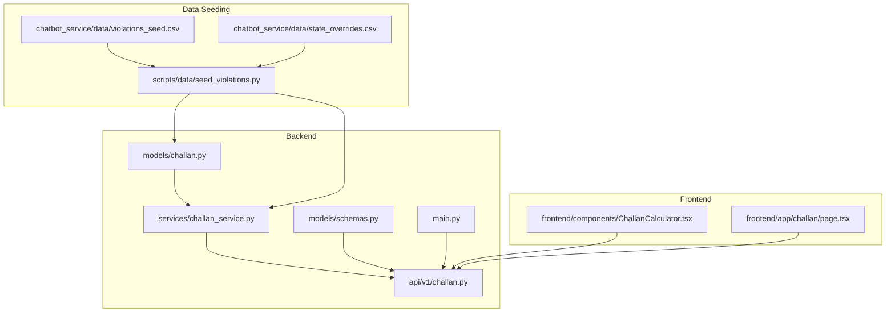
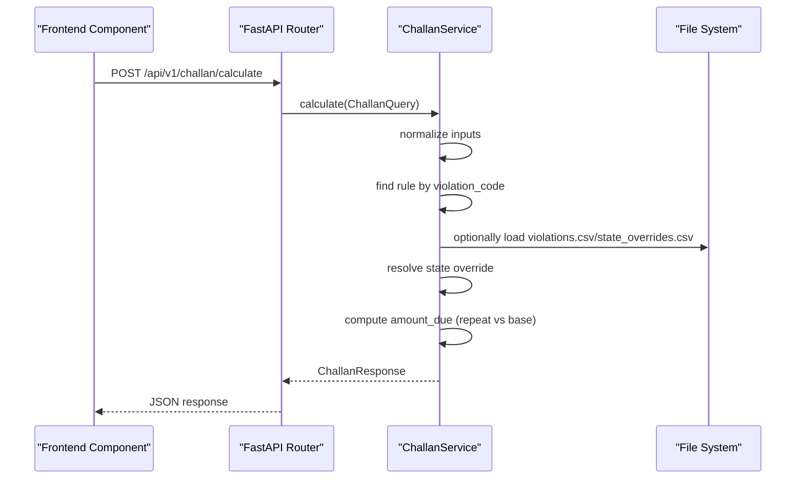
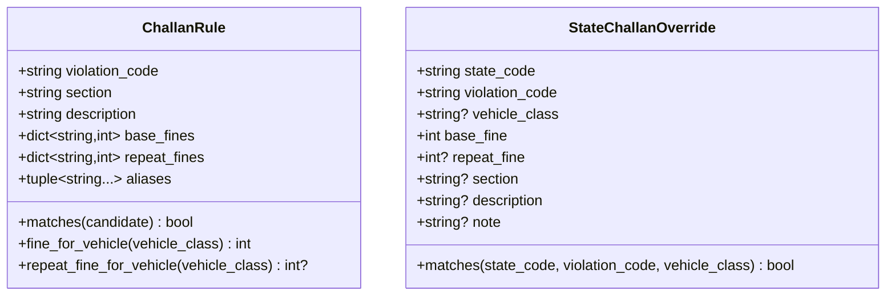
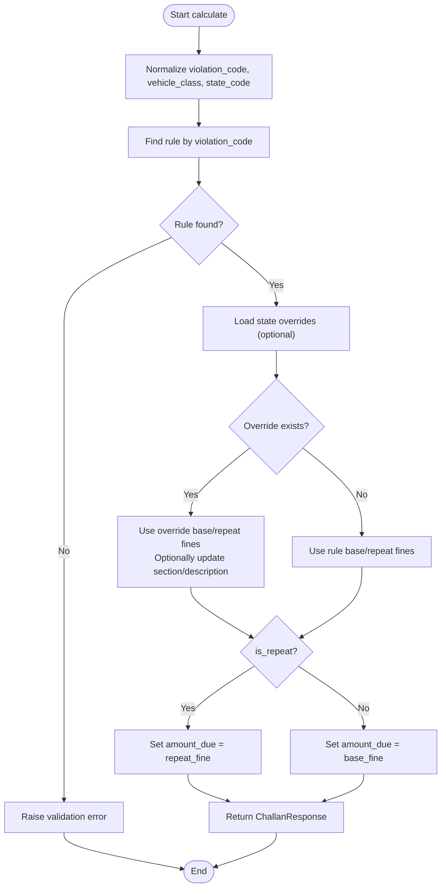
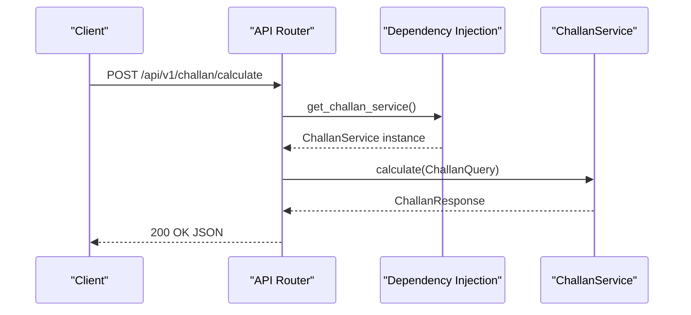
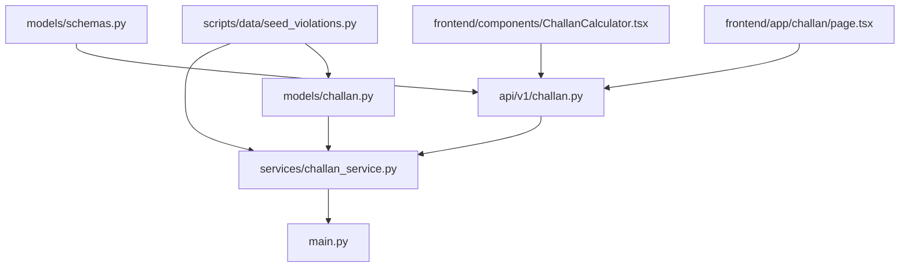

# Challan Records Entity

<cite>
**Referenced Files in This Document**
- [challan.py](file://backend/models/challan.py)
- [challan_service.py](file://backend/services/challan_service.py)
- [schemas.py](file://backend/models/schemas.py)
- [challan.py](file://backend/api/v1/challan.py)
- [main.py](file://backend/main.py)
- [test_challan.py](file://backend/tests/test_challan.py)
- [seed_violations.py](file://backend/scripts/data/seed_violations.py)
- [state_overrides.csv](file://chatbot_service/data/state_overrides.csv)
- [violations_seed.csv](file://chatbot_service/data/violations_seed.csv)
- [challan_tool.py](file://chatbot_service/tools/challan_tool.py)
- [ChallanCalculator.tsx](file://frontend/components/ChallanCalculator.tsx)
- [page.tsx](file://frontend/app/challan/page.tsx)
</cite>

## Table of Contents
1. [Introduction](#introduction)
2. [Project Structure](#project-structure)
3. [Core Components](#core-components)
4. [Architecture Overview](#architecture-overview)
5. [Detailed Component Analysis](#detailed-component-analysis)
6. [Dependency Analysis](#dependency-analysis)
7. [Performance Considerations](#performance-considerations)
8. [Troubleshooting Guide](#troubleshooting-guide)
9. [Conclusion](#conclusion)
10. [Appendices](#appendices)

## Introduction
This document provides comprehensive data model documentation for Challan Records entities, focusing on ChallanViolation and ChallanPayment, along with legal enforcement tracking. It details the challan record table structure, violation details, fine calculations, payment processing, and legal citation tracking. It also documents state-specific traffic violation enforcement rules, Motor Vehicle Act compliance, and regional variation handling. The document explains fine calculation algorithms, penalty escalation patterns, and payment status tracking, and includes examples of challan data structures, state-specific violation codes, and integration with legal databases. Finally, it covers performance considerations for large-scale violation data and compliance reporting requirements.

## Project Structure
The challan system spans backend models and services, API endpoints, frontend components, and data seeding utilities. The backend defines the ChallanRule and StateChallanOverride models, exposes a calculation endpoint, and integrates with the application lifecycle. The frontend provides interactive calculators and pages for fine estimation. Data seeding scripts normalize and persist violations and state overrides for runtime use.

**Diagram sources**
- [challan.py:1-53](file://backend/models/challan.py#L1-L53)
- [challan_service.py:1-314](file://backend/services/challan_service.py#L1-L314)
- [challan.py:1-26](file://backend/api/v1/challan.py#L1-L26)
- [schemas.py:240-257](file://backend/models/schemas.py#L240-L257)
- [main.py:24-64](file://backend/main.py#L24-L64)
- [seed_violations.py:1-482](file://backend/scripts/data/seed_violations.py#L1-L482)
- [violations_seed.csv:1-30](file://chatbot_service/data/violations_seed.csv#L1-L30)
- [state_overrides.csv:1-14](file://chatbot_service/data/state_overrides.csv#L1-L14)
- [ChallanCalculator.tsx:1-186](file://frontend/components/ChallanCalculator.tsx#L1-L186)
- [page.tsx:1-320](file://frontend/app/challan/page.tsx#L1-L320)

**Section sources**
- [challan.py:1-53](file://backend/models/challan.py#L1-L53)
- [challan_service.py:1-314](file://backend/services/challan_service.py#L1-L314)
- [challan.py:1-26](file://backend/api/v1/challan.py#L1-L26)
- [schemas.py:240-257](file://backend/models/schemas.py#L240-L257)
- [main.py:24-64](file://backend/main.py#L24-L64)
- [seed_violations.py:1-482](file://backend/scripts/data/seed_violations.py#L1-L482)
- [violations_seed.csv:1-30](file://chatbot_service/data/violations_seed.csv#L1-L30)
- [state_overrides.csv:1-14](file://chatbot_service/data/state_overrides.csv#L1-L14)
- [ChallanCalculator.tsx:1-186](file://frontend/components/ChallanCalculator.tsx#L1-L186)
- [page.tsx:1-320](file://frontend/app/challan/page.tsx#L1-L320)

## Core Components
- ChallanRule: Defines a traffic violation rule with violation_code, section, description, base_fines, repeat_fines, and aliases. Provides matching and fine lookup helpers.
- StateChallanOverride: Encapsulates state-specific overrides for base_fine, repeat_fine, section, description, and notes, with matching logic for state_code, violation_code, and vehicle_class.
- ChallanService: Central service implementing fine calculation, normalization, optional CSV loading, and state override resolution.
- ChallanQuery and ChallanResponse: Pydantic models defining input and output structures for the calculation endpoint.
- API Endpoint: Exposes POST /api/v1/challan/calculate with dependency injection of ChallanService.
- Frontend Components: Interactive calculators and pages that collect inputs and call the backend endpoint.

Key responsibilities:
- Normalize inputs (violation_code, vehicle_class, state_code).
- Resolve applicable rule and apply state overrides.
- Compute amount_due based on repeat offense flag.
- Return structured response with legal citations.

**Section sources**
- [challan.py:6-53](file://backend/models/challan.py#L6-L53)
- [challan_service.py:96-149](file://backend/services/challan_service.py#L96-L149)
- [schemas.py:240-257](file://backend/models/schemas.py#L240-L257)
- [challan.py:17-25](file://backend/api/v1/challan.py#L17-L25)

## Architecture Overview
The challan calculation pipeline integrates frontend input, API routing, service logic, and optional data sources.

**Diagram sources**
- [challan.py:17-25](file://backend/api/v1/challan.py#L17-L25)
- [challan_service.py:103-149](file://backend/services/challan_service.py#L103-L149)
- [seed_violations.py:158-174](file://backend/scripts/data/seed_violations.py#L158-L174)

**Section sources**
- [challan.py:17-25](file://backend/api/v1/challan.py#L17-L25)
- [challan_service.py:103-149](file://backend/services/challan_service.py#L103-L149)
- [main.py:35-50](file://backend/main.py#L35-L50)

## Detailed Component Analysis

### Data Models: ChallanRule and StateChallanOverride
The models define the core data structures for violation rules and state overrides.

- Matching and normalization:
  - violation_code is normalized to uppercase alphanumeric and slash.
  - aliases enable alternate identifiers for the same rule.
  - vehicle_class is normalized via aliases and validated.
  - state_code supports multiple forms and extracts a 2-letter code.

- Fine computation:
  - Base and repeat fines are looked up by vehicle class with a default fallback.
  - Repeat offenses use repeat_fine when present; otherwise base_fine.

**Diagram sources**
- [challan.py:6-53](file://backend/models/challan.py#L6-L53)

**Section sources**
- [challan.py:6-53](file://backend/models/challan.py#L6-L53)
- [challan_service.py:290-314](file://backend/services/challan_service.py#L290-L314)

### Fine Calculation Algorithm
The calculation algorithm resolves the appropriate rule, applies state overrides, and computes the payable amount.

- Optional data loading:
  - violations.csv and state_overrides.csv are loaded from multiple candidate directories.
  - CSV parsing supports flexible column names and money extraction.

- Repeat offense escalation:
  - repeat_fine is preferred when is_repeat is true and available; otherwise base_fine is used.

**Diagram sources**
- [challan_service.py:103-149](file://backend/services/challan_service.py#L103-L149)
- [challan_service.py:168-238](file://backend/services/challan_service.py#L168-L238)

**Section sources**
- [challan_service.py:103-149](file://backend/services/challan_service.py#L103-L149)
- [challan_service.py:168-238](file://backend/services/challan_service.py#L168-L238)

### API Workflow: POST /api/v1/challan/calculate
The API endpoint validates inputs, delegates to ChallanService, and handles validation errors.

- Validation:
  - Unsupported violation codes trigger a 422 error with guidance.

**Diagram sources**
- [challan.py:17-25](file://backend/api/v1/challan.py#L17-L25)
- [test_challan.py:45-59](file://backend/tests/test_challan.py#L45-L59)

**Section sources**
- [challan.py:17-25](file://backend/api/v1/challan.py#L17-L25)
- [test_challan.py:45-59](file://backend/tests/test_challan.py#L45-L59)

### Frontend Integration
Frontend components collect user inputs and call the backend endpoint, displaying results with repeat-offense indicators.

- ChallanCalculator.tsx:
  - Provides a visual interface to select violation, vehicle class, state, and repeat status.
  - Calls calculateChallan and renders total liability with legal citation.

- page.tsx:
  - Integrates with app-wide state to maintain selections across navigation.
  - Uses SWR for efficient fetching and displays repeat-offense effects.

**Section sources**
- [ChallanCalculator.tsx:32-62](file://frontend/components/ChallanCalculator.tsx#L32-L62)
- [page.tsx:71-80](file://frontend/app/challan/page.tsx#L71-L80)

### Data Seeding and Regional Overrides
Data seeding normalizes external sources into backend-ready CSVs and loads them at runtime.

- Seed script:
  - Reads violations_seed.csv and state_overrides.csv.
  - Normalizes codes, amounts, and vehicle classes.
  - Emits violations.csv and state_overrides.csv for runtime use.

- Example datasets:
  - violations_seed.csv: Central Motor Vehicle Act penalties and descriptions.
  - state_overrides.csv: State-specific overrides with authority, effective dates, and notes.

**Section sources**
- [seed_violations.py:177-234](file://backend/scripts/data/seed_violations.py#L177-L234)
- [seed_violations.py:252-301](file://backend/scripts/data/seed_violations.py#L252-L301)
- [violations_seed.csv:1-30](file://chatbot_service/data/violations_seed.csv#L1-L30)
- [state_overrides.csv:1-14](file://chatbot_service/data/state_overrides.csv#L1-L14)

### Legal Database Integration
The system integrates with legal databases via:
- Central Motor Vehicle Act references embedded in rule sections and descriptions.
- State-specific notifications and schedules linked by authority and source URLs.
- Tool-level inference of state and violation codes from natural language queries.

**Section sources**
- [challan_service.py:30-93](file://backend/services/challan_service.py#L30-L93)
- [state_overrides.csv:1-14](file://chatbot_service/data/state_overrides.csv#L1-L14)
- [challan_tool.py:31-69](file://chatbot_service/tools/challan_tool.py#L31-L69)

## Dependency Analysis
The challan system exhibits clear separation of concerns with low coupling between modules.

- Coupling:
  - Service depends on models and schemas.
  - API depends on service and schemas.
  - Frontend depends on API.

- Cohesion:
  - Service encapsulates all calculation logic and optional data loading.
  - Models are cohesive data carriers with minimal behavior.

Potential circular dependencies:
- None observed among the analyzed modules.

External dependencies:
- CSV parsing for optional data loading.
- Pydantic for request/response validation.

**Diagram sources**
- [challan.py:1-53](file://backend/models/challan.py#L1-L53)
- [challan_service.py:1-314](file://backend/services/challan_service.py#L1-L314)
- [schemas.py:240-257](file://backend/models/schemas.py#L240-L257)
- [challan.py:1-26](file://backend/api/v1/challan.py#L1-L26)
- [main.py:35-50](file://backend/main.py#L35-L50)
- [seed_violations.py:1-482](file://backend/scripts/data/seed_violations.py#L1-L482)
- [ChallanCalculator.tsx:1-186](file://frontend/components/ChallanCalculator.tsx#L1-L186)
- [page.tsx:1-320](file://frontend/app/challan/page.tsx#L1-L320)

**Section sources**
- [challan.py:1-53](file://backend/models/challan.py#L1-L53)
- [challan_service.py:1-314](file://backend/services/challan_service.py#L1-L314)
- [schemas.py:240-257](file://backend/models/schemas.py#L240-L257)
- [challan.py:1-26](file://backend/api/v1/challan.py#L1-L26)
- [main.py:35-50](file://backend/main.py#L35-L50)
- [seed_violations.py:1-482](file://backend/scripts/data/seed_violations.py#L1-L482)
- [ChallanCalculator.tsx:1-186](file://frontend/components/ChallanCalculator.tsx#L1-L186)
- [page.tsx:1-320](file://frontend/app/challan/page.tsx#L1-L320)

## Performance Considerations
- Data loading:
  - CSV loading occurs during initialization and is bounded by file sizes.
  - Money parsing uses regex to strip non-digit characters, ensuring O(n) per field.

- Memory footprint:
  - Rules and overrides are stored in lists; consider pagination or lazy loading for very large datasets.

- Computation complexity:
  - Finding a rule and applying overrides are linear scans; acceptable for typical rule counts.
  - Consider indexing or caching mechanisms if rule sets grow substantially.

- Frontend responsiveness:
  - SWR caching reduces redundant requests.
  - Debouncing repeated rapid inputs improves UX and backend throughput.

- Offline fallback:
  - Frontend includes an offline mock to maintain availability during network issues.

[No sources needed since this section provides general guidance]

## Troubleshooting Guide
Common issues and resolutions:
- Unsupported violation code:
  - Symptom: 422 error indicating unsupported code.
  - Resolution: Verify violation_code against known examples and aliases.

- Missing or invalid vehicle_class/state_code:
  - Symptom: Validation errors during normalization.
  - Resolution: Ensure inputs conform to accepted formats and aliases.

- Unexpected defaults after state override:
  - Symptom: Section/description unchanged from base rule.
  - Resolution: Confirm override presence and completeness in state_overrides.csv.

- Payment processing:
  - The current models and API do not include ChallanPayment records or payment status tracking. Extend models and services to support payment lifecycle.

**Section sources**
- [test_challan.py:45-59](file://backend/tests/test_challan.py#L45-L59)
- [challan_service.py:109-113](file://backend/services/challan_service.py#L109-L113)
- [challan_service.py:246-260](file://backend/services/challan_service.py#L246-L260)

## Conclusion
The challan system provides a robust foundation for traffic violation fine calculation with strong support for state-specific overrides and legal citations. The modular design enables easy extension for ChallanPayment entities and payment status tracking. By leveraging CSV-based data seeding and frontend integration, the system scales to diverse regional enforcement needs while maintaining clarity and performance.

[No sources needed since this section summarizes without analyzing specific files]

## Appendices

### Appendix A: Data Model Definitions
- ChallanRule
  - violation_code: Unique identifier for the violation.
  - section: Legal section reference.
  - description: Human-readable description.
  - base_fines: Vehicle-class-specific base fines.
  - repeat_fines: Vehicle-class-specific repeat offense fines.
  - aliases: Alternate identifiers for matching.

- StateChallanOverride
  - state_code: Two-letter state code.
  - violation_code: Violation identifier.
  - vehicle_class: Optional vehicle class filter.
  - base_fine: State-specific base fine.
  - repeat_fine: Optional state-specific repeat fine.
  - section/description: Optional override for legal citation.
  - note: Metadata and provenance.

- ChallanQuery
  - violation_code, vehicle_class, state_code, is_repeat.

- ChallanResponse
  - violation_code, vehicle_class, state_code, base_fine, repeat_fine, amount_due, section, description, state_override.

**Section sources**
- [challan.py:6-53](file://backend/models/challan.py#L6-L53)
- [schemas.py:240-257](file://backend/models/schemas.py#L240-L257)

### Appendix B: Examples and State-Specific Violations
- Known violation codes include 183, 185, 181, 194D, 194B, and 179.
- State-specific overrides demonstrate enhanced or modified penalties per state.
- Legal citations align with the Central Motor Vehicles Act and state notifications.

**Section sources**
- [challan_service.py:30-93](file://backend/services/challan_service.py#L30-L93)
- [state_overrides.csv:1-14](file://chatbot_service/data/state_overrides.csv#L1-L14)