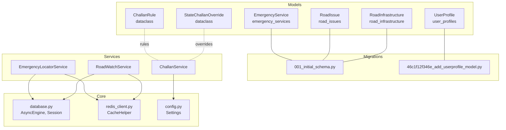
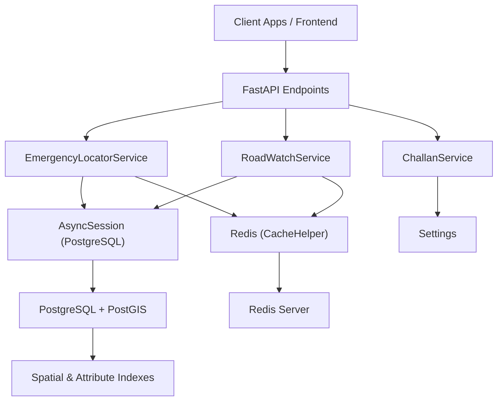
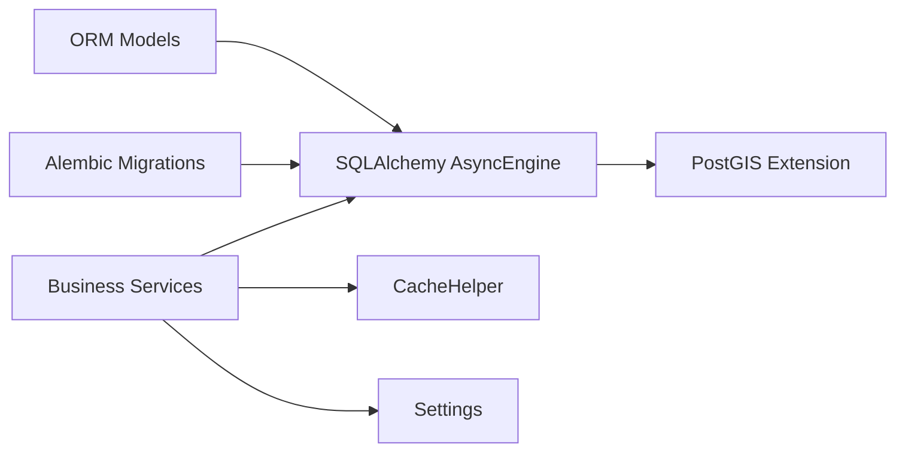

# Core Entities

<cite>
**Referenced Files in This Document**
- [user.py](file://backend/models/user.py)
- [emergency.py](file://backend/models/emergency.py)
- [road_issue.py](file://backend/models/road_issue.py)
- [challan.py](file://backend/models/challan.py)
- [001_initial_schema.py](file://backend/migrations/versions/001_initial_schema.py)
- [46c1f12f346e_add_userprofile_model.py](file://backend/migrations/versions/46c1f12f346e_add_userprofile_model.py)
- [supabase_migration.sql](file://backend/scripts/app/supabase_migration.sql)
- [database.py](file://backend/core/database.py)
- [redis_client.py](file://backend/core/redis_client.py)
- [config.py](file://backend/core/config.py)
- [schemas.py](file://backend/models/schemas.py)
- [emergency_locator.py](file://backend/services/emergency_locator.py)
- [roadwatch_service.py](file://backend/services/roadwatch_service.py)
- [challan_service.py](file://backend/services/challan_service.py)
</cite>

## Table of Contents
1. [Introduction](#introduction)
2. [Project Structure](#project-structure)
3. [Core Components](#core-components)
4. [Architecture Overview](#architecture-overview)
5. [Detailed Component Analysis](#detailed-component-analysis)
6. [Dependency Analysis](#dependency-analysis)
7. [Performance Considerations](#performance-considerations)
8. [Troubleshooting Guide](#troubleshooting-guide)
9. [Conclusion](#conclusion)
10. [Appendices](#appendices)

## Introduction
This document provides comprehensive data model documentation for SafeVixAI’s core entities: User Profile, Emergency Services, Road Issues, and Challan Records. It details entity relationships, field definitions, data types, primary/foreign keys, indexes, and constraints. It also explains validation and business rules, caching strategies with Redis, performance considerations for geospatial queries, and data lifecycle policies.

## Project Structure
The backend uses SQLAlchemy ORM models with Alembic migrations and GeoAlchemy2 for PostGIS-enabled spatial data. Redis is integrated via a helper class for caching. Services encapsulate business logic and coordinate data access.

**Diagram sources**
- [user.py:13-25](file://backend/models/user.py#L13-L25)
- [emergency.py:12-45](file://backend/models/emergency.py#L12-L45)
- [road_issue.py:14-66](file://backend/models/road_issue.py#L14-L66)
- [challan.py:6-53](file://backend/models/challan.py#L6-L53)
- [001_initial_schema.py:22-140](file://backend/migrations/versions/001_initial_schema.py#L22-L140)
- [46c1f12f346e_add_userprofile_model.py:19-34](file://backend/migrations/versions/46c1f12f346e_add_userprofile_model.py#L19-L34)
- [database.py:16-35](file://backend/core/database.py#L16-L35)
- [redis_client.py:10-140](file://backend/core/redis_client.py#L10-L140)
- [config.py:11-181](file://backend/core/config.py#L11-L181)
- [emergency_locator.py:161-507](file://backend/services/emergency_locator.py#L161-L507)
- [roadwatch_service.py:56-325](file://backend/services/roadwatch_service.py#L56-L325)
- [challan_service.py:96-314](file://backend/services/challan_service.py#L96-L314)

**Section sources**
- [user.py:13-25](file://backend/models/user.py#L13-L25)
- [emergency.py:12-45](file://backend/models/emergency.py#L12-L45)
- [road_issue.py:14-66](file://backend/models/road_issue.py#L14-L66)
- [challan.py:6-53](file://backend/models/challan.py#L6-L53)
- [001_initial_schema.py:22-140](file://backend/migrations/versions/001_initial_schema.py#L22-L140)
- [46c1f12f346e_add_userprofile_model.py:19-34](file://backend/migrations/versions/46c1f12f346e_add_userprofile_model.py#L19-L34)
- [database.py:16-35](file://backend/core/database.py#L16-L35)
- [redis_client.py:10-140](file://backend/core/redis_client.py#L10-L140)
- [config.py:11-181](file://backend/core/config.py#L11-L181)

## Core Components
- User Profile: Stores personal and medical details with optional emergency contacts and vehicle info.
- Emergency Services: Spatial catalog of emergency facilities with attributes like category, 24/7 availability, ICU/trauma beds, ratings, and geolocation.
- Road Issues: Reports of road problems with severity, geotagged location, linked authority, status, and optional photos.
- Road Infrastructure: Spatial linestring data for roads with administrative and budget metadata.
- Challan Records: Business logic for calculating challan fines based on violation code, vehicle class, repeat offense, and state-specific overrides.

**Section sources**
- [user.py:13-25](file://backend/models/user.py#L13-L25)
- [emergency.py:12-45](file://backend/models/emergency.py#L12-L45)
- [road_issue.py:14-66](file://backend/models/road_issue.py#L14-L66)
- [challan.py:6-53](file://backend/models/challan.py#L6-L53)

## Architecture Overview
The system integrates PostgreSQL with PostGIS for spatial indexing and queries, caches hot data in Redis, and exposes typed Pydantic models for API responses. Services orchestrate business logic and coordinate caching and persistence.

**Diagram sources**
- [emergency_locator.py:161-507](file://backend/services/emergency_locator.py#L161-L507)
- [roadwatch_service.py:56-325](file://backend/services/roadwatch_service.py#L56-L325)
- [challan_service.py:96-314](file://backend/services/challan_service.py#L96-L314)
- [database.py:16-35](file://backend/core/database.py#L16-L35)
- [redis_client.py:10-140](file://backend/core/redis_client.py#L10-L140)
- [config.py:11-181](file://backend/core/config.py#L11-L181)

## Detailed Component Analysis

### User Profile Entity
- Table: user_profiles
- Fields and Types
  - id: UUID (Primary Key)
  - name: String(255)
  - blood_group: String(10)
  - emergency_contacts: JSON (array of contact dicts)
  - allergies: Text
  - vehicle_details: Text
  - medical_notes: Text
  - created_at: DateTime
  - updated_at: DateTime
- Constraints and Indexes
  - Primary Key: id
  - No explicit indexes; consider adding indexes on frequently filtered fields if needed.
- Validation Rules
  - name is required.
  - JSON fields are validated by the database; ensure client-side normalization.
- Lifecycle
  - Created upon registration; updated on profile edits.

**Section sources**
- [user.py:13-25](file://backend/models/user.py#L13-L25)
- [46c1f12f346e_add_userprofile_model.py:19-34](file://backend/migrations/versions/46c1f12f346e_add_userprofile_model.py#L19-L34)

### Emergency Services Entity
- Table: emergency_services
- Fields and Types
  - id: Integer (Primary Key, Autoincrement)
  - osm_id: BigInteger (Unique)
  - osm_type: String(32)
  - name: Text
  - name_local: Text
  - category: String(32) (Indexed)
  - sub_category: String(64)
  - address: Text
  - phone: String(64)
  - phone_emergency: String(64)
  - website: Text
  - location: Geometry(Point, SRID=4326) (GIST Indexed)
  - city: String(128)
  - district: String(128)
  - state: String(128)
  - state_code: String(2) (Indexed)
  - country_code: String(2) (Default 'IN', Indexed)
  - is_24hr: Boolean (Default True)
  - has_trauma: Boolean (Default False)
  - has_icu: Boolean (Default False)
  - bed_count: Integer
  - rating: Float
  - source: String(32) (Default 'overpass')
  - raw_tags: JSON
  - verified: Boolean (Default False)
  - last_updated: DateTime
  - created_at: DateTime
- Indexes
  - category (B-tree)
  - state_code (B-tree)
  - country_code (B-tree)
  - location (GIST)
- Business Rules
  - Categorization supports hospital, police, ambulance, fire, towing, pharmacy, puncture, showroom.
  - Sorting prioritizes trauma availability, 24/7 availability, then proximity.
- Validation Rules
  - category is required.
  - location is required and must be a valid Point.
  - country_code defaults to 'IN'.
- Lifecycle
  - Created from OSM or local catalog; updated on refresh.

**Section sources**
- [emergency.py:12-45](file://backend/models/emergency.py#L12-L45)
- [001_initial_schema.py:22-63](file://backend/migrations/versions/001_initial_schema.py#L22-L63)
- [supabase_migration.sql:19-62](file://backend/scripts/app/supabase_migration.sql#L19-L62)
- [emergency_locator.py:28-37](file://backend/services/emergency_locator.py#L28-L37)

### Road Issues Entity
- Table: road_issues
- Fields and Types
  - id: Integer (Primary Key, Autoincrement)
  - uuid: UUID (Unique)
  - issue_type: String(64)
  - severity: Integer
  - description: Text
  - location: Geometry(Point, SRID=4326) (GIST Indexed)
  - location_address: Text
  - road_name: Text
  - road_type: String(64)
  - road_number: String(64)
  - photo_url: Text
  - ai_detection: JSONB
  - reporter_id: UUID
  - authority_name: Text
  - authority_phone: String(64)
  - authority_email: Text
  - complaint_ref: String(128)
  - status: String(32) (Default 'open')
  - status_updated: DateTime
  - created_at: DateTime
- Indexes
  - location (GIST)
  - status (B-tree)
- Validation Rules
  - issue_type must be at least 2 non-space characters.
  - Photo uploads validated by magic bytes and content-type whitelist.
- Workflow
  - Reporter submits via RoadWatchService; authority is auto-resolved; status initialized to 'open'; cache version incremented to invalidate nearby queries.
- Lifecycle
  - Status transitions: open → acknowledged → in_progress → resolved/rejected.
  - Photos stored locally with controlled content types and size limits.

**Section sources**
- [road_issue.py:14-40](file://backend/models/road_issue.py#L14-L40)
- [001_initial_schema.py:94-124](file://backend/migrations/versions/001_initial_schema.py#L94-L124)
- [supabase_migration.sql:94-124](file://backend/scripts/app/supabase_migration.sql#L94-L124)
- [roadwatch_service.py:186-253](file://backend/services/roadwatch_service.py#L186-L253)

### Road Infrastructure Entity
- Table: road_infrastructure
- Fields and Types
  - id: Integer (Primary Key, Autoincrement)
  - road_id: String(128) (Unique)
  - road_name: Text
  - road_type: String(64)
  - road_number: String(64)
  - length_km: Float
  - geometry: Geometry(LineString, SRID=4326) (GIST Indexed)
  - state_code: String(2) (Indexed)
  - contractor_name: Text
  - exec_engineer: Text
  - exec_engineer_phone: String(64)
  - budget_sanctioned: BigInteger
  - budget_spent: BigInteger
  - construction_date: Date
  - last_relayed_date: Date
  - next_maintenance: Date
  - project_source: String(64)
  - data_source_url: Text
- Indexes
  - state_code (B-tree)
  - geometry (GIST)
- Usage
  - Used to enrich road issue reports and provide authority metadata.

**Section sources**
- [road_issue.py:42-66](file://backend/models/road_issue.py#L42-L66)
- [001_initial_schema.py:65-92](file://backend/migrations/versions/001_initial_schema.py#L65-L92)
- [supabase_migration.sql:64-92](file://backend/scripts/app/supabase_migration.sql#L64-L92)

### Challan Records and Fine Calculation
- Data Structures
  - ChallanRule: violation_code, section, description, base_fines, repeat_fines, aliases.
  - StateChallanOverride: state_code, violation_code, vehicle_class, base_fine, repeat_fine, section, description, note.
- Business Rules
  - Normalization: violation_code, vehicle_class, state_code.
  - Matching: aliases and exact code.
  - Priority: state overrides override defaults; repeat offense applies repeat_fine if present.
- Inputs
  - violation_code, vehicle_class, state_code, is_repeat.
- Outputs
  - base_fine, repeat_fine, amount_due, section, description, state_override note.
- Data Sources
  - Built-in defaults plus CSV files loaded from configured directories.

**Section sources**
- [challan.py:6-53](file://backend/models/challan.py#L6-L53)
- [challan_service.py:96-314](file://backend/services/challan_service.py#L96-L314)
- [schemas.py:240-257](file://backend/models/schemas.py#L240-L257)

### Entity Relationship Diagram

**Diagram sources**
- [user.py:13-25](file://backend/models/user.py#L13-L25)
- [emergency.py:12-45](file://backend/models/emergency.py#L12-L45)
- [road_issue.py:14-66](file://backend/models/road_issue.py#L14-L66)

## Dependency Analysis
- Models depend on SQLAlchemy declarative base and GeoAlchemy2 for geometry.
- Services depend on AsyncSession for DB access and CacheHelper for Redis.
- Settings define timeouts, cache TTLs, and external service URLs.
- Migrations define PostGIS extension and spatial/GIS indexes.

**Diagram sources**
- [database.py:16-35](file://backend/core/database.py#L16-L35)
- [redis_client.py:10-140](file://backend/core/redis_client.py#L10-L140)
- [config.py:11-181](file://backend/core/config.py#L11-L181)
- [001_initial_schema.py:22-140](file://backend/migrations/versions/001_initial_schema.py#L22-L140)

**Section sources**
- [database.py:16-35](file://backend/core/database.py#L16-L35)
- [redis_client.py:10-140](file://backend/core/redis_client.py#L10-L140)
- [config.py:11-181](file://backend/core/config.py#L11-L181)
- [001_initial_schema.py:22-140](file://backend/migrations/versions/001_initial_schema.py#L22-L140)

## Performance Considerations
- Spatial Queries
  - Location fields use Geometry(Point/Linestring, SRID=4326) with GIST indexes for efficient nearest-neighbor and within-radius searches.
  - Distance computations leverage Geography type casts for accurate meters-based distances.
- Indexes
  - Emergency services: category, state_code, country_code, location(GIST).
  - Road issues: location(GIST), status.
  - Road infrastructure: state_code, geometry(GIST).
- Caching
  - Redis CacheHelper stores serialized JSON payloads with TTLs; falls back to in-memory cache if Redis unavailable.
  - EmergencyLocatorService and RoadWatchService cache nearby results and authority previews.
- Connection Pooling
  - Async engine configured with pool size, overflow, timeout, and recycle settings.
- Uploads
  - Image validation via magic bytes and size limits; streaming writes to avoid memory spikes.

**Section sources**
- [emergency_locator.py:187-216](file://backend/services/emergency_locator.py#L187-L216)
- [roadwatch_service.py:70-77](file://backend/services/roadwatch_service.py#L70-L77)
- [roadwatch_service.py:127-184](file://backend/services/roadwatch_service.py#L127-L184)
- [database.py:16-35](file://backend/core/database.py#L16-L35)
- [redis_client.py:10-140](file://backend/core/redis_client.py#L10-L140)
- [config.py:26-48](file://backend/core/config.py#L26-L48)

## Troubleshooting Guide
- Database Connectivity
  - Use the provided check function to verify connectivity.
- PostGIS Extension
  - Ensure PostGIS is enabled in the database; migrations create it if missing.
- Redis Availability
  - CacheHelper toggles between Redis and in-memory modes; ping indicates health.
- Spatial Indexes
  - Verify GIST indexes exist on geometry columns; rebuild if missing.
- Validation Failures
  - Emergency categories must be supported; issue_type minimum length enforced; upload content types and sizes validated.

**Section sources**
- [database.py:43-50](file://backend/core/database.py#L43-L50)
- [supabase_migration.sql:7-8](file://backend/scripts/app/supabase_migration.sql#L7-L8)
- [redis_client.py:115-124](file://backend/core/redis_client.py#L115-L124)
- [emergency_locator.py:168-176](file://backend/services/emergency_locator.py#L168-L176)
- [roadwatch_service.py:196-200](file://backend/services/roadwatch_service.py#L196-L200)
- [roadwatch_service.py:282-313](file://backend/services/roadwatch_service.py#L282-L313)

## Conclusion
SafeVixAI’s core data model leverages PostGIS for robust spatial operations, maintains clear entity relationships, and employs Redis caching for responsive near-real-time features. Business rules for emergency categorization, road issue workflows, and challan calculations are encapsulated in services with strong validation and extensibility via CSV overrides.

## Appendices

### Data Access Patterns and Caching Strategies
- EmergencyLocatorService
  - Builds cache keys with coordinates, categories, radius, and limit; caches JSON payloads with TTL.
  - Merges database, local, and Overpass results; deduplicates by name, category, and rounded coordinates.
- RoadWatchService
  - Caches authority and infrastructure lookups per lat/lon.
  - Nearby issues cache includes a version key to invalidate across statuses and radius.
  - Increments version on new submissions to force fresh nearby results.
- CacheHelper
  - Supports get/set/delete/increment/get_int with Redis and in-memory fallback.

**Section sources**
- [emergency_locator.py:199-216](file://backend/services/emergency_locator.py#L199-L216)
- [emergency_locator.py:241-299](file://backend/services/emergency_locator.py#L241-L299)
- [roadwatch_service.py:70-77](file://backend/services/roadwatch_service.py#L70-L77)
- [roadwatch_service.py:79-125](file://backend/services/roadwatch_service.py#L79-L125)
- [roadwatch_service.py:139-145](file://backend/services/roadwatch_service.py#L139-L145)
- [roadwatch_service.py:232-233](file://backend/services/roadwatch_service.py#L232-L233)
- [redis_client.py:43-81](file://backend/core/redis_client.py#L43-L81)

### Data Lifecycle, Retention, and Archival Policies
- Current Implementation Notes
  - No explicit retention or archival policies are defined in the codebase for the core entities.
  - Consider implementing:
    - Emergency services: periodic verification and cleanup of unverified entries.
    - Road issues: status-based retention (open/acknowledged vs resolved/rejected) and archival after X months.
    - User profiles: opt-out deletion and anonymization after account deactivation.
    - Challan records: maintain historical overrides and base rules for audit trails.
- Recommendations
  - Define TTLs for cache keys aligned with operational needs.
  - Implement scheduled jobs to prune stale spatial data and enforce compliance.

[No sources needed since this section provides general guidance]