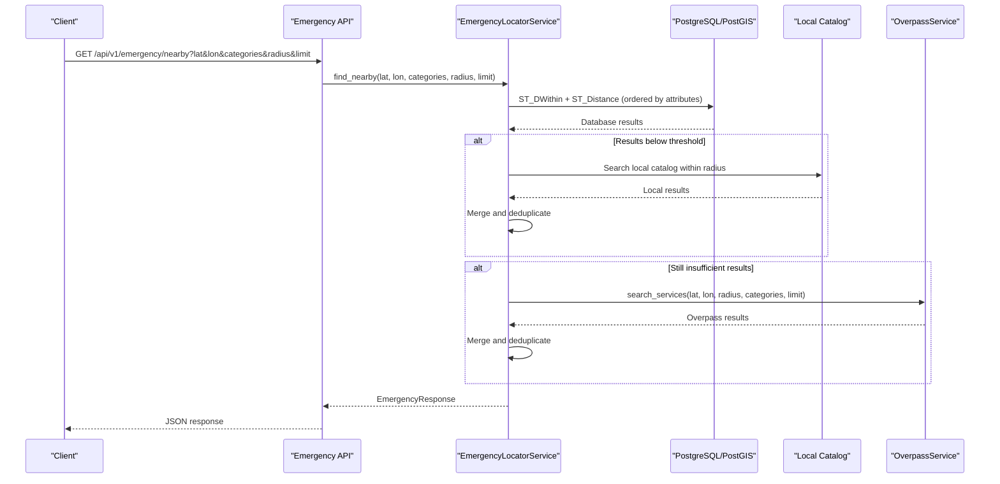
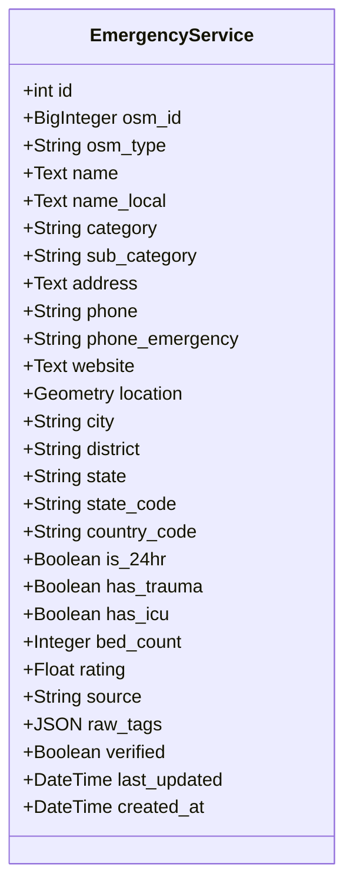
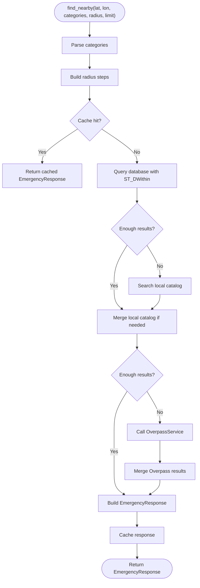
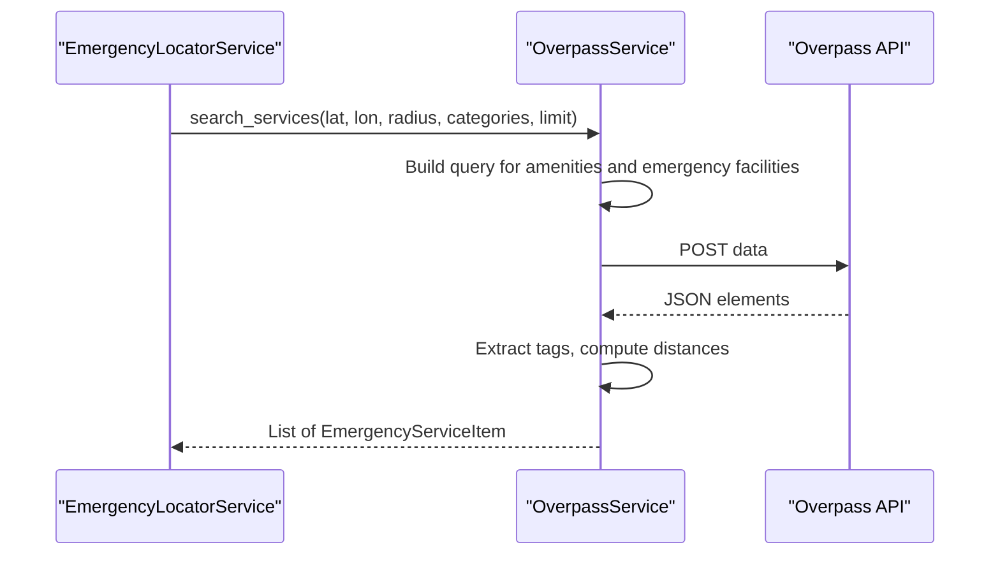
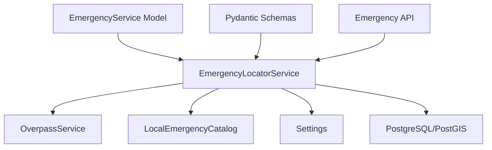

# Emergency Services Entity

<cite>
**Referenced Files in This Document**
- [emergency.py](file://backend/models/emergency.py)
- [001_initial_schema.py](file://backend/migrations/versions/001_initial_schema.py)
- [schemas.py](file://backend/models/schemas.py)
- [emergency.py](file://backend/api/v1/emergency.py)
- [emergency_locator.py](file://backend/services/emergency_locator.py)
- [overpass_service.py](file://backend/services/overpass_service.py)
- [seed_emergency.py](file://backend/scripts/app/seed_emergency.py)
- [config.py](file://backend/core/config.py)
- [local_emergency_catalog.py](file://backend/services/local_emergency_catalog.py)
- [test_emergency.py](file://backend/tests/test_emergency.py)
- [fetch_hospitals.py](file://scripts/data/fetch_hospitals.py)
- [_overpass_utils.py](file://scripts/data/_overpass_utils.py)
</cite>

## Table of Contents
1. [Introduction](#introduction)
2. [Project Structure](#project-structure)
3. [Core Components](#core-components)
4. [Architecture Overview](#architecture-overview)
5. [Detailed Component Analysis](#detailed-component-analysis)
6. [Dependency Analysis](#dependency-analysis)
7. [Performance Considerations](#performance-considerations)
8. [Troubleshooting Guide](#troubleshooting-guide)
9. [Conclusion](#conclusion)

## Introduction
This document provides comprehensive data model documentation for the Emergency Services entities within the SafeVixAI platform. It focuses on the EmergencyService entity, its associated EmergencyCategory system, spatial data handling, and the integrated emergency locator service. The documentation covers table structure, spatial data types, service categories, location coordinates, operational attributes, foreign key relationships, spatial indexing for proximity queries, geospatial data validation rules, tiered radius fallback mechanisms, service availability patterns, emergency service categorization (hospital, police, fire, ambulance), spatial query patterns for nearby service discovery, and performance optimization for geospatial searches. It also documents integration with Overpass API data sources and emergency service verification workflows.

## Project Structure
The emergency services functionality spans several modules:
- Data model definition for EmergencyService
- Database migration defining the emergency_services table and spatial indexes
- Pydantic schemas for API responses and service items
- API endpoints for emergency services discovery and SOS payload generation
- Emergency locator service orchestrating database queries, local catalog, and Overpass fallback
- Overpass service for fetching emergency facilities from OpenStreetMap
- Seeding scripts for populating emergency data from Overpass
- Configuration for emergency radius steps, caching, and external service timeouts
- Local emergency catalog loader for CSV-based emergency facilities
- Tests validating emergency locator behavior and fallback mechanisms

```mermaid
graph TB
subgraph "Models"
ES["EmergencyService<br/>Table: emergency_services"]
SC["Schemas<br/>EmergencyServiceItem, EmergencyResponse"]
end
subgraph "Services"
EL["EmergencyLocatorService<br/>Nearby search, fallback, merge"]
OP["OverpassService<br/>OSM data extraction"]
LC["LocalEmergencyCatalog<br/>CSV loader"]
end
subgraph "API"
API["Emergency API<br/>/api/v1/emergency"]
end
subgraph "Data"
MIG["Migration<br/>001_initial_schema"]
SEED["Seed Script<br/>seed_emergency.py"]
end
ES --> EL
SC --> EL
EL --> OP
EL --> LC
API --> EL
MIG --> ES
SEED --> ES
```

**Diagram sources**
- [emergency.py:12-45](file://backend/models/emergency.py#L12-L45)
- [001_initial_schema.py:25-63](file://backend/migrations/versions/001_initial_schema.py#L25-L63)
- [schemas.py:36-66](file://backend/models/schemas.py#L36-L66)
- [emergency_locator.py:161-507](file://backend/services/emergency_locator.py#L161-L507)
- [overpass_service.py:24-249](file://backend/services/overpass_service.py#L24-L249)
- [local_emergency_catalog.py:25-243](file://backend/services/local_emergency_catalog.py#L25-L243)
- [emergency.py:12-83](file://backend/api/v1/emergency.py#L12-L83)
- [seed_emergency.py:70-149](file://backend/scripts/app/seed_emergency.py#L70-L149)

**Section sources**
- [emergency.py:12-45](file://backend/models/emergency.py#L12-L45)
- [001_initial_schema.py:22-63](file://backend/migrations/versions/001_initial_schema.py#L22-L63)
- [schemas.py:36-66](file://backend/models/schemas.py#L36-L66)
- [emergency_locator.py:161-507](file://backend/services/emergency_locator.py#L161-L507)
- [overpass_service.py:24-249](file://backend/services/overpass_service.py#L24-L249)
- [local_emergency_catalog.py:25-243](file://backend/services/local_emergency_catalog.py#L25-L243)
- [emergency.py:12-83](file://backend/api/v1/emergency.py#L12-L83)
- [seed_emergency.py:70-149](file://backend/scripts/app/seed_emergency.py#L70-L149)

## Core Components
This section details the EmergencyService entity, its schema, and related components.

- EmergencyService model defines the emergency_services table with:
  - Primary key id and optional OSM identifiers
  - Name fields (international and local)
  - Category and sub-category fields for classification
  - Address, contact information (phone, emergency phone), website
  - Location stored as a POINT geometry in SRID 4326 with GIST spatial index
  - Administrative fields (city, district, state, state_code, country_code)
  - Operational attributes (24-hour availability, trauma/icu capabilities, bed count, rating)
  - Source attribution (default 'overpass'), raw tags, verification flag
  - Timestamps for creation and updates

- Emergency categories supported include hospital, police, ambulance, fire, towing, pharmacy, puncture, and showroom.

- Pydantic schemas define the response models:
  - EmergencyServiceItem: standardized representation of a service with coordinates, distance, and attributes
  - EmergencyResponse: list of services, count, radius used, and source
  - SosResponse: includes emergency numbers alongside services

- API endpoints:
  - GET /api/v1/emergency/nearby: proximity search with category filtering, radius, and limit
  - GET /api/v1/emergency/sos: builds an SOS payload combining nearby services and national emergency numbers
  - GET /api/v1/emergency/numbers: returns emergency contact numbers
  - GET /api/v1/emergency/safe-spaces: returns nearby safe public spaces

**Section sources**
- [emergency.py:12-45](file://backend/models/emergency.py#L12-L45)
- [schemas.py:10-66](file://backend/models/schemas.py#L10-L66)
- [emergency.py:19-83](file://backend/api/v1/emergency.py#L19-L83)

## Architecture Overview
The emergency locator service integrates multiple data sources to provide robust nearby service discovery:



**Diagram sources**
- [emergency.py:19-40](file://backend/api/v1/emergency.py#L19-L40)
- [emergency_locator.py:187-374](file://backend/services/emergency_locator.py#L187-L374)
- [overpass_service.py:35-79](file://backend/services/overpass_service.py#L35-L79)

## Detailed Component Analysis

### EmergencyService Data Model
The EmergencyService entity encapsulates emergency facility data with strong spatial semantics:

- Spatial data type: POINT geometry in SRID 4326 with GIST index for efficient proximity queries
- Indexes: category, state_code, country_code, and location GIST index
- Operational attributes: is_24hr, has_trauma, has_icu, bed_count, rating
- Verification and provenance: source (default 'overpass'), raw_tags, verified flag
- Administrative boundaries: city, district, state, state_code, country_code



**Diagram sources**
- [emergency.py:12-45](file://backend/models/emergency.py#L12-L45)

**Section sources**
- [emergency.py:12-45](file://backend/models/emergency.py#L12-L45)
- [001_initial_schema.py:25-63](file://backend/migrations/versions/001_initial_schema.py#L25-L63)

### Emergency Locator Service
The EmergencyLocatorService orchestrates multi-source emergency discovery:

- Supported categories: hospital, police, ambulance, fire, towing, pharmacy, puncture, showroom
- Tiered radius fallback: configurable radius steps (e.g., 500m, 1km, 5km, 10km, 25km, 50km)
- Priority ordering: trauma availability, 24-hour availability, distance
- Multi-source merging: database results, local catalog, Overpass fallback
- Caching: Redis-based cache with TTL configuration
- City bundles: pre-computed offline bundles for major Indian cities



**Diagram sources**
- [emergency_locator.py:187-374](file://backend/services/emergency_locator.py#L187-L374)

**Section sources**
- [emergency_locator.py:28-37](file://backend/services/emergency_locator.py#L28-L37)
- [emergency_locator.py:178-185](file://backend/services/emergency_locator.py#L178-L185)
- [emergency_locator.py:301-374](file://backend/services/emergency_locator.py#L301-L374)
- [emergency_locator.py:375-422](file://backend/services/emergency_locator.py#L375-L422)
- [emergency_locator.py:429-448](file://backend/services/emergency_locator.py#L429-L448)
- [emergency_locator.py:482-507](file://backend/services/emergency_locator.py#L482-L507)

### Overpass Service Integration
The OverpassService extracts emergency facilities from OpenStreetMap:

- Query building: searches around a point for amenities and emergency facilities
- Classification: maps OSM tags to emergency categories (hospital, police, fire, pharmacy, ambulance, towing)
- Feature extraction: parses coordinates, phone numbers, addresses, and operational attributes
- Distance calculation: Haversine formula for distance computation
- Robustness: multiple endpoints, retry/backoff, and error handling



**Diagram sources**
- [overpass_service.py:35-79](file://backend/services/overpass_service.py#L35-L79)
- [overpass_service.py:136-151](file://backend/services/overpass_service.py#L136-L151)

**Section sources**
- [overpass_service.py:14-249](file://backend/services/overpass_service.py#L14-L249)

### Local Emergency Catalog
The local catalog loads emergency facilities from CSV files:

- Hospital directory and NIN health facilities
- Generic CSV loading for police, fire, ambulance, towing, pharmacy
- Coordinate parsing, address composition, and attribute inference
- Deduplication and normalization

**Section sources**
- [local_emergency_catalog.py:25-243](file://backend/services/local_emergency_catalog.py#L25-L243)

### API Endpoints
The emergency API provides:
- Nearby services discovery with category filtering and radius limits
- SOS payload generation combining nearby services and national emergency numbers
- Emergency numbers lookup
- Safe spaces discovery for women safety

**Section sources**
- [emergency.py:19-83](file://backend/api/v1/emergency.py#L19-L83)

### Seeding and Data Validation
Seeding scripts populate the database from Overpass:
- City-wise ingestion with configurable limits
- Upsert logic preserving OSM uniqueness
- Export of offline bundles and GeoJSON for frontend consumption
- Validation rules for coordinate parsing and deduplication

**Section sources**
- [seed_emergency.py:70-149](file://backend/scripts/app/seed_emergency.py#L70-L149)
- [fetch_hospitals.py:22-35](file://scripts/data/fetch_hospitals.py#L22-L35)
- [_overpass_utils.py:59-87](file://scripts/data/_overpass_utils.py#L59-L87)

## Dependency Analysis
The emergency services module exhibits clear separation of concerns:



**Diagram sources**
- [emergency.py:12-45](file://backend/models/emergency.py#L12-L45)
- [schemas.py:36-66](file://backend/models/schemas.py#L36-L66)
- [emergency.py:12-83](file://backend/api/v1/emergency.py#L12-L83)
- [emergency_locator.py:161-507](file://backend/services/emergency_locator.py#L161-L507)
- [overpass_service.py:24-249](file://backend/services/overpass_service.py#L24-L249)
- [local_emergency_catalog.py:25-243](file://backend/services/local_emergency_catalog.py#L25-L243)
- [config.py:11-181](file://backend/core/config.py#L11-L181)

**Section sources**
- [emergency_locator.py:161-507](file://backend/services/emergency_locator.py#L161-L507)
- [config.py:26-32](file://backend/core/config.py#L26-L32)

## Performance Considerations
Key performance characteristics and optimizations:

- Spatial indexing: GIST index on location enables efficient ST_DWithin and ST_Distance queries
- Priority ordering: Results ordered by trauma availability, 24-hour availability, and distance to minimize downstream sorting costs
- Tiered radius fallback: Starts small and expands until minimum result threshold is met, reducing unnecessary large-radius scans
- Caching: Redis cache stores serialized EmergencyResponse with TTL to reduce repeated database and external API calls
- Limit controls: API and internal limits prevent excessive result sets
- Configuration-driven radius steps: Environment variable allows tuning for different deployment scenarios

[No sources needed since this section provides general guidance]

## Troubleshooting Guide
Common issues and resolutions:

- Overpass API unavailability: EmergencyLocatorService catches ExternalServiceError and falls back to local catalog or database results; configure multiple endpoints and retry backoff
- Insufficient results: Increase radius or adjust emergency_min_results; verify category filters and ensure local catalog coverage
- Cache connectivity: CacheHelper falls back to memory backend; monitor cache availability and TTL settings
- Data validation: Seed scripts validate coordinates and deduplicate entries; ensure CSV formatting and coordinate precision
- Database connectivity: Verify PostGIS extension installation and spatial indexes; confirm connection pool settings

**Section sources**
- [emergency_locator.py:342-355](file://backend/services/emergency_locator.py#L342-L355)
- [test_emergency.py:173-222](file://backend/tests/test_emergency.py#L173-L222)
- [config.py:38-48](file://backend/core/config.py#L38-L48)

## Conclusion
The Emergency Services entity and its surrounding infrastructure provide a robust, scalable solution for emergency facility discovery in India. The model leverages PostGIS for spatial efficiency, integrates multiple data sources (database, local CSV, Overpass), and implements intelligent fallback mechanisms with caching and configurable radius steps. The API exposes straightforward endpoints for nearby service discovery, SOS payload generation, and emergency numbers lookup, while the seeding pipeline ensures fresh, validated data from OpenStreetMap.