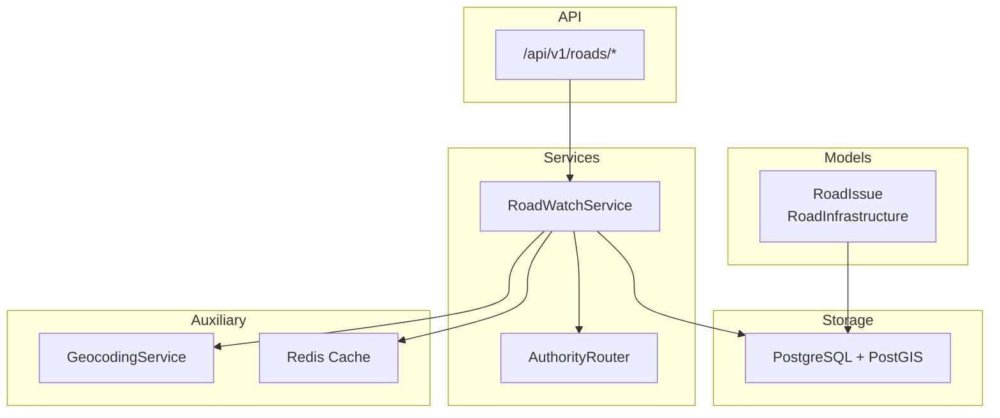
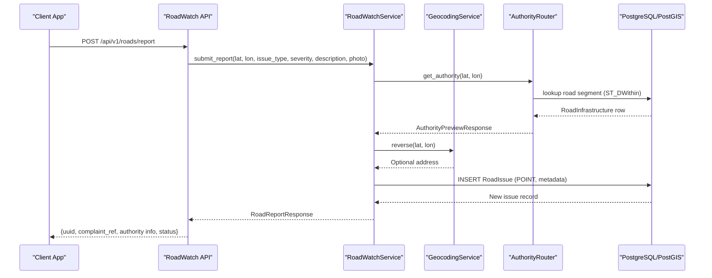
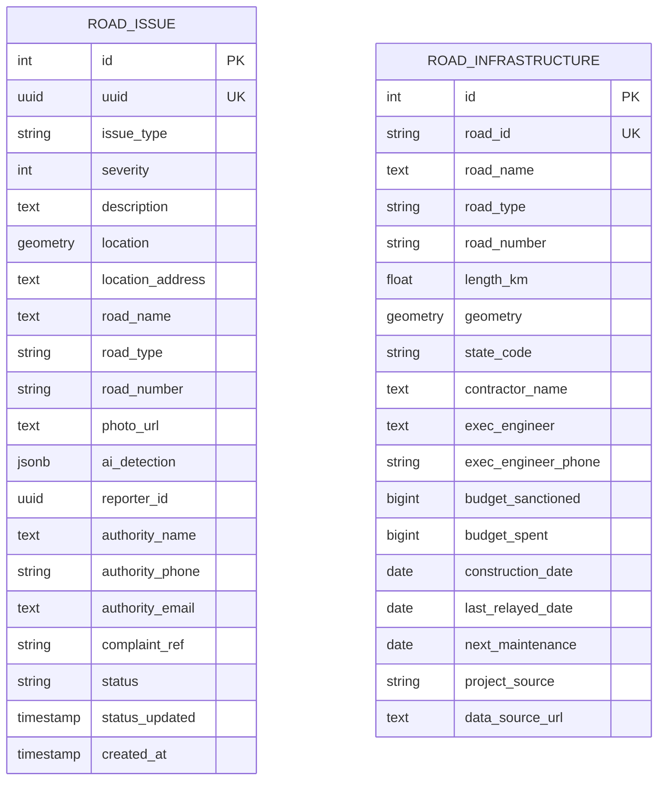
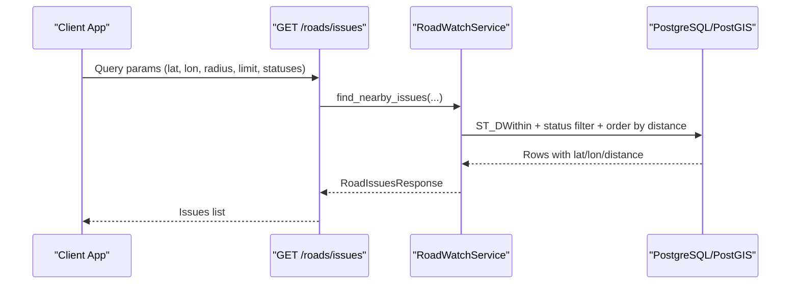
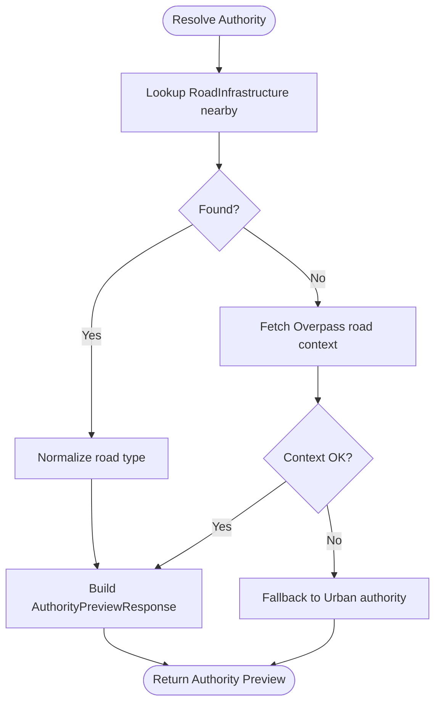
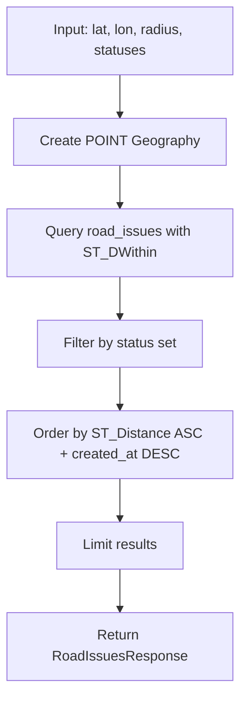
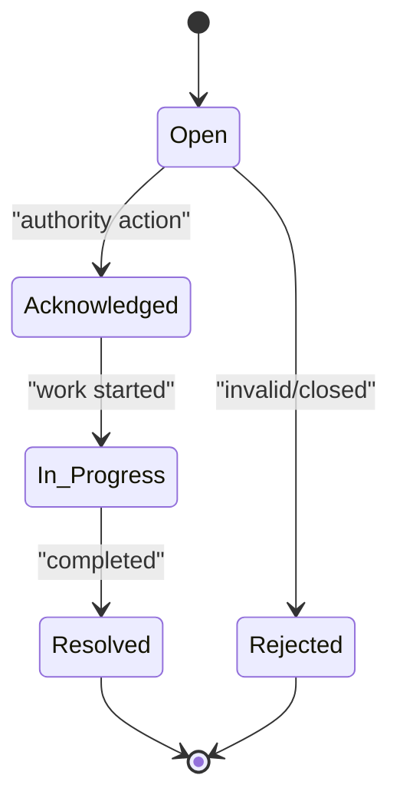
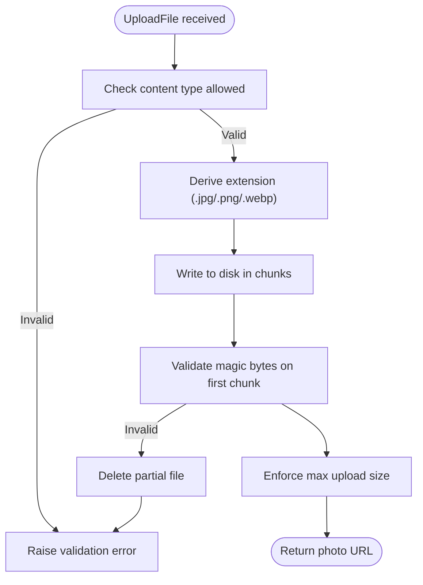
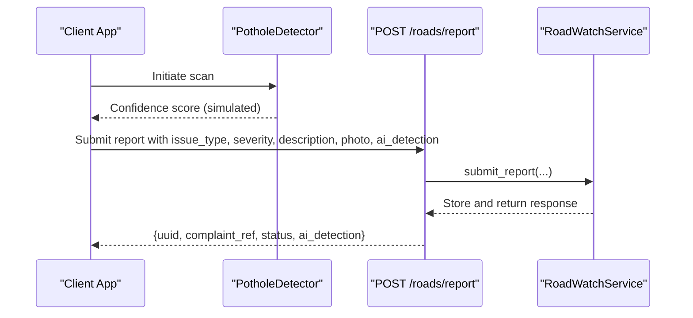
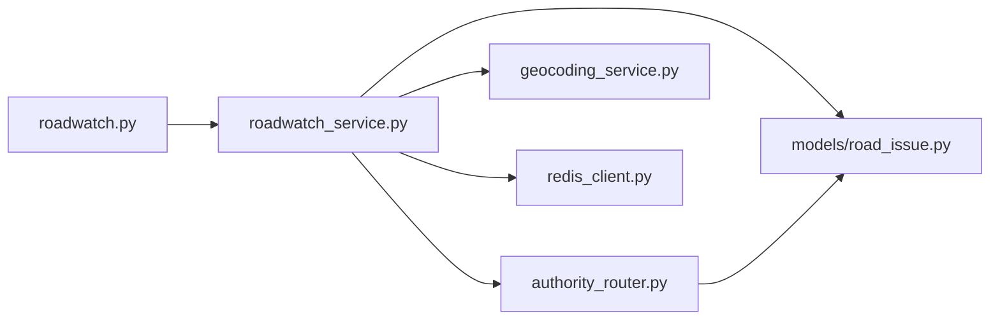

# Road Issues Entity

<cite>
**Referenced Files in This Document**
- [road_issue.py](file://backend/models/road_issue.py)
- [001_initial_schema.py](file://backend/migrations/versions/001_initial_schema.py)
- [roadwatch.py](file://backend/api/v1/roadwatch.py)
- [roadwatch_service.py](file://backend/services/roadwatch_service.py)
- [authority_router.py](file://backend/services/authority_router.py)
- [schemas.py](file://backend/models/schemas.py)
- [seed_roadwatch_sample.py](file://backend/scripts/app/seed_roadwatch_sample.py)
- [test_roadwatch.py](file://backend/tests/test_roadwatch.py)
- [road_issues_tool.py](file://chatbot_service/tools/road_issues_tool.py)
- [PotholeDetector.tsx](file://frontend/components/PotholeDetector.tsx)
</cite>

## Table of Contents
1. [Introduction](#introduction)
2. [Project Structure](#project-structure)
3. [Core Components](#core-components)
4. [Architecture Overview](#architecture-overview)
5. [Detailed Component Analysis](#detailed-component-analysis)
6. [Dependency Analysis](#dependency-analysis)
7. [Performance Considerations](#performance-considerations)
8. [Troubleshooting Guide](#troubleshooting-guide)
9. [Conclusion](#conclusion)
10. [Appendices](#appendices)

## Introduction
This document describes the Road Issues entity model and related workflows in the SafeVixAI backend. It covers the road issue table structure with geotagged reporting, issue type classifications, status tracking, and authority routing. It documents spatial data handling for precise location capture, the issue type taxonomy observed in the codebase (including potholes, waterlogging), and the automated authority assignment logic. Reporting workflow states, image attachment handling, and community verification processes are explained. Examples of issue reporting data structures, spatial query patterns for issue aggregation, and performance considerations for large-scale reporting data are included. Finally, it outlines integration points with AI-powered pothole detection and automatic issue categorization systems.

## Project Structure
The RoadWatch subsystem spans models, APIs, services, migrations, tests, and tools:
- Models define the persistent entities and spatial columns.
- API routes expose endpoints for reporting, nearby issues discovery, and authority/infrastructure previews.
- Services encapsulate business logic: authority routing, spatial queries, image uploads, and caching.
- Migrations define the initial schema with PostGIS extensions and spatial indexes.
- Tests validate endpoints, status filtering, and fallback behavior.
- Tools integrate with the chatbot to surface nearby issues.

**Diagram sources**
- [road_issue.py:14-66](file://backend/models/road_issue.py#L14-L66)
- [roadwatch.py:19-97](file://backend/api/v1/roadwatch.py#L19-L97)
- [roadwatch_service.py:56-325](file://backend/services/roadwatch_service.py#L56-L325)
- [authority_router.py:42-143](file://backend/services/authority_router.py#L42-L143)

**Section sources**
- [road_issue.py:14-66](file://backend/models/road_issue.py#L14-L66)
- [roadwatch.py:19-97](file://backend/api/v1/roadwatch.py#L19-L97)
- [roadwatch_service.py:56-325](file://backend/services/roadwatch_service.py#L56-L325)
- [authority_router.py:42-143](file://backend/services/authority_router.py#L42-L143)

## Core Components
- RoadIssue: Persistent entity representing a reported road issue with spatial coordinates, metadata, and status.
- RoadInfrastructure: Persistent entity representing road segments with LINESTRING geometry and administrative/project details.
- RoadWatchService: Orchestrates reporting, spatial queries, authority resolution, geocoding, and caching.
- AuthorityRouter: Resolves issuing authority based on road type derived from spatial context.
- API endpoints: Expose reporting, nearby issues, authority preview, and infrastructure preview.

Key data model highlights:
- Spatial columns: POINT for RoadIssue location; LINESTRING for RoadInfrastructure geometry.
- Status tracking: Enum-like string values with predefined active and all statuses.
- Authority assignment: Determined by normalized road type codes (NH, SH, MDR, VILLAGE, URBAN).
- Image attachments: Stored on disk with validated content types and magic bytes; URL returned in reports.

**Section sources**
- [road_issue.py:14-66](file://backend/models/road_issue.py#L14-L66)
- [roadwatch_service.py:28-325](file://backend/services/roadwatch_service.py#L28-L325)
- [authority_router.py:25-143](file://backend/services/authority_router.py#L25-L143)
- [schemas.py:11-161](file://backend/models/schemas.py#L11-L161)

## Architecture Overview
The RoadWatch workflow integrates user reporting, spatial indexing, authority routing, and caching.

**Diagram sources**
- [roadwatch.py:73-97](file://backend/api/v1/roadwatch.py#L73-L97)
- [roadwatch_service.py:186-253](file://backend/services/roadwatch_service.py#L186-L253)
- [authority_router.py:48-79](file://backend/services/authority_router.py#L48-L79)

## Detailed Component Analysis

### Data Model: RoadIssue and RoadInfrastructure
- RoadIssue fields include identifiers, issue classification, severity, description, geotagged location, optional address and road metadata, photo URL, AI detection metadata, reporter identity, authority contact info, complaint reference, status, timestamps, and creation time.
- RoadInfrastructure fields include identifiers, road attributes, LINESTRING geometry, administrative and budget metadata, and project dates.
- Both entities leverage PostGIS Geometry/Geography types and GIST indexes for efficient spatial queries.

**Diagram sources**
- [road_issue.py:14-66](file://backend/models/road_issue.py#L14-L66)
- [001_initial_schema.py:94-124](file://backend/migrations/versions/001_initial_schema.py#L94-L124)

**Section sources**
- [road_issue.py:14-66](file://backend/models/road_issue.py#L14-L66)
- [001_initial_schema.py:94-124](file://backend/migrations/versions/001_initial_schema.py#L94-L124)

### API Endpoints and Workflows
- GET /api/v1/roads/issues: Returns nearby issues filtered by status, radius, and limit; supports caching.
- GET /api/v1/roads/authority: Returns authority preview based on spatial context.
- GET /api/v1/roads/infrastructure: Returns infrastructure details near a point.
- POST /api/v1/roads/report: Submits a new issue with validation, authority assignment, optional geocoding, and photo upload.

**Diagram sources**
- [roadwatch.py:26-50](file://backend/api/v1/roadwatch.py#L26-L50)
- [roadwatch_service.py:127-184](file://backend/services/roadwatch_service.py#L127-L184)

**Section sources**
- [roadwatch.py:26-97](file://backend/api/v1/roadwatch.py#L26-L97)
- [roadwatch_service.py:127-184](file://backend/services/roadwatch_service.py#L127-L184)

### Authority Routing and Road Type Normalization
- AuthorityRouter resolves issuing authority using:
  - RoadInfrastructure lookup within a small radius.
  - Fallback to Overpass-based road context.
  - Final fallback to a default urban authority.
- Road type normalization maps various inputs to canonical codes (NH, SH, MDR, VILLAGE, URBAN).

**Diagram sources**
- [authority_router.py:48-79](file://backend/services/authority_router.py#L48-L79)
- [authority_router.py:128-143](file://backend/services/authority_router.py#L128-L143)

**Section sources**
- [authority_router.py:42-143](file://backend/services/authority_router.py#L42-L143)

### Spatial Queries and Indexing
- Spatial indexing uses GIST on POINT for road_issues and on LINESTRING for road_infrastructure.
- Distance calculations use Geography types and ST_DWithin for radius-based filtering.
- Nearby issues query orders by distance and creation time, and applies status filters.

**Diagram sources**
- [roadwatch_service.py:147-160](file://backend/services/roadwatch_service.py#L147-L160)
- [001_initial_schema.py:117-123](file://backend/migrations/versions/001_initial_schema.py#L117-L123)

**Section sources**
- [roadwatch_service.py:127-184](file://backend/services/roadwatch_service.py#L127-L184)
- [001_initial_schema.py:117-123](file://backend/migrations/versions/001_initial_schema.py#L117-L123)

### Reporting Workflow States and Data Structures
- Issue types observed in the codebase include pothole and waterlogging.
- Status lifecycle includes open, acknowledged, in_progress, resolved, rejected; active statuses are open, acknowledged, in_progress.
- Reporting endpoint validates inputs, assigns authority, optionally geocodes, saves photo, persists issue, and increments cache version.

**Diagram sources**
- [roadwatch_service.py:28-29](file://backend/services/roadwatch_service.py#L28-L29)

**Section sources**
- [roadwatch_service.py:186-253](file://backend/services/roadwatch_service.py#L186-L253)
- [test_roadwatch.py:50-87](file://backend/tests/test_roadwatch.py#L50-L87)

### Image Attachment Handling
- Supported content types and inferred extensions are validated.
- Magic bytes are checked on the first chunk to ensure image integrity.
- Files are written to disk with a UUID-based filename; URLs are constructed from configured base URL or a default uploads path.
- Upload size limits and cleanup on failure are enforced.

**Diagram sources**
- [roadwatch_service.py:275-324](file://backend/services/roadwatch_service.py#L275-L324)

**Section sources**
- [roadwatch_service.py:31-54](file://backend/services/roadwatch_service.py#L31-L54)
- [roadwatch_service.py:275-324](file://backend/services/roadwatch_service.py#L275-L324)

### Community Verification Processes
- The codebase does not implement explicit community voting or peer verification for road issues.
- Authority assignment is automated based on road type normalization and fallback logic.
- Future enhancements could introduce community flags or moderation queues, but are not present here.

[No sources needed since this section synthesizes absence of features without quoting specific files]

### AI-Powered Pothole Detection and Automatic Categorization
- Frontend includes a PotholeDetector component that simulates AI scanning and confidence scoring.
- RoadIssue includes an ai_detection JSONB field intended for storing AI model outputs.
- The backend’s RoadWatchService does not currently parse ai_detection; it stores and returns the field as provided.
- Integration points:
  - Frontend captures camera frames and triggers AI inference (simulated in the component).
  - AI model outputs can populate the ai_detection JSONB field during submission.
  - AuthorityRouter and RoadWatchService remain agnostic to issue type classification, relying on the submitted issue_type.

**Diagram sources**
- [PotholeDetector.tsx:43-54](file://frontend/components/PotholeDetector.tsx#L43-L54)
- [roadwatch.py:73-97](file://backend/api/v1/roadwatch.py#L73-L97)
- [roadwatch_service.py:212-227](file://backend/services/roadwatch_service.py#L212-L227)
- [road_issue.py:31](file://backend/models/road_issue.py#L31)

**Section sources**
- [PotholeDetector.tsx:11-146](file://frontend/components/PotholeDetector.tsx#L11-L146)
- [road_issue.py:31](file://backend/models/road_issue.py#L31)
- [roadwatch_service.py:212-227](file://backend/services/roadwatch_service.py#L212-L227)

### Example Reporting Data Structures
- RoadReportResponse includes identifiers, authority info, road metadata, engineer details, budget info, photo URL, and status.
- RoadIssueItem includes issue metadata, spatial coordinates, address, authority, status, and computed distance.

**Section sources**
- [schemas.py:142-161](file://backend/models/schemas.py#L142-L161)
- [schemas.py:119-140](file://backend/models/schemas.py#L119-L140)

### Sample Data and Seeding
- Seed script inserts sample road infrastructure segments and issues with realistic geometries and statuses.
- Demonstrates typical values for issue_type (e.g., pothole, waterlogging) and status transitions.

**Section sources**
- [seed_roadwatch_sample.py:48-79](file://backend/scripts/app/seed_roadwatch_sample.py#L48-L79)

## Dependency Analysis
- RoadWatchService depends on Settings, CacheHelper, GeocodingService, and AuthorityRouter.
- AuthorityRouter depends on Settings, Redis Cache, OverpassService, and RoadInfrastructure lookup.
- API routes depend on RoadWatchService and enforce status validation.

**Diagram sources**
- [roadwatch.py:13](file://backend/api/v1/roadwatch.py#L13)
- [roadwatch_service.py:56-68](file://backend/services/roadwatch_service.py#L56-L68)
- [authority_router.py:42-46](file://backend/services/authority_router.py#L42-L46)

**Section sources**
- [roadwatch.py:13](file://backend/api/v1/roadwatch.py#L13)
- [roadwatch_service.py:56-68](file://backend/services/roadwatch_service.py#L56-L68)
- [authority_router.py:42-46](file://backend/services/authority_router.py#L42-L46)

## Performance Considerations
- Spatial indexing: GIST indexes on road_issues.location and road_infrastructure.geometry enable efficient ST_DWithin and distance computations.
- Caching:
  - Authority and infrastructure previews are cached with TTL.
  - Nearby issues queries are cached with a version key; submission increments the version to invalidate stale caches.
- Query optimization:
  - Radius-based filtering with ST_DWithin and distance ordering.
  - Status filtering reduces result sets.
- Upload handling:
  - Streaming writes and magic-byte checks prevent invalid or oversized uploads.
  - Cleanup on errors avoids orphaned files.

[No sources needed since this section provides general guidance]

## Troubleshooting Guide
- Unsupported statuses in nearby issues:
  - Validation rejects unknown status values; ensure statuses are from the allowed set.
- Photo upload failures:
  - Unsupported content type or invalid magic bytes trigger validation errors.
  - Exceeding max upload size raises a validation error; adjust settings accordingly.
- Geocoding failures:
  - Reverse geocoding errors are handled gracefully; location_address remains unset.
- Authority resolution fallback:
  - When Overpass is unavailable or no infrastructure found, a default urban authority is returned.

**Section sources**
- [roadwatch.py:36-42](file://backend/api/v1/roadwatch.py#L36-L42)
- [roadwatch_service.py:282-313](file://backend/services/roadwatch_service.py#L282-L313)
- [test_roadwatch.py:145-151](file://backend/tests/test_roadwatch.py#L145-L151)
- [test_roadwatch.py:218-240](file://backend/tests/test_roadwatch.py#L218-L240)

## Conclusion
The RoadWatch subsystem provides a robust foundation for geotagged road issue reporting, spatial discovery, and automated authority assignment. The data model leverages PostGIS for precise spatial operations, while services implement caching, validation, and fallbacks for reliability. Current workflows support manual issue classification; future integrations can leverage AI outputs stored in ai_detection for automatic categorization and enhanced triage.

## Appendices

### API Definitions
- GET /api/v1/roads/issues
  - Query params: lat, lon, radius, limit, statuses
  - Response: RoadIssuesResponse
- GET /api/v1/roads/authority
  - Query params: lat, lon
  - Response: AuthorityPreviewResponse
- GET /api/v1/roads/infrastructure
  - Query params: lat, lon
  - Response: RoadInfrastructureResponse
- POST /api/v1/roads/report
  - Form fields: lat, lon, issue_type, severity, description, photo
  - Response: RoadReportResponse

**Section sources**
- [roadwatch.py:26-97](file://backend/api/v1/roadwatch.py#L26-L97)

### Integration with Chatbot
- The chatbot tool can query nearby issues via a backend client, enabling conversational discovery of road conditions.

**Section sources**
- [road_issues_tool.py:10-14](file://chatbot_service/tools/road_issues_tool.py#L10-L14)