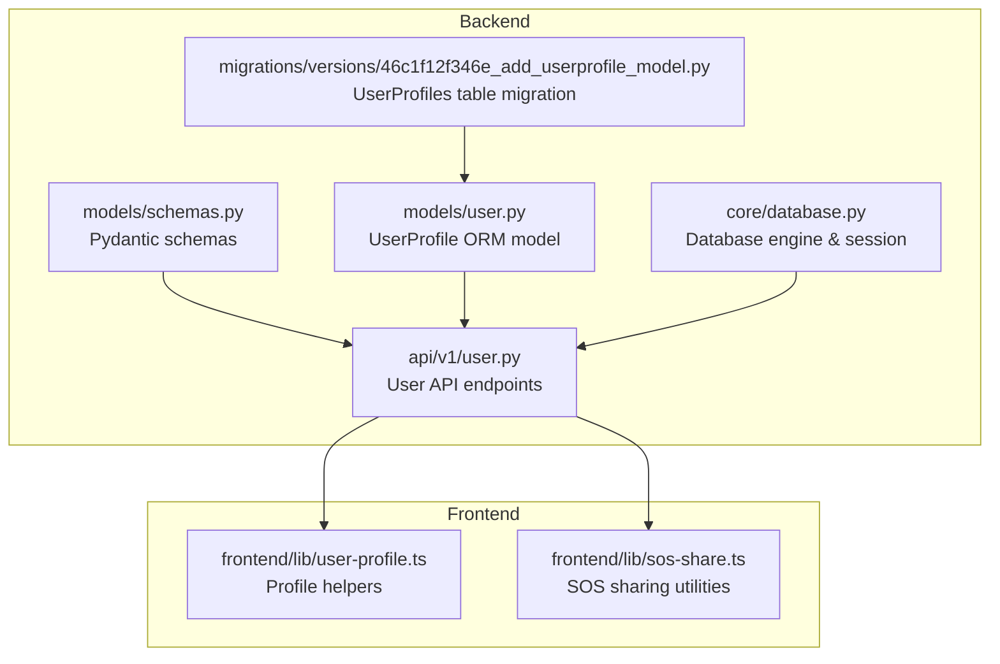
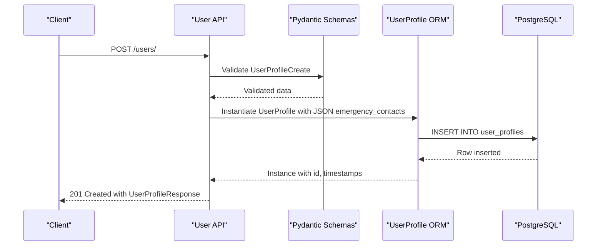
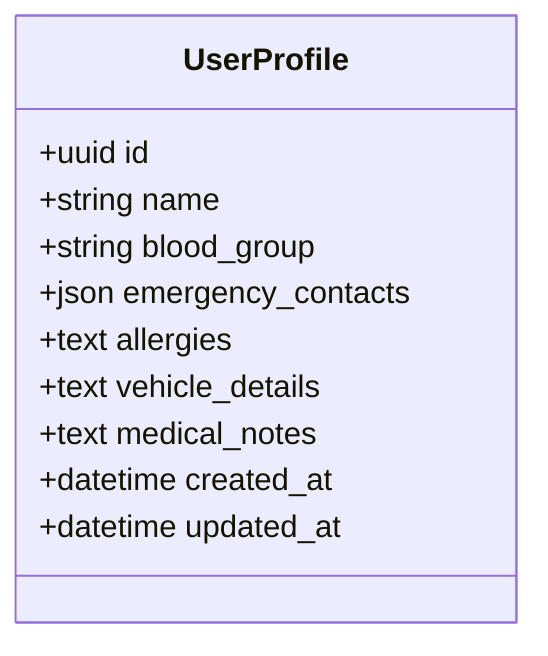
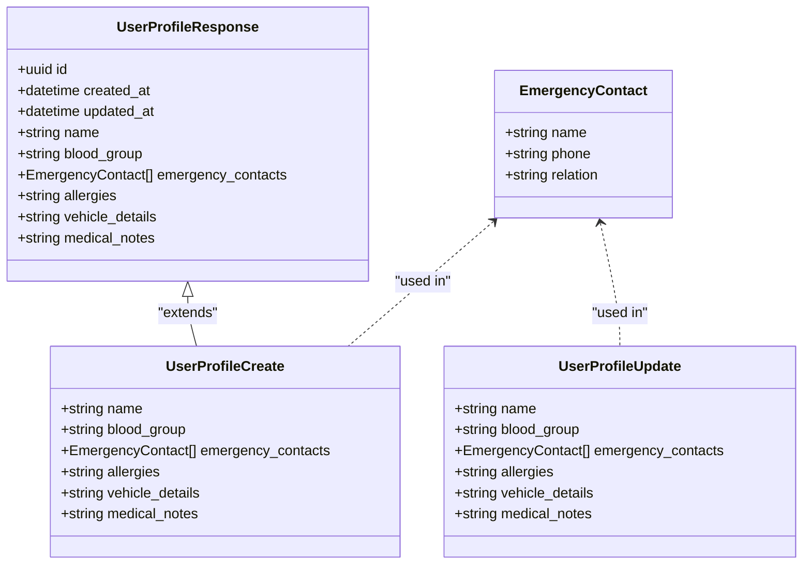
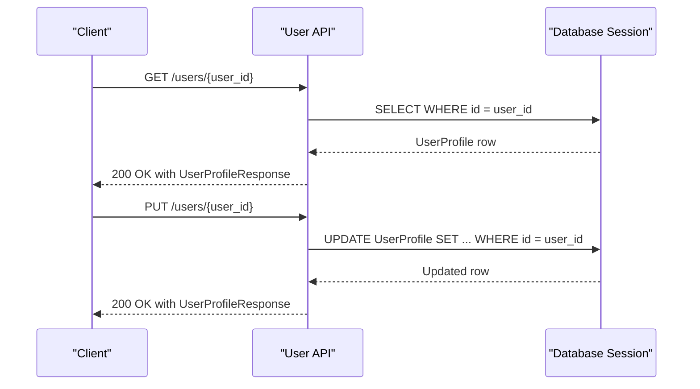

# User Profile Entity

<cite>
**Referenced Files in This Document**
- [user.py](file://backend/models/user.py)
- [schemas.py](file://backend/models/schemas.py)
- [user.py](file://backend/api/v1/user.py)
- [46c1f12f346e_add_userprofile_model.py](file://backend/migrations/versions/46c1f12f346e_add_userprofile_model.py)
- [database.py](file://backend/core/database.py)
- [user-profile.ts](file://frontend/lib/user-profile.ts)
- [sos-share.ts](file://frontend/lib/sos-share.ts)
</cite>

## Table of Contents
1. [Introduction](#introduction)
2. [Project Structure](#project-structure)
3. [Core Components](#core-components)
4. [Architecture Overview](#architecture-overview)
5. [Detailed Component Analysis](#detailed-component-analysis)
6. [Dependency Analysis](#dependency-analysis)
7. [Performance Considerations](#performance-considerations)
8. [Troubleshooting Guide](#troubleshooting-guide)
9. [Conclusion](#conclusion)

## Introduction
This document provides comprehensive data model documentation for the User Profile entity within the SafeVixAI platform. It details the UserProfile table structure, including the UUID primary key, personal information fields, emergency contact management, medical information storage, and timestamp tracking. It also explains the JSON field structure for emergency contacts, outlines validation rules, and provides guidance on indexing strategies and performance considerations for JSON field operations.

## Project Structure
The User Profile entity spans the backend ORM model, API handlers, Pydantic schemas, and database migrations. The frontend integrates with the profile data for emergency scenarios and status indicators.

**Diagram sources**
- [user.py:13-24](file://backend/models/user.py#L13-L24)
- [schemas.py:259-286](file://backend/models/schemas.py#L259-L286)
- [user.py:16-82](file://backend/api/v1/user.py#L16-L82)
- [database.py:21-35](file://backend/core/database.py#L21-L35)
- [46c1f12f346e_add_userprofile_model.py:19-33](file://backend/migrations/versions/46c1f12f346e_add_userprofile_model.py#L19-L33)
- [user-profile.ts:6-18](file://frontend/lib/user-profile.ts#L6-L18)
- [sos-share.ts:41-68](file://frontend/lib/sos-share.ts#L41-L68)

**Section sources**
- [user.py:13-24](file://backend/models/user.py#L13-L24)
- [schemas.py:259-286](file://backend/models/schemas.py#L259-L286)
- [user.py:16-82](file://backend/api/v1/user.py#L16-L82)
- [46c1f12f346e_add_userprofile_model.py:19-33](file://backend/migrations/versions/46c1f12f346e_add_userprofile_model.py#L19-L33)
- [database.py:21-35](file://backend/core/database.py#L21-L35)
- [user-profile.ts:6-18](file://frontend/lib/user-profile.ts#L6-L18)
- [sos-share.ts:41-68](file://frontend/lib/sos-share.ts#L41-L68)

## Core Components
- UserProfile ORM model defines the table schema and column types.
- Pydantic schemas define validation rules and serialization for create/update requests.
- API endpoints handle creation, retrieval, and updates of user profiles.
- Migration script creates the user_profiles table with appropriate columns and constraints.
- Frontend utilities rely on profile completeness and share profile details in emergency messages.

Key attributes and types:
- id: UUID primary key
- name: String with maximum length 255
- blood_group: String with maximum length 10
- emergency_contacts: JSON array of contact dictionaries
- allergies: Text
- vehicle_details: Text
- medical_notes: Text
- created_at: DateTime
- updated_at: DateTime with automatic update on modification

**Section sources**
- [user.py:16-24](file://backend/models/user.py#L16-L24)
- [schemas.py:259-286](file://backend/models/schemas.py#L259-L286)
- [46c1f12f346e_add_userprofile_model.py:21-31](file://backend/migrations/versions/46c1f12f346e_add_userprofile_model.py#L21-L31)
- [user.py:16-36](file://backend/api/v1/user.py#L16-L36)

## Architecture Overview
The User Profile entity follows a layered architecture:
- Data Access Layer: SQLAlchemy ORM model with PostgreSQL UUID and JSON columns
- Business Logic Layer: FastAPI endpoints performing CRUD operations
- Validation Layer: Pydantic models enforcing field constraints
- Persistence Layer: Alembic migration creating the user_profiles table

**Diagram sources**
- [user.py:16-36](file://backend/api/v1/user.py#L16-L36)
- [schemas.py:259-271](file://backend/models/schemas.py#L259-L271)
- [user.py:13-24](file://backend/models/user.py#L13-L24)
- [46c1f12f346e_add_userprofile_model.py:19-33](file://backend/migrations/versions/46c1f12f346e_add_userprofile_model.py#L19-L33)

## Detailed Component Analysis

### UserProfile ORM Model
The UserProfile model defines the database table structure with typed columns and default behaviors.

**Diagram sources**
- [user.py:13-24](file://backend/models/user.py#L13-L24)

Implementation highlights:
- UUID primary key with default generation
- String columns with explicit lengths for name and blood_group
- JSON column for emergency_contacts storing a list of contact dictionaries
- Text columns for free-form medical and vehicle details
- Timestamps with defaults and automatic updates

**Section sources**
- [user.py:13-24](file://backend/models/user.py#L13-L24)

### Pydantic Schemas and Validation
The Pydantic models define validation rules and serialization for user profile operations.

Validation rules observed:
- EmergencyContact requires name and phone; relation is optional
- UserProfileCreate requires name; emergency_contacts defaults to empty list
- UserProfileUpdate allows partial updates with optional fields
- No explicit string length validations are defined in the Pydantic models; enforcement occurs at the database level via column definitions

**Section sources**
- [schemas.py:259-286](file://backend/models/schemas.py#L259-L286)

### API Endpoints and Data Flow
The API endpoints manage user profile lifecycle operations.

**Diagram sources**
- [user.py:39-53](file://backend/api/v1/user.py#L39-L53)
- [user.py:56-82](file://backend/api/v1/user.py#L56-L82)

Operational notes:
- Emergency contacts are converted from Pydantic models to dictionaries before insertion into the JSON column
- Update endpoint excludes unset fields and handles emergency_contacts replacement when provided

**Section sources**
- [user.py:16-36](file://backend/api/v1/user.py#L16-L36)
- [user.py:56-82](file://backend/api/v1/user.py#L56-L82)

### Emergency Contact JSON Structure
The emergency_contacts JSON column stores an array of contact dictionaries. The schema for each contact is:

- name: string (required)
- phone: string (required)
- relation: string (optional)

Example structure:
- [{"name": "John Doe", "phone": "+919876543210", "relation": "Spouse"}, {"name": "Jane Smith", "phone": "+919876501234", "relation": "Friend"}]

Notes:
- The backend converts Pydantic models to dictionaries for storage
- The frontend consumes the profile for emergency displays and SOS sharing

**Section sources**
- [user.py:22-32](file://backend/api/v1/user.py#L22-L32)
- [schemas.py:259-263](file://backend/models/schemas.py#L259-L263)
- [user-profile.ts:6-18](file://frontend/lib/user-profile.ts#L6-L18)
- [sos-share.ts:41-68](file://frontend/lib/sos-share.ts#L41-L68)

### Medical Information Storage Patterns
Medical information fields are stored as Text columns:
- allergies: Free-form textual description of known allergies
- vehicle_details: Free-form textual description of vehicle details
- medical_notes: Free-form textual notes for medical conditions or instructions

These fields are suitable for unstructured text and can accommodate varied formats. Consider adding controlled vocabularies or structured JSON for standardized medical data if requirements evolve.

**Section sources**
- [user.py:19-22](file://backend/models/user.py#L19-L22)
- [schemas.py:265-280](file://backend/models/schemas.py#L265-L280)

### Timestamp Tracking
Timestamp fields:
- created_at: Automatically set to current UTC time upon record creation
- updated_at: Automatically set to current UTC time upon creation and updated on subsequent modifications

This enables audit trails and efficient sorting/filtering by recency.

**Section sources**
- [user.py:23-24](file://backend/models/user.py#L23-L24)
- [46c1f12f346e_add_userprofile_model.py:29-30](file://backend/migrations/versions/46c1f12f346e_add_userprofile_model.py#L29-L30)

## Dependency Analysis
The User Profile entity depends on:
- SQLAlchemy ORM for database modeling and sessions
- Alembic migrations for schema evolution
- Pydantic for request/response validation
- PostgreSQL for native JSON storage and UUID support

**Diagram sources**
- [schemas.py:259-286](file://backend/models/schemas.py#L259-L286)
- [user.py:16-82](file://backend/api/v1/user.py#L16-L82)
- [user.py:13-24](file://backend/models/user.py#L13-L24)
- [46c1f12f346e_add_userprofile_model.py:19-33](file://backend/migrations/versions/46c1f12f346e_add_userprofile_model.py#L19-L33)

**Section sources**
- [database.py:21-35](file://backend/core/database.py#L21-L35)
- [user.py:13-24](file://backend/models/user.py#L13-L24)
- [schemas.py:259-286](file://backend/models/schemas.py#L259-L286)
- [user.py:16-82](file://backend/api/v1/user.py#L16-L82)
- [46c1f12f346e_add_userprofile_model.py:19-33](file://backend/migrations/versions/46c1f12f346e_add_userprofile_model.py#L19-L33)

## Performance Considerations
- JSON field operations: PostgreSQL JSON/JSONB columns support indexing and querying, but complex JSON filtering can be slower than normalized relational columns. Consider extracting frequently queried JSON fields into dedicated scalar columns if performance becomes a concern.
- Indexing strategies: While the user_profiles table does not currently define indexes on JSON fields, consider adding GIN or specialized indexes if you plan to query emergency_contacts fields frequently. For scalar fields like name or blood_group, ensure appropriate indexes exist for filtering and sorting.
- Connection pooling: The backend uses asynchronous SQLAlchemy with configurable pool sizes and timeouts to optimize database throughput under load.
- Data validation: Enforce string length constraints at the application boundary using Pydantic and at the database boundary using column definitions to prevent oversized writes.

[No sources needed since this section provides general guidance]

## Troubleshooting Guide
Common issues and resolutions:
- Missing emergency contacts: Ensure emergency_contacts is provided as a list of dictionaries with required fields. The API expects dictionaries; Pydantic models are converted to dicts before persistence.
- Validation errors: If requests fail schema validation, verify that name is present and emergency_contacts entries include name and phone. Blood group and other optional fields can be omitted.
- JSON parsing failures: Confirm that the JSON structure for emergency_contacts matches the expected dictionary format with name, phone, and optional relation.
- Timestamp discrepancies: Verify server time zone settings and client expectations for created_at and updated_at values.

**Section sources**
- [user.py:16-36](file://backend/api/v1/user.py#L16-L36)
- [schemas.py:259-286](file://backend/models/schemas.py#L259-L286)
- [user.py:19-24](file://backend/models/user.py#L19-L24)

## Conclusion
The User Profile entity provides a robust foundation for storing personal and emergency-related information. Its design balances flexibility with strong typing and validation, while leveraging PostgreSQL’s JSON capabilities for dynamic contact management. For production deployments, consider monitoring JSON query performance and evaluating normalization strategies for frequently accessed JSON fields to enhance scalability and maintainability.