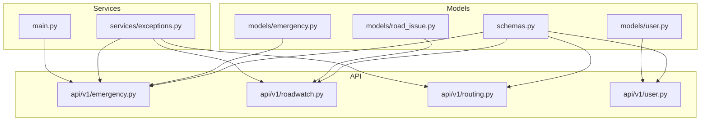
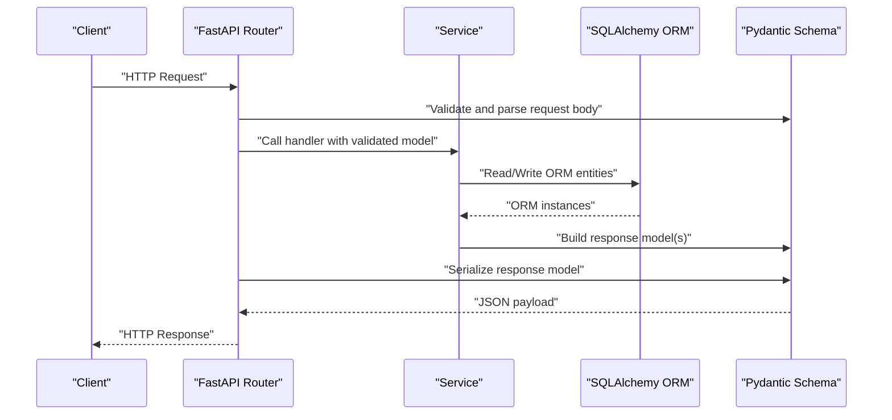
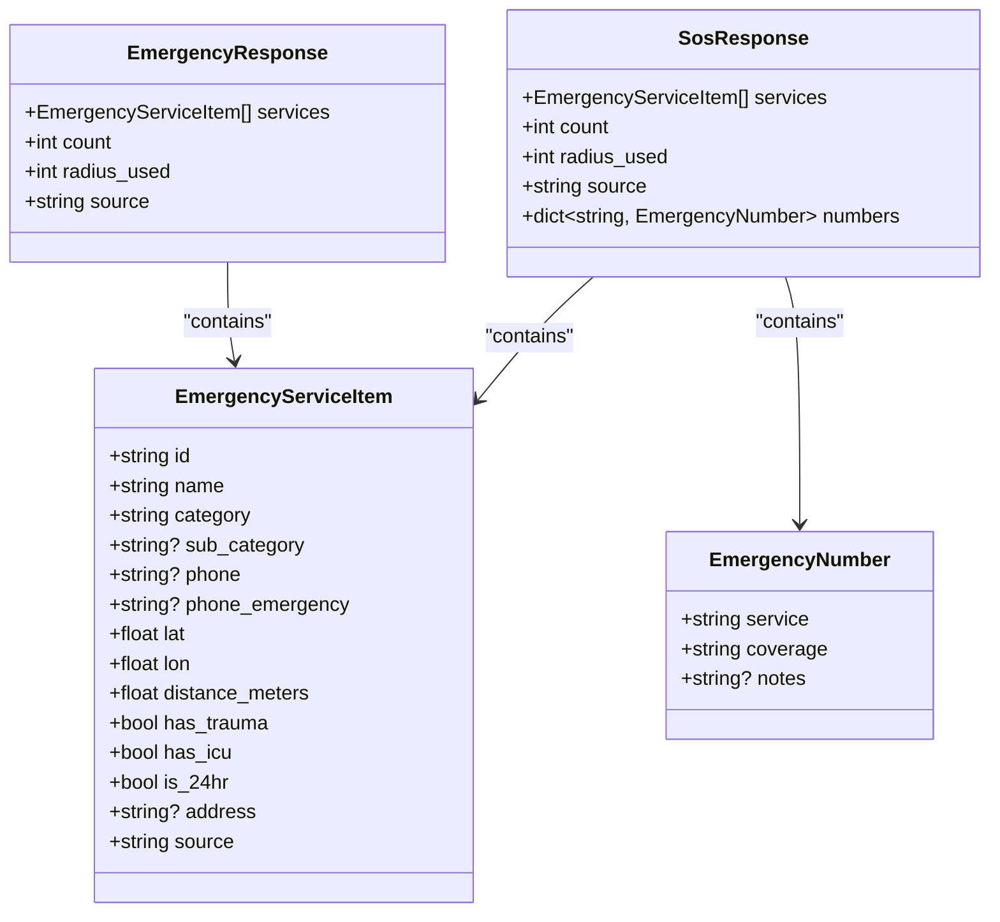
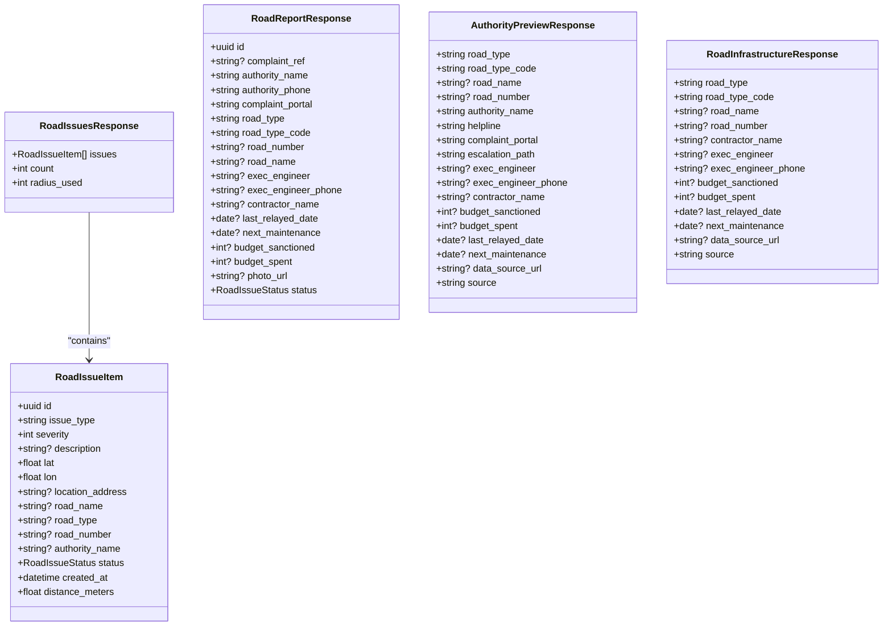
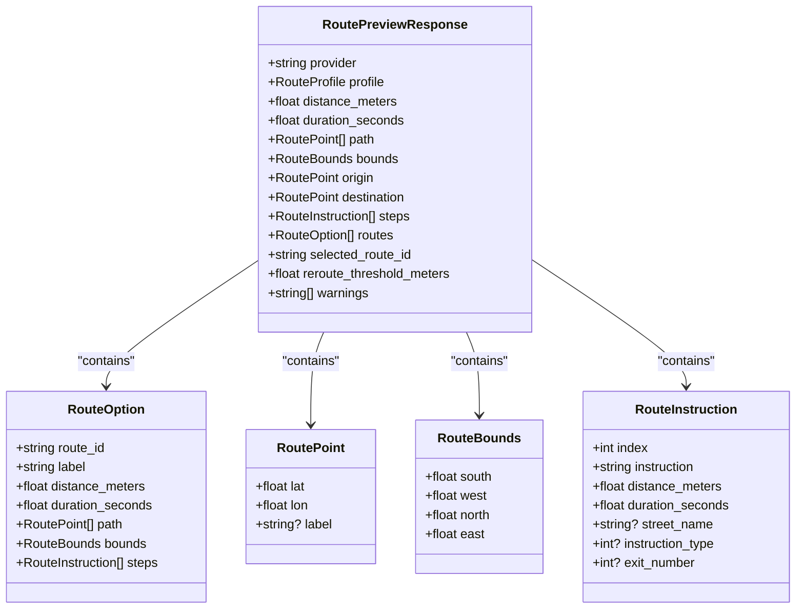
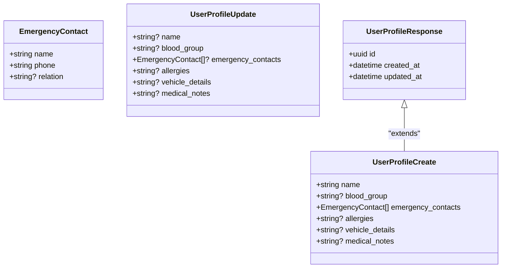
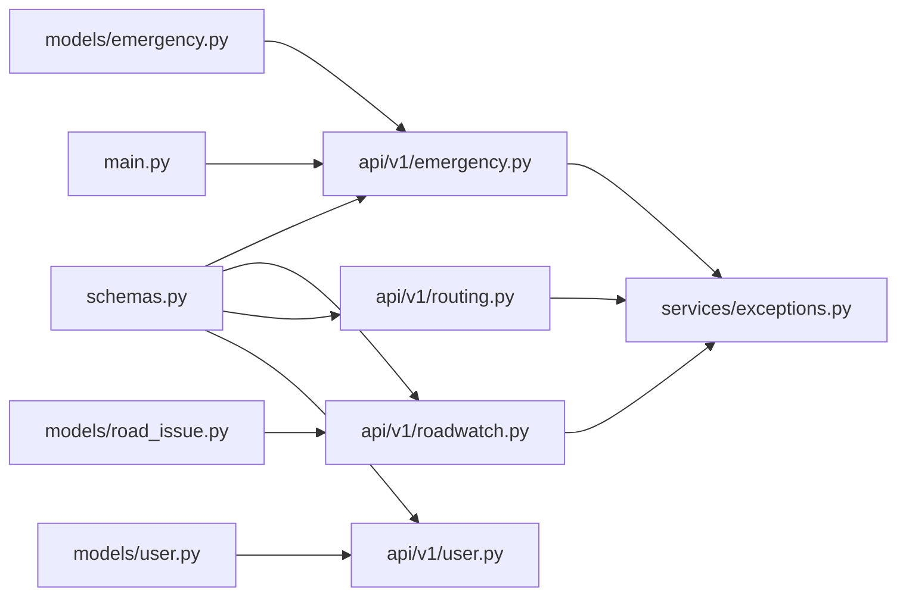

# Data Schemas and Validation

<cite>
**Referenced Files in This Document**
- [schemas.py](file://backend/models/schemas.py)
- [user.py](file://backend/models/user.py)
- [emergency.py](file://backend/models/emergency.py)
- [road_issue.py](file://backend/models/road_issue.py)
- [emergency.py](file://backend/api/v1/emergency.py)
- [roadwatch.py](file://backend/api/v1/roadwatch.py)
- [routing.py](file://backend/api/v1/routing.py)
- [user.py](file://backend/api/v1/user.py)
- [exceptions.py](file://backend/services/exceptions.py)
- [main.py](file://backend/main.py)
</cite>

## Table of Contents
1. [Introduction](#introduction)
2. [Project Structure](#project-structure)
3. [Core Components](#core-components)
4. [Architecture Overview](#architecture-overview)
5. [Detailed Component Analysis](#detailed-component-analysis)
6. [Dependency Analysis](#dependency-analysis)
7. [Performance Considerations](#performance-considerations)
8. [Troubleshooting Guide](#troubleshooting-guide)
9. [Conclusion](#conclusion)

## Introduction
This document provides comprehensive documentation for the Pydantic data schemas used across the SafeVixAI backend. It focuses on request and response models for emergency services, road issues, routing, and user profiles. For each schema, we describe fields, data types, validation rules, constraints, and inheritance patterns. We also explain literal type definitions for categories, statuses, and profiles, and show how these schemas integrate with FastAPI endpoints and services. Serialization and deserialization patterns, including JSON dumps and SQLAlchemy ORM mapping, are covered, along with validation error handling and JSON schema generation.

## Project Structure
The data schemas are primarily defined in a single module and consumed by FastAPI routers and services:
- Data schemas: backend/models/schemas.py
- Domain models (SQLAlchemy): backend/models/user.py, backend/models/emergency.py, backend/models/road_issue.py
- API endpoints: backend/api/v1/*.py
- Services and exceptions: backend/services/*.py
- Application entrypoint: backend/main.py

**Diagram sources**
- [schemas.py](file://backend/models/schemas.py)
- [user.py](file://backend/models/user.py)
- [emergency.py](file://backend/models/emergency.py)
- [road_issue.py](file://backend/models/road_issue.py)
- [emergency.py](file://backend/api/v1/emergency.py)
- [roadwatch.py](file://backend/api/v1/roadwatch.py)
- [routing.py](file://backend/api/v1/routing.py)
- [user.py](file://backend/api/v1/user.py)
- [exceptions.py](file://backend/services/exceptions.py)
- [main.py](file://backend/main.py)

**Section sources**
- [schemas.py](file://backend/models/schemas.py)
- [user.py](file://backend/models/user.py)
- [emergency.py](file://backend/models/emergency.py)
- [road_issue.py](file://backend/models/road_issue.py)
- [emergency.py](file://backend/api/v1/emergency.py)
- [roadwatch.py](file://backend/api/v1/roadwatch.py)
- [routing.py](file://backend/api/v1/routing.py)
- [user.py](file://backend/api/v1/user.py)
- [exceptions.py](file://backend/services/exceptions.py)
- [main.py](file://backend/main.py)

## Core Components
This section documents the primary Pydantic models used across the application, including their fields, types, defaults, and constraints.

- EmergencyCategory: Literal union of emergency service categories
- RoadIssueStatus: Literal union of supported statuses for road issues
- RouteProfile: Literal union of routing profiles

- EmergencyServiceItem
  - Fields: id, name, category, sub_category, phone, phone_emergency, lat, lon, distance_meters, has_trauma, has_icu, is_24hr, address, source
  - Types: str, float, bool, optional str, optional float
  - Defaults: has_trauma=False, has_icu=False, is_24hr=True, source="database"

- EmergencyResponse
  - Fields: services (list of EmergencyServiceItem), count, radius_used, source
  - Types: list, int, int, str

- SosResponse
  - Fields: services, count, radius_used, source, numbers (dict[str, EmergencyNumber])
  - Types: list, int, int, str, dict

- EmergencyNumber
  - Fields: service, coverage, notes
  - Types: str, str, optional str

- EmergencyNumbersResponse
  - Fields: numbers (dict[str, EmergencyNumber])

- GeocodeResult
  - Fields: display_name, city, state, state_code, country_code, postcode, lat, lon
  - Types: str, optional str, optional float

- GeocodeSearchResponse
  - Fields: results (list of GeocodeResult)

- AuthorityPreviewResponse
  - Fields: road_type, road_type_code, road_name, road_number, authority_name, helpline, complaint_portal, escalation_path, exec_engineer, exec_engineer_phone, contractor_name, budget_sanctioned, budget_spent, last_relayed_date, next_maintenance, data_source_url, source
  - Types: str, str, optional str, optional str, optional str, optional str, optional str, optional str, optional str, optional str, optional int, optional int, optional date, optional date, optional str, optional str

- RoadInfrastructureResponse
  - Fields: road_type, road_type_code, road_name, road_number, contractor_name, exec_engineer, exec_engineer_phone, budget_sanctioned, budget_spent, last_relayed_date, next_maintenance, data_source_url, source
  - Types: str, str, optional str, optional str, optional str, optional str, optional str, optional int, optional int, optional date, optional date, optional str, str

- RoadIssueItem
  - Fields: uuid, issue_type, severity, description, lat, lon, location_address, road_name, road_type, road_number, authority_name, status, created_at, distance_meters
  - Types: UUID, str, int, optional str, float, float, optional str, optional str, optional str, optional str, optional str, RoadIssueStatus, datetime, float

- RoadIssuesResponse
  - Fields: issues (list of RoadIssueItem), count, radius_used

- RoadReportResponse
  - Fields: uuid, complaint_ref, authority_name, authority_phone, complaint_portal, road_type, road_type_code, road_number, road_name, exec_engineer, exec_engineer_phone, contractor_name, last_relayed_date, next_maintenance, budget_sanctioned, budget_spent, photo_url, status
  - Types: UUID, optional str, str, str, str, str, str, optional str, optional str, optional str, optional str, optional str, optional date, optional date, optional int, optional int, optional str, RoadIssueStatus

- RoutePoint
  - Fields: lat, lon, label
  - Types: float, float, optional str

- RouteBounds
  - Fields: south, west, north, east
  - Types: float, float, float, float

- RouteInstruction
  - Fields: index, instruction, distance_meters, duration_seconds, street_name, instruction_type, exit_number
  - Types: int, str, float, float, optional str, optional int, optional int

- RouteOption
  - Fields: route_id, label, distance_meters, duration_seconds, path (list[RoutePoint]), bounds (RouteBounds), steps (list[RouteInstruction])
  - Types: str, str, float, float, list, list, list

- RoutePreviewResponse
  - Fields: provider, profile, distance_meters, duration_seconds, path, bounds, origin, destination, steps, routes, selected_route_id, reroute_threshold_meters, warnings
  - Types: str, RouteProfile, float, float, list, list, RoutePoint, RoutePoint, list, list, str, float, list

- ServiceCandidate
  - Fields: id, name, category, lat, lon, distance_meters, address, phone, source
  - Types: str, str, str, float, float, float, optional str, optional str, str
  - Config: from_attributes=True

- ChatRequest
  - Fields: message, session_id, lat, lon
  - Constraints: message (min_length=1, max_length=4000), session_id (min_length=1, max_length=128), lat (-90..90), lon (-180..180)

- ChatResponse
  - Fields: response, intent, sources, session_id
  - Types: str, optional str, list[str], str

- ChallanQuery
  - Fields: violation_code, vehicle_class, state_code, is_repeat
  - Types: str, str, str, bool
  - Constraints: all strings min_length=1, max_length up to 32/64

- ChallanResponse
  - Fields: violation_code, vehicle_class, state_code, base_fine, repeat_fine, amount_due, section, description, state_override
  - Types: str, str, str, int, optional int, int, str, str, optional str

- EmergencyContact
  - Fields: name, phone, relation
  - Types: str, str, optional str

- UserProfileCreate
  - Fields: name, blood_group, emergency_contacts, allergies, vehicle_details, medical_notes
  - Types: str, optional str, list[EmergencyContact], optional str, optional str, optional str

- UserProfileUpdate
  - Fields: name, blood_group, emergency_contacts, allergies, vehicle_details, medical_notes
  - Types: optional str, optional str, optional list[EmergencyContact], optional str, optional str, optional str

- UserProfileResponse
  - Fields: id, created_at, updated_at
  - Inheritance: extends UserProfileCreate

**Section sources**
- [schemas.py](file://backend/models/schemas.py)

## Architecture Overview
The data schemas define the canonical request/response contracts for the backend APIs. They are consumed by FastAPI routers to validate inputs and serialize outputs. Services orchestrate domain logic and may convert between Pydantic models and SQLAlchemy ORM models. Exceptions propagate validation and external service errors to clients.

**Diagram sources**
- [emergency.py](file://backend/api/v1/emergency.py)
- [roadwatch.py](file://backend/api/v1/roadwatch.py)
- [routing.py](file://backend/api/v1/routing.py)
- [user.py](file://backend/api/v1/user.py)
- [schemas.py](file://backend/models/schemas.py)
- [user.py](file://backend/models/user.py)
- [emergency.py](file://backend/models/emergency.py)
- [road_issue.py](file://backend/models/road_issue.py)

## Detailed Component Analysis

### Emergency Service Models
These models represent emergency services and related responses.

**Diagram sources**
- [schemas.py](file://backend/models/schemas.py)

**Section sources**
- [schemas.py](file://backend/models/schemas.py)
- [emergency.py](file://backend/api/v1/emergency.py)

### Road Issue Models
These models represent road infrastructure, reported issues, and related responses.

**Diagram sources**
- [schemas.py](file://backend/models/schemas.py)
- [road_issue.py](file://backend/models/road_issue.py)

**Section sources**
- [schemas.py](file://backend/models/schemas.py)
- [roadwatch.py](file://backend/api/v1/roadwatch.py)
- [road_issue.py](file://backend/models/road_issue.py)

### Routing Models
These models define route points, bounds, instructions, and route options.

**Diagram sources**
- [schemas.py](file://backend/models/schemas.py)

**Section sources**
- [schemas.py](file://backend/models/schemas.py)
- [routing.py](file://backend/api/v1/routing.py)

### User Profile Models
These models handle user profile creation, updates, and responses.

**Diagram sources**
- [schemas.py](file://backend/models/schemas.py)

**Section sources**
- [schemas.py](file://backend/models/schemas.py)
- [user.py](file://backend/api/v1/user.py)
- [user.py](file://backend/models/user.py)

### Example Payloads
Below are example payloads for representative endpoints. Replace values with valid ones per schema constraints.

- GET /api/v1/emergency/nearby
  - Query params: lat, lon, categories (comma-separated), radius, limit
  - Response: EmergencyResponse
  - Example keys: services[], count, radius_used, source

- GET /api/v1/emergency/sos
  - Query params: lat, lon
  - Response: SosResponse
  - Example keys: services[], count, radius_used, source, numbers{}

- GET /api/v1/roads/issues
  - Query params: lat, lon, radius, limit, statuses (comma-separated)
  - Response: RoadIssuesResponse
  - Example keys: issues[], count, radius_used

- POST /api/v1/roads/report
  - Form fields: lat, lon, issue_type, severity, description, photo (optional)
  - Response: RoadReportResponse
  - Example keys: id, authority_name, status, etc.

- GET /api/v1/routing/preview
  - Query params: origin_lat, origin_lon, destination_lat, destination_lon, profile, alternatives
  - Response: RoutePreviewResponse
  - Example keys: provider, profile, distance_meters, duration_seconds, path[], bounds{}, origin{}, destination{}, steps[], routes[], selected_route_id, reroute_threshold_meters, warnings[]

- POST /users/
  - Body: UserProfileCreate
  - Response: UserProfileResponse
  - Example keys: id, name, emergency_contacts[], created_at, updated_at

- PUT /users/{user_id}
  - Body: UserProfileUpdate
  - Response: UserProfileResponse
  - Example keys: id, name, emergency_contacts[], created_at, updated_at

**Section sources**
- [emergency.py](file://backend/api/v1/emergency.py)
- [roadwatch.py](file://backend/api/v1/roadwatch.py)
- [routing.py](file://backend/api/v1/routing.py)
- [user.py](file://backend/api/v1/user.py)

### Validation Rules and Constraints
- Numeric ranges:
  - lat: -90 to 90
  - lon: -180 to 180
- String lengths:
  - message: min 1, max 4000
  - session_id: min 1, max 128
  - violation_code, vehicle_class, state_code: min 1, max 32/64
- Severity: 1 to 5
- Radius: 100 to 50000
- Limit: 1 to 50 for emergency nearby, 1 to 100 for road issues
- Statuses: comma-separated subset of supported statuses validated server-side

**Section sources**
- [emergency.py](file://backend/api/v1/emergency.py)
- [roadwatch.py](file://backend/api/v1/roadwatch.py)
- [routing.py](file://backend/api/v1/routing.py)
- [schemas.py](file://backend/models/schemas.py)

### Serialization and Deserialization Patterns
- Pydantic model dumping:
  - mode="json" used for caching and inter-service serialization
  - exclude_unset used to avoid overwriting existing values during updates
  - exclude_none used to remove nulls in certain requests
- SQLAlchemy ORM mapping:
  - ServiceCandidate uses from_attributes=True to support ORM-style loading
  - User profile emergency_contacts stored as JSON; serialized via model_dump before persistence

**Section sources**
- [user.py](file://backend/api/v1/user.py)
- [schemas.py](file://backend/models/schemas.py)

### JSON Schema Generation
- Pydantic models can be used to generate JSON schemas for documentation and validation. While not explicitly invoked in the referenced files, FastAPI integrates with Pydantic to expose OpenAPI schemas automatically. The presence of response_model annotations ensures schema generation for endpoints.

**Section sources**
- [emergency.py](file://backend/api/v1/emergency.py)
- [roadwatch.py](file://backend/api/v1/roadwatch.py)
- [routing.py](file://backend/api/v1/routing.py)
- [user.py](file://backend/api/v1/user.py)

## Dependency Analysis
The following diagram shows how schemas are consumed by routers and services, and how exceptions influence error handling.

**Diagram sources**
- [schemas.py](file://backend/models/schemas.py)
- [emergency.py](file://backend/api/v1/emergency.py)
- [roadwatch.py](file://backend/api/v1/roadwatch.py)
- [routing.py](file://backend/api/v1/routing.py)
- [user.py](file://backend/api/v1/user.py)
- [exceptions.py](file://backend/services/exceptions.py)
- [user.py](file://backend/models/user.py)
- [emergency.py](file://backend/models/emergency.py)
- [road_issue.py](file://backend/models/road_issue.py)
- [main.py](file://backend/main.py)

**Section sources**
- [schemas.py](file://backend/models/schemas.py)
- [emergency.py](file://backend/api/v1/emergency.py)
- [roadwatch.py](file://backend/api/v1/roadwatch.py)
- [routing.py](file://backend/api/v1/routing.py)
- [user.py](file://backend/api/v1/user.py)
- [exceptions.py](file://backend/services/exceptions.py)
- [user.py](file://backend/models/user.py)
- [emergency.py](file://backend/models/emergency.py)
- [road_issue.py](file://backend/models/road_issue.py)
- [main.py](file://backend/main.py)

## Performance Considerations
- Prefer streaming or pagination for large lists (e.g., services[], issues[]) to reduce payload sizes.
- Use appropriate radius and limit parameters to constrain result sets.
- Cache frequently accessed responses using model_dump(mode="json") to minimize repeated computation.
- Avoid unnecessary nested object creation; reuse shared components like RoutePoint and RouteBounds.

## Troubleshooting Guide
Common validation and error scenarios:
- 422 Unprocessable Entity:
  - Unsupported road issue statuses passed to /roads/issues
  - Invalid numeric ranges for lat/lon or severity
  - Missing or out-of-range query parameters
- 503 Service Unavailable:
  - External service failures handled by ExternalServiceError
  - Health endpoint returns 503 when database is unavailable

Resolution steps:
- Verify query parameter ranges and formats against schema constraints.
- Confirm statuses are from the allowed set for road issues.
- Inspect service logs for upstream dependency errors.

**Section sources**
- [roadwatch.py](file://backend/api/v1/roadwatch.py)
- [emergency.py](file://backend/api/v1/emergency.py)
- [routing.py](file://backend/api/v1/routing.py)
- [exceptions.py](file://backend/services/exceptions.py)
- [main.py](file://backend/main.py)

## Conclusion
The Pydantic schemas in SafeVixAI provide strong typing, validation, and serialization guarantees across the backend. They align closely with FastAPI routers and services, ensuring predictable request/response contracts. By leveraging literals for constrained values, strict field constraints, and consistent serialization patterns, the system maintains reliability and clarity. Adhering to the documented constraints and error handling paths will help maintain robust integrations and predictable behavior.