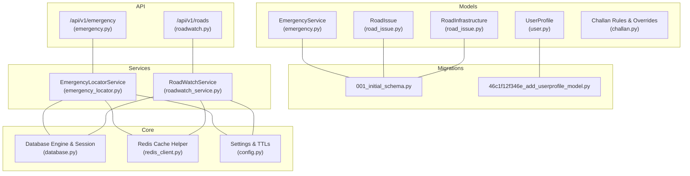
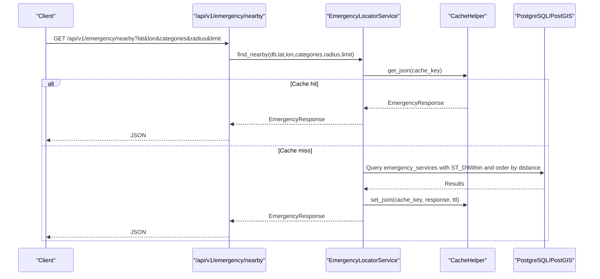
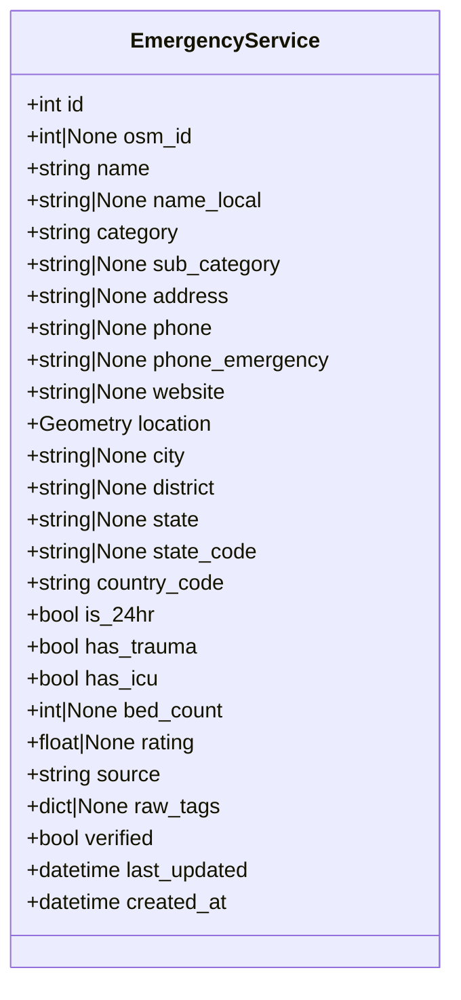
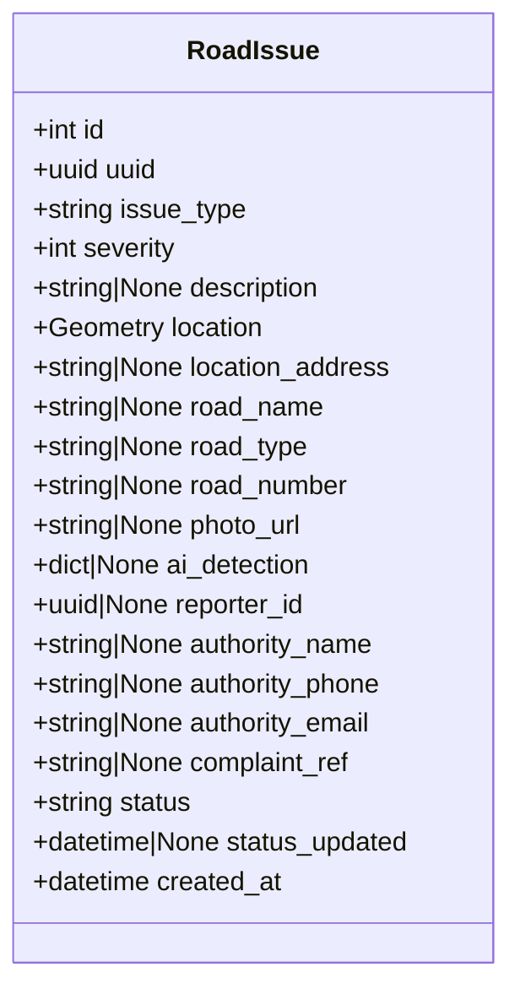
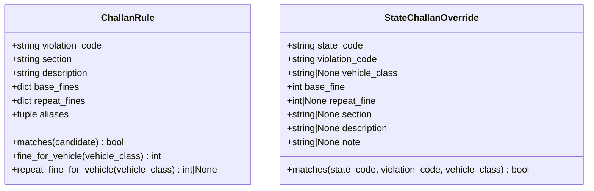
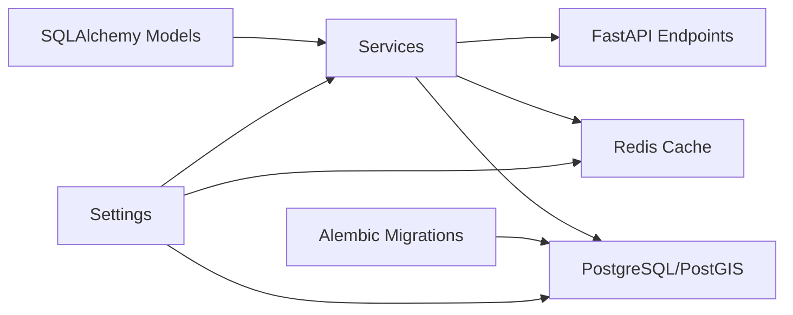
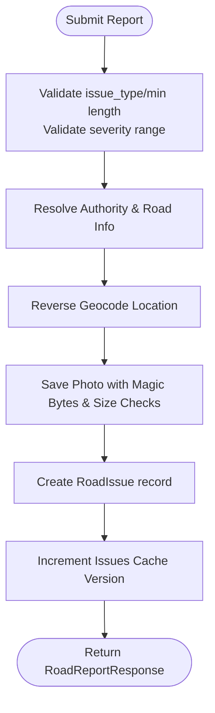

# Database Schema

<cite>
**Referenced Files in This Document**
- [backend/models/__init__.py](file://backend/models/__init__.py)
- [backend/models/emergency.py](file://backend/models/emergency.py)
- [backend/models/road_issue.py](file://backend/models/road_issue.py)
- [backend/models/user.py](file://backend/models/user.py)
- [backend/models/challan.py](file://backend/models/challan.py)
- [backend/models/schemas.py](file://backend/models/schemas.py)
- [backend/core/database.py](file://backend/core/database.py)
- [backend/core/redis_client.py](file://backend/core/redis_client.py)
- [backend/core/config.py](file://backend/core/config.py)
- [backend/migrations/versions/001_initial_schema.py](file://backend/migrations/versions/001_initial_schema.py)
- [backend/migrations/versions/46c1f12f346e_add_userprofile_model.py](file://backend/migrations/versions/46c1f12f346e_add_userprofile_model.py)
- [backend/services/emergency_locator.py](file://backend/services/emergency_locator.py)
- [backend/services/roadwatch_service.py](file://backend/services/roadwatch_service.py)
- [backend/api/v1/emergency.py](file://backend/api/v1/emergency.py)
- [backend/api/v1/roadwatch.py](file://backend/api/v1/roadwatch.py)
- [backend/scripts/app/seed_db.py](file://backend/scripts/app/seed_db.py)
</cite>

## Table of Contents
1. [Introduction](#introduction)
2. [Project Structure](#project-structure)
3. [Core Components](#core-components)
4. [Architecture Overview](#architecture-overview)
5. [Detailed Component Analysis](#detailed-component-analysis)
6. [Dependency Analysis](#dependency-analysis)
7. [Performance Considerations](#performance-considerations)
8. [Troubleshooting Guide](#troubleshooting-guide)
9. [Conclusion](#conclusion)
10. [Appendices](#appendices)

## Introduction
This document provides comprehensive data model documentation for the SafeVixAI database schema. It details entity relationships, field definitions, data types, primary/foreign keys, indexes, and constraints for the seven core tables. It also explains validation and business rules for emergency services, user profiles, road issues, and challan records, along with caching strategies using Redis, performance considerations for geospatial queries, data lifecycle and retention, migration paths via Alembic, and security/access control mechanisms.

## Project Structure
SafeVixAI organizes database concerns across models, migrations, services, APIs, and core configuration. The database is PostgreSQL with PostGIS extension for geospatial indexing and queries. Alembic manages schema versions. Redis provides caching for frequently accessed data.

**Diagram sources**
- [backend/models/emergency.py:12-45](file://backend/models/emergency.py#L12-L45)
- [backend/models/road_issue.py:14-66](file://backend/models/road_issue.py#L14-L66)
- [backend/models/user.py:13-25](file://backend/models/user.py#L13-L25)
- [backend/migrations/versions/001_initial_schema.py:22-140](file://backend/migrations/versions/001_initial_schema.py#L22-L140)
- [backend/migrations/versions/46c1f12f346e_add_userprofile_model.py:19-39](file://backend/migrations/versions/46c1f12f346e_add_userprofile_model.py#L19-L39)
- [backend/services/emergency_locator.py:161-507](file://backend/services/emergency_locator.py#L161-L507)
- [backend/services/roadwatch_service.py:56-325](file://backend/services/roadwatch_service.py#L56-L325)
- [backend/core/database.py:21-50](file://backend/core/database.py#L21-L50)
- [backend/core/redis_client.py:10-140](file://backend/core/redis_client.py#L10-L140)
- [backend/core/config.py:19-100](file://backend/core/config.py#L19-L100)
- [backend/api/v1/emergency.py:19-83](file://backend/api/v1/emergency.py#L19-L83)
- [backend/api/v1/roadwatch.py:26-97](file://backend/api/v1/roadwatch.py#L26-L97)

**Section sources**
- [backend/models/__init__.py:1-7](file://backend/models/__init__.py#L1-L7)
- [backend/core/database.py:12-50](file://backend/core/database.py#L12-L50)
- [backend/core/config.py:19-100](file://backend/core/config.py#L19-L100)

## Core Components
This section documents the seven core tables and their fields, data types, constraints, and indexes.

- emergency_services
  - Purpose: Stores emergency service providers (hospitals, police, fire, ambulance, etc.) with geospatial locations.
  - Primary key: id (auto-increment integer)
  - Unique constraints: osm_id (bigint)
  - Indexes: category, state_code, country_code, location (GIST)
  - Notable fields: name, category, sub_category, address, phone, phone_emergency, website, location (POINT), city, district, state, state_code, country_code, is_24hr, has_trauma, has_icu, bed_count, rating, source, raw_tags, verified, last_updated, created_at
  - Notes: Uses GeoAlchemy Geometry(Point, SRID=4326) with spatial_index enabled in migration; includes default values and booleans for availability flags.

- road_infrastructure
  - Purpose: Stores road network geometry (LineString) and administrative/project metadata.
  - Primary key: id (auto-increment integer)
  - Unique constraint: road_id (string)
  - Indexes: state_code, geometry (GIST)
  - Notable fields: road_id, road_name, road_type, road_number, length_km, geometry (LINESTRING), state_code, contractor_name, exec_engineer, exec_engineer_phone, budget_sanctioned, budget_spent, construction_date, last_relayed_date, next_maintenance, project_source, data_source_url
  - Notes: Uses GeoAlchemy Geometry(LineString, SRID=4326) with spatial_index enabled in migration.

- road_issues
  - Purpose: Tracks reported road issues with geospatial coordinates, status, and reporting metadata.
  - Primary key: id (auto-increment integer)
  - Unique constraint: uuid (UUID)
  - Indexes: status, location (GIST)
  - Notable fields: uuid, issue_type, severity, description, location (POINT), location_address, road_name, road_type, road_number, photo_url, ai_detection (JSONB), reporter_id (UUID), authority_name, authority_phone, authority_email, complaint_ref, status, status_updated, created_at
  - Notes: Uses GeoAlchemy Geometry(Point, SRID=4326) with spatial_index enabled in migration; status defaults to open.

- user_profiles
  - Purpose: Stores user medical and contact details for emergency scenarios.
  - Primary key: id (UUID)
  - Notable fields: name, blood_group, emergency_contacts (JSON), allergies, vehicle_details, medical_notes, created_at, updated_at
  - Notes: JSON column stores list of emergency contacts; UUID primary key ensures globally unique identity.

- challan_rules and state_challan_overrides
  - Purpose: Define challan violation rules and state-specific overrides for calculating fines.
  - Data structures: ChallanRule (violation_code, section, description, base_fines, repeat_fines, aliases)
  - Data structures: StateChallanOverride (state_code, violation_code, vehicle_class, base_fine, repeat_fine, section, description, note)
  - Notes: Used by challan calculation services; not persisted as tables but define business rules for challan responses.

- sos_incidents
  - Purpose: Tracks SOS incidents for analytics and safety monitoring.
  - Fields: id (serial), lat, lon, user_agent, created_at
  - Notes: Dynamically created by API endpoint and inserted upon SOS requests.

- authority_matrix (conceptual)
  - Purpose: Authority routing and road infrastructure metadata for road reports.
  - Notes: Not a physical table; used by services to resolve authority details and road attributes during reporting.

**Section sources**
- [backend/migrations/versions/001_initial_schema.py:25-123](file://backend/migrations/versions/001_initial_schema.py#L25-L123)
- [backend/models/emergency.py:12-45](file://backend/models/emergency.py#L12-L45)
- [backend/models/road_issue.py:14-66](file://backend/models/road_issue.py#L14-L66)
- [backend/models/user.py:13-25](file://backend/models/user.py#L13-L25)
- [backend/models/challan.py:6-53](file://backend/models/challan.py#L6-L53)
- [backend/api/v1/emergency.py:51-67](file://backend/api/v1/emergency.py#L51-L67)

## Architecture Overview
SafeVixAI’s database architecture centers on PostgreSQL with PostGIS for geospatial capabilities, Alembic for migrations, and Redis for caching. Services encapsulate business logic and perform geospatial queries using Geography types and ST_Distance/ST_DWithin. APIs expose endpoints that trigger caching and persistence.

**Diagram sources**
- [backend/api/v1/emergency.py:19-40](file://backend/api/v1/emergency.py#L19-L40)
- [backend/services/emergency_locator.py:187-217](file://backend/services/emergency_locator.py#L187-L217)
- [backend/core/redis_client.py:43-71](file://backend/core/redis_client.py#L43-L71)
- [backend/core/database.py:21-50](file://backend/core/database.py#L21-L50)

**Section sources**
- [backend/services/emergency_locator.py:161-507](file://backend/services/emergency_locator.py#L161-L507)
- [backend/services/roadwatch_service.py:56-325](file://backend/services/roadwatch_service.py#L56-L325)
- [backend/core/redis_client.py:10-140](file://backend/core/redis_client.py#L10-L140)

## Detailed Component Analysis

### Emergency Services Entity
- Purpose: Central repository for emergency facilities with geospatial proximity search.
- Key fields and types:
  - id: integer, primary key, autoincrement
  - osm_id: bigint, unique
  - name: text, not null
  - category: string(32), indexed
  - location: geometry(Point, SRID=4326), indexed with GIST
  - state_code: string(2), indexed
  - country_code: string(2), default 'IN', indexed
  - is_24hr, has_trauma, has_icu: booleans
  - rating: float
  - created_at/last_updated: timestamps
- Business rules:
  - Supports categories: hospital, police, ambulance, fire, towing, pharmacy, puncture, showroom.
  - Distance ordering prioritizes trauma/icu availability and 24-hour availability.
- Validation:
  - API enforces bounds for lat/lon/radius/limit.
- Caching:
  - Cache key includes lat/lon/categories/radius/limit; TTL configured in settings.

**Diagram sources**
- [backend/models/emergency.py:12-45](file://backend/models/emergency.py#L12-L45)

**Section sources**
- [backend/models/emergency.py:12-45](file://backend/models/emergency.py#L12-L45)
- [backend/migrations/versions/001_initial_schema.py:25-54](file://backend/migrations/versions/001_initial_schema.py#L25-L54)
- [backend/services/emergency_locator.py:187-217](file://backend/services/emergency_locator.py#L187-L217)
- [backend/api/v1/emergency.py:19-40](file://backend/api/v1/emergency.py#L19-L40)

### Road Infrastructure Entity
- Purpose: Store road network geometry and maintenance/admin metadata.
- Key fields and types:
  - id: integer, primary key, autoincrement
  - road_id: string(128), unique
  - geometry: geometry(LineString, SRID=4326), indexed with GIST
  - state_code: string(2), indexed
  - Budget and dates: budget_sanctioned, budget_spent, construction_date, last_relayed_date, next_maintenance
- Business rules:
  - Used to infer road attributes near a point for reporting and routing.
- Validation:
  - Service validates road type normalization and authority resolution.

**Diagram sources**
- [backend/models/road_issue.py:42-66](file://backend/models/road_issue.py#L42-L66)

**Section sources**
- [backend/models/road_issue.py:42-66](file://backend/models/road_issue.py#L42-L66)
- [backend/migrations/versions/001_initial_schema.py:65-85](file://backend/migrations/versions/001_initial_schema.py#L65-L85)
- [backend/services/roadwatch_service.py:255-274](file://backend/services/roadwatch_service.py#L255-L274)

### Road Issues Entity
- Purpose: Track reported road issues with status, geolocation, and authority linkage.
- Key fields and types:
  - id: integer, primary key, autoincrement
  - uuid: uuid, unique
  - location: geometry(Point, SRID=4326), indexed with GIST
  - status: string(32), default 'open', indexed
  - reporter_id: uuid
  - photo_url: text
  - ai_detection: jsonb
  - authority_*: strings for governance linkage
  - created_at: timestamp
- Business rules:
  - Status lifecycle: open, acknowledged, in_progress, resolved, rejected.
  - Default status is open; active statuses include open, acknowledged, in_progress.
  - Photo uploads validated by magic bytes and content-type whitelist.
- Validation:
  - API enforces min/max lengths and severity range; service validates image signatures and size.

**Diagram sources**
- [backend/models/road_issue.py:14-40](file://backend/models/road_issue.py#L14-L40)

**Section sources**
- [backend/models/road_issue.py:14-40](file://backend/models/road_issue.py#L14-L40)
- [backend/migrations/versions/001_initial_schema.py:94-123](file://backend/migrations/versions/001_initial_schema.py#L94-L123)
- [backend/services/roadwatch_service.py:127-184](file://backend/services/roadwatch_service.py#L127-L184)
- [backend/api/v1/roadwatch.py:73-97](file://backend/api/v1/roadwatch.py#L73-L97)

### User Profiles Entity
- Purpose: Store user medical and emergency contact information.
- Key fields and types:
  - id: uuid, primary key
  - name: string(255), not null
  - blood_group: string(10)
  - emergency_contacts: json (list of dicts with name, phone, relation)
  - allergies, vehicle_details, medical_notes: text
  - created_at, updated_at: timestamps
- Business rules:
  - JSON structure for emergency contacts validated by Pydantic models.
  - Updated_at auto-updated on change.

**Diagram sources**
- [backend/models/user.py:13-25](file://backend/models/user.py#L13-L25)

**Section sources**
- [backend/models/user.py:13-25](file://backend/models/user.py#L13-L25)
- [backend/migrations/versions/46c1f12f346e_add_userprofile_model.py:21-32](file://backend/migrations/versions/46c1f12f346e_add_userprofile_model.py#L21-L32)
- [backend/models/schemas.py:259-287](file://backend/models/schemas.py#L259-L287)

### Challan Rules and Overrides
- Purpose: Define fine calculation rules and state-specific adjustments.
- Data structures:
  - ChallanRule: violation_code, section, description, base_fines (dict), repeat_fines (dict), aliases (tuple)
  - StateChallanOverride: state_code, violation_code, vehicle_class, base_fine, repeat_fine, section, description, note
- Business rules:
  - Matching logic supports exact violation code or aliases.
  - State overrides allow per-state and per-vehicle-class adjustments.

**Diagram sources**
- [backend/models/challan.py:6-53](file://backend/models/challan.py#L6-L53)

**Section sources**
- [backend/models/challan.py:6-53](file://backend/models/challan.py#L6-L53)
- [backend/models/schemas.py:240-257](file://backend/models/schemas.py#L240-L257)

### SOS Incidents Table
- Purpose: Persist SOS incident events for analytics.
- Fields: id (serial), lat, lon, user_agent, created_at
- Notes: Created dynamically by API endpoint and inserted upon SOS requests.

**Section sources**
- [backend/api/v1/emergency.py:51-67](file://backend/api/v1/emergency.py#L51-L67)

## Dependency Analysis
- Models depend on SQLAlchemy ORM and GeoAlchemy2 for spatial types.
- Services depend on models and Redis cache helper for caching.
- APIs depend on services and enforce validation via Pydantic models.
- Migrations define schema and indexes; Alembic manages upgrades/downgrades.
- Configuration controls database URLs, pool sizes, timeouts, and cache TTLs.

**Diagram sources**
- [backend/models/emergency.py:12-45](file://backend/models/emergency.py#L12-L45)
- [backend/models/road_issue.py:14-66](file://backend/models/road_issue.py#L14-L66)
- [backend/models/user.py:13-25](file://backend/models/user.py#L13-L25)
- [backend/services/emergency_locator.py:161-507](file://backend/services/emergency_locator.py#L161-L507)
- [backend/services/roadwatch_service.py:56-325](file://backend/services/roadwatch_service.py#L56-L325)
- [backend/core/redis_client.py:10-140](file://backend/core/redis_client.py#L10-L140)
- [backend/core/database.py:21-50](file://backend/core/database.py#L21-L50)
- [backend/migrations/versions/001_initial_schema.py:22-140](file://backend/migrations/versions/001_initial_schema.py#L22-L140)
- [backend/core/config.py:19-100](file://backend/core/config.py#L19-L100)

**Section sources**
- [backend/models/__init__.py:1-7](file://backend/models/__init__.py#L1-L7)
- [backend/core/config.py:19-100](file://backend/core/config.py#L19-L100)

## Performance Considerations
- Geospatial indexing:
  - GIST indexes on geometry columns for emergency_services (category, state_code, country_code) and road_infrastructure (state_code) plus spatial GIST indexes on POINT/LINESTRING improve query performance.
- Query patterns:
  - ST_DWithin and ST_Distance used to filter and order by distance; Geography type preferred for accurate distances.
  - Ordering prioritizes trauma availability, 24-hour availability, and distance.
- Caching:
  - Cache keys encode parameters (lat/lon/categories/radius/limit/statuses); TTLs configurable via settings.
  - Incremental cache version key for road issues invalidates cached lists when new issues are submitted.
- Connection pooling:
  - Async engine with pool pre-ping, size, overflow, timeout, and recycle configured for stability under load.
- Upload validation:
  - Magic-byte checks and size limits prevent invalid or oversized images.

**Section sources**
- [backend/migrations/versions/001_initial_schema.py:55-63](file://backend/migrations/versions/001_initial_schema.py#L55-L63)
- [backend/migrations/versions/001_initial_schema.py:86-92](file://backend/migrations/versions/001_initial_schema.py#L86-L92)
- [backend/services/emergency_locator.py:375-421](file://backend/services/emergency_locator.py#L375-L421)
- [backend/services/roadwatch_service.py:127-184](file://backend/services/roadwatch_service.py#L127-L184)
- [backend/core/redis_client.py:43-114](file://backend/core/redis_client.py#L43-L114)
- [backend/core/database.py:21-35](file://backend/core/database.py#L21-L35)
- [backend/core/config.py:19-36](file://backend/core/config.py#L19-L36)

## Troubleshooting Guide
- Database connectivity:
  - Use the async engine and session factory; a health check method executes a simple SELECT to verify connectivity.
- Redis availability:
  - CacheHelper falls back to in-memory cache if Redis is unavailable; ping() indicates health status.
- Validation errors:
  - API endpoints raise HTTP 422 for invalid statuses and 503 for external service failures.
  - RoadWatch service raises validation errors for unsupported content types and oversized uploads.
- Alembic migrations:
  - Run upgrade/downgrade to reconcile schema changes; initial migration creates PostGIS extension and indexes.

**Section sources**
- [backend/core/database.py:43-50](file://backend/core/database.py#L43-L50)
- [backend/core/redis_client.py:115-125](file://backend/core/redis_client.py#L115-L125)
- [backend/api/v1/roadwatch.py:95-97](file://backend/api/v1/roadwatch.py#L95-L97)
- [backend/migrations/versions/001_initial_schema.py:126-140](file://backend/migrations/versions/001_initial_schema.py#L126-L140)

## Conclusion
SafeVixAI’s database schema leverages PostgreSQL with PostGIS for robust geospatial operations, structured migrations via Alembic, and Redis for efficient caching. The seven core entities—emergency services, road infrastructure, road issues, user profiles, and challan rules—support emergency response, road reporting, and user safety workflows. Clear indexes, validation rules, and caching strategies optimize performance and reliability.

## Appendices

### Data Access Patterns and Sample Data
- EmergencyLocatorService:
  - Builds cache keys from lat/lon/categories/radius/limit and caches EmergencyResponse.
  - Queries emergency_services using ST_DWithin and orders by trauma/icu/24-hour availability and distance.
- RoadWatchService:
  - Finds nearby road issues within a radius and filters by status.
  - Submits reports with photo validation and updates cache version key.
  - Seeds initial emergency services data for major Indian metro cities.

**Diagram sources**
- [backend/services/roadwatch_service.py:186-253](file://backend/services/roadwatch_service.py#L186-L253)
- [backend/scripts/app/seed_db.py:147-182](file://backend/scripts/app/seed_db.py#L147-L182)

**Section sources**
- [backend/services/emergency_locator.py:187-217](file://backend/services/emergency_locator.py#L187-L217)
- [backend/services/roadwatch_service.py:127-184](file://backend/services/roadwatch_service.py#L127-L184)
- [backend/scripts/app/seed_db.py:147-182](file://backend/scripts/app/seed_db.py#L147-L182)

### Data Lifecycle, Retention, and Archival
- Retention:
  - No explicit retention policies defined in the schema or services.
- Archival:
  - No archival logic observed in the codebase; future enhancements could archive closed road issues or old emergency records.
- Recommendations:
  - Implement partitioning or archival jobs for road_issues older than X months.
  - Consider purging sos_incidents after N days for privacy/compliance.

[No sources needed since this section provides general guidance]

### Migration Paths and Version Management
- Initial schema:
  - Creates emergency_services, road_infrastructure, road_issues with indexes and PostGIS extension.
- Add user_profiles:
  - Adds user_profiles table with UUID primary key and JSON column for emergency contacts.
- Downgrades:
  - Removes indexes and tables in reverse order.

**Section sources**
- [backend/migrations/versions/001_initial_schema.py:22-140](file://backend/migrations/versions/001_initial_schema.py#L22-L140)
- [backend/migrations/versions/46c1f12f346e_add_userprofile_model.py:19-39](file://backend/migrations/versions/46c1f12f346e_add_userprofile_model.py#L19-L39)

### Security and Access Control
- Authentication:
  - RoadWatch report endpoint depends on a current user dependency for access control.
- Data exposure:
  - Pydantic models define strict field validation and serialization for API responses.
- Privacy:
  - Consider encrypting sensitive user data at rest and applying row-level security or masking for PII.

**Section sources**
- [backend/api/v1/roadwatch.py:83-84](file://backend/api/v1/roadwatch.py#L83-L84)
- [backend/models/schemas.py:259-287](file://backend/models/schemas.py#L259-L287)