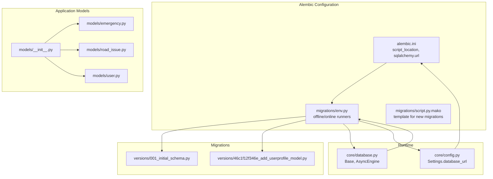
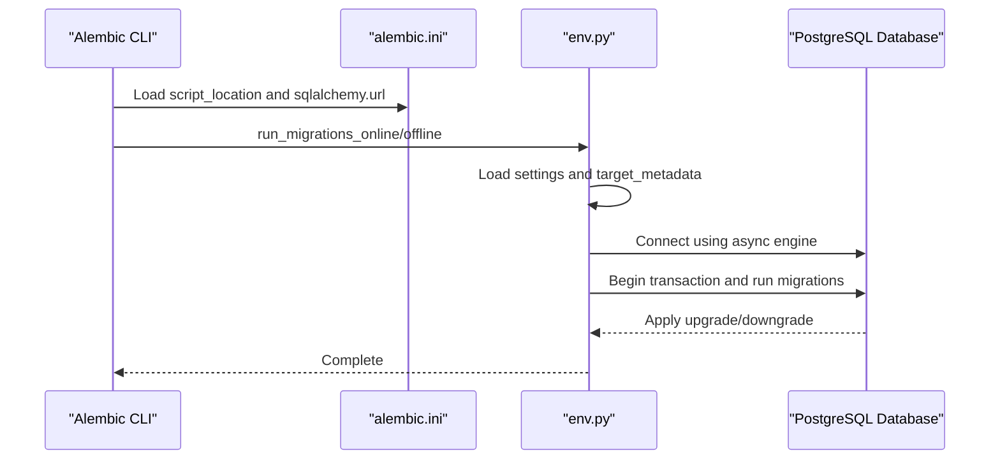
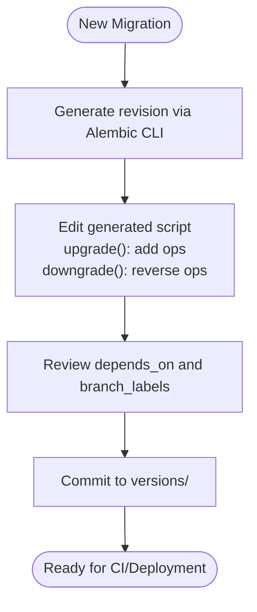
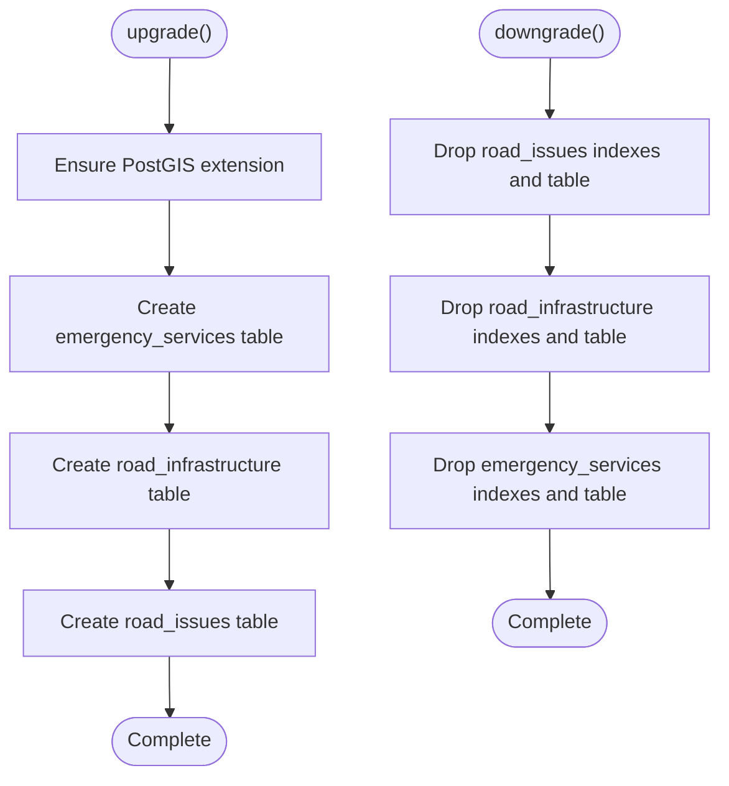
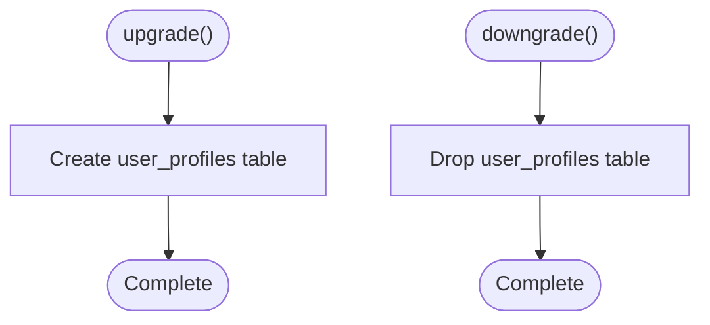
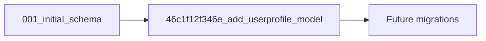
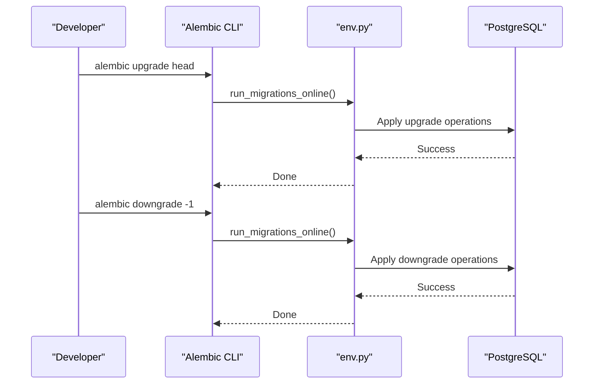
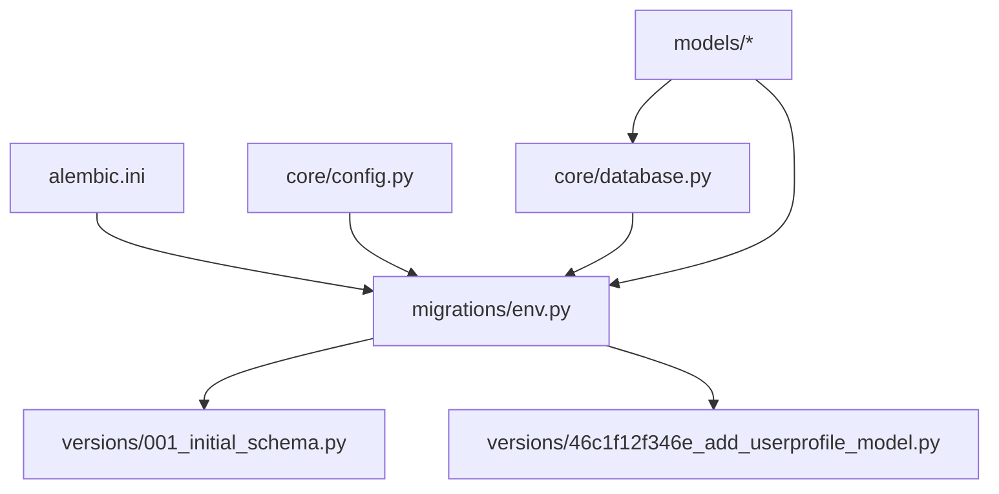

# Migration Management

<cite>
**Referenced Files in This Document**
- [alembic.ini](file://backend/alembic.ini)
- [env.py](file://backend/migrations/env.py)
- [script.py.mako](file://backend/migrations/script.py.mako)
- [001_initial_schema.py](file://backend/migrations/versions/001_initial_schema.py)
- [46c1f12f346e_add_userprofile_model.py](file://backend/migrations/versions/46c1f12f346e_add_userprofile_model.py)
- [database.py](file://backend/core/database.py)
- [config.py](file://backend/core/config.py)
- [models/__init__.py](file://backend/models/__init__.py)
- [emergency.py](file://backend/models/emergency.py)
- [road_issue.py](file://backend/models/road_issue.py)
- [user.py](file://backend/models/user.py)
- [check_db.py](file://backend/scripts/app/check_db.py)
- [backend.yml](file://.github/workflows/backend.yml)
</cite>

## Table of Contents
1. [Introduction](#introduction)
2. [Project Structure](#project-structure)
3. [Core Components](#core-components)
4. [Architecture Overview](#architecture-overview)
5. [Detailed Component Analysis](#detailed-component-analysis)
6. [Dependency Analysis](#dependency-analysis)
7. [Performance Considerations](#performance-considerations)
8. [Troubleshooting Guide](#troubleshooting-guide)
9. [Conclusion](#conclusion)
10. [Appendices](#appendices)

## Introduction
This document explains how SafeVixAI manages database migrations using Alembic. It covers migration file structure, version numbering, upgrade and downgrade procedures, dependencies, branching strategies, and conflict resolution. It also documents step-by-step execution commands, rollback procedures, best practices for writing new migrations, handling data transformations, maintaining backward compatibility, and production deployment strategies including zero-downtime techniques.

## Project Structure
SafeVixAI’s backend uses Alembic for database migrations under the migrations directory. The migration environment integrates with the application’s SQLAlchemy declarative base and settings, ensuring migrations run against the configured database URL. The models module defines the ORM entities that Alembic compares against during migrations.

**Diagram sources**
- [alembic.ini:1-37](file://backend/alembic.ini#L1-L37)
- [env.py:1-64](file://backend/migrations/env.py#L1-L64)
- [script.py.mako:1-25](file://backend/migrations/script.py.mako#L1-L25)
- [001_initial_schema.py:1-140](file://backend/migrations/versions/001_initial_schema.py#L1-L140)
- [46c1f12f346e_add_userprofile_model.py:1-40](file://backend/migrations/versions/46c1f12f346e_add_userprofile_model.py#L1-L40)
- [database.py:1-50](file://backend/core/database.py#L1-L50)
- [config.py:1-181](file://backend/core/config.py#L1-L181)
- [models/__init__.py:1-7](file://backend/models/__init__.py#L1-L7)
- [emergency.py:1-45](file://backend/models/emergency.py#L1-L45)
- [road_issue.py:1-66](file://backend/models/road_issue.py#L1-L66)
- [user.py:1-25](file://backend/models/user.py#L1-L25)

**Section sources**
- [alembic.ini:1-37](file://backend/alembic.ini#L1-L37)
- [env.py:1-64](file://backend/migrations/env.py#L1-L64)
- [script.py.mako:1-25](file://backend/migrations/script.py.mako#L1-L25)
- [database.py:1-50](file://backend/core/database.py#L1-L50)
- [config.py:1-181](file://backend/core/config.py#L1-L181)
- [models/__init__.py:1-7](file://backend/models/__init__.py#L1-L7)

## Core Components
- Alembic configuration: Defines script location and SQLAlchemy URL. The ini file sets the database URL and logging levels.
- Migration environment: Provides offline and online migration runners. Online runner uses an async SQLAlchemy engine and connects via Alembic context.
- Migration templates: The Mako template generates boilerplate for new revisions.
- Migration scripts: Two concrete migrations exist:
  - Initial schema creation covering emergency services, road infrastructure, and road issues.
  - Addition of the user profiles model.
- Application models: ORM models define the target metadata that Alembic compares against during migrations.

Key responsibilities:
- alembic.ini: Centralizes Alembic settings and database URL.
- env.py: Loads settings, constructs async engine, and runs migrations offline or online.
- script.py.mako: Generates revision files with proper metadata and placeholders.
- Migration scripts: Define upgrade and downgrade operations for schema changes.
- Models: Define table structures and indexes used by Alembic.

**Section sources**
- [alembic.ini:1-37](file://backend/alembic.ini#L1-L37)
- [env.py:1-64](file://backend/migrations/env.py#L1-L64)
- [script.py.mako:1-25](file://backend/migrations/script.py.mako#L1-L25)
- [001_initial_schema.py:1-140](file://backend/migrations/versions/001_initial_schema.py#L1-L140)
- [46c1f12f346e_add_userprofile_model.py:1-40](file://backend/migrations/versions/46c1f12f346e_add_userprofile_model.py#L1-L40)
- [models/__init__.py:1-7](file://backend/models/__init__.py#L1-L7)

## Architecture Overview
The migration pipeline integrates Alembic with the application runtime:
- Alembic reads configuration from alembic.ini.
- env.py loads settings and target metadata from the application’s Base.
- During online migrations, env.py creates an async SQLAlchemy engine and executes migrations against the configured database.
- The models module registers ORM classes so Alembic can compare against the current schema.

**Diagram sources**
- [alembic.ini:1-37](file://backend/alembic.ini#L1-L37)
- [env.py:1-64](file://backend/migrations/env.py#L1-L64)

## Detailed Component Analysis

### Migration File Structure and Versioning
- Revision IDs: Each migration script defines a human-readable revision identifier and tracks its parent revision.
  - Example: Initial schema uses a descriptive ID and no parent.
  - Example: User profile addition specifies its parent revision.
- Metadata: Each script includes header comments with revision ID, parent revision, and creation date.
- Upgrade and downgrade: Each script implements functions to apply and revert schema changes.

**Diagram sources**
- [script.py.mako:1-25](file://backend/migrations/script.py.mako#L1-L25)
- [001_initial_schema.py:1-140](file://backend/migrations/versions/001_initial_schema.py#L1-L140)
- [46c1f12f346e_add_userprofile_model.py:1-40](file://backend/migrations/versions/46c1f12f346e_add_userprofile_model.py#L1-L40)

**Section sources**
- [script.py.mako:1-25](file://backend/migrations/script.py.mako#L1-L25)
- [001_initial_schema.py:1-140](file://backend/migrations/versions/001_initial_schema.py#L1-L140)
- [46c1f12f346e_add_userprofile_model.py:1-40](file://backend/migrations/versions/46c1f12f346e_add_userprofile_model.py#L1-L40)

### Initial Schema Creation (001_initial_schema)
- Purpose: Creates foundational tables and spatial indexes for emergency services, road infrastructure, and road issues.
- Spatial extensions: Initializes PostGIS extension.
- Indexes: Includes GIST indexes for spatial columns and standard indexes for frequently queried columns.
- Downgrade order: Drops indexes first, then tables to maintain referential integrity.

**Diagram sources**
- [001_initial_schema.py:22-140](file://backend/migrations/versions/001_initial_schema.py#L22-L140)

**Section sources**
- [001_initial_schema.py:1-140](file://backend/migrations/versions/001_initial_schema.py#L1-L140)

### Subsequent Model Changes (Add UserProfile)
- Purpose: Adds a user profiles table to support user-specific data.
- Downgrade: Removes the user profiles table.

**Diagram sources**
- [46c1f12f346e_add_userprofile_model.py:19-40](file://backend/migrations/versions/46c1f12f346e_add_userprofile_model.py#L19-L40)

**Section sources**
- [46c1f12f346e_add_userprofile_model.py:1-40](file://backend/migrations/versions/46c1f12f346e_add_userprofile_model.py#L1-L40)

### Migration Dependencies and Branching
- Dependencies: Each migration declares its parent revision. The initial schema has no parent; subsequent migrations specify their parent.
- Branching: Alembic supports branching via branch_labels and depends_on. Use branch_labels for named branches and depends_on for cross-module dependencies.
- Conflict resolution: When conflicts arise, resolve by adjusting revision dependencies, squashing related revisions, or creating merge revisions that reconcile divergent histories.

**Diagram sources**
- [001_initial_schema.py:16-19](file://backend/migrations/versions/001_initial_schema.py#L16-L19)
- [46c1f12f346e_add_userprofile_model.py:12-16](file://backend/migrations/versions/46c1f12f346e_add_userprofile_model.py#L12-L16)

**Section sources**
- [001_initial_schema.py:16-19](file://backend/migrations/versions/001_initial_schema.py#L16-L19)
- [46c1f12f346e_add_userprofile_model.py:12-16](file://backend/migrations/versions/46c1f12f346e_add_userprofile_model.py#L12-L16)

### Upgrade and Rollback Procedures
- Upgrade to head:
  - Use the Alembic CLI to migrate forward to the latest revision.
- Rollback to previous revision:
  - Use the Alembic CLI to downgrade to a specific revision or by a relative number of steps.
- Verify state:
  - Use the provided database inspection script to list tables and row counts.

**Diagram sources**
- [env.py:45-63](file://backend/migrations/env.py#L45-L63)

**Section sources**
- [env.py:45-63](file://backend/migrations/env.py#L45-L63)
- [check_db.py:1-31](file://backend/scripts/app/check_db.py#L1-L31)

## Dependency Analysis
- Alembic configuration depends on application settings for the database URL.
- env.py depends on the application’s Base metadata and settings.
- Migration scripts depend on Alembic APIs and SQLAlchemy types.
- Models define the target schema that Alembic compares against.

**Diagram sources**
- [alembic.ini:1-37](file://backend/alembic.ini#L1-L37)
- [env.py:1-64](file://backend/migrations/env.py#L1-L64)
- [config.py:1-181](file://backend/core/config.py#L1-L181)
- [database.py:1-50](file://backend/core/database.py#L1-L50)
- [001_initial_schema.py:1-140](file://backend/migrations/versions/001_initial_schema.py#L1-L140)
- [46c1f12f346e_add_userprofile_model.py:1-40](file://backend/migrations/versions/46c1f12f346e_add_userprofile_model.py#L1-L40)
- [models/__init__.py:1-7](file://backend/models/__init__.py#L1-L7)

**Section sources**
- [alembic.ini:1-37](file://backend/alembic.ini#L1-L37)
- [env.py:1-64](file://backend/migrations/env.py#L1-L64)
- [config.py:1-181](file://backend/core/config.py#L1-L181)
- [database.py:1-50](file://backend/core/database.py#L1-L50)
- [models/__init__.py:1-7](file://backend/models/__init__.py#L1-L7)

## Performance Considerations
- Asynchronous migrations: The online runner uses an async engine to improve connection handling.
- Pool configuration: The application configures connection pooling parameters that influence migration performance.
- Spatial indexes: Initial migrations create GIST indexes for spatial queries; ensure appropriate indexing strategies for large datasets.
- Batch operations: Prefer bulk operations and minimize long transactions during migrations.

[No sources needed since this section provides general guidance]

## Troubleshooting Guide
- Database connectivity:
  - Confirm the database URL in settings and alembic.ini matches the target environment.
  - Use the provided database inspection script to verify connectivity and table presence.
- Migration failures:
  - Check Alembic logs for errors and review the specific migration script.
  - Ensure PostGIS extension is available in the target database.
- Rollback verification:
  - After downgrading, confirm tables and indexes are removed as expected.

**Section sources**
- [config.py:19-96](file://backend/core/config.py#L19-L96)
- [alembic.ini:4](file://backend/alembic.ini#L4)
- [check_db.py:1-31](file://backend/scripts/app/check_db.py#L1-L31)

## Conclusion
SafeVixAI’s Alembic-based migration system cleanly integrates with the application’s async SQLAlchemy setup and settings. The current migration set establishes a robust spatial schema and adds user profile support. By following the documented procedures, best practices, and branching strategies, teams can safely evolve the schema while maintaining backward compatibility and enabling production deployments with minimal downtime.

[No sources needed since this section summarizes without analyzing specific files]

## Appendices

### Step-by-Step Migration Execution Commands
- Initialize or update Alembic configuration:
  - Ensure alembic.ini points to the correct script_location and database URL.
- Generate a new migration:
  - Use the Alembic CLI to autogenerate a revision based on model changes.
- Apply migrations:
  - Upgrade to head to apply all pending migrations.
- Roll back migrations:
  - Downgrade by a relative number of steps or to a specific revision.
- Verify state:
  - Run the database inspection script to list tables and row counts.

**Section sources**
- [alembic.ini:1-37](file://backend/alembic.ini#L1-L37)
- [env.py:45-63](file://backend/migrations/env.py#L45-L63)
- [check_db.py:1-31](file://backend/scripts/app/check_db.py#L1-L31)

### Best Practices for Writing New Migrations
- Keep migrations reversible: Every change should have a corresponding downgrade operation.
- Use descriptive revision IDs and clear commit messages.
- Avoid long-running transactions; break large changes into smaller revisions.
- Test migrations locally and in staging environments before applying to production.
- Add indexes thoughtfully; consider spatial vs. non-spatial indexing needs.

[No sources needed since this section provides general guidance]

### Production Deployment Strategies and Zero-Downtime Techniques
- CI/CD integration:
  - Run migrations as part of automated deployment pipelines using Alembic.
  - The backend workflow demonstrates running tests and preparing dependencies.
- Zero-downtime considerations:
  - Use idempotent operations and avoid blocking schema changes.
  - Prefer adding indexes concurrently and avoiding exclusive locks on large tables.
  - Plan maintenance windows for operations that require table rebuilds.

**Section sources**
- [backend.yml:1-55](file://.github/workflows/backend.yml#L1-L55)