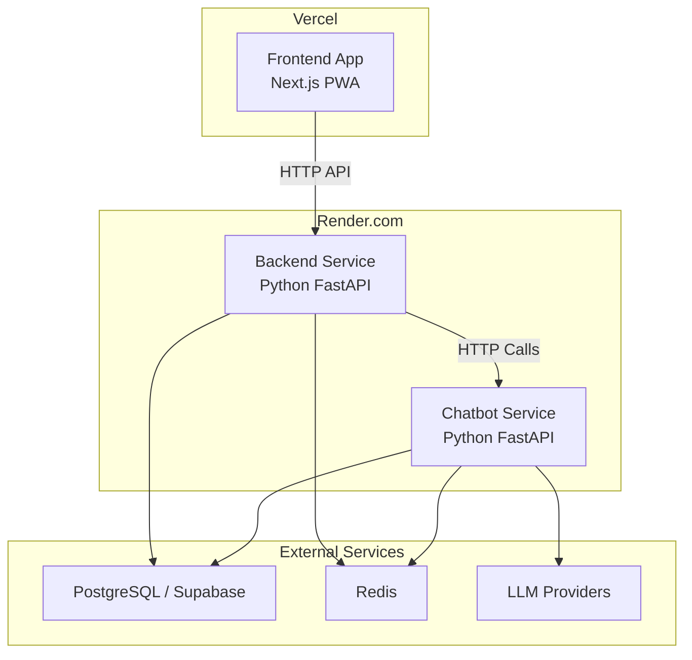
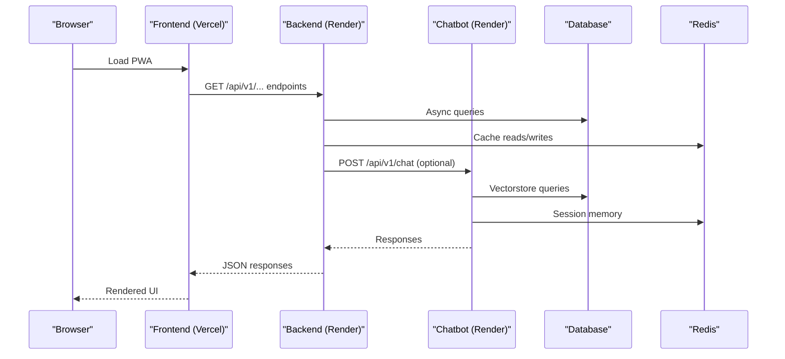
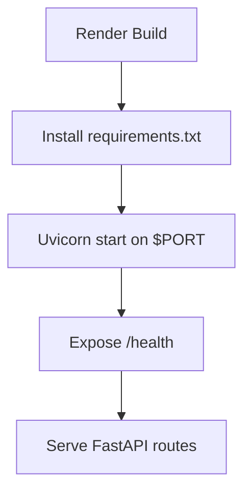
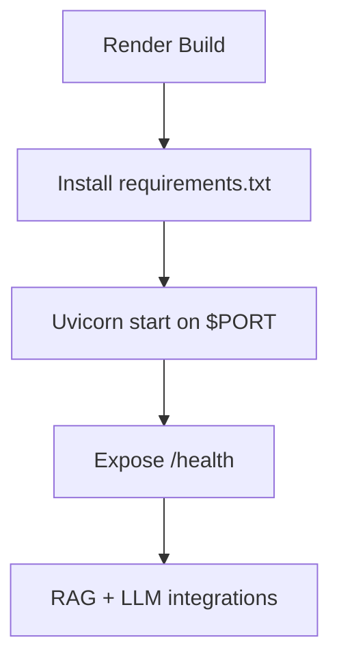
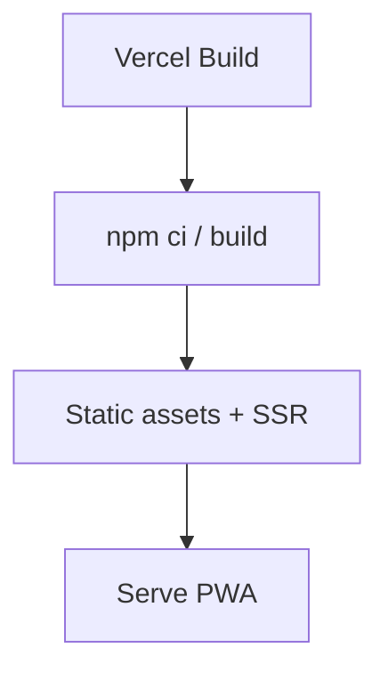
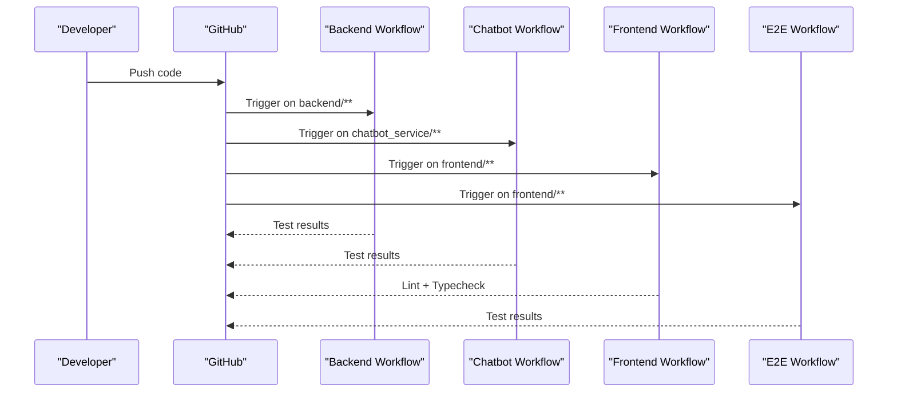
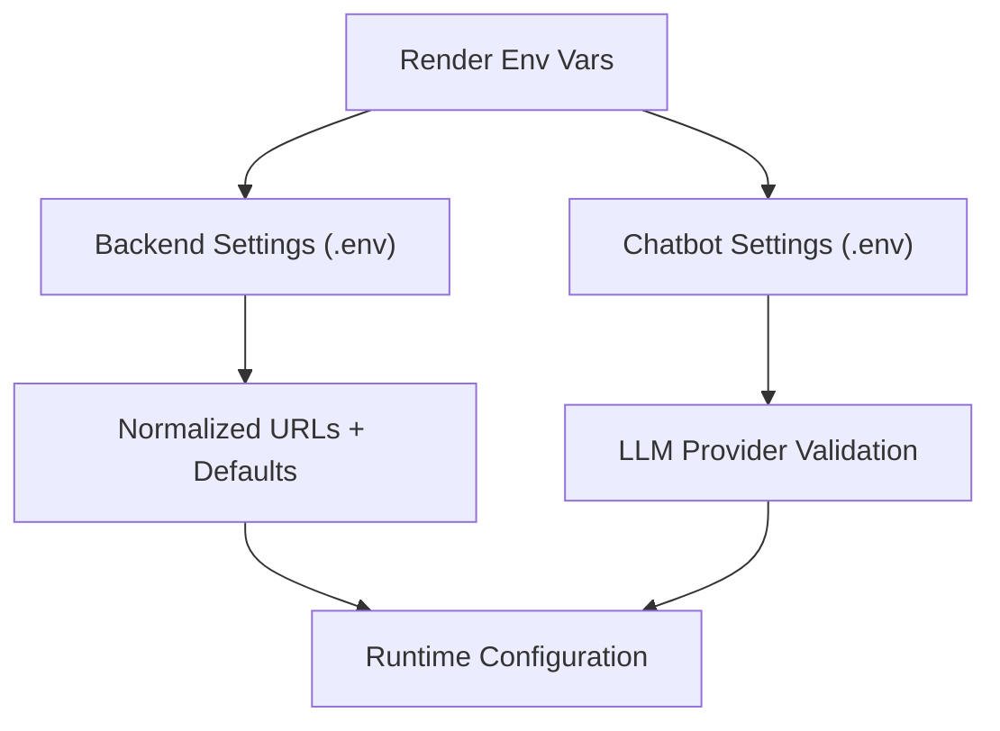
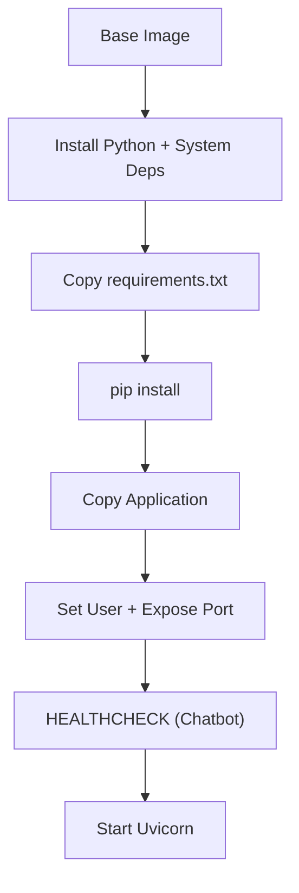
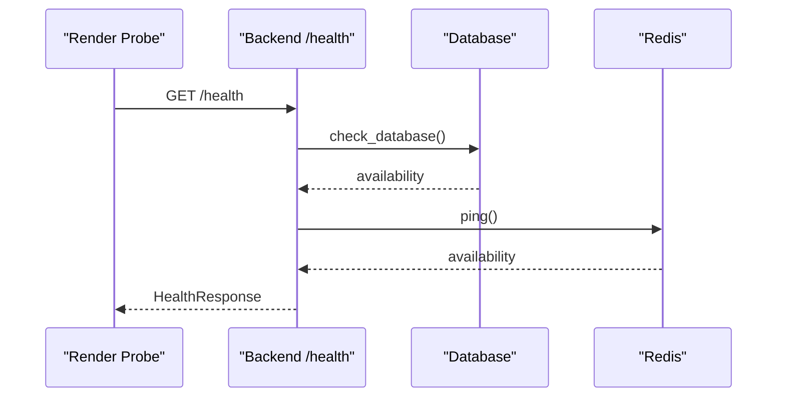
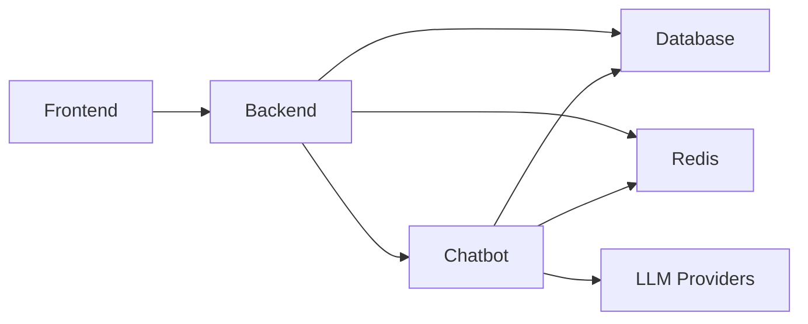

# Deployment and CI/CD

<cite>
**Referenced Files in This Document**
- [render.yaml](file://render.yaml)
- [backend/Dockerfile](file://backend/Dockerfile)
- [chatbot_service/render.yaml](file://chatbot_service/render.yaml)
- [chatbot_service/Dockerfile](file://chatbot_service/Dockerfile)
- [frontend/package.json](file://frontend/package.json)
- [.github/workflows/backend.yml](file://.github/workflows/backend.yml)
- [.github/workflows/chatbot.yml](file://.github/workflows/chatbot.yml)
- [.github/workflows/frontend.yml](file://.github/workflows/frontend.yml)
- [.github/workflows/e2e.yml](file://.github/workflows/e2e.yml)
- [backend/main.py](file://backend/main.py)
- [backend/core/config.py](file://backend/core/config.py)
- [chatbot_service/config.py](file://chatbot_service/config.py)
- [chatbot_service/memory/redis_memory.py](file://chatbot_service/memory/redis_memory.py)
- [chatbot_service/scripts/app/seed_emergency.py](file://chatbot_service/scripts/app/seed_emergency.py)
- [backend/scripts/app/check_db.py](file://backend/scripts/app/check_db.py)
</cite>

## Table of Contents
1. [Introduction](#introduction)
2. [Project Structure](#project-structure)
3. [Core Components](#core-components)
4. [Architecture Overview](#architecture-overview)
5. [Detailed Component Analysis](#detailed-component-analysis)
6. [Dependency Analysis](#dependency-analysis)
7. [Performance Considerations](#performance-considerations)
8. [Troubleshooting Guide](#troubleshooting-guide)
9. [Conclusion](#conclusion)
10. [Appendices](#appendices)

## Introduction
This document provides comprehensive deployment and CI/CD guidance for SafeVixAI across multiple environments. It covers:
- Render.com deployment configuration for backend and chatbot services
- Vercel deployment for the frontend
- GitHub Actions CI/CD pipeline orchestration
- Environment variable management and secrets handling
- Configuration drift prevention
- Containerization with Docker and service orchestration
- Health checks and readiness probes
- Monitoring, logging, and alerting strategies
- Rollback procedures, blue-green deployments, and zero-downtime updates
- Scaling considerations, resource optimization, and cost management

## Project Structure
SafeVixAI consists of three primary services:
- Backend API (FastAPI): Provides emergency locator, road reporting, routing, and chatbot integration
- Chatbot/RAG Service (FastAPI): Handles conversational AI, retrieval-augmented generation, and memory persistence
- Frontend (Next.js): Progressive Web App (PWA) for user interaction

**Diagram sources**
- [render.yaml:1-83](file://render.yaml#L1-L83)
- [chatbot_service/render.yaml:1-9](file://chatbot_service/render.yaml#L1-L9)
- [backend/main.py:24-132](file://backend/main.py#L24-L132)
- [chatbot_service/config.py:39-126](file://chatbot_service/config.py#L39-L126)

**Section sources**
- [render.yaml:1-83](file://render.yaml#L1-L83)
- [chatbot_service/render.yaml:1-9](file://chatbot_service/render.yaml#L1-L9)
- [backend/Dockerfile:1-27](file://backend/Dockerfile#L1-L27)
- [chatbot_service/Dockerfile:1-52](file://chatbot_service/Dockerfile#L1-L52)
- [frontend/package.json:1-85](file://frontend/package.json#L1-L85)

## Core Components
- Backend Service
  - Exposes health endpoint and integrates with chatbot service
  - Uses async database connections and Redis caching
  - Configured via environment variables and .env file
- Chatbot Service
  - RAG-based conversational AI with optional Redis-backed memory
  - Supports multiple LLM providers via API keys
  - Includes health check and persistent vector storage
- Frontend
  - Next.js application built and deployed to Vercel
  - Uses client-side analytics and offline capabilities

Key deployment artifacts:
- Render-managed services with explicit health checks and environment variables
- Dockerfiles for containerized builds
- GitHub Actions workflows for CI

**Section sources**
- [backend/main.py:24-132](file://backend/main.py#L24-L132)
- [backend/core/config.py:11-181](file://backend/core/config.py#L11-L181)
- [chatbot_service/config.py:39-126](file://chatbot_service/config.py#L39-L126)
- [chatbot_service/Dockerfile:48-49](file://chatbot_service/Dockerfile#L48-L49)

## Architecture Overview
The system follows a microservice architecture with a frontend-to-backend-to-chatbot flow. Both backend and chatbot services are containerized and managed by Render. The frontend is hosted on Vercel.

**Diagram sources**
- [backend/main.py:75-128](file://backend/main.py#L75-L128)
- [chatbot_service/config.py:39-126](file://chatbot_service/config.py#L39-L126)
- [chatbot_service/memory/redis_memory.py:10-90](file://chatbot_service/memory/redis_memory.py#L10-L90)

## Detailed Component Analysis

### Backend Service Deployment (Render)
- Service type: web
- Environment: Python
- Root directory: backend
- Build command installs requirements.txt
- Start command runs Uvicorn with host, port, and worker settings
- Health check path: /health
- Environment variables:
  - Database connection (DATABASE_URL)
  - Redis connection (REDIS_URL)
  - Supabase credentials (SUPABASE_URL, SUPABASE_ANON_KEY, SUPABASE_SERVICE_ROLE_KEY)
  - CORS origins (CORS_ORIGINS)
  - Chatbot service URL (CHATBOT_SERVICE_URL)
  - Local uploads base URL (LOCAL_UPLOAD_BASE_URL)
  - External API keys (OPENROUTESERVICE_API_KEY, OPENWEATHER_API_KEY, HEALTHSITES_TOKEN)

**Diagram sources**
- [render.yaml:3-9](file://render.yaml#L3-L9)
- [backend/Dockerfile:16-26](file://backend/Dockerfile#L16-L26)

**Section sources**
- [render.yaml:3-35](file://render.yaml#L3-L35)
- [backend/Dockerfile:1-27](file://backend/Dockerfile#L1-L27)
- [backend/main.py:103-125](file://backend/main.py#L103-L125)

### Chatbot Service Deployment (Render)
- Service type: web
- Environment: Python
- Root directory: chatbot_service
- Build command installs requirements.txt
- Start command runs Uvicorn on $PORT
- Health check path: /health
- Environment variables include provider keys, CORS, Redis, backend base URL, and admin secret

**Diagram sources**
- [render.yaml:37-83](file://render.yaml#L37-L83)
- [chatbot_service/render.yaml:1-9](file://chatbot_service/render.yaml#L1-L9)
- [chatbot_service/Dockerfile:48-49](file://chatbot_service/Dockerfile#L48-L49)

**Section sources**
- [render.yaml:37-83](file://render.yaml#L37-L83)
- [chatbot_service/render.yaml:1-9](file://chatbot_service/render.yaml#L1-L9)
- [chatbot_service/Dockerfile:1-52](file://chatbot_service/Dockerfile#L1-L52)

### Frontend Deployment (Vercel)
- Next.js application
- Uses package.json scripts for build and start
- Deployed to Vercel with standard configuration

**Diagram sources**
- [frontend/package.json:6-13](file://frontend/package.json#L6-L13)

**Section sources**
- [frontend/package.json:1-85](file://frontend/package.json#L1-L85)

### CI/CD Pipeline Orchestration (GitHub Actions)
- Backend CI: Runs Python tests on pushes and pull requests targeting backend/**
- Chatbot CI: Runs Python tests on pushes and pull requests targeting chatbot_service/**
- Frontend CI: Lints and type-checks on pushes and pull requests targeting frontend/**
- E2E CI: Runs frontend tests on pushes and pull requests targeting frontend/**

**Diagram sources**
- [.github/workflows/backend.yml:1-55](file://.github/workflows/backend.yml#L1-L55)
- [.github/workflows/chatbot.yml:1-55](file://.github/workflows/chatbot.yml#L1-L55)
- [.github/workflows/frontend.yml:1-43](file://.github/workflows/frontend.yml#L1-L43)
- [.github/workflows/e2e.yml:1-43](file://.github/workflows/e2e.yml#L1-L43)

**Section sources**
- [.github/workflows/backend.yml:1-55](file://.github/workflows/backend.yml#L1-L55)
- [.github/workflows/chatbot.yml:1-55](file://.github/workflows/chatbot.yml#L1-L55)
- [.github/workflows/frontend.yml:1-43](file://.github/workflows/frontend.yml#L1-L43)
- [.github/workflows/e2e.yml:1-43](file://.github/workflows/e2e.yml#L1-L43)

### Environment Variables and Secrets Management
- Backend
  - Uses pydantic-settings BaseSettings with .env loading
  - Critical variables: DATABASE_URL, REDIS_URL, SUPABASE_* keys, CORS_ORIGINS, CHATBOT_SERVICE_URL, LOCAL_UPLOAD_BASE_URL, external API keys
  - Production-grade defaults and normalization helpers
- Chatbot
  - Uses os.getenv with defaults and .env loading
  - Critical variables: MAIN_BACKEND_BASE_URL, REDIS_URL, provider keys (GROQ_API_KEY, GOOGLE_API_KEY, etc.), OPENWEATHER_API_KEY, W3W_API_KEY, OPENCAGE_API_KEY, ADMIN_SECRET
  - Validates presence of at least one LLM provider key at runtime

**Diagram sources**
- [backend/core/config.py:11-181](file://backend/core/config.py#L11-L181)
- [chatbot_service/config.py:39-126](file://chatbot_service/config.py#L39-L126)
- [render.yaml:10-35](file://render.yaml#L10-L35)
- [render.yaml:44-83](file://render.yaml#L44-L83)

**Section sources**
- [backend/core/config.py:11-181](file://backend/core/config.py#L11-L181)
- [chatbot_service/config.py:39-126](file://chatbot_service/config.py#L39-L126)
- [render.yaml:10-83](file://render.yaml#L10-L83)

### Configuration Drift Prevention
- Centralized environment variable definitions in Render service manifests
- Strong typing and defaults in settings classes
- Health endpoints expose current configuration state for observability
- CI enforces environment parity by requiring .env-compatible variables during tests

**Section sources**
- [render.yaml:10-83](file://render.yaml#L10-L83)
- [backend/main.py:103-125](file://backend/main.py#L103-L125)
- [.github/workflows/backend.yml:47-54](file://.github/workflows/backend.yml#L47-L54)
- [.github/workflows/chatbot.yml:47-54](file://.github/workflows/chatbot.yml#L47-L54)

### Containerization with Docker
- Backend Dockerfile
  - Multi-stage build recommended but not enforced; uses slim base image
  - Installs system dependencies and Python packages
  - Sets non-root user and exposes port 8000
  - Starts Uvicorn with host/port configuration
- Chatbot Dockerfile
  - Multi-stage build with separate builder stage for dependencies
  - Installs system libraries for pdfplumber and chromadb
  - Includes HEALTHCHECK using curl against /health
  - Non-root user and persistent directories

**Diagram sources**
- [backend/Dockerfile:1-27](file://backend/Dockerfile#L1-L27)
- [chatbot_service/Dockerfile:1-52](file://chatbot_service/Dockerfile#L1-L52)

**Section sources**
- [backend/Dockerfile:1-27](file://backend/Dockerfile#L1-L27)
- [chatbot_service/Dockerfile:1-52](file://chatbot_service/Dockerfile#L1-L52)

### Service Orchestration and Health Checks
- Backend
  - Health endpoint validates database connectivity and cache availability
  - Returns degraded status when database is unavailable
- Chatbot
  - Health endpoint reachable via /health
  - Dockerfile defines HEALTHCHECK for container-level readiness

**Diagram sources**
- [backend/main.py:103-125](file://backend/main.py#L103-L125)
- [backend/scripts/app/check_db.py:8-28](file://backend/scripts/app/check_db.py#L8-L28)
- [chatbot_service/Dockerfile:48-49](file://chatbot_service/Dockerfile#L48-L49)

**Section sources**
- [backend/main.py:103-125](file://backend/main.py#L103-L125)
- [chatbot_service/Dockerfile:48-49](file://chatbot_service/Dockerfile#L48-L49)

### Monitoring, Logging, and Alerting
- Backend
  - Health endpoint provides operational status for monitoring
  - Logging warnings for production CORS configuration
- Chatbot
  - Logs active LLM provider keys at startup
- Recommendations
  - Integrate Render logs with external log aggregation (e.g., structured JSON logs)
  - Add metrics endpoints for latency and error rates
  - Configure alerts for sustained degraded status or failing health checks

**Section sources**
- [backend/main.py:80-83](file://backend/main.py#L80-L83)
- [chatbot_service/config.py:115-126](file://chatbot_service/config.py#L115-L126)

### Rollback Procedures, Blue-Green Deployments, and Zero-Downtime Updates
- Blue-green deployment
  - Maintain two identical Render service instances with distinct names
  - Switch traffic by updating DNS or platform routing rules after validating the new instance health
- Rollback
  - Re-deploy previous release tag or image to the previously green instance
  - Validate /health on the reverted instance before switching traffic back
- Zero-downtime updates
  - Ensure health checks are strict and only switch traffic when both database and cache are healthy
  - Use rolling restarts with readiness probes to avoid partial failures

[No sources needed since this section provides general guidance]

### Scaling Considerations, Resource Optimization, and Cost Management
- Horizontal scaling
  - Increase worker processes in Uvicorn start commands for CPU-bound tasks
  - Scale Redis and database connections according to peak concurrency
- Resource optimization
  - Use multi-stage Docker builds to reduce image size
  - Pin dependency versions to minimize rebuild churn
- Cost management
  - Right-size Render dynos and plan for traffic spikes
  - Monitor LLM provider costs and enable caching to reduce token usage
  - Consolidate logs and traces to reduce storage overhead

[No sources needed since this section provides general guidance]

## Dependency Analysis
- Backend depends on:
  - Database (via asyncpg)
  - Redis for caching and session memory
  - External APIs (OpenRouteService, OpenWeather, Overpass/Nominatim)
  - Chatbot service for conversational features
- Chatbot depends on:
  - Database for vectorstore persistence
  - Redis for session memory
  - LLM providers via API keys
  - Backend for contextual data and integrations

**Diagram sources**
- [backend/main.py:24-64](file://backend/main.py#L24-L64)
- [chatbot_service/config.py:39-126](file://chatbot_service/config.py#L39-L126)

**Section sources**
- [backend/main.py:24-64](file://backend/main.py#L24-L64)
- [chatbot_service/config.py:39-126](file://chatbot_service/config.py#L39-L126)

## Performance Considerations
- Database and cache
  - Use async drivers and connection pooling
  - Tune pool sizes and timeouts per workload
- API latency
  - Enable compression and static asset optimization in production
  - Cache frequently accessed routes and reduce external API calls
- Memory and storage
  - Persist Redis sessions with TTL and monitor eviction policies
  - Pre-build vectorstore indices to reduce cold-start latency

[No sources needed since this section provides general guidance]

## Troubleshooting Guide
- Health check failures
  - Verify database connectivity and credentials
  - Confirm Redis is reachable and responsive
- CORS errors
  - Set CORS_ORIGINS to exact frontend origin in production
- Missing LLM provider keys
  - Ensure at least one provider key is configured in the chatbot service
- Upload issues
  - Validate LOCAL_UPLOAD_BASE_URL and allowed content types
- Database initialization
  - Use provided scripts to verify schema and seed data

**Section sources**
- [backend/main.py:103-125](file://backend/main.py#L103-L125)
- [backend/core/config.py:72-84](file://backend/core/config.py#L72-L84)
- [chatbot_service/config.py:119-126](file://chatbot_service/config.py#L119-L126)
- [backend/scripts/app/check_db.py:8-28](file://backend/scripts/app/check_db.py#L8-L28)

## Conclusion

> **Current CI/CD Workflows (7 total):**
> - `backend.yml` — Backend unit tests
> - `chatbot.yml` — Chatbot service tests
> - `frontend.yml` — Frontend lint + build
> - `e2e.yml` — End-to-end tests
> - `security.yml` — Bandit + Safety scanning
> - `system.yml` — System integration tests
> - `update-master-doc.yml` — Daily auto-update of SafeVixAI_MASTER.docx

SafeVixAI’s deployment model leverages Render for backend and chatbot services, Vercel for the frontend, and GitHub Actions for CI. By centralizing environment variables, enforcing strong typing in settings, and implementing robust health checks, the system achieves predictable deployments with minimal configuration drift. Adopting blue-green deployments, monitoring, and cost-aware scaling ensures reliable, scalable operations across environments.

[No sources needed since this section summarizes without analyzing specific files]

## Appendices

### Environment Variable Reference
- Backend
  - DATABASE_URL, REDIS_URL, SUPABASE_URL, SUPABASE_ANON_KEY, SUPABASE_SERVICE_ROLE_KEY, CORS_ORIGINS, CHATBOT_SERVICE_URL, LOCAL_UPLOAD_BASE_URL, OPENROUTESERVICE_API_KEY, OPENWEATHER_API_KEY, HEALTHSITES_TOKEN
- Chatbot
  - ENVIRONMENT, REDIS_URL, MAIN_BACKEND_BASE_URL, CORS_ORIGINS, GROQ_API_KEY, GOOGLE_API_KEY, GEMINI_MODEL, CEREBRAS_API_KEY, OPENROUTER_API_KEY, MISTRAL_API_KEY, TOGETHER_API_KEY, SARVAM_API_KEY, HF_TOKEN, NVIDIA_NIM_API_KEY, GITHUB_TOKEN, OPENWEATHER_API_KEY, W3W_API_KEY, OPENCAGE_API_KEY, ADMIN_SECRET

**Section sources**
- [render.yaml:10-83](file://render.yaml#L10-L83)
- [chatbot_service/config.py:71-113](file://chatbot_service/config.py#L71-L113)

### Health Check Endpoints
- Backend: /health
- Chatbot: /health

**Section sources**
- [backend/main.py:103-125](file://backend/main.py#L103-L125)
- [chatbot_service/Dockerfile:48-49](file://chatbot_service/Dockerfile#L48-L49)

## HuggingFace Dataset Hub

SafeVixAI publishes its curated datasets on the **[HuggingFace Dataset Hub](https://huggingface.co/datasets/SafeVixAI/SafeVixAI-Dataset-Hub)** for research reproducibility and community collaboration. This includes:

- Emergency service coordinates for 25 Indian cities
- Motor Vehicle Act violation databases with state-specific overrides
- Road infrastructure GeoJSON datasets (PMGSY, NHAI, toll plazas)
- ChromaDB vector store training corpora (legal documents, first aid guides, WHO road safety data)

> **Note**: The HuggingFace Dataset Hub is a *data hosting* layer — models are served via WebLLM CDN and LLM providers (Groq, Gemini, etc.), not from HuggingFace model inference.

## External Service Integrations

| Service | Purpose | Access Method |
|---|---|---|
| **HuggingFace Dataset Hub** | Dataset hosting & research reproducibility | Public download (`huggingface.co/datasets/SafeVixAI`) |
| **HuggingFace Inference API** | Sarvam AI fallback, Whisper ASR, Shuka voice, BharatGen | `HF_TOKEN` env var |
| **@huggingface/transformers** | Browser-side model loading (npm package) | `npm install` |
| **WebLLM CDN** | Phi-3 Mini offline model delivery | Browser Cache Storage |
| **OpenRouter** | LLM provider fallback routing | API key |
| **Supabase** | Auth, PostgreSQL, storage | `SUPABASE_URL` + `SUPABASE_KEY` |
| **Render.com** | Backend + Chatbot deployment | `render.yaml` |
| **Vercel** | Frontend PWA deployment | Git integration |
