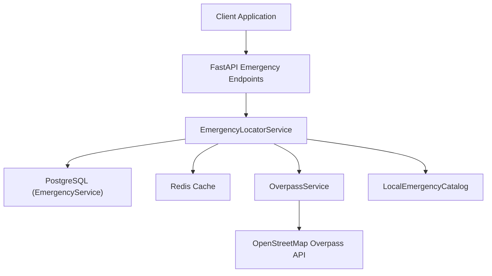
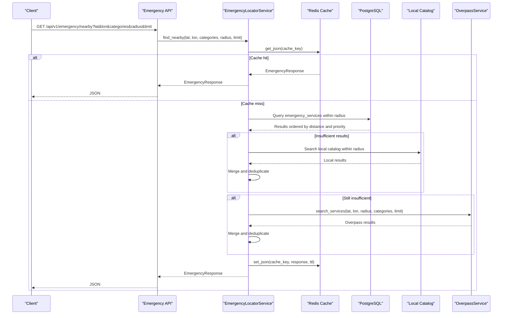
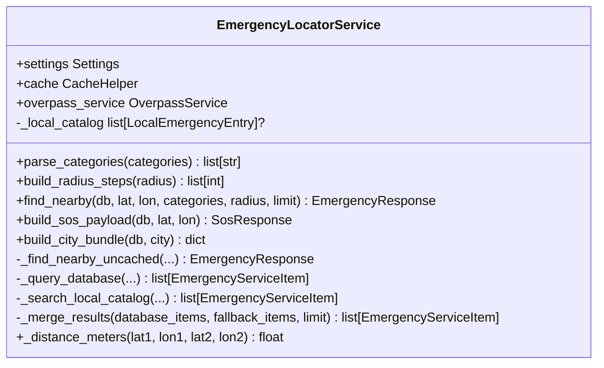
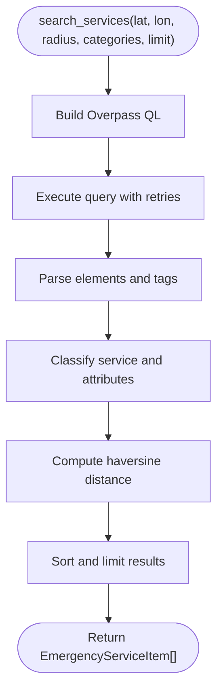
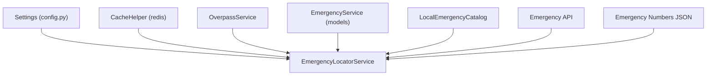

# Emergency Locator Module

<cite>
**Referenced Files in This Document**
- [emergency_locator.py](file://backend/services/emergency_locator.py)
- [overpass_service.py](file://backend/services/overpass_service.py)
- [local_emergency_catalog.py](file://backend/services/local_emergency_catalog.py)
- [emergency.py](file://backend/models/emergency.py)
- [schemas.py](file://backend/models/schemas.py)
- [emergency.py](file://backend/api/v1/emergency.py)
- [config.py](file://backend/core/config.py)
- [main.py](file://backend/main.py)
- [test_emergency.py](file://backend/tests/test_emergency.py)
- [emergency_numbers.json](file://chatbot_service/data/emergency_numbers.json)
</cite>

## Table of Contents
1. [Introduction](#introduction)
2. [Project Structure](#project-structure)
3. [Core Components](#core-components)
4. [Architecture Overview](#architecture-overview)
5. [Detailed Component Analysis](#detailed-component-analysis)
6. [Dependency Analysis](#dependency-analysis)
7. [Performance Considerations](#performance-considerations)
8. [Troubleshooting Guide](#troubleshooting-guide)
9. [Conclusion](#conclusion)
10. [Appendices](#appendices)

## Introduction
The Emergency Locator module provides real-time discovery of nearby emergency services using a tiered fallback strategy. It integrates with PostgreSQL for persistent data, Redis for caching, and the Overpass API for OpenStreetMap-based emergency facilities. The system supports configurable radius tiers, service categories, and geographic boundaries, delivering robust results even under poor GPS accuracy or offline conditions.

## Project Structure
The Emergency Locator spans several backend modules:
- Services: EmergencyLocatorService orchestrates discovery, OverpassService queries OSM, and LocalEmergencyCatalog loads curated datasets.
- Models: EmergencyService defines the database schema for emergency facilities.
- API: FastAPI endpoints expose emergency discovery, SOS payloads, and emergency numbers.
- Configuration: Settings define radius tiers, timeouts, and external service URLs.
- Tests: Validate fallback behavior, caching, and integration.

**Diagram sources**
- [emergency.py:19-75](file://backend/api/v1/emergency.py#L19-L75)
- [emergency_locator.py:161-373](file://backend/services/emergency_locator.py#L161-L373)
- [overpass_service.py:24-78](file://backend/services/overpass_service.py#L24-L78)
- [local_emergency_catalog.py:25-34](file://backend/services/local_emergency_catalog.py#L25-L34)
- [emergency.py:12-45](file://backend/models/emergency.py#L12-L45)

**Section sources**
- [emergency_locator.py:161-373](file://backend/services/emergency_locator.py#L161-L373)
- [emergency.py:19-75](file://backend/api/v1/emergency.py#L19-L75)
- [config.py:26-47](file://backend/core/config.py#L26-L47)

## Core Components
- EmergencyLocatorService: Central coordinator for emergency discovery, caching, merging, and fallback.
- OverpassService: Queries OpenStreetMap via Overpass API for emergency facilities around a point.
- LocalEmergencyCatalog: Loads curated CSV datasets for hospitals and other emergency services.
- EmergencyService model: Database schema for emergency facilities with spatial indexing.
- Schemas: Pydantic models for API responses and service items.
- API endpoints: Expose nearby search, SOS payload assembly, and emergency numbers.

Key responsibilities:
- Parse categories and normalize inputs.
- Build radius steps from configuration or explicit radius.
- Query database with spatial distance ordering.
- Merge local catalog and Overpass results with deduplication.
- Cache results for performance and offline readiness.
- Provide SOS payload with emergency numbers.

**Section sources**
- [emergency_locator.py:161-373](file://backend/services/emergency_locator.py#L161-L373)
- [overpass_service.py:24-78](file://backend/services/overpass_service.py#L24-L78)
- [local_emergency_catalog.py:25-34](file://backend/services/local_emergency_catalog.py#L25-L34)
- [emergency.py:12-45](file://backend/models/emergency.py#L12-L45)
- [schemas.py:36-66](file://backend/models/schemas.py#L36-L66)
- [emergency.py:19-75](file://backend/api/v1/emergency.py#L19-L75)

## Architecture Overview
The Emergency Locator follows a layered architecture:
- Presentation: FastAPI endpoints accept coordinates, categories, radius, and limits.
- Service Layer: EmergencyLocatorService manages discovery logic and caching.
- Data Access: SQLAlchemy ORM queries EmergencyService with geography functions.
- External Integration: OverpassService queries OSM for fallback data.
- Local Data: LocalEmergencyCatalog enriches results with curated entries.

**Diagram sources**
- [emergency.py:19-38](file://backend/api/v1/emergency.py#L19-L38)
- [emergency_locator.py:187-216](file://backend/services/emergency_locator.py#L187-L216)
- [emergency_locator.py:301-373](file://backend/services/emergency_locator.py#L301-L373)
- [overpass_service.py:35-78](file://backend/services/overpass_service.py#L35-L78)

## Detailed Component Analysis

### EmergencyLocatorService
Responsibilities:
- Category parsing and normalization.
- Radius step computation from configuration or explicit radius.
- Database query with spatial distance and priority ordering.
- Local catalog search and merge.
- Overpass fallback and merge.
- Caching and deduplication.
- SOS payload construction.

**Diagram sources**
- [emergency_locator.py:161-507](file://backend/services/emergency_locator.py#L161-L507)

Key behaviors:
- Radius fallback: Iterates configured radius steps until reaching minimum results threshold.
- Priority ordering: Prioritizes trauma availability, 24-hour availability, then distance.
- Deduplication: Merges results across sources while avoiding duplicates.
- Caching: Uses cache keys derived from inputs to reduce repeated work.

**Section sources**
- [emergency_locator.py:168-185](file://backend/services/emergency_locator.py#L168-L185)
- [emergency_locator.py:187-216](file://backend/services/emergency_locator.py#L187-L216)
- [emergency_locator.py:301-373](file://backend/services/emergency_locator.py#L301-L373)
- [emergency_locator.py:375-421](file://backend/services/emergency_locator.py#L375-L421)
- [emergency_locator.py:429-447](file://backend/services/emergency_locator.py#L429-L447)
- [emergency_locator.py:482-506](file://backend/services/emergency_locator.py#L482-L506)

### OverpassService
Responsibilities:
- Build Overpass QL queries for emergency amenities and roads.
- Extract geometry from nodes/ways/relations.
- Classify services and derive attributes (trauma, ICU, 24hr).
- Execute requests with retry/backoff across multiple Overpass endpoints.
- Compute distances using spherical law of cosines.

**Diagram sources**
- [overpass_service.py:35-78](file://backend/services/overpass_service.py#L35-L78)
- [overpass_service.py:123-134](file://backend/services/overpass_service.py#L123-L134)
- [overpass_service.py:136-160](file://backend/services/overpass_service.py#L136-L160)
- [overpass_service.py:238-248](file://backend/services/overpass_service.py#L238-L248)

**Section sources**
- [overpass_service.py:35-78](file://backend/services/overpass_service.py#L35-L78)
- [overpass_service.py:123-160](file://backend/services/overpass_service.py#L123-L160)
- [overpass_service.py:184-236](file://backend/services/overpass_service.py#L184-L236)

### LocalEmergencyCatalog
Responsibilities:
- Load curated CSV datasets for hospitals and other emergency services.
- Normalize coordinates, phone numbers, addresses, and attributes.
- Infer categories from filenames and content.
- Provide LocalEmergencyEntry objects for merging.

**Section sources**
- [local_emergency_catalog.py:25-34](file://backend/services/local_emergency_catalog.py#L25-L34)
- [local_emergency_catalog.py:37-91](file://backend/services/local_emergency_catalog.py#L37-L91)
- [local_emergency_catalog.py:94-128](file://backend/services/local_emergency_catalog.py#L94-L128)
- [local_emergency_catalog.py:131-169](file://backend/services/local_emergency_catalog.py#L131-L169)

### EmergencyService Model
Responsibilities:
- Define database schema for emergency facilities.
- Store spatial data using PostGIS geography/geometry types.
- Index by category and state code for efficient filtering.

**Section sources**
- [emergency.py:12-45](file://backend/models/emergency.py#L12-L45)

### API Endpoints
Responsibilities:
- Expose nearby search, SOS payload, and emergency numbers.
- Validate inputs and propagate external service errors.

**Section sources**
- [emergency.py:19-38](file://backend/api/v1/emergency.py#L19-L38)
- [emergency.py:42-70](file://backend/api/v1/emergency.py#L42-L70)
- [emergency.py:73-75](file://backend/api/v1/emergency.py#L73-L75)

## Dependency Analysis
The Emergency Locator integrates multiple services and configurations:

**Diagram sources**
- [config.py:26-47](file://backend/core/config.py#L26-L47)
- [emergency_locator.py:161-166](file://backend/services/emergency_locator.py#L161-L166)
- [overpass_service.py:24-30](file://backend/services/overpass_service.py#L24-L30)
- [emergency.py:12-45](file://backend/models/emergency.py#L12-L45)
- [local_emergency_catalog.py:25-34](file://backend/services/local_emergency_catalog.py#L25-L34)
- [emergency.py:19-75](file://backend/api/v1/emergency.py#L19-L75)
- [emergency_numbers.json:1-70](file://chatbot_service/data/emergency_numbers.json#L1-L70)

**Section sources**
- [config.py:26-47](file://backend/core/config.py#L26-L47)
- [main.py:24-63](file://backend/main.py#L24-L63)

## Performance Considerations
- Spatial indexing: EmergencyService uses PostGIS geography/geometry with spatial index on location for efficient DWithin queries.
- Priority ordering: Results are ordered by trauma availability, 24-hour availability, and distance to minimize subsequent sorting overhead.
- Caching: Responses are cached with TTL to reduce repeated database and external API calls.
- Radius fallback: Early exit when minimum results threshold is met reduces unnecessary queries.
- Deduplication: Efficient set-based deduplication prevents redundant processing across sources.

[No sources needed since this section provides general guidance]

## Troubleshooting Guide
Common issues and resolutions:
- GPS accuracy: The system iterates radius steps and merges results, so moderate GPS errors are mitigated by increasing radius or relying on local catalog and Overpass fallback.
- Network connectivity: OverpassService retries across multiple endpoints with backoff; ExternalServiceError is caught and handled gracefully.
- Offline scenarios: build_city_bundle precomputes bundles for major cities and caches them; offline bundle directory stores JSON bundles for offline use.
- Cache failures: CacheHelper falls back to memory cache; tests demonstrate fallback behavior.
- Insufficient results: The system merges database, local catalog, and Overpass results; configure emergency_min_results and radius steps accordingly.

Concrete examples from tests:
- Radius expansion and Overpass merge behavior.
- Database-first fallback when Overpass fails.
- Local catalog precedence before Overpass.

**Section sources**
- [test_emergency.py:125-171](file://backend/tests/test_emergency.py#L125-L171)
- [test_emergency.py:173-222](file://backend/tests/test_emergency.py#L173-L222)
- [test_emergency.py:237-284](file://backend/tests/test_emergency.py#L237-L284)

## Conclusion
The Emergency Locator module delivers robust, configurable emergency service discovery through a layered approach: database-first spatial queries, local curated data, and Overpass API fallback. Its tiered radius strategy, caching, and deduplication ensure reliable results across varying GPS accuracy and network conditions. Configuration options enable tuning for different regions and use cases.

[No sources needed since this section summarizes without analyzing specific files]

## Appendices

### Configuration Options
- Emergency radius steps: Comma-separated list controlling iterative radius expansion.
- Max radius: Upper bound for radius expansion.
- Minimum results: Threshold to stop expanding radius.
- Default radius: Default radius for SOS payload.
- Cache TTL: Response cache expiration.
- Overpass URLs: Comma-separated list of Overpass endpoints with retry/backoff.
- HTTP user agent and request timeout: Control external service behavior.

**Section sources**
- [config.py:26-47](file://backend/core/config.py#L26-L47)
- [config.py:99-108](file://backend/core/config.py#L99-L108)

### Supported Categories
- hospital, police, ambulance, fire, towing, pharmacy, puncture, showroom

**Section sources**
- [emergency_locator.py:28-37](file://backend/services/emergency_locator.py#L28-L37)
- [schemas.py](file://backend/models/schemas.py#L10)

### Emergency Numbers
- Pan-India unified emergency numbers and state-specific helplines are loaded from JSON and included in SOS payloads.

**Section sources**
- [emergency_numbers.json:1-70](file://chatbot_service/data/emergency_numbers.json#L1-L70)
- [emergency_locator.py:134-158](file://backend/services/emergency_locator.py#L134-L158)

### Integration with Overpass API and OpenStreetMap
- OverpassService builds queries for amenities and emergency facilities, extracts geometry, and classifies services.
- EmergencyLocatorService merges Overpass results with database and local catalog results.

**Section sources**
- [overpass_service.py:136-160](file://backend/services/overpass_service.py#L136-L160)
- [overpass_service.py:184-236](file://backend/services/overpass_service.py#L184-L236)
- [emergency_locator.py:343-355](file://backend/services/emergency_locator.py#L343-L355)

### Geographic Boundaries and City Centers
- CITY_CENTERS and OFFLINE_CITY_CENTERS define city centers for offline bundle creation and city-specific operations.

**Section sources**
- [emergency_locator.py:39-115](file://backend/services/emergency_locator.py#L39-L115)