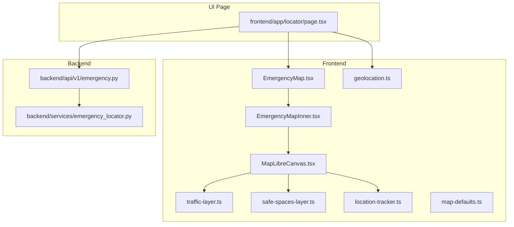
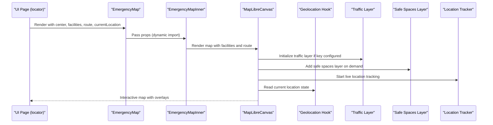
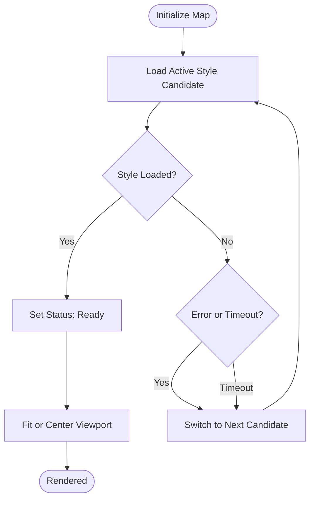
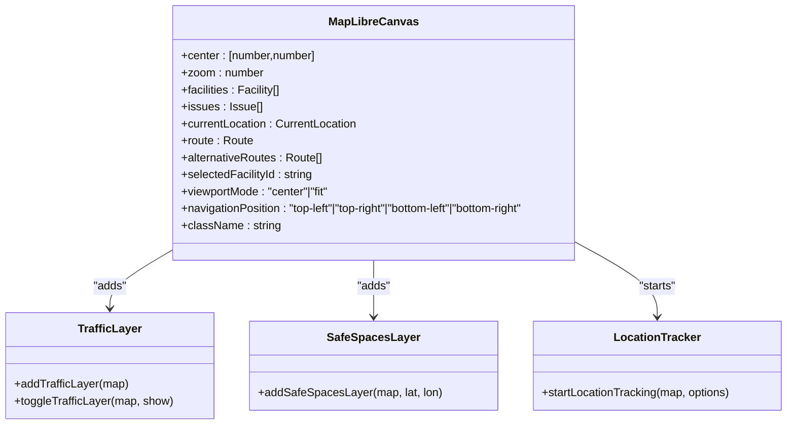
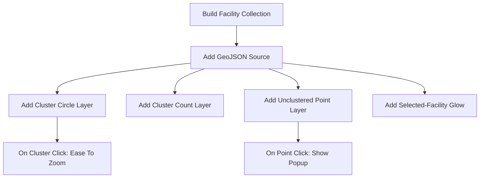
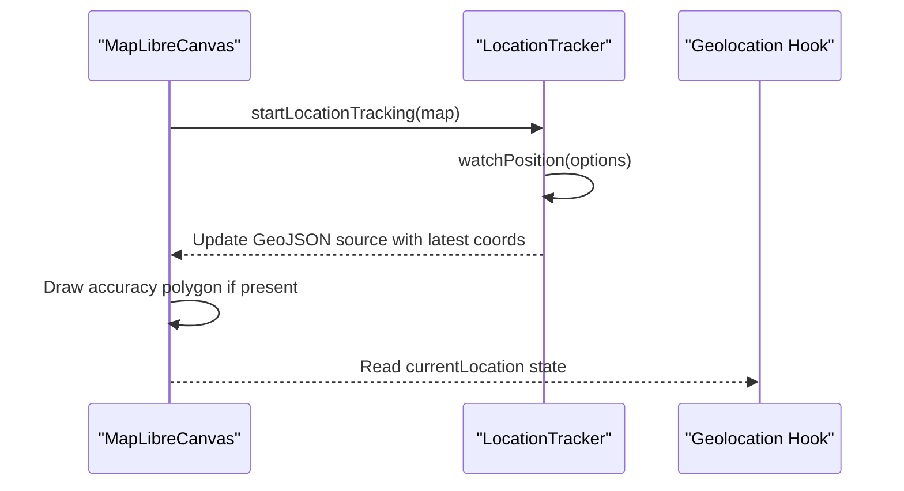
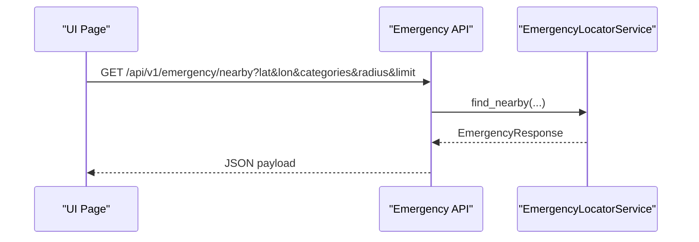
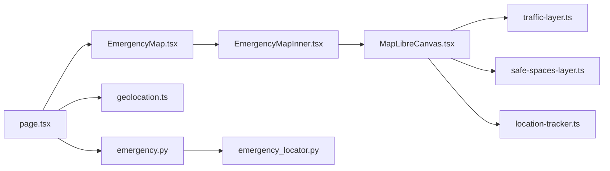

# Emergency Map Integration

<cite>
**Referenced Files in This Document**
- [EmergencyMap.tsx](file://frontend/components/EmergencyMap.tsx)
- [EmergencyMapInner.tsx](file://frontend/components/EmergencyMapInner.tsx)
- [MapLibreCanvas.tsx](file://frontend/components/maps/MapLibreCanvas.tsx)
- [traffic-layer.ts](file://frontend/lib/traffic-layer.ts)
- [safe-spaces-layer.ts](file://frontend/lib/safe-spaces-layer.ts)
- [location-tracker.ts](file://frontend/lib/location-tracker.ts)
- [geolocation.ts](file://frontend/lib/geolocation.ts)
- [map-defaults.ts](file://frontend/lib/map-defaults.ts)
- [emergency.py](file://backend/api/v1/emergency.py)
- [emergency_locator.py](file://backend/services/emergency_locator.py)
- [page.tsx](file://frontend/app/locator/page.tsx)
</cite>

## Table of Contents
1. [Introduction](#introduction)
2. [Project Structure](#project-structure)
3. [Core Components](#core-components)
4. [Architecture Overview](#architecture-overview)
5. [Detailed Component Analysis](#detailed-component-analysis)
6. [Dependency Analysis](#dependency-analysis)
7. [Performance Considerations](#performance-considerations)
8. [Troubleshooting Guide](#troubleshooting-guide)
9. [Conclusion](#conclusion)
10. [Appendices](#appendices)

## Introduction
This document explains the Emergency Map Integration built with MapLibre GL. It covers how emergency services are discovered and rendered on interactive maps, how user location is tracked and displayed, and how map layers (traffic, safe spaces) are toggled. It also documents configuration options for map styles, marker customization, and layer visibility, and provides practical guidance for responsive design, performance optimization, and offline-safe behaviors.

## Project Structure
The Emergency Map subsystem spans the frontend React components and libraries, and the backend APIs that supply emergency data and auxiliary overlays.

**Diagram sources**
- [EmergencyMap.tsx:1-58](file://frontend/components/EmergencyMap.tsx#L1-L58)
- [EmergencyMapInner.tsx:1-83](file://frontend/components/EmergencyMapInner.tsx#L1-L83)
- [MapLibreCanvas.tsx:1-1241](file://frontend/components/maps/MapLibreCanvas.tsx#L1-L1241)
- [traffic-layer.ts:1-50](file://frontend/lib/traffic-layer.ts#L1-L50)
- [safe-spaces-layer.ts:1-62](file://frontend/lib/safe-spaces-layer.ts#L1-L62)
- [location-tracker.ts:1-66](file://frontend/lib/location-tracker.ts#L1-L66)
- [geolocation.ts:1-124](file://frontend/lib/geolocation.ts#L1-L124)
- [map-defaults.ts:1-8](file://frontend/lib/map-defaults.ts#L1-L8)
- [emergency.py:1-83](file://backend/api/v1/emergency.py#L1-L83)
- [emergency_locator.py:1-507](file://backend/services/emergency_locator.py#L1-L507)
- [page.tsx:1-1244](file://frontend/app/locator/page.tsx#L1-L1244)

**Section sources**
- [EmergencyMap.tsx:1-58](file://frontend/components/EmergencyMap.tsx#L1-L58)
- [EmergencyMapInner.tsx:1-83](file://frontend/components/EmergencyMapInner.tsx#L1-L83)
- [MapLibreCanvas.tsx:1-1241](file://frontend/components/maps/MapLibreCanvas.tsx#L1-L1241)
- [page.tsx:523-820](file://frontend/app/locator/page.tsx#L523-L820)

## Core Components
- EmergencyMap: A lightweight client-side wrapper that defers map rendering to the browser to keep server-side rendering stable.
- EmergencyMapInner: Transforms service data into map-friendly facilities and passes props to the canvas.
- MapLibreCanvas: The core interactive map renderer integrating MapLibre GL with clustering, routing overlays, user location, and optional overlays.
- Traffic Layer: Optional real-time traffic overlay via TomTom raster tiles.
- Safe Spaces Layer: Optional overlay of nearby safe public spaces for women’s safety.
- Location Tracker: Live user position tracking with pulsing dot and accuracy circle.
- Geolocation Hook: Frontend geolocation orchestration with permission checks and caching.
- Backend Emergency APIs: Nearby emergency services, SOS payload, emergency numbers, and safe spaces.

**Section sources**
- [EmergencyMap.tsx:25-57](file://frontend/components/EmergencyMap.tsx#L25-L57)
- [EmergencyMapInner.tsx:44-82](file://frontend/components/EmergencyMapInner.tsx#L44-L82)
- [MapLibreCanvas.tsx:300-320](file://frontend/components/maps/MapLibreCanvas.tsx#L300-L320)
- [traffic-layer.ts:5-49](file://frontend/lib/traffic-layer.ts#L5-L49)
- [safe-spaces-layer.ts:14-61](file://frontend/lib/safe-spaces-layer.ts#L14-L61)
- [location-tracker.ts:8-65](file://frontend/lib/location-tracker.ts#L8-L65)
- [geolocation.ts:13-123](file://frontend/lib/geolocation.ts#L13-L123)
- [emergency.py:19-83](file://backend/api/v1/emergency.py#L19-L83)
- [emergency_locator.py:161-507](file://backend/services/emergency_locator.py#L161-L507)

## Architecture Overview
The map integrates multiple data and overlay sources:
- Base map styles: MapTiler raster/vector fallbacks and OpenFreeMap Liberty.
- Facilities: Clustered points with selectable popups and optional selected-state highlight.
- Routes: Primary and alternative route overlays with casing and line layers.
- User location: Live dot with accuracy polygon and popup.
- Optional overlays: Traffic (TomTom) and Safe Spaces (local API).
- Geolocation: Browser permissions and continuous tracking.

**Diagram sources**
- [page.tsx:523-820](file://frontend/app/locator/page.tsx#L523-L820)
- [EmergencyMap.tsx:25-57](file://frontend/components/EmergencyMap.tsx#L25-L57)
- [EmergencyMapInner.tsx:44-82](file://frontend/components/EmergencyMapInner.tsx#L44-L82)
- [MapLibreCanvas.tsx:300-560](file://frontend/components/maps/MapLibreCanvas.tsx#L300-L560)
- [traffic-layer.ts:5-49](file://frontend/lib/traffic-layer.ts#L5-L49)
- [safe-spaces-layer.ts:14-61](file://frontend/lib/safe-spaces-layer.ts#L14-L61)
- [location-tracker.ts:8-65](file://frontend/lib/location-tracker.ts#L8-L65)
- [geolocation.ts:13-123](file://frontend/lib/geolocation.ts#L13-L123)

## Detailed Component Analysis

### Map Rendering and Style Management
- Style candidates include MapTiler raster/vector and OpenFreeMap Liberty. The component cycles through candidates on failure and reports status to users.
- Default zoom and fallback center come from environment and defaults.
- Navigation control is positioned per prop; drag/rotate/touch gestures are tuned for driving context.

**Diagram sources**
- [MapLibreCanvas.tsx:396-540](file://frontend/components/maps/MapLibreCanvas.tsx#L396-L540)
- [map-defaults.ts:1-8](file://frontend/lib/map-defaults.ts#L1-L8)

**Section sources**
- [MapLibreCanvas.tsx:326-380](file://frontend/components/maps/MapLibreCanvas.tsx#L326-L380)
- [MapLibreCanvas.tsx:408-540](file://frontend/components/maps/MapLibreCanvas.tsx#L408-L540)
- [map-defaults.ts:1-8](file://frontend/lib/map-defaults.ts#L1-L8)

### Map Layer Management
- Facilities: GeoJSON source with clustering and two layers (clusters and unclustered points). Selected facility gets a translucent glow layer.
- Routes: Single GeoJSON source with primary and alternative route layers, including casing and dashed alternatives.
- Accuracy: Polygon overlay computed from user accuracy radius.
- Issues: Optional issue markers with popups.
- Safe Spaces: Dynamically fetched from backend and rendered as colored circles.

**Diagram sources**
- [MapLibreCanvas.tsx:155-167](file://frontend/components/maps/MapLibreCanvas.tsx#L155-L167)
- [traffic-layer.ts:5-49](file://frontend/lib/traffic-layer.ts#L5-L49)
- [safe-spaces-layer.ts:14-61](file://frontend/lib/safe-spaces-layer.ts#L14-L61)
- [location-tracker.ts:8-65](file://frontend/lib/location-tracker.ts#L8-L65)

**Section sources**
- [MapLibreCanvas.tsx:700-1018](file://frontend/components/maps/MapLibreCanvas.tsx#L700-L1018)
- [MapLibreCanvas.tsx:1020-1098](file://frontend/components/maps/MapLibreCanvas.tsx#L1020-L1098)
- [MapLibreCanvas.tsx:1100-1150](file://frontend/components/maps/MapLibreCanvas.tsx#L1100-L1150)
- [MapLibreCanvas.tsx:1174-1196](file://frontend/components/maps/MapLibreCanvas.tsx#L1174-L1196)

### Service Markers and Popups
- Facilities are clustered with a step-based color/size scale and labeled counts.
- Clicking clusters expands the map; clicking individual facilities opens a popup with name, type/distance, and optional address/phone.
- Selected facility receives a highlighted glow layer.

**Diagram sources**
- [MapLibreCanvas.tsx:801-1018](file://frontend/components/maps/MapLibreCanvas.tsx#L801-L1018)

**Section sources**
- [MapLibreCanvas.tsx:801-1018](file://frontend/components/maps/MapLibreCanvas.tsx#L801-L1018)

### User Location Indicators
- Live dot with pulsing ring and solid center, updated via watchPosition.
- Accuracy polygon drawn as a circle around the user with a fill and stroke.
- Optional popup displays title/subtitle and accuracy.

**Diagram sources**
- [location-tracker.ts:8-65](file://frontend/lib/location-tracker.ts#L8-L65)
- [geolocation.ts:13-123](file://frontend/lib/geolocation.ts#L13-L123)
- [MapLibreCanvas.tsx:561-629](file://frontend/components/maps/MapLibreCanvas.tsx#L561-L629)

**Section sources**
- [location-tracker.ts:8-65](file://frontend/lib/location-tracker.ts#L8-L65)
- [geolocation.ts:13-123](file://frontend/lib/geolocation.ts#L13-L123)
- [MapLibreCanvas.tsx:561-629](file://frontend/components/maps/MapLibreCanvas.tsx#L561-L629)

### Backend Integration and Service Discovery
- Frontend requests nearby emergency services via the backend API.
- Backend service queries database, merges with local catalog, and optionally falls back to Overpass.
- Additional endpoints expose SOS payload, emergency numbers, and safe spaces.

**Diagram sources**
- [page.tsx:523-820](file://frontend/app/locator/page.tsx#L523-L820)
- [emergency.py:19-39](file://backend/api/v1/emergency.py#L19-L39)
- [emergency_locator.py:187-216](file://backend/services/emergency_locator.py#L187-L216)

**Section sources**
- [emergency.py:19-83](file://backend/api/v1/emergency.py#L19-L83)
- [emergency_locator.py:161-507](file://backend/services/emergency_locator.py#L161-L507)
- [page.tsx:523-820](file://frontend/app/locator/page.tsx#L523-L820)

## Dependency Analysis
- Frontend map depends on MapLibre GL and several helper modules for overlays and tracking.
- Backend depends on database, Redis cache, and external services (Overpass) for emergency discovery.
- UI composes the map with geolocation state and backend-provided facilities.

**Diagram sources**
- [MapLibreCanvas.tsx:1-1241](file://frontend/components/maps/MapLibreCanvas.tsx#L1-L1241)
- [traffic-layer.ts:1-50](file://frontend/lib/traffic-layer.ts#L1-L50)
- [safe-spaces-layer.ts:1-62](file://frontend/lib/safe-spaces-layer.ts#L1-L62)
- [location-tracker.ts:1-66](file://frontend/lib/location-tracker.ts#L1-L66)
- [page.tsx:1-1244](file://frontend/app/locator/page.tsx#L1-L1244)
- [EmergencyMap.tsx:1-58](file://frontend/components/EmergencyMap.tsx#L1-L58)
- [EmergencyMapInner.tsx:1-83](file://frontend/components/EmergencyMapInner.tsx#L1-L83)
- [geolocation.ts:1-124](file://frontend/lib/geolocation.ts#L1-L124)
- [emergency.py:1-83](file://backend/api/v1/emergency.py#L1-L83)
- [emergency_locator.py:1-507](file://backend/services/emergency_locator.py#L1-L507)

**Section sources**
- [MapLibreCanvas.tsx:1-1241](file://frontend/components/maps/MapLibreCanvas.tsx#L1-L1241)
- [emergency.py:1-83](file://backend/api/v1/emergency.py#L1-L83)
- [emergency_locator.py:1-507](file://backend/services/emergency_locator.py#L1-L507)

## Performance Considerations
- Style fallback: The map attempts multiple style sources and reports status to avoid long hangs.
- Clustered facilities: Reduces draw calls and improves interactivity at high density.
- Conditional overlay creation: Layers are added only when needed to minimize overhead.
- Resize handling: Debounced resize listener ensures smooth fit after layout shifts.
- Traffic/Safe Spaces toggles: Visibility toggles rather than constant tile fetching.

Recommendations:
- Prefer vector styles when available for crisp rendering at any zoom.
- Limit clustering radius and max zoom to balance density vs. usability.
- Defer optional overlays (traffic, safe spaces) until user toggles.
- Cache facility GeoJSON and reuse sources to avoid frequent rebuilds.

[No sources needed since this section provides general guidance]

## Troubleshooting Guide
Common issues and resolutions:
- Map fails to load:
  - The component cycles through style candidates and surfaces a clear error message when all fail.
  - Check environment variables for keys and URLs.
- Traffic overlay not visible:
  - Requires a TomTom key; if missing, the layer is not added.
- Safe spaces overlay errors:
  - Backend endpoint may be down; the component sets an error status and prompts retry.
- User location not updating:
  - Permission denied or timeout; the geolocation hook surfaces actionable messages.
- Route not shown:
  - Ensure route GeoJSON is valid and contains at least two points; the component removes layers when route is invalid.

**Section sources**
- [MapLibreCanvas.tsx:441-474](file://frontend/components/maps/MapLibreCanvas.tsx#L441-L474)
- [traffic-layer.ts:6-9](file://frontend/lib/traffic-layer.ts#L6-L9)
- [safe-spaces-layer.ts:18-21](file://frontend/lib/safe-spaces-layer.ts#L18-L21)
- [geolocation.ts:63-71](file://frontend/lib/geolocation.ts#L63-L71)
- [MapLibreCanvas.tsx:652-686](file://frontend/components/maps/MapLibreCanvas.tsx#L652-L686)

## Conclusion
The Emergency Map Integration delivers a robust, responsive, and configurable mapping experience. It combines backend-driven emergency discovery with live user location, optional traffic and safe spaces overlays, and a polished UI for selecting and navigating to services. By leveraging clustering, layered overlays, and graceful fallbacks, it remains performant and accessible across devices and network conditions.

[No sources needed since this section summarizes without analyzing specific files]

## Appendices

### Configuration Options
- Map styles:
  - MapTiler raster/vector fallbacks controlled by environment variables.
  - OpenFreeMap Liberty as a third option.
- Zoom and center:
  - Default zoom and fallback center from environment and defaults.
- Navigation control:
  - Position configurable via prop.
- Overlay toggles:
  - Traffic and Safe Spaces toggles exposed in the UI.

**Section sources**
- [MapLibreCanvas.tsx:326-365](file://frontend/components/maps/MapLibreCanvas.tsx#L326-L365)
- [map-defaults.ts:1-8](file://frontend/lib/map-defaults.ts#L1-L8)
- [MapLibreCanvas.tsx:497-503](file://frontend/components/maps/MapLibreCanvas.tsx#L497-L503)
- [MapLibreCanvas.tsx:1214-1237](file://frontend/components/maps/MapLibreCanvas.tsx#L1214-L1237)

### Example Usage Paths
- Rendering the map with facilities and route:
  - [page.tsx:527-561](file://frontend/app/locator/page.tsx#L527-L561)
  - [page.tsx:784-818](file://frontend/app/locator/page.tsx#L784-L818)
- Dynamic map wrapper:
  - [EmergencyMap.tsx:25-57](file://frontend/components/EmergencyMap.tsx#L25-L57)
- Inner map composition:
  - [EmergencyMapInner.tsx:44-82](file://frontend/components/EmergencyMapInner.tsx#L44-L82)

**Section sources**
- [page.tsx:523-820](file://frontend/app/locator/page.tsx#L523-L820)
- [EmergencyMap.tsx:25-57](file://frontend/components/EmergencyMap.tsx#L25-L57)
- [EmergencyMapInner.tsx:44-82](file://frontend/components/EmergencyMapInner.tsx#L44-L82)