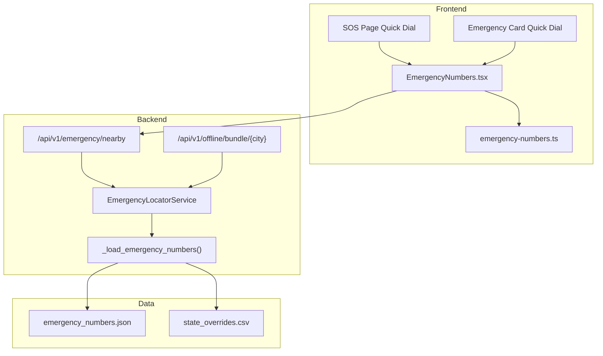
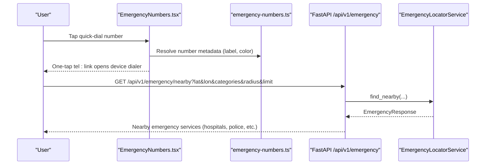
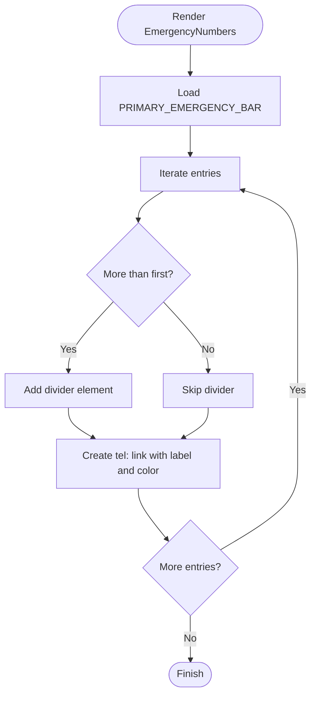
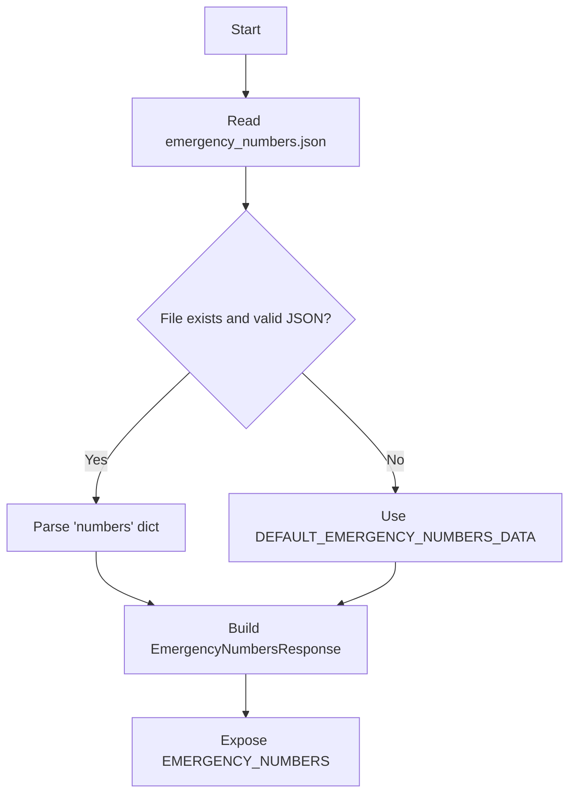
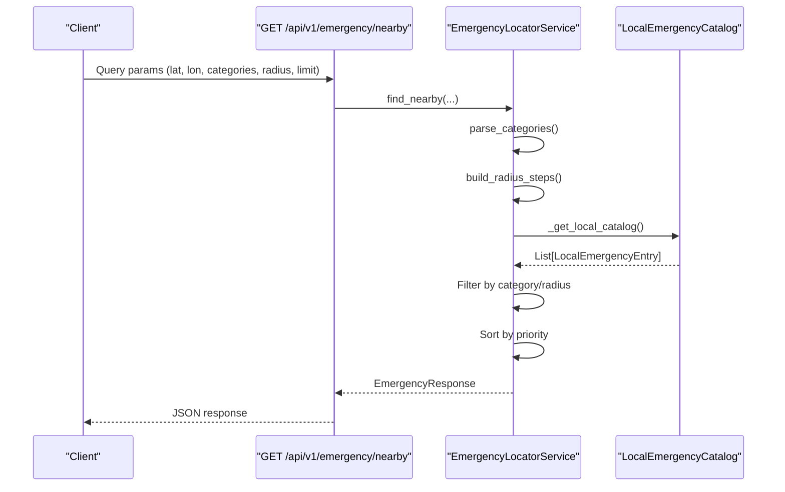
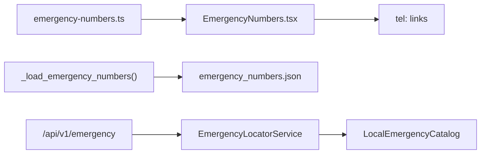

# Emergency Numbers Interface

<cite>
**Referenced Files in This Document**
- [EmergencyNumbers.tsx](file://frontend/components/EmergencyNumbers.tsx)
- [emergency-numbers.ts](file://frontend/lib/emergency-numbers.ts)
- [emergency_numbers.json](file://chatbot_service/data/emergency_numbers.json)
- [state_overrides.csv](file://chatbot_service/data/state_overrides.csv)
- [state_overrides.csv](file://frontend/public/offline-data/state_overrides.csv)
- [emergency_locator.py](file://backend/services/emergency_locator.py)
- [emergency.py](file://backend/api/v1/emergency.py)
- [offline.py](file://backend/api/v1/offline.py)
- [local_emergency_catalog.py](file://backend/services/local_emergency_catalog.py)
- [page.tsx](file://frontend/app/sos/page.tsx)
- [page.tsx](file://frontend/app/emergency-card/[userId]/page.tsx)
</cite>

## Table of Contents
1. [Introduction](#introduction)
2. [Project Structure](#project-structure)
3. [Core Components](#core-components)
4. [Architecture Overview](#architecture-overview)
5. [Detailed Component Analysis](#detailed-component-analysis)
6. [Dependency Analysis](#dependency-analysis)
7. [Performance Considerations](#performance-considerations)
8. [Troubleshooting Guide](#troubleshooting-guide)
9. [Conclusion](#conclusion)
10. [Appendices](#appendices)

## Introduction
This document describes the Emergency Numbers Interface component that powers one-tap emergency calling and displays categorized emergency contacts for India. It explains the emergency numbers database structure, state-specific variations, and quick dial functionality. It documents the frontend interface design, categorization by service type, and integration with backend services for location-aware emergency resources. It also covers configuration options, accessibility features, and offline availability, along with common issues and solutions.

## Project Structure
The Emergency Numbers Interface spans frontend and backend components:
- Frontend: React component renders a quick-access bar of frequently used numbers and supports one-tap calling via tel: links.
- Backend: Emergency number catalog is loaded from JSON, with fallback defaults and robust parsing. Nearby emergency services are discoverable via an API with optional offline bundles.

**Diagram sources**
- [EmergencyNumbers.tsx:1-41](file://frontend/components/EmergencyNumbers.tsx#L1-L41)
- [emergency-numbers.ts:1-124](file://frontend/lib/emergency-numbers.ts#L1-L124)
- [emergency.py:1-39](file://backend/api/v1/emergency.py#L1-L39)
- [offline.py:1-27](file://backend/api/v1/offline.py#L1-L27)
- [emergency_locator.py:134-158](file://backend/services/emergency_locator.py#L134-L158)
- [emergency_numbers.json:1-70](file://chatbot_service/data/emergency_numbers.json#L1-L70)
- [state_overrides.csv:1-14](file://chatbot_service/data/state_overrides.csv#L1-L14)

**Section sources**
- [EmergencyNumbers.tsx:1-41](file://frontend/components/EmergencyNumbers.tsx#L1-L41)
- [emergency-numbers.ts:1-124](file://frontend/lib/emergency-numbers.ts#L1-L124)
- [emergency.py:1-39](file://backend/api/v1/emergency.py#L1-L39)
- [offline.py:1-27](file://backend/api/v1/offline.py#L1-L27)
- [emergency_locator.py:134-158](file://backend/services/emergency_locator.py#L134-L158)
- [emergency_numbers.json:1-70](file://chatbot_service/data/emergency_numbers.json#L1-L70)
- [state_overrides.csv:1-14](file://chatbot_service/data/state_overrides.csv#L1-L14)

## Core Components
- EmergencyNumberEntry interface defines the shape of each emergency number record, including identifiers, service number, label, coverage area, optional notes, and color.
- EMERGENCY_NUMBER_LIST provides the canonical list of emergency numbers used across the app.
- PRIMARY_EMERGENCY_BAR filters the list to prominently featured numbers for quick dial.
- EMERGENCY_NUMBER_MAP builds a lookup map keyed by id for efficient retrieval.
- Frontend EmergencyNumbers component renders a navigation bar with one-tap tel: links and accessibility attributes.

Key implementation references:
- [EmergencyNumberEntry interface:1-8](file://frontend/lib/emergency-numbers.ts#L1-L8)
- [EMERGENCY_NUMBER_LIST:10-115](file://frontend/lib/emergency-numbers.ts#L10-L115)
- [PRIMARY_EMERGENCY_BAR filter:117-119](file://frontend/lib/emergency-numbers.ts#L117-L119)
- [EMERGENCY_NUMBER_MAP creation:121-123](file://frontend/lib/emergency-numbers.ts#L121-L123)
- [EmergencyNumbers rendering:7-40](file://frontend/components/EmergencyNumbers.tsx#L7-L40)

**Section sources**
- [emergency-numbers.ts:1-124](file://frontend/lib/emergency-numbers.ts#L1-L124)
- [EmergencyNumbers.tsx:1-41](file://frontend/components/EmergencyNumbers.tsx#L1-L41)

## Architecture Overview
The Emergency Numbers Interface integrates frontend quick dial with backend emergency number sourcing and nearby resource discovery.

**Diagram sources**
- [EmergencyNumbers.tsx:1-41](file://frontend/components/EmergencyNumbers.tsx#L1-L41)
- [emergency-numbers.ts:1-124](file://frontend/lib/emergency-numbers.ts#L1-L124)
- [emergency.py:1-39](file://backend/api/v1/emergency.py#L1-L39)
- [emergency_locator.py:161-176](file://backend/services/emergency_locator.py#L161-L176)

## Detailed Component Analysis

### Frontend Emergency Numbers Bar
- Purpose: Provide immediate access to top emergency numbers with visual distinction and one-tap calling.
- Rendering: Iterates over PRIMARY_EMERGENCY_BAR, renders a divider between entries, and creates anchor links with tel: protocol.
- Accessibility: Uses aria-labels and navigation roles for screen readers.
- Styling: Applies color tokens from CSS variables for consistent branding.

Implementation references:
- [Rendering loop and tel: links:14-38](file://frontend/components/EmergencyNumbers.tsx#L14-L38)
- [Primary bar filter:117-119](file://frontend/lib/emergency-numbers.ts#L117-L119)

**Diagram sources**
- [EmergencyNumbers.tsx:7-40](file://frontend/components/EmergencyNumbers.tsx#L7-L40)
- [emergency-numbers.ts:117-119](file://frontend/lib/emergency-numbers.ts#L117-L119)

**Section sources**
- [EmergencyNumbers.tsx:1-41](file://frontend/components/EmergencyNumbers.tsx#L1-L41)
- [emergency-numbers.ts:1-124](file://frontend/lib/emergency-numbers.ts#L1-L124)

### Emergency Number Database and State Variations
- Data source: emergency_numbers.json supplies the canonical number catalog with service, coverage, and notes.
- Fallback: _load_emergency_numbers() reads the JSON and falls back to DEFAULT_EMERGENCY_NUMBERS_DATA if the file is missing or malformed.
- State overrides: state_overrides.csv (chatbot_service and frontend/public/offline-data) provides state-specific traffic and regulatory data that can inform contextual emergency-related policies or messaging.

References:
- [JSON schema and entries:1-70](file://chatbot_service/data/emergency_numbers.json#L1-L70)
- [Loader with fallback:134-158](file://backend/services/emergency_locator.py#L134-L158)
- [Default emergency numbers:129-131](file://backend/services/emergency_locator.py#L129-L131)
- [State overrides (chatbot data):1-14](file://chatbot_service/data/state_overrides.csv#L1-L14)
- [State overrides (offline data):1-14](file://frontend/public/offline-data/state_overrides.csv#L1-L14)

**Diagram sources**
- [emergency_locator.py:134-158](file://backend/services/emergency_locator.py#L134-L158)
- [emergency_numbers.json:1-70](file://chatbot_service/data/emergency_numbers.json#L1-L70)

**Section sources**
- [emergency_numbers.json:1-70](file://chatbot_service/data/emergency_numbers.json#L1-L70)
- [emergency_locator.py:129-158](file://backend/services/emergency_locator.py#L129-L158)
- [state_overrides.csv:1-14](file://chatbot_service/data/state_overrides.csv#L1-L14)
- [state_overrides.csv:1-14](file://frontend/public/offline-data/state_overrides.csv#L1-L14)

### Nearby Emergency Services Discovery
- API endpoint: GET /api/v1/emergency/nearby supports filtering by categories, radius, and limit.
- Service logic: EmergencyLocatorService parses categories, computes radius steps, and sorts results by priority (trauma availability, 24-hour availability, proximity).
- Local catalog: LocalEmergencyEntry records include phone numbers, emergency phone numbers, and flags for trauma/icu/24-hour availability.

References:
- [API route:1-39](file://backend/api/v1/emergency.py#L1-L39)
- [Category parsing:168-176](file://backend/services/emergency_locator.py#L168-L176)
- [Radius steps:178-185](file://backend/services/emergency_locator.py#L178-L185)
- [Sorting and limiting:446-447](file://backend/services/emergency_locator.py#L446-L447)
- [Local catalog entry:8-23](file://backend/services/local_emergency_catalog.py#L8-L23)

**Diagram sources**
- [emergency.py:19-38](file://backend/api/v1/emergency.py#L19-L38)
- [emergency_locator.py:168-185](file://backend/services/emergency_locator.py#L168-L185)
- [local_emergency_catalog.py:25-34](file://backend/services/local_emergency_catalog.py#L25-L34)

**Section sources**
- [emergency.py:1-39](file://backend/api/v1/emergency.py#L1-L39)
- [emergency_locator.py:161-176](file://backend/services/emergency_locator.py#L161-L176)
- [local_emergency_catalog.py:1-243](file://backend/services/local_emergency_catalog.py#L1-L243)

### Quick Dial Patterns Across UI
- SOS page: Grid of quick-dial cards for national numbers with color-coded labels.
- Emergency card page: Four-column grid for India emergency lines with tel: links.

References:
- [SOS page quick dial:211-225](file://frontend/app/sos/page.tsx#L211-L225)
- [Emergency card quick dial:132-152](file://frontend/app/emergency-card/[userId]/page.tsx#L132-L152)

**Section sources**
- [page.tsx:211-225](file://frontend/app/sos/page.tsx#L211-L225)
- [page.tsx:132-152](file://frontend/app/emergency-card/[userId]/page.tsx#L132-L152)

## Dependency Analysis
- Frontend depends on emergency-numbers.ts for data structures and filtered lists.
- EmergencyNumbers.tsx depends on PRIMARY_EMERGENCY_BAR and renders tel: links.
- Backend depends on emergency_numbers.json via _load_emergency_numbers(), with fallback defaults.
- Nearby services rely on EmergencyLocatorService and local catalogs.

**Diagram sources**
- [emergency-numbers.ts:1-124](file://frontend/lib/emergency-numbers.ts#L1-L124)
- [EmergencyNumbers.tsx:1-41](file://frontend/components/EmergencyNumbers.tsx#L1-L41)
- [emergency_locator.py:134-158](file://backend/services/emergency_locator.py#L134-L158)
- [emergency_numbers.json:1-70](file://chatbot_service/data/emergency_numbers.json#L1-L70)
- [emergency.py:1-39](file://backend/api/v1/emergency.py#L1-L39)
- [local_emergency_catalog.py:1-243](file://backend/services/local_emergency_catalog.py#L1-L243)

**Section sources**
- [emergency-numbers.ts:1-124](file://frontend/lib/emergency-numbers.ts#L1-L124)
- [EmergencyNumbers.tsx:1-41](file://frontend/components/EmergencyNumbers.tsx#L1-L41)
- [emergency_locator.py:134-158](file://backend/services/emergency_locator.py#L134-L158)
- [emergency_numbers.json:1-70](file://chatbot_service/data/emergency_numbers.json#L1-L70)
- [emergency.py:1-39](file://backend/api/v1/emergency.py#L1-L39)
- [local_emergency_catalog.py:1-243](file://backend/services/local_emergency_catalog.py#L1-L243)

## Performance Considerations
- Frontend: The emergency number list is static and small; rendering cost is negligible. Using a filtered subset (PRIMARY_EMERGENCY_BAR) reduces DOM nodes for quick dial.
- Backend: Parsing and filtering local catalogs scales with dataset size; caching and precomputed radius steps mitigate latency.
- Offline: The loader gracefully handles missing or invalid JSON by falling back to defaults, ensuring resilience.

[No sources needed since this section provides general guidance]

## Troubleshooting Guide
Common issues and resolutions:
- Number accuracy
  - Symptom: Outdated or incorrect number.
  - Resolution: Update emergency_numbers.json; the loader validates presence of a numbers dictionary and strips whitespace; if parsing fails, defaults are used.
  - References: [Loader fallback:134-158](file://backend/services/emergency_locator.py#L134-L158), [JSON schema:1-70](file://chatbot_service/data/emergency_numbers.json#L1-L70)

- Regional variations
  - Symptom: Different numbers in different states.
  - Resolution: Use the nearby services API to discover location-aware facilities; the loader supports state overrides via CSV data for broader policy context.
  - References: [Nearby API:19-38](file://backend/api/v1/emergency.py#L19-L38), [State overrides:1-14](file://chatbot_service/data/state_overrides.csv#L1-L14)

- Offline availability
  - Symptom: Emergency numbers unavailable without network.
  - Resolution: The loader reads emergency_numbers.json from the project path; ensure the file is present at runtime. The offline bundle API constructs city-specific datasets for offline use.
  - References: [Loader path resolution:134-136](file://backend/services/emergency_locator.py#L134-L136), [Offline bundle API:18-26](file://backend/api/v1/offline.py#L18-L26)

- One-tap calling not working
  - Symptom: Tapping a number does not open dialer.
  - Resolution: Verify tel: links are constructed from service values; confirm color and label rendering via PRIMARY_EMERGENCY_BAR.
  - References: [tel: link construction:17-21](file://frontend/components/EmergencyNumbers.tsx#L17-L21), [Primary bar:117-119](file://frontend/lib/emergency-numbers.ts#L117-L119)

**Section sources**
- [emergency_locator.py:134-158](file://backend/services/emergency_locator.py#L134-L158)
- [emergency_numbers.json:1-70](file://chatbot_service/data/emergency_numbers.json#L1-L70)
- [emergency.py:19-38](file://backend/api/v1/emergency.py#L19-L38)
- [offline.py:18-26](file://backend/api/v1/offline.py#L18-L26)
- [EmergencyNumbers.tsx:17-21](file://frontend/components/EmergencyNumbers.tsx#L17-L21)
- [emergency-numbers.ts:117-119](file://frontend/lib/emergency-numbers.ts#L117-L119)

## Conclusion
The Emergency Numbers Interface combines a concise, accessible frontend quick-dial bar with a robust backend emergency number catalog and nearby services discovery. It supports fallback mechanisms, offline readiness, and clear categorization to meet diverse emergency scenarios across India. Developers can extend the number list, refine state-specific contexts, and integrate additional services through the existing loader and API patterns.

[No sources needed since this section summarizes without analyzing specific files]

## Appendices

### Configuration Options
- Number sources
  - emergency_numbers.json: Canonical number catalog with service, coverage, and notes.
  - Loader fallback: DEFAULT_EMERGENCY_NUMBERS_DATA ensures resilience.
  - References: [JSON catalog:1-70](file://chatbot_service/data/emergency_numbers.json#L1-L70), [Loader fallback:134-158](file://backend/services/emergency_locator.py#L134-L158)

- Display preferences
  - PRIMARY_EMERGENCY_BAR: Curated subset of numbers for prominent quick dial.
  - Color tokens: CSS variables applied for consistent theming.
  - References: [Primary bar filter:117-119](file://frontend/lib/emergency-numbers.ts#L117-L119), [Color usage:23-34](file://frontend/components/EmergencyNumbers.tsx#L23-L34)

- Accessibility features
  - Navigation role and aria-labels for screen readers.
  - References: [ARIA attributes:9-21](file://frontend/components/EmergencyNumbers.tsx#L9-L21)

- Offline availability
  - Loader reads from project-relative path; offline bundle API constructs city-specific datasets.
  - References: [Loader path:134-136](file://backend/services/emergency_locator.py#L134-L136), [Offline bundle:18-26](file://backend/api/v1/offline.py#L18-L26)

**Section sources**
- [emergency_numbers.json:1-70](file://chatbot_service/data/emergency_numbers.json#L1-L70)
- [emergency_locator.py:134-158](file://backend/services/emergency_locator.py#L134-L158)
- [emergency-numbers.ts:117-119](file://frontend/lib/emergency-numbers.ts#L117-L119)
- [EmergencyNumbers.tsx:9-21](file://frontend/components/EmergencyNumbers.tsx#L9-L21)
- [offline.py:18-26](file://backend/api/v1/offline.py#L18-L26)