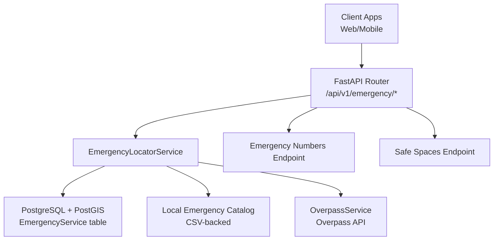
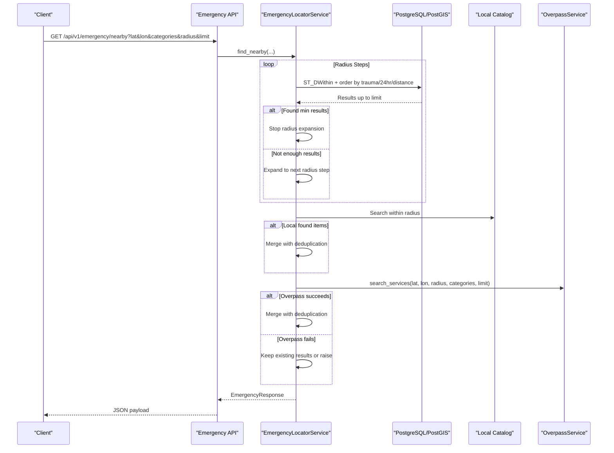
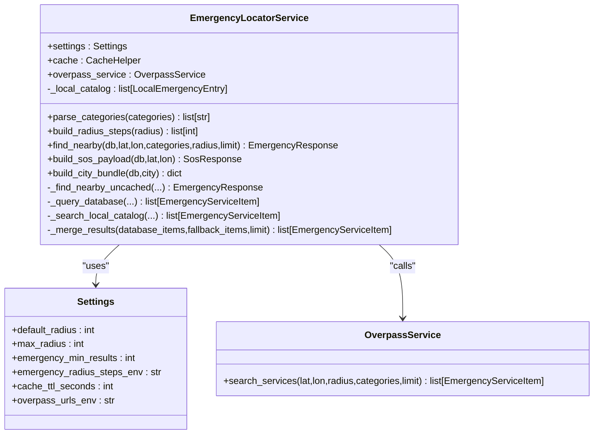
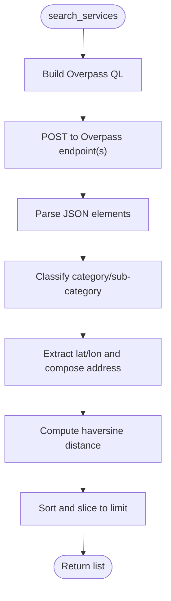
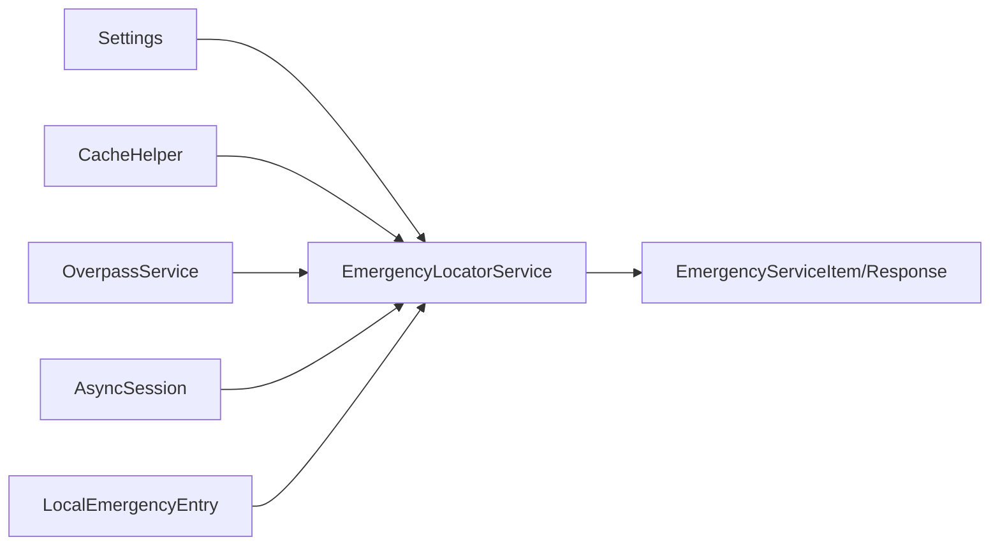

# Emergency Service Discovery

<cite>
**Referenced Files in This Document**
- [emergency.py](file://backend/api/v1/emergency.py)
- [emergency_locator.py](file://backend/services/emergency_locator.py)
- [overpass_service.py](file://backend/services/overpass_service.py)
- [local_emergency_catalog.py](file://backend/services/local_emergency_catalog.py)
- [config.py](file://backend/core/config.py)
- [schemas.py](file://backend/models/schemas.py)
- [emergency.py](file://backend/models/emergency.py)
- [test_emergency.py](file://backend/tests/test_emergency.py)
- [emergency_tool.py](file://chatbot_service/tools/emergency_tool.py)
- [fetch_hospitals.py](file://scripts/data/fetch_hospitals.py)
- [fetch_fire.py](file://scripts/data/fetch_fire.py)
- [fetch_police.py](file://scripts/data/fetch_police.py)
- [emergency-numbers.ts](file://frontend/lib/emergency-numbers.ts)
</cite>

## Table of Contents
1. [Introduction](#introduction)
2. [Project Structure](#project-structure)
3. [Core Components](#core-components)
4. [Architecture Overview](#architecture-overview)
5. [Detailed Component Analysis](#detailed-component-analysis)
6. [Dependency Analysis](#dependency-analysis)
7. [Performance Considerations](#performance-considerations)
8. [Troubleshooting Guide](#troubleshooting-guide)
9. [Conclusion](#conclusion)
10. [Appendices](#appendices)

## Introduction
This document explains the Emergency Service Discovery system that powers nearby emergency service search. It covers the tiered radius fallback mechanism, integration with Overpass API and OpenStreetMap data, service categorization, configuration options, and relationships with geocoding and routing. It also provides practical examples from the codebase and guidance for handling common issues such as service availability, data accuracy, and network connectivity.

## Project Structure
The Emergency Service Discovery spans backend APIs, services, models, configuration, and data ingestion scripts. The primary entry point is the FastAPI router that exposes endpoints for nearby emergency services, SOS payloads, and emergency numbers. The core logic resides in the EmergencyLocatorService, which orchestrates database queries, local catalogs, and Overpass fallbacks. Supporting services include OverpassService for OSM queries and local CSV catalogs for curated entries.

**Diagram sources**
- [emergency.py:19-82](file://backend/api/v1/emergency.py#L19-L82)
- [emergency_locator.py:161-373](file://backend/services/emergency_locator.py#L161-L373)
- [overpass_service.py:24-78](file://backend/services/overpass_service.py#L24-L78)
- [local_emergency_catalog.py:25-34](file://backend/services/local_emergency_catalog.py#L25-L34)
- [emergency.py:12-45](file://backend/models/emergency.py#L12-L45)

**Section sources**
- [emergency.py:19-82](file://backend/api/v1/emergency.py#L19-L82)
- [emergency_locator.py:161-373](file://backend/services/emergency_locator.py#L161-L373)

## Core Components
- EmergencyLocatorService: Implements the tiered radius fallback, merges results from database, local catalog, and Overpass, and returns standardized EmergencyResponse.
- OverpassService: Queries Overpass API for OSM-based emergency services and normalizes tags into EmergencyServiceItem.
- LocalEmergencyCatalog: Loads curated CSV datasets for hospitals and emergency facilities.
- Configuration: Defines radius steps, limits, timeouts, and external service URLs.
- Models and Schemas: Define EmergencyService ORM model and response DTOs.

Key capabilities:
- Category filtering by supported types (hospital, police, ambulance, fire, towing, pharmacy, puncture, showroom).
- Tiered radius search with configurable steps and minimum result thresholds.
- Result merging with deduplication and prioritization by trauma/24hr availability and distance.
- Fallback to Overpass when database/local sources are insufficient.
- SOS payload composition combining nearby services and national emergency numbers.

**Section sources**
- [emergency_locator.py:28-37](file://backend/services/emergency_locator.py#L28-L37)
- [emergency_locator.py:168-185](file://backend/services/emergency_locator.py#L168-L185)
- [overpass_service.py:184-201](file://backend/services/overpass_service.py#L184-L201)
- [config.py:26-47](file://backend/core/config.py#L26-L47)
- [schemas.py:36-66](file://backend/models/schemas.py#L36-L66)
- [emergency.py:12-45](file://backend/models/emergency.py#L12-L45)

## Architecture Overview
The system follows a layered architecture:
- API Layer: Exposes endpoints for nearby services, SOS payload, emergency numbers, and safe spaces.
- Service Layer: EmergencyLocatorService coordinates data retrieval and ranking.
- Data Layer: PostgreSQL with PostGIS for spatial queries, local CSV catalog, and Overpass API.
- Configuration Layer: Centralized Settings controlling timeouts, radius steps, and external endpoints.

**Diagram sources**
- [emergency.py:19-40](file://backend/api/v1/emergency.py#L19-L40)
- [emergency_locator.py:187-373](file://backend/services/emergency_locator.py#L187-L373)
- [overpass_service.py:35-78](file://backend/services/overpass_service.py#L35-L78)

## Detailed Component Analysis

### EmergencyLocatorService
Responsibilities:
- Parse requested categories against supported set.
- Build radius steps from configuration or explicit radius cap.
- Query database with spatial distance and ordering.
- Search local catalog and merge results.
- Fallback to OverpassService and merge results.
- Cache responses keyed by coordinates, categories, and radius.

**Diagram sources**
- [emergency_locator.py:161-300](file://backend/services/emergency_locator.py#L161-L300)
- [config.py:11-108](file://backend/core/config.py#L11-L108)
- [overpass_service.py:24-78](file://backend/services/overpass_service.py#L24-L78)

**Section sources**
- [emergency_locator.py:168-185](file://backend/services/emergency_locator.py#L168-L185)
- [emergency_locator.py:187-373](file://backend/services/emergency_locator.py#L187-L373)
- [emergency_locator.py:375-421](file://backend/services/emergency_locator.py#L375-L421)
- [emergency_locator.py:429-447](file://backend/services/emergency_locator.py#L429-L447)
- [emergency_locator.py:482-506](file://backend/services/emergency_locator.py#L482-L506)

### OverpassService
Responsibilities:
- Construct Overpass QL queries for amenities and emergency facilities.
- Normalize OSM tags into EmergencyServiceItem fields.
- Classify service categories and sub-categories.
- Compute distances using spherical geometry.
- Retry across configured Overpass endpoints with backoff.

**Diagram sources**
- [overpass_service.py:35-78](file://backend/services/overpass_service.py#L35-L78)
- [overpass_service.py:136-160](file://backend/services/overpass_service.py#L136-L160)
- [overpass_service.py:184-201](file://backend/services/overpass_service.py#L184-L201)
- [overpass_service.py:239-248](file://backend/services/overpass_service.py#L239-L248)

**Section sources**
- [overpass_service.py:136-160](file://backend/services/overpass_service.py#L136-L160)
- [overpass_service.py:184-201](file://backend/services/overpass_service.py#L184-L201)
- [overpass_service.py:239-248](file://backend/services/overpass_service.py#L239-L248)

### Local Emergency Catalog
Responsibilities:
- Load curated CSV datasets for hospitals and emergency facilities.
- Normalize fields and infer categories from filenames.
- Provide LocalEmergencyEntry objects for proximity search.

**Section sources**
- [local_emergency_catalog.py:25-34](file://backend/services/local_emergency_catalog.py#L25-L34)
- [local_emergency_catalog.py:131-169](file://backend/services/local_emergency_catalog.py#L131-L169)
- [local_emergency_catalog.py:228-242](file://backend/services/local_emergency_catalog.py#L228-L242)

### Configuration Options
Key settings affecting Emergency Service Discovery:
- default_radius: Starting radius for SOS and default searches.
- max_radius: Upper bound for radius expansion.
- emergency_min_results: Minimum number of results to stop radius expansion.
- emergency_radius_steps_env: Comma-separated radius steps (e.g., 500,1000,5000).
- cache_ttl_seconds: Cache TTL for nearby results.
- overpass_urls_env: Comma-separated Overpass endpoints for redundancy.
- request_timeout_seconds: HTTP timeout for external requests.
- upstream_retry_attempts and upstream_retry_backoff_seconds: Retries and backoff for Overpass.

Environment variables:
- EMERGENCY_RADIUS_STEPS
- OVERPASS_URLS

**Section sources**
- [config.py:26-47](file://backend/core/config.py#L26-L47)
- [config.py:99-108](file://backend/core/config.py#L99-L108)
- [config.py:102-108](file://backend/core/config.py#L102-L108)

### API Endpoints and Payloads
Endpoints:
- GET /api/v1/emergency/nearby: Returns EmergencyResponse with services, count, radius_used, and source.
- GET /api/v1/emergency/sos: Inserts incident record and returns SosResponse with services and national numbers.
- GET /api/v1/emergency/numbers: Returns EmergencyNumbersResponse with unified emergency numbers.
- GET /api/v1/emergency/safe-spaces: Returns nearby safe public spaces.

Payloads:
- EmergencyServiceItem: Standardized service fields including category, sub_category, phone, address, and source.
- EmergencyResponse: Aggregated results and metadata.
- SosResponse: Includes numbers alongside services.

**Section sources**
- [emergency.py:19-82](file://backend/api/v1/emergency.py#L19-L82)
- [schemas.py:36-66](file://backend/models/schemas.py#L36-L66)
- [schemas.py:60-66](file://backend/models/schemas.py#L60-L66)

### Data Model and Storage
EmergencyService ORM model supports:
- Spatial Point geometry (PostGIS) for distance calculations.
- Indexes on category and state_code for efficient filtering.
- Fields for phone numbers, 24-hour flag, trauma/ICU availability, and source attribution.

**Section sources**
- [emergency.py:12-45](file://backend/models/emergency.py#L12-L45)

### Integration with Geocoding and Routing
- Geocoding: The system references Photon and Nominatim endpoints via configuration for geocoding needs.
- Routing: OpenRouteService endpoints and keys are configured for routing calculations.

These integrations complement the emergency discovery by providing location normalization and route planning around discovered services.

**Section sources**
- [config.py:40-43](file://backend/core/config.py#L40-L43)
- [config.py:42-43](file://backend/core/config.py#L42-L43)

## Dependency Analysis
The EmergencyLocatorService depends on:
- Settings for configuration.
- CacheHelper for caching.
- OverpassService for OSM fallback.
- SQLAlchemy async session for database queries.
- LocalEmergencyEntry catalog for curated data.

**Diagram sources**
- [emergency_locator.py:161-166](file://backend/services/emergency_locator.py#L161-L166)
- [config.py:11-108](file://backend/core/config.py#L11-L108)
- [schemas.py:36-66](file://backend/models/schemas.py#L36-L66)

**Section sources**
- [emergency_locator.py:161-166](file://backend/services/emergency_locator.py#L161-L166)

## Performance Considerations
- Spatial indexing: The EmergencyService table uses PostGIS geometry with spatial index on location to accelerate ST_DWithin and distance computations.
- Ranking: Results are ordered by trauma availability, 24-hour availability, and distance to minimize client-side sorting.
- Caching: Responses are cached by coordinate, categories, and radius to reduce repeated database and Overpass calls.
- Radius steps: Configurable steps balance latency and recall; larger steps reduce API calls but may increase network transfer.
- Deduplication: Merging results avoids redundant services across sources.

[No sources needed since this section provides general guidance]

## Troubleshooting Guide
Common issues and mitigations:
- Overpass API unavailability: The service retries across configured endpoints and raises ExternalServiceError. The fallback path ensures results from database/local are still returned when possible.
- Insufficient results: The system expands radius until emergency_min_results is met or max_radius is reached. Adjust emergency_min_results and emergency_radius_steps to improve recall.
- Data gaps: Local catalog and database may lack coverage. Overpass fallback helps fill gaps; ensure overpass_urls_env is set to multiple endpoints for resilience.
- Network connectivity: Configure request_timeout_seconds and upstream retry settings appropriately. Consider increasing upstream_retry_attempts and upstream_retry_backoff_seconds for unstable networks.
- Accuracy: OverpassService classifies services from OSM tags; verify tag completeness in OSM. Local CSV entries can supplement missing data.

Concrete examples from tests:
- Radius expansion and merging with local/Overpass sources.
- Fallback behavior when Overpass fails.
- Local catalog precedence before Overpass.

**Section sources**
- [test_emergency.py:125-171](file://backend/tests/test_emergency.py#L125-L171)
- [test_emergency.py:173-222](file://backend/tests/test_emergency.py#L173-L222)
- [test_emergency.py:237-283](file://backend/tests/test_emergency.py#L237-L283)

## Conclusion
The Emergency Service Discovery system combines spatial database queries, curated local catalogs, and Overpass API fallbacks with a robust tiered radius mechanism. Configuration controls radius steps, limits, caching, and external endpoints, enabling reliable operation under varying data and network conditions. The modular design allows easy extension to new categories and data sources.

[No sources needed since this section summarizes without analyzing specific files]

## Appendices

### Supported Categories and Filtering
Supported categories include hospital, police, ambulance, fire, towing, pharmacy, puncture, and showroom. Filtering normalizes input to lowercase and validates against the supported set.

**Section sources**
- [emergency_locator.py:28-37](file://backend/services/emergency_locator.py#L28-L37)
- [emergency_locator.py:168-176](file://backend/services/emergency_locator.py#L168-L176)

### Emergency Numbers Integration
The numbers endpoint returns a standardized EmergencyNumbersResponse. Frontend utilities define a list of emergency numbers with labels and colors for UI presentation.

**Section sources**
- [emergency.py:73-75](file://backend/api/v1/emergency.py#L73-L75)
- [schemas.py:26-34](file://backend/models/schemas.py#L26-L34)
- [emergency-numbers.ts:10-124](file://frontend/lib/emergency-numbers.ts#L10-L124)

### Data Ingestion Scripts
Scripts fetch OSM data for hospitals, fire stations, and police stations and normalize them for downstream use.

**Section sources**
- [fetch_hospitals.py:14-34](file://scripts/data/fetch_hospitals.py#L14-L34)
- [fetch_fire.py:14-34](file://scripts/data/fetch_fire.py#L14-L34)
- [fetch_police.py:14-34](file://scripts/data/fetch_police.py#L14-L34)

### Tool Integration
The chatbot service integrates with the backend emergency tool to discover nearby services.

**Section sources**
- [emergency_tool.py:10-14](file://chatbot_service/tools/emergency_tool.py#L10-L14)