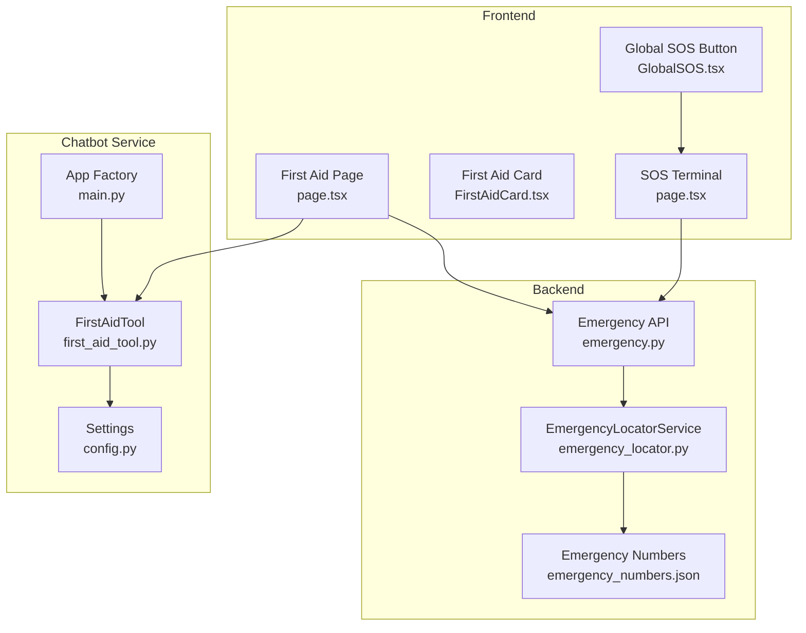
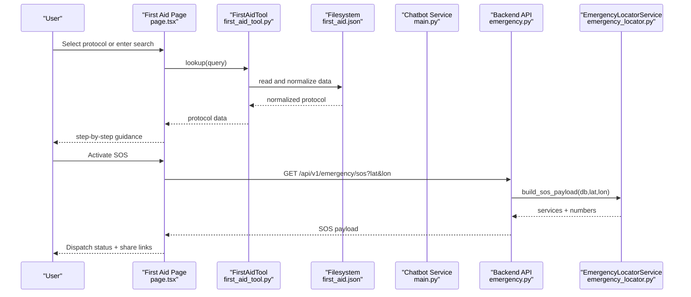
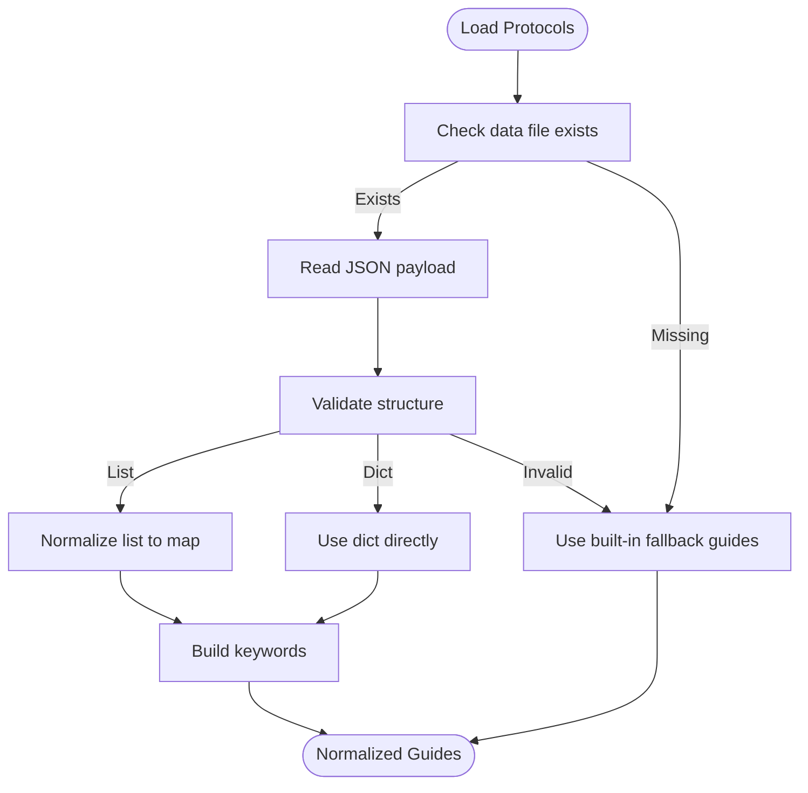
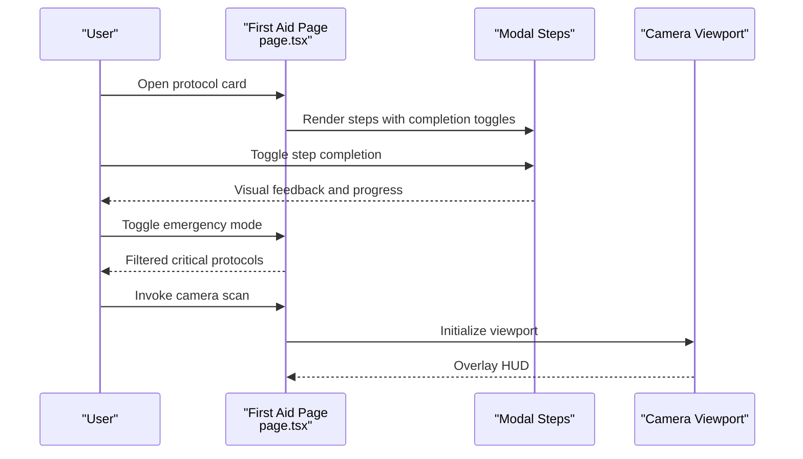
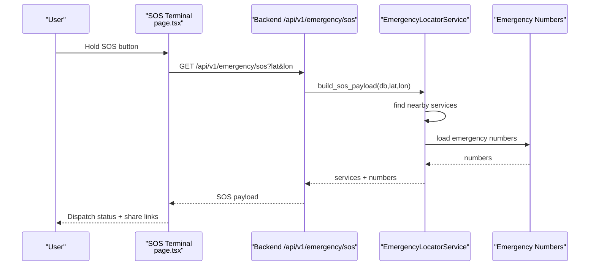
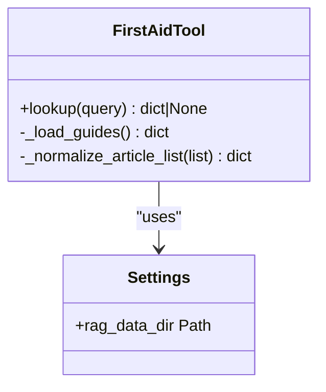
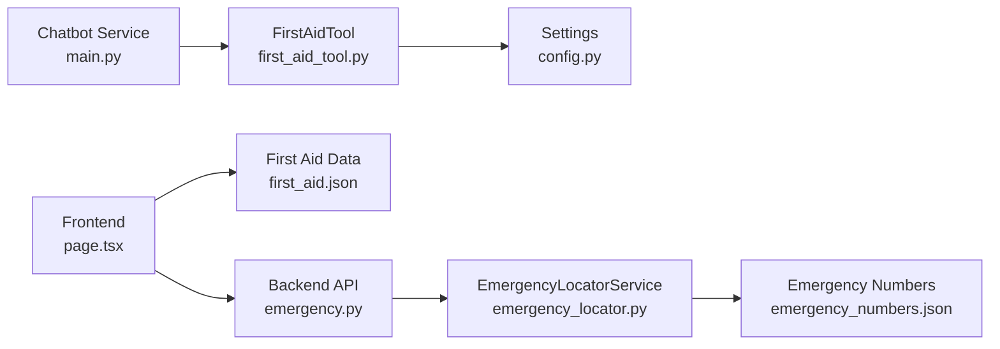

# First Aid Guidance System

<cite>
**Referenced Files in This Document**
- [first_aid.json](file://chatbot_service/data/first_aid.json)
- [first_aid_tool.py](file://chatbot_service/tools/first_aid_tool.py)
- [page.tsx](file://frontend/app/first-aid/page.tsx)
- [FirstAidCard.tsx](file://frontend/components/FirstAidCard.tsx)
- [emergency.py](file://backend/api/v1/emergency.py)
- [emergency_locator.py](file://backend/services/emergency_locator.py)
- [emergency_numbers.json](file://chatbot_service/data/emergency_numbers.json)
- [sos_tool.py](file://chatbot_service/tools/sos_tool.py)
- [page.tsx](file://frontend/app/sos/page.tsx)
- [GlobalSOS.tsx](file://frontend/components/GlobalSOS.tsx)
- [sos-share.ts](file://frontend/lib/sos-share.ts)
- [config.py](file://chatbot_service/config.py)
- [main.py](file://chatbot_service/main.py)
- [first-aid.json](file://frontend/public/offline-data/first-aid.json)
</cite>

## Table of Contents
1. [Introduction](#introduction)
2. [Project Structure](#project-structure)
3. [Core Components](#core-components)
4. [Architecture Overview](#architecture-overview)
5. [Detailed Component Analysis](#detailed-component-analysis)
6. [Dependency Analysis](#dependency-analysis)
7. [Performance Considerations](#performance-considerations)
8. [Troubleshooting Guide](#troubleshooting-guide)
9. [Conclusion](#conclusion)
10. [Appendices](#appendices)

## Introduction
The First Aid Guidance System provides step-by-step, evidence-informed first aid protocols integrated into a responsive web interface and an intelligent chatbot. It supports:
- Interactive protocol browsing and guided workflows
- Emergency override and SOS integration
- Offline-first data sourcing with graceful fallbacks
- Accessibility-focused UI with progressive disclosure and clear call-to-actions
- Relationship with broader emergency services and SOS functionality

The system organizes protocols by category (e.g., bleeding, burns, cardiac, stroke), includes severity cues (“call ambulance if…”), and offers optional AI-assisted diagnostics and camera-based trauma scanning.

## Project Structure
The system spans three layers:
- Frontend (Next.js): Protocol browsing, interactive guidance, SOS, and offline-first UX
- Backend (FastAPI): Emergency services discovery, SOS payload assembly, and emergency numbers
- Chatbot Service (FastAPI + Tools): First aid retrieval, SOS orchestration, and RAG-backed agent

**Diagram sources**
- [page.tsx:200-675](file://frontend/app/first-aid/page.tsx#L200-L675)
- [FirstAidCard.tsx:23-121](file://frontend/components/FirstAidCard.tsx#L23-L121)
- [page.tsx:14-343](file://frontend/app/sos/page.tsx#L14-L343)
- [GlobalSOS.tsx:7-56](file://frontend/components/GlobalSOS.tsx#L7-L56)
- [main.py:41-149](file://chatbot_service/main.py#L41-L149)
- [first_aid_tool.py:49-109](file://chatbot_service/tools/first_aid_tool.py#L49-L109)
- [config.py:39-113](file://chatbot_service/config.py#L39-L113)
- [emergency.py:12-83](file://backend/api/v1/emergency.py#L12-L83)
- [emergency_locator.py:161-507](file://backend/services/emergency_locator.py#L161-L507)
- [emergency_numbers.json:1-70](file://chatbot_service/data/emergency_numbers.json#L1-L70)

**Section sources**
- [page.tsx:200-675](file://frontend/app/first-aid/page.tsx#L200-L675)
- [main.py:41-149](file://chatbot_service/main.py#L41-L149)
- [emergency.py:12-83](file://backend/api/v1/emergency.py#L12-L83)

## Core Components
- First Aid Protocols: Structured JSON with id, title, category, steps, warnings, and “call ambulance if…” conditions.
- FirstAidTool: Loads and normalizes protocols from disk, with fallback to built-in guides when data is missing.
- Frontend First Aid Page: Interactive grid and modal-driven guidance with completion tracking, emergency mode, and camera diagnostics.
- SOS Integration: Emergency SOS terminal with automatic dispatch, share links, and global SOS button.
- Emergency Locator: Backend service to discover nearby hospitals, police, ambulances, and other services; builds SOS payloads.

Key configuration:
- RAG data directory and offline bundles enable first aid data availability even without network connectivity.
- Emergency categories, radius steps, and caching are configurable in backend settings.

**Section sources**
- [first_aid.json:1-388](file://chatbot_service/data/first_aid.json#L1-L388)
- [first_aid_tool.py:49-109](file://chatbot_service/tools/first_aid_tool.py#L49-L109)
- [page.tsx:200-675](file://frontend/app/first-aid/page.tsx#L200-L675)
- [emergency.py:19-71](file://backend/api/v1/emergency.py#L19-L71)
- [emergency_locator.py:161-507](file://backend/services/emergency_locator.py#L161-L507)
- [config.py:39-113](file://chatbot_service/config.py#L39-L113)

## Architecture Overview
End-to-end flow for First Aid guidance and SOS:

**Diagram sources**
- [page.tsx:200-675](file://frontend/app/first-aid/page.tsx#L200-L675)
- [first_aid_tool.py:54-75](file://chatbot_service/tools/first_aid_tool.py#L54-L75)
- [first_aid.json:1-388](file://chatbot_service/data/first_aid.json#L1-L388)
- [main.py:41-149](file://chatbot_service/main.py#L41-L149)
- [emergency.py:42-71](file://backend/api/v1/emergency.py#L42-L71)
- [emergency_locator.py:218-239](file://backend/services/emergency_locator.py#L218-L239)

## Detailed Component Analysis

### First Aid Protocols and Categories
Protocols are stored as structured JSON with:
- id, title, category
- steps: ordered actions
- warning: critical safety notes
- call_ambulance_if: explicit escalation criteria

Normalization logic:
- Accepts either a list or dictionary payload
- Builds a normalized map keyed by id/category/title-derived slug
- Extracts keywords for fast lookup

**Diagram sources**
- [first_aid_tool.py:62-109](file://chatbot_service/tools/first_aid_tool.py#L62-L109)
- [first_aid.json:1-388](file://chatbot_service/data/first_aid.json#L1-L388)

**Section sources**
- [first_aid.json:1-388](file://chatbot_service/data/first_aid.json#L1-L388)
- [first_aid_tool.py:49-109](file://chatbot_service/tools/first_aid_tool.py#L49-L109)

### Frontend First Aid Guidance UI
Interactive features:
- Protocol grid with category cards and “critical” badges
- Modal-based step-by-step guidance with completion toggles
- Scroll-progress indicator and “call 112” quick dial
- Emergency mode filters to critical protocols (CPR, choking, bleeding)
- Camera viewport simulation for AI diagnostics (non-functional in this snapshot)

Accessibility and UX:
- Progressive disclosure with animated transitions
- Completion tracking with visual feedback
- Clear escalation cues (“Critical Foundation”)
- Offline badge and operational status indicators

**Diagram sources**
- [page.tsx:200-675](file://frontend/app/first-aid/page.tsx#L200-L675)

**Section sources**
- [page.tsx:200-675](file://frontend/app/first-aid/page.tsx#L200-L675)
- [FirstAidCard.tsx:23-121](file://frontend/components/FirstAidCard.tsx#L23-L121)

### SOS Functionality and Emergency Integration
SOS terminal:
- Hold-to-activate with visual progress and vibration feedback
- Automatic dispatch to backend endpoint with coordinates
- Offline-capable share links via WhatsApp/SMS with address fallback
- Global SOS button appears on most pages

Backend SOS:
- Inserts incident record and builds payload with nearby services and national numbers
- Returns consolidated SOS response for UI rendering

**Diagram sources**
- [page.tsx:14-343](file://frontend/app/sos/page.tsx#L14-L343)
- [emergency.py:42-71](file://backend/api/v1/emergency.py#L42-L71)
- [emergency_locator.py:218-239](file://backend/services/emergency_locator.py#L218-L239)
- [emergency_numbers.json:1-70](file://chatbot_service/data/emergency_numbers.json#L1-L70)

**Section sources**
- [page.tsx:14-343](file://frontend/app/sos/page.tsx#L14-L343)
- [GlobalSOS.tsx:7-56](file://frontend/components/GlobalSOS.tsx#L7-L56)
- [sos-share.ts:9-68](file://frontend/lib/sos-share.ts#L9-L68)
- [emergency.py:42-71](file://backend/api/v1/emergency.py#L42-L71)
- [emergency_locator.py:218-239](file://backend/services/emergency_locator.py#L218-L239)
- [emergency_numbers.json:1-70](file://chatbot_service/data/emergency_numbers.json#L1-L70)

### Chatbot Integration and First Aid Tool
The chatbot composes context using FirstAidTool to surface relevant protocols alongside other tools (SOS, road issues, legal search). The tool resolves queries by matching keywords against normalized protocol metadata.

**Diagram sources**
- [first_aid_tool.py:49-109](file://chatbot_service/tools/first_aid_tool.py#L49-L109)
- [config.py:39-113](file://chatbot_service/config.py#L39-L113)

**Section sources**
- [main.py:59-70](file://chatbot_service/main.py#L59-L70)
- [first_aid_tool.py:49-109](file://chatbot_service/tools/first_aid_tool.py#L49-L109)
- [config.py:39-113](file://chatbot_service/config.py#L39-L113)

## Dependency Analysis
- Frontend depends on:
  - Protocol data (inline and offline bundles)
  - Backend APIs for SOS and emergency numbers
- Chatbot Service depends on:
  - FirstAidTool for protocol retrieval
  - Backend for SOS payload composition
- Backend depends on:
  - EmergencyLocatorService for nearby services
  - Emergency numbers catalog

**Diagram sources**
- [page.tsx:200-675](file://frontend/app/first-aid/page.tsx#L200-L675)
- [emergency.py:12-83](file://backend/api/v1/emergency.py#L12-L83)
- [first_aid.json:1-388](file://frontend/public/offline-data/first-aid.json#L1-L388)
- [main.py:41-149](file://chatbot_service/main.py#L41-L149)
- [first_aid_tool.py:49-109](file://chatbot_service/tools/first_aid_tool.py#L49-L109)
- [config.py:39-113](file://chatbot_service/config.py#L39-L113)
- [emergency_locator.py:161-507](file://backend/services/emergency_locator.py#L161-L507)
- [emergency_numbers.json:1-70](file://chatbot_service/data/emergency_numbers.json#L1-L70)

**Section sources**
- [emergency_locator.py:161-507](file://backend/services/emergency_locator.py#L161-L507)
- [emergency.py:12-83](file://backend/api/v1/emergency.py#L12-L83)
- [first_aid_tool.py:49-109](file://chatbot_service/tools/first_aid_tool.py#L49-L109)

## Performance Considerations
- First Aid Tool normalization runs once per process lifecycle; subsequent lookups are O(n) over keywords.
- Frontend modal rendering leverages animations and lazy initialization; consider virtualized lists for large protocols.
- Backend SOS payload composition merges database, local, and overpass results; caching reduces repeated computation.
- Camera viewport is disabled by default; enable only when necessary to avoid unnecessary media initialization.

[No sources needed since this section provides general guidance]

## Troubleshooting Guide
Common issues and resolutions:
- Protocols not loading:
  - Verify first aid data file exists at the configured RAG data directory.
  - Confirm fallback is functioning when file is missing or malformed.
- Lookup returns None:
  - Ensure query contains keywords present in normalized protocol metadata (id, title, category).
- SOS dispatch fails:
  - Check backend health and network connectivity.
  - Validate coordinates and online status; use share links in offline scenarios.
- Camera viewport errors:
  - Camera permission denied or unsupported device; UI displays informative overlay.

**Section sources**
- [first_aid_tool.py:62-75](file://chatbot_service/tools/first_aid_tool.py#L62-L75)
- [page.tsx:49-106](file://frontend/app/first-aid/page.tsx#L49-L106)
- [page.tsx:103-114](file://frontend/app/sos/page.tsx#L103-L114)

## Conclusion
The First Aid Guidance System integrates structured protocols, an intuitive UI, and robust emergency workflows. It emphasizes clarity, accessibility, and resilience through offline data and SOS capabilities. Developers can extend categories, refine escalation logic, and enhance diagnostic features while maintaining a strong separation of concerns across frontend, chatbot, and backend layers.

[No sources needed since this section summarizes without analyzing specific files]

## Appendices

### Protocol Categorization and Severity Indicators
- Categories: general, bleeding, fracture, burns, choking, cardiac, shock, head_injury, spinal, drowning, poisoning, eye_injury, animal_bite, heat_stroke, hypothermia, electric_shock, allergic_reaction, diabetic_emergency, seizure, stroke
- Severity cues: “call ambulance if…” conditions embedded in each protocol
- Emergency mode: prioritizes critical protocols (e.g., CPR, choking, bleeding)

**Section sources**
- [first_aid.json:1-388](file://chatbot_service/data/first_aid.json#L1-L388)
- [page.tsx:328-355](file://frontend/app/first-aid/page.tsx#L328-L355)

### Configuration Options
- RAG data directory: controls where first aid data is loaded from
- Offline bundles: city-centric emergency catalogs for offline operation
- Emergency categories and radius steps: configurable in backend settings
- CORS origins and timeouts: controlled via environment variables

**Section sources**
- [config.py:39-113](file://chatbot_service/config.py#L39-L113)
- [emergency_locator.py:161-185](file://backend/services/emergency_locator.py#L161-L185)

### Accessibility and Display Preferences
- Dark/light theme support via CSS variables
- Large touch targets and clear typography
- Animated feedback for critical steps
- Offline badges and status indicators

**Section sources**
- [page.tsx:247-277](file://frontend/app/first-aid/page.tsx#L247-L277)
- [FirstAidCard.tsx:23-121](file://frontend/components/FirstAidCard.tsx#L23-L121)