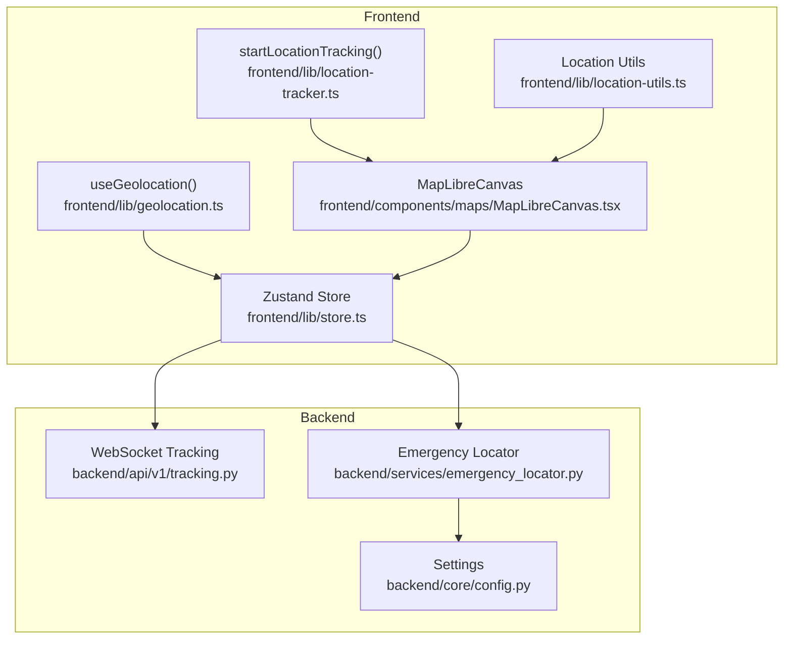
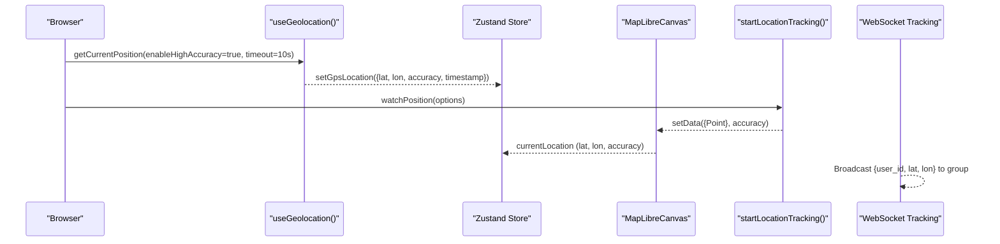
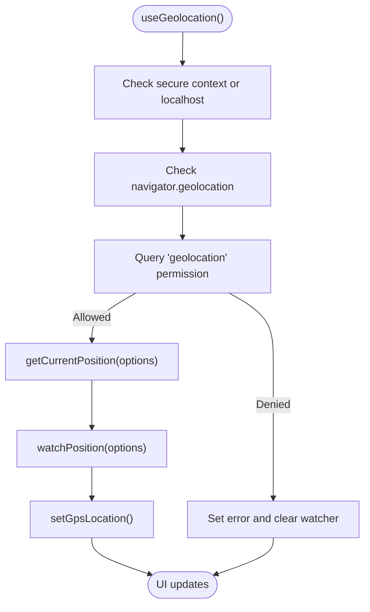
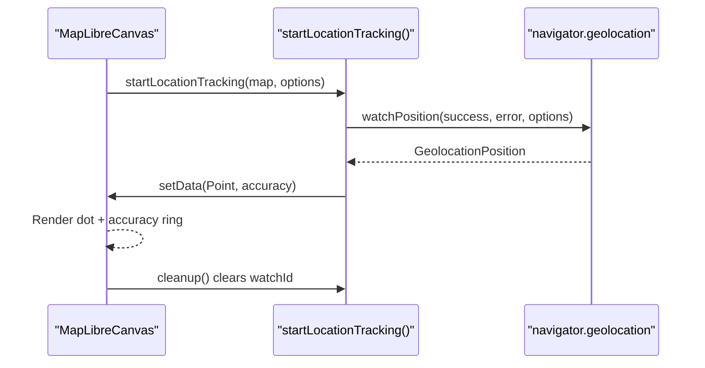
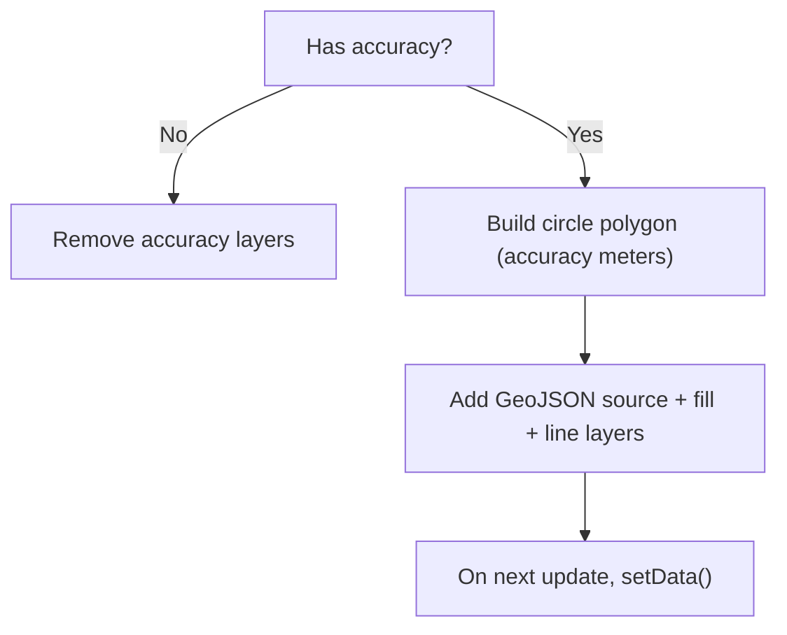
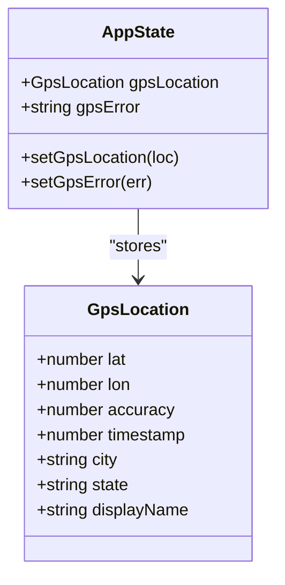
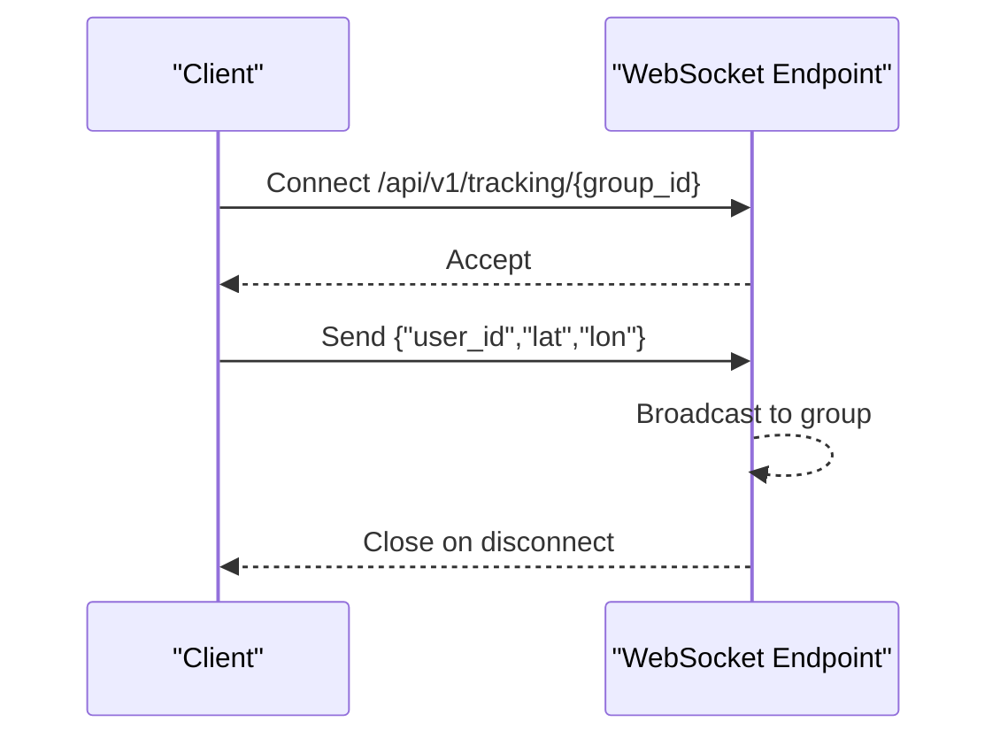
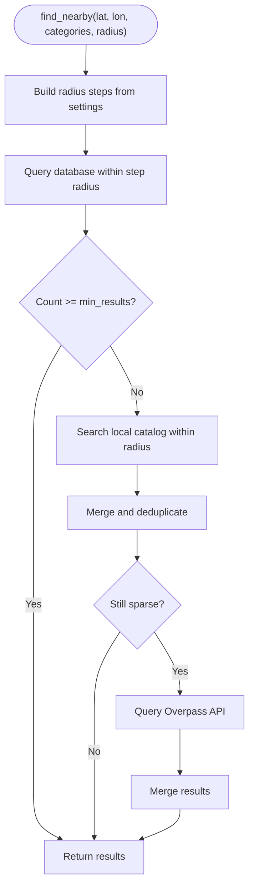
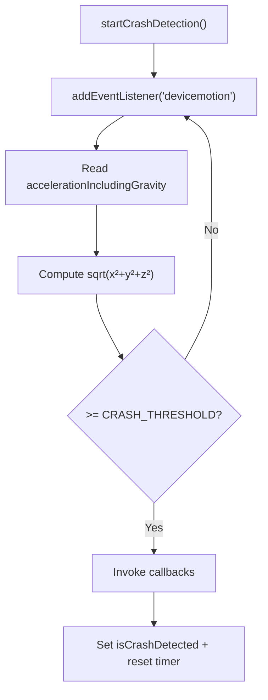
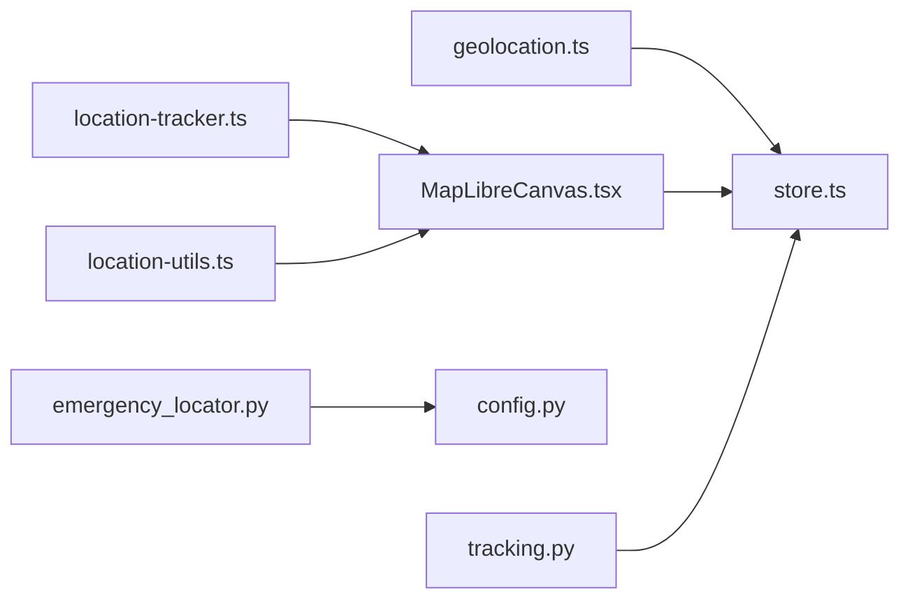

# GPS Location System

<cite>
**Referenced Files in This Document**
- [geolocation.ts](file://frontend/lib/geolocation.ts)
- [location-tracker.ts](file://frontend/lib/location-tracker.ts)
- [MapLibreCanvas.tsx](file://frontend/components/maps/MapLibreCanvas.tsx)
- [store.ts](file://frontend/lib/store.ts)
- [location-utils.ts](file://frontend/lib/location-utils.ts)
- [page.tsx](file://frontend/app/locator/page.tsx)
- [tracking.py](file://backend/api/v1/tracking.py)
- [emergency_locator.py](file://backend/services/emergency_locator.py)
- [config.py](file://backend/core/config.py)
- [crash-detection.ts](file://frontend/lib/crash-detection.ts)
- [offline-ai.ts](file://frontend/lib/offline-ai.ts)
- [Features.md](file://docs/Features.md)
</cite>

## Table of Contents
1. [Introduction](#introduction)
2. [Project Structure](#project-structure)
3. [Core Components](#core-components)
4. [Architecture Overview](#architecture-overview)
5. [Detailed Component Analysis](#detailed-component-analysis)
6. [Dependency Analysis](#dependency-analysis)
7. [Performance Considerations](#performance-considerations)
8. [Troubleshooting Guide](#troubleshooting-guide)
9. [Conclusion](#conclusion)
10. [Appendices](#appendices)

## Introduction
This document explains the GPS Location System powering location auto-detection, accuracy validation, and precision handling across the SafeVixAI platform. It covers:
- Browser Geolocation API integration and continuous tracking
- Accuracy visualization and validation
- Location precision handling and fallback strategies
- Backend family tracking via WebSocket
- Integration with emergency services and route planning
- Configuration options for accuracy thresholds, update intervals, and power consumption
- Common issues such as GPS drift, accuracy limitations, and offline scenarios

The goal is to make the system understandable for beginners while providing sufficient technical depth for experienced developers.

## Project Structure
The GPS system spans the frontend React application and the backend FastAPI service:
- Frontend: React hooks and components manage location acquisition, continuous tracking, and UI overlays for accuracy and routes.
- Backend: Real-time family tracking via WebSocket and emergency locator service with tiered fallback strategies.

**Diagram sources**
- [geolocation.ts:13-123](file://frontend/lib/geolocation.ts#L13-L123)
- [location-tracker.ts:8-65](file://frontend/lib/location-tracker.ts#L8-L65)
- [MapLibreCanvas.tsx:515-516](file://frontend/components/maps/MapLibreCanvas.tsx#L515-L516)
- [store.ts:63-127](file://frontend/lib/store.ts#L63-L127)
- [location-utils.ts:1-57](file://frontend/lib/location-utils.ts#L1-L57)
- [tracking.py:47-67](file://backend/api/v1/tracking.py#L47-L67)
- [emergency_locator.py:161-507](file://backend/services/emergency_locator.py#L161-L507)
- [config.py:11-181](file://backend/core/config.py#L11-L181)

**Section sources**
- [geolocation.ts:13-123](file://frontend/lib/geolocation.ts#L13-L123)
- [location-tracker.ts:8-65](file://frontend/lib/location-tracker.ts#L8-L65)
- [MapLibreCanvas.tsx:515-516](file://frontend/components/maps/MapLibreCanvas.tsx#L515-L516)
- [store.ts:63-127](file://frontend/lib/store.ts#L63-L127)
- [location-utils.ts:1-57](file://frontend/lib/location-utils.ts#L1-L57)
- [tracking.py:47-67](file://backend/api/v1/tracking.py#L47-L67)
- [emergency_locator.py:161-507](file://backend/services/emergency_locator.py#L161-L507)
- [config.py:11-181](file://backend/core/config.py#L11-L181)

## Core Components
- Frontend location hook: Acquires and watches position with high accuracy, handles permissions, and updates the global store.
- Location tracker: Subscribes to watchPosition and renders a moving dot on the map with an accuracy ring.
- Map overlay: Renders accuracy circles and route overlays based on current location and route data.
- Store: Centralized GPS state and metadata for UI and services.
- Backend tracking: WebSocket-based family tracking for live location sharing.
- Emergency locator: Tiered fallback search with database, local catalog, and Overpass API.
- Configuration: Tunable radius steps, timeouts, caching, and fallback thresholds.

**Section sources**
- [geolocation.ts:13-123](file://frontend/lib/geolocation.ts#L13-L123)
- [location-tracker.ts:8-65](file://frontend/lib/location-tracker.ts#L8-L65)
- [MapLibreCanvas.tsx:567-629](file://frontend/components/maps/MapLibreCanvas.tsx#L567-L629)
- [store.ts:63-127](file://frontend/lib/store.ts#L63-L127)
- [tracking.py:47-67](file://backend/api/v1/tracking.py#L47-L67)
- [emergency_locator.py:161-507](file://backend/services/emergency_locator.py#L161-L507)
- [config.py:26-47](file://backend/core/config.py#L26-L47)

## Architecture Overview
The GPS system integrates browser APIs with React components and FastAPI services. The frontend manages location acquisition and visualization, while the backend supports real-time sharing and emergency search.

**Diagram sources**
- [geolocation.ts:73-86](file://frontend/lib/geolocation.ts#L73-L86)
- [location-tracker.ts:46-61](file://frontend/lib/location-tracker.ts#L46-L61)
- [MapLibreCanvas.tsx:515-516](file://frontend/components/maps/MapLibreCanvas.tsx#L515-L516)
- [tracking.py:47-67](file://backend/api/v1/tracking.py#L47-L67)

## Detailed Component Analysis

### Frontend Location Acquisition and Continuous Tracking
- High-accuracy acquisition with controlled timeouts and caching.
- Permission-aware flow with graceful error messaging.
- Continuous watching with reduced frequency and age-based reuse.
- Cleanup of watchers on unmount.

**Diagram sources**
- [geolocation.ts:30-108](file://frontend/lib/geolocation.ts#L30-L108)

**Section sources**
- [geolocation.ts:30-108](file://frontend/lib/geolocation.ts#L30-L108)

### Location Tracker Service (Map Overlay)
- Adds a user dot and pulsing accuracy ring to the map.
- Updates GeoJSON source on each position update.
- Returns a cleanup function to clear the watcher.

**Diagram sources**
- [location-tracker.ts:8-65](file://frontend/lib/location-tracker.ts#L8-L65)
- [MapLibreCanvas.tsx:515-516](file://frontend/components/maps/MapLibreCanvas.tsx#L515-L516)

**Section sources**
- [location-tracker.ts:8-65](file://frontend/lib/location-tracker.ts#L8-L65)
- [MapLibreCanvas.tsx:567-629](file://frontend/components/maps/MapLibreCanvas.tsx#L567-L629)

### Accuracy Validation and Precision Handling
- Accuracy overlay: builds a polygon representing the estimated accuracy area.
- Threshold-based labeling and approximate location detection.
- Minimum radius enforcement for accuracy overlay rendering.

**Diagram sources**
- [MapLibreCanvas.tsx:567-629](file://frontend/components/maps/MapLibreCanvas.tsx#L567-L629)

**Section sources**
- [MapLibreCanvas.tsx:567-629](file://frontend/components/maps/MapLibreCanvas.tsx#L567-L629)
- [location-utils.ts:17-31](file://frontend/lib/location-utils.ts#L17-L31)

### Store and State Management
- Centralized GPS state with accuracy, timestamp, and reverse-geocoded metadata.
- Used by emergency locator and UI components.

**Diagram sources**
- [store.ts:4-12](file://frontend/lib/store.ts#L4-L12)
- [store.ts:63-127](file://frontend/lib/store.ts#L63-L127)

**Section sources**
- [store.ts:4-12](file://frontend/lib/store.ts#L4-L12)
- [store.ts:63-127](file://frontend/lib/store.ts#L63-L127)

### Backend Family Tracking (WebSocket)
- Accepts clients into groups and broadcasts location updates to all members.
- Robust connection management with cleanup on disconnect.

**Diagram sources**
- [tracking.py:47-67](file://backend/api/v1/tracking.py#L47-L67)

**Section sources**
- [tracking.py:47-67](file://backend/api/v1/tracking.py#L47-L67)

### Emergency Locator and Route Planning Integration
- Tiered radius fallback: database → local catalog → Overpass API.
- Configurable radius steps, minimum results, and caching.
- Route overlays rendered on the map using GeoJSON LineStrings.

**Diagram sources**
- [emergency_locator.py:187-373](file://backend/services/emergency_locator.py#L187-L373)
- [config.py:26-47](file://backend/core/config.py#L26-L47)

**Section sources**
- [emergency_locator.py:187-373](file://backend/services/emergency_locator.py#L187-L373)
- [config.py:26-47](file://backend/core/config.py#L26-L47)
- [MapLibreCanvas.tsx:652-799](file://frontend/components/maps/MapLibreCanvas.tsx#L652-L799)

### Device Sensors and Crash Detection
- Uses DeviceMotionEvent to detect high-G impacts indicative of crashes.
- Threshold-based detection with cooldown to prevent repeated triggers.
- Optional iOS permission flow.

**Diagram sources**
- [crash-detection.ts:22-45](file://frontend/lib/crash-detection.ts#L22-L45)

**Section sources**
- [crash-detection.ts:1-101](file://frontend/lib/crash-detection.ts#L1-L101)

## Dependency Analysis
- Frontend depends on:
  - Browser Geolocation API for position
  - MapLibre GL for rendering overlays
  - Zustand store for state
- Backend depends on:
  - Settings for emergency search configuration
  - Redis-backed cache for results (conceptual note)
  - Overpass API for fallback emergency search

**Diagram sources**
- [geolocation.ts:13-123](file://frontend/lib/geolocation.ts#L13-L123)
- [location-tracker.ts:8-65](file://frontend/lib/location-tracker.ts#L8-L65)
- [MapLibreCanvas.tsx:567-629](file://frontend/components/maps/MapLibreCanvas.tsx#L567-L629)
- [store.ts:63-127](file://frontend/lib/store.ts#L63-L127)
- [location-utils.ts:1-57](file://frontend/lib/location-utils.ts#L1-L57)
- [emergency_locator.py:161-507](file://backend/services/emergency_locator.py#L161-L507)
- [config.py:11-181](file://backend/core/config.py#L11-L181)
- [tracking.py:47-67](file://backend/api/v1/tracking.py#L47-L67)

**Section sources**
- [geolocation.ts:13-123](file://frontend/lib/geolocation.ts#L13-L123)
- [location-tracker.ts:8-65](file://frontend/lib/location-tracker.ts#L8-L65)
- [MapLibreCanvas.tsx:567-629](file://frontend/components/maps/MapLibreCanvas.tsx#L567-L629)
- [store.ts:63-127](file://frontend/lib/store.ts#L63-L127)
- [location-utils.ts:1-57](file://frontend/lib/location-utils.ts#L1-L57)
- [emergency_locator.py:161-507](file://backend/services/emergency_locator.py#L161-L507)
- [config.py:11-181](file://backend/core/config.py#L11-L181)
- [tracking.py:47-67](file://backend/api/v1/tracking.py#L47-L67)

## Performance Considerations
- Frontend:
  - Use high accuracy judiciously; balance battery life vs. precision.
  - Leverage maximumAge to reuse recent positions and reduce sensor usage.
  - Debounce UI updates to avoid frequent re-renders during rapid movement.
- Backend:
  - Cache emergency search results with TTL to minimize repeated database and external API calls.
  - Use tiered radius expansion to reduce unnecessary large-area queries.
  - Consider Redis-backed pub/sub for scalable WebSocket broadcasting in multi-worker deployments.

[No sources needed since this section provides general guidance]

## Troubleshooting Guide
Common issues and resolutions:
- Location permission denied:
  - Prompt users to enable location in browser settings.
  - Detect denied state via Permissions API and surface actionable errors.
- Insecure context:
  - Require HTTPS or localhost; otherwise, navigator.geolocation may be unavailable.
- Timeout or unavailable:
  - Increase timeout and consider fallback to cached position if available.
- Approximate location:
  - Detect accuracy ≥ 2500m and inform users; encourage moving to an open area.
- Offline scenarios:
  - Emergency locator falls back to local catalogs and Overpass API when network is unavailable.
  - Route overlays require current location; disable or hide when accuracy is too low.
- Battery optimization:
  - Reduce watchPosition frequency and increase maximumAge.
  - Stop tracking when the map is not visible or the user is stationary.

**Section sources**
- [geolocation.ts:35-43](file://frontend/lib/geolocation.ts#L35-L43)
- [geolocation.ts:63-71](file://frontend/lib/geolocation.ts#L63-L71)
- [location-utils.ts:17-19](file://frontend/lib/location-utils.ts#L17-L19)
- [emergency_locator.py:330-373](file://backend/services/emergency_locator.py#L330-L373)
- [MapLibreCanvas.tsx:583-587](file://frontend/components/maps/MapLibreCanvas.tsx#L583-L587)

## Conclusion
The GPS Location System integrates browser Geolocation API with React components and FastAPI services to deliver accurate, responsive location experiences. It validates accuracy, visualizes uncertainty, and provides robust fallbacks for emergency services and route planning. Configuration options allow tuning for accuracy, performance, and power consumption, while safeguards address common issues like GPS drift and offline scenarios.

[No sources needed since this section summarizes without analyzing specific files]

## Appendices

### Configuration Options
- Frontend:
  - High accuracy requests with timeout and maximumAge for watchPosition.
  - Accuracy overlay minimum radius enforcement.
- Backend:
  - Emergency search radius steps, minimum results, and cache TTL.
  - Overpass and routing service URLs and timeouts.

**Section sources**
- [geolocation.ts:74-85](file://frontend/lib/geolocation.ts#L74-L85)
- [MapLibreCanvas.tsx:583-587](file://frontend/components/maps/MapLibreCanvas.tsx#L583-L587)
- [config.py:26-47](file://backend/core/config.py#L26-L47)
- [config.py:38-47](file://backend/core/config.py#L38-L47)

### Feature References
- GPS auto-detection and watchPosition behavior
- Tiered radius fallback sequence
- SOS share and emergency numbers

**Section sources**
- [Features.md:5-9](file://docs/Features.md#L5-L9)
- [Features.md:19-23](file://docs/Features.md#L19-L23)
- [Features.md:25-29](file://docs/Features.md#L25-L29)