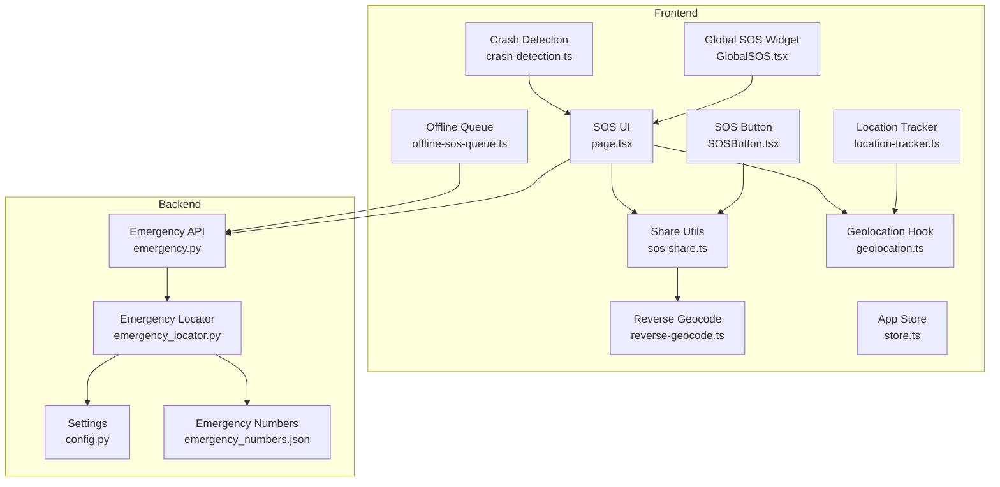
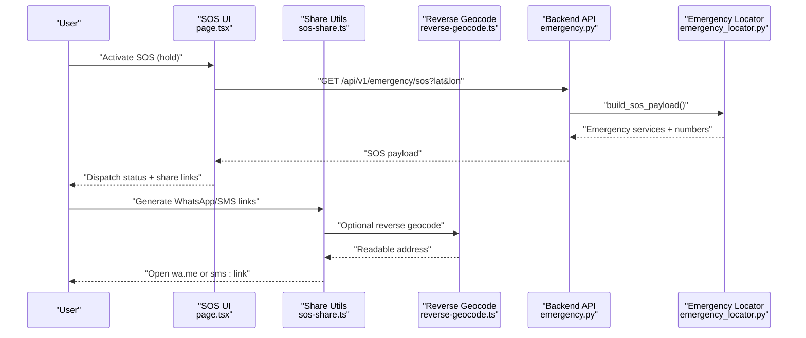
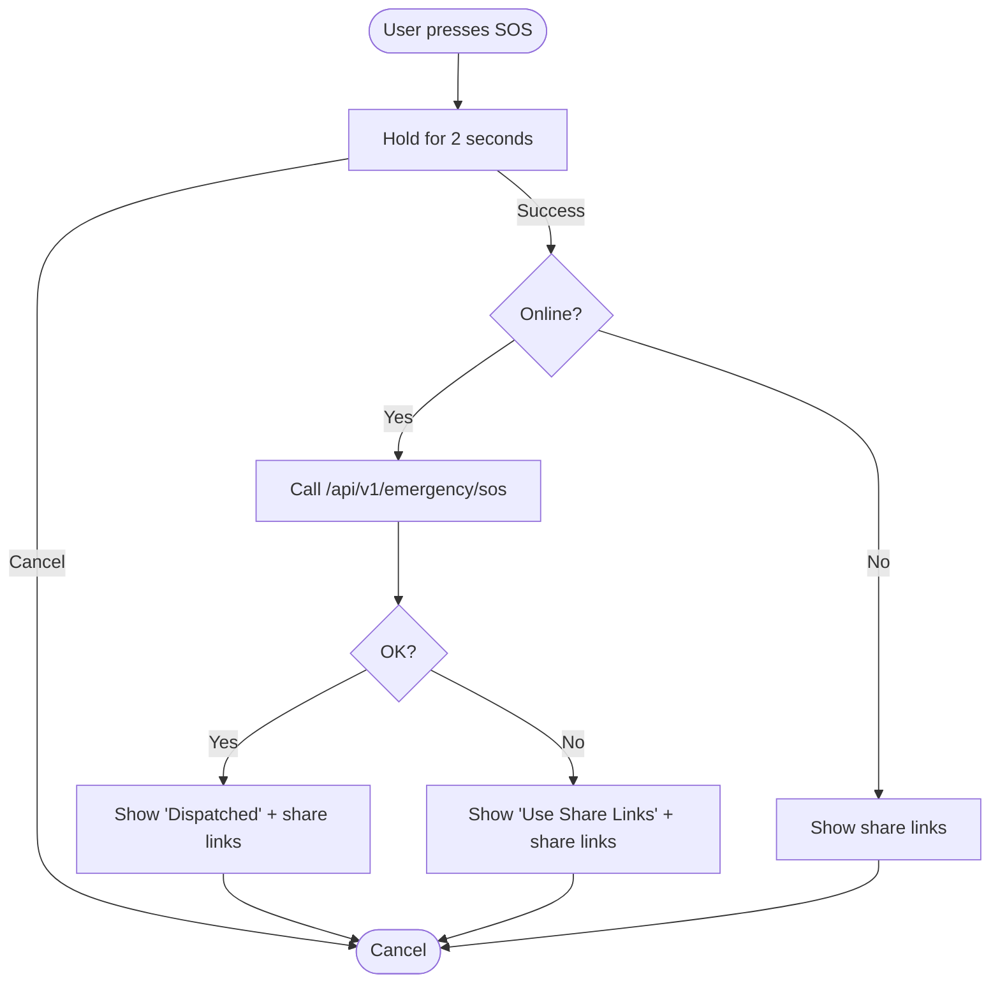
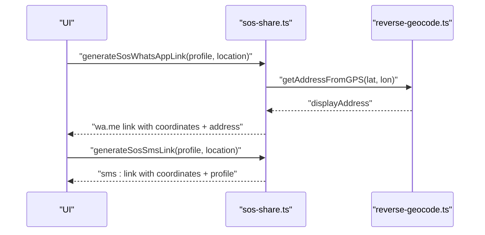
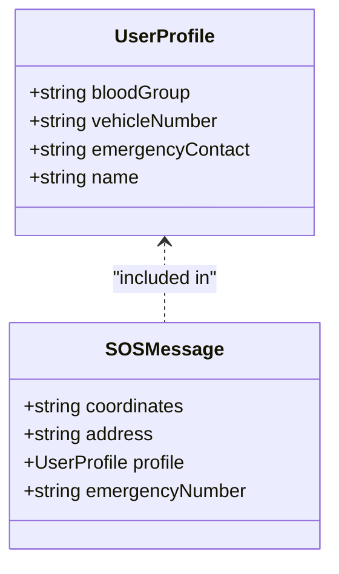
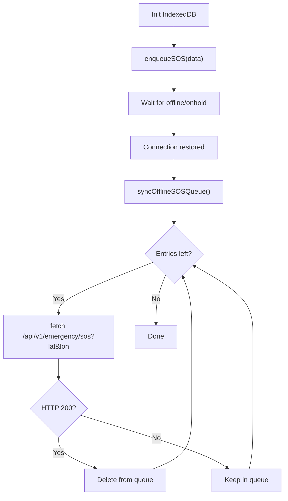
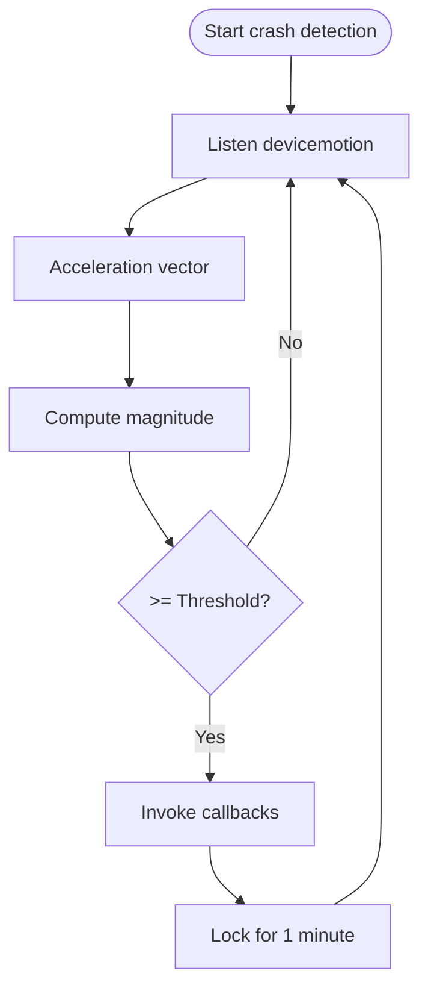
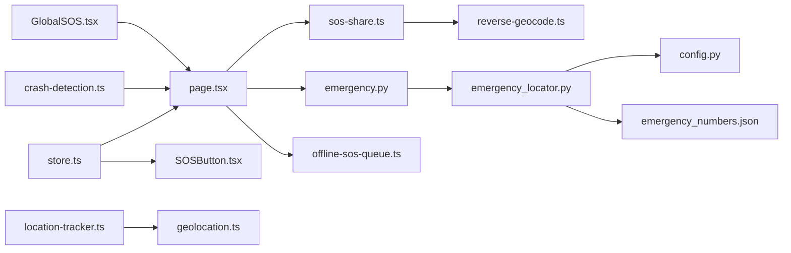

# SOS Sharing System

<cite>
**Referenced Files in This Document**
- [SOSButton.tsx](file://frontend/components/SOSButton.tsx)
- [page.tsx](file://frontend/app/sos/page.tsx)
- [sos-share.ts](file://frontend/lib/sos-share.ts)
- [reverse-geocode.ts](file://frontend/lib/reverse-geocode.ts)
- [geolocation.ts](file://frontend/lib/geolocation.ts)
- [store.ts](file://frontend/lib/store.ts)
- [crash-detection.ts](file://frontend/lib/crash-detection.ts)
- [offline-sos-queue.ts](file://frontend/lib/offline-sos-queue.ts)
- [GlobalSOS.tsx](file://frontend/components/GlobalSOS.tsx)
- [location-tracker.ts](file://frontend/lib/location-tracker.ts)
- [emergency.py](file://backend/api/v1/emergency.py)
- [emergency_locator.py](file://backend/services/emergency_locator.py)
- [config.py](file://backend/core/config.py)
- [emergency_numbers.json](file://chatbot_service/data/emergency_numbers.json)
- [sos_tool.py](file://chatbot_service/tools/sos_tool.py)
</cite>

## Table of Contents
1. [Introduction](#introduction)
2. [Project Structure](#project-structure)
3. [Core Components](#core-components)
4. [Architecture Overview](#architecture-overview)
5. [Detailed Component Analysis](#detailed-component-analysis)
6. [Dependency Analysis](#dependency-analysis)
7. [Performance Considerations](#performance-considerations)
8. [Troubleshooting Guide](#troubleshooting-guide)
9. [Conclusion](#conclusion)
10. [Appendices](#appendices)

## Introduction
This document explains the SOS Sharing System implemented in the SafeVixAI project. It covers SOS trigger mechanics, location sharing via WhatsApp and SMS, offline SOS queuing, crash detection integration, and emergency contact/profile data. It also documents configuration options, notification behavior, and practical troubleshooting strategies. The goal is to make the system understandable for beginners while providing deep technical insights for experienced developers.

## Project Structure
The SOS system spans the frontend (Next.js) and backend (FastAPI) layers:
- Frontend: SOS UI, location acquisition, sharing link generation, offline queue, crash detection, and global SOS widget.
- Backend: Emergency endpoints, emergency locator service, and configuration for radius steps and caching.
- Shared: Store for user profile and GPS location, reverse geocoding for readable addresses, and emergency numbers catalog.

**Diagram sources**
- [page.tsx:14-343](file://frontend/app/sos/page.tsx#L14-L343)
- [SOSButton.tsx:13-126](file://frontend/components/SOSButton.tsx#L13-L126)
- [sos-share.ts:1-69](file://frontend/lib/sos-share.ts#L1-L69)
- [geolocation.ts:13-124](file://frontend/lib/geolocation.ts#L13-L124)
- [reverse-geocode.ts:25-48](file://frontend/lib/reverse-geocode.ts#L25-L48)
- [store.ts:63-226](file://frontend/lib/store.ts#L63-L226)
- [crash-detection.ts:51-101](file://frontend/lib/crash-detection.ts#L51-L101)
- [offline-sos-queue.ts:25-138](file://frontend/lib/offline-sos-queue.ts#L25-L138)
- [GlobalSOS.tsx:7-56](file://frontend/components/GlobalSOS.tsx#L7-L56)
- [location-tracker.ts:8-66](file://frontend/lib/location-tracker.ts#L8-L66)
- [emergency.py:19-83](file://backend/api/v1/emergency.py#L19-L83)
- [emergency_locator.py:161-507](file://backend/services/emergency_locator.py#L161-L507)
- [config.py:26-100](file://backend/core/config.py#L26-L100)
- [emergency_numbers.json:1-70](file://chatbot_service/data/emergency_numbers.json#L1-L70)

**Section sources**
- [page.tsx:14-343](file://frontend/app/sos/page.tsx#L14-L343)
- [emergency.py:19-83](file://backend/api/v1/emergency.py#L19-L83)

## Core Components
- SOS UI and trigger:
  - A persistent SOS terminal page with a long-press activation flow and quick dial cards for emergency numbers.
  - A floating SOS button with animated confirmation panel for WhatsApp and SMS sharing.
- Location sharing:
  - Pre-formatted WhatsApp and SMS links generated from current GPS coordinates and user profile.
  - Optional reverse geocoding to include a readable address in the WhatsApp message.
- Offline SOS queue:
  - IndexedDB-backed queue stores SOS events when offline; syncs automatically upon reconnection.
- Crash detection:
  - Device motion sensor detects high-G impacts and triggers SOS flow.
- Emergency contacts and profile:
  - User profile fields (name, blood group, vehicle number, emergency contact) are used in SOS messages and displayed in the SOS terminal.

**Section sources**
- [page.tsx:14-343](file://frontend/app/sos/page.tsx#L14-L343)
- [SOSButton.tsx:13-126](file://frontend/components/SOSButton.tsx#L13-L126)
- [sos-share.ts:9-68](file://frontend/lib/sos-share.ts#L9-L68)
- [offline-sos-queue.ts:48-124](file://frontend/lib/offline-sos-queue.ts#L48-L124)
- [crash-detection.ts:51-101](file://frontend/lib/crash-detection.ts#L51-L101)
- [store.ts:53-58](file://frontend/lib/store.ts#L53-L58)

## Architecture Overview
The SOS workflow integrates frontend UI, location services, and backend APIs. It supports online dispatch and offline fallback.

**Diagram sources**
- [page.tsx:102-114](file://frontend/app/sos/page.tsx#L102-L114)
- [emergency.py:42-71](file://backend/api/v1/emergency.py#L42-L71)
- [emergency_locator.py:218-239](file://backend/services/emergency_locator.py#L218-L239)
- [sos-share.ts:9-68](file://frontend/lib/sos-share.ts#L9-L68)
- [reverse-geocode.ts:25-48](file://frontend/lib/reverse-geocode.ts#L25-L48)

## Detailed Component Analysis

### SOS Trigger Handling (Long-Press and Crash)
- Long-press activation:
  - The SOS terminal page implements a 2-second press-and-hold animation. On completion, it attempts to dispatch an SOS to the backend and updates UI state accordingly.
  - During dispatch, it shows “Contacting Emergency Services…” and transitions to “Dispatched” or “Use Share Links” depending on online/offline state.
- Crash detection:
  - The crash detection module listens to device motion events and triggers a crash when a high-G threshold is exceeded. It prevents double-triggering within a minute and supports iOS permission flow.
- Manual sharing:
  - The floating SOS button opens a confirmation panel with WhatsApp and SMS actions. Clicking either generates a pre-filled link and opens it.

**Diagram sources**
- [page.tsx:62-114](file://frontend/app/sos/page.tsx#L62-L114)
- [crash-detection.ts:51-83](file://frontend/lib/crash-detection.ts#L51-L83)
- [SOSButton.tsx:17-27](file://frontend/components/SOSButton.tsx#L17-L27)

**Section sources**
- [page.tsx:62-114](file://frontend/app/sos/page.tsx#L62-L114)
- [crash-detection.ts:51-83](file://frontend/lib/crash-detection.ts#L51-L83)
- [SOSButton.tsx:17-27](file://frontend/components/SOSButton.tsx#L17-L27)

### Location Sharing Mechanisms (WhatsApp and SMS)
- WhatsApp link generation:
  - Builds a wa.me link with a pre-filled message containing coordinates, readable address (optional), user profile fields, and emergency number.
  - Provides both async (reverse geocodes) and sync variants.
- SMS link generation:
  - Creates a tel: link with a concise message including coordinates and user profile.
- Address formatting:
  - Uses BigDataCloud reverse geocoding to produce a display address from GPS coordinates.

**Diagram sources**
- [sos-share.ts:9-68](file://frontend/lib/sos-share.ts#L9-L68)
- [reverse-geocode.ts:25-48](file://frontend/lib/reverse-geocode.ts#L25-L48)

**Section sources**
- [sos-share.ts:9-68](file://frontend/lib/sos-share.ts#L9-L68)
- [reverse-geocode.ts:25-48](file://frontend/lib/reverse-geocode.ts#L25-L48)

### Emergency Contact Integration and Profile Data
- User profile fields used in SOS messages:
  - Name, blood group, vehicle number, and emergency contact are included in WhatsApp messages.
- Profile display in SOS terminal:
  - The SOS page shows user profile details and prompts to complete missing fields.
- Backend emergency numbers:
  - A curated catalog of Indian emergency numbers is loaded and returned by the backend.

**Diagram sources**
- [store.ts:53-58](file://frontend/lib/store.ts#L53-L58)
- [sos-share.ts:22-32](file://frontend/lib/sos-share.ts#L22-L32)
- [page.tsx:304-334](file://frontend/app/sos/page.tsx#L304-L334)
- [emergency_numbers.json:1-70](file://chatbot_service/data/emergency_numbers.json#L1-L70)

**Section sources**
- [store.ts:53-58](file://frontend/lib/store.ts#L53-L58)
- [sos-share.ts:22-32](file://frontend/lib/sos-share.ts#L22-L32)
- [page.tsx:304-334](file://frontend/app/sos/page.tsx#L304-L334)
- [emergency_numbers.json:1-70](file://chatbot_service/data/emergency_numbers.json#L1-L70)

### Offline SOS Queue and Automatic Sync
- Queue storage:
  - IndexedDB stores SOS entries with coordinates and optional profile data when offline.
- Sync on reconnect:
  - On network restoration, the system iterates queued entries and sends them to the backend, deleting successfully transmitted entries.
- Background sync hint:
  - The code includes a commented note about potential background sync via ServiceWorker, but the current implementation relies on manual sync on online events.

**Diagram sources**
- [offline-sos-queue.ts:25-138](file://frontend/lib/offline-sos-queue.ts#L25-L138)
- [emergency.py:42-71](file://backend/api/v1/emergency.py#L42-L71)

**Section sources**
- [offline-sos-queue.ts:48-124](file://frontend/lib/offline-sos-queue.ts#L48-L124)
- [emergency.py:42-71](file://backend/api/v1/emergency.py#L42-L71)

### Crash Detection Integration
- Threshold and debounce:
  - Detects G-forces exceeding a configured threshold and prevents repeated triggers for a minute.
- Permission handling:
  - Requests permission on iOS devices where required.
- Demo mode:
  - Includes a mock function for demos that simulates a crash.

**Diagram sources**
- [crash-detection.ts:22-45](file://frontend/lib/crash-detection.ts#L22-L45)

**Section sources**
- [crash-detection.ts:51-101](file://frontend/lib/crash-detection.ts#L51-L101)

### Global SOS Widget and Location Tracking
- Global SOS widget:
  - A floating SOS button appears on most pages, linking to the SOS terminal.
- Location tracking:
  - A helper tracks and renders the user’s position on a map using browser geolocation.

**Section sources**
- [GlobalSOS.tsx:7-56](file://frontend/components/GlobalSOS.tsx#L7-L56)
- [location-tracker.ts:8-66](file://frontend/lib/location-tracker.ts#L8-L66)

## Dependency Analysis
- Frontend dependencies:
  - SOS UI depends on the store for user profile and GPS location, and on share utilities for generating links.
  - Reverse geocoding is optional and used only for richer WhatsApp messages.
  - Offline queue depends on IndexedDB and network events.
- Backend dependencies:
  - The SOS endpoint depends on the emergency locator service, which queries the database, merges with local catalog and Overpass fallback, and returns emergency numbers.
  - Settings configure radius steps, caching TTL, and external service URLs.

**Diagram sources**
- [store.ts:63-226](file://frontend/lib/store.ts#L63-L226)
- [page.tsx:14-343](file://frontend/app/sos/page.tsx#L14-L343)
- [SOSButton.tsx:13-126](file://frontend/components/SOSButton.tsx#L13-L126)
- [sos-share.ts:1-69](file://frontend/lib/sos-share.ts#L1-L69)
- [reverse-geocode.ts:25-48](file://frontend/lib/reverse-geocode.ts#L25-L48)
- [emergency.py:19-83](file://backend/api/v1/emergency.py#L19-L83)
- [emergency_locator.py:161-507](file://backend/services/emergency_locator.py#L161-L507)
- [config.py:26-100](file://backend/core/config.py#L26-L100)
- [emergency_numbers.json:1-70](file://chatbot_service/data/emergency_numbers.json#L1-L70)
- [offline-sos-queue.ts:25-138](file://frontend/lib/offline-sos-queue.ts#L25-L138)
- [crash-detection.ts:51-101](file://frontend/lib/crash-detection.ts#L51-L101)
- [GlobalSOS.tsx:7-56](file://frontend/components/GlobalSOS.tsx#L7-L56)
- [location-tracker.ts:8-66](file://frontend/lib/location-tracker.ts#L8-L66)
- [geolocation.ts:13-124](file://frontend/lib/geolocation.ts#L13-L124)

**Section sources**
- [emergency_locator.py:161-507](file://backend/services/emergency_locator.py#L161-L507)
- [config.py:26-100](file://backend/core/config.py#L26-L100)

## Performance Considerations
- Reverse geocoding:
  - Optional and performed asynchronously to avoid blocking the UI. Consider caching results per session to reduce repeated calls.
- Offline queue:
  - Batch sending is sequential; consider parallelization with backoff to improve throughput while respecting server limits.
- Geolocation:
  - High-accuracy requests increase battery usage. The hook sets reasonable timeouts and maximum age; adjust based on device capability and user preference.
- Emergency search:
  - Radius steps and caching TTL are configurable. Larger steps and longer TTL reduce API calls but may affect result freshness.

[No sources needed since this section provides general guidance]

## Troubleshooting Guide
- Sharing failures:
  - If wa.me or sms links do not open, verify the generated URLs and ensure the device supports the respective handlers.
  - For offline scenarios, confirm that the offline queue stored an entry and that sync ran after reconnection.
- Contact availability:
  - If reverse geocoding fails, the message falls back to coordinates-only. Ensure network access for BigDataCloud.
- User privacy:
  - The system does not require an API key for reverse geocoding and avoids exposing sensitive endpoints. Still, review browser permissions and user consent flows.
- GPS issues:
  - If location is unavailable, the UI displays an error or placeholder. Confirm browser permissions and device GPS availability.
- Crash detection:
  - On iOS, permission may be required. If crashes are not detected, check permission state and logs.

**Section sources**
- [offline-sos-queue.ts:75-124](file://frontend/lib/offline-sos-queue.ts#L75-L124)
- [reverse-geocode.ts:25-48](file://frontend/lib/reverse-geocode.ts#L25-L48)
- [geolocation.ts:30-108](file://frontend/lib/geolocation.ts#L30-L108)
- [crash-detection.ts:56-73](file://frontend/lib/crash-detection.ts#L56-L73)

## Conclusion
The SOS Sharing System combines a robust frontend SOS terminal with crash detection, precise location sharing, and resilient offline behavior. It leverages a modular backend for emergency discovery and curated emergency numbers, ensuring reliable dispatch and communication during critical moments. The system balances usability, privacy, and performance, offering clear pathways for customization and extension.

[No sources needed since this section summarizes without analyzing specific files]

## Appendices

### Configuration Options
- Emergency search:
  - Radius steps, max radius, minimum results, and cache TTL are configurable in settings.
- External services:
  - Overpass, Photon/Nominatim, OpenRouteService endpoints and timeouts are configurable.
- Emergency numbers:
  - A JSON catalog defines national and state-specific numbers; the backend loads and returns them.

**Section sources**
- [config.py:26-100](file://backend/core/config.py#L26-L100)
- [emergency_locator.py:117-158](file://backend/services/emergency_locator.py#L117-L158)
- [emergency_numbers.json:1-70](file://chatbot_service/data/emergency_numbers.json#L1-L70)

### Backend SOS Endpoint Behavior
- The SOS endpoint records the incident, builds a payload with nearby emergency services and numbers, and returns it to the client.

**Section sources**
- [emergency.py:42-71](file://backend/api/v1/emergency.py#L42-L71)
- [emergency_locator.py:218-239](file://backend/services/emergency_locator.py#L218-L239)