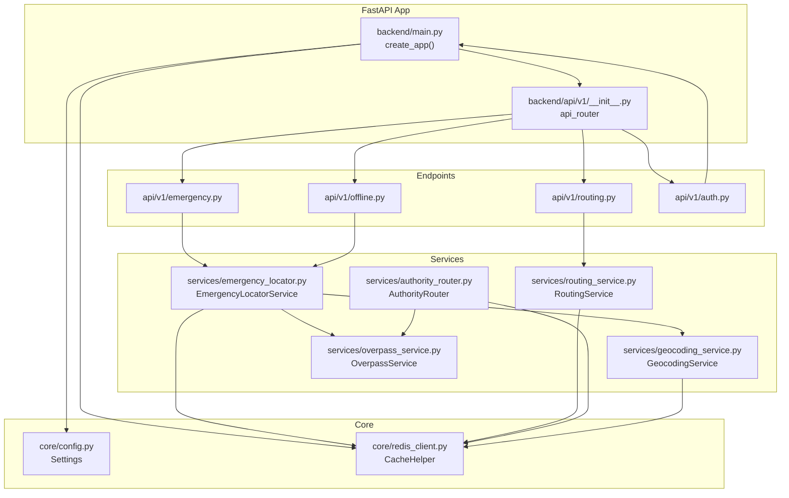
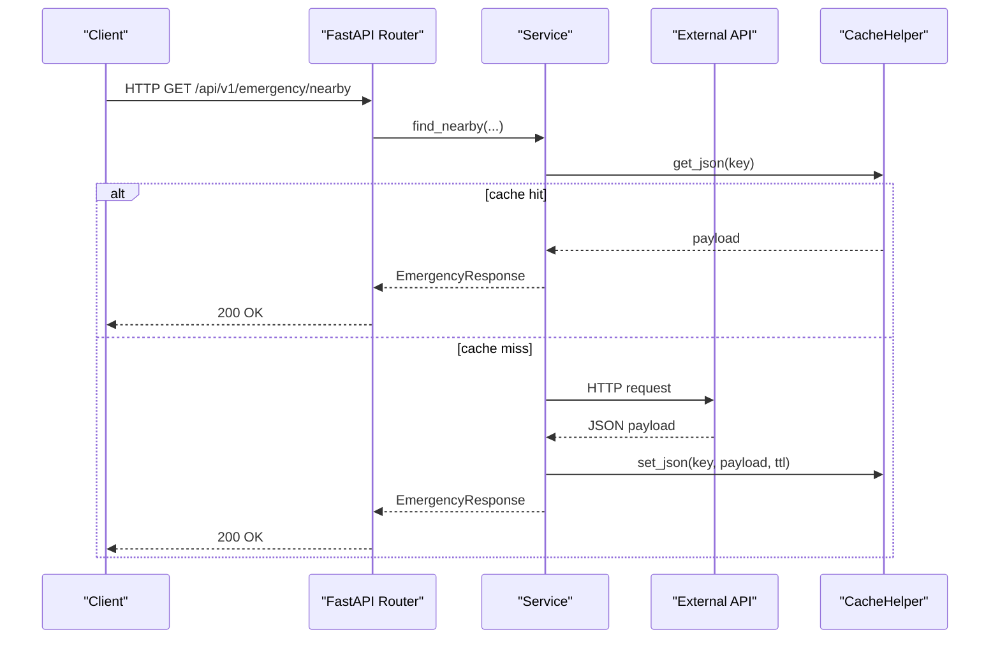
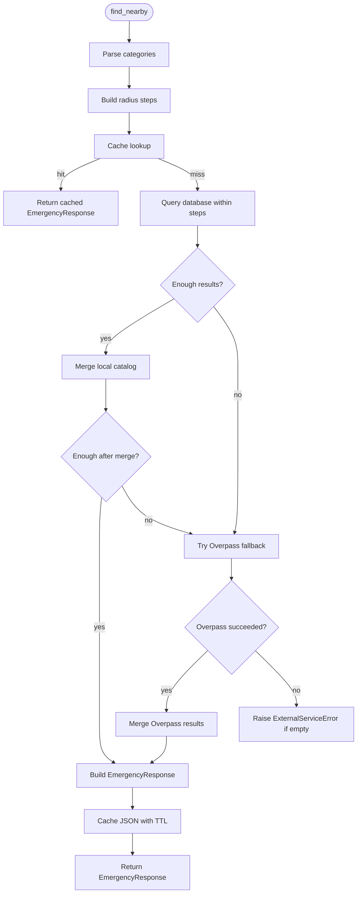
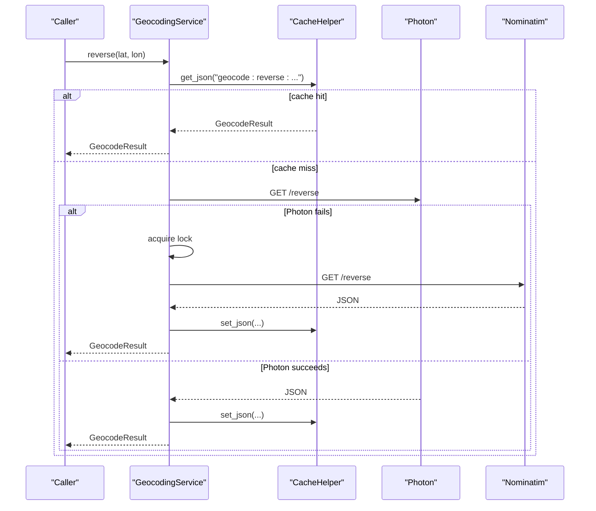
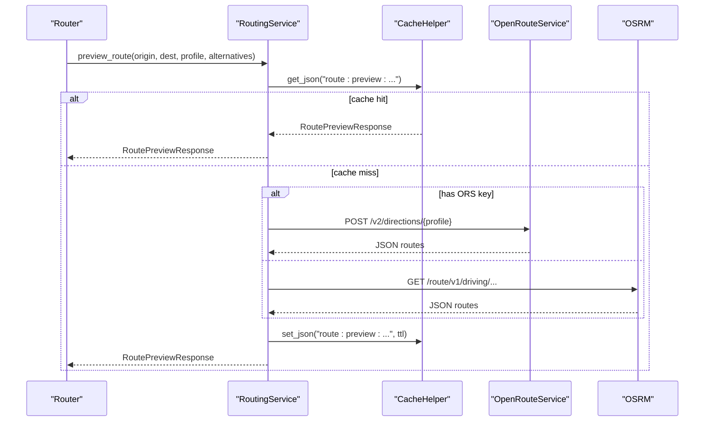
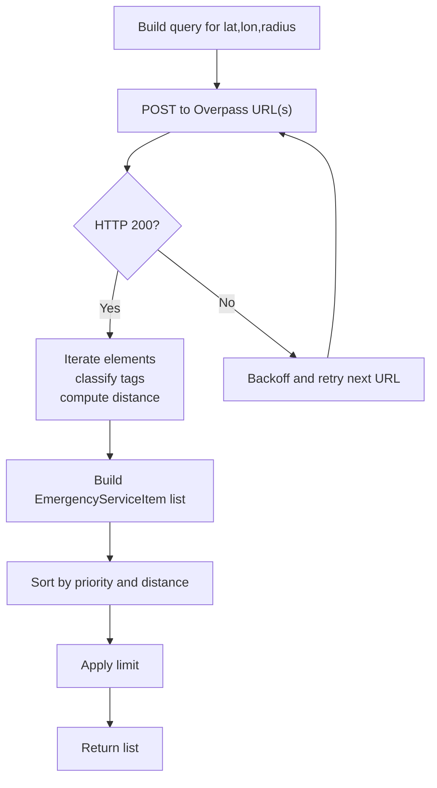
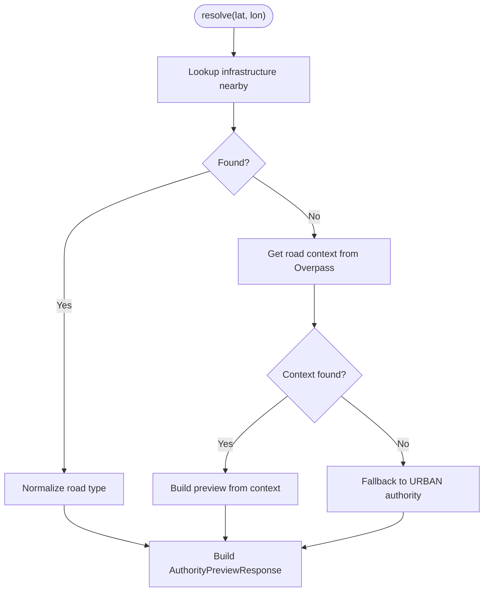
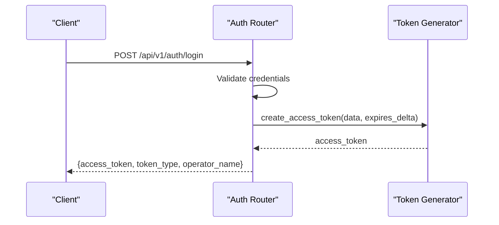
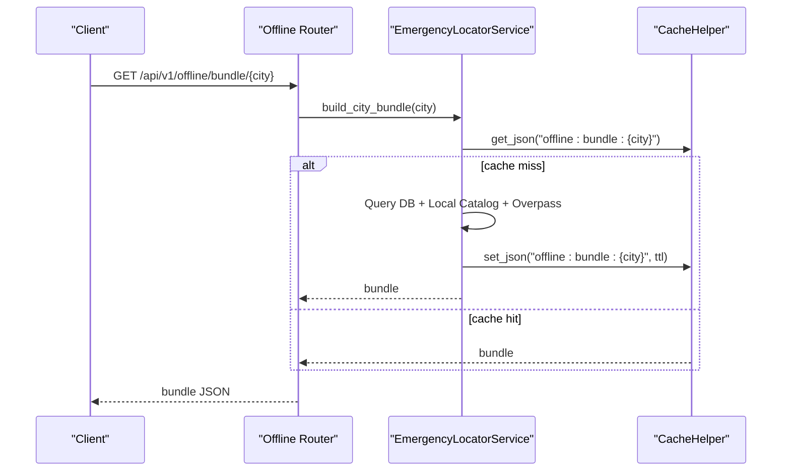
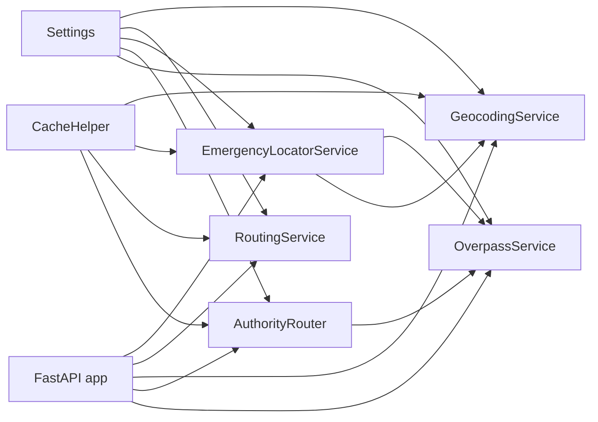

# API Integration

<cite>
**Referenced Files in This Document**
- [backend/main.py](file://backend/main.py)
- [backend/api/v1/__init__.py](file://backend/api/v1/__init__.py)
- [backend/api/v1/emergency.py](file://backend/api/v1/emergency.py)
- [backend/api/v1/routing.py](file://backend/api/v1/routing.py)
- [backend/api/v1/auth.py](file://backend/api/v1/auth.py)
- [backend/api/v1/offline.py](file://backend/api/v1/offline.py)
- [backend/core/config.py](file://backend/core/config.py)
- [backend/core/redis_client.py](file://backend/core/redis_client.py)
- [backend/services/emergency_locator.py](file://backend/services/emergency_locator.py)
- [backend/services/geocoding_service.py](file://backend/services/geocoding_service.py)
- [backend/services/routing_service.py](file://backend/services/routing_service.py)
- [backend/services/overpass_service.py](file://backend/services/overpass_service.py)
- [backend/services/authority_router.py](file://backend/services/authority_router.py)
- [backend/models/schemas.py](file://backend/models/schemas.py)
</cite>

## Table of Contents
1. [Introduction](#introduction)
2. [Project Structure](#project-structure)
3. [Core Components](#core-components)
4. [Architecture Overview](#architecture-overview)
5. [Detailed Component Analysis](#detailed-component-analysis)
6. [Dependency Analysis](#dependency-analysis)
7. [Performance Considerations](#performance-considerations)
8. [Troubleshooting Guide](#troubleshooting-guide)
9. [Conclusion](#conclusion)

## Introduction
This document explains the API integration patterns and backend communication architecture used by the SafeVixAI backend. It focuses on the REST API client implementations, error handling strategies, request/response transformations, and integrations with emergency services, geocoding APIs, routing services, and government datasets. It also covers authentication, rate limiting, caching, offline fallback APIs, error recovery, and performance optimization via caching and fallback strategies.

## Project Structure
The backend is a FastAPI application that wires up services and exposes REST endpoints grouped by feature. Services encapsulate external API integrations and internal data access, while schemas define request/response contracts.

**Diagram sources**
- [backend/main.py:24-128](file://backend/main.py#L24-L128)
- [backend/api/v1/__init__.py:17-27](file://backend/api/v1/__init__.py#L17-L27)
- [backend/api/v1/emergency.py:12-83](file://backend/api/v1/emergency.py#L12-L83)
- [backend/api/v1/routing.py:11-64](file://backend/api/v1/routing.py#L11-L64)
- [backend/api/v1/offline.py:11-28](file://backend/api/v1/offline.py#L11-L28)
- [backend/api/v1/auth.py:6-44](file://backend/api/v1/auth.py#L6-L44)
- [backend/core/config.py:11-181](file://backend/core/config.py#L11-L181)
- [backend/core/redis_client.py:10-140](file://backend/core/redis_client.py#L10-L140)
- [backend/services/emergency_locator.py:161-507](file://backend/services/emergency_locator.py#L161-L507)
- [backend/services/geocoding_service.py:19-170](file://backend/services/geocoding_service.py#L19-L170)
- [backend/services/routing_service.py:20-356](file://backend/services/routing_service.py#L20-L356)
- [backend/services/overpass_service.py:24-249](file://backend/services/overpass_service.py#L24-L249)
- [backend/services/authority_router.py:42-143](file://backend/services/authority_router.py#L42-L143)

**Section sources**
- [backend/main.py:24-128](file://backend/main.py#L24-L128)
- [backend/api/v1/__init__.py:17-27](file://backend/api/v1/__init__.py#L17-L27)

## Core Components
- REST API routers and endpoints for emergency, routing, offline, and authentication.
- Service layer for emergency locator, geocoding, routing, authority routing, and Overpass integration.
- Configuration and caching helpers for timeouts, retries, and cache TTLs.
- Pydantic models defining request/response schemas.

Key responsibilities:
- EmergencyLocatorService: multi-source discovery (database, local catalog, Overpass), merging, caching, and SOS payload assembly.
- GeocodingService: Photon/Nominatim dual fallback with rate limiting and normalization.
- RoutingService: OpenRouteService (with API key) and OSRM fallback with normalization and caching.
- AuthorityRouter: road type classification and authority resolution via OSM and database-backed infrastructure.
- OverpassService: OSM queries for services and road context with retry and classification logic.

**Section sources**
- [backend/api/v1/emergency.py:12-83](file://backend/api/v1/emergency.py#L12-L83)
- [backend/api/v1/routing.py:11-64](file://backend/api/v1/routing.py#L11-L64)
- [backend/api/v1/offline.py:11-28](file://backend/api/v1/offline.py#L11-L28)
- [backend/api/v1/auth.py:6-44](file://backend/api/v1/auth.py#L6-L44)
- [backend/services/emergency_locator.py:161-507](file://backend/services/emergency_locator.py#L161-L507)
- [backend/services/geocoding_service.py:19-170](file://backend/services/geocoding_service.py#L19-L170)
- [backend/services/routing_service.py:20-356](file://backend/services/routing_service.py#L20-L356)
- [backend/services/overpass_service.py:24-249](file://backend/services/overpass_service.py#L24-L249)
- [backend/services/authority_router.py:42-143](file://backend/services/authority_router.py#L42-L143)
- [backend/models/schemas.py:10-288](file://backend/models/schemas.py#L10-L288)

## Architecture Overview
The backend initializes services and caches at startup, mounts routers, and exposes endpoints. Each endpoint delegates to a service, which performs external API calls, applies transformations, and caches results. Error propagation to clients is handled via exceptions mapped to HTTP status codes.

**Diagram sources**
- [backend/api/v1/emergency.py:19-40](file://backend/api/v1/emergency.py#L19-L40)
- [backend/services/emergency_locator.py:187-217](file://backend/services/emergency_locator.py#L187-L217)
- [backend/core/redis_client.py:43-71](file://backend/core/redis_client.py#L43-L71)

## Detailed Component Analysis

### Emergency Locator Service
- Multi-stage discovery:
  - Database with configurable radius steps and minimum results threshold.
  - Local catalog merge with distance sorting.
  - Overpass fallback with category filtering and normalization.
- Merging logic avoids duplicates across sources.
- Caching keys include coordinates, categories, radius, and limit.
- SOS payload composition augments emergency results with national numbers.

**Diagram sources**
- [backend/services/emergency_locator.py:187-374](file://backend/services/emergency_locator.py#L187-L374)
- [backend/core/redis_client.py:43-71](file://backend/core/redis_client.py#L43-L71)

**Section sources**
- [backend/services/emergency_locator.py:161-507](file://backend/services/emergency_locator.py#L161-L507)
- [backend/api/v1/emergency.py:19-75](file://backend/api/v1/emergency.py#L19-L75)

### Geocoding Service
- Dual provider fallback: Photon first, Nominatim second.
- Rate limiting for Nominatim requests using a per-instance lock and sleep.
- Normalization transforms provider payloads into a unified schema.
- Caching with separate TTL for geocoding.

**Diagram sources**
- [backend/services/geocoding_service.py:33-111](file://backend/services/geocoding_service.py#L33-L111)
- [backend/core/redis_client.py:43-71](file://backend/core/redis_client.py#L43-L71)

**Section sources**
- [backend/services/geocoding_service.py:19-170](file://backend/services/geocoding_service.py#L19-L170)

### Routing Service
- Provider selection:
  - OpenRouteService when API key is present; supports alternatives.
  - OSRM public endpoint fallback; limited features.
- Response normalization for both providers into a unified schema.
- Caching with route-specific keys and TTL.

**Diagram sources**
- [backend/services/routing_service.py:35-142](file://backend/services/routing_service.py#L35-L142)
- [backend/core/redis_client.py:43-71](file://backend/core/redis_client.py#L43-L71)

**Section sources**
- [backend/services/routing_service.py:20-356](file://backend/services/routing_service.py#L20-L356)
- [backend/api/v1/routing.py:18-41](file://backend/api/v1/routing.py#L18-L41)

### Overpass Service
- Builds Overpass QL queries for services and roads.
- Extracts tags, computes distances, and normalizes attributes (24/7, ICU, trauma).
- Retries across multiple Overpass endpoints with backoff.

**Diagram sources**
- [backend/services/overpass_service.py:35-135](file://backend/services/overpass_service.py#L35-L135)

**Section sources**
- [backend/services/overpass_service.py:24-249](file://backend/services/overpass_service.py#L24-L249)

### Authority Router
- Resolves road authority by:
  - Looking up infrastructure within a small radius.
  - Falling back to Overpass road context classification.
- Maps road type codes to authority info and helplines.

**Diagram sources**
- [backend/services/authority_router.py:48-126](file://backend/services/authority_router.py#L48-L126)

**Section sources**
- [backend/services/authority_router.py:42-143](file://backend/services/authority_router.py#L42-L143)

### Authentication
- Demo login endpoint with predefined users and JWT token generation.
- Verification endpoint for auth health checks.

**Diagram sources**
- [backend/api/v1/auth.py:24-38](file://backend/api/v1/auth.py#L24-L38)

**Section sources**
- [backend/api/v1/auth.py:6-44](file://backend/api/v1/auth.py#L6-L44)

### Offline Bundles
- Endpoint to build and cache a city-specific emergency bundle combining database, local catalog, and Overpass data.

**Diagram sources**
- [backend/api/v1/offline.py:18-27](file://backend/api/v1/offline.py#L18-L27)
- [backend/services/emergency_locator.py:241-299](file://backend/services/emergency_locator.py#L241-L299)

**Section sources**
- [backend/api/v1/offline.py:11-28](file://backend/api/v1/offline.py#L11-L28)
- [backend/services/emergency_locator.py:241-299](file://backend/services/emergency_locator.py#L241-L299)

## Dependency Analysis
- Startup wiring initializes services and cache, attaching them to the app state for DI via dependency injection in routers.
- Services depend on Settings for URLs, timeouts, and TTLs; most services also depend on CacheHelper.
- Endpoints depend on services and SQLAlchemy sessions.

**Diagram sources**
- [backend/main.py:24-63](file://backend/main.py#L24-L63)
- [backend/core/config.py:11-181](file://backend/core/config.py#L11-L181)
- [backend/core/redis_client.py:10-140](file://backend/core/redis_client.py#L10-L140)

**Section sources**
- [backend/main.py:24-63](file://backend/main.py#L24-L63)
- [backend/core/config.py:11-181](file://backend/core/config.py#L11-L181)
- [backend/core/redis_client.py:10-140](file://backend/core/redis_client.py#L10-L140)

## Performance Considerations
- Caching:
  - Emergency and routing responses are cached with dedicated TTLs.
  - Geocoding results are cached with a longer TTL.
  - CacheHelper supports Redis and in-memory fallback with health tracking.
- Rate limiting:
  - Nominatim requests are rate-limited using a per-instance lock and sleep to respect provider policies.
- Fallback strategies:
  - Emergency locator tries database, then local catalog, then Overpass.
  - Geocoding tries Photon, then falls back to Nominatim.
  - Routing prefers ORS with API key; otherwise uses OSRM.
- Request normalization:
  - Providers’ responses are normalized into unified schemas to reduce downstream complexity.

**Section sources**
- [backend/core/redis_client.py:43-125](file://backend/core/redis_client.py#L43-L125)
- [backend/services/geocoding_service.py:99-111](file://backend/services/geocoding_service.py#L99-L111)
- [backend/services/emergency_locator.py:342-374](file://backend/services/emergency_locator.py#L342-L374)
- [backend/services/routing_service.py:61-105](file://backend/services/routing_service.py#L61-L105)

## Troubleshooting Guide
- Health endpoint:
  - Returns availability of database and cache, plus environment and version.
  - On degraded database state, returns 503 with structured payload.
- Error mapping:
  - ExternalServiceError raised by services is mapped to 503 in routers.
  - ServiceValidationError is mapped to 422 in routing.
- Common issues:
  - Missing ORS API key leads to OSRM fallback; expect reduced features and potential rate limits.
  - Overpass unavailability triggers fallback logic in emergency locator.
  - Nominatim throttling can cause delays; adjust environment variables if needed.
  - Cache unavailability falls back to in-memory store; monitor health via health endpoint.

**Section sources**
- [backend/main.py:103-125](file://backend/main.py#L103-L125)
- [backend/api/v1/emergency.py:38-40](file://backend/api/v1/emergency.py#L38-L40)
- [backend/api/v1/routing.py:37-40](file://backend/api/v1/routing.py#L37-L40)
- [backend/services/exceptions.py:1-7](file://backend/services/exceptions.py#L1-L7)

## Conclusion
The backend implements robust API integration patterns with layered caching, provider fallbacks, and strict error handling. Emergency discovery combines local data, OSM, and geocoding to deliver resilient results. Routing integrates premium and free providers with normalization. The architecture supports offline bundling and health monitoring, enabling reliable operation across varied network conditions.