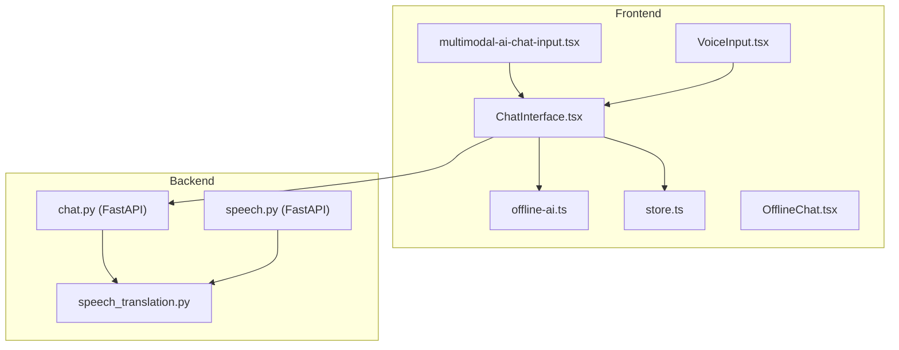
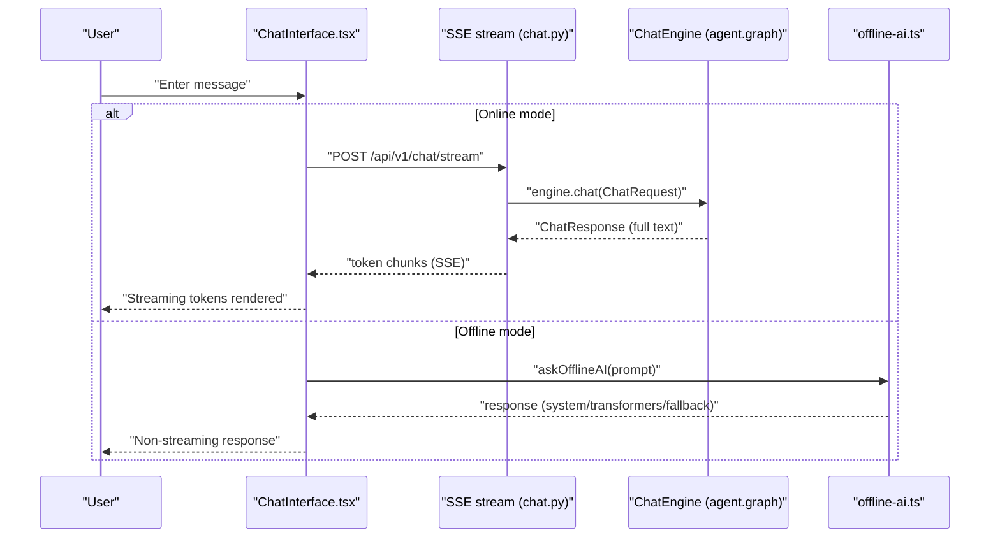
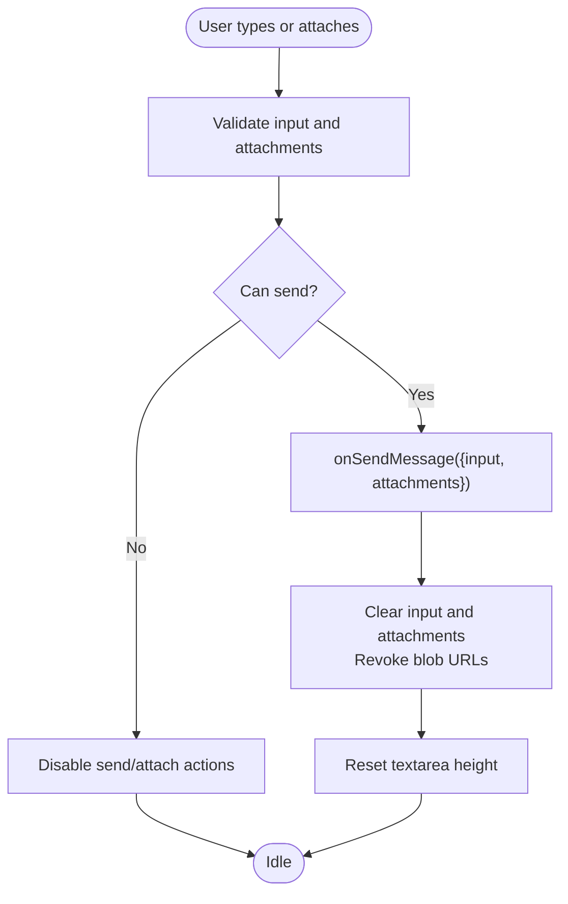
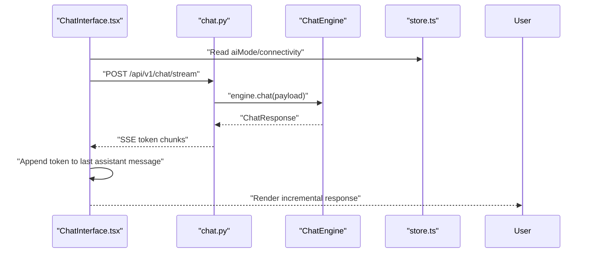
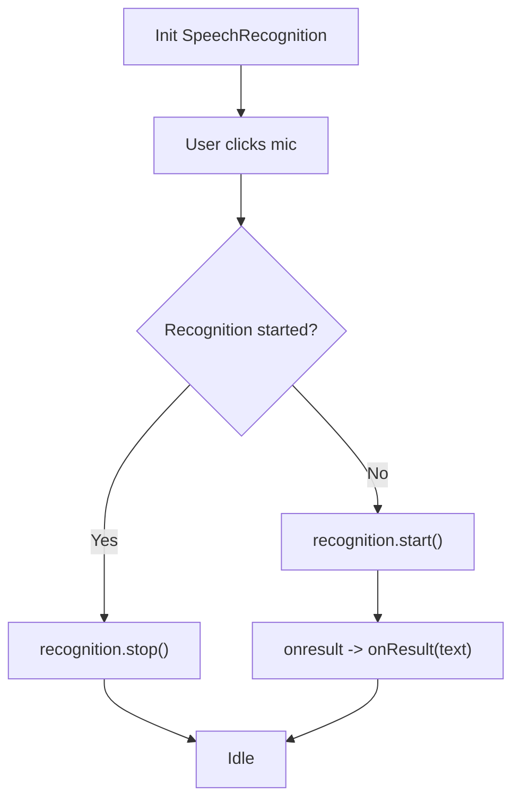
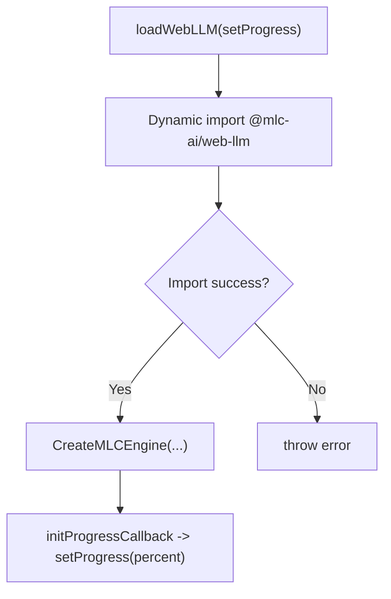
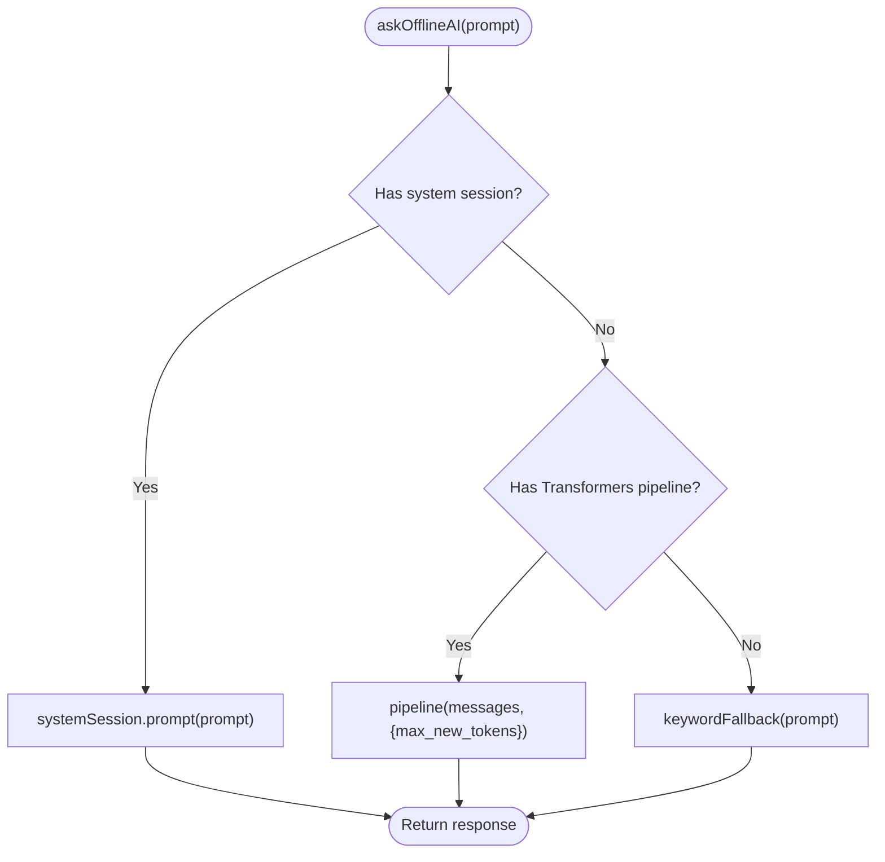
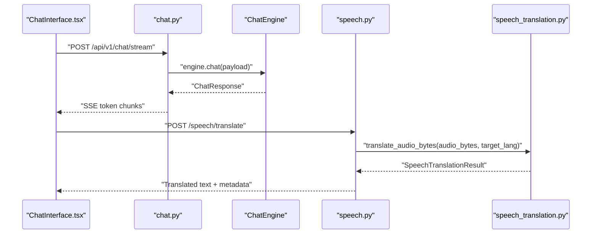
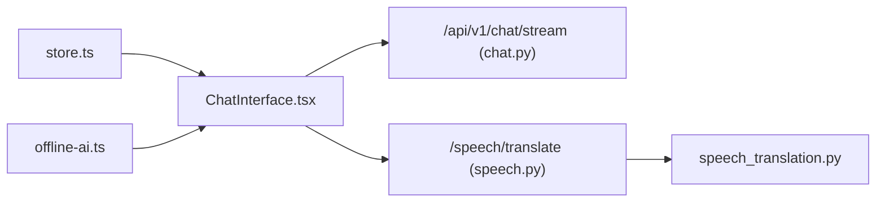

# Chat Components

<cite>
**Referenced Files in This Document**
- [multimodal-ai-chat-input.tsx](file://frontend/components/chat/multimodal-ai-chat-input.tsx)
- [ChatInterface.tsx](file://frontend/components/ChatInterface.tsx)
- [VoiceInput.tsx](file://frontend/components/VoiceInput.tsx)
- [OfflineChat.tsx](file://frontend/components/OfflineChat.tsx)
- [offline-ai.ts](file://frontend/lib/offline-ai.ts)
- [store.ts](file://frontend/lib/store.ts)
- [chat.py](file://chatbot_service/api/chat.py)
- [speech.py](file://chatbot_service/api/speech.py)
- [speech_translation.py](file://chatbot_service/services/speech_translation.py)
</cite>

## Table of Contents
1. [Introduction](#introduction)
2. [Project Structure](#project-structure)
3. [Core Components](#core-components)
4. [Architecture Overview](#architecture-overview)
5. [Detailed Component Analysis](#detailed-component-analysis)
6. [Dependency Analysis](#dependency-analysis)
7. [Performance Considerations](#performance-considerations)
8. [Troubleshooting Guide](#troubleshooting-guide)
9. [Conclusion](#conclusion)

## Introduction
This document explains the AI chat and communication components powering SafeVixAI’s conversational experiences. It covers:
- Multimodal chat input with attachments and voice affordances
- Real-time streaming chat with server-sent events
- Voice input using the Web Speech API
- Offline chat with browser-native AI engines and keyword fallback
- Integration patterns with the backend chatbot service
- Performance optimizations for real-time messaging and offline queues

## Project Structure
The chat system spans the frontend UI and libraries, and the backend chatbot service:
- Frontend UI components: multimodal input, chat interface, voice input, offline chat stub
- Frontend libraries: offline AI engine, global store for AI mode and connectivity
- Backend chatbot service: streaming chat endpoint, speech translation API

**Diagram sources**
- [ChatInterface.tsx:64-317](file://frontend/components/ChatInterface.tsx#L64-L317)
- [multimodal-ai-chat-input.tsx:274-524](file://frontend/components/chat/multimodal-ai-chat-input.tsx#L274-L524)
- [VoiceInput.tsx:48-145](file://frontend/components/VoiceInput.tsx#L48-L145)
- [offline-ai.ts:124-256](file://frontend/lib/offline-ai.ts#L124-L256)
- [store.ts:129-226](file://frontend/lib/store.ts#L129-L226)
- [OfflineChat.tsx:6-22](file://frontend/components/OfflineChat.tsx#L6-L22)
- [chat.py:28-97](file://chatbot_service/api/chat.py#L28-L97)
- [speech.py:34-77](file://chatbot_service/api/speech.py#L34-L77)
- [speech_translation.py:34-141](file://chatbot_service/services/speech_translation.py#L34-L141)

**Section sources**
- [ChatInterface.tsx:64-317](file://frontend/components/ChatInterface.tsx#L64-L317)
- [multimodal-ai-chat-input.tsx:274-524](file://frontend/components/chat/multimodal-ai-chat-input.tsx#L274-L524)
- [VoiceInput.tsx:48-145](file://frontend/components/VoiceInput.tsx#L48-L145)
- [offline-ai.ts:124-256](file://frontend/lib/offline-ai.ts#L124-L256)
- [store.ts:129-226](file://frontend/lib/store.ts#L129-L226)
- [OfflineChat.tsx:6-22](file://frontend/components/OfflineChat.tsx#L6-L22)
- [chat.py:28-97](file://chatbot_service/api/chat.py#L28-L97)
- [speech.py:34-77](file://chatbot_service/api/speech.py#L34-L77)
- [speech_translation.py:34-141](file://chatbot_service/services/speech_translation.py#L34-L141)

## Core Components
- Multimodal AI Chat Input: Rich text input with attachments preview, animated uploads, and send/stop controls. Supports Enter-to-send and controlled/uncontrolled modes.
- ChatInterface: Real-time chat with server-sent event streaming, online/offline mode switching, and offline fallback.
- VoiceInput: Web Speech API-based voice capture with recording state and graceful fallback.
- OfflineChat: Dynamic loader for WebLLM engine (stubbed in this repository).
- offline-ai: Browser-native offline AI engine with system AI (Chrome window.ai), Transformers.js Gemma 4 E2B, and keyword fallback.
- store: Zustand store managing AI mode, connectivity, and persisted preferences.

**Section sources**
- [multimodal-ai-chat-input.tsx:274-524](file://frontend/components/chat/multimodal-ai-chat-input.tsx#L274-L524)
- [ChatInterface.tsx:64-317](file://frontend/components/ChatInterface.tsx#L64-L317)
- [VoiceInput.tsx:48-145](file://frontend/components/VoiceInput.tsx#L48-L145)
- [OfflineChat.tsx:6-22](file://frontend/components/OfflineChat.tsx#L6-L22)
- [offline-ai.ts:124-256](file://frontend/lib/offline-ai.ts#L124-L256)
- [store.ts:129-226](file://frontend/lib/store.ts#L129-L226)

## Architecture Overview
SafeVixAI supports two chat modes:
- Online: Streams responses from the backend chatbot service using Server-Sent Events (SSE).
- Offline: Uses a browser-native offline AI engine with multiple fallback tiers.

**Diagram sources**
- [ChatInterface.tsx:104-162](file://frontend/components/ChatInterface.tsx#L104-L162)
- [chat.py:43-97](file://chatbot_service/api/chat.py#L43-L97)
- [offline-ai.ts:160-211](file://frontend/lib/offline-ai.ts#L160-L211)

## Detailed Component Analysis

### Multimodal AI Chat Input
- Purpose: Provide a rich input area supporting text, attachments, and voice affordances.
- Key behaviors:
  - Controlled/uncontrolled input handling via props/value/onChange
  - Animated attachment previews with upload queue and removal
  - Enter-to-submit with validation
  - Send/Stop buttons with disabled states during generation/upload
- Data structures:
  - Attachment: url, name, contentType, size
  - UIMessage: id, content, role, attachments?
- Integration hooks:
  - onSendMessage(params: { input, attachments })
  - onStopGenerating()

**Diagram sources**
- [multimodal-ai-chat-input.tsx:409-430](file://frontend/components/chat/multimodal-ai-chat-input.tsx#L409-L430)

**Section sources**
- [multimodal-ai-chat-input.tsx:274-524](file://frontend/components/chat/multimodal-ai-chat-input.tsx#L274-L524)

### ChatInterface
- Purpose: Central chat container with streaming SSE, online/offline mode, and message rendering.
- Real-time messaging:
  - streamChat() consumes /api/v1/chat/stream with token-by-token updates
  - Messages include role, content, optional sources, and streaming flag
- State management:
  - messages[], input, isLoading, sessionId
  - aiMode and connectivity from store
- Offline fallback:
  - getOfflineAI() initializes offline engine
  - askOfflineAI() generates response using system/transformers/fallback

**Diagram sources**
- [ChatInterface.tsx:25-61](file://frontend/components/ChatInterface.tsx#L25-L61)
- [chat.py:43-97](file://chatbot_service/api/chat.py#L43-L97)

**Section sources**
- [ChatInterface.tsx:64-317](file://frontend/components/ChatInterface.tsx#L64-L317)
- [store.ts:129-226](file://frontend/lib/store.ts#L129-L226)

### VoiceInput
- Purpose: Capture speech via Web Speech API and emit recognized text to parent.
- Behavior:
  - Initializes SpeechRecognition with English-India locale
  - Toggles start/stop on click
  - Graceful fallback for unsupported environments
- Integration:
  - onResult(text) callback to forward recognized text

**Diagram sources**
- [VoiceInput.tsx:48-145](file://frontend/components/VoiceInput.tsx#L48-L145)

**Section sources**
- [VoiceInput.tsx:48-145](file://frontend/components/VoiceInput.tsx#L48-L145)

### OfflineChat
- Purpose: Dynamically load WebLLM engine for offline chat.
- Behavior:
  - loadWebLLM(setProgress) attempts dynamic import of @mlc-ai/web-llm
  - Reports progress via setProgress(progress.progress * 100)
  - Propagates errors if model fails to load

**Diagram sources**
- [OfflineChat.tsx:6-22](file://frontend/components/OfflineChat.tsx#L6-L22)

**Section sources**
- [OfflineChat.tsx:6-22](file://frontend/components/OfflineChat.tsx#L6-L22)

### offline-ai Engine
- Purpose: Provide offline chat capabilities with multiple tiers.
- Strategy:
  1) Chrome window.ai (system) — zero download
  2) Transformers.js Gemma 4 E2B — downloaded and cached
  3) Keyword fallback — deterministic responses
- Methods:
  - getOfflineAI(onProgress?) — initialize and report status
  - askOfflineAI(prompt, audioBlob?) — generate response
  - isOfflineAIReady() — readiness check
  - getOfflineAIStatus() — current status

**Diagram sources**
- [offline-ai.ts:160-211](file://frontend/lib/offline-ai.ts#L160-L211)

**Section sources**
- [offline-ai.ts:124-256](file://frontend/lib/offline-ai.ts#L124-L256)

### Backend Chatbot Service Integration
- Streaming chat:
  - Endpoint: POST /api/v1/chat/stream
  - Emits token chunks and final done event with intent/sources/session_id
- Standard chat:
  - Endpoint: POST /api/v1/chat returns full response
- Speech translation:
  - Endpoint: POST /speech/translate accepts audio bytes and target language
  - Validates content type and size, resamples audio, runs translation

**Diagram sources**
- [chat.py:43-97](file://chatbot_service/api/chat.py#L43-L97)
- [speech.py:34-77](file://chatbot_service/api/speech.py#L34-L77)
- [speech_translation.py:61-107](file://chatbot_service/services/speech_translation.py#L61-L107)

**Section sources**
- [chat.py:28-97](file://chatbot_service/api/chat.py#L28-L97)
- [speech.py:34-77](file://chatbot_service/api/speech.py#L34-L77)
- [speech_translation.py:34-141](file://chatbot_service/services/speech_translation.py#L34-L141)

## Dependency Analysis
- Frontend UI depends on:
  - store.ts for aiMode and connectivity
  - offline-ai.ts for offline engine lifecycle and responses
  - backend APIs for streaming chat and speech translation
- Backend depends on:
  - ChatEngine for orchestration
  - Speech service for audio transcription/translation

**Diagram sources**
- [store.ts:129-226](file://frontend/lib/store.ts#L129-L226)
- [ChatInterface.tsx:64-317](file://frontend/components/ChatInterface.tsx#L64-L317)
- [offline-ai.ts:124-256](file://frontend/lib/offline-ai.ts#L124-L256)
- [chat.py:43-97](file://chatbot_service/api/chat.py#L43-L97)
- [speech.py:34-77](file://chatbot_service/api/speech.py#L34-L77)
- [speech_translation.py:34-141](file://chatbot_service/services/speech_translation.py#L34-L141)

**Section sources**
- [store.ts:129-226](file://frontend/lib/store.ts#L129-L226)
- [ChatInterface.tsx:64-317](file://frontend/components/ChatInterface.tsx#L64-L317)
- [offline-ai.ts:124-256](file://frontend/lib/offline-ai.ts#L124-L256)
- [chat.py:43-97](file://chatbot_service/api/chat.py#L43-L97)
- [speech.py:34-77](file://chatbot_service/api/speech.py#L34-L77)
- [speech_translation.py:34-141](file://chatbot_service/services/speech_translation.py#L34-L141)

## Performance Considerations
- Real-time streaming:
  - SSE streaming decouples latency from full response generation; UI renders incremental tokens for perceived responsiveness.
  - Tiny delays emulate natural reading pace; tune for UX balance.
- Attachment handling:
  - Simulated upload queue prevents concurrent submissions and disables send until uploads complete.
  - Blob URLs are revoked after submission to avoid memory leaks.
- Offline engine:
  - Prefer system AI (window.ai) when available to avoid large downloads.
  - Transformers.js caches models via browser cache storage; initialization is deferred until user confirms.
- Speech translation:
  - Validate content type and size early to fail fast.
  - Resample audio to 16 kHz and run inference in thread pool to avoid blocking the event loop.

[No sources needed since this section provides general guidance]

## Troubleshooting Guide
- Streaming errors:
  - ChatInterface catches stream errors and displays a user-friendly message; ensure backend endpoints are reachable and SSE headers are set.
- Voice input:
  - If SpeechRecognition is unavailable, VoiceInput falls back to a sample phrase; verify browser support and permissions.
- Offline AI:
  - If system AI is unavailable, Transformers.js download may fail due to network or device constraints; fallback to keyword responses is automatic.
- Speech translation:
  - Unsupported content type or oversized audio triggers HTTP 4xx/5xx; confirm allowed formats and size limits.

**Section sources**
- [ChatInterface.tsx:144-160](file://frontend/components/ChatInterface.tsx#L144-L160)
- [VoiceInput.tsx:95-108](file://frontend/components/VoiceInput.tsx#L95-L108)
- [offline-ai.ts:148-153](file://frontend/lib/offline-ai.ts#L148-L153)
- [speech.py:40-54](file://chatbot_service/api/speech.py#L40-L54)

## Conclusion
SafeVixAI’s chat components combine a flexible multimodal input, robust real-time streaming, and resilient offline capabilities. The frontend integrates tightly with the backend chatbot service for seamless online experiences and gracefully degrades to browser-native AI and keyword-based responses when offline. The architecture emphasizes user feedback, performance tuning, and clear fallbacks to maintain reliability across diverse environments.