# Component Library

<cite>
**Referenced Files in This Document**
- [EmergencyMap.tsx](file://frontend/components/EmergencyMap.tsx)
- [EmergencyMapInner.tsx](file://frontend/components/EmergencyMapInner.tsx)
- [DashboardMapBootstrap.tsx](file://frontend/components/dashboard/DashboardMapBootstrap.tsx)
- [MapBackgroundInner.tsx](file://frontend/components/dashboard/MapBackgroundInner.tsx)
- [MapLibreCanvas.tsx](file://frontend/components/maps/MapLibreCanvas.tsx)
- [ChatInterface.tsx](file://frontend/components/ChatInterface.tsx)
- [button.tsx](file://frontend/components/ui/button.tsx)
- [ReportForm.tsx](file://frontend/components/ReportForm.tsx)
- [FirstAidCard.tsx](file://frontend/components/FirstAidCard.tsx)
- [SystemSidebar.tsx](file://frontend/components/dashboard/SystemSidebar.tsx)
- [SystemHeader.tsx](file://frontend/components/dashboard/SystemHeader.tsx)
- [AuthorityCard.tsx](file://frontend/components/AuthorityCard.tsx)
- [SOSButton.tsx](file://frontend/components/SOSButton.tsx)
- [store.ts](file://frontend/lib/store.ts)
</cite>

## Table of Contents
1. [Introduction](#introduction)
2. [Project Structure](#project-structure)
3. [Core Components](#core-components)
4. [Architecture Overview](#architecture-overview)
5. [Detailed Component Analysis](#detailed-component-analysis)
6. [Dependency Analysis](#dependency-analysis)
7. [Performance Considerations](#performance-considerations)
8. [Troubleshooting Guide](#troubleshooting-guide)
9. [Conclusion](#conclusion)
10. [Appendices](#appendices)

## Introduction
This document describes the React component library architecture powering the SafeVixAI frontend. It focuses on component hierarchy, prop interfaces, composition patterns, state management, event handling, and integration points. Specialized components such as EmergencyMap, DashboardMapBootstrap, and ChatInterface are explained alongside reusable UI primitives like buttons, cards, and forms. Guidance is included for styling with Tailwind CSS, accessibility, reusability, prop validation, and performance optimization.

## Project Structure
The component library is organized by feature and domain:
- UI primitives: reusable building blocks under components/ui
- Domain-specific pages and views: components/dashboard, components/maps, components/chat, etc.
- Shared state: frontend/lib/store.ts
- Utilities and integrations: frontend/lib/* (geolocation, routing, offline, etc.)

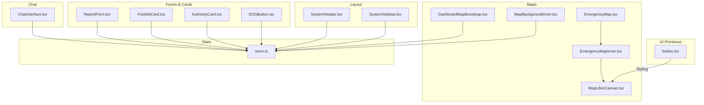

**Diagram sources**
- [DashboardMapBootstrap.tsx:77-330](file://frontend/components/dashboard/DashboardMapBootstrap.tsx#L77-L330)
- [MapBackgroundInner.tsx:88-169](file://frontend/components/dashboard/MapBackgroundInner.tsx#L88-L169)
- [EmergencyMap.tsx:25-58](file://frontend/components/EmergencyMap.tsx#L25-L58)
- [EmergencyMapInner.tsx:44-83](file://frontend/components/EmergencyMapInner.tsx#L44-L83)
- [MapLibreCanvas.tsx:300-800](file://frontend/components/maps/MapLibreCanvas.tsx#L300-L800)
- [ChatInterface.tsx:64-317](file://frontend/components/ChatInterface.tsx#L64-L317)
- [ReportForm.tsx:17-205](file://frontend/components/ReportForm.tsx#L17-L205)
- [FirstAidCard.tsx:23-121](file://frontend/components/FirstAidCard.tsx#L23-L121)
- [AuthorityCard.tsx:3-34](file://frontend/components/AuthorityCard.tsx#L3-L34)
- [SOSButton.tsx:13-126](file://frontend/components/SOSButton.tsx#L13-L126)
- [SystemHeader.tsx:16-170](file://frontend/components/dashboard/SystemHeader.tsx#L16-L170)
- [SystemSidebar.tsx:22-209](file://frontend/components/dashboard/SystemSidebar.tsx#L22-L209)
- [store.ts:129-226](file://frontend/lib/store.ts#L129-L226)

**Section sources**
- [EmergencyMap.tsx:1-58](file://frontend/components/EmergencyMap.tsx#L1-L58)
- [DashboardMapBootstrap.tsx:1-330](file://frontend/components/dashboard/DashboardMapBootstrap.tsx#L1-L330)
- [MapLibreCanvas.tsx:1-800](file://frontend/components/maps/MapLibreCanvas.tsx#L1-L800)
- [store.ts:1-226](file://frontend/lib/store.ts#L1-L226)

## Core Components
This section outlines the primary reusable components and their roles.

- Button primitive with variant and size variants for consistent styling and accessibility.
- Map subsystem: EmergencyMap and EmergencyMapInner wrap MapLibreCanvas for emergency-focused rendering.
- Dashboard map bootstrapper hydrates nearby services and road issues via API and offline fallbacks.
- Chat interface supporting online streaming and offline modes with connectivity awareness.
- Forms and cards for reporting hazards, first aid steps, authority info, and SOS actions.

**Section sources**
- [button.tsx:43-59](file://frontend/components/ui/button.tsx#L43-L59)
- [EmergencyMap.tsx:25-58](file://frontend/components/EmergencyMap.tsx#L25-L58)
- [EmergencyMapInner.tsx:44-83](file://frontend/components/EmergencyMapInner.tsx#L44-L83)
- [MapLibreCanvas.tsx:300-800](file://frontend/components/maps/MapLibreCanvas.tsx#L300-L800)
- [DashboardMapBootstrap.tsx:77-330](file://frontend/components/dashboard/DashboardMapBootstrap.tsx#L77-L330)
- [ChatInterface.tsx:64-317](file://frontend/components/ChatInterface.tsx#L64-L317)
- [ReportForm.tsx:17-205](file://frontend/components/ReportForm.tsx#L17-L205)
- [FirstAidCard.tsx:23-121](file://frontend/components/FirstAidCard.tsx#L23-L121)
- [AuthorityCard.tsx:3-34](file://frontend/components/AuthorityCard.tsx#L3-L34)
- [SOSButton.tsx:13-126](file://frontend/components/SOSButton.tsx#L13-L126)

## Architecture Overview
The component library follows a layered architecture:
- Primitive UI components (e.g., Button) provide consistent styling and behavior.
- Feature components (e.g., EmergencyMap, ChatInterface) orchestrate data fetching, state updates, and rendering.
- Map components encapsulate MapLibre integration and rendering logic.
- State management is centralized in Zustand store with persistence for user preferences.

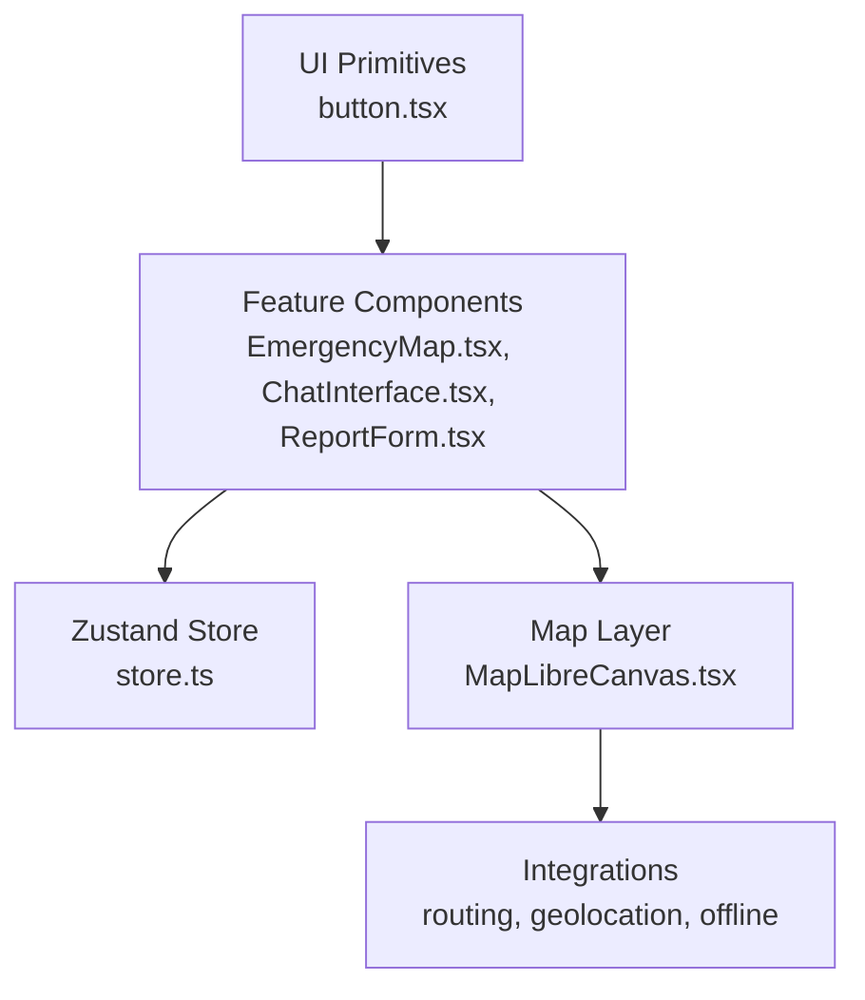

**Diagram sources**
- [button.tsx:43-59](file://frontend/components/ui/button.tsx#L43-L59)
- [EmergencyMap.tsx:25-58](file://frontend/components/EmergencyMap.tsx#L25-L58)
- [ChatInterface.tsx:64-317](file://frontend/components/ChatInterface.tsx#L64-L317)
- [ReportForm.tsx:17-205](file://frontend/components/ReportForm.tsx#L17-L205)
- [MapLibreCanvas.tsx:300-800](file://frontend/components/maps/MapLibreCanvas.tsx#L300-L800)
- [store.ts:129-226](file://frontend/lib/store.ts#L129-L226)

## Detailed Component Analysis

### EmergencyMap and EmergencyMapInner
EmergencyMap is a client-side dynamic import wrapper around EmergencyMapInner, ensuring server-side stability. EmergencyMapInner converts normalized facility data into MapLibre-friendly shapes and delegates rendering to MapLibreCanvas.

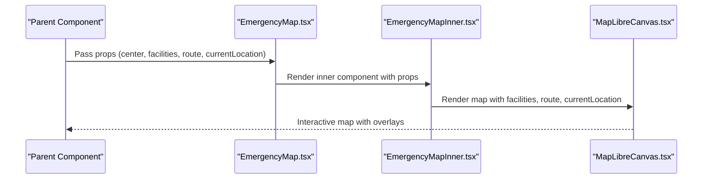

**Diagram sources**
- [EmergencyMap.tsx:25-58](file://frontend/components/EmergencyMap.tsx#L25-L58)
- [EmergencyMapInner.tsx:44-83](file://frontend/components/EmergencyMapInner.tsx#L44-L83)
- [MapLibreCanvas.tsx:300-800](file://frontend/components/maps/MapLibreCanvas.tsx#L300-L800)

**Section sources**
- [EmergencyMap.tsx:1-58](file://frontend/components/EmergencyMap.tsx#L1-L58)
- [EmergencyMapInner.tsx:1-83](file://frontend/components/EmergencyMapInner.tsx#L1-L83)
- [MapLibreCanvas.tsx:300-800](file://frontend/components/maps/MapLibreCanvas.tsx#L300-L800)

### DashboardMapBootstrap
This component orchestrates hydration of nearby services and road issues, handles connectivity transitions, and normalizes data for downstream consumers.

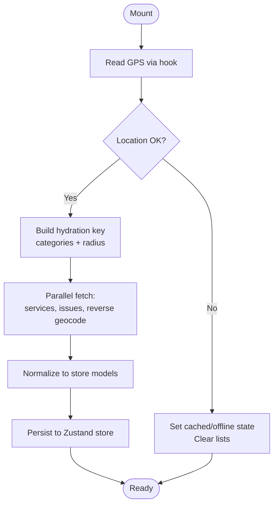

**Diagram sources**
- [DashboardMapBootstrap.tsx:77-330](file://frontend/components/dashboard/DashboardMapBootstrap.tsx#L77-L330)
- [store.ts:129-226](file://frontend/lib/store.ts#L129-L226)

**Section sources**
- [DashboardMapBootstrap.tsx:1-330](file://frontend/components/dashboard/DashboardMapBootstrap.tsx#L1-L330)
- [store.ts:1-226](file://frontend/lib/store.ts#L1-L226)

### MapBackgroundInner
Renders a live map background using MapLibreCanvas, mapping nearby services and road issues to visual markers with appropriate icons and colors.

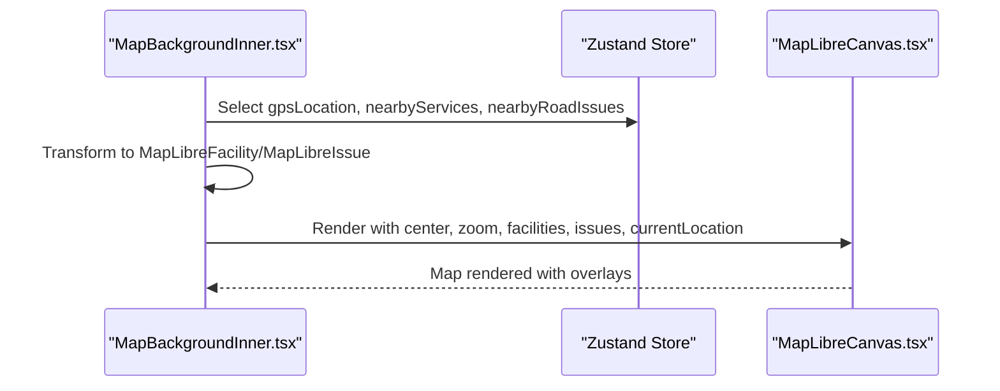

**Diagram sources**
- [MapBackgroundInner.tsx:88-169](file://frontend/components/dashboard/MapBackgroundInner.tsx#L88-L169)
- [MapLibreCanvas.tsx:300-800](file://frontend/components/maps/MapLibreCanvas.tsx#L300-L800)
- [store.ts:129-226](file://frontend/lib/store.ts#L129-L226)

**Section sources**
- [MapBackgroundInner.tsx:1-169](file://frontend/components/dashboard/MapBackgroundInner.tsx#L1-L169)
- [MapLibreCanvas.tsx:300-800](file://frontend/components/maps/MapLibreCanvas.tsx#L300-L800)
- [store.ts:1-226](file://frontend/lib/store.ts#L1-L226)

### ChatInterface
Implements a dual-mode chat with online streaming and offline AI. It manages message lifecycle, SSE streaming, and UI feedback.

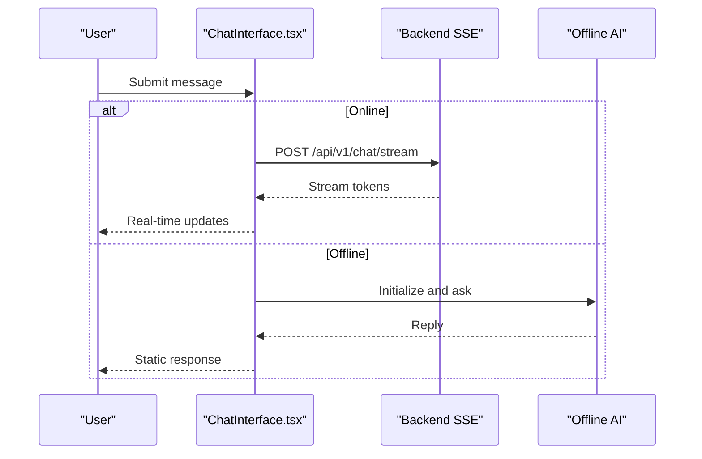

**Diagram sources**
- [ChatInterface.tsx:64-317](file://frontend/components/ChatInterface.tsx#L64-L317)

**Section sources**
- [ChatInterface.tsx:1-317](file://frontend/components/ChatInterface.tsx#L1-L317)

### ReportForm
Multi-step form for reporting road hazards with validation, photo constraints, and offline submission support.

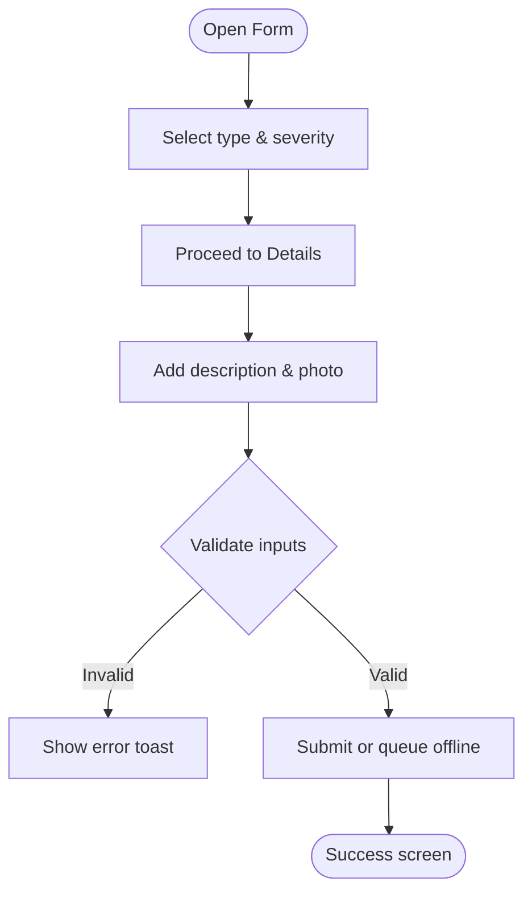

**Diagram sources**
- [ReportForm.tsx:17-205](file://frontend/components/ReportForm.tsx#L17-L205)

**Section sources**
- [ReportForm.tsx:1-205](file://frontend/components/ReportForm.tsx#L1-L205)

### FirstAidCard
Displays first aid steps with bold-marked emphasis and offline badge.

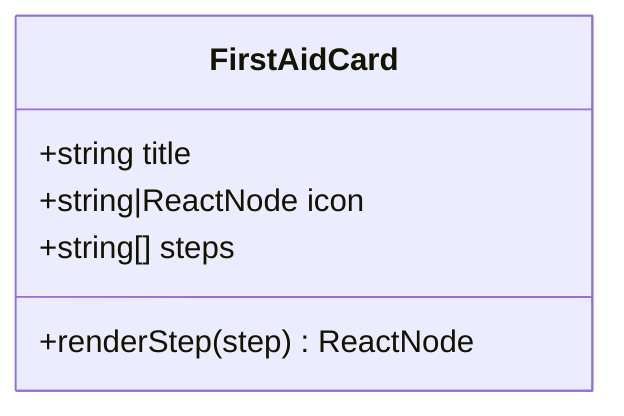

**Diagram sources**
- [FirstAidCard.tsx:23-121](file://frontend/components/FirstAidCard.tsx#L23-L121)

**Section sources**
- [FirstAidCard.tsx:1-121](file://frontend/components/FirstAidCard.tsx#L1-L121)

### AuthorityCard
Displays assigned authority information with SLA.

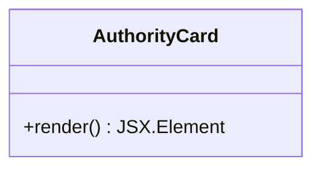

**Diagram sources**
- [AuthorityCard.tsx:3-34](file://frontend/components/AuthorityCard.tsx#L3-L34)

**Section sources**
- [AuthorityCard.tsx:1-34](file://frontend/components/AuthorityCard.tsx#L1-L34)

### SOSButton
Interactive emergency trigger with confirmation overlay and sharing options.

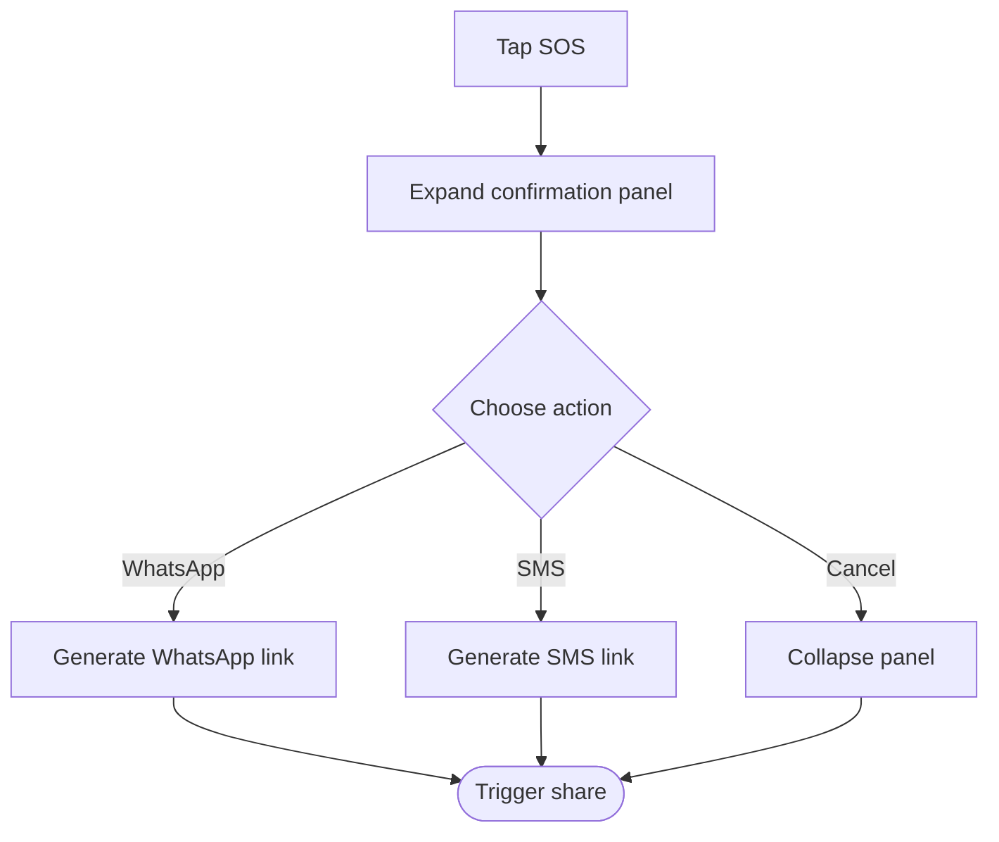

**Diagram sources**
- [SOSButton.tsx:13-126](file://frontend/components/SOSButton.tsx#L13-L126)

**Section sources**
- [SOSButton.tsx:1-126](file://frontend/components/SOSButton.tsx#L1-L126)

### SystemHeader and SystemSidebar
Provide desktop/global header controls and mobile sidebar navigation with animated entrance and persistent state.

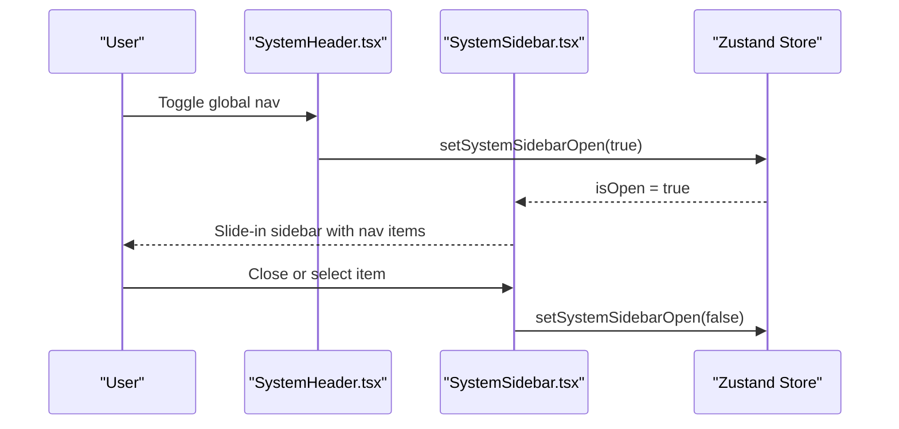

**Diagram sources**
- [SystemHeader.tsx:16-170](file://frontend/components/dashboard/SystemHeader.tsx#L16-L170)
- [SystemSidebar.tsx:22-209](file://frontend/components/dashboard/SystemSidebar.tsx#L22-L209)
- [store.ts:129-226](file://frontend/lib/store.ts#L129-L226)

**Section sources**
- [SystemHeader.tsx:1-170](file://frontend/components/dashboard/SystemHeader.tsx#L1-L170)
- [SystemSidebar.tsx:1-209](file://frontend/components/dashboard/SystemSidebar.tsx#L1-L209)
- [store.ts:1-226](file://frontend/lib/store.ts#L1-L226)

### Button Primitive
Provides variant and size variants with Tailwind-based styling and accessibility attributes.

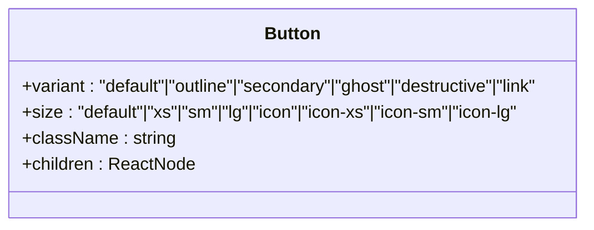

**Diagram sources**
- [button.tsx:43-59](file://frontend/components/ui/button.tsx#L43-L59)

**Section sources**
- [button.tsx:1-59](file://frontend/components/ui/button.tsx#L1-L59)

## Dependency Analysis
Component dependencies are primarily driven by:
- Zustand store for shared state (GPS, nearby services/issues, AI mode, connectivity)
- MapLibreCanvas for map rendering and overlays
- Dynamic imports for client-only map components
- Utility hooks/services for geolocation and offline capabilities

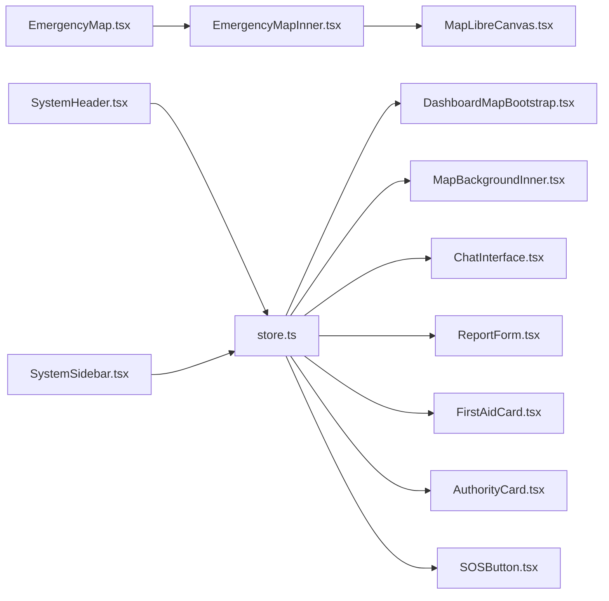

**Diagram sources**
- [store.ts:129-226](file://frontend/lib/store.ts#L129-L226)
- [DashboardMapBootstrap.tsx:77-330](file://frontend/components/dashboard/DashboardMapBootstrap.tsx#L77-L330)
- [MapBackgroundInner.tsx:88-169](file://frontend/components/dashboard/MapBackgroundInner.tsx#L88-L169)
- [ChatInterface.tsx:64-317](file://frontend/components/ChatInterface.tsx#L64-L317)
- [ReportForm.tsx:17-205](file://frontend/components/ReportForm.tsx#L17-L205)
- [FirstAidCard.tsx:23-121](file://frontend/components/FirstAidCard.tsx#L23-L121)
- [AuthorityCard.tsx:3-34](file://frontend/components/AuthorityCard.tsx#L3-L34)
- [SOSButton.tsx:13-126](file://frontend/components/SOSButton.tsx#L13-L126)
- [EmergencyMap.tsx:25-58](file://frontend/components/EmergencyMap.tsx#L25-L58)
- [EmergencyMapInner.tsx:44-83](file://frontend/components/EmergencyMapInner.tsx#L44-L83)
- [MapLibreCanvas.tsx:300-800](file://frontend/components/maps/MapLibreCanvas.tsx#L300-L800)
- [SystemHeader.tsx:16-170](file://frontend/components/dashboard/SystemHeader.tsx#L16-L170)
- [SystemSidebar.tsx:22-209](file://frontend/components/dashboard/SystemSidebar.tsx#L22-L209)

**Section sources**
- [store.ts:1-226](file://frontend/lib/store.ts#L1-L226)
- [MapLibreCanvas.tsx:300-800](file://frontend/components/maps/MapLibreCanvas.tsx#L300-L800)

## Performance Considerations
- Lazy loading: EmergencyMap uses dynamic imports to avoid SSR overhead.
- Memoization: useMemo for derived map datasets and hydration keys prevents unnecessary recalculations.
- Parallel hydration: Promise.allSettled for services, issues, and reverse geocoding reduces total latency.
- Conditional rendering: Map overlays are added only when data is present.
- Animations: Motion animations are scoped to minimize layout thrashing.
- Offline-first: ReportForm queues submissions locally to improve resilience.

[No sources needed since this section provides general guidance]

## Troubleshooting Guide
- Map initialization failures: The map gracefully falls back through configured styles and surfaces an error state when all styles fail.
- Connectivity issues: DashboardMapBootstrap sets connectivity to cached/offline when location is unavailable and clears lists accordingly.
- Chat errors: ChatInterface displays a user-friendly message when streaming fails and preserves previous messages.
- Photo validation: ReportForm enforces size and MIME-type constraints and shows toast notifications.

**Section sources**
- [MapLibreCanvas.tsx:441-474](file://frontend/components/maps/MapLibreCanvas.tsx#L441-L474)
- [DashboardMapBootstrap.tsx:131-158](file://frontend/components/dashboard/DashboardMapBootstrap.tsx#L131-L158)
- [ChatInterface.tsx:144-158](file://frontend/components/ChatInterface.tsx#L144-L158)
- [ReportForm.tsx:28-38](file://frontend/components/ReportForm.tsx#L28-L38)

## Conclusion
The component library emphasizes composability, resilience, and a consistent design system. Map components encapsulate complex rendering logic, while the Zustand store centralizes cross-cutting concerns. UI primitives and feature components follow predictable patterns for styling, accessibility, and performance.

[No sources needed since this section summarizes without analyzing specific files]

## Appendices

### Prop Interfaces Summary
- EmergencyMap props: center, facilities, optional route, alternativeRoutes, currentLocation, selectedFacilityId
- EmergencyMapInner props: center, facilities, optional route, alternativeRoutes, currentLocation, selectedFacilityId
- MapLibreCanvas props: center, zoom, facilities, issues, currentLocation, route, alternativeRoutes, selectedFacilityId, viewportMode, navigationPosition, className
- ChatInterface: no props; reads aiMode and location from store
- ReportForm: no props; uses store for GPS and connectivity
- FirstAidCard: title, icon, steps
- AuthorityCard: no props
- SOSButton: no props; uses store for userProfile and gpsLocation
- SystemHeader: title, showBack, backHref, isOnlineInitial
- SystemSidebar: no props; controlled by store state

**Section sources**
- [EmergencyMap.tsx:25-58](file://frontend/components/EmergencyMap.tsx#L25-L58)
- [EmergencyMapInner.tsx:35-42](file://frontend/components/EmergencyMapInner.tsx#L35-L42)
- [MapLibreCanvas.tsx:155-167](file://frontend/components/maps/MapLibreCanvas.tsx#L155-L167)
- [ChatInterface.tsx:64-317](file://frontend/components/ChatInterface.tsx#L64-L317)
- [ReportForm.tsx:17-205](file://frontend/components/ReportForm.tsx#L17-L205)
- [FirstAidCard.tsx:5-9](file://frontend/components/FirstAidCard.tsx#L5-L9)
- [AuthorityCard.tsx:3-34](file://frontend/components/AuthorityCard.tsx#L3-L34)
- [SOSButton.tsx:13-126](file://frontend/components/SOSButton.tsx#L13-L126)
- [SystemHeader.tsx:9-21](file://frontend/components/dashboard/SystemHeader.tsx#L9-L21)
- [SystemSidebar.tsx:22-209](file://frontend/components/dashboard/SystemSidebar.tsx#L22-L209)

### Styling with Tailwind CSS
- Use className consistently for layout and theming.
- Leverage CSS variables for theme-aware colors and spacing.
- Prefer component variants for consistent sizing and typography.

[No sources needed since this section provides general guidance]

### Accessibility Best Practices
- Provide aria-labels for interactive elements.
- Manage focus states and keyboard navigation.
- Announce loading and error states to assistive technologies.

[No sources needed since this section provides general guidance]