# Dashboard Components

<cite>
**Referenced Files in This Document**
- [BottomNav.tsx](file://frontend/components/dashboard/BottomNav.tsx)
- [DashboardMapBootstrap.tsx](file://frontend/components/dashboard/DashboardMapBootstrap.tsx)
- [ProfileCard.tsx](file://frontend/components/dashboard/ProfileCard.tsx)
- [SystemHeader.tsx](file://frontend/components/dashboard/SystemHeader.tsx)
- [SystemSidebar.tsx](file://frontend/components/dashboard/SystemSidebar.tsx)
- [ThreeDrivingScore.tsx](file://frontend/components/dashboard/ThreeDrivingScore.tsx)
- [FloatingSidebarControls.tsx](file://frontend/components/dashboard/FloatingSidebarControls.tsx)
- [MapBackgroundInner.tsx](file://frontend/components/dashboard/MapBackgroundInner.tsx)
- [RecentAlertsOverlay.tsx](file://frontend/components/dashboard/RecentAlertsOverlay.tsx)
- [TopSearch.tsx](file://frontend/components/dashboard/TopSearch.tsx)
- [store.ts](file://frontend/lib/store.ts)
</cite>

## Table of Contents
1. [Introduction](#introduction)
2. [Project Structure](#project-structure)
3. [Core Components](#core-components)
4. [Architecture Overview](#architecture-overview)
5. [Detailed Component Analysis](#detailed-component-analysis)
6. [Dependency Analysis](#dependency-analysis)
7. [Performance Considerations](#performance-considerations)
8. [Troubleshooting Guide](#troubleshooting-guide)
9. [Conclusion](#conclusion)

## Introduction
This document focuses on dashboard-specific components responsible for application navigation, data visualization, and UI orchestration. It covers BottomNav, DashboardMapBootstrap, ProfileCard, SystemHeader, SystemSidebar, and ThreeDrivingScore. The guide explains state management via a centralized store, data binding patterns, integration with the overall dashboard layout, component composition, event handling, responsive design, and performance considerations for real-time data and interactive maps.

## Project Structure
The dashboard components reside under the frontend components dashboard directory and integrate with shared libraries and stores. The store encapsulates global state for GPS, nearby services/issues, UI toggles, and connectivity.

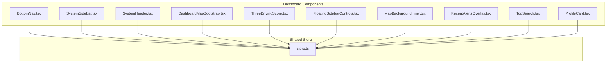

**Diagram sources**
- [BottomNav.tsx:1-103](file://frontend/components/dashboard/BottomNav.tsx#L1-L103)
- [SystemSidebar.tsx:1-209](file://frontend/components/dashboard/SystemSidebar.tsx#L1-L209)
- [SystemHeader.tsx:1-170](file://frontend/components/dashboard/SystemHeader.tsx#L1-L170)
- [DashboardMapBootstrap.tsx:1-330](file://frontend/components/dashboard/DashboardMapBootstrap.tsx#L1-L330)
- [ThreeDrivingScore.tsx:1-68](file://frontend/components/dashboard/ThreeDrivingScore.tsx#L1-L68)
- [FloatingSidebarControls.tsx:1-212](file://frontend/components/dashboard/FloatingSidebarControls.tsx#L1-L212)
- [MapBackgroundInner.tsx:1-169](file://frontend/components/dashboard/MapBackgroundInner.tsx#L1-L169)
- [RecentAlertsOverlay.tsx:1-100](file://frontend/components/dashboard/RecentAlertsOverlay.tsx#L1-L100)
- [TopSearch.tsx:1-280](file://frontend/components/dashboard/TopSearch.tsx#L1-L280)
- [ProfileCard.tsx:1-48](file://frontend/components/dashboard/ProfileCard.tsx#L1-L48)
- [store.ts:1-226](file://frontend/lib/store.ts#L1-L226)

**Section sources**
- [BottomNav.tsx:1-103](file://frontend/components/dashboard/BottomNav.tsx#L1-L103)
- [SystemSidebar.tsx:1-209](file://frontend/components/dashboard/SystemSidebar.tsx#L1-L209)
- [SystemHeader.tsx:1-170](file://frontend/components/dashboard/SystemHeader.tsx#L1-L170)
- [DashboardMapBootstrap.tsx:1-330](file://frontend/components/dashboard/DashboardMapBootstrap.tsx#L1-L330)
- [ThreeDrivingScore.tsx:1-68](file://frontend/components/dashboard/ThreeDrivingScore.tsx#L1-L68)
- [FloatingSidebarControls.tsx:1-212](file://frontend/components/dashboard/FloatingSidebarControls.tsx#L1-L212)
- [MapBackgroundInner.tsx:1-169](file://frontend/components/dashboard/MapBackgroundInner.tsx#L1-L169)
- [RecentAlertsOverlay.tsx:1-100](file://frontend/components/dashboard/RecentAlertsOverlay.tsx#L1-L100)
- [TopSearch.tsx:1-280](file://frontend/components/dashboard/TopSearch.tsx#L1-L280)
- [ProfileCard.tsx:1-48](file://frontend/components/dashboard/ProfileCard.tsx#L1-L48)
- [store.ts:1-226](file://frontend/lib/store.ts#L1-L226)

## Core Components
- BottomNav: Mobile-first navigation bar with animated active indicator and haptic feedback.
- DashboardMapBootstrap: Hydration pipeline for nearby services, road issues, and reverse geocoding; manages connectivity and search radius fallbacks.
- ProfileCard: Static profile card with identity and quick stats.
- SystemHeader: Desktop header with search, online/offline toggle, theme switching, and operator badge.
- SystemSidebar: Animated sidebar overlay with navigation grid, quick dial, and SOS action.
- ThreeDrivingScore: 3D driving score visualization using @react-three/fiber.

**Section sources**
- [BottomNav.tsx:1-103](file://frontend/components/dashboard/BottomNav.tsx#L1-L103)
- [DashboardMapBootstrap.tsx:1-330](file://frontend/components/dashboard/DashboardMapBootstrap.tsx#L1-L330)
- [ProfileCard.tsx:1-48](file://frontend/components/dashboard/ProfileCard.tsx#L1-L48)
- [SystemHeader.tsx:1-170](file://frontend/components/dashboard/SystemHeader.tsx#L1-L170)
- [SystemSidebar.tsx:1-209](file://frontend/components/dashboard/SystemSidebar.tsx#L1-L209)
- [ThreeDrivingScore.tsx:1-68](file://frontend/components/dashboard/ThreeDrivingScore.tsx#L1-L68)

## Architecture Overview
The dashboard orchestrates navigation, map rendering, and real-time data through a central Zustand store. Components subscribe to store slices and dispatch actions to update state. Event-driven communication is used for location refresh and map fly-to operations.

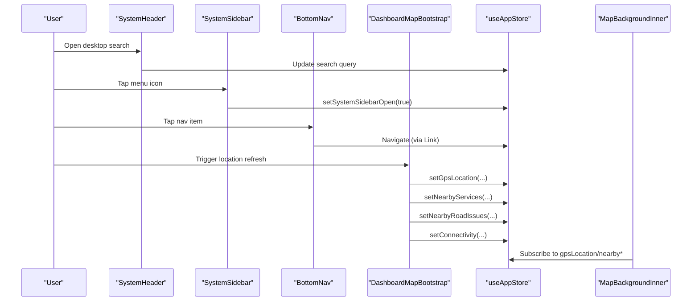

**Diagram sources**
- [SystemHeader.tsx:1-170](file://frontend/components/dashboard/SystemHeader.tsx#L1-L170)
- [SystemSidebar.tsx:1-209](file://frontend/components/dashboard/SystemSidebar.tsx#L1-L209)
- [BottomNav.tsx:1-103](file://frontend/components/dashboard/BottomNav.tsx#L1-L103)
- [DashboardMapBootstrap.tsx:1-330](file://frontend/components/dashboard/DashboardMapBootstrap.tsx#L1-L330)
- [MapBackgroundInner.tsx:1-169](file://frontend/components/dashboard/MapBackgroundInner.tsx#L1-L169)
- [store.ts:1-226](file://frontend/lib/store.ts#L1-L226)

## Detailed Component Analysis

### BottomNav
- Purpose: Mobile navigation with animated active indicator and pill highlight.
- State management: Uses pathname to compute active index; applies layoutId animations for smooth transitions.
- Interaction: Vibrates on tap for haptic feedback; integrates with Next.js Link for navigation.
- Responsive design: Fixed bottom center layout with media-query hiding on small heights.

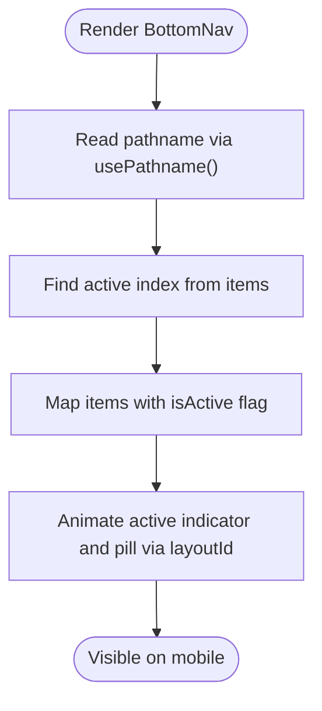

**Diagram sources**
- [BottomNav.tsx:24-100](file://frontend/components/dashboard/BottomNav.tsx#L24-L100)

**Section sources**
- [BottomNav.tsx:1-103](file://frontend/components/dashboard/BottomNav.tsx#L1-L103)

### DashboardMapBootstrap
- Purpose: Hydrate map-related data and manage connectivity.
- Data binding: Reads location, service category/radius, and writes nearby services, road issues, and geocoded location.
- Real-time behavior: Listens to online/offline events and a custom refresh event to rehydrate data.
- Fallback strategy: Iterative radius attempts to maximize results; sets connectivity to cached/offline when network fails.
- Reverse geocoding: Updates city/state/display name from GPS coordinates.

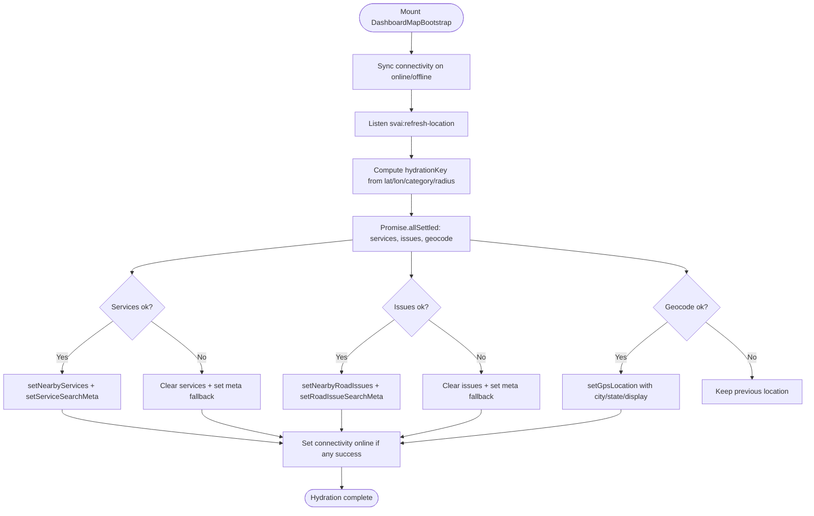

**Diagram sources**
- [DashboardMapBootstrap.tsx:104-326](file://frontend/components/dashboard/DashboardMapBootstrap.tsx#L104-L326)
- [store.ts:63-127](file://frontend/lib/store.ts#L63-L127)

**Section sources**
- [DashboardMapBootstrap.tsx:1-330](file://frontend/components/dashboard/DashboardMapBootstrap.tsx#L1-L330)
- [store.ts:1-226](file://frontend/lib/store.ts#L1-L226)

### ProfileCard
- Purpose: Display operator identity and quick stats.
- Composition: Uses Next.js Image for avatar with hover scaling; renders static stats in a grid.
- Accessibility: Proper alt text and semantic markup.

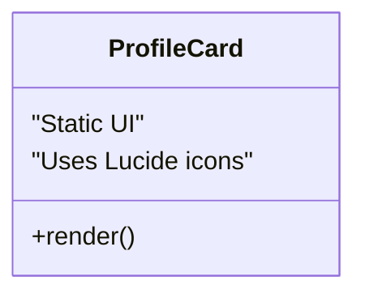

**Diagram sources**
- [ProfileCard.tsx:5-47](file://frontend/components/dashboard/ProfileCard.tsx#L5-L47)

**Section sources**
- [ProfileCard.tsx:1-48](file://frontend/components/dashboard/ProfileCard.tsx#L1-L48)

### SystemHeader
- Purpose: Desktop header with search, online/offline controls, theme switcher, and operator badge.
- State management: Tracks online/offline state and exposes theme setter via ThemeProvider.
- Interaction: Form submission is currently a stub; menu button toggles sidebar.

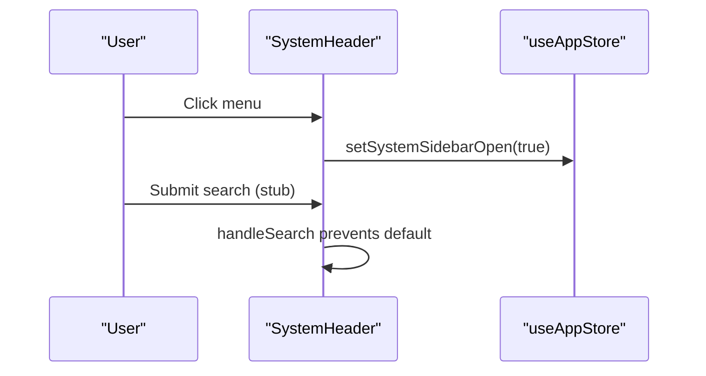

**Diagram sources**
- [SystemHeader.tsx:46-51](file://frontend/components/dashboard/SystemHeader.tsx#L46-L51)
- [store.ts:107-111](file://frontend/lib/store.ts#L107-L111)

**Section sources**
- [SystemHeader.tsx:1-170](file://frontend/components/dashboard/SystemHeader.tsx#L1-L170)
- [store.ts:107-111](file://frontend/lib/store.ts#L107-L111)

### SystemSidebar
- Purpose: Animated sidebar overlay with navigation grid, quick dial, and SOS action.
- State management: Controlled by isSystemSidebarOpen; computes active item from pathname.
- Animation: Uses AnimatePresence and motion variants for staggered entrance/exit.

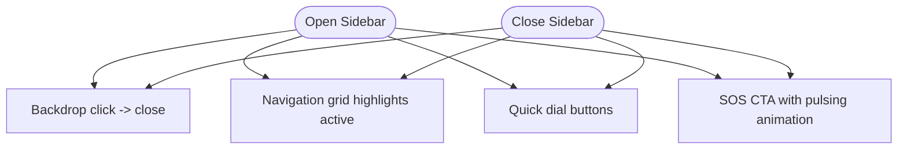

**Diagram sources**
- [SystemSidebar.tsx:63-204](file://frontend/components/dashboard/SystemSidebar.tsx#L63-L204)

**Section sources**
- [SystemSidebar.tsx:1-209](file://frontend/components/dashboard/SystemSidebar.tsx#L1-L209)

### ThreeDrivingScore
- Purpose: 3D visualization of driving score with animated torus ring and emissive material.
- Data binding: Accepts score prop; calculates arc length and color based on score thresholds.
- Performance: Uses @react-three/fiber with minimal per-frame work; rotation and subtle float motion.

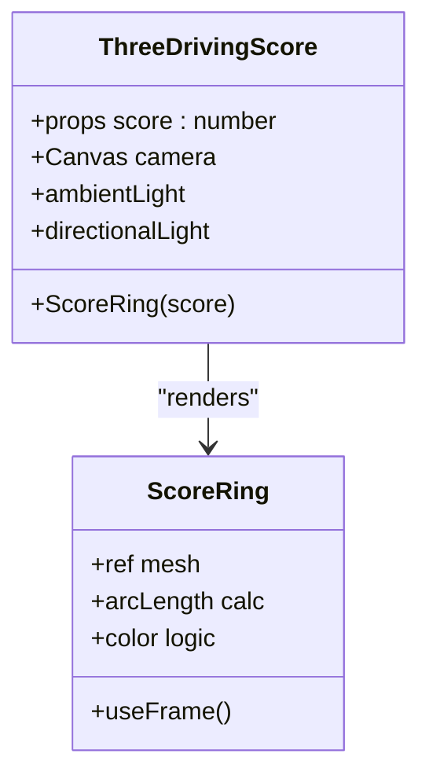

**Diagram sources**
- [ThreeDrivingScore.tsx:50-67](file://frontend/components/dashboard/ThreeDrivingScore.tsx#L50-L67)

**Section sources**
- [ThreeDrivingScore.tsx:1-68](file://frontend/components/dashboard/ThreeDrivingScore.tsx#L1-L68)

### FloatingSidebarControls
- Purpose: Floating HUD with driving score gauge, relocate button, emergency protocols, and SOS.
- State management: Reads drivingScore from store; dispatches custom event to refresh location.
- UX: Scanning overlay animation during relocation; haptic feedback on SOS press.

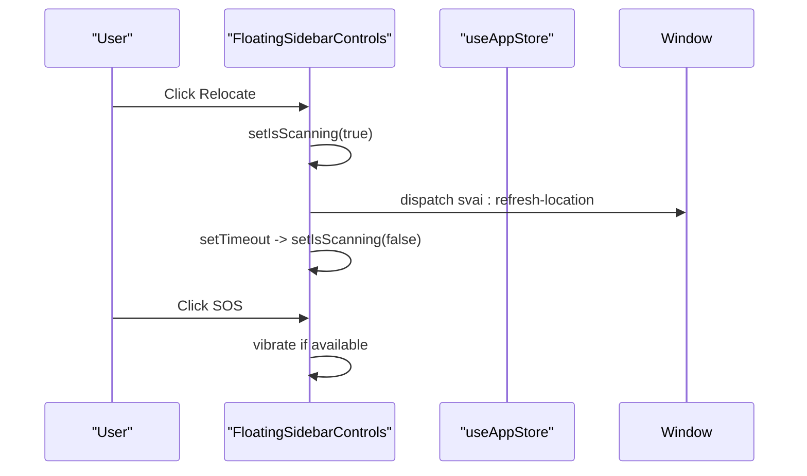

**Diagram sources**
- [FloatingSidebarControls.tsx:132-211](file://frontend/components/dashboard/FloatingSidebarControls.tsx#L132-L211)

**Section sources**
- [FloatingSidebarControls.tsx:1-212](file://frontend/components/dashboard/FloatingSidebarControls.tsx#L1-L212)

### MapBackgroundInner
- Purpose: Renders MapLibre canvas with facilities and issues; displays location badges.
- Data binding: Converts store arrays to typed props for MapLibreCanvas.
- Responsiveness: Shows actionable messages when location is unavailable or approximate.

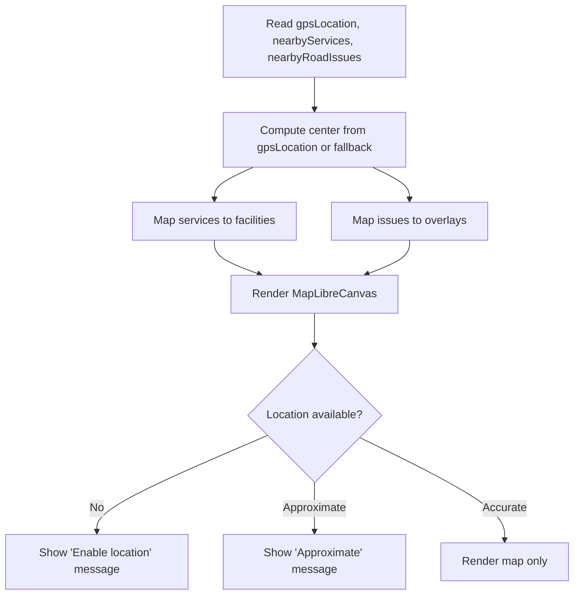

**Diagram sources**
- [MapBackgroundInner.tsx:88-168](file://frontend/components/dashboard/MapBackgroundInner.tsx#L88-L168)

**Section sources**
- [MapBackgroundInner.tsx:1-169](file://frontend/components/dashboard/MapBackgroundInner.tsx#L1-L169)

### RecentAlertsOverlay
- Purpose: Floating alert chips summarizing nearby road issues with severity-based visuals.
- Data binding: Subscribes to nearbyRoadIssues and isDesktopSidebarCollapsed to adjust horizontal padding.
- Interaction: Chips are clickable; shows summary pulse dot and labels.

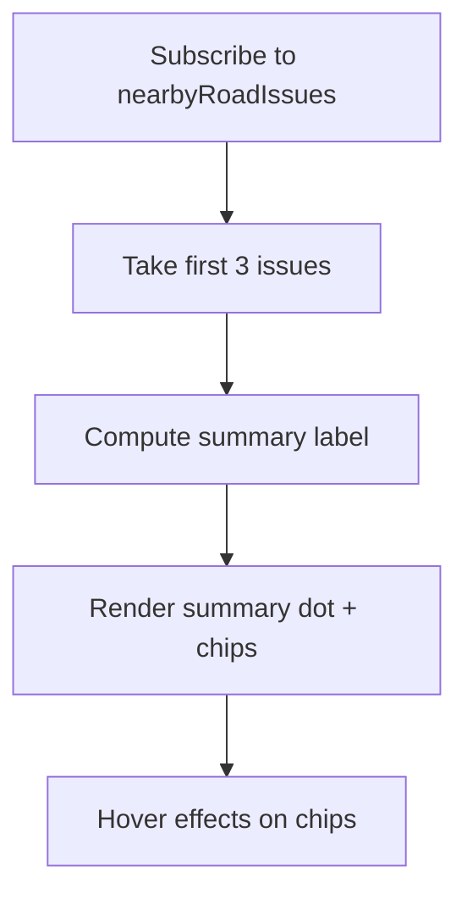

**Diagram sources**
- [RecentAlertsOverlay.tsx:47-99](file://frontend/components/dashboard/RecentAlertsOverlay.tsx#L47-L99)

**Section sources**
- [RecentAlertsOverlay.tsx:1-100](file://frontend/components/dashboard/RecentAlertsOverlay.tsx#L1-L100)

### TopSearch
- Purpose: Floating Google Maps-style search bar with autocomplete, location badge, and category chips.
- Data binding: Uses store for gpsLocation, serviceCategory; dispatches fly-to events to map.
- Responsiveness: Adapts layout for tablet/desktop; shows theme toggle on larger screens.

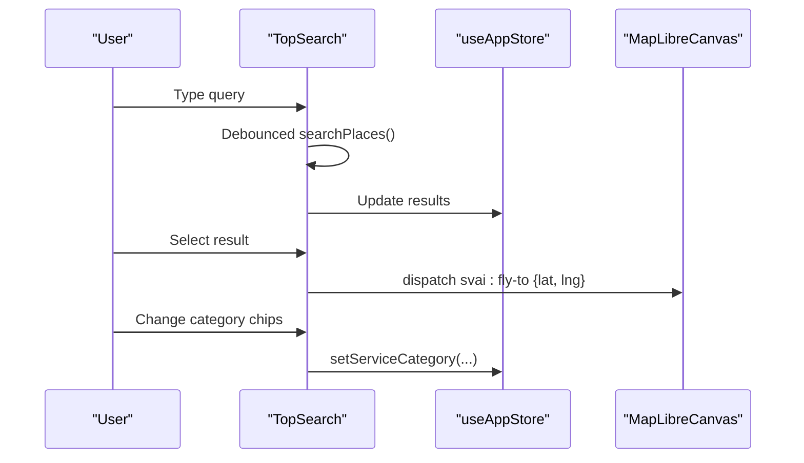

**Diagram sources**
- [TopSearch.tsx:73-85](file://frontend/components/dashboard/TopSearch.tsx#L73-L85)
- [TopSearch.tsx:248-270](file://frontend/components/dashboard/TopSearch.tsx#L248-L270)

**Section sources**
- [TopSearch.tsx:1-280](file://frontend/components/dashboard/TopSearch.tsx#L1-L280)

## Dependency Analysis
- Centralized state: All components depend on useAppStore for GPS, nearby data, UI flags, and connectivity.
- Cross-component events: Custom events (svai:refresh-location, svai:fly-to) decouple UI from data fetching and map navigation.
- Rendering dependencies: MapBackgroundInner depends on MapLibreCanvas; ThreeDrivingScore depends on @react-three/fiber.

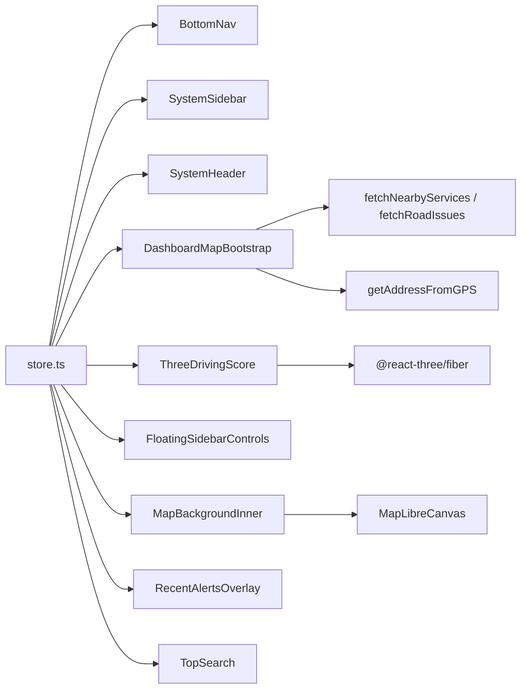

**Diagram sources**
- [store.ts:1-226](file://frontend/lib/store.ts#L1-L226)
- [BottomNav.tsx:1-103](file://frontend/components/dashboard/BottomNav.tsx#L1-L103)
- [SystemSidebar.tsx:1-209](file://frontend/components/dashboard/SystemSidebar.tsx#L1-L209)
- [SystemHeader.tsx:1-170](file://frontend/components/dashboard/SystemHeader.tsx#L1-L170)
- [DashboardMapBootstrap.tsx:1-330](file://frontend/components/dashboard/DashboardMapBootstrap.tsx#L1-L330)
- [ThreeDrivingScore.tsx:1-68](file://frontend/components/dashboard/ThreeDrivingScore.tsx#L1-L68)
- [FloatingSidebarControls.tsx:1-212](file://frontend/components/dashboard/FloatingSidebarControls.tsx#L1-L212)
- [MapBackgroundInner.tsx:1-169](file://frontend/components/dashboard/MapBackgroundInner.tsx#L1-L169)
- [RecentAlertsOverlay.tsx:1-100](file://frontend/components/dashboard/RecentAlertsOverlay.tsx#L1-L100)
- [TopSearch.tsx:1-280](file://frontend/components/dashboard/TopSearch.tsx#L1-L280)

**Section sources**
- [store.ts:1-226](file://frontend/lib/store.ts#L1-L226)
- [DashboardMapBootstrap.tsx:1-330](file://frontend/components/dashboard/DashboardMapBootstrap.tsx#L1-L330)
- [MapBackgroundInner.tsx:1-169](file://frontend/components/dashboard/MapBackgroundInner.tsx#L1-L169)
- [ThreeDrivingScore.tsx:1-68](file://frontend/components/dashboard/ThreeDrivingScore.tsx#L1-L68)

## Performance Considerations
- Real-time data updates
  - Debounce search queries to reduce API calls and re-renders.
  - Use Promise.allSettled to avoid blocking on failures; still update successfully resolved branches.
  - Cancel in-flight requests on unmount to prevent state writes after component disposal.
- Interactive map components
  - Memoize derived data (facilities, issues) to minimize re-renders.
  - Limit concurrent map updates; throttle fly-to and zoom events.
  - Prefer server-side caching for geocoding and road issues to reduce latency.
- 3D rendering
  - Keep @react-three/fiber scenes lightweight; reuse materials and geometries.
  - Avoid frequent re-creations of meshes inside loops; use refs and frame updates.
- Connectivity resilience
  - Maintain cached state when offline; gracefully degrade UI features.
  - Use connectivity state to decide whether to attempt network calls or serve cached data.

[No sources needed since this section provides general guidance]

## Troubleshooting Guide
- Navigation issues
  - Verify pathname-based active index computation in BottomNav and SystemSidebar.
  - Ensure Next.js Link hrefs match route paths.
- Location and map hydration
  - Confirm custom event listeners for svai:refresh-location and svai:fly-to are registered.
  - Check hydrationKey generation and cancellation logic to avoid stale writes.
- Store state drift
  - Validate persisted keys in Zustand persist middleware.
  - Ensure only intended slices are persisted to avoid bloated storage.
- 3D rendering glitches
  - Verify three.js version compatibility and material properties.
  - Confirm camera positioning and lighting setup align with scene scale.

**Section sources**
- [BottomNav.tsx:24-100](file://frontend/components/dashboard/BottomNav.tsx#L24-L100)
- [SystemSidebar.tsx:22-209](file://frontend/components/dashboard/SystemSidebar.tsx#L22-L209)
- [DashboardMapBootstrap.tsx:104-326](file://frontend/components/dashboard/DashboardMapBootstrap.tsx#L104-L326)
- [store.ts:211-225](file://frontend/lib/store.ts#L211-L225)
- [ThreeDrivingScore.tsx:50-67](file://frontend/components/dashboard/ThreeDrivingScore.tsx#L50-L67)

## Conclusion
The dashboard components form a cohesive system centered around a shared store and event-driven interactions. Navigation bars and sidebars provide intuitive access to map and emergency features, while DashboardMapBootstrap ensures robust hydration of nearby data. ThreeDrivingScore adds immersive feedback, and MapBackgroundInner delivers responsive map rendering. By adhering to the outlined patterns—debounced inputs, resilient hydration, memoized derivations, and controlled 3D rendering—the dashboard remains performant and user-friendly across devices.