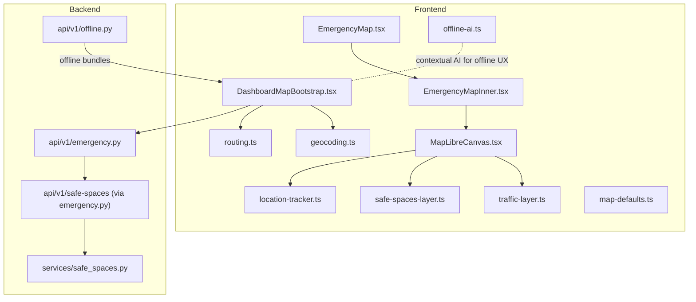
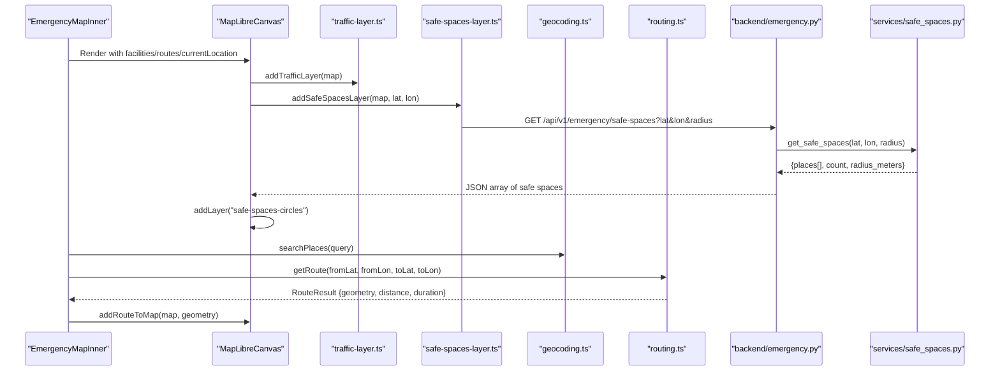
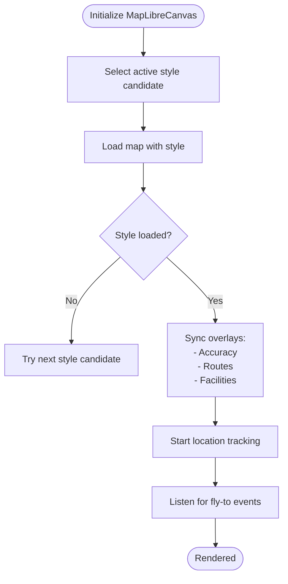
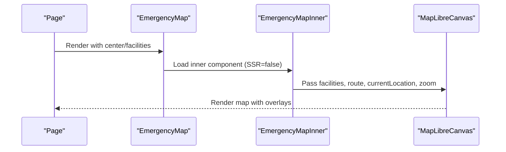
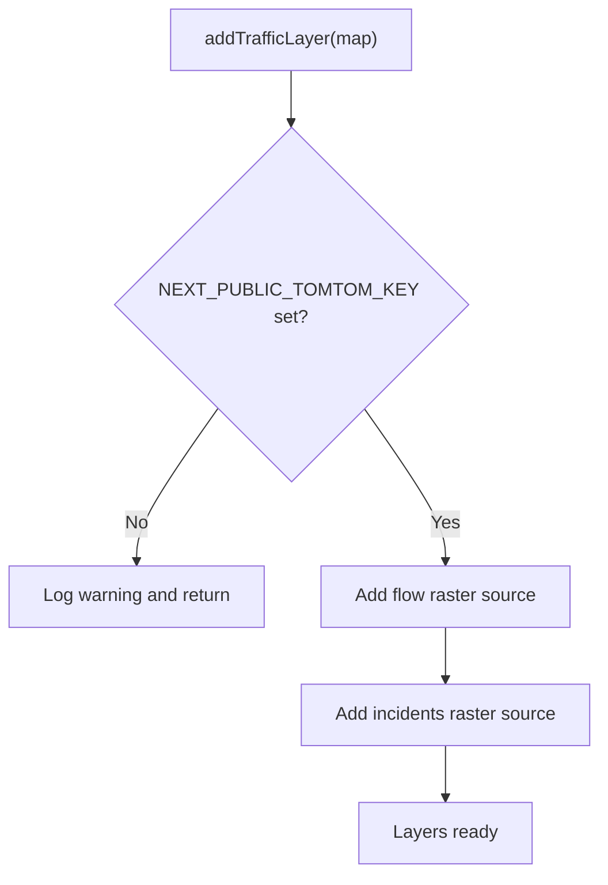
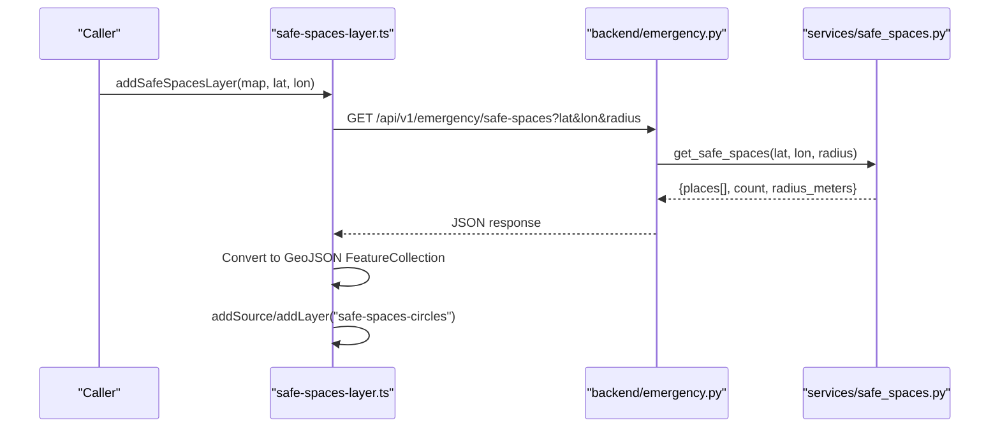
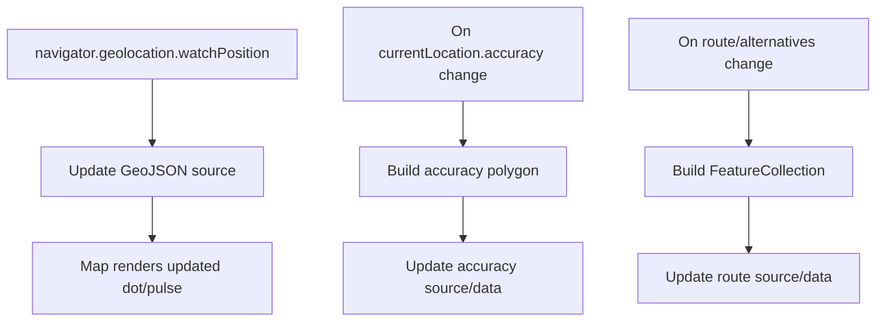
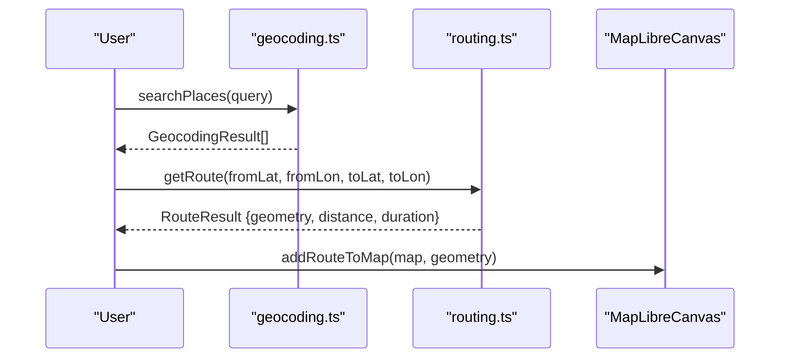
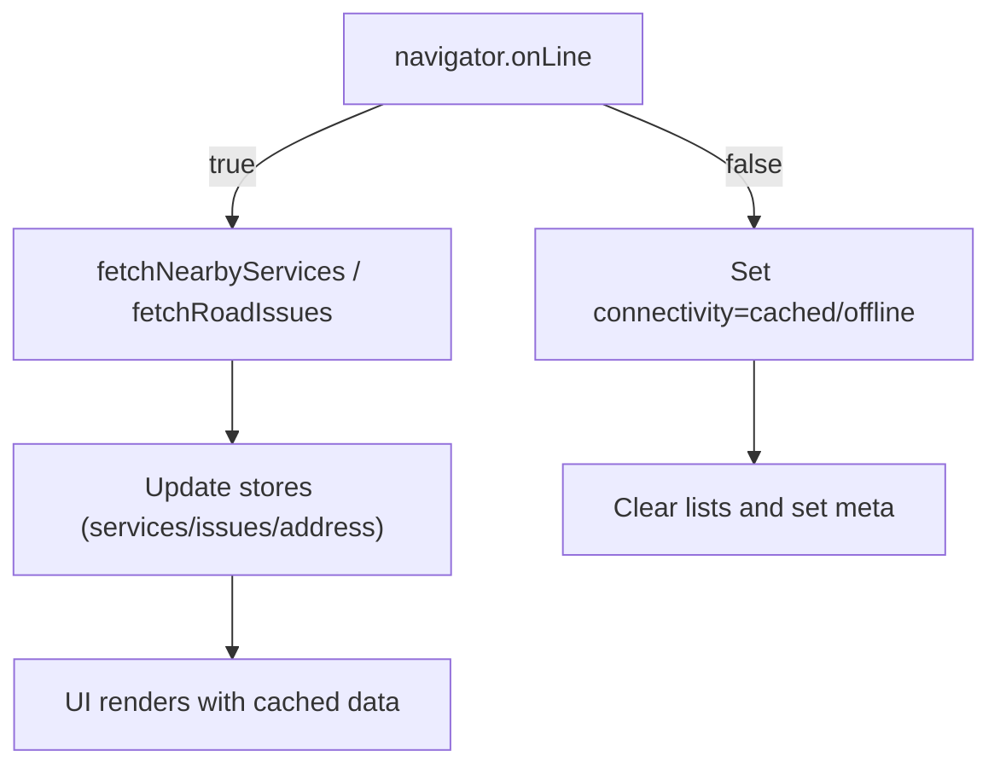
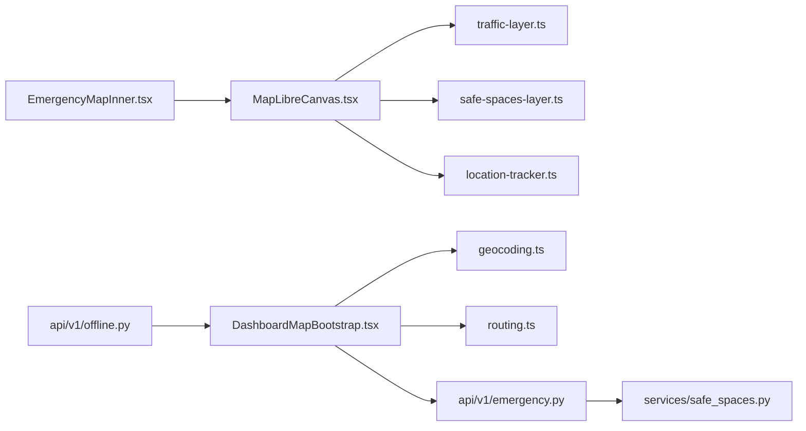

# Map Components

<cite>
**Referenced Files in This Document**
- [MapLibreCanvas.tsx](file://frontend/components/maps/MapLibreCanvas.tsx)
- [EmergencyMap.tsx](file://frontend/components/EmergencyMap.tsx)
- [EmergencyMapInner.tsx](file://frontend/components/EmergencyMapInner.tsx)
- [traffic-layer.ts](file://frontend/lib/traffic-layer.ts)
- [safe-spaces-layer.ts](file://frontend/lib/safe-spaces-layer.ts)
- [location-tracker.ts](file://frontend/lib/location-tracker.ts)
- [geocoding.ts](file://frontend/lib/geocoding.ts)
- [routing.ts](file://frontend/lib/routing.ts)
- [map-defaults.ts](file://frontend/lib/map-defaults.ts)
- [DashboardMapBootstrap.tsx](file://frontend/components/dashboard/DashboardMapBootstrap.tsx)
- [emergency.py](file://backend/api/v1/emergency.py)
- [safe_spaces.py](file://backend/services/safe_spaces.py)
- [offline.py](file://backend/api/v1/offline.py)
- [offline-ai.ts](file://frontend/lib/offline-ai.ts)
- [chennai.json](file://frontend/public/offline-data/chennai.json)
</cite>

## Table of Contents
1. [Introduction](#introduction)
2. [Project Structure](#project-structure)
3. [Core Components](#core-components)
4. [Architecture Overview](#architecture-overview)
5. [Detailed Component Analysis](#detailed-component-analysis)
6. [Dependency Analysis](#dependency-analysis)
7. [Performance Considerations](#performance-considerations)
8. [Troubleshooting Guide](#troubleshooting-guide)
9. [Conclusion](#conclusion)
10. [Appendices](#appendices)

## Introduction
This document explains the geospatial map subsystem powering SafeVixAI’s emergency and navigation experiences. It covers the MapLibre-based canvas, the EmergencyMap integration, specialized overlays such as traffic and safe spaces, and the real-time data patterns used for emergency services. It also documents coordinate systems, rendering optimizations, user location tracking, offline capabilities, and integrations with geocoding and routing APIs.

## Project Structure
The mapping stack spans the frontend React components and libraries, and the backend APIs/services that supply emergency data and offline bundles.

**Diagram sources**
- [EmergencyMap.tsx:1-58](file://frontend/components/EmergencyMap.tsx#L1-L58)
- [EmergencyMapInner.tsx:1-83](file://frontend/components/EmergencyMapInner.tsx#L1-L83)
- [MapLibreCanvas.tsx:1-1241](file://frontend/components/maps/MapLibreCanvas.tsx#L1-L1241)
- [traffic-layer.ts:1-50](file://frontend/lib/traffic-layer.ts#L1-L50)
- [safe-spaces-layer.ts:1-62](file://frontend/lib/safe-spaces-layer.ts#L1-L62)
- [location-tracker.ts:1-66](file://frontend/lib/location-tracker.ts#L1-L66)
- [geocoding.ts:1-84](file://frontend/lib/geocoding.ts#L1-L84)
- [routing.ts:1-143](file://frontend/lib/routing.ts#L1-L143)
- [DashboardMapBootstrap.tsx:1-330](file://frontend/components/dashboard/DashboardMapBootstrap.tsx#L1-L330)
- [offline-ai.ts:1-256](file://frontend/lib/offline-ai.ts#L1-L256)
- [map-defaults.ts:1-8](file://frontend/lib/map-defaults.ts#L1-L8)
- [emergency.py:1-83](file://backend/api/v1/emergency.py#L1-L83)
- [safe_spaces.py:1-96](file://backend/services/safe_spaces.py#L1-L96)
- [offline.py:1-27](file://backend/api/v1/offline.py#L1-L27)

**Section sources**
- [EmergencyMap.tsx:1-58](file://frontend/components/EmergencyMap.tsx#L1-L58)
- [EmergencyMapInner.tsx:1-83](file://frontend/components/EmergencyMapInner.tsx#L1-L83)
- [MapLibreCanvas.tsx:1-1241](file://frontend/components/maps/MapLibreCanvas.tsx#L1-L1241)
- [traffic-layer.ts:1-50](file://frontend/lib/traffic-layer.ts#L1-L50)
- [safe-spaces-layer.ts:1-62](file://frontend/lib/safe-spaces-layer.ts#L1-L62)
- [location-tracker.ts:1-66](file://frontend/lib/location-tracker.ts#L1-L66)
- [geocoding.ts:1-84](file://frontend/lib/geocoding.ts#L1-L84)
- [routing.ts:1-143](file://frontend/lib/routing.ts#L1-L143)
- [DashboardMapBootstrap.tsx:1-330](file://frontend/components/dashboard/DashboardMapBootstrap.tsx#L1-L330)
- [emergency.py:1-83](file://backend/api/v1/emergency.py#L1-L83)
- [safe_spaces.py:1-96](file://backend/services/safe_spaces.py#L1-L96)
- [offline.py:1-27](file://backend/api/v1/offline.py#L1-L27)
- [offline-ai.ts:1-256](file://frontend/lib/offline-ai.ts#L1-L256)
- [map-defaults.ts:1-8](file://frontend/lib/map-defaults.ts#L1-L8)
- [chennai.json:1-800](file://frontend/public/offline-data/chennai.json#L1-L800)

## Core Components
- MapLibreCanvas: The central React component that initializes MapLibre, manages styles, overlays, and user location. It supports fallback styles, traffic and safe-spaces overlays, route rendering, and accuracy circles.
- EmergencyMap and EmergencyMapInner: Thin wrappers that pass props to MapLibreCanvas and configure initial zoom and controls for emergency contexts.
- traffic-layer: Adds TomTom traffic flow and incidents overlays conditionally based on environment configuration.
- safe-spaces-layer: Fetches nearby safe public spaces (restaurants, cafes, pharmacies, hospitals, police, fire stations) and renders them as colored circles.
- location-tracker: Subscribes to browser geolocation and updates a moving dot and pulse ring on the map.
- geocoding: Photon-based search biased to India for place autocompletion.
- routing: OSRM-based directions for driving routes.
- DashboardMapBootstrap: Hydrates dashboard data (nearby services and road issues) and coordinates offline/cached modes.
- Backend emergency APIs: Serve nearby emergency services, SOS payload, emergency numbers, and safe spaces via Overpass.
- Offline bundles: City-specific JSON bundles for offline use.

**Section sources**
- [MapLibreCanvas.tsx:300-560](file://frontend/components/maps/MapLibreCanvas.tsx#L300-L560)
- [EmergencyMap.tsx:25-57](file://frontend/components/EmergencyMap.tsx#L25-L57)
- [EmergencyMapInner.tsx:44-82](file://frontend/components/EmergencyMapInner.tsx#L44-L82)
- [traffic-layer.ts:5-49](file://frontend/lib/traffic-layer.ts#L5-L49)
- [safe-spaces-layer.ts:14-61](file://frontend/lib/safe-spaces-layer.ts#L14-L61)
- [location-tracker.ts:8-65](file://frontend/lib/location-tracker.ts#L8-L65)
- [geocoding.ts:30-83](file://frontend/lib/geocoding.ts#L30-L83)
- [routing.ts:31-142](file://frontend/lib/routing.ts#L31-L142)
- [DashboardMapBootstrap.tsx:77-326](file://frontend/components/dashboard/DashboardMapBootstrap.tsx#L77-L326)
- [emergency.py:19-82](file://backend/api/v1/emergency.py#L19-L82)
- [safe_spaces.py:22-95](file://backend/services/safe_spaces.py#L22-L95)
- [offline.py:18-26](file://backend/api/v1/offline.py#L18-L26)

## Architecture Overview
The mapping architecture integrates frontend overlays with backend services and offline data. The frontend requests emergency services and safe spaces, while the backend queries databases and Overpass, with graceful fallbacks. Traffic overlays require external keys, and safe spaces rely on OSM queries.

**Diagram sources**
- [EmergencyMapInner.tsx:44-82](file://frontend/components/EmergencyMapInner.tsx#L44-L82)
- [MapLibreCanvas.tsx:300-560](file://frontend/components/maps/MapLibreCanvas.tsx#L300-L560)
- [traffic-layer.ts:5-49](file://frontend/lib/traffic-layer.ts#L5-L49)
- [safe-spaces-layer.ts:14-61](file://frontend/lib/safe-spaces-layer.ts#L14-L61)
- [geocoding.ts:30-83](file://frontend/lib/geocoding.ts#L30-L83)
- [routing.ts:31-142](file://frontend/lib/routing.ts#L31-L142)
- [emergency.py:78-82](file://backend/api/v1/emergency.py#L78-L82)
- [safe_spaces.py:22-95](file://backend/services/safe_spaces.py#L22-L95)

## Detailed Component Analysis

### MapLibreCanvas Integration
- Style fallback chain: Attempts MapTiler raster, then vector, then OpenFreeMap Liberty if previous fails or times out.
- Overlay lifecycle:
  - Accuracy circle: builds a polygon feature from current location accuracy and updates a GeoJSON source.
  - Routes: constructs a FeatureCollection of primary and alternative routes and adds styled line layers.
  - Facilities: converts incoming facilities to GeoJSON points and sets popup content.
- User location tracking: starts a geolocation watcher and updates a GeoJSON source for the dot and pulse ring.
- Real-time events: listens for a custom “fly-to” event to animate the map camera.

**Diagram sources**
- [MapLibreCanvas.tsx:396-540](file://frontend/components/maps/MapLibreCanvas.tsx#L396-L540)
- [MapLibreCanvas.tsx:561-800](file://frontend/components/maps/MapLibreCanvas.tsx#L561-L800)
- [location-tracker.ts:8-65](file://frontend/lib/location-tracker.ts#L8-L65)

**Section sources**
- [MapLibreCanvas.tsx:300-560](file://frontend/components/maps/MapLibreCanvas.tsx#L300-L560)
- [MapLibreCanvas.tsx:561-800](file://frontend/components/maps/MapLibreCanvas.tsx#L561-L800)
- [location-tracker.ts:8-65](file://frontend/lib/location-tracker.ts#L8-L65)

### EmergencyMap Implementation
- EmergencyMap is a dynamic import wrapper to avoid SSR issues.
- EmergencyMapInner maps facility props to MapLibreCanvas and sets viewport mode and navigation position for emergency use.

**Diagram sources**
- [EmergencyMap.tsx:9-23](file://frontend/components/EmergencyMap.tsx#L9-L23)
- [EmergencyMapInner.tsx:44-82](file://frontend/components/EmergencyMapInner.tsx#L44-L82)
- [MapLibreCanvas.tsx:300-560](file://frontend/components/maps/MapLibreCanvas.tsx#L300-L560)

**Section sources**
- [EmergencyMap.tsx:25-57](file://frontend/components/EmergencyMap.tsx#L25-L57)
- [EmergencyMapInner.tsx:44-82](file://frontend/components/EmergencyMapInner.tsx#L44-L82)

### Specialized Layers

#### Traffic Layer
- Conditionally enabled via environment variable.
- Adds two raster sources: flow and incidents.
- Provides a toggle function to show/hide both layers.

**Diagram sources**
- [traffic-layer.ts:5-49](file://frontend/lib/traffic-layer.ts#L5-L49)

**Section sources**
- [traffic-layer.ts:5-49](file://frontend/lib/traffic-layer.ts#L5-L49)

#### Safe-Spaces Layer
- Fetches nearby amenities/types around a lat/lon with a configurable radius.
- Renders as a circle layer with type-based colors.
- Updates GeoJSON source data when re-invoked.

**Diagram sources**
- [safe-spaces-layer.ts:14-61](file://frontend/lib/safe-spaces-layer.ts#L14-L61)
- [emergency.py:78-82](file://backend/api/v1/emergency.py#L78-L82)
- [safe_spaces.py:22-95](file://backend/services/safe_spaces.py#L22-L95)

**Section sources**
- [safe-spaces-layer.ts:14-61](file://frontend/lib/safe-spaces-layer.ts#L14-L61)
- [emergency.py:78-82](file://backend/api/v1/emergency.py#L78-L82)
- [safe_spaces.py:22-95](file://backend/services/safe_spaces.py#L22-L95)

### Coordinate Systems and Rendering Optimizations
- Coordinates:
  - MapLibre expects [longitude, latitude] tuples in GeoJSON and tile URLs.
  - Frontend utilities convert [lat, lon] to [lon, lat] when building GeoJSON geometries.
- Rendering:
  - Uses vector and raster fallback styles to minimize downtime.
  - Adds layers only when needed and updates data in-place to reduce allocations.
  - Uses interpolation for responsive dot sizes across zoom levels.

**Section sources**
- [MapLibreCanvas.tsx:70-97](file://frontend/components/maps/MapLibreCanvas.tsx#L70-L97)
- [MapLibreCanvas.tsx:583-618](file://frontend/components/maps/MapLibreCanvas.tsx#L583-L618)
- [MapLibreCanvas.tsx:38-68](file://frontend/components/maps/MapLibreCanvas.tsx#L38-L68)
- [location-tracker.ts:26-43](file://frontend/lib/location-tracker.ts#L26-L43)

### Real-Time Data Overlay Patterns
- User location: GeoJSON source updated on each geolocation watch event.
- Accuracy overlay: Builds a polygon from accuracy radius and updates the source.
- Routes: Constructs a FeatureCollection of alternative and primary routes and updates the source on change.
- Facilities: Converts facility arrays to GeoJSON and attaches popup content.

**Diagram sources**
- [location-tracker.ts:46-61](file://frontend/lib/location-tracker.ts#L46-L61)
- [MapLibreCanvas.tsx:567-629](file://frontend/components/maps/MapLibreCanvas.tsx#L567-L629)
- [MapLibreCanvas.tsx:652-799](file://frontend/components/maps/MapLibreCanvas.tsx#L652-L799)

**Section sources**
- [location-tracker.ts:8-65](file://frontend/lib/location-tracker.ts#L8-L65)
- [MapLibreCanvas.tsx:561-800](file://frontend/components/maps/MapLibreCanvas.tsx#L561-L800)

### Map Interactions, User Location Tracking, and Emergency Visualization
- Map interactions:
  - Navigation control placement and gesture preferences are configured during initialization.
  - Fly-to animation responds to a custom event to focus on a location.
- User location tracking:
  - High-accuracy watch with bounded age/timeout.
  - Visual feedback via a green dot and expanding pulse ring.
- Emergency visualization:
  - Facilities passed from parent components are rendered as clickable markers with popups.
  - Selected facility highlighting is supported via properties.

**Section sources**
- [MapLibreCanvas.tsx:497-540](file://frontend/components/maps/MapLibreCanvas.tsx#L497-L540)
- [MapLibreCanvas.tsx:632-644](file://frontend/components/maps/MapLibreCanvas.tsx#L632-L644)
- [location-tracker.ts:46-65](file://frontend/lib/location-tracker.ts#L46-L65)
- [EmergencyMapInner.tsx:44-82](file://frontend/components/EmergencyMapInner.tsx#L44-L82)

### Geocoding and Routing Integrations
- Geocoding:
  - Photon API with India bounding box bias.
  - Debounced search helper to reduce network calls.
- Routing:
  - OSRM public demo server for driving directions.
  - Returns GeoJSON geometry and formatted metrics for rendering.

**Diagram sources**
- [geocoding.ts:30-83](file://frontend/lib/geocoding.ts#L30-L83)
- [routing.ts:31-142](file://frontend/lib/routing.ts#L31-L142)
- [MapLibreCanvas.tsx:789-799](file://frontend/components/maps/MapLibreCanvas.tsx#L789-L799)

**Section sources**
- [geocoding.ts:30-83](file://frontend/lib/geocoding.ts#L30-L83)
- [routing.ts:31-142](file://frontend/lib/routing.ts#L31-L142)

### Offline Map Functionality and Caching Strategies
- Offline bundles:
  - Backend exposes an endpoint to generate city-specific bundles containing services.
  - Frontend hydrates dashboard data and switches to cached/offline modes when online state fails.
- Local caches:
  - Debounced geocoding search reduces repeated network calls.
  - Dashboard bootstrap tracks connectivity and updates search metadata accordingly.
- Offline AI:
  - Optional offline AI engine for conversational assistance when network is unavailable.

**Diagram sources**
- [DashboardMapBootstrap.tsx:104-158](file://frontend/components/dashboard/DashboardMapBootstrap.tsx#L104-L158)
- [DashboardMapBootstrap.tsx:171-300](file://frontend/components/dashboard/DashboardMapBootstrap.tsx#L171-L300)
- [offline.py:18-26](file://backend/api/v1/offline.py#L18-L26)
- [offline-ai.ts:124-154](file://frontend/lib/offline-ai.ts#L124-L154)

**Section sources**
- [DashboardMapBootstrap.tsx:77-326](file://frontend/components/dashboard/DashboardMapBootstrap.tsx#L77-L326)
- [offline.py:18-26](file://backend/api/v1/offline.py#L18-L26)
- [offline-ai.ts:124-154](file://frontend/lib/offline-ai.ts#L124-L154)
- [chennai.json:1-800](file://frontend/public/offline-data/chennai.json#L1-L800)

## Dependency Analysis
- Frontend-to-backend:
  - Map overlays call backend endpoints for safe spaces and nearby services.
  - Dashboard bootstrap coordinates offline bundles and cached data.
- External services:
  - TomTom for traffic overlays (optional).
  - Overpass API for safe spaces (with mirrors and fallback).
  - Photon for geocoding.
  - OSRM for routing.

**Diagram sources**
- [MapLibreCanvas.tsx:300-560](file://frontend/components/maps/MapLibreCanvas.tsx#L300-L560)
- [traffic-layer.ts:5-49](file://frontend/lib/traffic-layer.ts#L5-L49)
- [safe-spaces-layer.ts:14-61](file://frontend/lib/safe-spaces-layer.ts#L14-L61)
- [location-tracker.ts:8-65](file://frontend/lib/location-tracker.ts#L8-L65)
- [EmergencyMapInner.tsx:44-82](file://frontend/components/EmergencyMapInner.tsx#L44-L82)
- [DashboardMapBootstrap.tsx:77-326](file://frontend/components/dashboard/DashboardMapBootstrap.tsx#L77-L326)
- [geocoding.ts:30-83](file://frontend/lib/geocoding.ts#L30-L83)
- [routing.ts:31-142](file://frontend/lib/routing.ts#L31-L142)
- [emergency.py:19-82](file://backend/api/v1/emergency.py#L19-L82)
- [safe_spaces.py:22-95](file://backend/services/safe_spaces.py#L22-L95)
- [offline.py:18-26](file://backend/api/v1/offline.py#L18-L26)

**Section sources**
- [MapLibreCanvas.tsx:300-560](file://frontend/components/maps/MapLibreCanvas.tsx#L300-L560)
- [EmergencyMapInner.tsx:44-82](file://frontend/components/EmergencyMapInner.tsx#L44-L82)
- [DashboardMapBootstrap.tsx:77-326](file://frontend/components/dashboard/DashboardMapBootstrap.tsx#L77-L326)
- [emergency.py:19-82](file://backend/api/v1/emergency.py#L19-L82)
- [safe_spaces.py:22-95](file://backend/services/safe_spaces.py#L22-L95)
- [offline.py:18-26](file://backend/api/v1/offline.py#L18-L26)

## Performance Considerations
- Style fallback minimizes downtime by switching from raster to vector to OpenFreeMap.
- Conditional overlays (traffic) avoid unnecessary tile loads when keys are missing.
- In-place GeoJSON updates prevent recreating layers and sources repeatedly.
- Debounced geocoding reduces network churn.
- Offline bundles and cached data improve responsiveness in poor connectivity.

[No sources needed since this section provides general guidance]

## Troubleshooting Guide
- Map style errors:
  - The component detects MapTiler failures and switches styles automatically. If all fail, it reports an error state.
- Traffic layer disabled:
  - If the TomTom key is missing, traffic overlays are not added; verify environment configuration.
- Safe spaces unavailable:
  - Overpass API may rate-limit; the backend returns an empty list with a warning. Retry later or reduce radius.
- Geolocation issues:
  - High-accuracy watch with bounded timeouts; errors are logged and propagated via callbacks.
- Offline mode:
  - When offline, dashboard clears lists and sets connectivity to cached/offline; hydrate with offline bundles when available.

**Section sources**
- [MapLibreCanvas.tsx:441-474](file://frontend/components/maps/MapLibreCanvas.tsx#L441-L474)
- [traffic-layer.ts:6-9](file://frontend/lib/traffic-layer.ts#L6-L9)
- [safe_spaces.py:54-95](file://backend/services/safe_spaces.py#L54-L95)
- [location-tracker.ts:56-61](file://frontend/lib/location-tracker.ts#L56-L61)
- [DashboardMapBootstrap.tsx:104-158](file://frontend/components/dashboard/DashboardMapBootstrap.tsx#L104-L158)

## Conclusion
The mapping subsystem combines a robust MapLibre canvas with modular overlays, real-time user tracking, and backend-driven emergency data. It balances reliability with performance through style fallbacks, conditional overlays, and offline-first strategies. Integrations with geocoding and routing enable practical navigation and discovery experiences, while backend services provide resilient data sourcing and offline bundling.

[No sources needed since this section summarizes without analyzing specific files]

## Appendices

### API Definitions and Data Models

- Emergency endpoints
  - GET /api/v1/emergency/nearby: Returns nearby emergency services with pagination and radius.
  - GET /api/v1/emergency/sos: Builds an SOS payload and logs incidents.
  - GET /api/v1/emergency/numbers: Returns emergency contact numbers.
  - GET /api/v1/emergency/safe-spaces: Returns nearby safe public spaces.

- Safe spaces service
  - Queries Overpass API with multiple mirrors and returns places with tags and coordinates.

- Offline bundle endpoint
  - GET /api/v1/offline/bundle/{city}: Generates a city-specific offline bundle.

**Section sources**
- [emergency.py:19-82](file://backend/api/v1/emergency.py#L19-L82)
- [safe_spaces.py:22-95](file://backend/services/safe_spaces.py#L22-L95)
- [offline.py:18-26](file://backend/api/v1/offline.py#L18-L26)